#  express

## 基本使用

```js
//引入express
const express = require('express')

//创建应用对象

const app = express()

//创建路由规则
//request是对请求报文的封装
//response是对相应报文的封装
app.get('/server',(req,resp)=>{
  //设置响应头,允许跨域
  resp.setHeader('Access-Control-Allow-Origin','*')
  //设置响应体
  resp.send('Hello AJAX GET')
})

app.post('/server',(req,resp)=>{
  resp.setHeader('Access-Control-Allow-Origin','*')
  resp.send('Hello AJAX POST')
})

//可以接收任意类型的请求
app.all('/server',(req,resp)=>{
  resp.setHeader('Access-Control-Allow-Origin','*')
  //设置响应头,允许自定义
  resp.setHeader('Access-Control-Allow-Headers','*')
  resp.send('Hello AJAX POST')
})

app.listen(8000,()=>{
  console.log('服务已启动,8000端口监听中')
})
```

## JSON转字符串

```js
const express = require('express')
const app = express()
app.all('/json-server',(req,resp)=>{
  resp.setHeader('Access-Control-Allow-Origin','*')
  //响应一个数据
  const data = {
    name : 'wjj',
    height: '180',
    weight:100
  }
  let str = JSON.stringify(data)
  resp.send(str)
})

app.listen(8000,()=>{
  console.log('服务已启动,8000端口监听中')
})
```

# json-server

官网https://www.npmjs.com/package/json-server

## 使用流程

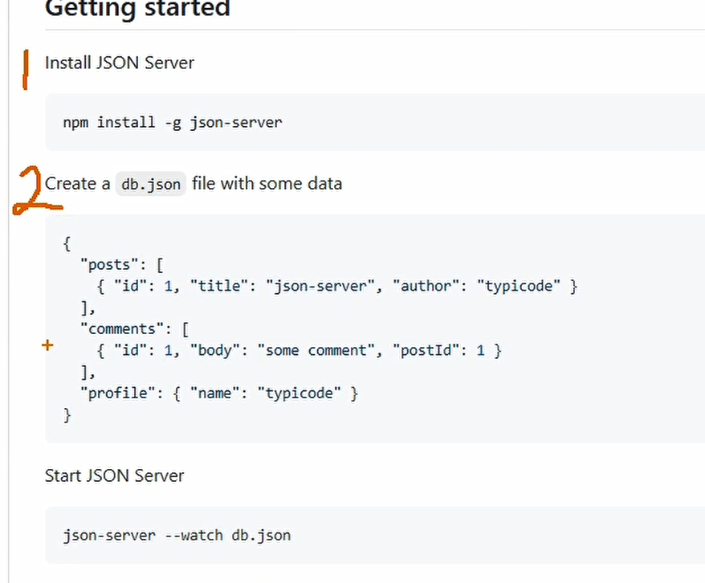

```json
{
  "posts": [
    { "id": 1, "title": "json-server", "author": "typicode" },
    { "id": 2, "title": "json-server2", "author": "typicode2" },
    { "id": 3, "title": "json-server3", "author": "typicode3" },
    { "id": 4, "title": "json-server4", "author": "typicode4" }
  ],
  "comments": [
    { "id": 1, "body": "some comment", "postId": 1 },
    { "id": 2, "body": "some comment2", "postId": 2 },
    { "id": 3, "body": "some comment3", "postId": 3 },
    { "id": 4, "body": "some comment4", "postId": 4 }
  ],
  "profile": { "name": "typicode" }
}
```

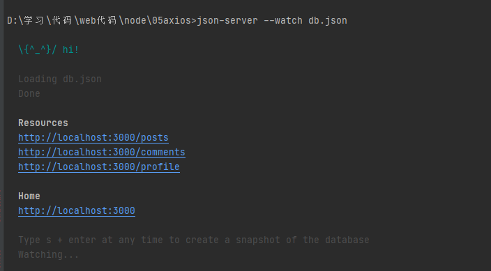

# AJAX

## AJAX的缺点

1.没有浏览历史，不能回退

2.存在跨域问题

3.seo不友好

## HTTP

### 请求报文

请求行      GET    /     URL    /   HTTP/1.1

请求头

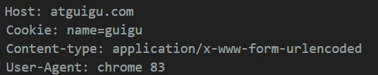

空行

请求体     如果GET请求，请求体是空的， 如果是POST请求，请求体可以不为空

### 响应报文

相应行    HTTP/1.1     200  OK

相应头    

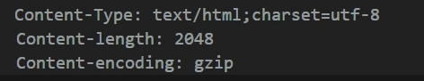

空行

响应体

...

## ajax的使用

### 基本流程GET

```js
btn.onclick = function(){
  console.log(1);
  //  1/创建对象
  const xhr = new XMLHttpRequest();
  //  2.初始化  设置请求方法和url

  //  如果GET请求要设置参数的话,先用?分割,然后a=100&....
  //  xhr.open('GET','http://127.0.0.1:8000/server?a=100&b=200')
  xhr.open('GET','http://127.0.0.1:8000/server')

  //  3.发送请求
  xhr.send()
  //  4.事件绑定  处理服务端返回的结果
  //  readystate是xhr对象中的属性,标识状态 0 1 2 3 4    4代表返回所有结果
  xhr.onreadystatechange = ()=>{
    //判断,服务端返回了所有的结果
    if(xhr.readyState === 4){
      //判断相应状态码  200  404 403 401 500
      //2xx都是成功的
      if(xhr.status >= 200 && xhr.status < 300){
      	//处理结果
        console.log(xhr.status) //状态码
        console.log(xhr.statusText); //状态字符串
        console.log(xhr.getAllResponseHeaders()); //所有响应头
        console.log(xhr.response); //响应体
        //设置res的文本,把获取的数据在res中显示
        res.innerHTML = xhr.response
      }
    }
  }

}
```

### 基本流程POST

```js
res.addEventListener("mouseover",()=>{
  const xhr = new XMLHttpRequest()

  xhr.open('POST','http://127.0.0.1:8000/server')
  //  设置请求头(在open之后)
  xhr.setRequestHeader('Content-Type','application/x-www-form-urlencoded')
  //设置自定义的请求头信息,需要在服务器端设置一下ACAH
  xhr.setRequestHeader('name','wjj')
  //  发送,post请求设置参数是在send中设置的
  xhr.send('a=100&b=200&c=300');
  xhr.onreadystatechange = ()=>{
    if(xhr.readyState == 4){
      if (xhr.status >= 200 && xhr.status < 300){
        res.innerHTML = xhr.response
      }
    }
  }
})
```

### 设置自定义请求头信息


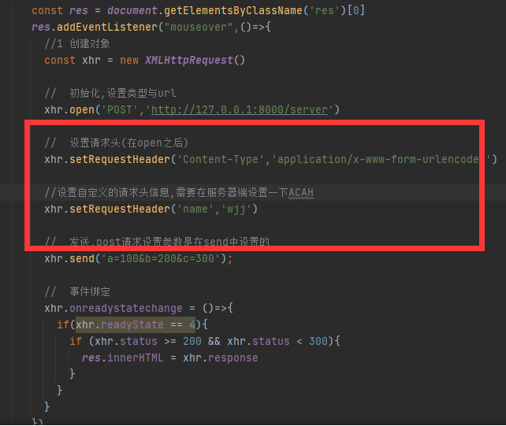

注意,设置自定义的请求头信息的时候,需要接收对应的OPTIONS请求,并且设置允许任何请求头信息

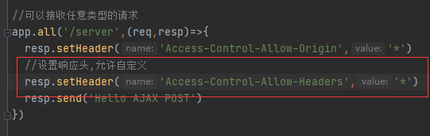

### 转换JSON格式

#### 手动转换

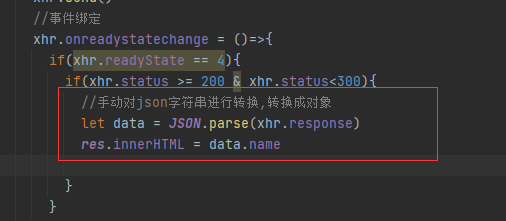

#### 自动转换

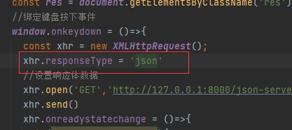

### 解决IE缓存问题

```js
btn.onclick = function(){
  //ie的话,如果发送了一次请求并且返回了数据,但是修改服务器之后重新发送请求的话,走的是缓存,不能及时的呈现最新结果
  //处理办法是在url后面加上一个时间戳,浏览器会认为不是新请求,就不会走缓存了
  const xhr = new XMLHttpRequest();
  xhr.open('GET','http://127.0.0.1:8000/ie?t='+Date.now())
  xhr.send()
  xhr.onreadystatechange = function(){
    if(xhr.readyState === 4){
      if(xhr.status >= 200 && xhr.status < 300){
        res.innerHTML = xhr.response
      }
    }
  }
}
```

### 超时与网络异常的处理

```js
btn.addEventListener('click',function (){
  const xhr = new XMLHttpRequest();
  //超时设置
  xhr.timeout = 2000
  // 设置超时后的回调函数
  xhr.ontimeout = ()=>{
    alert('网络异常,请求超时')
  }
  // 设置网络异常后的回调函数
  xhr.onerror = ()=>{
    alert('发生错误')
  }
  xhr.open('GET', 'http://127.0.0.1:8000/delay')
  xhr.send()
  xhr.onreadystatechange = ()=>{
    if (xhr.readyState == 4){
      if(xhr.status >= 200 && xhr.status<300){
        res.innerHTML = xhr.response
      }
    }
  }
})
```

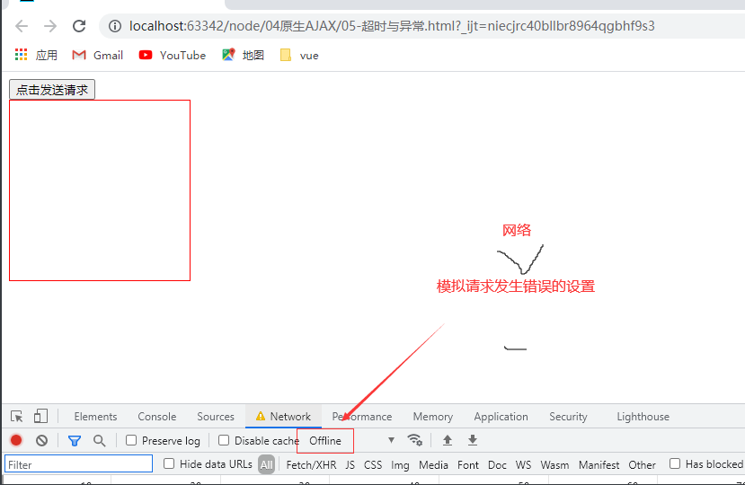

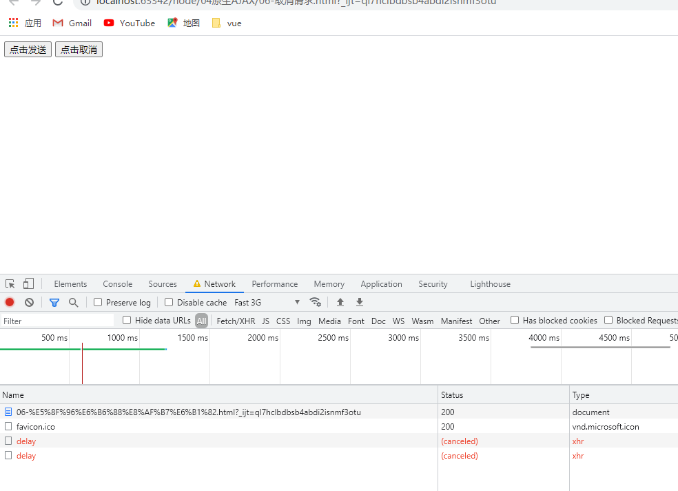

### 利用abort()来解决重复请求问题

```js
//标识是否正在发送ajax请求
let isSending = false;
btns[0].addEventListener('click',()=>{
  //先进行判断,如果正在发送请求,就取消请求,发送新的
  if(isSending) xhr.abort();
  //修改标识变量的值,正在发送ajax请求
  isSending = true
  xhr.open('GET','http://127.0.0.1:8000/delay')
  xhr.send()
  xhr.onreadystatechange = ()=>{
    if (xhr.readyState == 4){
      //请求结束了，修改标识变量
      isSending = false
      if(xhr.status >= 200 && xhr.status<300){
        res.innerHTML = xhr.response
      }
    }
  }
})
```

### fetch

```js
btns[3].onclick = ()=>{
  //fetch返回的也是promise，请求体的信息加在body中，如果要加params信息的话，在url路径后面手动加（这是麻烦的点）
  fetch('http://127.0.0.1:8000/fetch-server',{
    method:'POST',
    headers:{
      name:'wjj'
    },
    body:'username=admin&password:admin'
  }).then(res=>{
    //返回的res里有很多信息，log一下自己看
    return res.text();
  })
}
```


# axios

## 安装axios

npm install axios --save  (--save是运行时依赖)

cdn去bootcdn里搜，是国内的服务器，速度更快一些

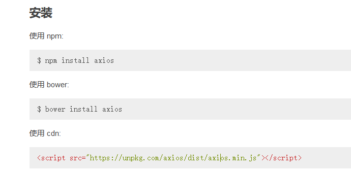

## 基本使用

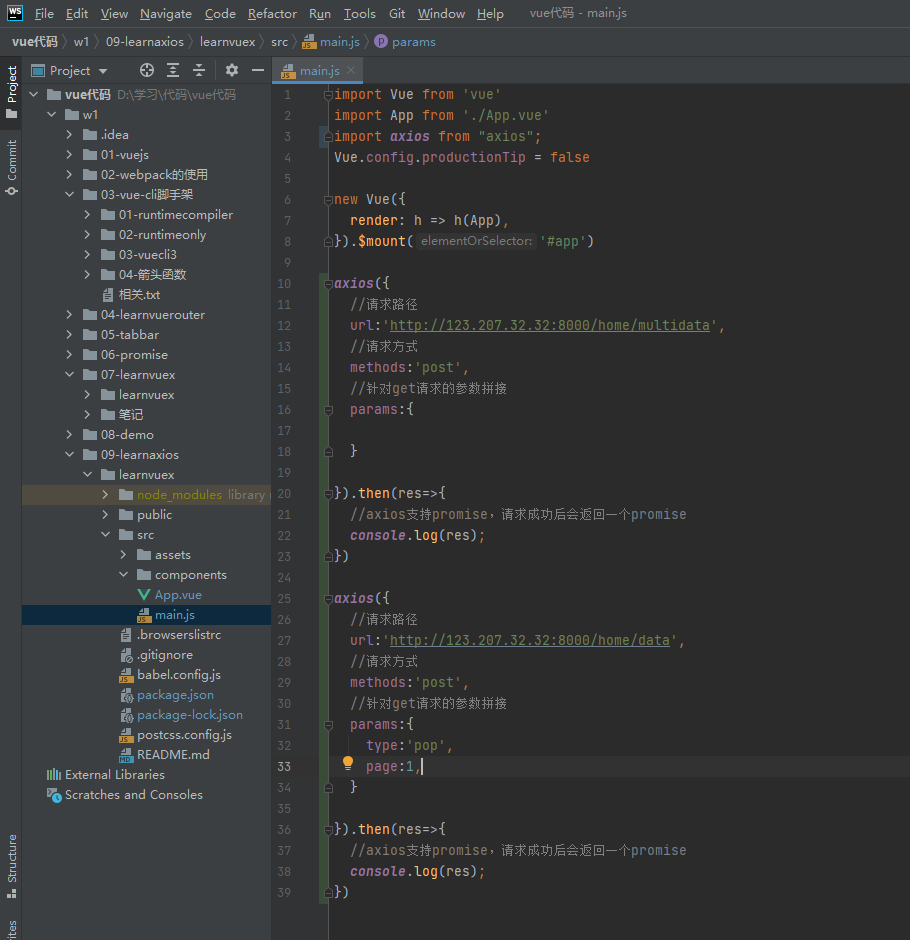

## 发送并发请求axios.all

```js
axios.all([axios({
  url:'http://123.207.32.32:8000/home/multidata',
}),axios({
  url:'http://123.207.32.32:8000/home/multidata',
})]).then(res=>{
  console.log(res);
})
```

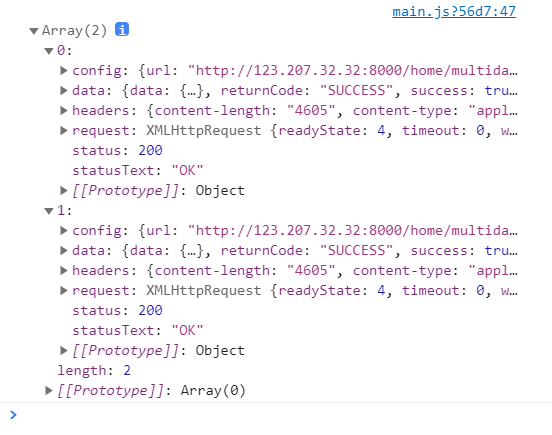

可以使用axios分割数组

```js
axios.all([axios({
  url:'http://123.207.32.32:8000/home/multidata',
}),axios({
  url:'http://123.207.32.32:8000/home/multidata',
})]).then(axios.spread((res1,res2)=>{
  console.log(res1)
  console.log(res2)
}))
```

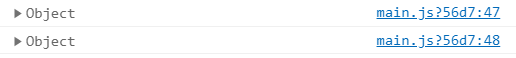

## 全局配置（公共）

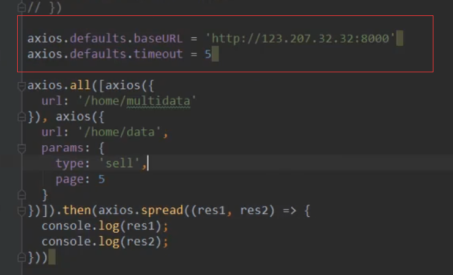

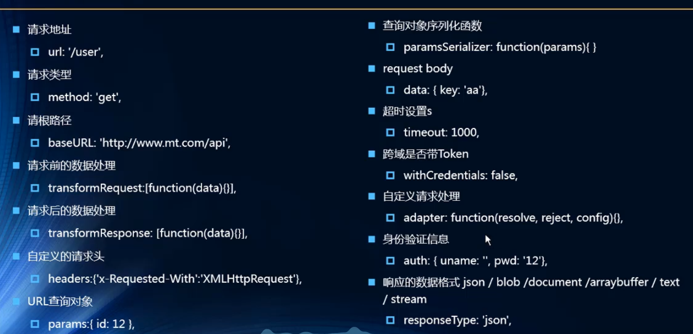

## axios实例

有时全局配置会导致部分请求达不到自己特定想要的效果（例如某个请求要请求的baseURL与全局配置的不符），这时候就要用到axios实例了

每个实例里定义属于自己实例的配置，较为灵活

```js
//创建实例
const instance1 = axios.create({
  baseURL:'http://123.207.32.32:8000',
  timeout:5000
})
//用axios实例来发送请求
instance1({
  url:'/home/multidata',
}).then(res =>{
  console.log(res + '------');
})
```

## 封装axios

如果发送网络请求是在每个vue组件里发送的话，如果有一天这个框架不适用了，那么修改起来会很。。。。

所以要封装一个网络请求，如下所示，在每种请求里创建自己的axios实例，请求的时候传入config对象，然后直接return instance(config)这个promise对象，在外面用then和catch来处理这个返回的promise就可以了

只能说老师的最终方案想的跟我一样！

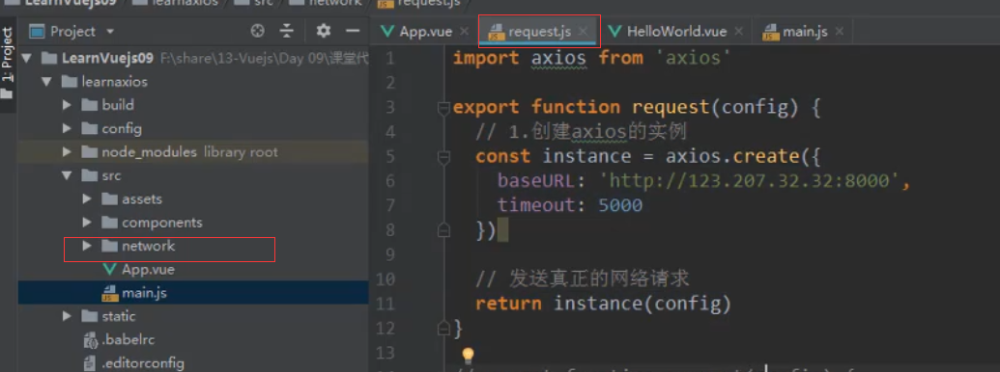

app.vue

```vue
<script>

import {request} from './network/require'

export default {
  name: 'app',
  components: {

  },
  created() {
    request({
      url:'/home/multidata'
    }).then(res=>{
      console.log(res + 'jzsp1');
    }).catch(err=>{
      console.log(err + 'jzsp2')
    })
  }
}
</script>
```

## axios拦截器

这个是写在axios实例中的

注意，use的两个参数都是函数，且第一个函数一定要有返回值，拦截成功后，如果不返回拦截的内容的话，就无法进行接下来的操作了。


响应拦截器：直接返回data内容，不处理其他的部分

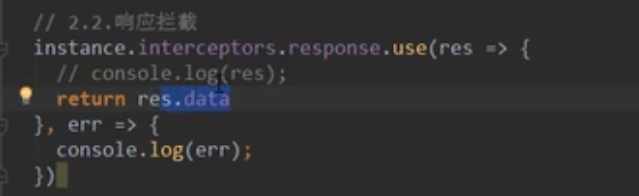

请求拦截器，可以在发送请求之前，做一些如下操作

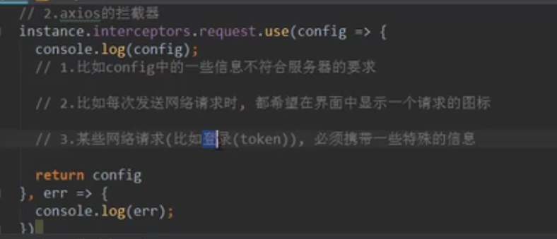

## axios取消请求以及处理重复请求问题

```js
const btns = document.querySelectorAll('button')
//2
let cancle = null;
btns[0].onclick = ()=>{
  if(cancle != null) cancle();
  axios({
    method:'GET',
    url:'http://localhost:3000/comments',
    //1、添加配置对象的属性
    cancelToken : new axios.CancelToken(c=>{
      //给cancle赋值，说明还没请求结束
      cancle = c;
    }),
    //json-server --watch db.json -d 2000    延迟2000ms响应
  }).then(res=>{
    //请求结束，重置cancle
    cancle = null;
    console.log('请求成功');
  })
}
btns[1].onclick = ()=>{
  console.log(cancle)
  //3
  cancle();
}
```

# axios源码讲解


# axios配置

```js
{
   // `url` 是用于请求的服务器 URL
  url: '/user',

  // `method` 是创建请求时使用的方法
  method: 'get', // default

  // `baseURL` 将自动加在 `url` 前面，除非 `url` 是一个绝对 URL。
  // 它可以通过设置一个 `baseURL` 便于为 axios 实例的方法传递相对 URL
  baseURL: 'https://some-domain.com/api/',

  // `transformRequest` 允许在向服务器发送前，修改请求数据
  // 只能用在 'PUT', 'POST' 和 'PATCH' 这几个请求方法
  // 后面数组中的函数必须返回一个字符串，或 ArrayBuffer，或 Stream
  transformRequest: [function (data, headers) {
    // 对 data 进行任意转换处理
    return data;
  }],

  // `transformResponse` 在传递给 then/catch 前，允许修改响应数据
  transformResponse: [function (data) {
    // 对 data 进行任意转换处理
    return data;
  }],

  // `headers` 是即将被发送的自定义请求头
  headers: {'X-Requested-With': 'XMLHttpRequest'},

  // `params` 是即将与请求一起发送的 URL 参数
  // 必须是一个无格式对象(plain object)或 URLSearchParams 对象
  params: {
    ID: 12345
  },

   // `paramsSerializer` 是一个负责 `params` 序列化的函数
  // (e.g. https://www.npmjs.com/package/qs, http://api.jquery.com/jquery.param/)
  paramsSerializer: function(params) {
    return Qs.stringify(params, {arrayFormat: 'brackets'})
  },

  // `data` 是作为请求主体被发送的数据
  // 只适用于这些请求方法 'PUT', 'POST', 和 'PATCH'
  // 在没有设置 `transformRequest` 时，必须是以下类型之一：
  // - string, plain object, ArrayBuffer, ArrayBufferView, URLSearchParams
  // - 浏览器专属：FormData, File, Blob
  // - Node 专属： Stream
  data: {
    firstName: 'Fred'
  },

  // `timeout` 指定请求超时的毫秒数(0 表示无超时时间)
  // 如果请求话费了超过 `timeout` 的时间，请求将被中断
  timeout: 1000,

   // `withCredentials` 表示跨域请求时是否需要使用凭证
  withCredentials: false, // default

  // `adapter` 允许自定义处理请求，以使测试更轻松
  // 返回一个 promise 并应用一个有效的响应 (查阅 [response docs](#response-api)).
  adapter: function (config) {
    /* ... */
  },

 // `auth` 表示应该使用 HTTP 基础验证，并提供凭据
  // 这将设置一个 `Authorization` 头，覆写掉现有的任意使用 `headers` 设置的自定义 `Authorization`头
  auth: {
    username: 'janedoe',
    password: 's00pers3cret'
  },

   // `responseType` 表示服务器响应的数据类型，可以是 'arraybuffer', 'blob', 'document', 'json', 'text', 'stream'
  responseType: 'json', // default

  // `responseEncoding` indicates encoding to use for decoding responses
  // Note: Ignored for `responseType` of 'stream' or client-side requests
  responseEncoding: 'utf8', // default

   // `xsrfCookieName` 是用作 xsrf token 的值的cookie的名称
  xsrfCookieName: 'XSRF-TOKEN', // default

  // `xsrfHeaderName` is the name of the http header that carries the xsrf token value
  xsrfHeaderName: 'X-XSRF-TOKEN', // default

   // `onUploadProgress` 允许为上传处理进度事件
  onUploadProgress: function (progressEvent) {
    // Do whatever you want with the native progress event
  },

  // `onDownloadProgress` 允许为下载处理进度事件
  onDownloadProgress: function (progressEvent) {
    // 对原生进度事件的处理
  },

   // `maxContentLength` 定义允许的响应内容的最大尺寸
  maxContentLength: 2000,

  // `validateStatus` 定义对于给定的HTTP 响应状态码是 resolve 或 reject  promise 。如果 `validateStatus` 返回 `true` (或者设置为 `null` 或 `undefined`)，promise 将被 resolve; 否则，promise 将被 rejecte
  validateStatus: function (status) {
    return status >= 200 && status < 300; // default
  },

  // `maxRedirects` 定义在 node.js 中 follow 的最大重定向数目
  // 如果设置为0，将不会 follow 任何重定向
  maxRedirects: 5, // default

  // `socketPath` defines a UNIX Socket to be used in node.js.
  // e.g. '/var/run/docker.sock' to send requests to the docker daemon.
  // Only either `socketPath` or `proxy` can be specified.
  // If both are specified, `socketPath` is used.
  socketPath: null, // default

  // `httpAgent` 和 `httpsAgent` 分别在 node.js 中用于定义在执行 http 和 https 时使用的自定义代理。允许像这样配置选项：
  // `keepAlive` 默认没有启用
  httpAgent: new http.Agent({ keepAlive: true }),
  httpsAgent: new https.Agent({ keepAlive: true }),

  // 'proxy' 定义代理服务器的主机名称和端口
  // `auth` 表示 HTTP 基础验证应当用于连接代理，并提供凭据
  // 这将会设置一个 `Proxy-Authorization` 头，覆写掉已有的通过使用 `header` 设置的自定义 `Proxy-Authorization` 头。
  proxy: {
    host: '127.0.0.1',
    port: 9000,
    auth: {
      username: 'mikeymike',
      password: 'rapunz3l'
    }
  },

  // `cancelToken` 指定用于取消请求的 cancel token
  // （查看后面的 Cancellation 这节了解更多）
  cancelToken: new CancelToken(function (cancel) {
  })
}
```

# 同源策略

同源策略是指：协议、域名、端口号 必须完全相同

违背同源策略就是跨域

## 解决GET请求跨域：JSONP

原理：script标签支持跨域访问

原本完整的js代码

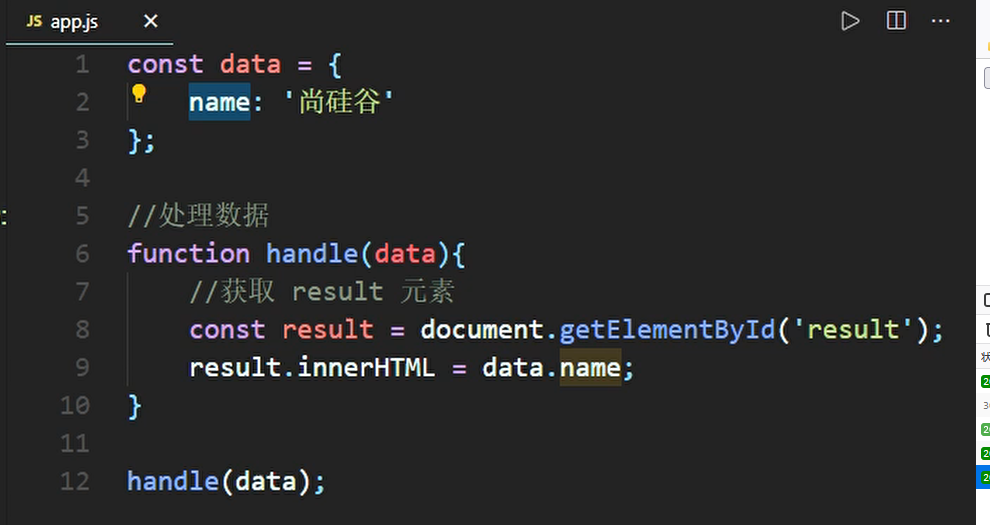

被抽离后

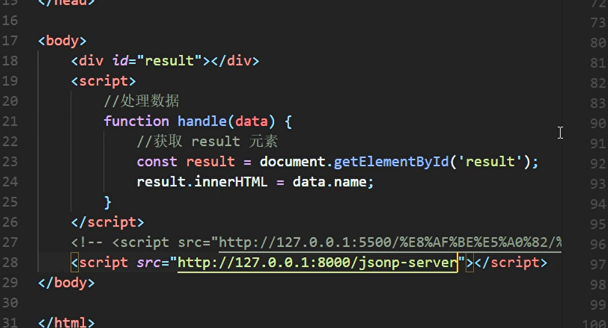

用end是因为不会加其他特殊响应头信息

jsonp的返回结果是一个函数调用，函数的实参就是   服务器想向客户端返回的结果数据，并且函数在前端必须提前声明，否则就会报错

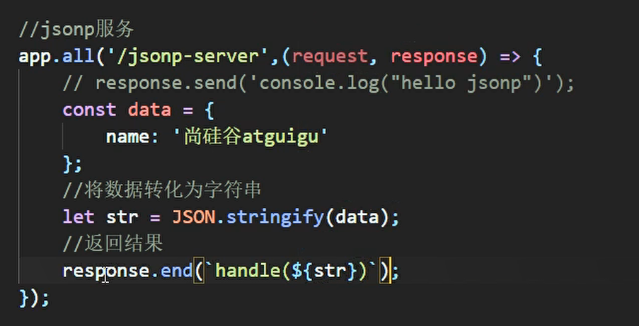

## CORS跨域资源共享（官方解决方案）

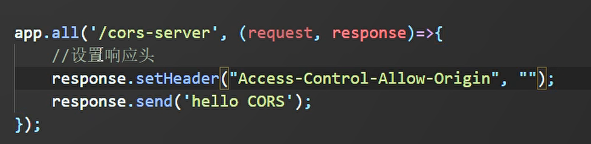


