# axios的get方法的参数类型

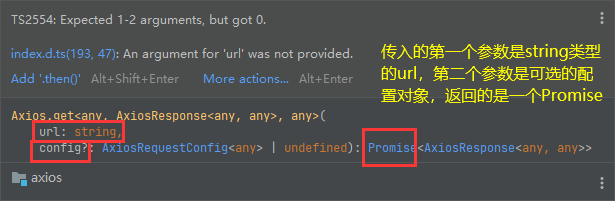

我们可以大概的看一下，AxiosRequestConfig的类型和Promise内部的类型（说明一下，例如config是可选类型，要传入的话，必须传入一个AxiosRequestConfig类型的参数，而这个类型本质上是一个接口，这就要求传入的参数需要实现这个接口里面的要求，当然接口里面也有很多可选类型，我们可以选择需要的内容来进行实现接口）

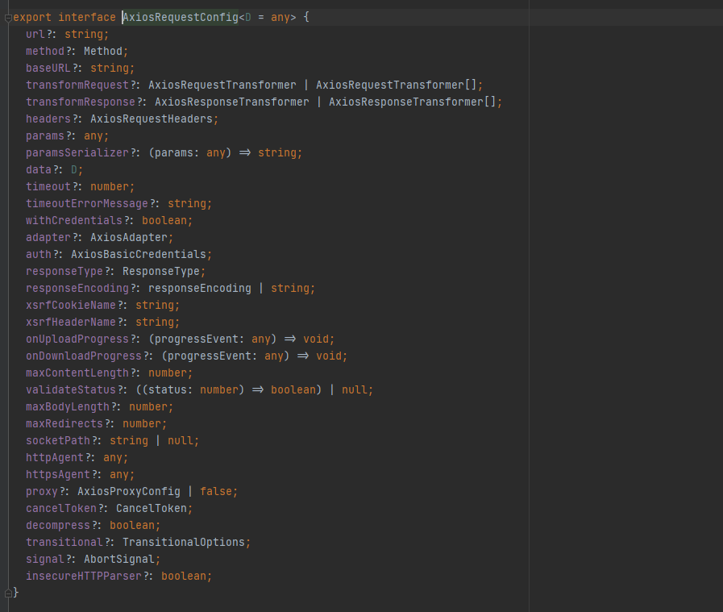

Promise是可以通过泛型来指定类型的，这里的promise通过泛型指定了返回的Promise的类型是AxiosResponse类型，也决定了then中res的类型，也就是说then方法的res参数，实现了AxiosResponse这个接口，有下面这些属性

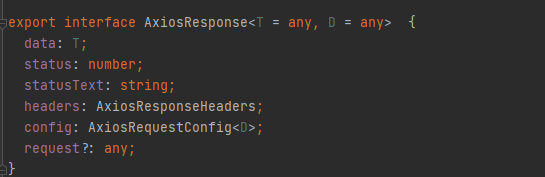

可以看到请求结束后输出的res确实是实现了AxiosResponse这个接口的对象

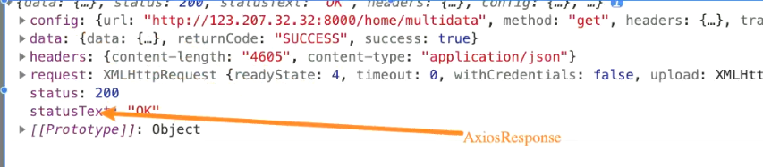

# get的基本使用

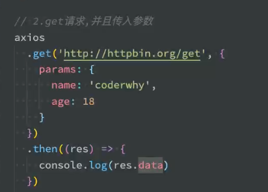

# post的基本使用

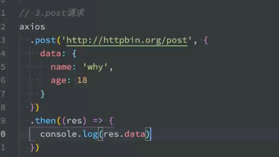

# axios的全局配置选项

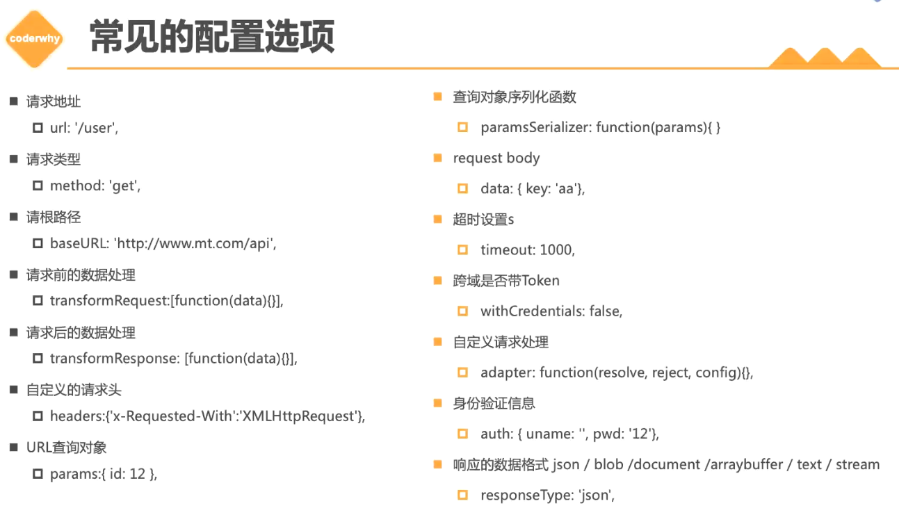

**axios的defaults属性**可以进行一些统一配置

我们先来看一下axios.defaults的类型

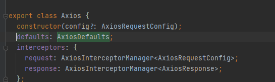

接口继承了`Omit<AxiosRequestConfig<D>,'headers'>`类型，这个类型说明是，创建一个**T中有但是不包括K的类型**，也就是说这个类型是不包括headers属性的，而继承的时候自己又拓展了headers类型为HeaderDefaults

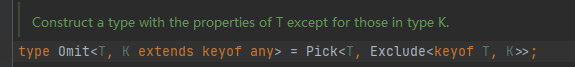

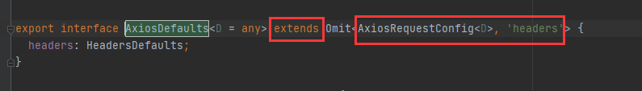

HeaderDefaults接口如下

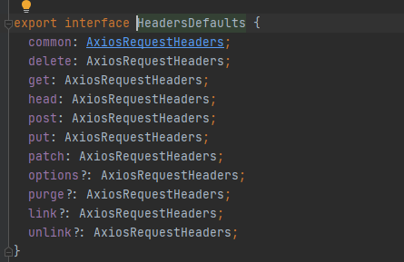

# axios.all（本质上就是Promise.all)

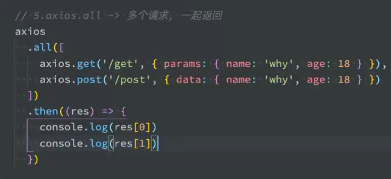

then中的res是AxiosResponse类型的数组


# axios实例

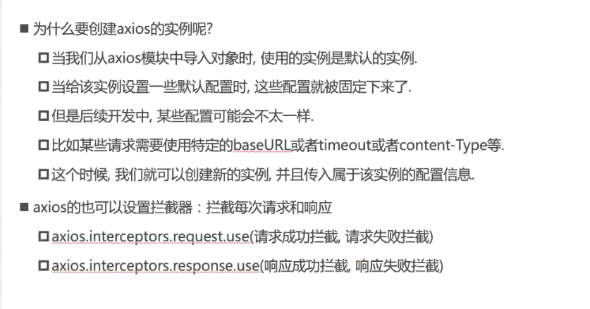

# axios拦截器

注意，拦截函数中是必须要return传入的参数的，不然东西拦截了不返回，那么请求也没用了

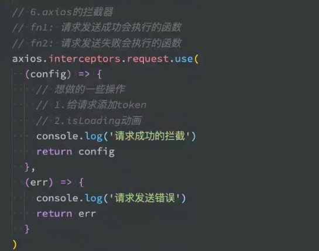

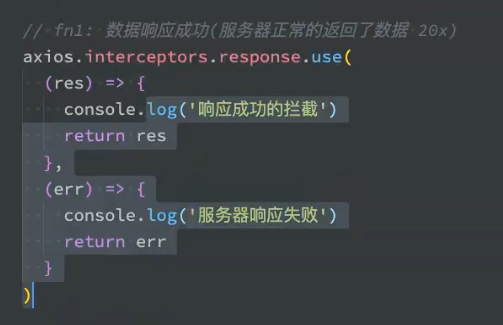

拦截器可以有下面几个作用

1：当请求需要token的时候，拦截请求检查有没有传入token

2：当请求时间很长时，渲染loading组件

# 在vue3中封装axios

## 基本结构

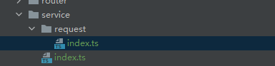

将逻辑封装在一个类中并且导出，之所以封装在类中，是提高可拓展性以及维护性，假如某一天axios失效了，而我们项目中用到的网络请求的代码都是跟这个类的实例有关，而不是在每个页面中自己编写，那么我们只需要修改这个类里面的逻辑即可。也可以拓展一些自己的逻辑

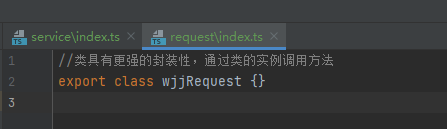

在service目录下的index.ts中进行逻辑的统一导出。这里先导入request中的类，然后导出这个类的实例对象，假如我们有一天需要像别的服务器请求数据，那么我们只需要在这里new一个新的实例，并且导出即可

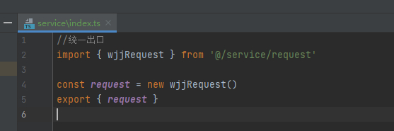

## 在类中保存不同的axios实例

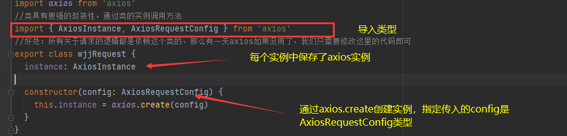

## 初步在类中定义request方法

因为axios的request方法要求传入AxiosRequestConfig类型的参数，所以我们要求我们定义的request方法也传入这个类型的参数

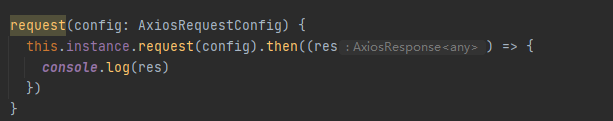

## 设置每个实例的拦截器

我们希望**在创建不同的类实例时传入的config对象可以多传入一个属性interceptor**，这个interceptor是一个对象，里面可以传入四个拦截器函数，但是很显然我们是不能这样的，因为AxiosRequestConfig类型是不允许我们这么做的，因为这个类型里面没有关于interceptor属性的定义

那么我们希望定义一个自定义的类型，和一个interceptor类型 

- 自定义类型应该继承自AxiosRequestConfig类型，并且自己拓展interceptor类型
- interceptor类型是一个接口，作为类型的时候要求传入的对象实现四个拦截器回调函数

首先看一下拦截器回调函数的类型，可以看到，请求拦截成功的回调函数的类型，它是一个函数类型，传入一个泛型，返回的是该泛型类型的值或者Promise，而这个泛型就是AxiosRequestConfig类型

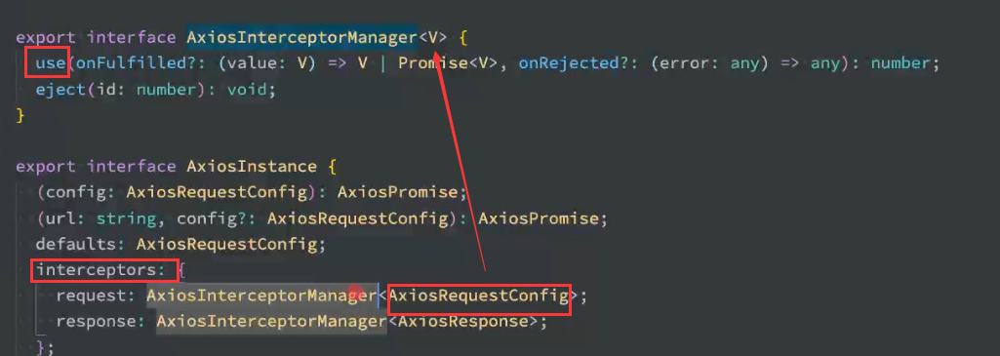


完事后将定义接口的代码抽离，在index.ts导入并且使用

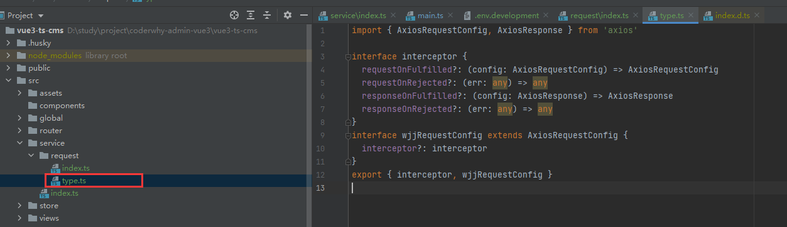

## 设置全局拦截器

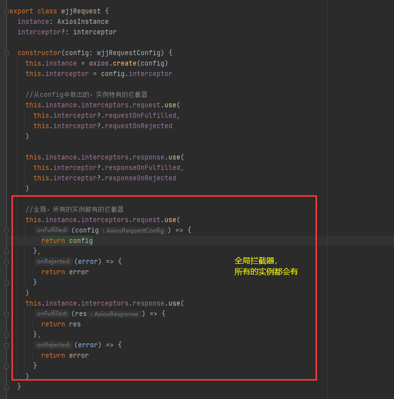

## 设置属于单次请求的拦截器

可以通过transformRequest这两个api来设置请求的拦截器

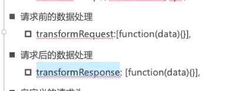

也可以通过传入request的config获取拦截的**onFulfilled回调函数**执行，并且将返回的config或者err重新赋值

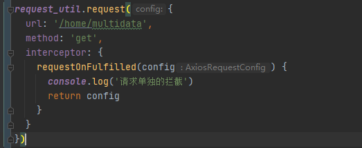

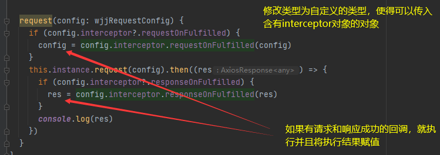

这里的代码逻辑是，在发送axios实例的request请求前，（如果有）执行传入的config中interceptor指定的回调函数，在请求结束的时候，在then中（如果有）执行config中interceptor指定的回调函数。在返回数据前会经过axios实例的响应拦截器的处理，**在响应拦截中返回的是res.data，那么在request中获取的res就是数据本身**

## （初步）拦截token、以及响应状态码

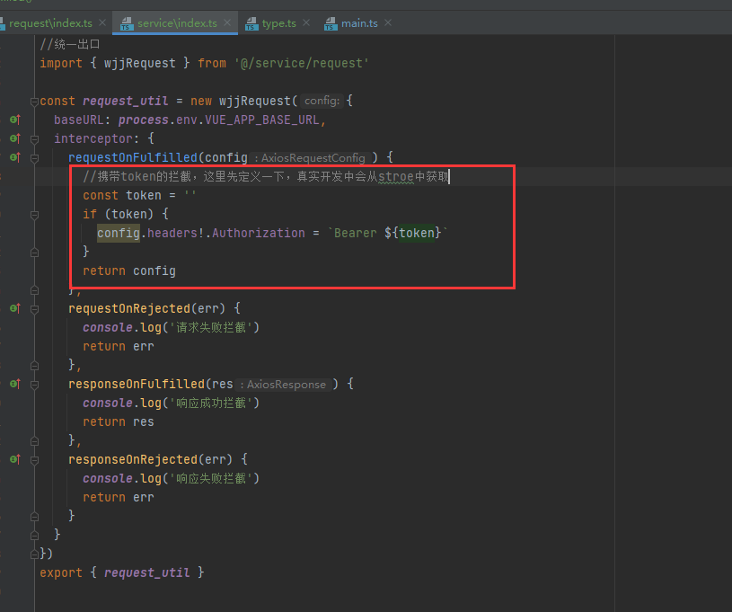

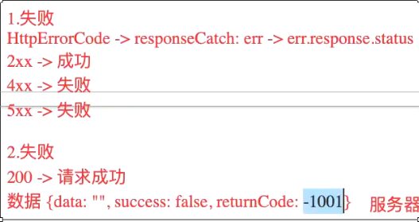

全局的响应拦截器中拦截了上面截图的两种情况（响应失败，以及响应成功但是返回的数据中的code显示失败）

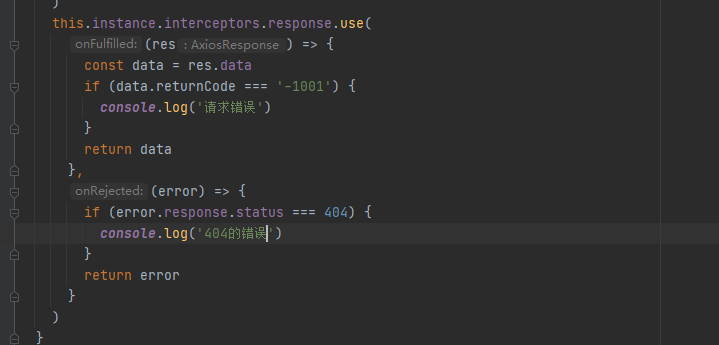

## Loading的显示和隐藏

我们通过ElementUI的loading组件的服务的方式来调用

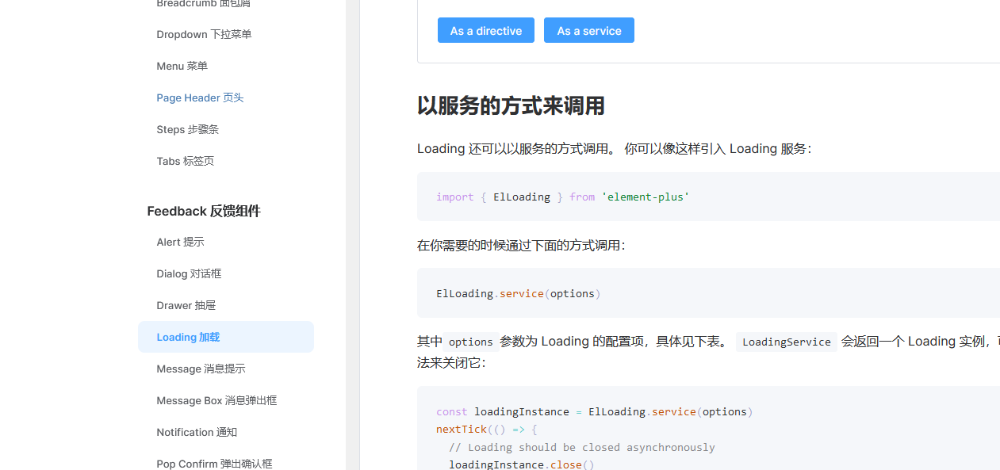

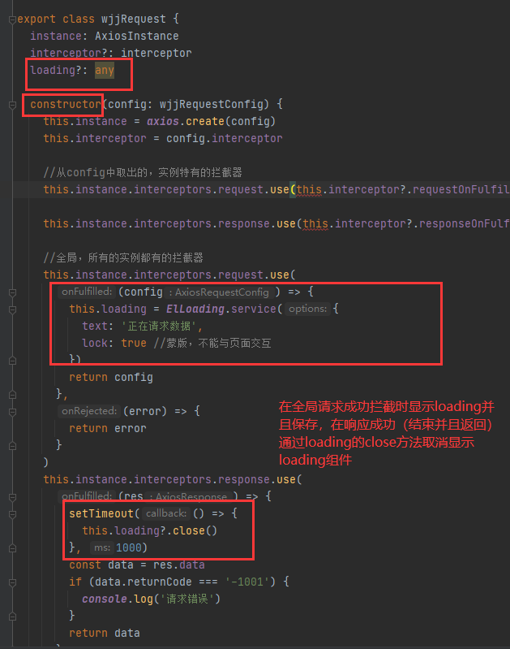

我们希望更加灵活，就是某个请求如果不希望显示loading的话，可以传入config来决定。

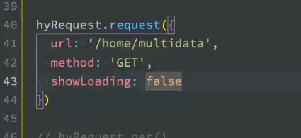

因为我们传入的config是自定义的类型，要想传入showLoading属性的话，需要添加类型

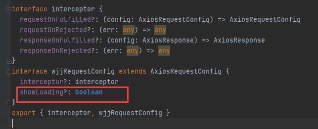

在实例中保存showLoading的值，默认是true

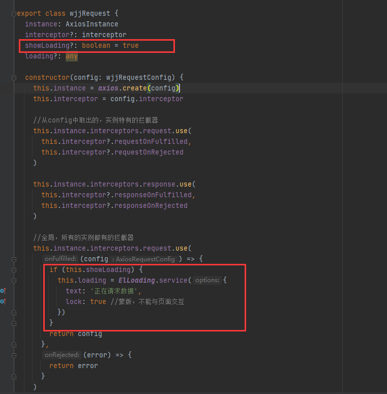

注意这里必须要在**请求结束的时候**将showLoading复位，不然的话会影响该axios实例的其他请求的loading显示情况

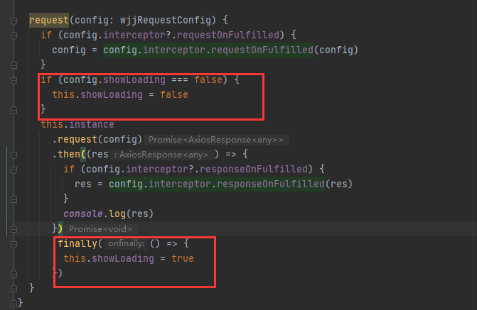

效果

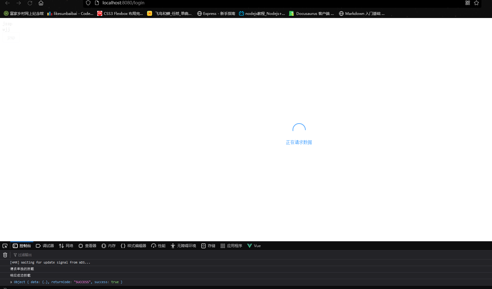

## 将request中的值通过promise返回

我们在原来的request函数的then方法中，也就是获取到数据的地方，只是做了个打印，并没有将这个数据返回出去。那么怎么使得在调用request函数的地方可以**获取到值**呢？这个时候我们就可以用**Promise**了，如下

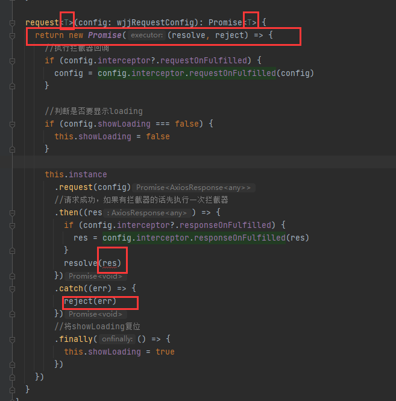

那么我们可以规定**request返回值的类型为Promise**，而这个**Promise的类型**可以根据用户使用request函数的时候传递进来的**泛型**来指定。但是有一个问题，我们指定了返回的Promise的类型为泛型，但是我们在resolve的时候，**res的类型是AxiosResponse类型**，我们点入**request的类型声明文件**可以发现，request函数返回的Promise的类型本质上是一个泛型，默认是AxiosResponse类型，那么我们就可以通过**指定request的泛型来改变res的类型**

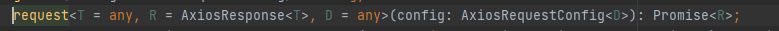

做了如下修改之后，resolve处不报错了，但是在执行请求特有的拦截器的时候出现了问题，因为此时的res已经不再是AxiosResponse类型了

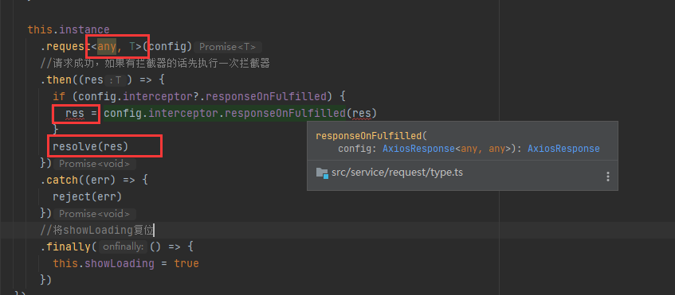

**我们先将类型声明的地方写成any，后面再作处理**

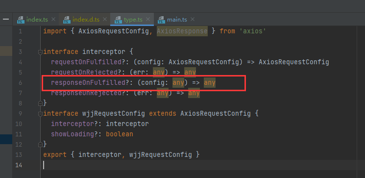

指定类型的好处就是，我们在使用的时候会有更**明确的提示**，代码也更加健壮（**类型应该根据接口的返回值类型来确定**）

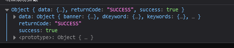

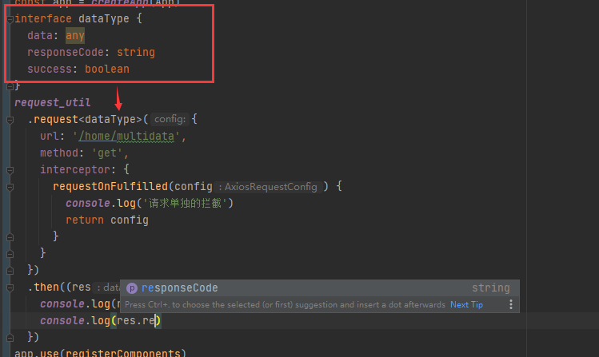

## 封装get、post、delete等函数

本质上其实就是调用request方法罢了（就好像Promise的其他方法本质上就是调用then方法的时机不同）


## 对拦截器中类型问题的调整

我们在封装promise的时候遗留了一个类型问题，我们给request函数指定了泛型之后，导致了Promise中的值的改变，相应的then方法中的res的值的类型也会改变。而我们在声明类型的地方，指定了responseOnFulfilled函数传入的类型就是AxiosResponse类型。显然我们现在不能这样，我们现在希望的是，**能通过泛型指定res的类型**

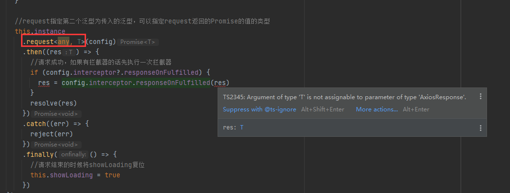

注意，泛型是不能给接口中的属性像给函数定义泛型那样定义的

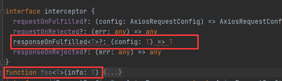

但是我们可以给接口定义泛型（这里设置了默认值，以至于不需要传入泛型的时候，达到第一次封装类型时的效果）

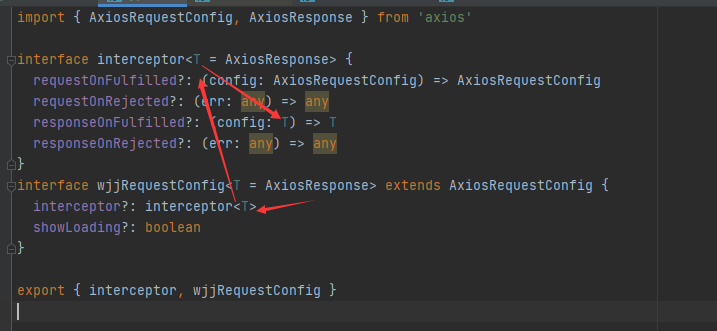

总体思路是这样的，如果需要修改`interceptor`中`responseOnFulfilled`函数的参数和返回值的类型，在使用`wjjRequestConfig`类型时传入泛型，否则就使用默认值达到原先的效果

这样的话就可以使得`res`的类型和`config.interceptor.responseOnFulfilled`函数参数的类型一致

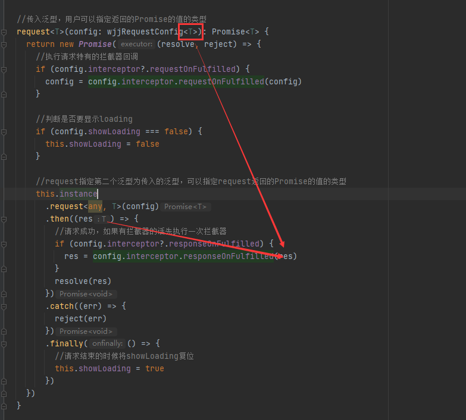

最后，get，post等函数也要修改（原因我也不是很懂。。。）

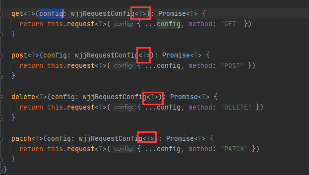

## 总体代码


```ts
//index.ts
import axios from 'axios'
import { ElLoading } from 'element-plus'

import { AxiosInstance } from 'axios'
import { wjjRequestConfig, interceptor } from '@/service/request/type'

export class wjjRequest {
  //保存axios实例
  instance: AxiosInstance
  //保存属于每个axios实例特有的拦截器函数
  interceptor?: interceptor
  //保存是否要显示loading
  showLoading?: boolean = true
  //保存loading实例，用于close关闭
  loading?: any

  constructor(config: wjjRequestConfig) {
    this.instance = axios.create(config)
    this.interceptor = config.interceptor

    //从config中取出的，实例特有的拦截器
    this.instance.interceptors.request.use(
      this.interceptor?.requestOnFulfilled,
      this.interceptor?.requestOnRejected
    )

    this.instance.interceptors.response.use(
      this.interceptor?.responseOnFulfilled,
      this.interceptor?.responseOnRejected
    )

    //全局，所有的实例都有的拦截器
    this.instance.interceptors.request.use(
      (config) => {
        //判断是否需要显示Loading
        if (this.showLoading) {
          this.loading = ElLoading.service({
            text: '正在请求数据',
            lock: true //蒙版，不能与页面交互
          })
        }
        return config
      },
      (error) => {
        return error
      }
    )
    this.instance.interceptors.response.use(
      (res) => {
        //设置延时关闭loading，防止屏幕一闪而过
        setTimeout(() => {
          this.loading?.close()
        }, 1000)

        const data = res.data
        if (data.returnCode === '-1001') {
          console.log('请求错误')
        }
        return data
      },
      (error) => {
        if (error.response.status === 404) {
          console.log('404的错误')
        }
        return error
      }
    )
  }

  //传入泛型，用户可以指定返回的Promise的值的类型
  request<T>(config: wjjRequestConfig): Promise<T> {
    return new Promise((resolve, reject) => {
      //执行请求特有的拦截器回调
      if (config.interceptor?.requestOnFulfilled) {
        config = config.interceptor.requestOnFulfilled(config)
      }

      //判断是否要显示loading
      if (config.showLoading === false) {
        this.showLoading = false
      }

      //request指定第二个泛型为传入的泛型，可以指定request返回的Promise的值的类型
      this.instance
        .request<any, T>(config)
        .then((res) => {
          //请求成功，如果有拦截器的话先执行一次拦截器
          if (config.interceptor?.responseOnFulfilled) {
            res = config.interceptor.responseOnFulfilled(res)
          }
          resolve(res)
        })
        .catch((err) => {
          reject(err)
        })
        .finally(() => {
          //请求结束的时候将showLoading复位
          this.showLoading = true
        })
    })
  }

  get<T>(config: wjjRequestConfig): Promise<T> {
    return this.request<T>({ ...config, method: 'GET' })
  }

  post<T>(config: wjjRequestConfig): Promise<T> {
    return this.request<T>({ ...config, method: 'POST' })
  }

  delete<T>(config: wjjRequestConfig): Promise<T> {
    return this.request<T>({ ...config, method: 'DELETE' })
  }

  patch<T>(config: wjjRequestConfig): Promise<T> {
    return this.request<T>({ ...config, method: 'PATCH' })
  }
}

```

```ts
//type.ts
import { AxiosRequestConfig, AxiosResponse } from 'axios'

interface interceptor {
  requestOnFulfilled?: (config: AxiosRequestConfig) => AxiosRequestConfig
  requestOnRejected?: (err: any) => any
  responseOnFulfilled?: (config: any) => any
  responseOnRejected?: (err: any) => any
}
interface wjjRequestConfig extends AxiosRequestConfig {
  interceptor?: interceptor
  showLoading?: boolean
}
export { interceptor, wjjRequestConfig }

```

