# ES6

## 短路运算符

**会输出最终决定运算真假的那个值**，||是true短路，&&是false短路

也就是说，||前面是false就取后面的，否则就取前面的

&&前面是true就取后面的，否则就取前面的

```js
let obj = {
    name:false
}
console.log(obj.name||obj)   //{ name: false }
```

```js
let obj = {
    name:false
}
//&&前面的值为真值，那么就输出后面的
console.log(obj && obj.name)   //false
```


## let

### 暂时性死区

es6明确规定，如果区块中存在let和const命令，则这个区块对这些命令声明的变量从一开始就形成**封闭作用域，只要在声明之前使用这些变量，就会报错**。也就是说，在代码块内，使用let声明变量前该变量都是不可用的（会报错，没有声明提前），这在语法上成为**暂时性死区**

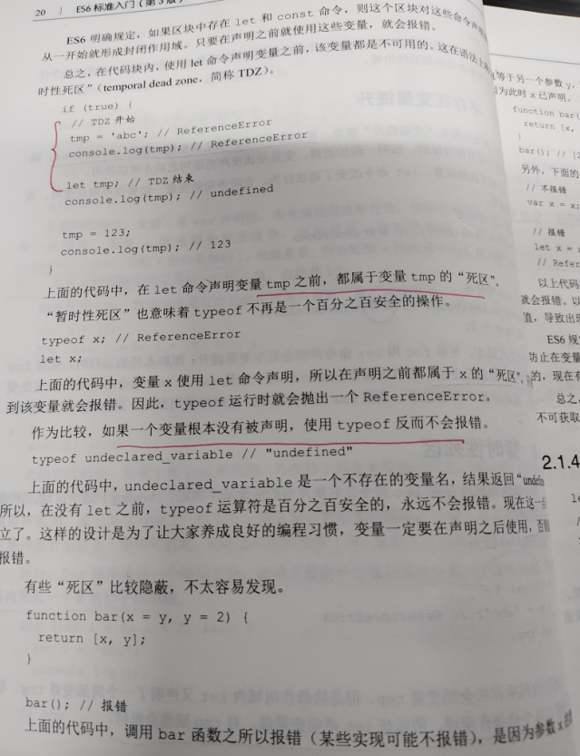

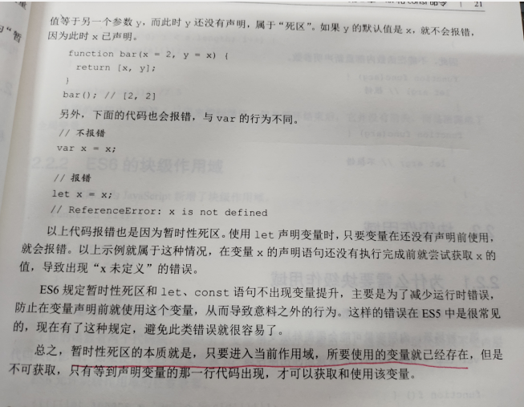

### let基本使用

let不允许在相同作用于内重复声明同一个变量，因此不能在函数内部重新用let声明参数

```js
<script>
  //声明变量，
  let a,b,c,d;

  //1、变量不能重复声明
  let star = '1'
  let star = '2'

  //2、块级作用域(if的，for的，普通的大括号内）
  {
    let a = 1
  }
  console.log(a);

  //3、不存在变量的声明提前,Uncaught ReferenceError: can't access lexical declaration 'song' before initialization
  console.log(song)
  let song = '1'

  //4、不影响作用域链,在当前作用域中找不到对应的值时，会向上一级作用域去查找
  {
    let school = 'wjj';
    function fn(){
      console.log(school)
    }
    fn()
  }

</script>
```

### 块级作用域

```js
var tmp = new Date()
function f(){
    console.log(tmp)
    if(false){
        var tmp = 'jzsp'
    }
}
f() //undefined
//以上代码的原本意思是，if代码块外的使用外层的tmp变量，内部使用内层的tmp变量，但是f执行后，输出是undefined，因为变量提升导致内层的tmp变量覆盖了外层的tmp变量
```


### let实践

```html
<!DOCTYPE html>
<html lang="en">
<head>
  <meta charset="UTF-8">
  <title>Title</title>
  <style>
    .item{
      border: 1px solid red;
      width: 200px;
      height: 100px;
      float: left;
      margin-left: 20px;
    }
  </style>
</head>
<body>
  <div class="container">
    <h2 class="page-header">点击切换颜色</h2>
    <div class="item"></div>
    <div class="item"></div>
    <div class="item"></div>
  </div>
  <script>
    let items = document.getElementsByClassName('item')
    for (var i = 0; i < items.length; i++) {
      items[i].onclick = function (){
        //修改背景颜色
        // this.style.background = 'pink'
        //首先会在函数作用域里去找，找不到的话就去外层找，但是var是全局变量，在循环结束后i变成了3，报错

        //解决办法是用let，因为let定义了一个块级变量，在for循环中使用let定义的变量，作用域只在for循环中

        //使用var声明的时候，i是全局变量，每次循环，i的值都会改变，相当于给i重新赋值了，因此最后输出后的i是for循环完后的i的值，因此输出结果都是3
        //使用let声明时，let作用的是块作用域，for的每次循环就是一个块级作用域，因此每次循环，就相当于声明了一个新的变量i。
        items[i].style.background = 'pink'
      }
    }
  </script>
</body>
</html>
```

## const

```js
<script>
  const name = 'wjj'

  //1、一定要赋初始值，因为值不能在后面修改
  const a;

  //2、一般常量使用大写（潜规则）
  const A = 100;

  //3、常量的值不能修改
  name = 'jzsp'

  //4、块级作用域
  {
    const player = 'uze'
  }
  console.log(player);

  //5、对于数组和对象类型的修改，不算做对常量的修改，不会报错，因为他们本质是保存的内存地址，只要内存地址不变即可
  //修改team的指向的话，就会报错
  const team = ['uzi','xiaohu']
  team.push('jzsp')
</script>
```

```js
//在for循环中是不能用const的，因为
for(const i = 0 ; i < 3 ; i++){
    
} 
//相当于是
{
    const i = 0 
}
{
    //复用了上面的i
    i++
}
{
    i++
}

//而在for..of中是可以用const的
let arr = [1,23,4]
for(const item of arr){
    
}
//相当于下面的代码，并不存在复用问题，只是单纯的在自己的块级作用域中声明罢了
{
    const item = 1
}
{
    const item = 2
}
{
    const item = 3
}


```


## 解构赋值

```js
 //数组解构
  const f4 = ['1','2','3','4'];
  let [a,b,c,d] = f4
  //可以只获取最后一个
  let [,,,last] = f4
  //解构出一个元素，剩余的参数放入新数组中
  let [first,...arr] = f4
  //解构的默认值
  let [a,b,c,d,e = 5] = f4
  console.log(a,b,c,d)
```

```js

  //对象解构,let定义的变量名要跟对象里的一致（没有顺序限制）
  //在后面对模块化统一暴露的文件导入的时候用到了对象解构
  const s = {
    name : 'wjj',
    age : 18,
    xiaopin : function (){
      console.log('jzsp');
    }
  }
  let{name,age,xiaopin} = s
  //默认值
  let { name = 'wjj'} = s
  console.log(name,age,xiaopin)
```


## 模板字符串以及${}

```js
//``模板字符串声明
//1、内容中可以直接出现换行符号
let str = `
1
2
3
`
console.log(str)

//2、变量拼接${}
let lovest = 'jzsp'
let out = `${lovest}jzsp2`
console.log(out)
```

## 标签模板字符串调用函数

```js
function foo(n,...args){
    console.log(n,args)
}
const name = 'wjj'
const age = 20
//[ 'Hell', 'oWo', 'rld' ] [ 'wjj', 20 ]
//用这种方式调用函数的话，函数的第一个参数是一个模板字符串数组（会被${}切割成多个数组元素）
//后面的参数依次是${}传入的参数（上面的例子中用...放入args中了）
foo`Hell${name}oWo${age}rld`
```

## 简化对象写法

```js
//可以直接放变量，对象中的属性名默认就是这个变量名
//声明函数也可以变得更方便，但是这个函数是function add(){}的简写而不是箭头函数的简写
//计算属性名[]
let name = 'wjj'
let age = 18
let me = {
  name,
  age,
  add(){
    console.log('jzsp')
  },
  [name+123]:'asdasd'
}
console.log(me);  //{ name: 'wjj', age: 18, add: [Function: add], wjj123: 'asdasd' }
```


## 箭头函数

箭头函数没有自身的this，没有arguments，没有prototype

### 基本使用

```js
  let fn = function (a,b){
    return a + b
  }
  //箭头函数
  let fn2 = (a,b)=>{
    return a + b
  }

  //1、this是静态的，this是始终指向函数声明时所在的作用域下的this的值，用call也不会改变
  function getname(){console.log(this.name)}
  let getname2 = ()=>{console.log(this.name)}   //此时的this指向window
  window.name = 'wjj'
  const school = {name : 'wjj2'}
  getname()    //wjj
  getname2()   //wjj

  getname.call(school)   //wjj2，this发生改变
  getname2.call(school)  //wjj，this始终没变


  //2、不能作为构造函数实例化对象
  //Person is not a constructor
  let Person = (name,age) =>{
    this.name = name;
    this.age = age;
  }
  let me = new Person('wjj',30)
  console.log(me)


  //3、不能使用arguments变量
  //arguments is not defined
  let a = ()=>{
    console.log(arguments)
  }
  a(123)

  //4、箭头函数的简写
  //当形参只有一个的时候，可以省略小括号
  //当代码提只有一行的时候，可以省略大括号（return必须省略,语句的执行结果就是函数的返回值）
  let add = n=>n+n
  console.log(add(1));

//5、如果一个箭头函数只有一行代码，并且返回一个对象
var bar = ()=>({name:"wjj",age:20})
```

### 箭头函数实践

```html
<!DOCTYPE html>
<html lang="en">
<head>
  <meta charset="UTF-8">
  <title>Title</title>
</head>
<body>
  <div class="id" style="width: 200px;height: 200px;border: 1px solid red "></div>
<script>
//1.this的指向
  let a = {
    name : 'wjj',
    getname: function (){
      console.log(this.name);
    }
  }
  a.getname() //wjj

  let ad = document.getElementsByClassName('id')[0]
  ad.addEventListener('click',function (){
    // 是ad绑定了这个click事件回调函数，所以this指向的是ad
    console.log(this)    //ad
    setTimeout(function (){
      //如果是function的话，没有对象调用它，this就是window

      //如果是箭头函数的话,会向外找作用域?????
      console.log(this)    //window
    },2000)
  })


//2.箭头函数的方便
  const arr = [1,2,3,4,5,6,7,8]
  const res = arr.filter(function (item){
    if(item%2===0) return true
    else return false
  })

  const res2 = arr.filter(item => item % 2===0)

  console.log(res)
  console.log(res2)

//  总结
//  箭头函数适合与this无关的 回调，定时器，数组的方法回调
//  箭头函数不适合与this有关的问题，dom中的事件回调


</script>
</body>
</html>
```

## 参数默认值

```js
  //潜规则,具有默认值的参数,一般位置要靠后放
  function add(a=20,b=10){
    console.log(a+b)
  }
  add(1,2)   //3
  add()    //30

//  与解构赋值结合，相当于是传入了一个对象进去，进行解构赋值给对应的形参
  function content({host='127.0.0.1',username,password,port}){
    console.log(host)
    console.log(username)
    console.log(password)
    console.log(port)
  }
  content({
    // host:'1',
    username:'12',
    password:'13',
    port:'14',
  })
```

## ...

### 当...用在形参中rest(剩余参数)

arguments和剩余参数的区别

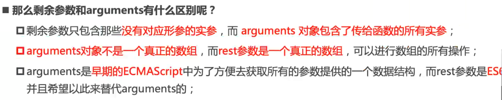

```js
//ES5获取实参的方式arguments,返回的是一个对象
function date(){
  console.log(arguments)
}
date(1,2,3,4,5,6,7)

//ES6  rest参数
function date2(...a){
  console.log(a)
}
date2(1,2,3,3,5,6,7)

//注意，...参数要放到最后,在有多个参数的时候
function date3(a,b,...c){
  console.log(a)
  console.log(b)
  console.log(c)
}
date3(1,2,3,4,5,6,7,8,9,0)
```

### 当...用在实参中spread（展开运算符）

```js
//rest是放在函数声明的形参中，而spread是放在函数调用时的实参中
//spread的作用是可以将数组转化成逗号分隔的参数序列
//使用场景:方法的实参
const nums = [1,2,3,4]
function add(...args){
  let sum = 0;
  for (let i = 0; i < args.length; i++) {
    sum+=args[i]
  }
  console.log(sum)
}
add(...nums)
```

## Symbol数据类型（唯一标识）

### 将Symbol添加到对象属性的方式

- 在对象字面量中用[]包裹作为key值
- `obj.[Symbol] = xxx`
- `Object.defineProperty(Obj,Symbol,Options)`

### 基本使用

```js
    //创建Symbol
    let s = Symbol();
    // console.log(s, typeof s);

    //此时的s2和s3是不一样的，===返回false
    let s2 = Symbol('尚硅谷');
    let s3 = Symbol('尚硅谷');

    //Symbol.for 创建
    let s4 = Symbol.for('尚硅谷');
    let s5 = Symbol.for('尚硅谷');
    //用for创建的是一样的
    console.log(s4 === s5)   //返回true

    //不能与其他数据进行运算
    //    let result = s + 100;
    //    let result = s > 100;
    //    let result = s + s;
```

### 使用场景

注意点：

1：Symbol 作为对象属性名时不能用.运算符，要用方括号

2：**不会出现在 for...in 、 for...of 的循环中,也不会被 `Object.keys()` 、 `Object.getOwnPropertyNames()` 返回。**如果要读取到一个对象的 Symbol 属性，可以通过 `Object.getOwnPropertySymbols()` 和 `Reflect.ownKeys()` 取到。

3：Symbol不需要new

> 因为symbol作为key不会被遍历到，深拷贝的时候要特殊处理

```js
//向对象中添加方法 up down  
// Symbol 作为对象属性名时不能用.运算符，要用方括号。因为.运算符后面是字符串，所以取到的是字符串 sy 属性，而不是 Symbol 值 sy 属性。

//第一种方法（推荐第三种  [sy],因为前两种没有把symbol存储起来，后面找不到)
//只有将Symbol存储起来，通过这个存储的东西才能找到响应的属性
  let sy = Symbol("key1");
  let youxi = {
    name:"狼人杀",
    //不能直接Symbol：，因为Symbol是一个表达式
    [Symbol('say')]: function(){
      console.log("我可以发言")
    },
    [Symbol('zibao')]: function(){
      console.log('我可以自爆');
    },
    [sy]:'wjj'
  }
  
  
  // console.log(youxi[Symbol("key1")]);    //找不到
  console.log(youxi[sy]);   //wjj

  //  不会出现在 for...in 、 for...of 的循环中，
  //  也不会被 Object.keys() 、 Object.getOwnPropertyNames() 返回。
  //  如果要读取到一个对象的 Symbol 属性，可以通过 Object.getOwnPropertySymbols() 和 Reflect.ownKeys() 取到。
 

//第二种方法
  let game = {
    name:'俄罗斯方块',
    up: function(){},
    down: function(){}
  };
  // 声明一个对象，存储对应的Symbol值
  let methods = {
      up: Symbol(),
      down: Symbol()
  };
  //这样的话，可以保证不覆盖原来game中的up和down方法
  game[methods.up] = function(){
      console.log("我可以改变形状");
  }
  game[methods.down] = function(){
      console.log("我可以快速下降!!");
  }
  //通过game[methods.up]找到对应的方法，然后()调用
  game[methods.up]()


```

### Symbol.for   Symbol.keyFor

Symbol.for用于创建相同的Symbol对象

```js
//通过这种形式创建Symbol对象的话，同样for的Symbol是同一个对象
const sa = Symbol.for("aaa")
const sb = Symbol.for("aaa")
console.log(sa == sb) //true

//获取for中的描述
console.log(Symbol.keyFor(sa)) //aaa
```


### symbol内置值

```js
  //symbol内置值

  // class Person{
  //     static [Symbol.hasInstance](param){
  //         console.log(param);
  //         console.log("我被用来检测类型了");
  //         return false;
  //     }
  // }

  // let o = {};

  // console.log(o instanceof Person);

  // const arr = [1,2,3];
  // const arr2 = [4,5,6];
  // arr2[Symbol.isConcatSpreadable] = false;
  // console.log(arr.concat(arr2));
```

## 迭代器for of

只有内部有Symbol.iterator的对象，才能for of

```js
const xiyou = [1,2,3,4]
//对对象进行for of循环时，会调用对象中的Symbol.iterator方法，返回该对象的默认遍历器

//for-of工作原理
//会先创建一个指针对象,指向当前数据结构的起始地址
//let iterator = xiyout[Symbol.iterator]() ------括号前面等号后面的代码是获取这个函数对象，然后用括号调用
//调用迭代器对象里的next方法,指针自动指向下一个数据的地址
//每次调用next方法返回一个包含value和done属性的对象，done表明是否结束


//调用方法，返回迭代器
let iterator = xiyou[Symbol.iterator]()
// console.log(iterator)
// console.log(iterator.next());


const banji = {
  name:['jzsp','jzsp2'],
  stud:['1','2','3','4','5'],
  //自定义迭代器遍历对象
  [Symbol.iterator](){
    let index = 0;
    return {
      // 迭代器函数要有一个返回的对象，对象里是next方法，其实就是next方法在进行遍历
      // next:()=> index<this.stud.length?{value:this.stud[index++],done:false}:{value:undefined,done:true}
      next: ()=>{
        if(index < this.name.length)
        {
          let res = {value:this.name[index],done:false}
          index++
          return res

        }
        else
          return {value:undefined,done:true}
      }
    }
  }
}
//因为我们自定义了返回的迭代器，forof的时候会返回这个迭代器，
//所以根据迭代器来遍历，而不是遍历整个banji这个对象
for (const b of banji) {
  console.log(b);
}

  const banji2 = {
    [Symbol('wjj')]:1,
    name:'wjj',
    arr:[1,2,3,4,5]
  }
  //只有实现了迭代器函数的，才能使用for of遍历，下面遍历banji2对象的话会报错
  for (const banji2Element of banji2.arr) {
    console.log(banji2Element);
  }
```

## 异步编程的解决方案（生成器和promise）

### 生成器函数

#### 基本使用

```js
//生成器其实就是一个特殊的函数
//解决异步编程  纯回调函数  node fs  ajax mongodb

//yield是函数代码的分隔符,next执行对应区间内的代码，也就是说，第一个next执行从大括号到yield之间的代码
function * gen(arg){
  console.log(arg);    //1
  let a = yield '一致没有眼睛';
  console.log(a);     //2
  let b = yield '一只没有尾部';
  console.log(b);    //3
  let c = yield '真奇怪';
  console.log(c);   //4

}

//生成器函数的返回值是一个迭代器对象，里面有next方法
let iterator = gen('1');
//next函数的返回值是一个{value,done}对象，value是yield后面的值
//next可以传入实参，作为yiled表达式的返回值
//给滴n个next传参，修改第n-1个yield表达式的返回结果
console.log(iterator.next());
console.log(iterator.next('2'));
console.log(iterator.next('3'));
console.log(iterator.next('4'));

//遍历
for(let v of gen()){
    console.log(v);
}
```

#### 生成器函数的实例

```js
//异步编程
//1s 后 控制台输出111 2s后输出222   3s后输出333   总共需要6s
//回调地狱
setTimeout(()=>{
  console.log(111)
  setTimeout(()=>{
    console.log(222)
    setTimeout(()=>{
      console.log(333)
    },3000)
  },2000)
},1000)

function one(){
  setTimeout(()=>{
    console.log(111)
    it.next();
  },1000)
}

function two(){
  setTimeout(()=>{
    console.log(222)
    it.next();
  },2000)
}

function three(){
  setTimeout(()=>{
    console.log(333)
    it.next();
  },3000)
}

//使用生成器函数
function * gen(){
  yield one()
  yield two()
  yield three()
}
//调用生成器函数,将next放到每个函数中，会根据yield的顺序依次执行
let it = gen();
it.next();
```

#### 实例2

```js
//模拟获取  用户数据-》订单数据-》商品数据
function getUser(){
  setTimeout(()=>{
    let data = '用户数据'
  //  调用next方法，将data传入，作为yield的返回值
  //  这是第二次调用next，将会作为第一个yield的返回值
    it.next(data)
  },1000)
}
function getOrders(){
  setTimeout(()=>{
    let data = '订单数据'
    it.next(data)
  },1000)
}
function getGoods(){
  setTimeout(()=>{
    let data = '商品数据'
    it.next(data)
  },1000)
}

function * gen(){
  let user = yield getUser()
  console.log(user);
  let orders = yield getOrders()
  console.log(orders);
  let goods = yield getGoods()
  console.log(goods);
}
//调用生成器函数，获取迭代器
let it = gen();
it.next()
```

### promise

## set和map

### set

set是不可重复数组，目前只能通过new创建

#### 基本使用

```js
//声明一个 set
//set集合类似于数组，但是成员的值都是唯一的，实现了iterator接口，所以可以使用拓展运算符和for of进行遍历
let s = new Set();
let s2 = new Set(['大事儿','小事儿','好事儿','坏事儿','小事儿']);

//元素个数
// console.log(s2.size);

//添加新的元素
// s2.add('喜事儿');

//删除元素
// s2.delete('坏事儿');

//检测
// console.log(s2.has('糟心事'));

//清空
// s2.clear();
// console.log(s2);

//遍历
for(let v of s2){
  console.log(v);
}
s2.foreach(item=>{
    
})
```

#### set实践

```js
//数组去重
let arr = [1,2,3,4,12,3,4,5,1]
//此时数组内是一个set对象，还不是上面的那种数组，要分开的话需要扩展运算符
// let result = [new Set(arr)]
let result = [...new Set(arr)]
console.log(result);


//交集，arr1中有并且arr2中也有
let arr2 = [1,2,3,4,2]
let result2 = [...new Set(arr2)].filter(item =>new Set(arr).has(item))
console.log(result2);


//并集
let union = [...new Set([...arr,...arr2])]
console.log(union)

//差集（交集的逆运算）  在arr不在arr2
let result3 = [...new Set(arr)].filter(item =>!(new Set(arr2).has(item)))
console.log(result3);
```

注意点

```js
let set = new Set()
set.add({})
set.add({})
//这个时候这两个对象都是会加进去的，因为这是两个不同的对象，有不同的内存地址
```

### WeakSet（用处不太多）

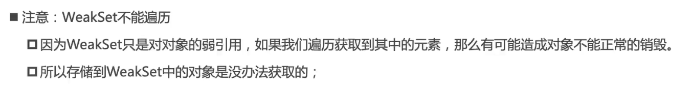

因为不能遍历，所以

```js
let ws = new WeakSet()
ws.add({})
console.log(ws) //WeakSet { <items unknown> }
```

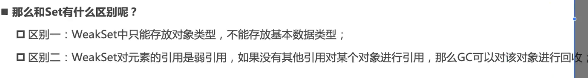

强引用指的是，如果从根对象出发（VariableEnvironment），能找到该对象的引用，那么就不会被GC回收

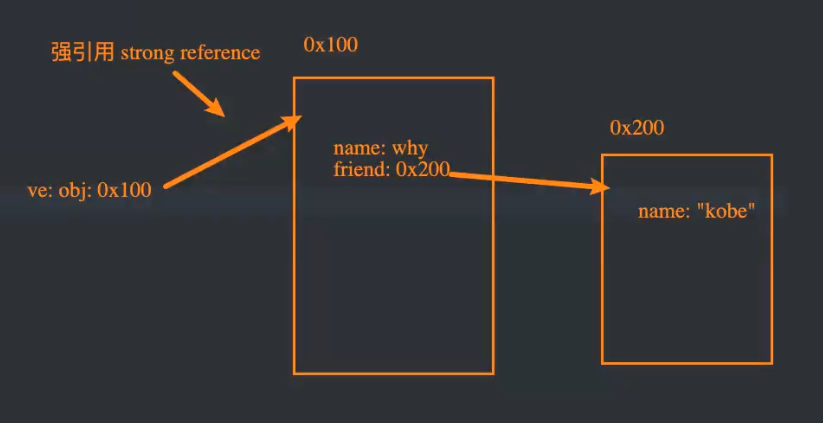

如果将obj设置为null，0x100内存地址中的那个对象也不会被销毁，因为set中有内容指向它，是强引用，（如果是WeakSet的话，就会被回收）

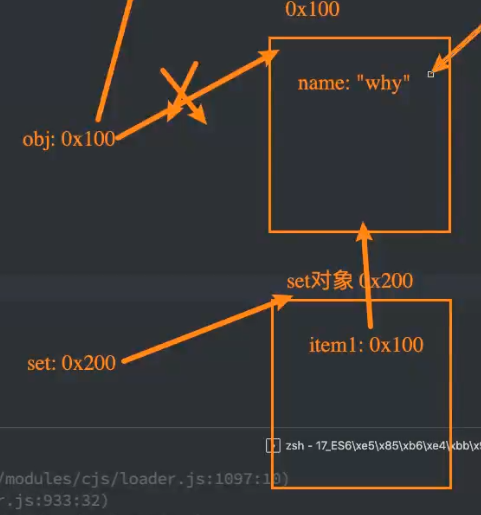

弱引用指的是，即便你是指向它，从根对象出发能找到这个引用，但是GC还是可以回收的

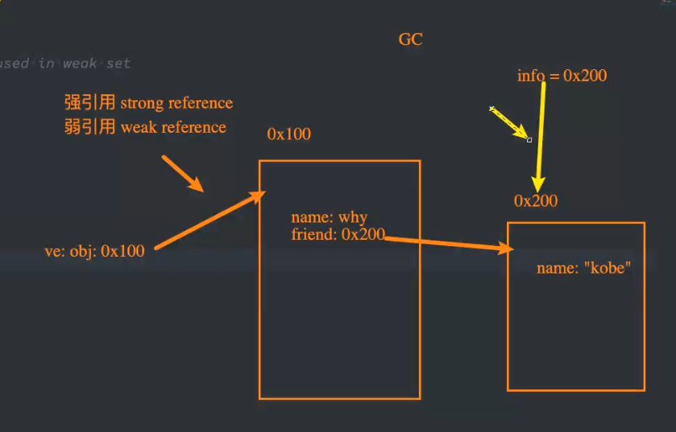

```js
let ws = new WeakSet()
ws.add({})
```

#### 应用场景

类里面的方法只有在this为该类的实例对象时才调用。这个时候就要用到WeakSet了，但是为什么不用Set呢？因为假如有一个对象我add进去之后又想移除，需要执行两步操作，赋值null和delete，WeakSet只需要赋值null即可，弱引用导致对应的对象会被GC回收

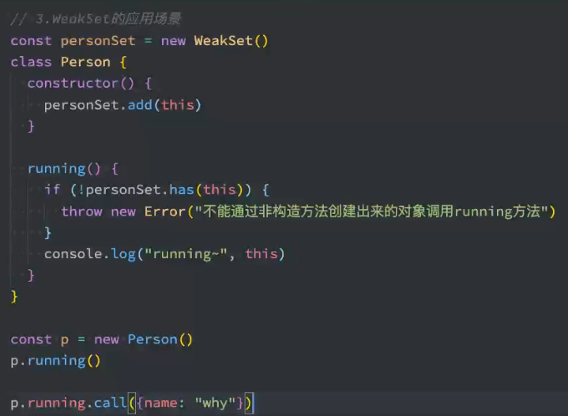

### map

```js

```


```js
//是键值对的集合，key不局限于字符串，可以是各种类型的值。map也实现了iterator接口，可以使用拓展运算符和for of进行遍历
//声明 Map
let m = new Map();
//构造方法可以传入一个数组，数组里面是一个个的数组，里面保存的是两个数据[key,value]
let m2 = new Map([[1,2],[3,4]])

//添加元素
m.set('name','尚硅谷');
m.set('change', function(){
  console.log("我们可以改变你!!");
});
let key = {
  school : 'ATGUIGU'
};
m.set(key, ['北京','上海','深圳']);

//size
// console.log(m.size);

//删除
// m.delete('name');

//判断是否存在key为name的键值对
//m.has('name')

//获取
// console.log(m.get('change'));
// console.log(m.get(key));

//清空
// m.clear();

//遍历，for...of遍历出来的v是一个数组，这个数组里面存放了键值对（在0和1下标）
for(let [key,value] of m){
  console.log(v);
}
//forEach
m.forEach((k,v)=>{
    
})

// console.log(m);
```

### WeakMap

key必须是对象类型，对于key的对象是弱引用，

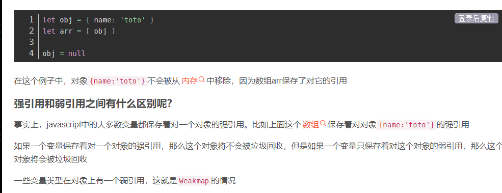

#### 应用场景

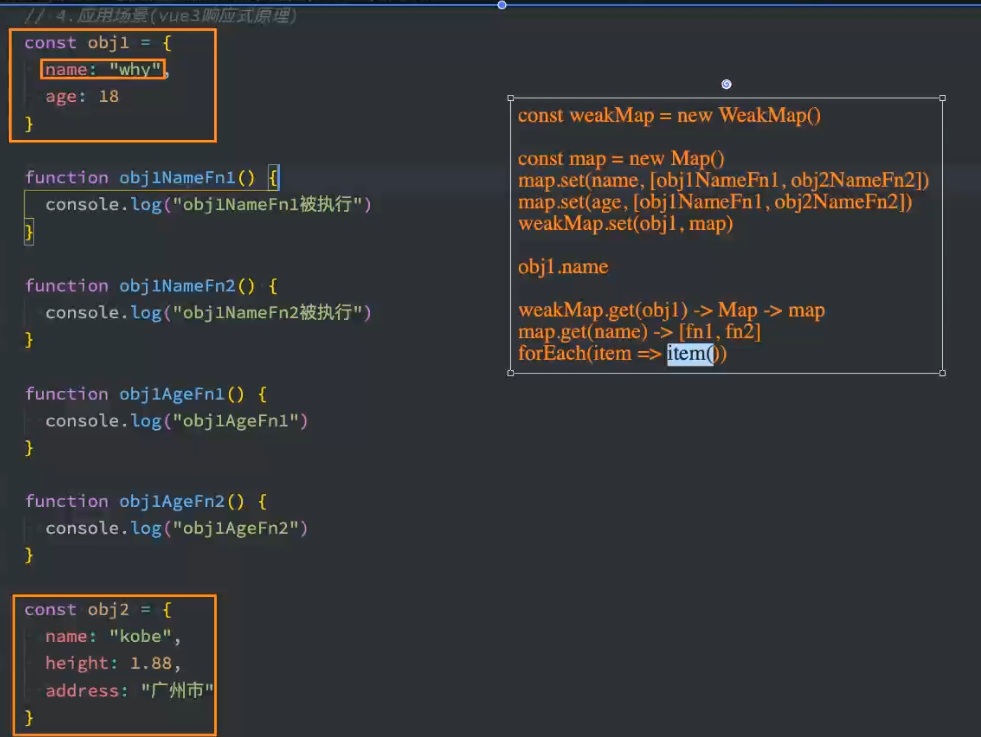

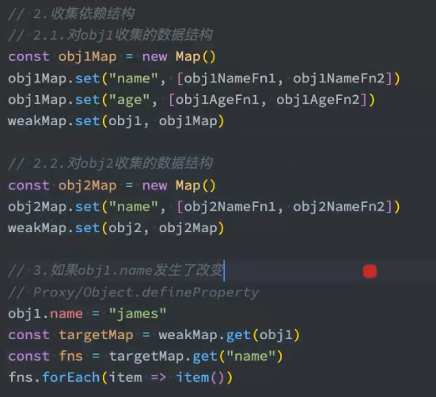

## Class

### 初体验

```js
//es5的class
function Phone(brand, price){
  this.brand = brand;
  this.price = price;
}

//添加方法
Phone.prototype.call = function(){
  console.log("我可以打电话!!");
}

//实例化对象
let Huawei = new Phone('华为', 5999);
Huawei.call();
console.log(Huawei);

//es6的class
class Shouji{
  //构造方法 名字不能修改
  constructor(brand, price){
    this.brand = brand;
    this.price = price;
  }

  //方法必须使用该语法, 不能使用 ES5 的对象完整形式
  //不能call:function(){}
  call(){
    console.log("我可以打电话!!");
  }
  jzsp(){
    console.log('jzsp')
  }
}

let onePlus = new Shouji("1+", 1999);
console.log(onePlus);
```

### static属性

```js
class Phone{
  //静态属性
  static name = '手机';
  static change(){
    console.log("我可以改变世界");
  }
}

let nokia = new Phone();

//static标注的属性和方法，属于类不属于实例对象
console.log(nokia.name);  //undefined
console.log(Phone.name);  //‘手机’
```

### es5继承

```js
//手机
function Phone(brand, price){
  this.brand = brand;
  this.price = price;
}

Phone.prototype.tell = function(){
  console.log("我可以打电话");
}

//智能手机
function SmartPhone(brand, price, color, size){
  //通过call方法改变this的值，指向smartphone的实例对象，然后初始化brand和price，这里相当于是继承父级的属性*********
  Phone.call(this, brand, price);
  this.color = color;
  this.size = size;
}

//设置子级构造函数的原型
//实例对象上就会有父级定义的方法，相当于是把父级的方法也继承过来***********
SmartPhone.prototype = new Phone;
//矫正，不加也不影响
SmartPhone.prototype.constructor = SmartPhone;

//声明子类的方法
SmartPhone.prototype.photo = function(){console.log("我可以拍照")}
SmartPhone.prototype.playGame = function(){console.log("我可以玩游戏");}


const chuizi = new SmartPhone('锤子',2499,'黑色','5.5inch');
console.log(chuizi);
```

### es6继承

```js
class Phone{
  //构造方法,注意，构造方法的名字不能写错，就是constructor
  constructor(brand, price){
    this.brand = brand;
    this.price = price;
  }
  //父类的方法
  call(){
    console.log("我可以打电话!!");
  }
}

class SmartPhone extends Phone {
  //构造方法
  constructor(brand, price, color, size){
    super(brand, price);// Phone.call(this, brand, price)
    this.color = color;
    this.size = size;
  }
  //定义子类的方法
  photo(){
    console.log("拍照");
  }
  playGame(){
    console.log("玩游戏");
  }
  //子类可以重写父类的方法（这里不能用super）
  call(){
    console.log('我可以进行视频通话');
  }
}

const xiaomi = new SmartPhone('小米',799,'黑色','4.7inch');
// console.log(xiaomi);
xiaomi.call();
xiaomi.photo();
xiaomi.playGame();
```

### set和get ？？？？？

```js
  // get 和 set
 class Phone{
    get price(){
      console.log("价格属性被读取了");
      return 'iloveyou';
    }
	//set必须传参，否则报错
    set price(newVal){
      console.log('价格属性被修改了');
    }
}

  //实例化对象
  let s = new Phone();

  console.log(s.price);
  s.price = 'free';
  console.log(s);
```

## Number拓展

```js
//0. Number.EPSILON 是 JavaScript 表示的最小精度
//EPSILON 属性的值接近于 2.2204460492503130808472633361816E-16
function equal(a, b){
    if(Math.abs(a-b) < Number.EPSILON){
        return true;
    }else{
        return false;
    }
}
//浮点数运算是有误差的，EPSILON是为了解决浮点数运算的
console.log(0.1 + 0.2 === 0.3);   //false
console.log(equal(0.1 + 0.2, 0.3))

//1： 2,8,10,16进制
let b = 0b1010;
let o = 0o777;
let d = 100;
let x = 0xff;
console.log(x);

//2. Number.isFinite  检测一个数值是否为有限数
console.log(Number.isFinite(100));
console.log(Number.isFinite(100/0));
console.log(Number.isFinite(Infinity));

//3. Number.isNaN 检测一个数值是否为 NaN
console.log(Number.isNaN(123));

//4. Number.parseInt Number.parseFloat字符串转整数
console.log(Number.parseInt('5211314love1111'));   //5211314
console.log(Number.parseFloat('3.1415926神奇'));  //3.1415926

//5. Number.isInteger 判断一个数是否为整数
console.log(Number.isInteger(5));
console.log(Number.isInteger(2.5));

//6. Math.trunc 将数字的小数部分抹掉
console.log(Math.trunc(3.5));

//7. Math.sign 判断一个数到底为正数 负数 还是零
console.log(Math.sign(100));        //1
console.log(Math.sign(0));          //0
console.log(Math.sign(-20000));     //-1
```

## Object拓展

```js
//1. Object.is 判断两个值是否完全相等
console.log(Object.is(120, 120));// ===
console.log(Object.is(NaN, NaN));// true
console.log(NaN === NaN);// false

//2. Object.assign 对象的合并，属性名一样的话后面的会覆盖掉前面的，不一样则取并集
const config1 = {
    host: 'localhost',
    port: 3306,
    name: 'root',
    pass: 'root',
    test: 'test'
};
const config2 = {
    host: 'http://atguigu.com',
    port: 33060,
    name: 'atguigu.com',
    pass: 'iloveyou',
    test2: 'test2'
}
console.log(Object.assign(config1, config2));

//3. Object.setPrototypeOf 设置原型对象  Object.getPrototypeof
//不推荐这么使用
const school = {
  name: '尚硅谷'
}
const cities = {
  xiaoqu: ['北京','上海','深圳']
}
Object.setPrototypeOf(school, cities);
console.log(Object.getPrototypeOf(school));
console.log(school);
```

## 模块化

```html
<script type="module">
  //模块化主要由两个命令构成  export  import

  //1、通用的导入方式
  //分别暴露
  import * as m1 from './js/01.js'
  //统一暴露
  import * as m2 from './js/02.js'
  //默认暴露,调用里面的东西的话，要加一层default
  //m3.default.name
  import * as m3 from './js/03.js'
  console.log(m1)
  console.log(m2)
  console.log(m3)

  //2、解构赋值的形式
  import {name,teach} from "./js/02.js";
  //如果重名的话用as即可
  import {name as wjj,teach as wjj2} from "./js/02.js";
  import {default as a} from "./js/03.js"
  console.log(name,teach)
  console.log(wjj,wjj2)
  console.log(a)


  //3、简便形式，针对默认暴露
  import a3 from './js/03.js'
  console.log(a3)

</script>
<!--如果一直这样的话，就会导致代码很冗杂，所以放到app.js里执行相关代码，然后引入,记得type="module"-->
<script src="js/app.js" type="module"></script>
```

01.js

```js
//使用export 暴露数据，
export let name = 'wjj'

export function teach(){
  console.log('我会教你jzsp')
}
```

02.js

```js
//统一暴露
 let name = 'wjj'

 function teach(){
  console.log('我会教你jz');
}
export {name,teach}
```

03.js

```js
export default {
  name:'wjj',
  change(){
    console.log('jzsp')
  }
}
```

app.js

```js
//入口文件
import * as m1 from './01.js'
import * as m2 from './02.js'
import * as m3 from './03.js'

console.log(m2)
console.log(m3)
console.log(m1)
```


# Babel

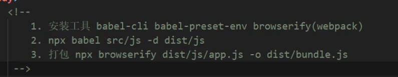

安装（这里是局部安装）

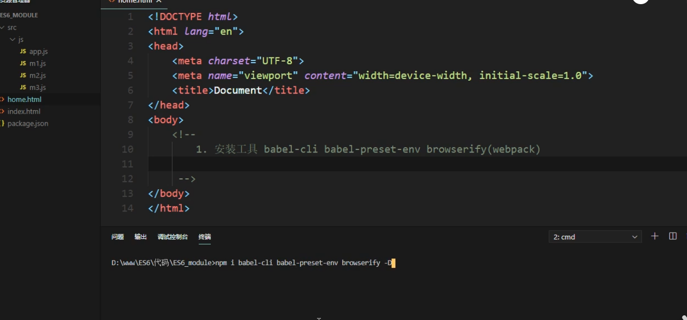

使用babel，npx 

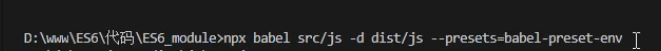

打包入口文件app.js

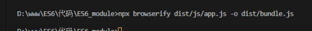

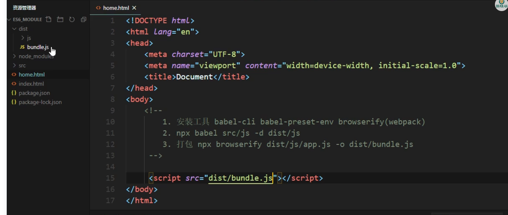

如果在js文件中要用其他的包，例如jQuery，就要先npm安装这个包，再import导入（按照包名导入）

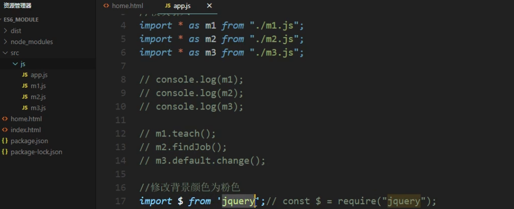

# ES7

es7加入了查找数组中是否有指定的值，以及计算指数的新方式

```js
//includes   返回值是布尔值
//indexOf    返回值是查找到的下标，没有则返回-1
const name = [1,2,3,4,5,6,7,8,NaN]
console.log(name.includes(9))
console.log(name.indexOf(9))

//可以通过includes判断NaN
console.log(name.includes(NaN))


//**   计算指数
//Math.pow(2,10)
console.log(2**10)
```

# ES8

## async函数

```js
//在函数前面加上async就变成async函数了，返回值是promise对象,这个返回的promise对象的状态由函数内部决定
async function fn(){
  //1、只要返回的不是promise对象，那么函数的返回结果就是一个成功的promise对象
  // return 'wjj'

  //2、抛出错误的话返回一个失败的promise
  // throw new Error('出错啦！')

  //3、如果返回的是Promise对象，那么函数返回的promise的状态跟这个new的promise的状态一样
  return new Promise(((resolve, reject) => {
    resolve('success')
  }))
}
fn().then(value => {
  console.log(value)
})
```

## await表达式

```js
//await必须放在async函数中，await右边的表达式一般为promise对象，
//await返回的是promise成功的值，
//如果promise失败了，就会抛出异常，需要try...catch捕获处理

const p = new Promise(((resolve, reject) => {
  // resolve('jzsp')
  reject('失败啦')
}))

//await要放在async函数中
async function fn(){
  try{
    let res = await p;
    console.log(fn())
  }catch (e) {
    console.log(e);
  }
}
fn()
```

## async和await结合案例

### 读取多个文件

```js
//引入fs模块

const fs = require('fs')

function read1(){
  return new Promise((resolve, reject) => {
    fs.readFile('./resources/为学.md',(err, data) => {
      if(err) reject(err)
      resolve(data)
    })
  })
}

function read2(){
  return new Promise((resolve, reject) => {
    fs.readFile('./resource/插秧诗.md',(err, data) => {
      //如果失败，修改promise的状态为失败，并且传入失败的原因
      if (err) reject(err)
      //如果成功，修改promise的状态为成功，并且传入成功的值
      resolve(data)
    })
  })
}

function read3(){
  return new Promise((resolve, reject) => {
    fs.readFile('./resource/观书有感.md',(err, data) => {
      if (err) reject(err)
      resolve(data)
    })
  })
}

//声明一个async函数
async function fn(){
  let weixue = await read1()
  let chayang = await read2()
  let guanshu = await read3()
}
```

### 联合发送ajax请求

```js
function fn(url){
  return new Promise((resolve, reject) => {
    const x = new XMLHttpRequest()
    x.open('GET',url)
    x.send()
    x.onreadystatechange = function (){
      if(x.readyState === 4)
      {
        if(x.status>=200 && x.status<400){
          //成功
          resolve(x.response)
        }else {
          reject(x.status)
        }
      }
    }
  })
}
//这里用的是json-server
//1、用promise的then来测试
fn('http://localhost:3000/posts').then(value => console.log(value)).catch(reason => console.log(reason))
//2、用async 和 await测试
async function main(){
  let res = await fn('http://localhost:3000/posts')
  console.log(res);
}
main()
```

### 墓碑项目

```js
// 用来发送request请求
import axios from 'axios'
// 对axios函数进行封装，用来发api请求，post使用qs进行处理，避免自己把from数据转换为json字符串
export default async function request (url, data, type) {
  // 创建axios请求 携带session
  const service = axios.create({
    baseURL:process.env.VUE_APP_S,
    withCredentials: true
  })
  // 默认数据
  const res = {
    code: 104,
    data: null,
    msg: '发送请求失败！'
  }
  try {
    // 判断请求类型
    if (type === 'get') {
      return (await service.get(url, { params: data, headers: { 'Authorization': sessionStorage.getItem('token'),'loginType':'USER' } })).data
    } else if (type === 'post') {
      return (await service.post(url, data)).data
    } else if (type === 'put') {
      return (await service.put(url, data)).data
    } else if (type === 'delete') {
      return (await service.delete(url, data)).data
    } else if (type === 'form') {
      return (await service.post(url, data)).data
    } else {
      return res
    }
  } catch (e) {
    return res
  }
}
```


## Object拓展

- Object.keys
- Object.values
- Object.enryies

```js
//声明对象
const school = {
  name:'wjj',
  age:18,
  height:180
}

//获取所有的key
console.log(Object.keys(school));

//获取所有的value
console.log(Object.values(school));

//entries,他获取到的是一个数组，数组里面有两个值，一个是key，一个是value，这种结构方便创建map
console.log(Object.entries(school));
const m = new Map(Object.entries(school))
console.log(m.get('name'))

//对象属性的描述对象，这个对象里面还是键值对，但是值包括的内容多了很多（Object.create)
console.log(Object.getOwnPropertyDescriptor(school))
const obj = Object.create(null,{
  name:{
    //设置值
    value:'wjj',
    //设置属性的特性
    writable:true,
    configurable:true,
    enumerable:true
  }
})
```

## StringPadding

### String.padStart

将给定的字符**填充在**当前的字符串使得**结果字符串达到给定长度**，这个填充的过程应用在给定字符串的开头

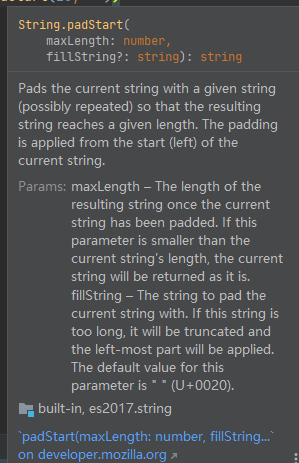

```js
const message = 'hellow world'
console.log(message.padStart(15,"*"))   //***hellow world
```

### String.padEnd

（与上面的相反）

# ES9

## 对象中使用拓展运算符

```js
//如果是将数组在对象中拓展，那么他们的key值是数组下标，并且拓展的数组后面的会覆盖掉前面的（如下所示，arr数组被覆盖掉了）
let arr = [1,23,4]
let arr2 = [12,223,42,2]
let b = {
    name:'jzsp',
    ...arr,
    age:18,
    ...arr2
}
console.log(b)  //{ '0': 12, '1': 223, '2': 42, '3': 2, name: 'jzsp', age: 18 }
```

```html
<script>
  //在es9中为对象提供了像数组一样的rest参数和拓展运算符
  //es6的是针对数组的
  
  //1、对象解构中使用rest
  function content({host,port,...user}){
    console.log(host)
    console.log(port)
    console.log(user)
  }
  content({
    host:'1',
    port:'2',
    //这些后面的信息会被存到user（作为对象的键值对）里去
    username:'3',
    password:'4'
  })


  const me = {
    height:110,
    weight:112,
    name:'wjj'
  }
  // ...me  =>   height:100,weight:112,name:'wjj'
  const you = {
    height1:110,
    weight2:112,
    name3:'wjj'
  }
  const we = {...me,...you}
  console.log(we)
  /*
  Object { height: 110, weight: 112, name: "wjj", height1: 110, weight2: 112, name3: "wjj" }
  * */
</script>
```

```js
 computed: {
  // 使用对象展开运算符将 getter 混入 computed 对象中
    ...mapGetters([
      'doneTodosCount',
      'anotherGetter',
      // ...
    ])
  }
```

## 正则拓展

### 命名捕获分组(?<>.*)

```js
//声明一个字符串
let str =  "<div class='jzsp'}>wjj</div>"
//提取class类名以及标签内容
const reg = /<div class='(.*)'}>(.*)<\/div>/
//执行，获得的结果如下
//第一个值是整个字符串，第二个值和第三个值是(.*)匹配到的内容
/*
  Array(3) [ "<div class='jzsp'}>wjj</div>", "jzsp", "wjj" ]
  0: "<div class='jzsp'}>wjj</div>"
  1: "jzsp"
  2: "wjj"
*/
//提取到的class类名
console.log(reg.exec(str)[1])


//新特性命名捕获分组，在(.*)的.*前面加上？<xxx>,xxx就是groups里的key名，匹配到的字符串就是value值
let str2 =  "<div class='jzsp'}>wjj</div>"
const reg2 = /<div class='(?<jzsp>.*)'}>(?<jzsp2>.*)<\/div>/
const res = reg2.exec(str2)
//数据结构与前面的结果类似，但是多了一个groups（上面是undefined，这里有了具体的键值对，键名是）
console.log(res)
```

### 反向断言（?<=xxx)

```js
//断言，根据目标前后的内容进行唯一性识别
//正向断言,根据当前匹配的后面的内容进行判断当前匹配的内容是否合法
//语法：(?=xxx)
let str = 'js512123123你知道么222啦啦啦'
//获取555这个数据

//如果是数字且后面的字是啦的话，就取出这串数字
let reg = /\d+(?=啦)/
console.log(reg.exec(str))

//新特性：反向断言，根据前面的内容进行判断当前匹配的内容是否合法
//语法：(?<=xxx)
let reg2 = /(?<=么)\d+/
console.log(reg2.exec(str))
```

### dotAll模式//s

```js
//dotAll模式,让.匹配任意字符
//dot .  元字符，   除换行符外的任意单个字符

//需求，吧li的电影名称和上映日期存到对象中
let str = `
  <ul>
    <li>
      <div></div><a>肖申克的救赎</a>
      <p>上映日期111</p>
    </li>
    <li>
      <a>肖申克的救赎2</a>
      <p>上映日期222</p>
    </li>
  </ul>
`
//\s是换行  *是修饰符，修饰前一个字符或者分组，代表任意数量
//?是懒惰模式
//(.*?)  表示匹配任意字符到下一个符合条件的字符
//老的做法
let reg =/<li>\s+<a>(.*?)<\/a>\s+<p>(.*?)<\/p>/
console.log(reg.exec(str))

//新特性：dotAll模式,单次匹配
let reg2 = /<li>.*?<a>(.*?)<\/a>.*?<p>(.*?)<\/p>/s
//匹配全部
let reg3 = /<li>.*?<a>(.*?)<\/a>.*?<p>(.*?)<\/p>/sg
let res
let data=[]
while(res = reg3.exec(str)){
  console.log(res)
  data.push({title:res[1],time:res[2]})
}
console.log(data)
```

# ES10

## Object：fromEntries

传入一个包含`key-value`键值对的可迭代对象

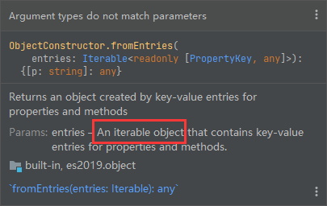

```js
//fromEntries是把二维数组变成对象
//entries是把对象变成对象数组，这个对象数组中存的是键值对组成的对象
let arr = [
    ['name','wjj'],
    ['height',180]
]
const res = Object.fromEntries(arr)
console.log(res);

//等价于下面的操作
const newObj = {}
for(const item of arr){
    newObj[item[0]] = item[1]
}
console.log(newObj)

//也可以从map中导入
const map = new Map();
map.set('name', 'wjj')
const res2 = Object.fromEntries(map)
console.log(res2);
```

## String：trimStart和trimEnd

```js
//trim 清除字符串两侧的空白字符
//trimStart  清除字符串左侧空白
//trimEnd  清除字符串右侧空白
let str = '   a    '
console.log(str)
console.log(str.trimStart())
console.log(str.trimEnd())
```

## Array：flat(数组降维)

可以传入降维的”深度"，不传入的话默认是1

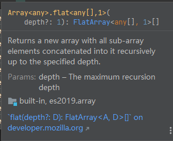

```js
//flat 平
//将多维数组转化为低维数组
const arr = [1,2,3,4,5,
  [56,7],
  [1,[23,4]]
]
//每调用依次flat，会对每个数组元素进行一次降维，
//里面可以传入参数，也就是降维多少次
console.log(arr.flat().flat())


//flatMap  与map很像
//相当于是先做map的操作，再做flat的操作（深度为1）
const arr1 = [1,2,3,4]
//如果对普通的一维数组进行操作，是没什么区别的，因为返回的是一维数组
let res = arr1.map(item=>item*10)
console.log(res)   //[ 10, 20, 30, 40 ]
res = arr1.flatMap(item=>item*10)
console.log(res)   //[ 10, 20, 30, 40 ]


//应用场景,将数组中每个元素分成单个的单词放到新数组中
let arr2 = ["hello world","hello wjj"]
res = arr2.flatMap(item=>item.split(" "))  //因为这里split的返回结果是数组，相当于res是二维数组了，需要用flat降维
res = arr2.map(item => item.split(" ")).flat()   //等价上面的flatMap
console.log(res) //[ 'hello', 'world', 'hello', 'wjj' ]
```

## Symbol：description

获取描述信息

```js
//创建 Symbol，传入描述
let s = Symbol('尚硅谷');
//获取Symbol的描述
console.log(s.description);
```

# ES11

## ？？空值合并运算

因为`0`和`""`空字符串是**假值**，在进行逻辑或赋默认值的时候会出现问题，如下

```js
const a = 0
const res = a || "defaultValue"
console.log(res)  //defaultValue
```

??的出现就是为了处理这种情况，只用于判断一个变量是否为null或者undefined

```js
const a = 0
const res = a ?? "defaultValue"
console.log(res)  //0
```

## 可选链操作符?.

```js
const info = {
    name:'wjj',
    //addr:{
    //    area:'lq'
    //}
}
console.log(info.addr.area)    //相当于是info.undefined.area，会报错的
//要处理上面这种情况的话得逐个判断是否有值(用与运算符逐个判断，如果都是true就会返回最后一个的值，如果有一个是undefined就返回undefined)
console.log(info && info.addr && info.addr.area)
//同样的，也可以用?.来达到一样的效果，看上去更简洁
//它的作用是，判断前面的那个属性是否是undefined，如果是的话就直接返回undefined，否则就按链取到最后一个值
console.log(info?.addr?.area)
```


```js
// ?.
//获取config中的db中的host
function main(config){
  // const dbHost = config && config.db && config.db.host;
  const dbHost = config?.db?.host;
  console.log(dbHost);
}

main({
  db: {
    host:'192.168.1.100',
    username: 'root'
  },
  cache: {
    host: '192.168.1.200',
    username:'admin'
  }
})
```


## 私有属性#xx

```js
class Person{
  //公有属性
  name;
  //私有属性
  #age;
  #weight;
  //构造方法
  constructor(name, age, weight){
    this.name = name;
    this.#age = age;
    this.#weight = weight;
  }

  intro(){
    console.log(this.name);
    console.log(this.#age);
    console.log(this.#weight);
  }
}

//实例化
const girl = new Person('晓红', 18, '45kg');

// console.log(girl.name);
// console.log(girl.#age);   报错，得不到结果
// console.log(girl.#weight);

girl.intro();
```

## Promise.allSetteld & Promise.all

```js
//用来做批量异步任务
//声明两个promise对象
const p1 = new Promise((resolve, reject)=>{
  setTimeout(()=>{
    resolve('商品数据 - 1');
  },1000)
});

const p2 = new Promise((resolve, reject)=>{
  setTimeout(()=>{
    resolve('商品数据 - 2');
    // reject('出错啦!');
  },1000)
});

//调用 allsettled 方法
//Promise.allSettled的参数是一个promise数组，返回值一定是一个成功的promise
//这个成功的promise的value是一个数组，存的是实参数组中每个promise各自的状态和值
// const result = Promise.allSettled([p1, p2]);

//调用all方法，只有实参数组中的promise都成功，才会返回一个成功的promise，值是实参promise值成功的结果
//如果有不成功，那么返回的是resolved，值也是这些不成功promise的结果组成的数组
// const res = Promise.all([p1, p2]);

console.log(res);
```

## String拓展

```js
<script>
  let str = `<ul>
            <li>
                <a>肖生克的救赎</a>
                <p>上映日期: 1994-09-10</p>
            </li>
            <li>
                <a>阿甘正传</a>
                <p>上映日期: 1994-07-06</p>
            </li>
        </ul>`;

  //声明正则
  const reg = /<li>.*?<a>(.*?)<\/a>.*?<p>(.*?)<\/p>/sg
  //之前
  // let res
  // let data=[]
  // while(res = reg.exec(str)){
  //   console.log(res)
  //   data.push({title:res[1],time:res[2]})
  // }
  // console.log(data)

  //调用方法，这个是简便方法，否则的话就要跟之前一样循环遍历
  //返回的是一个可迭代对象，可以用for  of迭代
  const result = str.matchAll(reg);
  const arr = [...result];

  console.log(arr);
</script>
```

## 懒加载

```js
// import * as m1 from "./hello.js";
//获取元素
const btn = document.getElementById('btn');

btn.onclick = function(){
    //import返回的是一个promise，成功的promise的值就是对应的模块
    import('./hello.js').then(module => {
        module.hello();
    });
}
```

## BigInt

```js
//大整形(要在结尾加一个n)
 let n = 521n;
 console.log(n, typeof(n));

//函数
// let n = 123;
// console.log(BigInt(n));
// console.log(BigInt(1.2));

//普通number类型运算
let max = Number.MAX_SAFE_INTEGER;
console.log(max);
console.log(max + 1);
console.log(max + 2);

//大数值运算（需要转成BigInt才能进行同类型的运算）
console.log(BigInt(max))
console.log(BigInt(max) + 1n)
console.log(BigInt(max) + BigInt(2))

//BigInt转Number(超过max_save_value可能会出现转换错误)
console.log(Number(1n))
```

## globalThis获取全局对象

```js
//始终指向全局对象，不论是在浏览器中，还是在node中
console.log(globalThis);
```

# ES12

## 数值表示

```js
const num = 1_000_000_000
console.log(num)  //1000000000
```

## 监听对象销毁

FinalizationRegistry类，传入一个回调函数，当对象在被GC回收的时候会执行这个回调

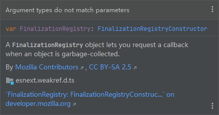

用这个类的实例来调用register方法注册要监听的obj对象

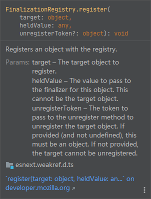

```js
//注意要在浏览器环境下运行哦
const finalRegistry = new FinalizationRegistry(()=>{
  console.log("寄！")
})
let obj = {}
finalRegistry.register(obj)
obj = null
```

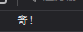

如果有多个对象要注册，那么怎么知道当前销毁的是哪个对象呢？很简单，register函数可以传入一个heldValue值，这个值是可传入回调函数的

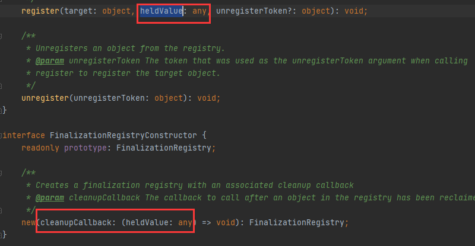

```js
//注意要在浏览器环境下运行哦
const finalRegistry = new FinalizationRegistry((v)=>{
  console.log("寄！",v)
})
let obj = {}
let obj2 = {}
finalRegistry.register(obj,'jzsp1')
finalRegistry.register(obj2,'jzsp2')
obj = null
obj2 = null
```

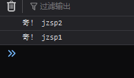

## WeakRef弱引用

deref获取弱引用指向的对象，如果没有被销毁就能获取，否则就返回undefined

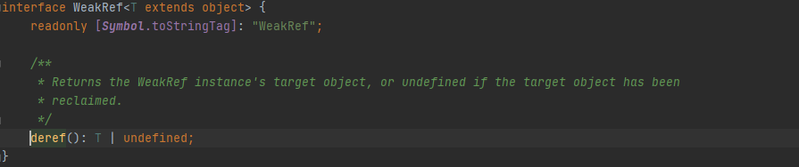

```js
//注意要在浏览器环境下运行哦
const finalRegistry = new FinalizationRegistry((v)=>{
  console.log("寄！",v)
})
let obj = {}
//这里直接赋值是强引用，obj2指向obj指向的对象，那么将obj设置为空的话，因为还有引用指着他，所以它不会被gc回收
//let obj2 = obj

//这样创建的就是弱引用了，当obj赋值为null的时候，obj会被销毁
let info = new WeakRef(obj)
//弱引用可以用dref获取弱引用指向的对象，然后就是正常使用
console.log(info.deref())
finalRegistry.register(obj,'jzsp1')

obj = null
```

## 逻辑赋值运算

```js
let message = ''
message = message || 'defaultValue'
//与上面的那句等价，其他的&&  ??也是如此
message ||= 'defaultValue'
```


# 拓展总结

## 对象拓展

```js
//1. Object.is 判断两个值是否完全相等
console.log(Object.is(120, 120));// ===
console.log(Object.is(NaN, NaN));// true
console.log(NaN === NaN);// false

//2. Object.assign 对象的合并，属性名一样的话后面的会覆盖掉前面的，不一样则取并集
const config1 = {
    host: 'localhost',
    port: 3306,
    name: 'root',
    pass: 'root',
    test: 'test'
};
const config2 = {
    host: 'http://atguigu.com',
    port: 33060,
    name: 'atguigu.com',
    pass: 'iloveyou',
    test2: 'test2'
}
console.log(Object.assign(config1, config2));

//3. Object.setPrototypeOf 设置原型对象  Object.getPrototypeof
//不推荐这么使用
const school = {
  name: '尚硅谷'
}
const cities = {
  xiaoqu: ['北京','上海','深圳']
}
Object.setPrototypeOf(school, cities);
console.log(Object.getPrototypeOf(school));
console.log(school);
```

```js
//声明对象
const school = {
  name:'wjj',
  age:18,
  height:180
}

//获取所有的key
console.log(Object.keys(school));

//获取所有的value
console.log(Object.values(school));

//entries,他获取到的是一个数组，数组里面有两个值，一个是key，一个是value，这种结构方便创建map
console.log(Object.entries(school));
const m = new Map(Object.entries(school))
console.log(m.get('name'))

//对象属性的描述对象，这个对象里面还是键值对，但是值包括的内容多了很多（Object.create)
console.log(Object.getOwnPropertyDescriptor(school))
const obj = Object.create(null,{
  name:{
    //设置值
    value:'wjj',
    //设置属性的特性
    writable:true,
    configurable:true,
    enumerable:true
  }
})
```

```js
//fromEntries是把二维数组变成对象
//entries是把对象变成对象数组，这个对象数组中存的是键值对组成的对象
const res = Object.fromEntries([
    ['name','wjj'],
    ['height',180]
])
console.log(res);

const map = new Map();
map.set('name', 'wjj')
const res2 = Object.fromEntries(map)
console.log(res2);
```


## NUmber拓展

```js
//0. Number.EPSILON 是 JavaScript 表示的最小精度
//EPSILON 属性的值接近于 2.2204460492503130808472633361816E-16
function equal(a, b){
    if(Math.abs(a-b) < Number.EPSILON){
        return true;
    }else{
        return false;
    }
}
//浮点数运算是有误差的，EPSILON是为了解决浮点数运算的
console.log(0.1 + 0.2 === 0.3);   //false
console.log(equal(0.1 + 0.2, 0.3))

//1： 2,8,10,16进制
let b = 0b1010;
let o = 0o777;
let d = 100;
let x = 0xff;
console.log(x);

//2. Number.isFinite  检测一个数值是否为有限数
console.log(Number.isFinite(100));
console.log(Number.isFinite(100/0));
console.log(Number.isFinite(Infinity));

//3. Number.isNaN 检测一个数值是否为 NaN
console.log(Number.isNaN(123));

//4. Number.parseInt Number.parseFloat字符串转整数
console.log(Number.parseInt('5211314love1111'));   //5211314
console.log(Number.parseFloat('3.1415926神奇'));  //3.1415926

//5. Number.isInteger 判断一个数是否为整数
console.log(Number.isInteger(5));
console.log(Number.isInteger(2.5));

//6. Math.trunc 将数字的小数部分抹掉
console.log(Math.trunc(3.5));

//7. Math.sign 判断一个数到底为正数 负数 还是零
console.log(Math.sign(100));        //1
console.log(Math.sign(0));          //0
console.log(Math.sign(-20000));     //-1	
```

## Array拓展

```js
//includes   返回值是布尔值
//indexOf    返回值是查找到的下标，没有则返回-1
const name = [1,2,3,4,5,6,7,8]
console.log(name.includes(9))
console.log(name.indexOf(9))

```

```js
//flat 平
//将多维数组转化为低维数组
const arr = [1,2,3,4,5,
  [56,7],
  [1,[23,4]]
]
//每调用依次flat，会对每个数组元素进行一次降维，
//里面可以传入参数，也就是降维多少次
console.log(arr.flat().flat())


//flagMap  与map很像
const arr1 = [1,2,3,4]
//原来的操作
let res = arr1.map(item=>item*10)
//返回的是数组，那么res就变成二维数组了，用flatMap来降维
//只能说多此一举
res = arr1.flatMap(item=>[item*10])
```


## 正则拓展

### 命名捕获分组(?<>.*)

```js
//声明一个字符串
let str =  "<div class='jzsp'}>wjj</div>"
//提取class类名以及标签内容
const reg = /<div class='(.*)'}>(.*)<\/div>/
//执行，获得的结果如下
//第一个值是整个字符串，第二个值和第三个值是(.*)匹配到的内容
/*
  Array(3) [ "<div class='jzsp'}>wjj</div>", "jzsp", "wjj" ]
  0: "<div class='jzsp'}>wjj</div>"
  1: "jzsp"
  2: "wjj"
*/
//提取到的class类名
console.log(reg.exec(str)[1])


//新特性命名捕获分组，在(.*)的.*前面加上？<xxx>,xxx就是groups里的key名，匹配到的字符串就是value值
let str2 =  "<div class='jzsp'}>wjj</div>"
const reg2 = /<div class='(?<jzsp>.*)'}>(?<jzsp2>.*)<\/div>/
const res = reg2.exec(str2)
//数据结构与前面的结果类似，但是多了一个groups（上面是undefined，这里有了具体的键值对，键名是）
console.log(res)
```

### 反向断言（?<=xxx)

```js
//断言，根据目标前后的内容进行唯一性识别
//正向断言,根据当前匹配的后面的内容进行判断当前匹配的内容是否合法
//语法：(?=xxx)
let str = 'js512123123你知道么222啦啦啦'
//获取555这个数据

//如果是数字且后面的字是啦的话，就取出这串数字
let reg = /\d+(?=啦)/
console.log(reg.exec(str))

//新特性：反向断言，根据前面的内容进行判断当前匹配的内容是否合法
//语法：(?<=xxx)
let reg2 = /(?<=么)\d+/
console.log(reg2.exec(str))
```

### dotAll模式//s

```js
//dotAll模式,让.匹配任意字符
//dot .  元字符，   除换行符外的任意单个字符

//需求，吧li的电影名称和上映日期存到对象中
let str = `
  <ul>
    <li>
      <div></div><a>肖申克的救赎</a>
      <p>上映日期111</p>
    </li>
    <li>
      <a>肖申克的救赎2</a>
      <p>上映日期222</p>
    </li>
  </ul>
`
//\s是换行  *是修饰符，修饰前一个字符或者分组，代表任意数量
//?是懒惰模式
//(.*?)  表示匹配任意字符到下一个符合条件的字符
//老的做法
let reg =/<li>\s+<a>(.*?)<\/a>\s+<p>(.*?)<\/p>/
console.log(reg.exec(str))

//新特性：dotAll模式,单次匹配
let reg2 = /<li>.*?<a>(.*?)<\/a>.*?<p>(.*?)<\/p>/s
//匹配全部
let reg3 = /<li>.*?<a>(.*?)<\/a>.*?<p>(.*?)<\/p>/sg
let res
let data=[]
while(res = reg3.exec(str)){
  console.log(res)
  data.push({title:res[1],time:res[2]})
}
console.log(data)
```

## String拓展

```js
//trim 清除字符串两侧的空白字符
//trimStart  清除字符串左侧空白
//trimEnd  清除字符串右侧空白
let str = '   a    '
console.log(str)
console.log(str.trimStart())
console.log(str.trimEnd())
```

```js
<script>
  let str = `<ul>
            <li>
                <a>肖生克的救赎</a>
                <p>上映日期: 1994-09-10</p>
            </li>
            <li>
                <a>阿甘正传</a>
                <p>上映日期: 1994-07-06</p>
            </li>
        </ul>`;

  //声明正则
  const reg = /<li>.*?<a>(.*?)<\/a>.*?<p>(.*?)<\/p>/sg
  //之前
  // let res
  // let data=[]
  // while(res = reg3.exec(str)){
  //   console.log(res)
  //   data.push({title:res[1],time:res[2]})
  // }
  // console.log(data)

  //调用方法，这个是简便方法，否则的话就要跟之前一样循环遍历
  //返回的是一个可迭代对象，可以用for  of迭代
  const result = str.matchAll(reg);
  const arr = [...result];

  console.log(arr);
</script>
```


## Symbol拓展

```js
//创建 Symbol
let s = Symbol('尚硅谷');
//获取Symbol的描述
console.log(s.description);
```

