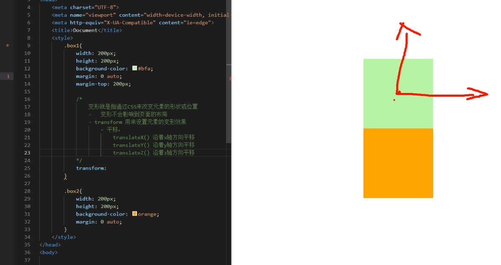

# 1、动画

## 1、transition

```
过渡（transition）
    - 通过过渡可以指定一个属性发生变化时的切换方式
    - 通过过渡可以创建一些非常好的效果，提升用户的体验	
```

```
transition-property: 指定要执行过渡的属性  
   多个属性间使用,隔开 
   如果所有属性都需要过渡，则使用all关键字
   大部分属性都支持过渡效果，注意过渡时必须是从一个有效数值向另外一个有效数值进行过渡

transition-property: height , width;
transition-property: all;
```

```
transition-duration: 指定过渡效果的持续时间
   时间单位：s 和 ms  1s = 1000ms

transition-duration: 100ms, 2s; 
transition-duration: 2s; 
```

```
transition-timing-function: 过渡的时序函数
   指定过渡的执行的方式  
   可选值：
       ease 默认值，慢速开始，先加速，再减速
       linear 匀速运动
       ease-in 加速运动
       ease-out 减速运动
       ease-in-out 先加速 后减速
       cubic-bezier() 来指定时序函数
           https://cubic-bezier.com
       steps() 分步执行过渡效果
		第一个值是分几次
		第二个值是在某次的开始（结束）时发生变化，就假如动画持续时间是10s，分两次，start就是第一个5s开始的时候动，end就是第一个5s结束的时候动


transition-timing-function: cubic-bezier(.24,.95,.82,-0.88); 
transition-timing-function: steps(2, start); 
```

```
transition-delay: 过渡效果的延迟，等待一段时间后在执行过渡  
transition-delay: 2s; 
```

```
 transition 可以同时设置过渡相关的所有属性，只有一个要求，如果要写延迟，则两个时间中第一个是持续时间，第二个是延迟 
transition:2s margin-left 1s cubic-bezier(.24,.95,.82,-0.88);
```

## 2、animation

```
动画
    动画和过渡类似，都是可以实现一些动态的效果，
        不同的是过渡需要在某个属性发生变化时才会触发
        动画可以自动触发动态效果
        
    设置动画效果，必须先要设置一个关键帧，关键帧设置了动画执行每一个步骤
```

关键帧的设置

```css
@keyframes test {
    /* from表示动画的开始位置 也可以使用 0% */
    from{
        margin-left: 0;
        background-color: orange;
    } 

    /* to动画的结束位置 也可以使用100%*/
    to{
        background-color: red;
        margin-left: 700px;
    }
}
```

### animation的属性

指定关键帧

```
 animation-name: 要对当前元素生效的关键帧的名字 
 animation-name: test; 
```

设置延时时效

```
 animation-duration: 动画的执行时间 
 animation-duration: 4s; 
```

 设置延时

```
 动画的延时 
 animation-delay: 2s; 
```

设置动画次数

```

animation-iteration-count 动画执行的次数 
    可选值：
        次数
        infinite 无限执行

animation-iteration-count: 1;
```

设置动画方向

```
animation-direction
    指定动画运行的方向
        可选值：
        normal 默认值  从 from 向 to运行 每次都是这样 
        reverse 从 to 向 from 运行 每次都是这样 
        alternate 从 from 向 to运行 重复执行动画时反向执行
        alternate-reverse 从 to 向 from运行 重复执行动画时反向执行

 animation-direction: alternate-reverse; 
```

设置动画的执行状态 

```
 animation-play-state: 设置动画的执行状态 
    可选值：
        running 默认值 动画执行
        paused 动画暂停

 animation-play-state: paused; 
```

设置动画的填充模式

```
animation-fill-mode: 动画的填充模式
    可选值：
        none 默认值 动画执行完毕元素回到原来位置
        forwards 动画执行完毕元素会停止在动画结束的位置
        backwards 动画延时等待时，元素就会处于开始位置
        both 结合了forwards 和 backwards

 animation-fill-mode: both; 
```

设置动画速度和transition一样animation-timing-function

```
...
```

简写，属性可以随便写，但是有两个时间时，第一个是持续时间第二个是延时时间

```
animation: test 2s infinite 1s alternate;
```

## 3、transform

空间效果一定要给html设置视距perspective

### x&y轴平移



注意，transform后面的translate可以写多个，用 空格隔开，如果后面也写了transform的话，会被后面的完全替换覆盖掉

```css
.box1{
    width: 200px;
    height: 200px;
    background-color: #bfa;
    margin: 0 auto;
    margin-top: 200px;

    /* 
        变形就是指通过CSS来改变元素的形状或位置
        -   变形不会影响到页面的布局
        - transform 用来设置元素的变形效果
            - 平移：
                translateX() 沿着x轴方向平移
                translateY() 沿着y轴方向平移
                translateZ() 沿着z轴方向平移
                    - 平移元素，百分比是相对于自身宽高计算的
    */
    /* transform: translateY(-100px); */
    transform: translateX(100%);
}
```

### z轴平移

```css
<style>
    html{
        /* 设置当前网页的视距为800px，人眼距离网页的距离 */
        perspective: 800px;
    }

    body{
        border: 1px red solid;
        background-color: rgb(241, 241, 241);
    }
    .box1{
        width: 200px;
        height: 200px;
        background-color: #bfa;
        margin: 200px auto;
        /* 
            z轴平移，调整元素在z轴的位置，正常情况就是调整元素和人眼之间的距离，
                距离越大，元素离人越近
            z轴平移属于立体效果（近大远小），默认情况下网页是不支持透视，如果需要看见效果
                必须要设置网页的视距
        */

        transition:2s;
    }

    body:hover .box1{
        transform: translateZ(400px);
    }
</style>
```

### 旋转rotate


```css
body:hover .box1{

    /*
        通过旋转可以使元素绕着x y 或 z旋转指定的角度
            rotateX()
            rotateY()
            rotateZ()
    deg是角度     turn是圈（360°)
    */
    /* transform: rotateZ(.25turn); */
    /* transform: rotateY(180deg) translateZ(400px); */
    /* transform: translateZ(400px) rotateY(180deg) ; */
    transform: rotateY(180deg);
    /* 是否显示元素的背面 */
    backface-visibility: hidden;

}
```

### 缩放scale

```html
<!DOCTYPE html>
<html lang="en">
<head>
    <meta charset="UTF-8">
    <meta name="viewport" content="width=device-width, initial-scale=1.0">
    <meta http-equiv="X-UA-Compatible" content="ie=edge">
    <title>Document</title>
    <style>
        html{
            perspective:800px;
            
        }
        .box1{
            width: 100px;
            height: 100px;
            background-color: #bfa;
            transition:2s;
            margin: 100px auto;


            /* 变形的原点 默认值 center*/
            /* transform-origin:20px 20px;  */
        }

        .box1:hover{
            /* 
                对元素进行缩放的函数：
                    scaleX() 水平方向缩放
                    scaleY() 垂直方向缩放
                    scale() 双方向的缩放
            */
            transform:scale(2)
        }


        .img-wrapper{
            width: 200px;
            height: 200px;
            border: 1px red solid;
            overflow: hidden;
        }

        img{
            transition: .2s;
        }

        .img-wrapper:hover img{
            transform:scale(1.2);
        }

    </style>
</head>
<body>
    
    <div class="box1"></div>

    <div class="img-wrapper">
        
    </div>


</body>
</html>
```

# 2、flex

```
flex(弹性盒、伸缩盒)
    - 是CSS中的又一种布局手段，它主要用来代替浮动来完成页面的布局
    - flex可以使元素具有弹性，让元素可以跟随页面的大小的改变而改变
    - 弹性容器
        - 要使用弹性盒，必须先将一个元素设置为弹性容器
        - 我们通过 display 来设置弹性容器
            display:flex  设置为块级弹性容器
            display:inline-flex 设置为行内的弹性容器

    - 弹性元素
        - 弹性容器的子元素是弹性元素（弹性项）
        - 弹性元素可以同时是弹性容器
```

flex容器的属性

```css
  flex-direction 指定容器中弹性元素的排列方式
        可选值：
            row 默认值，弹性元素在容器中水平排列（左向右）
                - 主轴 自左向右
            row-reverse 弹性元素在容器中反向水平排列（右向左）
                - 主轴 自右向左
            column 弹性元素纵向排列（自上向下）
            column-reverse 弹性元素方向纵向排列（自下向上）

        主轴：
            弹性元素的排列方向称为主轴，由flex-direction决定
        侧轴：
            与主轴垂直方向的称为侧轴


```

```css
flex-wrap: 
    设置弹性元素是否在弹性容器中自动换行
    可选值：
        nowrap 默认值，元素不会自动换行
        wrap 元素沿着辅轴方向自动换行
        wrap-reverse 元素沿着辅轴反方向换行

flex-wrap: wrap-reverse; 
```

```css
flex-flow:  wrap 和 direction 的简写属性  
flex-flow: row wrap; 
```

```css
justify-content
        - 如何分配主轴上的空白空间（主轴上的元素如何排列）
        - 可选值：
            flex-start 元素沿着主轴起边排列
            flex-end 元素沿着主轴终边排列
            center 元素居中排列
            space-around 空白分布到元素两侧
            space-between 空白均匀分布到元素间
            space-evenly 空白分布到元素的单侧

 justify-content: center; 
```

★★★★★★★★★★★★★★★★★★★★

```css
align-items: 
    - 元素在辅轴上如何对齐
    - 元素间的关系
        - 可选值：
            stretch 默认值，将元素的长度设置为相同的值
            flex-start 元素不会拉伸，沿着辅轴起边对齐
            flex-end 沿着辅轴的终边对齐
            center 居中对齐
            baseline 基线对齐

```

```css
align-content: 辅轴空白空间的分布 (跟主轴的类似)
align-content: space-between;
```

```css
li:nth-child(1){
    /* align-self: 用来覆盖当前弹性元素上的align-items */
    align-self: stretch;
}
```

flex元素的属性

```css
flex-grow 指定弹性元素的伸展的系数
        - 当父元素有多余空间的时，子元素如何伸展
        - 父元素的剩余空间，会按照比例进行分配

给很多flex元素设置不同的flex-grow为不同的值的话，就会按对应比例伸展

 flex-grow: 1;
```

```css
flex-shrink 指定弹性元素的收缩系数
    - 当父元素中的空间不足以容纳所有的子元素时，如果对子元素进行收缩
```
```css
元素基础长度
    flex-basis 指定的是元素在主轴上的基础长度
        如果主轴是 横向的 则 该值指定的就是元素的宽度
        如果主轴是 纵向的 则 该值指定的是就是元素的高度
        - 默认值是 auto，表示参考元素自身的高度或宽度
        - 如果传递了一个具体的数值，则以该值为准

flex-basis: auto; 
```

```css
flex 可以设置弹性元素所有的三个样式
        flex 增长 缩减 基础;
            initial "flex: 0 1 auto". 只能减
            auto  "flex: 1 1 auto"  可增可减
            none "flex: 0 0 auto" 弹性元素没有弹性

flex: initial;
```

```css
order属性

li:nth-child(1){
    /* order 决定弹性元素的排列顺序 */
    order: 2;
}

li:nth-child(2){
    background-color: pink;
    /* flex-grow: 2; */
    order: 3;
}

li:nth-child(3){
    background-color: orange;
    /* flex-grow: 3; */
    
    order: 1;
}
```

# 移动端

介绍

```

    移动端默认的视口大小是980px(css像素)，
        默认情况下，移动端的像素比就是  980/移动端宽度  （980/750）
        如果我们直接在网页中编写移动端代码，这样在980的视口下，像素比是非常不好，
            导致网页中的内容非常非常的小
        编写移动页面时，必须要确保有一个比较合理的像素比：
            1css像素 对应 2个物理像素
            1css像素 对应 3个物理像素

        - 可以通过meta标签来设置视口大小

        - 每一款移动设备设计时，都会有一个最佳的像素比，
            一般我们只需要将像素比设置为该值即可得到一个最佳效果
            将像素比设置为最佳像素比的视口大小我们称其为完美视口

            将网页的视口设置为完美视口
            <meta name="viewport" content="width=device-width, initial-scale=1.0">

            结论：以后再写移动端的页面，就把上边这个玩意先写上

```

viewport

```html
<body>

    <!-- 
        不同的设备完美视口的大小是不一样的
            iphone6 -- 375
            iphone6plus -- 414

        由于不同设备视口和像素比不同，所以同样的375个像素在不同的设备下意义是不一样，
            比如在iphone6中 375就是全屏，而到了plus中375就会缺一块

        所以在移动端开发时，就不能再使用px来进行布局了

        vw 表示的是视口的宽度（viewport width）
            - 100vw = 一个视口的宽度
            - 1vw = 1%视口宽度

            vw这个单位永远相当于视口宽度进行计算

            设计图的宽度
                750px 1125px

            设计图 
                750px  

            使用vw作为单位
                100vw

            创建一个 48px x 35px 大小的元素

            100vw = 750px(设计图的像素) 0.1333333333333333vw = 1px
            6.4vw = 48px(设计图像素)
            4.667vw = 35px

    -->
    <div class="box1">
    </div>
    
</body>
```

vw适配（在less里，假如要设置720px，就直接720/40rem即可)

```css
<style>
    *{
        margin: 0;
        padding: 0;
    }

    html{
        /* 
            网页中字体大小最小是12px，不能设置一个比12像素还小的字体
                如果我们设置了一个小于12px的字体，则字体自动设置为12

            0.1333333vw = 1px

            5.3333vw = 40px
        */
        font-size: 5.3333vw;
    }

    .box1{
        /* 
            rem
                - 1 rem = 1 html的字体大小
                - 1 rem = 40 px(设计图)
        */
        width: 18.75rem;
        height: 0.875rem;
        background-color: #bfa;
    }
</style>
```

# 响应式布局媒体查询

```html
<!DOCTYPE html>
<html lang="en">
<head>
    <meta charset="UTF-8">
    <meta name="viewport" content="width=device-width, initial-scale=1.0">
    <meta http-equiv="X-UA-Compatible" content="ie=edge">
    <title>Document</title>
    <style>
        /*
         使用媒体查询 
            语法： @media 查询规则{}
                媒体类型：
                    all 所有设备
                    print 打印设备
                    screen 带屏幕的设备
                    speech 屏幕阅读器
                    - 可以使用,连接多个媒体类型，这样它们之间就是一个或的关系

                可以在媒体类型前添加一个only，表示只有。
                    only的使用主要是为了兼容一些老版本浏览器
         */

        /* @media print,screen{
            body{
                background-color: #bfa;
            }
        } */

        @media only screen {
            body{
                background-color: #bfa;
            }
        }
    </style>
</head>
<body>
    <!-- 
        响应式布局
            - 网页可以根据不通的设备或窗口大小呈现出不同的效果
            - 使用响应式布局，可以使一个网页适用于所有设备
            - 响应布局的关键就是 媒体查询
            - 通过媒体查询，可以为不通的设备，或设备不同状态来分别设置样式
     -->
    
</body>
</html>
```


```css
    <style>
        /*
             媒体特性：
                width 视口的宽度
                height 视口的高度

                min-width 视口的最小宽度（视口大于指定宽度时生效）
                max-width 视口的最大宽度（视口小于指定宽度时生效）
         */

         /* @media (max-width: 500px){
             body{
                background-color: #bfa;
             }
         } */

/* 
         样式切换的分界点，我们称其为断点，也就是网页的样式会在这个点时发生变化
         一般比较常用的断点

         小于768 超小屏幕 max-width=768px
         大于768 小屏幕   min-width=768px
         大于992 中型屏幕 min-width=992px
         大于1200 大屏幕  min-width=1200px

*/
         @media only screen and (min-width: 500px) and (max-width:700px){
             body{
                background-color: #bfa;
             }
         }
    </style>
```