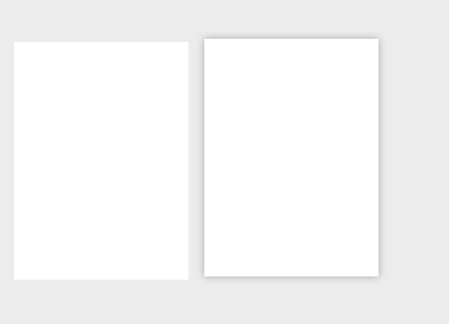
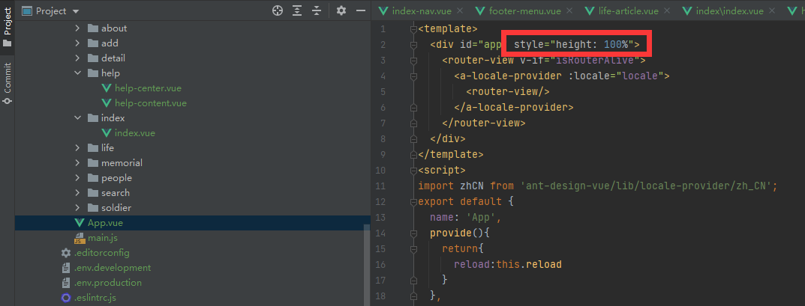
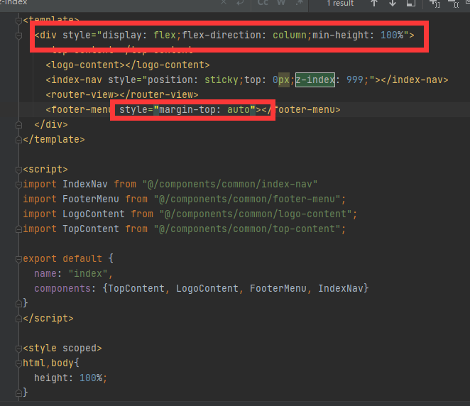

## 鼠标移入样式



```css
.box4, .box5{
    width: 220px;
    height: 300px;
    background-color: #fff;
    float: left;
    margin: 0 10px;
    transition:all .3s;
}

.box4:hover,.box5:hover{
    transform: translateY(-4px);
    box-shadow: 0 0 10px rgba(0, 0, 0, .3)
}
```


## 设置单行文本超出时的省略号

```css
.box2{
    /* 
        实现显示指定长度的文本,超出的内容显示省略号
        以下设置缺一不可
        
	    white-space 设置网页如何处理空白
        可选值:
            normal 正常
            nowrap  不换行
            pre 保留空白(完全保留,包括换行的空格)
 */
 width: 200px;
 white-space: nowrap;
 overflow: hidden;
 /* 设置省略号 */
 text-overflow: ellipsis;
 }		
```

## 设置多行文本超出时不显示

```css
.content{
  max-height: 66px;
  line-height: 22px;
  /*显示三行，因为行内元素是不能设置高度的，所以加一个block*/
  display: block;
  overflow: hidden;
}
```


## vue项目设置footer沉底效果



