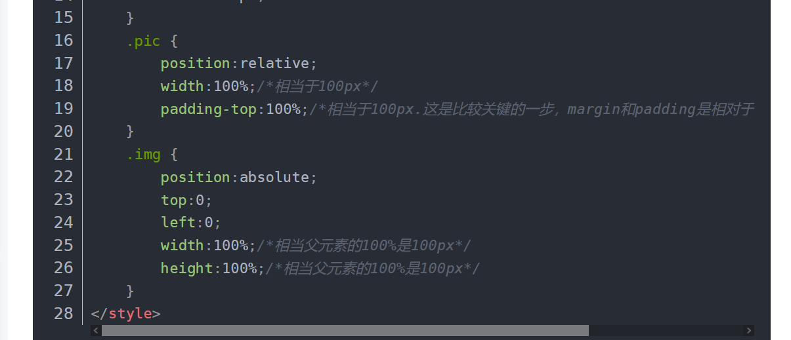

## 1.外边距重叠问题

```css
    /* 设置头像的样式 */
    .icon-wrapper{
        height: 200px;
        /* 解决外边距重叠问题 */
        border: 1px solid transparent;
    }
    .icon{
        width: 100px;
        height: 100px;
        border-radius: 50%;
        margin: 20px auto;
        background-color: #bfa;
    }
```


## 2.鼠标移入有小手

```css
cursor:pointer;
```


## 3.设置flex布局后，左边div固定，需要右边div占满宽度

```css
body{
    display: flex;
    flex-direction: row;
}
//左侧
.besides{
    width: 234px;
    height: 100%;
    background-color: rgb(85, 88, 90);
}
//右侧
.content-wrapper{
    flex:1;
}
```

## 4.利用before设置选中时前面的竖条

```css
/* 设置选中时前面的竖条，需要注意的是他的本质就是active类，不需要再添加一个.active::before类来使他生效 */

.active::before{
    content: '';
    height: 42px;
    width: 4px;
    display: block;
    float: left;
    background-color: aqua;
}
```

## 5、css实现图片正方形显示

.pic是父元素，.img是子元素



## 符号

/ 

. /表示当前目录

../表示上级目录