## 1.基础

### 1. CSS选择器及其优先级

对于选择器的**优先级**

- **标签选择器、伪元素选择器（before，after）：1**
- 类选择器、伪类选择器（hover，nth-child，not）、**属性**选择器：10
- id 选择器：100
- 内联样式：1000

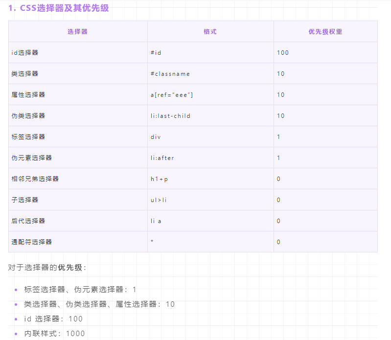

### 2. display的属性值及其作用

块是可以设置宽高的，独占一行，**可以设置**margin和padding

行内块是可以设置宽高的，但是默认是内容宽度，但是默认**不会独占一行。**

行内是不可以设置宽高的，默认是内容宽度，不可以设置**垂直方向**的margin和padding

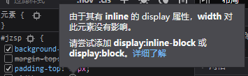

### 3.隐藏元素的方法

- **display: none**：渲染树不会包含该渲染对象（但是dom树中有），因此该元素**不会在页面中占据位置**，也不会响应绑定的监听事件。
- **visibility: hidden**：元素在页面中仍**占据空间**，但是不会响应绑定的监听事件。
- **opacity: 0**：将元素的**透明度设置为 0**，以此来实现元素的隐藏。元素在页面中仍然占据空间，并且能够响应元素绑定的监听事件。
- **position: absolute**：通过使用**绝对定位将元素移除可视区域内**，以此来实现元素的隐藏。
- **z-index: 负值**：来使**其他元素遮盖住该元素**，以此来实现隐藏。
- **transform: scale(0,0)**：将元素**缩放为 0**，来实现元素的隐藏。这种方法下，元素仍在页面中占据位置，但是不会响应绑定的监听事件。

> 注意，隐藏只有opacity会响应事件

### 4. link和@import的区别

两者都是外部引用CSS的方式，它们的区别如下：

- link引用CSS时，在页面载入时**同时加载**；@import需要页面网页**完全载入以后加载**。
- link是XHTML标签，**无兼容问题**；@import是在CSS2.1提出的，低版本的浏览器不支持。

### 5. display:none与visibility:hidden的区别

这两个属性都是让元素隐藏，不可见。**两者区别如下：**

（1）**在渲染树中**

- `display:none`会让元素完全从渲染树中**消失**，渲染时不会占据任何空间；
- `visibility:hidden`不会让元素从渲染树中消失，渲染的元素还会**占据相应的空间，只是内容不可见**。

（2）**是否是继承属性**

- `display:none`是非继承属性，子孙节点会随着父节点从渲染树消失，通过修改子孙节点的属性也无法显示；
- `visibility:hidden`是继承属性，子孙节点消失是由于继承了`hidden`，通过设置`visibility:visible`可以让子孙节点显示；

（3）修改常规文档流中元素的 `display` 通常会造成文档的**重排**，但是修改`visibility`属性只会造成本元素的**重绘**；

> 毕竟元素都没了，肯定要重新排列盒子，元素隐藏还占据原来的位置，就只需要重新绘制这个盒子就行

### 6. **伪元素和伪类的区别和作用？**

- 伪元素：在内容元素的前后插入额外的元素或样式，但是这些元素实际上并不在文档中生成。它们只在外部显示可见，但**不会在文档的源代码中找到它们**，因此，称为“伪”元素。例如：

```css
p::before {content:"第一章：";}
p::after {content:"Hot!";}
p::first-line {background:red;}
p::first-letter {font-size:30px;}
```

- 伪类：将特殊的效果添加到特定选择器上。它是已有元素上添加类别的，不会产生新的元素。例如：

```css
a:hover {color: #FF00FF}
p:first-child {color: red}
```

> 伪元素是不存在的元素，不会在源代码中找到，伪类可以设定元素在某个状态下的样式

### 7. 对盒模型的理解

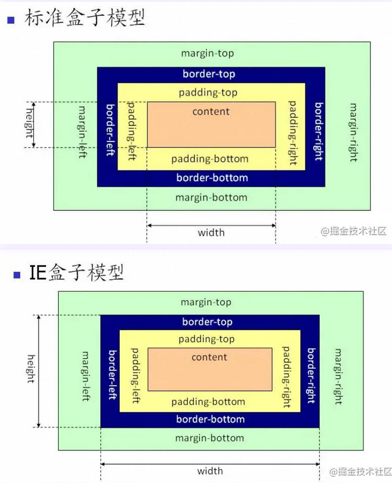

盒模型都是由四个部分组成的，分别是margin、border、padding和content。

标准盒模型和IE盒模型的区别在于设置width和height时，所对应的范围不同：

- 标准盒模型的width和height属性的范围只包含了content，
- IE盒模型的width和height属性的范围包含了border、padding和content。

可以通过修改元素的box-sizing属性来改变元素的盒模型：

- `box-sizeing: content-box`表示标准盒模型（默认值），对象的实际大小由border，padding，width和height决定

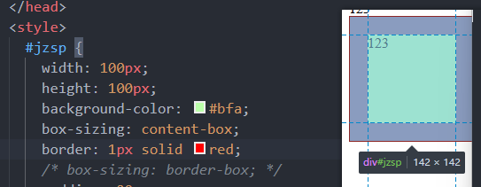

- `box-sizeing: border-box`表示IE盒模型（怪异盒模型）  **对象的实际宽度就等于设置的width值，即使定义有border和padding也不会改变对象的实际宽度；**

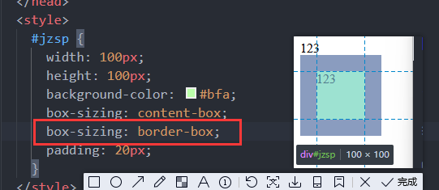

### 8. 为什么有时候⽤**translate**来改变位置⽽不是定位？

translate 是 transform 属性的⼀个值。改变transform或opacity**不会触发浏览器重新布局（reflow）或重绘（repaint）**，只会触发合成（compositions）。

⽽改变绝对定位会触发重新布局，进⽽**触发重绘和复合**。

⽽translate改变位置时，元素依然会占据其原始空间，绝对定位就不会发⽣这种情况。

### 9. CSS3中有哪些新特性

- 新增各种CSS选择器 （: not(.input)：所有 class 不是“input”的节点）
- 圆角 （border-radius:8px）
- 文字特效 （text-shadow）
- 文字渲染 （Text-decoration）
- 线性渐变 （gradient）
- 旋转 （transform）
- 增加了旋转,缩放,定位,倾斜,动画,多背景

### 10. 对 CSSSprites 的理解

CSSSprites（精灵图），将一个页面涉及到的所有图片都包含到一张大图中去，然后利用CSS的 background-image，background-repeat，background-position属性的组合进行背景定位。

**优点：**

- 利用`CSS Sprites`能很好地**减少网页的http请求**，从而大大提高了页面的性能，这是`CSS Sprites`最大的优点；
- `CSS Sprites`能减少图片的字节，把3张图片合并成1张图片的字节总是小于这3张图片的字节总和。

### 11. 对**line-height 的理解及其赋值方式**

**（1）line-height的概念：**

- line-height 指一行文本的高度，包含了字间距，实际上是下一行基线到上一行基线距离；
- 一个容器没有设置高度，那么撑开容器高度的是 line-height，而不是容器内的文本内容；
- **把 line-height 值设置为 height 一样大小的值可以实现单行文字的垂直居中；**

**（2）line-height 的赋值方式：**

- 带单位：px 是固定值，而 em 会参考父元素 font-size 值计算自身的行高
- 纯数字：**会把比例传递给后代**。例如，父级行高为 1.5，子元素字体为 18px，则子元素行高为 1.5 * 18 = 27px
- 百分比：将计算后的值传递给后代

### 12.css性能

（1）尽量减少页面重排、重绘。

（2）属性值为0时，不加单位。

（3）属性值为浮动小数0.**，可以省略小数点之前的0。

（4）标准化各种浏览器前缀：带浏览器前缀的在前。标准属性在后。

（5）不使用@import前缀，它会影响css的加载速度。

（6）选择器优化嵌套，尽量避免层级过深。

（7）css雪碧图，同一页面相近部分的小图标，方便使用，减少页面的请求次数，但是同时图片本身会变大，使用时，优劣考虑清楚，再使用。

### 13.css预处理/后处理器是什么？为什么要使用它们？

**预处理器，** 如：`less`，`sass`，`stylus`，用来预编译`sass`或者`less`，增加了`css`代码的复用性。层级，`mixin`， 变量，循环， 函数等对编写以及开发UI组件都极为方便。

**后处理器，** 如： `postCss`，通常是在完成的样式表中根据`css`规范处理`css`，让其更加有效。目前最常做的是给`css`属性添加浏览器**私有前缀，实现跨浏览器兼容性的问题**。

`css`预处理器为`css`增加一些编程特性，无需考虑浏览器的兼容问题，可以在`CSS`中使用变量，简单的逻辑程序，函数等在编程语言中的一些基本的性能，可以让`css`更加的简洁，增加适应性以及可读性，可维护性等。

### 14. ::before 和 :after 的双冒号和单冒号有什么区别？

（1）冒号(`:`)用于`CSS3`伪类，双冒号(`::`)用于`CSS3`伪元素。 

（2）`::before`就是以一个子元素的存在，定义在元素主体内容之前的一个伪元素。并不存在于`dom`之中，只存在在页面之中。

**注意：** `:before `和 `:after` 这两个伪元素，是在`CSS2.1`里新出现的。起初，伪元素的前缀使用的是单冒号语法，但随着`Web`的进化，在`CSS3`的规范里，伪元素的语法被修改成使用双冒号，成为`::before`、`::after`。

### 15.文本溢出

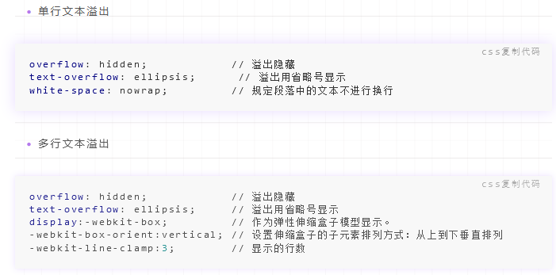

### 16. 如何判断元素是否到达可视区域

以图片显示为例：

- `window.innerHeight` 是浏览器可视区的高度；
- `document.body.scrollTop || document.documentElement.scrollTop` 是浏览器滚动的过的距离；
- `imgs.offsetTop` 是元素顶部距离文档顶部的高度（包括滚动条的距离）；
- 内容达到显示区域的：`img.offsetTop < window.innerHeight + document.body.scrollTop;`

> offsetTop是相对于最近的包含该元素的定位元素或者最近的表格元素

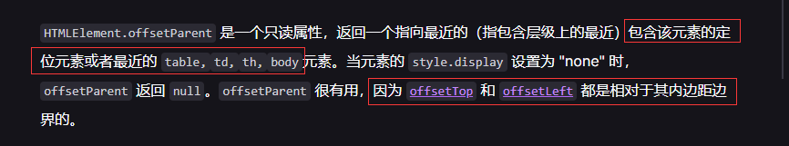


## 2.布局

### 0.position

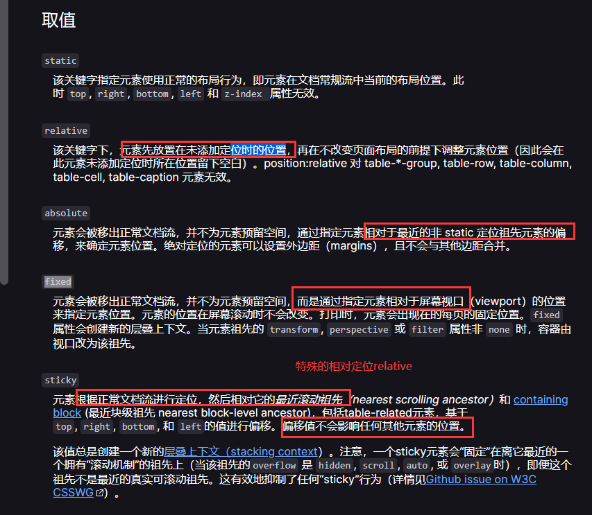


### 1.css布局单位

**（1）em和rem**相对于px更具灵活性，它们都是相对长度单位，它们之间的区别：**em相对于父元素，rem（root em）相对于根元素。**

- 利用rem可以实现简单的响应式布局，可以利用html元素中**字体的大小与屏幕间的比值来设置font-size的值**，以此实现当屏幕分辨率变化时让元素也随之变化。

**（2）vw/vh**是与视图窗口有关的单位，vw表示相对于视图窗口的宽度，vh表示相对于视图窗口高度

- vw：相对于视窗的宽度，视窗宽度是100vw；

- vh：相对于视窗的高度，视窗高度是100vh；

  

### 2.两栏布局（左边定，右边自适应）

- 利用flex布局，将左边元素设置为固定宽度200px，将右边的元素设置为flex:1。

```css
.outer {
  display: flex;
  height: 100px;
}
.left {
  width: 200px;
}
.right {
  flex: 1;
}
```

- 利用绝对定位，将父级元素设置为相对定位。左边元素设置为absolute定位**脱离文档流**，并且宽度设置为200px。将右边元素的margin-left的值设置为200px。

```css
.outer {
  position: relative;
  height: 100px;
}
.left {
  position: absolute;
  width: 200px;
  height: 100px;
}
.right {
  margin-left: 200px;  //因为绝对定位脱离文档流，所以要margin一下挤开
}
```

### 3. 三栏布局的实现

三栏布局一般指的是页面中一共有三栏，**左右两栏宽度固定，中间自适应的布局**，三栏布局的具体实现：

- 利用**绝对定位**，左右两栏设置为绝对定位，中间设置对应方向大小的margin的值。

```css
.outer {
  position: relative;
  height: 100px;
}

.left {
  position: absolute;
  width: 100px;
  height: 100px;
}

.right {
  position: absolute;
  top: 0;
  right: 0;
  width: 200px;
  height: 100px;
}

.center {
  margin-left: 100px;
  margin-right: 200px;   // 挤开左右的宽度
  height: 100px;
}
```

- 利用flex布局，左右两栏设置固定大小，中间一栏设置为flex:1。

```css
.outer {
  display: flex;
  height: 100px;
}

.left {
  width: 100px;
}

.right {
  width: 100px;
}

.center {
  flex: 1;
}
```

### 4.水平垂直布局

- 利用绝对定位，先将元素的左上角通过top:50%和left:50%定位到页面的中心，然后再通过translate来调整元素的中心点到页面的中心。该方法需要**考虑浏览器兼容问题。**

```css
.parent {    
    position: relative;
} 
.child {    
    position: absolute;    
    left: 50%;    
    top: 50%;    
    transform: translate(-50%,-50%); //相对于自身大小计算
}

```

- 利用绝对定位，**设置四个方向的值都为0，并将margin设置为auto，由于宽高固定，因此对应方向实现平分**，可以实现水平和垂直方向上的居中。该方法适用于**盒子有宽高**的情况：

```css
.parent {
    position: relative;
}
 
.child {
    position: absolute;
    top: 0;
    bottom: 0;
    left: 0;
    right: 0;
    margin: auto;
}
```

- 使用flex布局，通过align-items:center和justify-content:center设置容器的垂直和水平方向上为居中对齐，然后它的子元素也可以实现垂直和水平的居中。该方法要**考虑兼容的问题**，该方法在移动端用的较多：

```css
.parent {
    display: flex;
    justify-content:center;
    align-items:center;
}
```

### 5.flex

以下6个属性设置在**容器上**：

- flex-direction属性决定主轴的方向（即项目的排列方向）。
- flex-wrap属性定义，如果一条轴线排不下，如何换行。
- justify-content属性定义了项目在主轴上的对齐方式。
- align-items属性定义项目在交叉轴上如何对齐。
- align-content属性，辅轴空间的分布 (跟主轴的类似)

以下6个属性设置在**项目上**：

- order属性定义项目的排列顺序。**数值越小，排列越靠前，默认为0**。
- flex-grow属性定义项目的放大比例，默认为0，即如果存在剩余空间，也不放大。
- flex-shrink属性定义了项目的缩小比例，默认为1，即如果空间不足，该项目将缩小。
- flex-basis属性指定的是元素在主轴上的基础长度，根据方向决定，默认auto（自身对应方向的长度）
- flex属性是flex-grow，flex-shrink和flex-basis的简写，默认值为0 1 auto（增，减，基）。
- **align-self属性允许单个项目有与其他项目不一样的对齐方式**，可覆盖align-items属性。默认值为auto，表示继承父元素的align-items属性，如果没有父元素，则等同于stretch。

### 6.flex：1

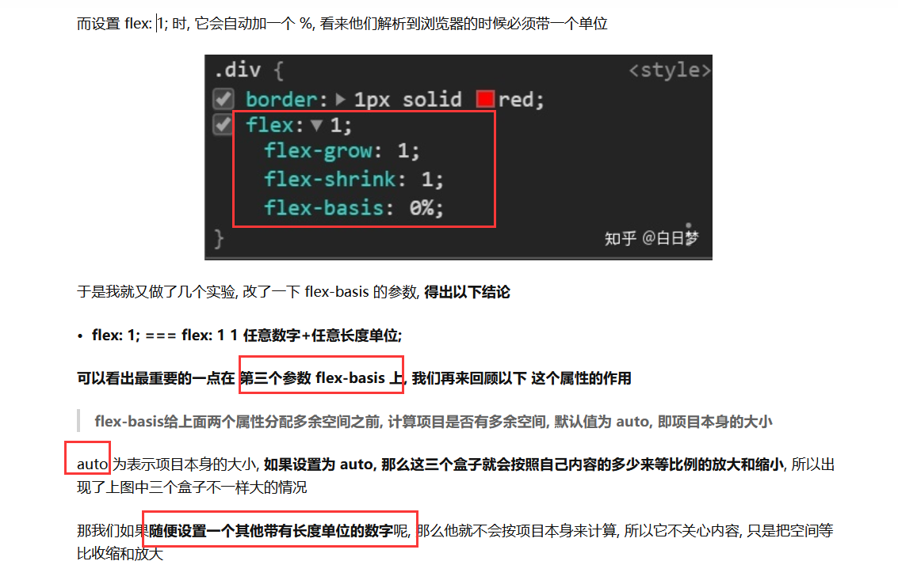

### 6.bfc

如果一个元素符合触发BFC的条件，则BFC中的元素布局不受外部影响。

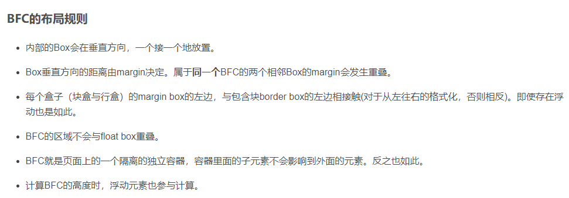

**创建BFC的条件：**

- 根元素：body；
- 元素设置浮动：float 除 none 以外的值；
- 元素设置绝对定位：position (absolute、fixed)；
- display 值为：inline-block、table-cell、table-caption、flex等；
- overflow 值为：hidden、auto、scroll；

**BFC的作用：**

- **解决margin的重叠问题**：父子外边距重叠的时候，给父元素开启bfc，就可以使得父元素的布局不受内部影响，就不回产生外边距重叠问题。
- **解决高度塌陷的问题**：在对子元素设置浮动后，父元素会发生高度塌陷，也就是父元素的高度变为0。解决这个问题，只需要把父元素变成一个BFC。**常用的办法是给父元素设置`overflow:hidden`**。

## 3.应用

### 1.绘制三角形

宽高为0，设置较大的border，将其余三个border的颜色设置为透明即可

```css
    .jzsp1 {
      width: 0;
      height: 0;
      border: 100px solid;
      border-right-color: blue;
      border-left-color: transparent;
      border-top-color: transparent;
      border-bottom-color: transparent;
    }
```


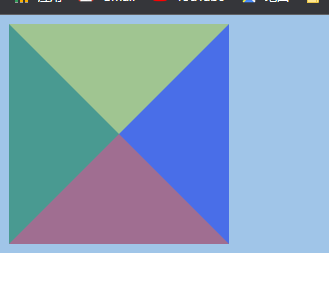

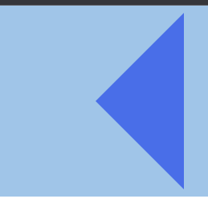

### 2.实现宽高自适应的正方形

- 利用vw来实现：

```css
.square {
  width: 10%;
  height: 10vw;
  background: tomato;
}
```

- **利用元素的margin/padding百分比是相对父元素width的性质来实现**

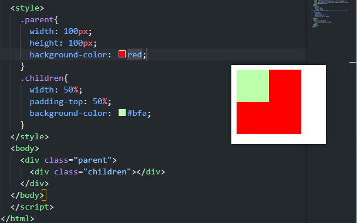

```css
.square {
  width: 20%;
  height: 0;
  padding-top: 20%;
  background: orange;
}
```

### 3.画一条0.5px的线

- **采用`transform: scale()`的方式**，该方法用来定义元素的2D 缩放转换：

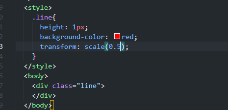

## 4.原理

### CSS解析规则

浏览器会从右往左（从下向上-树形）解析CSS选择器，减少遍历失败回溯的次数

```html
<style>
.header .title span { color: red; }
</style>
```

浏览器匹配规则如下

**先匹配 `span `元素，然后向上寻找 `.title `和 `.header` 的节点，直到根元素 html 结束**

#### CSS加载会阻塞DOM吗

CSS会阻塞JS执行，但不会阻塞JS文件的下载

- 浏览器在渲染页面的时候，如果JS在此期间同步操作样式或者获取样式，会导致页面渲染混乱，所以需要**等待CSS加载完才能执行JS**
- JS文件与CSS文件下载是并行的，CSS文件会在后面的JS文件执行前先加载执行完毕，所以CSS会阻塞后面JS的执行

#### CSS不会阻塞DOM的解析，但会阻塞DOM的渲染

- 浏览器在生成**DOM树和CSSOM树通常是并行构建的**，所以CSS不会阻塞DOM的解析
- 浏览器在渲染等待DOM树和CSSOM树**构建完成生成render树才开始渲染**，所以CSS加载会阻塞DOM的渲染