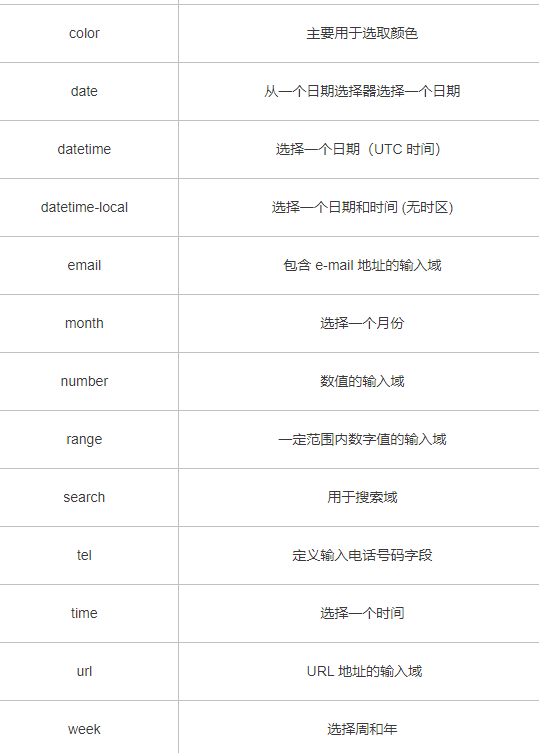

### 1. src和href的区别

src和href都是**用来引用外部的资源**，它们的区别如下：

- **src：** 表示对资源的引用，**它指向的内容会嵌入到当前标签所在的位置**。src会将其指向的资源下载并应⽤到⽂档内，如请求js脚本。当浏览器解析到该元素时，**会暂停其他资源的下载和处理**，直到将该资源加载、编译、执⾏完毕，所以⼀般**js脚本会放在页面底部。**
- **href：** 表示**超文本引用**，它指向一些网络资源，建立和当前元素或本文档的链接关系。当浏览器识别到它他指向的⽂件时，就会并⾏下载资源，**不会停⽌对当前⽂档的处理**。 常用在a、link等标签上。

> 主要区别：会不会停止对当前文档的处理

### 2. 对HTML语义化的理解

**语义化是指根据内容的结构化（内容语义化），选择合适的标签（代码语义化）**。通俗来讲就是用正确的标签做正确的事情。

语义化的优点如下：

- 对机器友好，带有语义的文字表现力丰富，更适合搜索**引擎的爬虫爬取有效信息，有利于SEO**。除此之外，语义类还支持读屏软件，根据文章可以自动生成目录；
- 对开发者友好，使用语义类标签**增强了可读性**，结构更加清晰，开发者能清晰的看出网页的结构，便于团队的开发与维护。

### 3.HTML5新特性

- 新增了一些语义化标签：例如header，footer，aside，nav

- 新增了一些媒体标签：audio，video

- 拥有多个新的表单 Input 输入类型。这些新特性提供了更好的输入控制和验证，表单也新增了一些属性。
  - placehoder 属性，简短的提示在用户输入值前会显示在输入域上。即我们常见的输入框默认提示，在用户输入后消失。
  - required  属性，是一个 boolean 属性。要求填写的输入域不能为空



- 新增了canvas和svg。。但是我没用过
- 新增了dom查询的api（querySelector和querySelectorAll）

浏览器存储方案、history

### 4  行内元素有哪些？块级元素有哪些？ 空(void)元素有那些？

- 行内元素有：` span img input strong`；
- 块级元素有：`div ul ol li dl dt dd h1 h2 h3 h4 h5 h6 p`；

空元素，即没有内容的HTML元素。空元素是在开始标签中关闭的，也就是空元素没有闭合标签：

- 常见的有：`<br>`、`<hr>`、``、`<input>`、`<link>`、`<meta>`；

### 5 **iframe 有那些优点和缺点？**

iframe 元素会创建包含另外一个文档的内联框架（即行内框架）。

**优点：**

- 用来加载速度较慢的内容（如广告）
- 可以使脚本可以并行下载
- 可以实现跨子域通信

**缺点：**

- iframe 会**阻塞主页面**的 onload 事件
- 无法被一些搜索引擎索识别
- 会产生很多页面，不容易管理

### 6. label 的作用是什么？如何使用？

label标签来定义表单控件的关系：当用户选择label标签时，浏览器会自动将焦点转到和label标签相关的表单控件上。

- 使用方法

```html
<label for="mobile">Number:</label>
<input type="text" id="mobile"/>
```

### 5. 常⽤的meta标签有哪些

`meta` 标签由 `name` 和 `content` 属性定义，**用来描述网页文档的属性**，比如网页的作者，网页描述，关键词等，除了HTTP标准固定了一些`name`作为大家使用的共识，开发者还可以自定义name。

常用的meta标签： 

- `charset`，用来描述HTML文档的编码类型：

```html
<meta charset="UTF-8" >
```

- `keywords`，页面关键词：

```html
<meta name="keywords" content="关键词" />
```

- `description`，页面描述：

```html
<meta name="description" content="页面描述内容" />
```

- `viewport`，适配移动端，可以控制视口的大小和比例：

```html
<meta name="viewport" content="width=device-width, initial-scale=1, maximum-scale=1">
```