##  数据类型

### 1.js的数据类型

string，number，boolean，undefined，null，object，**bigint，symbol**

基本数据类型：string，number，boolean，null，undefined（栈）

引用数据类型：function，array，object（堆内存）

### 2.数据类型的检测方法

**（1）typeof**，数组、对象、null都会被判断为object

```javascript
console.log(typeof 2);               // number
console.log(typeof true);            // boolean
console.log(typeof 'str');           // string
console.log(typeof []);              // object    
console.log(typeof function(){});    // function
console.log(typeof {});              // object
console.log(typeof undefined);       // undefined
console.log(typeof null);            // object
```

**（2）instanceof**

`instanceof`可以正确判断**对象的类型，原理是判断原型链上是否有右侧对象的原型**

```javascript
console.log(2 instanceof Number);                    // false
console.log(true instanceof Boolean);                // false 
console.log('str' instanceof String);                // false 
 
console.log([] instanceof Array);                    // true
console.log(function(){} instanceof Function);       // true
console.log({} instanceof Object);                   // true
```

可以看到，`instanceof`**只能正确判断引用数据类型**，而不能判断基本数据类型。

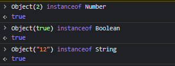

可以像上图一样用**包装类**封装一下再判断

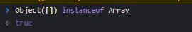

被包裹的引用数据类型也能判断（毕竟会在原型链上找）

**（3）`Object.prototype.toString.call()`**

`Object.prototype.toString.call()` 使用 Object 对象的原型方法 toString 来判断数据类型：

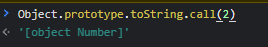

```javascript
const a = Object.prototype.toString;
 
console.log(a.call(2));  //[object Number]
console.log(a.call(true)); //[object Boolean]
console.log(a.call('str'));  //[object String]
console.log(a.call([]));  //[object Array]
console.log(a.call(function(){})); //[object Function]
console.log(a.call({})); //[object Object]
console.log(a.call(undefined));  //[object Undefined]
console.log(a.call(null)); //[object Null]
```

因为toString是Object的原型方法，而Array、function等**类型作为Object的实例，都重写了toString方法**。不同的对象类型调用toString方法时，根据原型链的知识，调用的是对应的重写之后的toString方法，所以应该调用Object原型上的toString方法。

> 总结，typeof不能正确判断对象类型，instanceof不能判断基本数据类型，Object.prototype.toString可以判断这些类型


### 3.判断数组

- 通过`Object.prototype.toString.call()`做判断

```javascript
Object.prototype.toString.call(obj).slice(8,-1) === 'Array';
```

- 通过ES6的Array.isArray()做判断

```javascript
Array.isArrray(obj);
```

- 通过instanceof做判断

```javascript
obj instanceof Array
```


### 3.1 判断整数

- Number.isInteger
- 对1%取模


### 4.null和undefined的区别

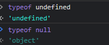

### 5.实现一个instanceof

```js
function myInstanceof(left, right) {
  //如果不存在，返回
  if (!left || !right) return false;
  //获取左边的隐式原型
  let proto = left.__proto__;
  //获取右边的原型对象
  let prototype = right.prototype;

  //查找到顶层
  if (!prototype) return false;
  //相等
  if (proto === prototype) {
    return true;
  } else {
    left = left.__proto__;
    return myInstanceof(left, right);
  }
}
const obj = ()=>{};
console.log(myInstanceof(obj, Function));
console.log(obj instanceof Function);
```

### 6 .  0.1+0.2===0.3

计算机是通过二进制的方式存储数据的，所以计算机计算0.1+0.2的时候，实际上是计算的两个数的二进制的和。0.1的二进制是`0.0001100110011001100...`（1100循环），0.2的二进制是：`0.00110011001100...`（1100循环），**这两个数的二进制都是无限循环的数**。位数52位，指数11位，符号1位。

```javascript
//Number类型中的EPSILON是精度，如果两个差小于精度，那么就是相等
function numberepsilon(arg1,arg2){                   
  return Math.abs(arg1 - arg2) < Number.EPSILON;        
}      
```

### 7. typeof NaN 的结果是什么？

NaN 指“不是一个数字”（not a number），NaN 是一个“警戒值”（sentinel value，有特殊用途的常规值），用于指出数字类型中的错误情况，即“执行数学运算没有成功，这是失败后返回的结果”。

```javascript
typeof NaN; // "number"
```

NaN 是一个特殊值，它和自身不相等，是唯一一个非自反（自反，reflexive，即 x === x 不成立）的值。而 NaN !== NaN 为 true。

### 8.==操作符的强制类型转换规则

如果类型不同

会先判断是不是undefined和null进行==操作

判断是不是string和number（转数字）

判断有没有boolean（boolean转数字）

判断其中一方是否为 `object` 且另一方为 `string`、`number` 或者 `symbol`，是的话就会把 **`object` 转为原始类型再进行判断**

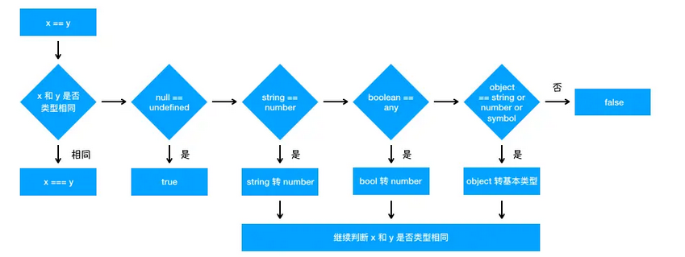


这里涉及到一道面试题

```js
//实现a==1&&a==2&&a==3
let a = {
  i: 1,
  toString() {
    return this.i++;
  },
};
console.log(a == 1 && a == 2 && a == 3);

```

### 9. 其他值到数字值的转换规则？

- **Undefined 类型的值转换为 NaN。**
- Null 类型的值转换为 0。
- Boolean 类型的值，true 转换为 1，false 转换为 0。
- String 类型的值转换如同使用 Number() 函数进行转换，**如果包含非数字值则转换为 NaN，空字符串为 0。**

### 10. 其他值到布尔类型的值的转换规则？（注意负数是真值）

以下这些是假值： • undefined • null • false • +0、-0 和 NaN • ""

假值的布尔强制类型转换结果为 false。从逻辑上说，假值列表以外的都应该是真值。

### 11. Object.is() 与比较操作符 “===”、“==” 的区别？

- 使用双等号（==）进行相等判断时，如果两边的类型不一致，则会进行强制类型转化后再进行比较。
- 使用三等号（===）进行相等判断时，如果两边的**类型不一致时**，不会做强制类型准换，**直接返回 false**。
- 使用 Object.is 来进行相等判断时，一**般情况下和三等号的判断相同**，它处理了一些特殊的情况，**比如 -0 和 +0 不再相等，两个 NaN 是相等的。**

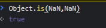

### 12.包装类

在 JavaScript 中，**基本类型是没有属性和方法的**，但是为了便于操作基本类型的值，在调用基本类型的属性或方法时 JavaScript 会在后台隐式地将基本类型的值转换为对象 

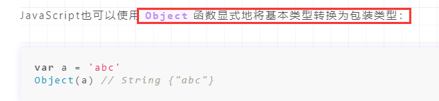

看看如下代码会打印出什么：

```javascript
var a = new Boolean( false );
if (!a) {
	console.log( "Oops" ); // never runs
}
```

答案是什么都不会打印，因为虽然包裹的基本类型是`false`，但是`false`被包裹成包装类型后就**成了对象，所以其非值为**`false`，所以循环体中的内容不会运行。


### 13. isNaN 和 Number.isNaN 函数的区别？

- 函数 isNaN 接收参数后，会尝试将这个参数转换为数值，任何**不能被转换为数值的的值都会返回 true**，因此非数字值传入也会返回 true ，会影响 NaN 的判断。
- 函数 Number.isNaN 会首先判断传入参数**是否为数字**，如果是数字再继续判断**是否为 NaN** ，**不会进行数据类型的转换**，这种方法对于 NaN 的判断更为准确。

### 14.基本数据类型的隐式转化

- +，如果有字符串就都转字符串，否则就都转数字

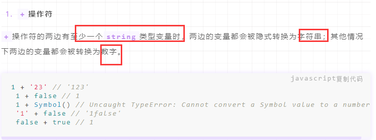

- 减，乘除，转数字

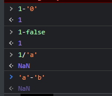

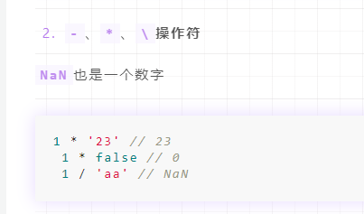

- ==操作符

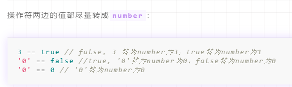

- 大于小于符号

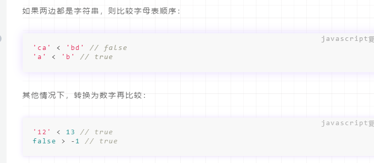

### 15.对象隐式转换之ToPrimitive和valueOf

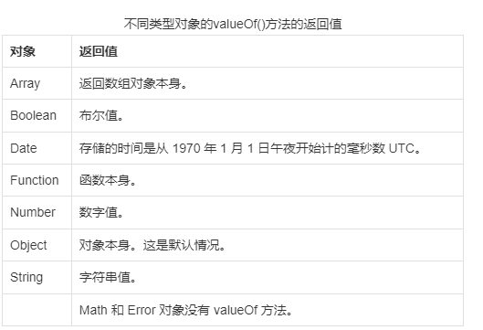

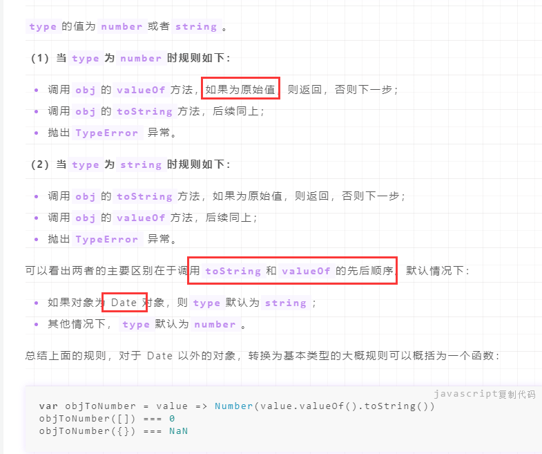

例题

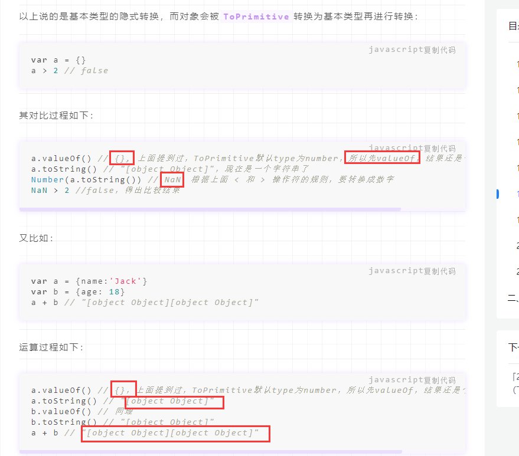

### 16.常用正则

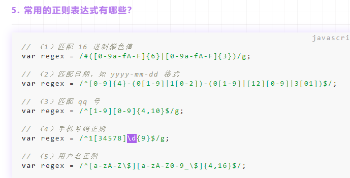

## ES6

### 1. let、const、var的区别

**（1）块级作用域：** 块作用域由 `{ }`包括，let和const具有块级作用域，var不存在块级作用域。块级作用域解决了ES5中的两个问题：

- 内层变量可能覆盖外层变量
- 用来计数的循环变量泄露为全局变量

**（2）变量提升：** var存在变量提升，let和const也有变量提升，但是在声明之前是禁止使用的。

**（3）给全局添加属性：** 浏览器的全局对象是window，Node的全局对象是global。var声明的变量为全局变量，并且会将该变量添加为全局对象的属性，但是let和const不会。

**（4）重复声明：** var声明变量时，可以重复声明变量，后声明的同名变量会覆盖之前声明的遍历。const和let不允许重复声明变量。

**（5）暂时性死区：** 在使用let、const命令声明变量之前，该变量都是不可用的。这在语法上，称为**暂时性死区**。使用var声明的变量不存在暂时性死区。

**（6）初始值设置：** 在变量声明时，var 和 let 可以不用设置初始值。而const声明**变量必须设置初始值。**


### 2.new一个对象的过程

new操作符的实现步骤如下：

1. 创建一个对象
2. 将对象的`__proto__`属性指向构造函数的prototype属性
3. 用call或者apply调用构造函数（也就是为这个对象添加属性和方法）
4. **判断函数返回值类型**，如果是引用数据类型类型，就返回这个引用，否则就返回新建的对象。

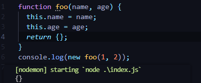


```js
function objectFactory(constructor, ...args) {
  let newObject = null;
  // 判断参数是否是一个函数
  if (typeof constructor !== "function") {
    console.error("type error");
    return;
  }
  // 新建一个空对象，对象的原型为构造函数的 prototype 对象
  newObject = Object.create(constructor.prototype);
  // 将 this 指向新建对象，并执行函数
  const res = constructor.apply(newObject, args);
  return typeof res === 'object' ? res : newObject;
}

function foo(name) {
  this.name = name;
}
console.log(objectFactory(foo, "wjj"));
```

所以箭头函数不能new实例，因为完成不了显示调用构造函数这一步，箭头函数也没有自己的prototype

### 3. 箭头函数与普通函数的区别

- 箭头函数没有自己的this，取决于上下文
- 箭头函数不适用于绑定规则
- 箭头函数没有自己的arguments
- 箭头函数不能new对象，所以没有自己的prototype

```js
let fn = () => {};
console.log(fn.prototype);  // undefined
```


### 4. map和Object的区别

|              | Map                                                          | Object                                           |
| ------------ | ------------------------------------------------------------ | ------------------------------------------------ |
| **键的类型** | Map的键可以是任意值，包括函数、对象或任意基本类型。          | Object 的键必须是 String 或是Symbol。            |
| **键的顺序** | Map 中的 **key 是有序的**。因此，当迭代的时候， Map 对象以插入的顺序返回键值。 | Object 的键是无序的                              |
| **迭代**     | Map 是 iterable 的，所以可以直接被迭代。                     | 迭代Object需要以某种方式获取它的键然后才能迭代。 |

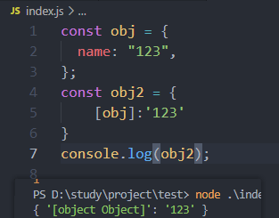

### 5.map和weakMap的区别

map各种类型的值（包括对象）都可以当作键。

WeakMap 对象也是一组键值对的集合，其中的键是弱引用的。**其键必须是对象**，原始数据类型不能作为key值，而值可以是任意的。而且 WeakMap 的键名所指向的对象，不计入垃圾回收机制。

### 6.类数组对象

一个拥有 length 属性和若干索引属性的对象就可以被称为类数组对象，类数组对象和数组类似，但是不能调用数组的方法。常见的**类数组对象有 arguments 和 DOM 方法的返回结果**，还有一个**函数**也可以被看作是类数组对象，因为它**含有 length 属性值，代表可接收的参数个数。**

常见的类数组转换为数组的方法有这样几种：

（1）通过 call 调用数组的 slice 方法来实现转换

```javascript
Array.prototype.slice.call(arrayLike);
```

（2）通过 拓展运算符（只有可迭代的对象才可以这样转数组，显然function不行）

```javascript
[...arrayLike]
```

（3）通过 Array.from 方法来实现转换

```javascript
Array.from(arrayLike);
```


### 7. 什么是 DOM 和 BOM？

- DOM 指的是**文档对象模型**，它指的是把文档当做一个对象，这个对象主要定义了处理网页内容的方法和接口。
- BOM 指的是**浏览器对象模型**，它指的是把浏览器当做一个对象来对待，这个对象主要定义了与浏览器进行交互的法和接口。BOM的核心是 window，而 window 对象具有双重角色，它既是通过 js 访问浏览器窗口的一个接口，又是一个 Global（全局）对象。这意味着在网页中定义的任何对象，变量和函数，都作为全局对象的一个属性或者方法存在。window 对象含有 location 对象、navigator 对象、screen 对象等子对象，并且 DOM 的最根本的对象 document 对象也是 BOM 的 window 对象的子对象。

### 8. 什么是尾调用，使用尾调用有什么好处？

尾调用指的是**函数的最后一步调用另一个函数**。代码执行是基于执行栈的，所以当在一个函数里调用另一个函数时，会保留当前的执行上下文，然后再新建另外一个执行上下文加入栈中。使用尾调用的话，因为已经是函数的最后一步，所以这时可以**不必再保留当前的执行上下文，从而节省了内存**，这就是尾调用优化。但是 ES6 的尾调用优化只在**严格模式**下开启，正常模式是无效的。


### 9.ESM和CJS模块的区别

esmodule属于**编译时加载，即静态加载**，在编译时就能够确定模块的依赖关系，以及输入和输出的变量，es模块输出的是**对象的引用**

commonjs属于**运行时加载**，都只有在代码运行时才能确定这些东西。ESM形式的好处是可以做到tree shaking，cjs模块输出的是**对象的拷贝**。

esmodule属于编译时加载，无法像commonjs一般，做到运行时加载。所以，有一个提案，引入import()函数，完成运行时加载，或者叫动态加载。import()和require()相同点都是运行时加载；区别在于，**import()属于异步加载，require()属于同步加载**。

### 10.for...of和for...in的区别

for...in 循环主要是为了遍历对象而生，获取对象的key名，不适用于遍历数组；

for...of 循环可以用来遍历数组、类数组对象，字符串、Set、Map 以及 Generator 对象，它的原理是调用内部的迭代器进行遍历。

用for...of遍历对象

```js
var obj = {
    a:1,
    b:2,
    c:3
};
obj[Symbol.iterator] = function*(){
    var keys = Object.keys(obj);
    for(var k of keys){
        yield [k,obj[k]]
    }
};
```

### 10.1 for...in、Object.keys和Object.getOwnPropertyNames的区别

- for...in会遍历**原型对象**上的**可枚举**属性

- Object.keys只会遍历当前对象上的属性

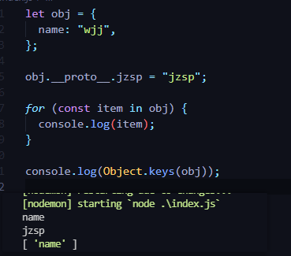

- Object.getOwnPropertyNames可以获取到**当前对象**的不可枚举（Object.defineProperty定义的不可枚举）的属性


### 11. forEach和map方法有什么区别

**详见我的掘金文章**

他们只是有没有返回值的差别，其实都可以改变原数组

## 原型

### 1. 对原型、原型链的理解

在JavaScript中是使用构造函数来新建一个对象的，每一个**构造函数的内部都有一个 prototype 属性**，它的属性值是一个对象，这个对象包含了可以由该构造函数的**所有实例共享的属性和方法**。当使用构造函数新建一个对象后，在这个对象的内部将包含一个指针，这个**指针指向构造函数的 prototype 属性对应的值**，在 ES5 中这个指针被称为对象的原型。一般来说不应该能够获取到这个值的，但是现在浏览器中都实现了 **proto** 属性来访问这个属性，但是最好不要使用这个属性，因为它不是规范中规定的。ES5 中新增了一个 **Object.getPrototypeOf()** 方法，可以通过这个方法来获取对象的原型。

当访问一个对象的属性时，如果这个对象内部不存在这个属性，那么它就会去它的**原型对象**里找这个属性，这个原型对象又会有自己的原型，于是就这样一直找下去，也就是原型链的概念。原型链的尽头一般来说都是 Object.prototype 所以这就是新建的对象为什么能够使用 toString() 等方法的原因。

### 2.原型指向

```js
p.__proto__  // Person.prototype
Person.prototype.__proto__  // Object.prototype
p.__proto__.__proto__ //Object.prototype
p.__proto__.constructor.prototype.__proto__ // Object.prototype
Person.prototype.constructor.prototype.__proto__ // Object.prototype

p1.__proto__.constructor // Person
Person.prototype.constructor  // Person
```

### 3.原型链终点

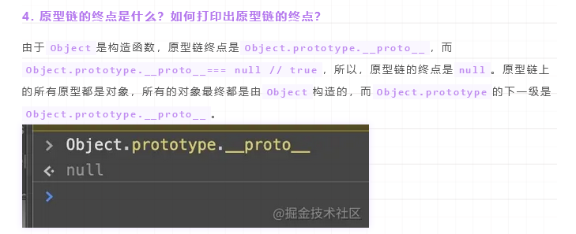

### 4. 如何获得对象非原型链上的属性？

- 使用`Object.keys()`

- 在for in遍历时，使用`hasOwnProperty()`方法来判断属性是否属于原型链的属性：

```javascript
let obj = {
  name: "wjj",
};
console.log(obj.hasOwnProperty("name")); //true

```

## 作用域/闭包

### 1. 对闭包的理解

**闭包是指有权访问另一个函数作用域中变量的函数**，创建闭包的最常见的方式就是在一个函数内创建另一个函数，创建的函数可以访问到当前函数的局部变量。

闭包有两个常用的用途；

- 闭包的第一个用途是使我们在**函数外部能够访问到函数内部的变量**。通过使用闭包，可以通过在外部调用闭包函数，从而在外部访问到函数内部的变量，可以使用这种方法来创建**私有变量**。
- 闭包的另一个用途是使已经运行结束的函数上下文中的变量对象继续留在内存中，因为闭包函数保留了这个变量对象的引用，所以这个变量对象不会被回收。

比如，函数 A 内部有一个函数 B，函数 B 可以访问到函数 A 中的变量，那么函数 B 就是闭包。

```javascript
function A() {
  let a = 1
  window.B = function () {
      console.log(a)
  }
}
A()
B() // 1
```

### 2. 对作用域、作用域链的理解

作用域其实是跟js代码执行流程有关的。当js代码执行前，会对js代码进行解析，同时创建一个GlobalObject对象，这个对象就是全局作用域，里面挂载了原生的一些属性，**当解析到var声明的变量时，会将对应的变量挂载到Go对象上，值为undefined**。当扫描结束的时候，因为js是通过栈来管理执行上下文的，所以会创建一个属于Go的执行上下文并且入栈，入栈之后会进行两步操作：创建Variable Object指向GO；执行代码。在执行代码的时候会对变量进行赋值。

那么函数作用域是什么呢？这涉及到预解析的概念，js为了优化性能，在GlobalObject解析代码的时候，**会对函数进行预解析**。等**到执行函数的时候才会解析函数内部用到的变量。**与解析函数的时候，会在堆内存中创建一个函数对象，里面保存了**父级作用域ParentScope以及函数执行的代码块**，GO解析代码的流程结束开始执行代码的时候，如果执行到函数之前，会创建一个Activation Object对象，创建AO对象的时候会将**函数内部的变量声明挂载到AO上**，并且值为undefined，也会创建函数的执行上下文。在函数执行时，将函数执行上下文入栈，并且将VO指向AO，执行代码。执行代码的时候会对AO的值进行赋值，执行结束会将执行上下文出栈

那么什么是作用域链呢？我们在执行函数的时候，如果用到了某个变量，会在当前函数的VO对象中去寻找变量，如果找不到的话，就会去函数对象中保存的父级作用域的AO中寻找，直到找到顶层。


### 3.对执行上下文的理解

JavaScript引擎使用执行上下文栈来管理执行上下文

当JavaScript执行代码时，首先遇到全局代码，会创建一个全局执行上下文并且压入执行栈中，每当遇到一个函数调用，就会为该函数创建一个新的执行上下文并压入栈顶，引擎会执行位于执行上下文栈顶的函数，当函数执行完成之后，执行上下文从栈中弹出，继续执行下一个上下文。当所有的代码都执行完毕之后，从栈中弹出全局执行上下文。

## this

### 1.this绑定规则

- function中的this
  - 默认绑定（独立调用）指向window
  - 隐式绑定（`obj.foo()`)指向obj
  - 显示绑定，call，apply，bind，指向函数中传入的那个对象
  - new绑定，指向new出来的对象
- 箭头函数中的this
  - 决定于当前的环境，如果箭头函数外面包裹了一层function，那么箭头函数的this就由这个function决定

### 2.实现call、apply、bind

```js
function myCall(thisArg,...args){
    //获取fn对象
    let fn = this
    //判断thisArg的类型
    if(typeof thisArg !== 'object'){
        thisArg = Object(thisArg)
    }
    
    //隐式绑定this
    thisArg.fn = fn
    //调用函数
    return thisArg.fn(...args)
}
```

## 异步编程


## 面向对象


## 常用正则（待完成）

- 匹配手机号：1开头，第二位是34578，结尾9个任意数字

```js
/^1[34578]\d{9}$/g      
```

- 匹配qq号：1-9开头，4位1-9结尾

```js
/^[1-9][0-9]{4,9}$/g
```

- 匹配十六进制颜色：#开头可有可无，后面接上3位或者6位的指定字符（需要用括号包裹，不然就匹配不到#123了因为#会只应用于|前面的部分）

```js
/^#?([0-9a-fA-F]{6}|[0-9a-fA-F]{3})/
```

- 匹配邮箱：`[A-Za-z0-9_\-\.]`匹配1到多个   @    `[A-Za-z0-9_\-\.]`匹配1到多个   .com

```js
/^([A-Za-z0-9_\-\.]+)@([A-Za-z0-9_\-\.]+)\.([A-Za-z]{2,6})/
```


## 面试题

### `['1','2','3'].map(parseInt)`的结果

map的回调函数默认可以传入三个参数

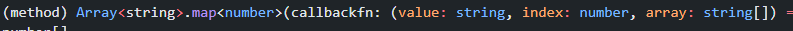

parseInt可以传入两个参数，第一个参数是要转化的字符串，第二个参数是要转化的进制

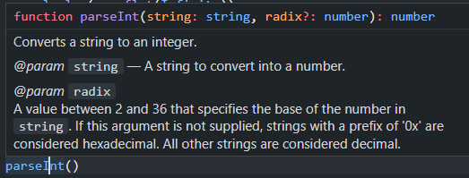

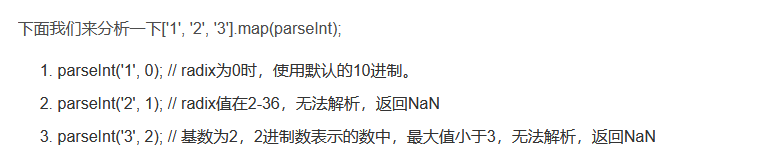

### 实现lodash.get方法（正则）

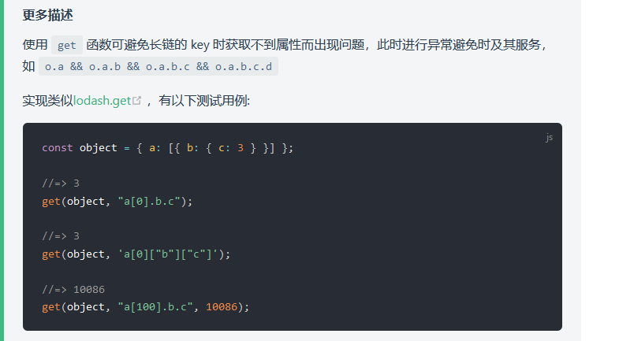

```js
function get(source,path,defaultValue = undefined){
	const paths = path
    	.replace(/\[(\w+)\]/g,".$1")     //(\w+)匹配一个或多个单字字符（字母、数字或者下划线）。等价于 [A-Za-z0-9_]
        .replace(/\["(\w+)"\]/g, ".$1")  //.$1是正则中第1个括号内的内容
    	.replace(/\['(\w+)'\]/g, ".$1")
    	.split('.')
    let res = source
    for(const p of paths){
        console.log(p)
        res = res?.[p]
    }
    return !res ? defaultValue : res
}
const object = { a: [{ b: { c: 3 } }] };
console.log(get(object, 'a[0]["b"]["c"]'))

```

### 实现深拷贝

- function
- set/map
- Array
- Symbol作为value，直接返回，作为key需要调用Object.getOwnPropertySymbols获取Symbol
- 循环引用

```js
function isObject(val){
    let type = typeof val
    return val !== null && (type === 'object' || type === 'function')
}

function deepClone(val,map = new Map()){

    if(typeof val === 'function') return val
    if(val instanceof Set) return new Set(val)
    if(val instanceof Map) return new Map(val)
    if(typeof val === 'symbol') return Symbol(val.description)
    if(!isObject(val)) return val

    if(map.has(val)){
        return map.get(val)
    }
    

    const newObj = Array.isArray(val) ? [] : {}
    map.set(val,newObj)
    //遍历对象的key
    for(const key in val){
        newObj[key] = deepClone(val[key],map)
    }
    const symbolKeys = Object.getOwnPropertySymbols(val)
    
    //遍历数组
    for (const sKey of symbolKeys) {
        newObj[sKey] = deepClone(val[sKey],map)
    }

    return newObj
}
const s2 = Symbol('bbb')
const obj = {
    friend:{
        name:"wjj"
    },
    asd:[1,2,34,5],
    foo:function(){
        console.log(1123)
    },
    s2,
    [s2]:'jzsp',
    s3:new Set([1,2,3,4]),
    s4:new Map([[1,'a'],[2,'b'],[3,'c']]),
}
obj.c = obj
const obj2 = deepClone(obj) 
console.log(obj)
console.log(obj2)
console.log(obj2.s2 === obj.s2)    //false
```

### 实现flatMap函数

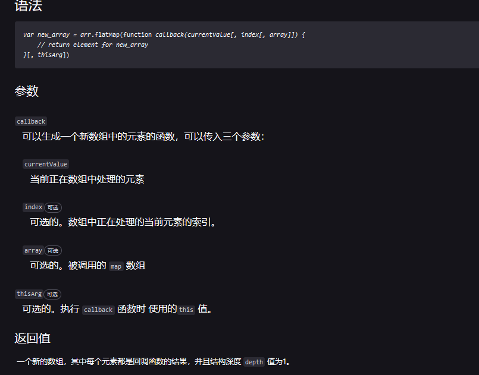

```js
var arr1 = [1, 2, 3, 4];

arr1.map(x => [x * 2]);
// [[2], [4], [6], [8]]

arr1.flatMap(x => [x * 2]);
// [2, 4, 6, 8]

// only one level is flattened
arr1.flatMap(x => [[x * 2]]);
// [[2], [4], [6], [8]]
```


```js
//flatMap其实就是对数组中的每个元素map之后再flat一次，对每个数组元素进行cb操作，然后flat一层
var arr1 = [1, 2, 3, 4];

Array.prototype.FlatMap = function (cb) {  //传入一个回调函数，对数组中每个元素执行一次之后再添加到新数组中
    return this.reduce((o, n) => {
      return [...o,...cb(n)];   //不要忘了return欧
    },[]);
  };
  
console.log(arr1.flatMap(x => [x * 2]))
// [2, 4, 6, 8]
```

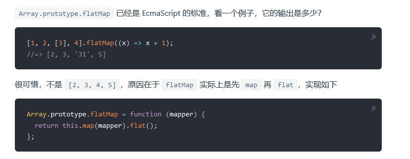

### 实现对象扁平化

```js
const input = {
  a: 1,
  b: [1, 2, { c: true }, [3]],
  d: { e: 2, f: 3 },
  g: null,
};

function flat(obj = {}, preKey = "", res = {}) {
  if (!obj) return;
  for (const [k, v] of Object.entries(obj)) {
    //如果value是数组类型
    if (Array.isArray(v)) {
      //如果遍历的obj是数组类型，就加[]
      let tmp = Array.isArray(obj) ? preKey + "[" + k + "]" : preKey + k;
      flat(v, tmp, res);
    //如果value是对象类型
    } else if (typeof v === "object") {
      //如果遍历的obj是数组类型，就加[].
      let tmp = Array.isArray(obj) ? preKey + "[" + k + "]." : preKey + k + ".";
      flat(v, tmp, res);
    //如果value是普通类型
    } else {
      let tmp = Array.isArray(obj) ? preKey + "[" + k + "]" : preKey + k;
      res[tmp] = v;
    }
  }
  return res;
}

console.log(flat(input));
console.log(Object.entries([1, 2, 3]));

```

### 实现数组扁平化

```js
const arr = [1,2,[3,4,[5,6,[7,8,[9,0]]]]]
console.log(arr.toString().split(',').map(Number))
console.log(arr.flat(Infinity))

function flat (arr){
  return arr.reduce((o,n)=>{
    return o.concat(Array.isArray(n) ? flat(n) : n)
  },[])
}
console.log(flat(arr))
Array.prototype.con
```

### 数组去重、交集、并集

set

```js
let arr = [1,1,1,1,1,1,1]
let res = [...new Set(arr)]
```

filter

```js
let arr = [1,1,1,1,1,11]
let res = arr.filter((item,index,arr)=>{
	// indexof判断item的第一个下标是否是当前的下标
    return arr.indexOf(item) === index
})
```

交集并集

```js
//交集
let arr2 = [1,2,3,4,2]
let result2 = [...new Set(arr2)].filter(item =>new Set(arr).has(item))
console.log(result2);

//并集
let union = [...new Set([...arr,...arr2])]
console.log(union)

//差集（交集的逆运算）  在arr不在arr2
let result3 = [...new Set(arr)].filter(item =>!(new Set(arr2).has(item)))
console.log(result3);
```


## 模块化区别（详见es6）


## TS

### void和undefined的区别

undefined是void的子集，当你对函数返回值不在意时，应该使用void


## Webpack和Vite

1：webpack启动dev server时，会**根据依赖图，打包项目内所有的模块**，打包完成之后服务器才启动成功（bundle-based dev server）

2：vite的dev server基于原生esm模块化的。vite启动dev server的时候不会打包，直接启动server，vite内部会将模块分为两类：依赖和源码，源码指的是会经常改变的模块，依赖指的是变动不大的模块。

对于**依赖**，vite使用**esbuild预构建依赖**（这个过程会将一些Commonjs转成ESM），并且在请求的时候用**强缓存**进行缓存。

对于**源码**，vite以原生ESM方式提供，在浏览器**请求源码时进行转换并且按需提供源码**。也就是说，用到哪个模块就请求哪个模块，而不是一开始全部模块都打包，并且在请求的时候用**协商缓存**进行缓存。

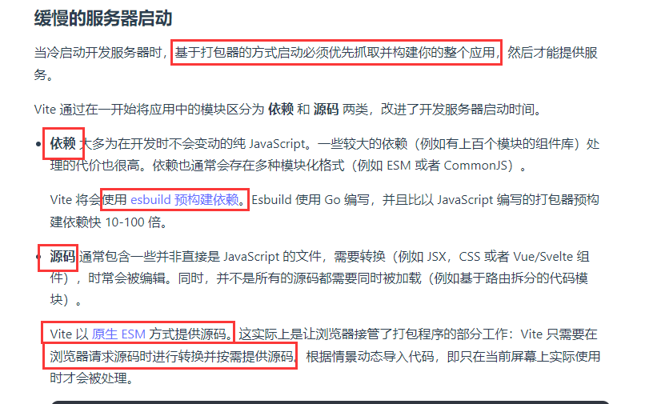

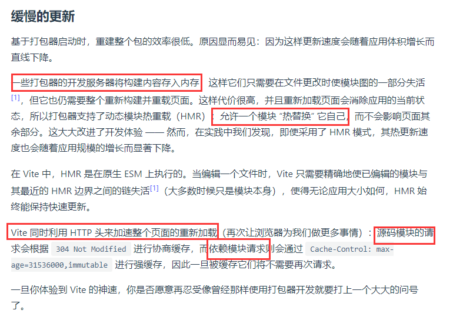

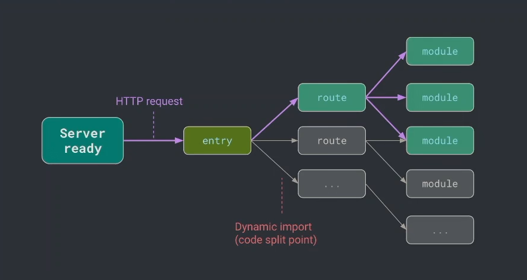