## http

### 常见的http状态码和字段

1xx：提示信息

2xx：表示服务器**成功**处理了客户端请求（如果是非HEAD**请求**，服务器返回的响应头都会有body数据）

- 204 no content，**响应头没有body**
- 206 partial content，分块下载断点续传，表示返回的body是一部分数据

3xx：表示客户端的请求资源发生了**重定向**

- 301 Moved Permanently 永久重定向，说明请求的资源已经不存在
- 302 Found，临时重定向
- 304 Not Modified，缓存重定向，资源在缓存中

4xx：表示**客户端发送的报文有误**

- 401 无效的token
- 403 Forbidden 表示服务器禁止访问资源
- 404 Not Found 表示请求的资源在服务器上不存在
- 429 访问次数过多，限流

5xx：**服务器**处理发生错误

- 501 Not Implemented，客户端请求的功能还不支持“即将开业，敬请期待”
- 502 Bad Gateway，服务器作为网关代理时返回的错误码，服务器正常但是访问后端服务器发生了错误
- 503 Service Unavailable ，服务器繁忙

| 字段名                             | 作用                                                         |
| ---------------------------------- | ------------------------------------------------------------ |
| Host                               | 指定**服务器**的域名                                         |
| Accept`/`Content-type              | 客户端接收的数据类型`/`服务器响应时告诉客户端响应的是什么**格式的数据** |
| Content-length                     | 服务器告诉客户端响应数据的大小                               |
| Connection                         | Tcp持久连接，指定值为keep-alive（兼容老版本http）            |
| accept-encoding`/`content-encoding | 客户端接收的压缩格式`/`服务器响应的**压缩方法**              |
|                                    |                                                              |

### GET（检索和获取）和POST（创建与更新）的区别

- GET请求是从服务器端获取资源，这些资源可以是静态文本，图片等，**get请求的请求数据是放在url中的**，安全性较低
- POST请求是提交数据，数据存储在请求的body中，可以传送多种不同的数据类型

get和post都是安全和幂等的吗？

- 安全：不会破坏服务器上的数据
- 幂等：每次请求返回的结果都是一样的

那么，**get是安全和幂等的，post是不安全的，也不是幂等的**

------

### options请求

- 预检请求options，用于判断当前服务器是否支持跨域请求，以及知道服务端允许的请求方法

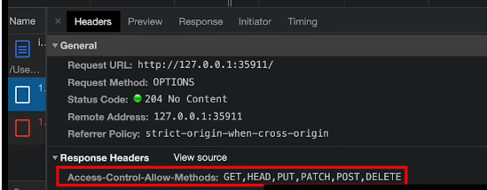

### http缺点和优点

灵活简单，跨平台

缺点：

- **无状态**，无状态的好处是服务器不会去记忆http状态，**不需要额外的资源来记录信息**，能减轻服务器的压力。
- 无状态的坏处是，因为服务器没有记忆状态的能力，那么在进行一些关联性操作就非常麻烦，需要**反复发送请求确认状态**
- **明文传输**，在传输过程中的信息是方便阅读的
- 不安全
  - 通信不加密，明文传输
  - 不验证通信方的身份
  - **无法证明报文的完整性**

### http1.0和http1.1和http2有哪些区别

http1.1相对于http1的改进

- 连接方面：http1.0默认使用非持久连接，http1.1默认使用**持久连接**。

  http1.1通过使用持久连接来使多个http请求**复用同一个TCP连接**，以此来避免非持久连接时每次需要建立连接的时延。

- 请求资源方面：http1.1在请求头引入了**range头域**，允许只请求资源的某个部分，返回值是206

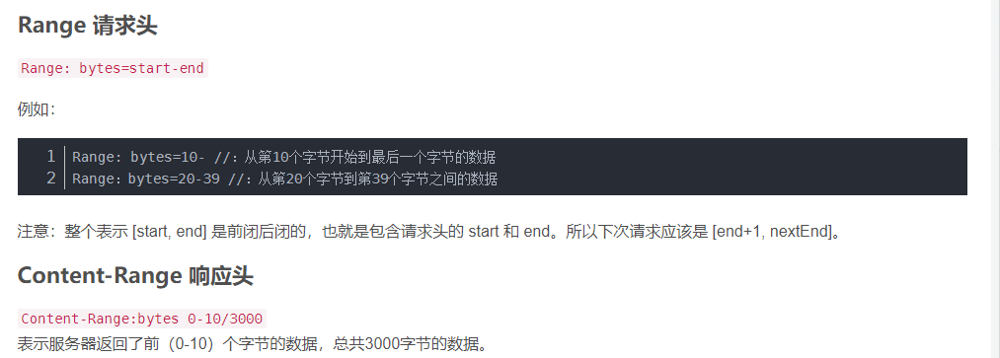

- **管道机制，允许浏览器同时发出A请求和B请求**，但是**服务器还是按顺序响应**（如果前面的请求的响应时间太长，就会造成队头阻塞）

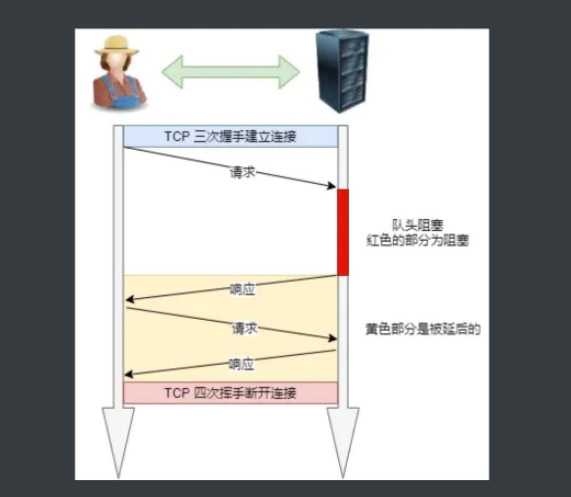

但是还有缺点，http1.1的**头部是不经过压缩就发送**的

服务器是按请求顺序响应的，会造成**队头阻塞**

并且服务器只能被动响应，不能**主动推送**

**http2相对于http1.1的改进**

- http2.0**头部信息压缩**，使用gzip或compress压缩后再发送，如果同时发送多个请求，**头部是相似的话，会消除重复部分**。客户端和服务器会同时维护一张头信息表，所有字段都会存入这个表，生成一个索引号，以后就不发送同样的字段了，只**发送索引号**，能提高速度（**HPACK算法**）。
- http2.0实现了多路复用，可以同时发送多个请求或回应，不用按照顺序一一发送，解决了http1.1的队头阻塞问题。如果服务器收到了A和B两个请求，如果发现A请求特别耗时，那么就**会返回A已经处理好的部分然后去处理B，处理完B在回头处理A剩余的部分**

- http1.1中报文头信息必须是文本，而http2是一个彻底的**二进制协议**（头信息和数据体）

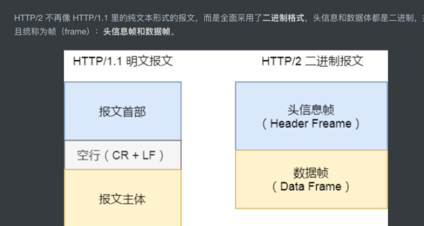

-  HTTP/2 允许服务器未经请求，主动向客户端发送资源，这叫做**服务器推送**
-  可以设定请求优先级。数据流的概念，数据包不是按顺序发送的，**每个请求或响应的所有数据包成为一个数据流**，每个数据流**都标记着一个独一无二的编号**，规定客户端的编号是奇数，服务器发出的数据流的编号位偶数，还可以指定数据流的优先级，让服务器根据优先级做出响应。

### http缓存

输入网站地址到加载出页面会经过**cpu计算，页面渲染，网络请求这些步骤**，其中前面两项是很快的，**不确定因素就是网络请求**。在我们**第一次**用浏览器访问某个网站的时候，需要加载静态资源，那么我们之后再次访问还需要去发送请求吗？我们可以使用缓存，保存浏览器请求的静态资源，可以减少网络请求次数，加快页面渲染。

- 强制缓存，响应头Cache-Control

  如果服务器认为某些资源是需要缓存的，可以在**响应头中设置Cache-Control，设置max-age缓存时间**，浏览器在获取到这个请求的响应结果的时候，就会缓存本次请求的资源，在下次发送同样的请求时，会先在本地缓存中查找（max-age有没有过期），没有过期的话，就会直接获取缓存文件，减少http请求次数。
  
  - max-age是相对时间（使用的更多）
  - expire是绝对时间（会因为用户地区造成偏差）
  - no-cache/no-store
    - no-cache代表**不缓存过期的资源**，缓存会向服务器进行有效处理确认之后处理资源
    - no-store代表不进行缓存

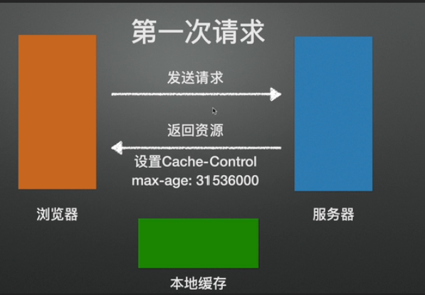

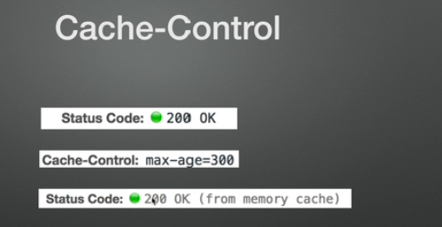

- 协商缓存（对比缓存），服务端缓存策略

如果服务器使用了协商缓存的策略，服务器在响应时就会返回资源和协商标识，浏览器在获取到资源的时候就会放入缓存

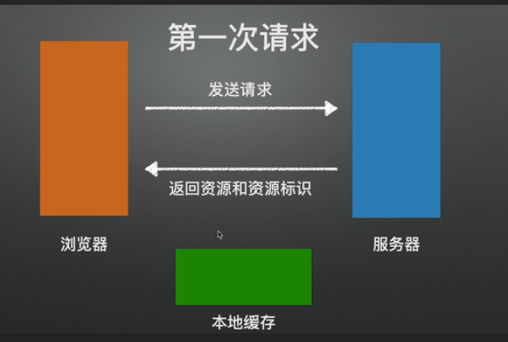

后续请求的时候，会携带上资源标识一起发送给服务器，服务器进行**资源标识判断**，如果服务器判断**资源标识是最新的**，就返回**304状态码**，直接从缓存中获取资源，否则就**返回200以及最新的资源和资源标识**

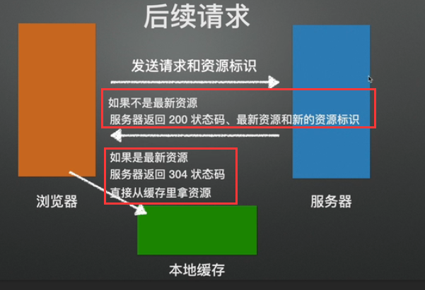

**资源标识介绍**

资源标识有两种

- last-modified：服务器返回，标识资源上次修改的时间

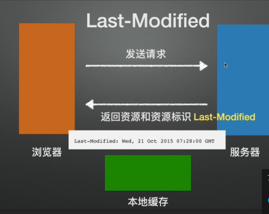

在发送请求的时候，**请求头**中会携带if-Modified-Since（其实就是Last-Modified），在服务器中和Last-Modified进行判断

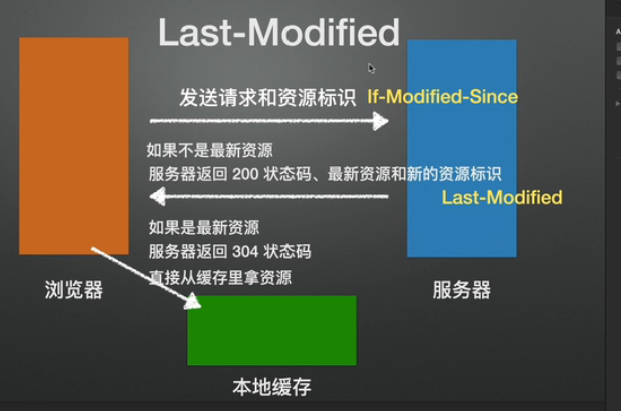

- Etag：服务器返回，资源对应的唯一字符串（更推荐，比较精确）

  

  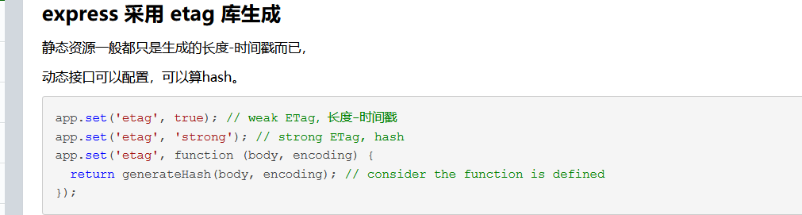

  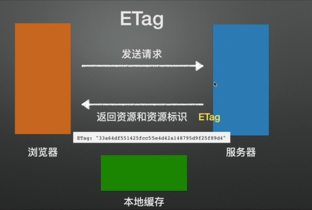
  
  下次请求的时候会在请求头中携带上If-None-Match（其实就是If-None-Match)，在服务器中跟Etag进行对比
  
  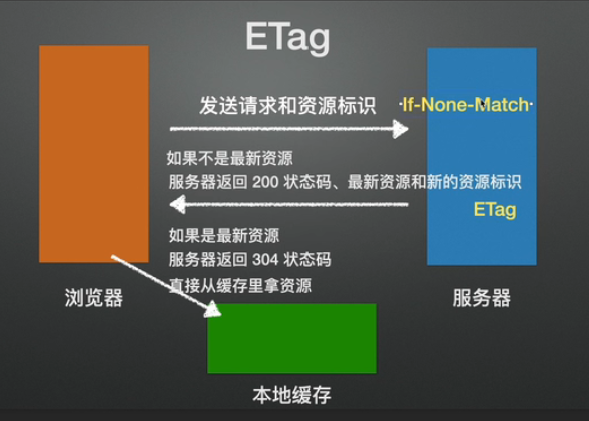

**last-modified和etag的区别**

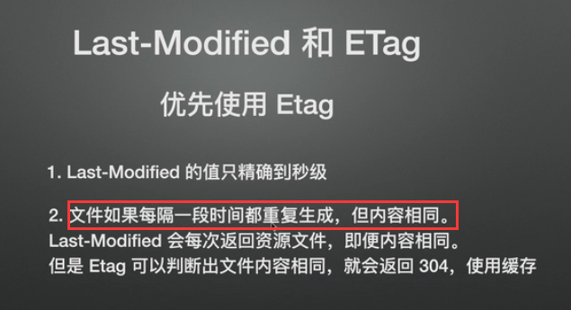

### 浏览器缓存的全过程

- 浏览器**第一次**加载资源，服务器返回 200，浏览器从服务器下载资源文件，并缓存资源文件与**响应头中的缓存信息**，以供下次加载时对比使用；
- 下一次加载资源时，由于**强制缓存优先级较高**，先比较当前时间与上一次返回 200 时的时间差（max-age），**如果没有超过 cache-control 设置的 max-age，则没有过期，并命中强缓存，直接从本地读取资源**。如果浏览器不支持HTTP1.1，则使用 expires 头判断是否过期；
- 如果资源已过期，则表明强制缓存没有被命中，则**开始协商缓存，向服务器发送带有 If-None-Match 和 If-Modified-Since 的请求**；
- 服务器收到请求后，**优先根据 Etag** 的值判断被请求的文件有没有做修改，Etag 值一致则没有修改，命中协商缓存，返回 304；如果不一致则有改动，直接返回新的资源文件带上新的 Etag 值并返回 200；
- 如果服务器收到的请求没有 Etag 值，则将 If-Modified-Since 和被请求文件的最后修改时间做比对，一致则命中协商缓存，返回 304；不一致则返回新的 last-modified 和文件并返回 200；

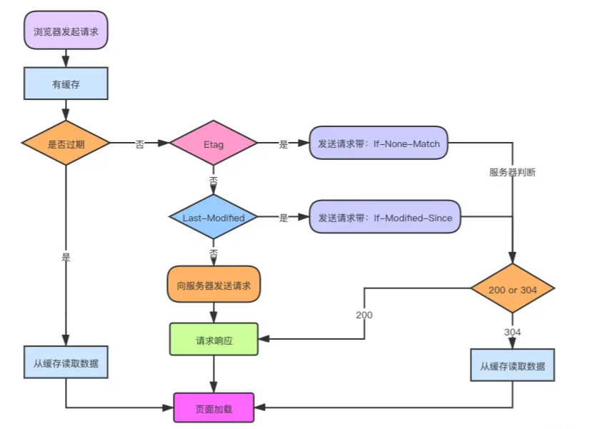

## https

------

### http和https的区别

HTTP和HTTPS协议的主要区别如下：

- HTTP协议是超文本传输协议，信息是**明文传输**的，HTTPS则是具有安全性的SSL加密传输协议，在**TCP和HTTP网络层之间加入了`SSL/TLS`安全协议**，使得报文能够加密传输；
- HTTP连接简单，只需要三次握手之后就可以传输，而HTTPS在三次握手之后**还需要进行SSL/TLS的握手过程**。
- 使用不同的连接方式，端口也不同，HTTP协议端口是80，HTTPS协议端口是443；
- HTTPS需要CA证书

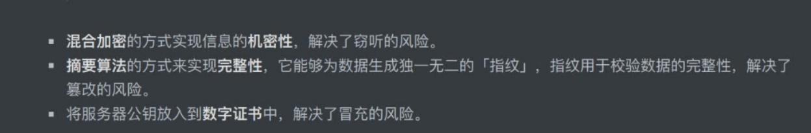

- 混合加密（对称加密和非对称加密）

对称加密指的是，双方用**同一种方式进行加密和解密**

非对称加密指的是，用**两种密钥**进行加密和解密，服务器中保存了**成对 的公钥和私钥**，公布自己的公钥让客户端知道，客户端用公钥把数据进行加密，加密后用公钥无法进行解密，**必须用服务端的私钥才能解密**。

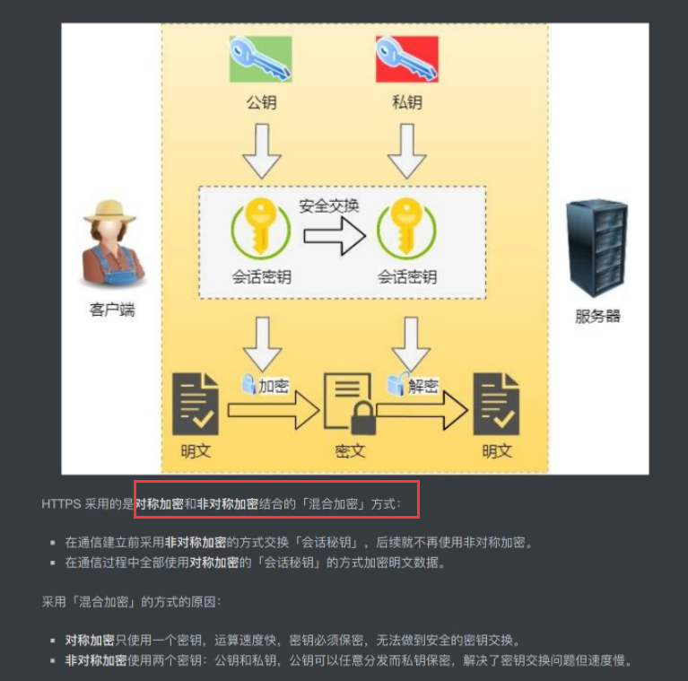

- 摘要算法保证完整性

在发送之前通过摘要算法算出明文对应的**指纹**，将**明文和指纹分别加密**后一起发送给服务器，服务器解密后，用相同的摘要算法**算出发送过来的明文和指纹**，通过比较客户端携带的指纹和当前指纹比较，如果一样就正确

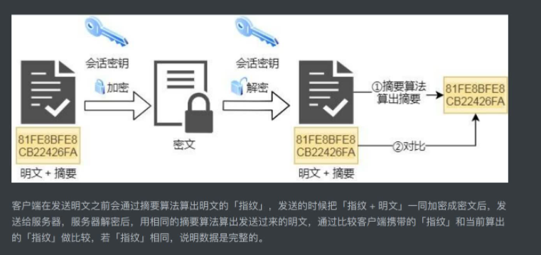

- CA数字证书

### TLS握手过程

- 浏览器发送生成的随机数client-random，对称加密套件，非对称加密套件给服务器
- 服务器保存client-random，发送生成的随机数server-random，以及选中的**加密套件**，以及**公钥**，**证书**
- 浏览器保存server-random，继续**生成随机数pre-master，并且利用公钥加密**，发送给服务器
- 服务器用**私钥解密**，保存pre-master，返回确认信息（至此，服务器和浏览器都有三个随机数：server-random，client-random，pre-master

------

- 服务器和浏览器使用**对称加密的方式**将这**三个随机数**变为**对称密钥**
- 使用对称密钥进行数据传输

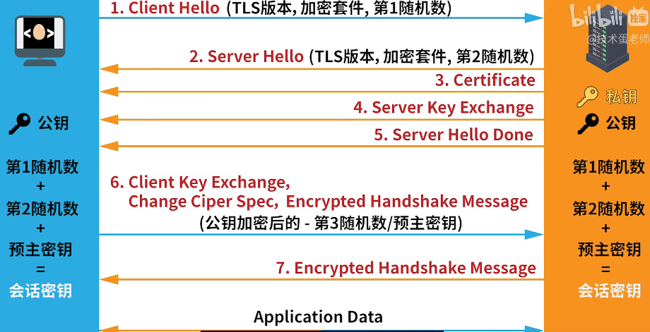

### 浏览器输入地址按下回车发生了什么

- 输入url时候，浏览器会判断是否是url，如果不符合url就用搜索引擎搜索，符合的话就会先在**本地强缓存中查找**。
- 如果命中强缓存（存在并且没过期），就判断强缓存的时间有没有到期，**到期**了的话就进行DNS解析（本地->根->顶级->权威->ip)，
- 解析获取ip之后，**开启协商缓存**，建立TCP连接，发送请求。
- 服务器会根据请求携带的信息判断协商缓存，如果请求头中携带了if-none-match字段，服务器就会将该字段的值与服务器对应资源的etag值进行比较，命中就**返回304状态码**让浏览器在本地获取资源，没命中就返回**200和资源**。
- 如果请求头中没有携带if-none-match字段，就判断请求头中的if-modified-since字段，服务器就会将该字段的值与服务器对应资源的last-modified值进行比较，命中就**返回304状态码**让浏览器在本地获取资源，没命中就返回**200和资源**。
- 请求结束，TCP四次挥手断开TCP连接

- 因为浏览器是无法直接识别HTML字节流的，浏览器获取到HTML文件后，**开启渲染进程，与网络进程建立管道，**网络进程收到的字节流数据不断地通过管道传送给**渲染进程**，**HTML解析器**开始进行词法分析将html字节流分成一个个tokens，进而生成浏览器能够识别的DOM树结构

- 解析CSS文件，生成浏览器能够解析的**styleSheets**结构，计算所有dom元素的样式

- 现在已经有了所有dom元素，我们还需要计算DOM元素的布局信息，保存在布局树中（重排）

- 因为页面是由多个图层构成的，浏览器还会将布局树分层，生成分层树（重排）

- 为每个图层生成**“绘制列表”**（就是一个个绘制指令），提交给**合成线程**（重绘）

  提示：**进程是资源分配的最小单位，线程是CPU调度的最小单位“**

- 合成线程会将图层分为一个个图块（性能），会优先绘制离视口最近的图块，将图块经过光栅化转成位图（合成）

- 所有图块都被光栅化之后，**合成线程发送绘制图块指令给浏览器进程**，浏览器进程就会根据这个指令生成页面

**重排**

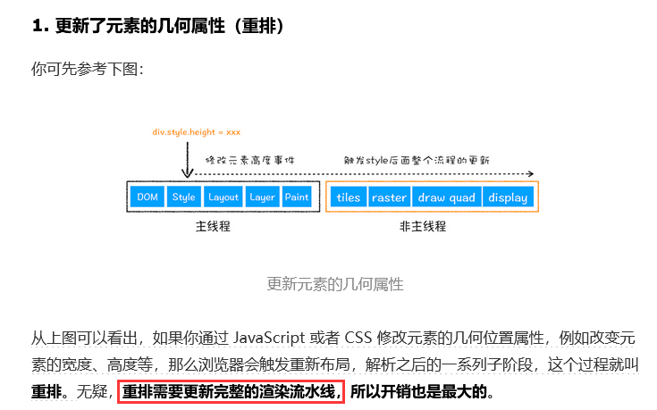

**重绘**

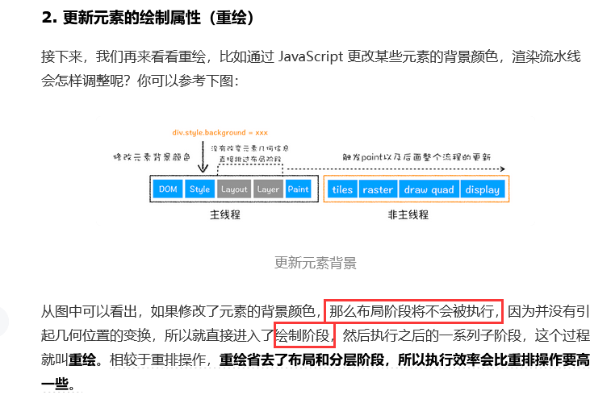

**合成**

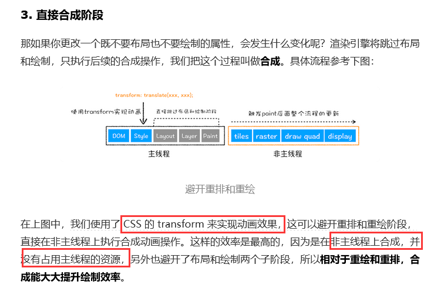

## TCP

### TCP和UDP的区别

因为IP层是不可靠的，所以可靠交付就需要由上层：传输层提供。

- TCP拥塞控制：慢开始，拥塞避免，快重传，快回复

慢开始指的是，**拥塞窗口**的（cwnd）大小从1开始，开始时只发送一个报文段，为了测试网络的拥塞情况，然后逐渐增大cwnd（**成倍**）

拥塞避免的思路是，一开始设定一个门限值，如果满开始达到了这个门限值，就让cwnd**慢慢增大**（加一）

如果拥塞避免阶段出现了网络超时，就调整门限值为超时时刻的cwnd的一半，重新开始慢开始阶段

快重传，是为了让发送方尽可能的知道哪个报文段丢失。要求接收方在收到有序报文数据的时候发送确认报文，

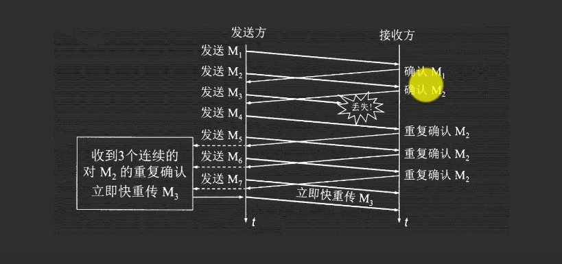

像上面这个例子，如果连续发送m1-m6，但是m3丢失了，那么接收方不会去发送m4-m6的确认报文，而是重复确认m2，也就是说只要发生了丢失，那么接收方就会重复确认之前收到的最近的有序的那个报文（m2），确认三次之后就会触发快重传（快重传可以**避免等待很长的超时时间**），

触发了快重传之后就是快恢复，快恢复就是把发生快重传时的阈值减半。

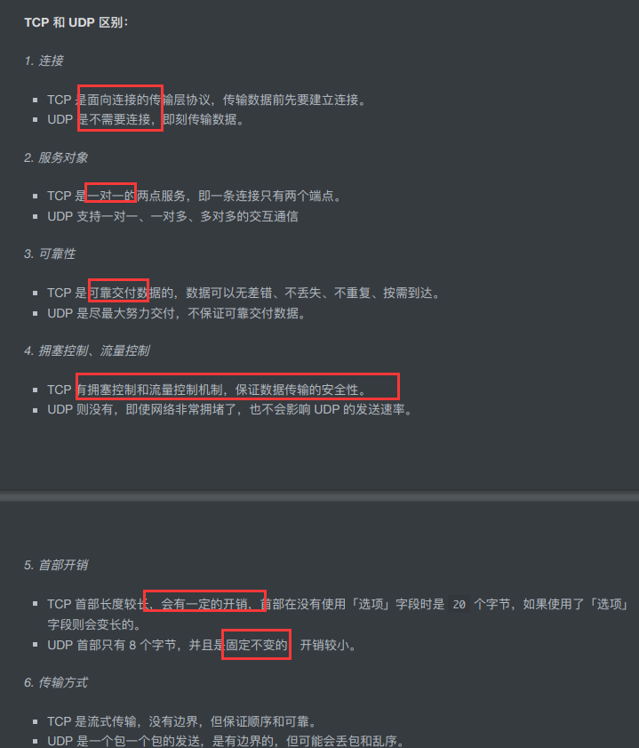

### TCP三次握手

先是客户端生成一个自己的序列号，**填入TCP首部的序号字段**，向服务器发送一个**SYN报文（SYN=1）**并且携带这个序列号

服务端受到这个序列号之后，自己也生成一个序列号，**添加到TCP首部的序号字段**，返回一个**ACK（客户端序列号+1），SYN报文(ACK,SYN=1）**给客户端

客户端受到之后，**在首部的序号字段中加入确认应答号，也就是服务器返回的序号字段+1**，发送（ACK）给服务器，并且第三次握手可以携带数据

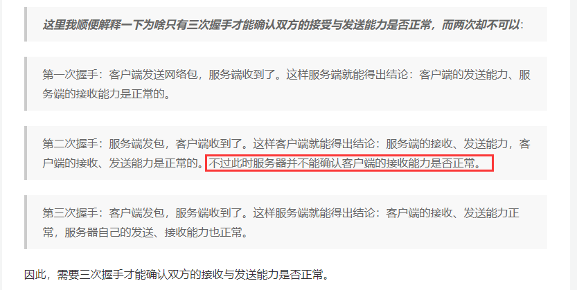

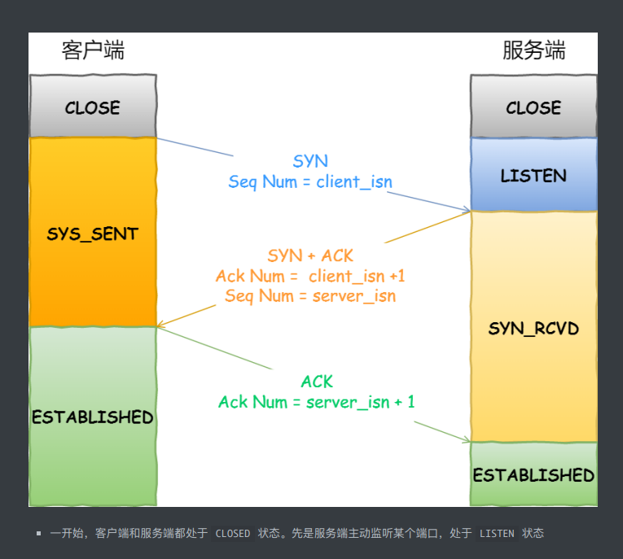

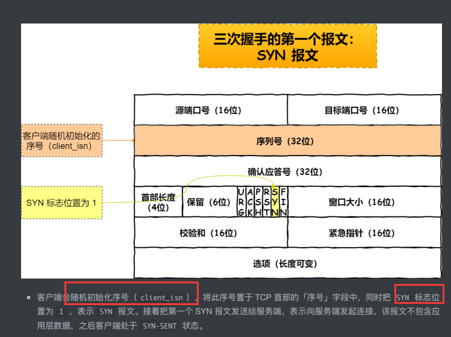

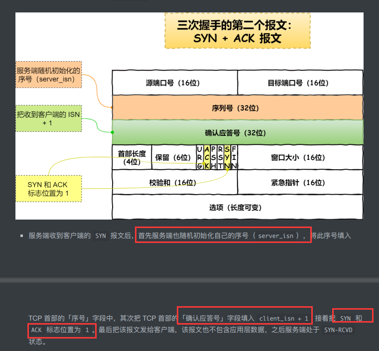

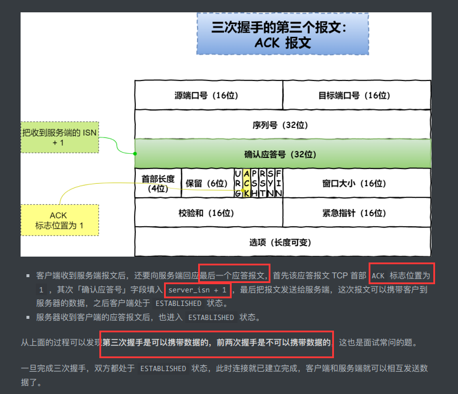

### 为什么要三次握手？为啥不是四次或者两次

- 三次握手可以阻止重复历史连接的初始化

假如在网络拥堵的情况下，发送了序列号为**90**的SYN报文，因为网络阻塞，所以服务器很久没有收到。假设此时又发送序列号为**100**的SYN报文，但是旧的SYN包（序列号为90）此时先到达了，服务器返回确认应答号（91），但是客户端发现不是自己想要的应答号（101），就会发送RST包终止连接。

如果是两次握手连接，就不**能判断当前连接是否是历史连接**，三次握手则可以在客户端（发送方）**准备发送第三次报文时**，客户端因有足够的上下文来判断当前连接是否是历史连接

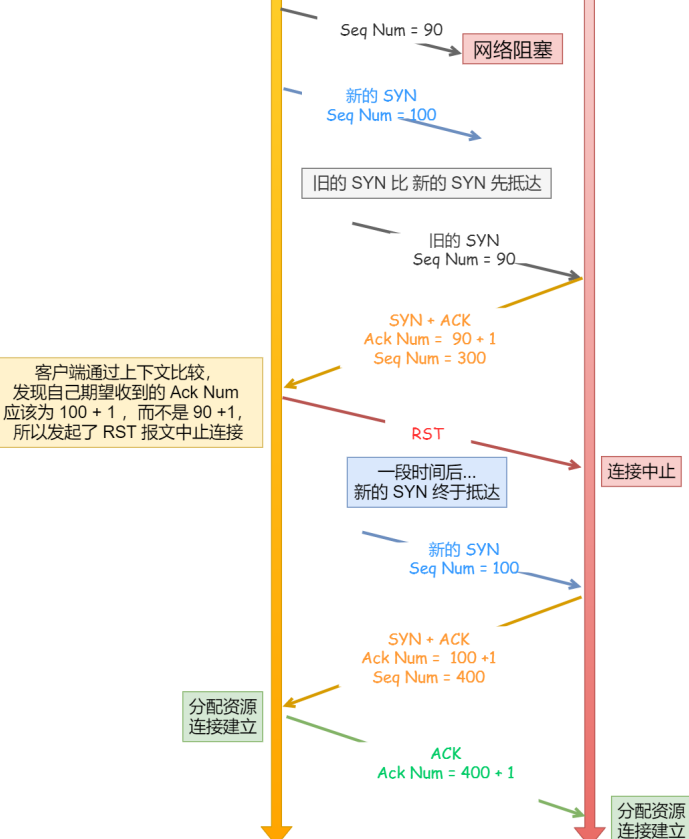

- 同步双方初始序列号

所以当客户端发送携带「初始序列号」的 SYN 报⽂的时 候，**需要服务端回⼀个 ACK 应答报⽂**，表示客户端的 **SYN 报⽂已被服务端成功接收**

那当服务端发送**「初始序 列号」给客户端的时候，依然也要得到客户端的应答回应**，这样⼀来⼀回，才能确保双⽅的初始序列号能被可靠的同步。

第二次握手是服务器告诉客户端，我接收成功

第三次握手是客户端告诉服务器，我接收成功

- 避免资源浪费

如客户端发出连接请求，但因连接**请求报文丢失而未收到确认，于是客户端再重传一次连接请求**。后来收到了确认，建立了连接。数据传输完毕后，就**释放了连接**，客户端共发出了两个连接请求报文段，其中第一个丢失，第二个到达了服务端，但是第一个丢失的报文段只是在某些**网络结点长时间滞留**了，延误到连接释放以后的某个时间才到达服务端

此时服务端**误认为客户端又发出一次新的连接请求**，于是就向客户端发出确认报文段，同意建立连接，不采用三次握手，**只要服务端发出确认，就建立新的连接了**，此时客户端忽略服务端发来的确认，也不发送数据，则服务端一致等待客户端发送数据，浪费资源。

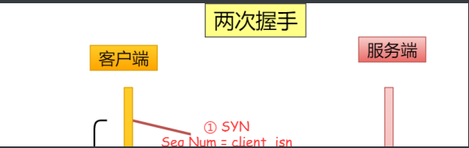

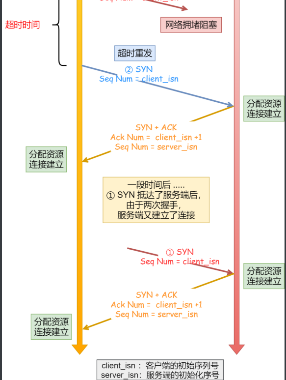

两次握⼿会造成消息滞留情况下，服务器重复接受⽆⽤的连接请求 SYN 报⽂，⽽造成重复复分配资源。

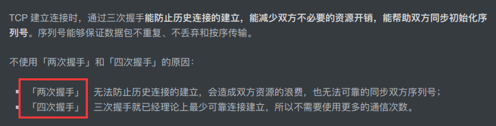

**其实这些都是第三次握手的作用**

第三次握手在握手前，会根据第二次握手获取的ACK SYN报文的**序号字段的内容**，判断当前是否是历史连接

第三次握手在握手时，会告诉服务器，客户端已经接收到第二次握手发过来的包，同步序列号

如果没有第三次握手，服务器就不知道客户端收到了没，每次受到一个SYN包的时候就会主动建立连接，造成资源浪费

### TCP四次挥手

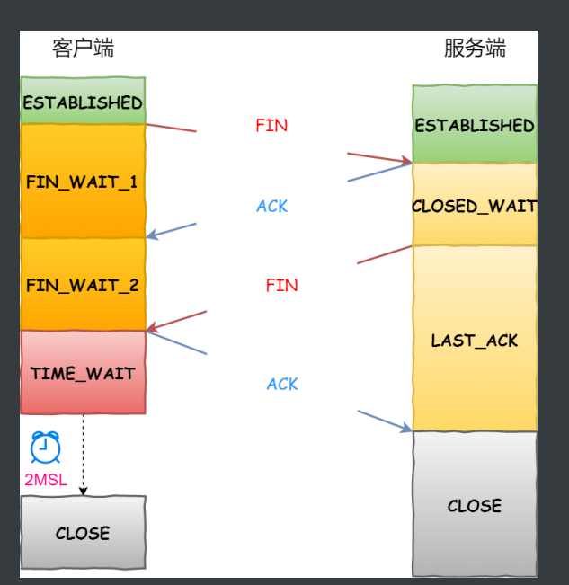

- 客户端打算关闭连接，发送一个FIN报文，客户端会进入FIN_WAIT状态
- 服务器端受到之后，发送ACK报文，处理目前还在处理的数据，此时服务器端进入CLOSE_WAIT状态，客户端进入FIN_WAIT2状态
- 服务器处理完数据后，发送FIN报文，进入LAST_ACK状态
- 客户端受到FIN报文后，发送ACK报文，并且在2MSL之后进入关闭状态，服务器受到ACK报文之后也会进入关闭状态

> 只有主动关闭连接的，才有TIME_WAIT状态

上边我们说了**服务器收到了最后一次的ACK报文之后就会关闭**, 那客户端是不能知道服务器是否收到了这次ACK的, 所以客户端只能在这等待, 如果服务器在"超时时间"内真的没有收到最后一次的ACK,就**会重新发送一次FIN**, 那么在网络极端情况下(网络没断, 但是速度极慢, 需要整整**1MSL的时间才能把报文发送过去**),这次**重发FIN需要1MSL的时间**, 这一来一回需要的时间总和为:服务器超时时间+1MSL, 那为了保险起见,直接让客户端等待2MSL的时间, 如果2MSL之内客户端没有收到重发的FIN, 则默认为服务器**收到了最后一次ACK**,此时客户端就可以执行关闭了.

总的来说就是确保服务端收到最后一个ACK（如果没收到的话，额外需要1个MSL来发送FIN包）

感觉就好像是，客户端告诉服务器“我要走啦”进入“初步等待阶段”，然后服务器告诉客户端“我知道啦”，然后继续处理数据进入“准备下班”阶段，客户端收到服务器发过来的信息之后进入“二次等待阶段”，等到服务器处理完数据，发送“我处理完啦”的FIN包，进入LAST_ACK状态，客户端收到了之后发送给服务器“那我走啦”。。。。只能说很抽象

### TCP是怎么保证可靠传输的？

tcp传输分为三个阶段：建立连接，传输数据，断开连接，其中建立连接就是三次握手阶段，断开连接就是四次挥手阶段，我们主要介绍传输数据。传输数据的可靠性包括：**重传、排序**

在该阶段，接收端需要对每个数据包进行确认操作，也就是在接收端接收到数据包之后，**要发送确认数据包给发送端**。所以当发送端发送了一个数据包之后，在规定时间内没有收到反馈的确认消息，就会认为该数据包**丢失并且重发该数据包**。

同样，一个大的文件在传输过程中会被**分为很多个小的数据包**，这些数据包达到接收端之后，**会按照TCP头部中的序号为其排序，从而组成完整的数据。**

## DNS域名解析过程

首先介绍一下域名的层级关系：

- 根DNS服务器
- 顶级DNS服务器（com）
- 权威DNS服务器（baidu.com)

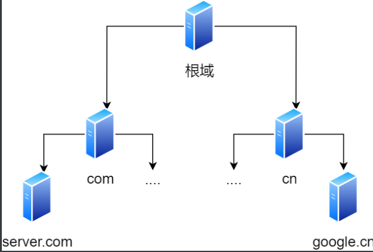

假设我们现在要访问www.baidu.com，那么流程是什么样的呢？

- 客户端首先会发出一个DNS请求给本地DNS服务器
- 本地DNS服务器收到客户端的请求后
  - 如果在**缓存**中能找到对应的域名，就直接返回域名对应的IP地址
  - 如果没有，本地DNS就会访问**根域名服务器**（根域名服务器是最高层次，不直接用于域名解析，但能**指明道路**）
- 根DNS收到请求后，发现是.com，返回.com顶级域名服务器地址
- 本地DNS收到**顶级域名服务器地址**后，继续发送请求给顶级DNS
- 顶级服务器返回www.baidu.com的权威DNS服务器地址
- 本地DNS收到**权威DNS服务器的地址**之后，发送请求给权威DNS服务器，随之获取到对应的IP
- 本地DNS再将IP地址返回给客户端，客户端和目标建立连接

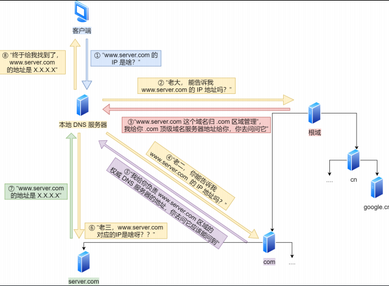

## 浏览器

### 0.浏览器存储

- cookie，服务器受到请求之后会在http响应里添加头部**set-cookie**并且进行标识，浏览器以后**每一次**请求就会添加cookie字段并且携带set-cookie携带的标识，不能超过4kb

  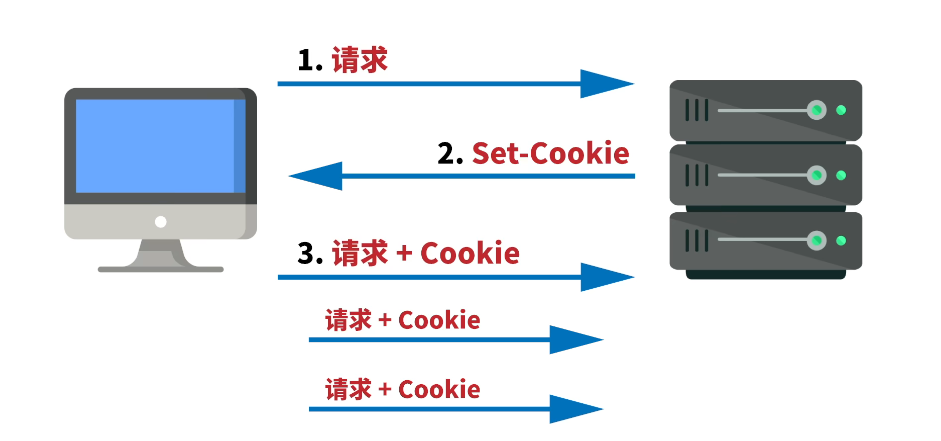

  - 通过document.cookie查看
  - 通过document.cookie赋值的话，对cookie是**累加操作**
  - cookie可以设置过期时间

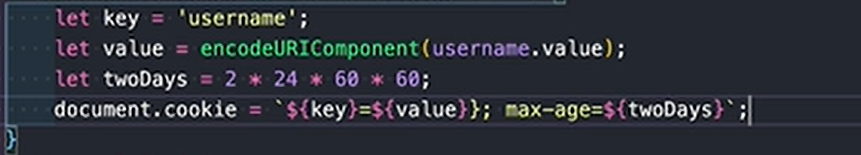

- sessionStorage
  - sessionStorage.setItem/getItem
  - 刷新当前页面，session还存在，打开新的相同的页面，就不存在了
- localStorage
  - localStorage.setItem/getItem
  - 源发生变化时，无法获取对应的值

下图的任何窗口，指的是**同源**前提下

### 1.XSS攻击

- XSS是什么，Cross Site Script（跨站**脚本**攻击）

- XSS攻击原理

  - DOM攻击，根据用户输入动态生成dom节点，如果没有对输入进行过滤，就会导致异常代码插入网页中执行

  

  

  - 存储型：将恶意js**藏入参数中存入服务器**，此时如果服务器将这些恶意的js代码返回给客户端，然后客户端中变成html标签的话就会执行这些恶意js（v-html）。典型的是留言，在数据库中保存了留言信息，在查看留言的时候，就会读取数据库中的代码并且执行，形成xss攻击

  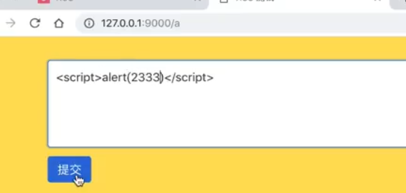

  - 反射型：**url中注入非法脚本传递给服务器**，服务器解析之后响应，将这段代码，**反射传给浏览器**，执行代码（一般浏览器会拦截这种行为），一般是通过邮件等发送这种地址，用户点击之后就可以达到攻击目的

  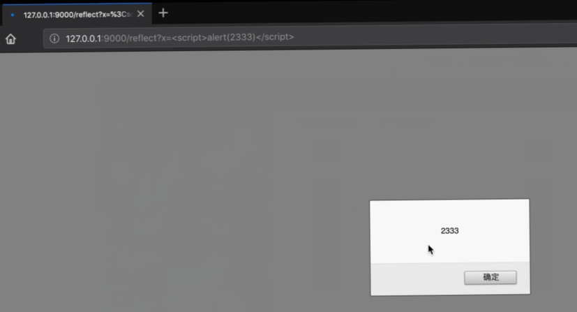

- 存在的原因：**对用户的url以及用户输入的内容没有进行过滤。不合法的内容能够进入web服务器，**在用户再次访问的时候就可能会将对应的恶意代码请求过来并且执行，导致xss攻击

- 预防xss攻击的方法

  - 对输入（和url参数）进行过滤（在后端列出不能出现的脚本名单，一旦出现了就删除，或者列出白名单过滤，列出可以接收的内容，比如规定用户名是6-10位字母数字下划线，其他任何输入都是非法的，会被丢弃，对用户名密码这些可以进行白名单过滤，富文本编辑器用黑名单过滤）

  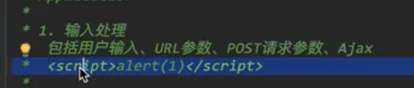

  - 对字符串进行编码，大于号转成&gt这种，

  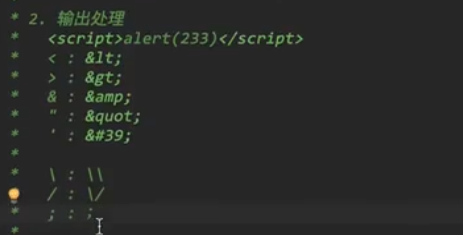

  - 对cookie设置为http-only（js脚本就无法读取到cookie，即使无法获取，但是浏览器也能正常执行）

- nodejs用js-xss库进行过滤

### 2.CSRF跨站请求伪造攻击

- 攻击者会盗用你的身份，以你的名义向网页发送请求，引起个人隐私的泄露

- 如何跨域？

  - html元素的**原生跨域能力：src属性**

- 如何伪造跨站请求？

  - 浏览器自动携带cookie

- CSRF攻击过程

  - 假如在登陆邮箱的时候，**登陆之后**通过cookie**保存用户登陆信息**，没有关闭这个页面，然后又打开了一个恶意的网页
  - 这个恶意的网站，可能会利用图片资源嵌入一些恶意的请求

  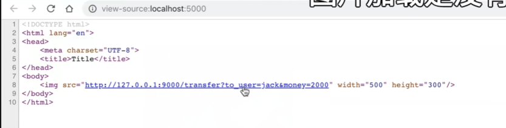

  - 即便是post请求也无济于事，进入页面的时候会自动提交表单，发送post请求

  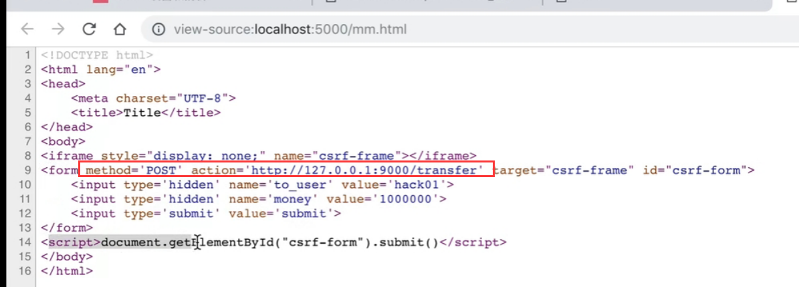

- 本质是后端在验证的时候做的任务太少，只是验证对应的session是否存在

- 预防CSRF
  - 尽量使用POST请求（get请求用img标签很容易被攻击）
  - 加入验证码，提交请求的**时候加入验证码**，确保是用户行为而非黑客行为
  - 后端验证http的Referer字段（利用浏览器功能）**Referer保存了请求来源**
  - cookie双重验证，服务器在用户访问网站页面时，向请求域名注入一个Cookie，内容为随机字符串，然后当用户再次向服务器发送请求的时候，从 cookie 中取出这个字符串，添加到 URL 参数中，然后服务器通过对 cookie 中的数据和参数中的数据进行比较，来进行验证
  - 在请求中**传递token**，这是一个唯一的值，token是存在服务端的，服务端通过拦截器验证有效性（验证之后就要销毁，并且token是随机的，不可重复的）。
  - sameSite属性
  
  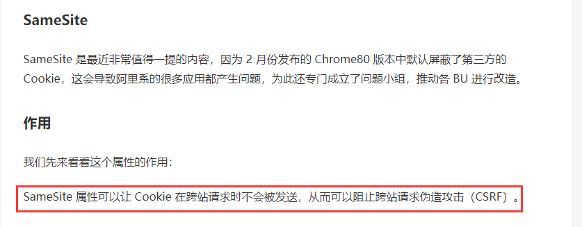
  
  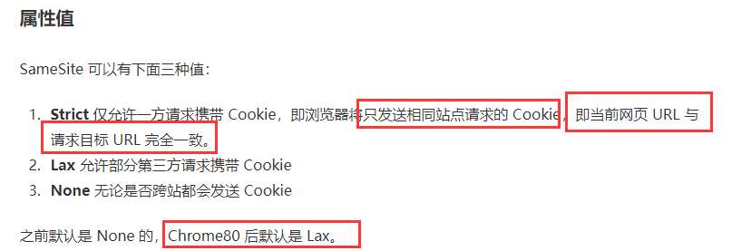
  
  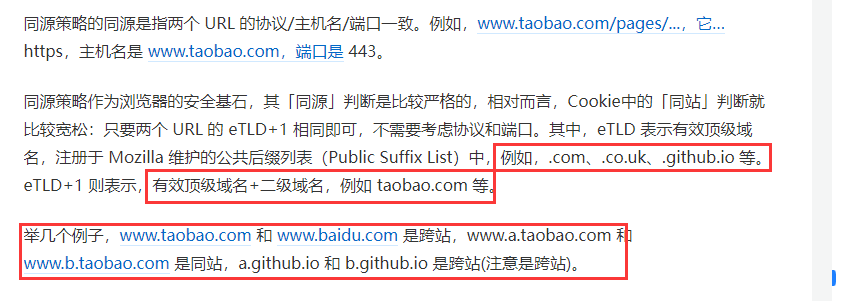
  
  

### 3.处理跨越

- CORS

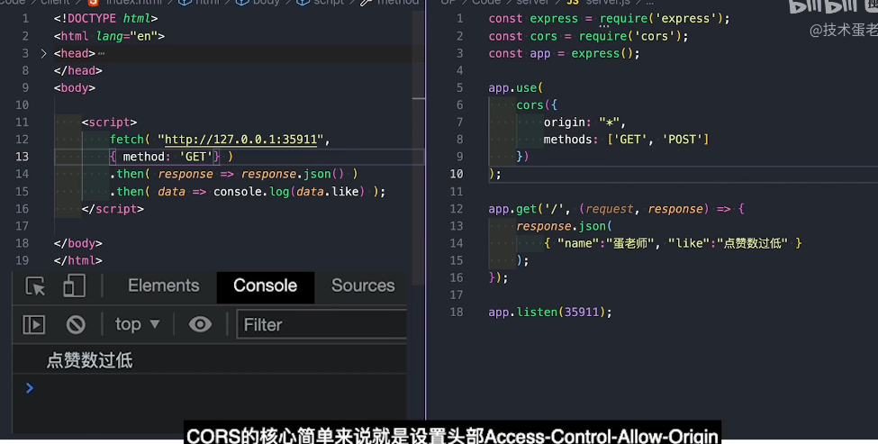

- Nginx反向代理
- webpack的devserver配置Proxy
- JSONP（利用了script标签的原生跨域能力，只支持GET请求）
  - 服务器返回一段可执行的js字符串，里面包含了需要获取的信息

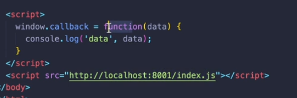

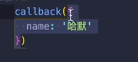

### 4、cookie，session，token（待完成）

#### cookie的作用

因为http是无状态连接，那么有些请求如果需要身份验证的话，客户端就要反复发送请求验证身份。cookie是一种解决办法，就是第一次请求之后，服务器返回一个cookie，在浏览器中保存，以后请求的时候携带上这个cookie，服务器通过cookie来进行状态保存并且验证。