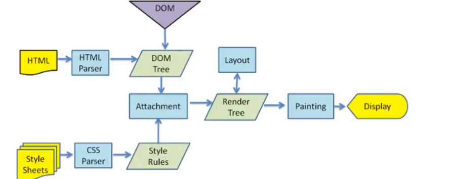
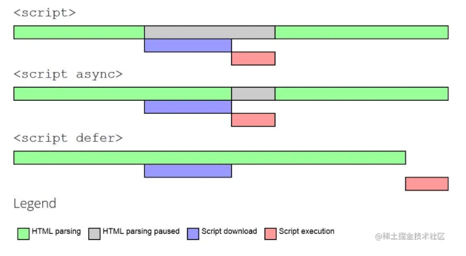

## 浏览器

### 1：script和link标签的位置

CSS不阻塞dom的解析，但阻塞dom的渲染。

CSS不阻塞js的加载，但是会阻塞js的执行。

如果把CSS放在文档的最后面加载执行，CSS不会阻塞DOM的生成，也不会阻塞JS，但是浏览器在解析完DOM后，要花费额外时间来解析CSS，而不是在解析DOM的时候，并行解析CSS。

并且浏览器会先渲染出一个没有样式的页面，等CSS加载完后会再渲染成一个有样式的页面，页面会出现明显的闪动的现象。
所以应该把CSS放在文档的头部，尽可能的提前加载CSS；

把JS放在文档的尾部，这样JS也不会阻塞页面的渲染。CSS会和JS并行解析，CSS解析也尽可能的不去阻塞JS的执行，从而使页面尽快的渲染完成。

### 2：图片相关

- 可以使用IntersectionObserve实现图片**懒加载**
- 原生的方法是，对下面这三个属性进行判断
  - 监听图片的offsettop
  - 窗口的视口高度innerHeight
  - 滚动距离ScrollTop
- **小图片转成base64**，或者合成雪碧图
- 静态背景图，**webp压缩**，放到cdn

### 3：js相关

- 脚本异步加载

async会在异步**加载完成的时候就执行**

defer会在**加载完成并且html解析**完成才执行

- 按需加载（webpack分包）
- treeshaking，terser压缩代码体积
- 防抖和节流

### 4：css相关

- 使用transform（合成）实现动画效果
- 减少回流和重绘

### 4：利用缓存

- 合理利用强缓存（cache-control）以及协商缓存（Etag和last-modified）
- 合理使用localStorage和sessionStorage

## Vue

### 4：vue的编码阶段优化

- v-if和v-for不能连用（v-for优先级更高）
- 如果需要使用v-for给每项元素绑定事件时使用**事件代理**
- SPA 页面采用keep-alive缓存组件
- key保证唯一（更好的diff）
- 使用路由懒加载、异步组件
- 防抖、节流
- 第三方模块按需导入
- 长列表滚动到可视区域动态加载
- 图片懒加载

### 5、webpack打包优化

- Terser等丑化压缩代码
- Tree shaking和Scope Hoisting
- cdn加载第三方模块，externals
- 多线程打包happy pack
- prefetch 和 preload
- 模块懒加载（分包）

### 6、webpack构建原理

从启动webpack构建到输出结果经历了一系列过程，它们是：

1. **解析webpack配置参数**，合并从shell传入和webpack.config.js文件里配置的参数，生产最后的配置结果。
2. **注册所有配置的插件**，好让插件监听webpack构建生命周期的事件节点，以做出对应的反应。
3. 从配置的entry入口文件开**始解析文件构建依赖图**，找出每个文件所依赖的文件，递归下去。
4. 在解析文件递归的过程中根据**文件类型和loader配置找出合适的loader用来对文件进行转换。**
5. 递归完后得到每个文件的最终结果，根据entry配置生成代码块chunk。
6. 输出所有chunk到文件系统。

### 7、loader和plugin的区别

loaders是在打包构建过程中用来处**理源文件**的（JSX，Scss，Less..），一次处理一个

插件并不直接操作单个文件，它直接对整个构建过程其作用。

### 8、webpack和vite的区别

webpack**会先打包，然后启动开发服务器**，请求服务器时直接给予打包结果。 而vite是**直接启动开发服务器**，请求哪个模块再对该模块进行实时编译。 由于现代浏览器本身就支持ES Module，会自动向依赖的Module发出请求。vite充分利用这一点，将开发环境下的模块文件，就作为浏览器要执行的文件，而不是像webpack那样进行打包合并。 由于vite在启动的时候不需要打包，也就意味着不需要分析模块的依赖、不需要编译，因此启动速度非常快。当浏览器请求某个模块时，再根据需要对模块内容进行编译。这种按需动态编译的方式，极大的缩减了编译时间，项目越复杂、模块越多，vite的优势越明显。 在HMR方面，当改动了一个模块后，仅需让浏览器重新请求该模块即可，不像webpack那样需要把该模块的相关依赖模块全部编译一次，效率更高。 当需要打包到生产环境时，vite使用传统的rollup进行打包，因此，vite的主要优势在开发阶段。另外，由于vite利用的是ES Module，因此在代码中不可以使用CommonJS