## vue基础

### -1、vue3的优化

diff算法优化，对静态节点打标记，避免对静态节点的diff

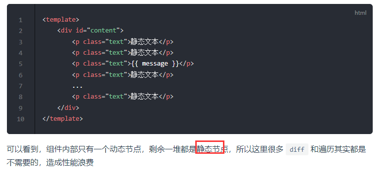

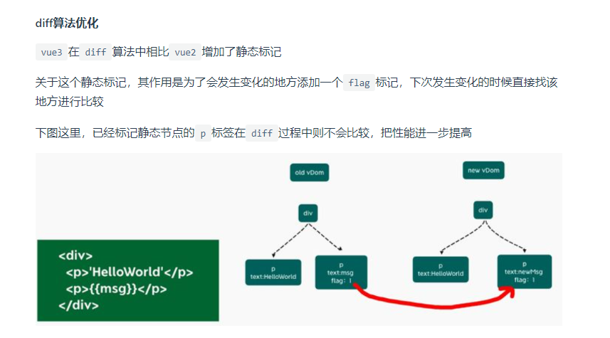

defineProperty改成Proxy

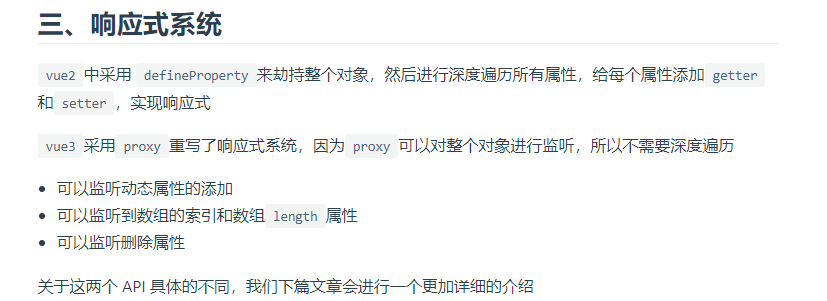

打包优化，支持tree-shaking，会消除掉没有使用到

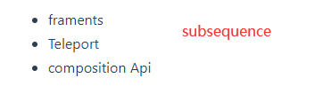

### 0、SPA页面

优点

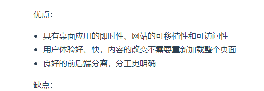

缺点：

首屏渲染慢

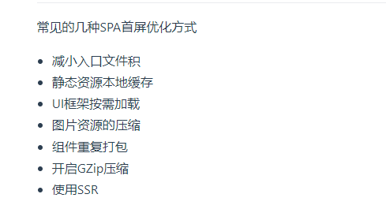


### 1、谈谈对vue的理解（数据双向绑定原理）

在vue创建组件实例时，会遍历data中的属性，用Object.defineProperty进行数据劫持（在vue3中是Proxy），在getter和setter中追踪相关依赖，在属性被访问和修改时通知变化。

通过Proxy改写getter和setter将对象构造成响应式对象，用一个dep类的实例来收集响应式对象中某个属性的函数依赖，在get值的时候会进入proxy，在proxy中获取响应式对象对应属性的dep实例，并且收集函数依赖。在响应式数据变化时，获取到对应数据的dep实例，调用notify方法触发所有收集到的函数。

### 2.MVC和MVVM

**View 负责页面的显示逻辑，Model 负责存储页面的业务数据，Controller 层是 View 层和 Model 层的纽带**，它主要负责用户与应用的响应操作

**当用户与页面（view层）产生交互的时候，Controller 中的事件触发器就开始工作了，通过调用 Model 层，来完成对 Model 的修改，然后 Model 层再去通知 View 层更新**。


- Model代表数据模型，数据和业务逻辑都在Model层中定义；
- View代表UI视图，负责数据的展示；
- ViewModel负责监听Model中数据的改变并且控制视图的更新，处理用户交互操作；

Model和View并无直接关联，而是**通过ViewModel来进行联系的**，Model和ViewModel之间有着双向数据绑定的联系。因此当Model中的数据改变时会触发View层的刷新，**View中由于用户交互操作而改变的数据也会在Model中同步**。


### 3.computed和watch区别

- computed 计算属性 : 依赖其它**响应式数据**，并且 computed 的值有**缓存**，只有它依赖的属性值发生改变，下一次获取 computed 的值时才会重新计算 computed 的值，无法监听**异步的数据变化**。
- watch 侦听器 : 更多的是**观察**的作用，**无缓存性**，类似于某个数据的**监听回调**，每当监听的数据变化时都会执行回调进行后续操作，可以在数据变化时执行异步操作。


### 4.slot实现原理

当子组件vm实例化时，**获取到父组件传入的slot标签的内容，存放在`vm.$slot`中，**默认插槽为`vm.$slot.default`，具名插槽为`vm.$slot.xxx`，xxx 为插槽名，**当组件执行渲染函数时候，遇到slot标签，使用`$slot`中的内容进行替换，此时可以为插槽传递数据**，若存在数据，则可称该插槽为作用域插槽。


### 如何保存页面状态

- localStorage和sessionStorage

吧数据通过`JSON.stringify()`存储，但是存储一些特殊类型的时候会出现问题（具体见js高级深拷贝）

### 5. v-if、v-show、v-html 的原理

- v-if生成vnode的时候会忽略对应节点，render的时候就不会渲染；
- v-show会生成vnode，render的时候也会渲染成真实节点，只是在render过程中会在节点的属性中修改show属性值，也就是常说的display；
- v-html会先**移除节点下的所有节点**，调用html方法，通过addProp添加innerHTML属性，归根结底还是设置innerHTML为v-html的值。


### 6. v-if和v-show的区别

- **手段**：v-if是动态的向DOM树内添加或者删除DOM元素；v-show是通过设置DOM元素的display样式属性控制显隐；
- **性能消耗**：v-if有更高的切换消耗；v-show有更高的初始渲染消耗；
- **使用场景**：v-if适合运营条件不大可能改变；v-show适合频繁切换。

### 7.为什么data是函数

数据以函数返回值的形式定义，这样当每次复用组件的时候，会创建一个组件实例，就会返回一个新的data对象，也就是说**每个组件都有自己的私有数据空间**，它们各自维护自己的数据，不会干扰其他组件的正常运行。


### 8.nextTick

由于Vue的DOM操作是**异步的微任任务**，所以如果在改变响应式数据导致dom发生改变的时候，同步获取dom元素会获取不到，nextTick将回调压入微任务队列，在dom更新这个微任务执行结束之后，执行微任务，就可以获取到对应的dom元素了


### 9.vue模板编译

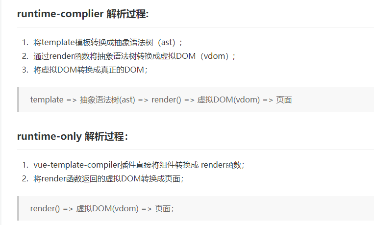

**解析阶段**：使用大量的正则表达式对template字符串进行解析，将标签、指令、属性等转化为**抽象语法树AST**。

**优化阶段**：遍历AST，找到其中的一些**静态节点并进行标记**，方便在页面重渲染的时候进行diff比较时，直接跳过这一些静态节点，优化runtime的性能。

**生成阶段**：将最终的AST转化为render函数字符串。

render函数生成虚拟dom

diff算法更新虚拟dom

生成真实dom


### 10.vue优化

**（1）编码阶段**

- 尽量减少data中的数据，data中的数据都会增加getter和setter，会收集对应的watcher
- v-if和v-for不能连用
- 如果需要使用v-for给每项元素绑定事件时使用事件代理
- SPA 页面采用keep-alive缓存组件
- 在更多的情况下，使用v-if替代v-show
- key保证唯一
- 使用路由懒加载、异步组件
- 防抖、节流
- 第三方模块按需导入
- 长列表滚动到可视区域动态加载
- 图片懒加载

**（3）打包优化**

- 压缩代码
- Tree Shaking/Scope Hoisting
- 使用cdn加载第三方模块
- 多线程打包happypack

### 11. Vue 子组件和父组件执行顺序

**加载渲染过程：**

1. 父组件 beforeCreate
2. 父组件 created
3. 父组件 beforeMount
4. 子组件 beforeCreate
5. 子组件 created
6. 子组件 beforeMount
7. 子组件 mounted
8. 父组件 mounted

**更新过程：**

1. 父组件 beforeUpdate
2. 子组件 beforeUpdate
3. 子组件 updated
4. 父组件 updated

**销毁过程：**

1. 父组件 beforeDestroy
2. 子组件 beforeDestroy
3. 子组件 destroyed
4. 父组件 destoryed

### 12. keep-alive 中的生命周期哪些

keep-alive是 Vue 提供的一个内置组件，用来对组件进行缓存——在组件切换过程中将状态保留在内存中，防止重复渲染DOM。

如果为一个组件包裹了 keep-alive，那么它会多出两个生命周期：**activated、deactivated。**同时，beforeDestroy 和 destroyed 就不会再被触发了，因为组件不会被真正销毁。

### 13.SPA页面与MPA页面应用的区别

SPA单页面应用（SinglePage Web Application），指只有一个主页面的应用，**一开始只需要加载一次js、css等相关资源**。所有内容都包含在主页面，对每一个功能模块组件化。单页应用跳转，就是切换相关组件，仅仅刷新局部资源。

MPA多页面应用 （MultiPage Application），指有多个独立页面的应用，**每个页面必须重复加载js、css等相关资源**。多页应用跳转，需要整页资源刷新。


### 14.自定义指令

自定义指令用directives

### 15. Vue的优点

- 轻量级框架：只关注视图层，是一个构建数据的视图集合，大小只有几十 `kb` ；
- 简单易学：国人开发，中文文档，不存在语言障碍 ，易于理解和学习；
- 双向数据绑定：保留了 `angular` 的特点，在数据操作方面更为简单；
- 组件化：保留了 `react` 的优点，实现了 `html` 的封装和重用，在构建单页面应用方面有着独特的优势；
- 视图，数据，结构分离：使数据的更改更为简单，不需要进行逻辑代码的修改，只需要操作数据就能完成相关操作；
- 虚拟DOM：`dom` 操作是非常耗费性能的，不再使用原生的 `dom` 操作节点，极大解放 `dom` 操作，但具体操作的还是 `dom` 不过是换了另一种方式；
- 运行速度更快：相比较于 `react` 而言，同样是操作虚拟 `dom`，就性能而言， `vue` 存在很大的优势。

### 16. 什么是 mixin ？

- Mixin 使我们能够为 Vue 组件编写可插拔和可重用的功能。
- 如果希望在多个组件之间重用一组组件选项，例如生命周期 hook、 方法等，则可以将其编写为 mixin，并在组件中简单的引用它。
- 然后将 mixin 的内容合并到组件中。如果你要在 mixin 中定义生命周期 hook，那么它在执行时将优化于组件自已的 hook。

### 17. **MVVM**的优缺点?

优点:

- 分离视图（View）和模型（Model），降低代码耦合，提⾼视图或者逻辑的重⽤性: ⽐如视图（View）可以独⽴于Model变化修改，⼀个ViewModel可以绑定不同的"View"上，当View变化的时候Model不可以不变，当Model变化的时候View也可以不变。你可以把⼀些视图逻辑放在⼀个ViewModel⾥⾯，让很多view重⽤这段视图逻辑
- 提⾼可测试性: ViewModel的存在可以帮助开发者更好地编写测试代码
- ⾃动更新dom: 利⽤双向绑定,数据更新后视图⾃动更新,让开发者从繁琐的⼿动dom中解放

缺点:

- Bug很难被调试: 因为使⽤双向绑定的模式，当你看到界⾯异常了，有可能是你View的代码有Bug，也可能是Model的代码有问题。数据绑定使得⼀个位置的Bug被快速传递到别的位置，要定位原始出问题的地⽅就变得不那么容易了。另外，数据绑定的声明是指令式地写在View的模版当中的，这些内容是没办法去打断点debug的
- ⼀个⼤的模块中model也会很⼤，虽然使⽤⽅便了也很容易保证了数据的⼀致性，当时⻓期持有，不释放内存就造成了花费更多的内存
- 对于⼤型的图形应⽤程序，视图状态较多，ViewModel的构建和维护的成本都会⽐较⾼。


### 18、模板到dom的过程

- 将template转成ast抽象语法树
- 将ast转成对应的render函数
- 调用render函数获得对应的vnode
- patch函数将vnode挂载到dom上

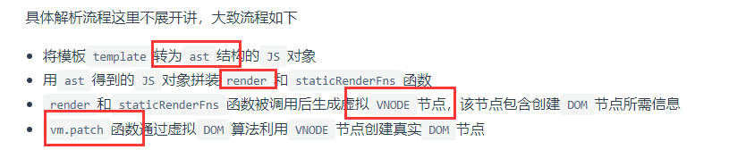


如果传入的是app对象的话，它会在patch的时候先经过`processComponent` ，`processComponent`内部会调用mountComponent

`mountComponent` 内部会先创建组件实例  

`setupComponent`初始化组件实例，`setupRenderEffec`设置与渲染有关的t副作用函数  

在副作用函数中取出subTree（如果有多个根的话，会在外面包裹一层Fragment），递归的patch  

如果是多个根会进入processFragment（就多了个处理Fragment的过程，最终还是会进入processElement的），否则就是processElement

进入process内部的mountElement方法  

hostCreateElement创建dom元素，创建完之后hostInsert插入container


## 生命周期

### 1. 说一下Vue的生命周期

Vue 实例有⼀个完整的⽣命周期，也就是从开始创建、初始化数据、编译模版、挂载Dom -> 渲染、更新 -> 渲染、卸载 等⼀系列过程，称这是Vue的⽣命周期。

1. **beforeCreate（创建前）**：数据观测和初始化事件还未开始，此时 data 的响应式追踪、event/watcher 都还没有被设置，也就是说不能访问到data、computed、watch、methods上的方法和数据。
2. **created（创建后）** ：实例创建完成，实例上配置的 options 包括 **data、computed、watch、methods 等都配置完成**，但是此时渲染得节点还未挂载到 DOM，所以不能访问到 `$el` 属性。
3. **beforeMount（挂载前）**：在挂载开始之前被调用，相关的**render函数首次被调用**。实例已完成以下的配置：编译模板，把data里面的数据和模板生成html。此时还没有挂载html到页面上。
4. **mounted（挂载后）**：在el被新创建的 vm.$el 替换，并挂载到实例上去之后调用。实例已完成以下的配置：用上面编译好的html内容替换el属性指向的DOM对象。完成模板中的html渲染到html 页面中。
5. **beforeUpdate（更新前）**：响应式数据更新时调用，此时虽然响应式数据更新了，但是对应的**真实 DOM 还没有被渲染**。
6. **updated（更新后）** ：在由于数据更改导致的虚拟DOM重新渲染和打补丁之后调用。**此时 DOM 已经根据响应式数据的变化更新了**。调用时，组件 DOM已经更新，所以可以执行依赖于DOM的操作。然而在大多数情况下，应该避免在此期间更改状态，因为这可能会导致更新无限循环。该钩子在服务器端渲染期间不被调用。
7. **beforeDestroy（销毁前）**：实例销毁之前调用。这一步，实例仍然完全可用，`this` 仍能获取到实例。
8. **destroyed（销毁后）**：实例销毁后调用，调用后，Vue 实例指示的所有东西都会解绑定，所有的事件监听器会被移除，所有的子实例也会被销毁。该钩子在服务端渲染期间不被调用。

### 2. keep-alive 中的生命周期哪些

keep-alive是 Vue 提供的一个内置组件，用来对组件进行缓存——在组件切换过程中将**状态保留在内存中**，防止重复渲染DOM。

如果为一个组件包裹了 keep-alive，那么它会多出两个生命周期：**deactivated、activated**。同时，beforeDestroy 和 destroyed 就不会再被触发了，因为组件不会被真正销毁。

当组件被换掉时，会被缓存到内存中、触发 deactivated 生命周期；当组件被切回来时，再去缓存里找这个组件、触发 activated钩子函数。


### 3、父组件如何监听子组件的生命周期

vue3：vnode-updated

vue2：hook:update

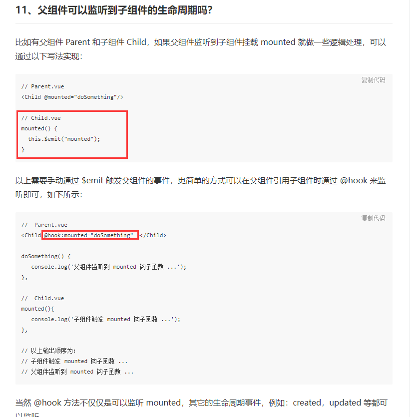


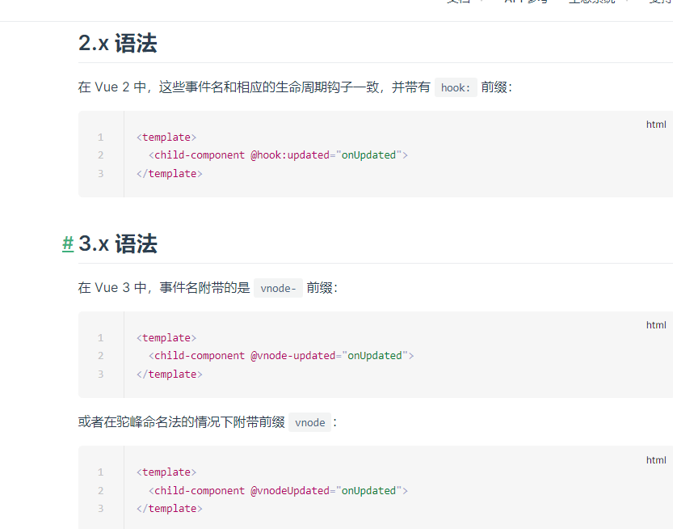

## 组件通信

- props+$emit
- eventBus事件总线
- provide/inject
- ref获取组件内部的信息
- $parent / $children（已删除children）
- vuex


## vueRouter

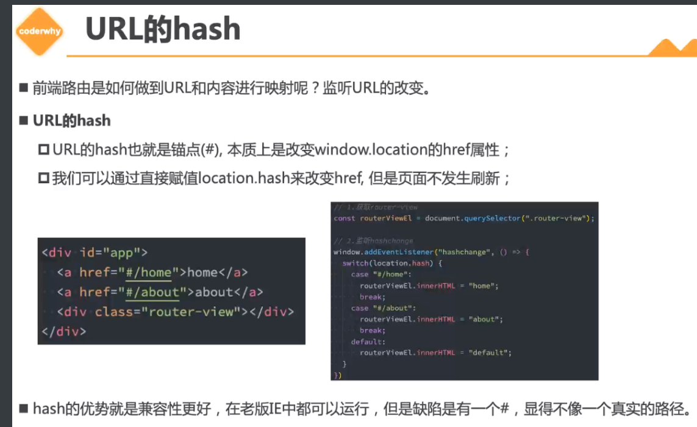

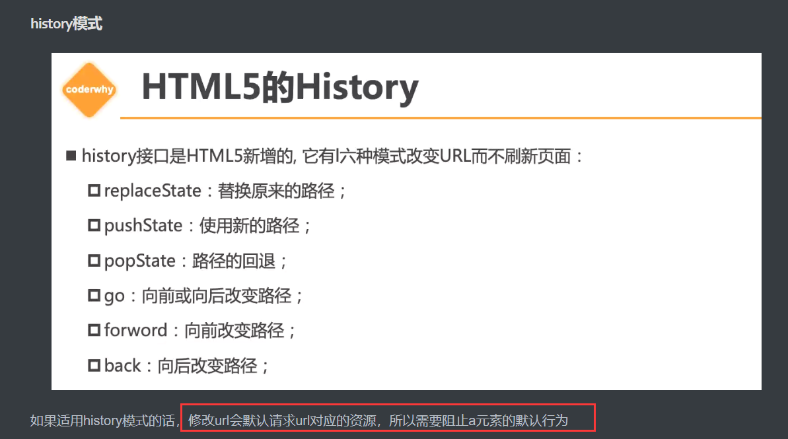

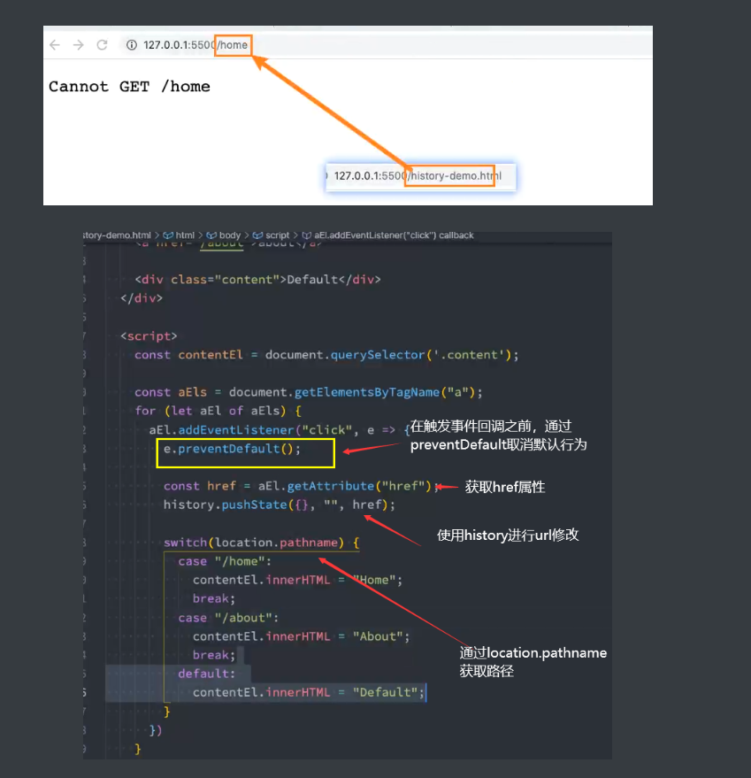

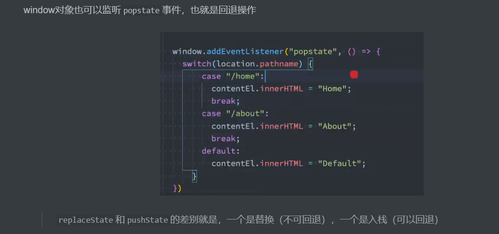


### 19、能说下 vue-router 中常用的 hash 和 history 路由模式实现原理吗？

**（1）hash 模式的实现原理**

早期的前端路由的实现就是基于 **location.hash 来实现的**。

hash  路由模式的实现主要是基于下面几个特性：

- URL 中 hash 值只是客户端的一种状态，也就是说当向服务器端发出请求时，**hash 部分不会被发送**；
- hash 值的改变，都会在浏览器的访问历史中增加一个记录。因此我们能通过浏览器的回退、前进按钮控制hash 的切换；
- 我们可以使用 **hashchange** 事件来监听 hash 值的变化，从而对页面进行跳转（渲染）。

**（2）history 模式的实现原理**

HTML5 提供了 History API 来实现 URL 的变化。其中做最主要的 API 有以下两个：`history.pushState()` 和 `history.repalceState()`。这两个 API 可以在不进行刷新的情况下，操作浏览器的历史纪录。唯一不同的是，前者是新增一个历史记录，后者是直接替换当前的历史记录，如下所示：

```
window.history.pushState(null, null, path);
window.history.replaceState(null, null, path);
```

history 路由模式的实现主要基于存在下面几个特性：

- pushState 和 repalceState 两个 API 来操作实现 URL 的变化 ；
- 我们可以使用 popstate  事件来监听 url 的变化，从而对页面进行跳转（渲染）；
- history.pushState() 或 history.replaceState() 不会触发 popstate 事件，这时我们需要手动触发页面跳转（渲染）。通过获取location.pathname来获取路径，根据路径渲染不同的内容。

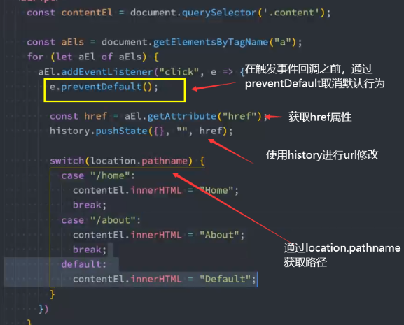

## vuex

## 虚拟dom

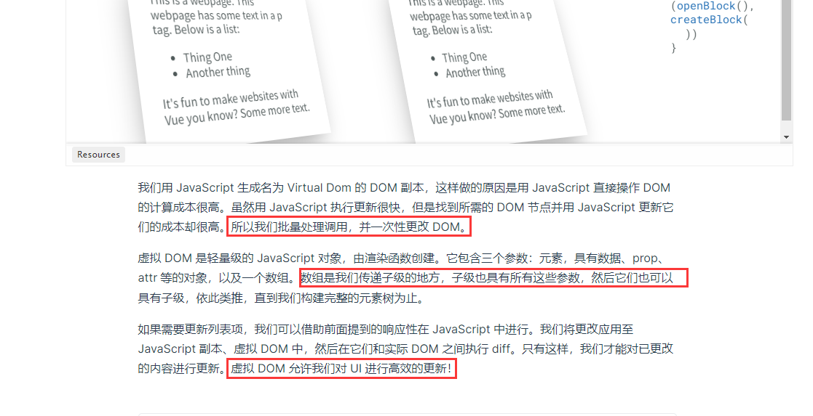

虚拟dom其实是对dom树结构的一种抽象表示方式，本质上就是一个js对象，里面保存了tag，props，和children。虚拟dom最大的优势是**易于实现跨平台**，只要针对不同的平台去编写不同的虚拟dom解析器，就可以生成对应平台的内容。

虚拟dom+diff算法结合能复用dom元素，**高效地批量更新dom**，具体流程是，在更新了数据之后，组件会备份旧的vnode和新的vnode作patch操作。

如果发现他们的key和tag相同就认为他们是同一个vnode，进行patchVnode更新操作，否则就创建新的dom进行替换。

在patchVnode的时候，会对两个vnode对象的属性以及children进行更新，如果两个vnode的children都为vnode数组的话，就进行updateChildren方法更新children。

updateChildren方法内部维护了双指针，通过while循环分别进行五步判断（新前旧前、新后旧后、新后旧前、新前旧后、都不命中）来对数组中的结点进行更新，插入，删除等操作

------

Virtual Dom是一个JavaScript对象，通过对象的方式来表示DOM结构。将**页面的状态抽象为JS对象的形式**，配合不同的渲染工具，**使跨平台**渲染成为可能

在每次数据发生变化前，虚拟DOM都会缓存一份，变化之时，现在的虚拟DOM会与缓存的虚拟DOM进行比较。在vue内部封装了diff算法，通过这个算法来进行比较，**渲染时修改改变的虚拟dom结点**，原先没有发生改变的通过原先的数据进行渲染。

### diff对比流程

先判断oldVnode是不是一个虚拟dom，如果不是虚拟dom就会创建一个**空的vnode并且关联一个dom元素**

如果key和tag相同，说明是**相同的vnode**，他通过patchVnode**进行更新**，否则就会**创建一个新的dom元素，移除老的dom元素**

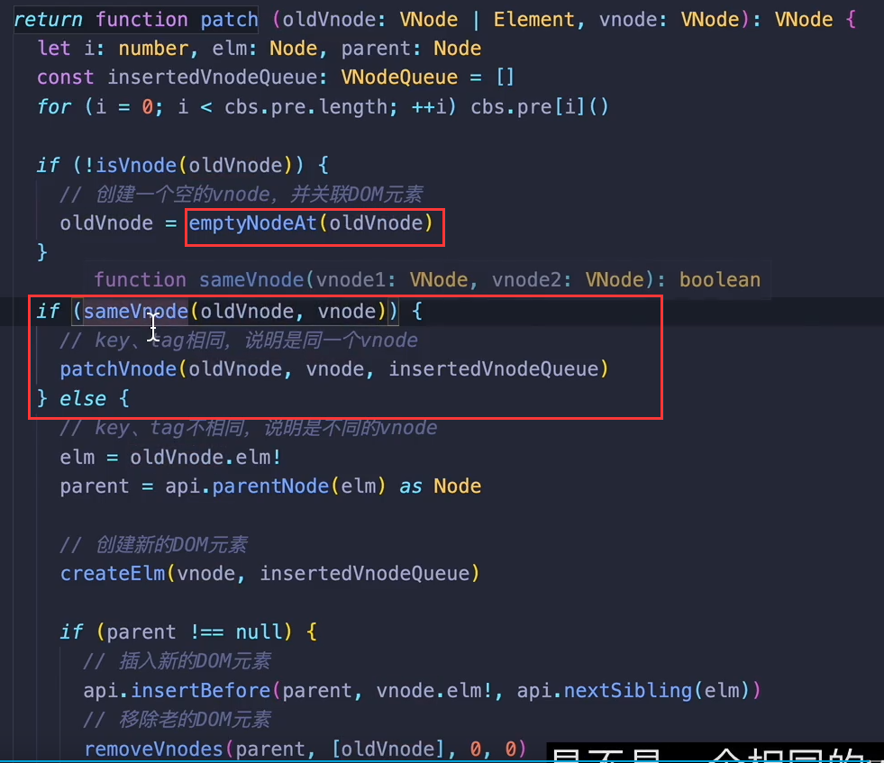

**patchVnode更新vnode操作**

patchVnode更新vnode的时候，如果**newV和oldV是完全一样的，就return**，否则就进行属性和children的更新，children的更新又分为好多种情况

- 新旧结点的children都是text
  - 一样就不作操作，不一样就修改旧的text
- 新结点的children是text，旧结点的children是vnode数组
  - 移除掉旧的结点，替换为text
- 新节点的children是vnode数组旧结点的children是text
  - 先清空旧结点，然后将新节点的vnode的children挂载到旧结点上
- 新旧结点的children都是vnode数组
  - 进行**updateChildren操作**

**当两个结点的children都是vnode数组时，updateChildren更新children**

采用双指针的设计，新节点的vnode数组分别对应了两个指针：新前，新后，旧结点的vnode数组也是如此，然后进行while循环依次进行下面五步的判断

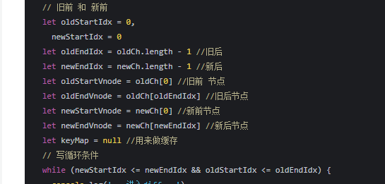

- 新前和旧前是同一结点，那么新前和旧前对应的结点进行patchVnode操作，并且两个指针加一

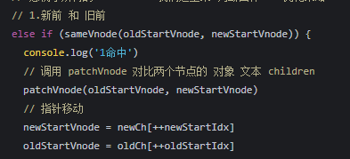

- 新后和旧后是同一节点，那么进行patchVnode操作，两个指针减一

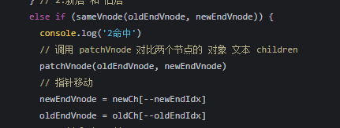

- 新后和旧前是同一结点，那么进行patchVnode操作，并且**将旧前结点移动到旧后结点的后面**，新后减一，旧前加一

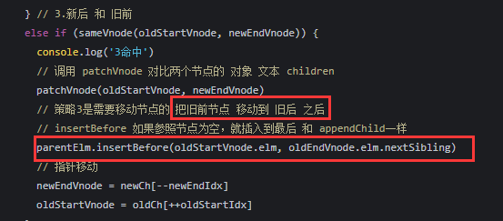

- 新前和旧后是同一节点，那么进行patchVnode操作，并且**将旧后结点移动到旧前结点的前面**，新前加一，旧后减一

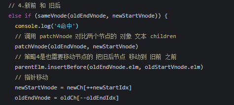

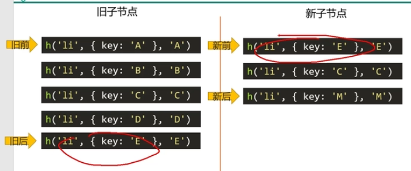

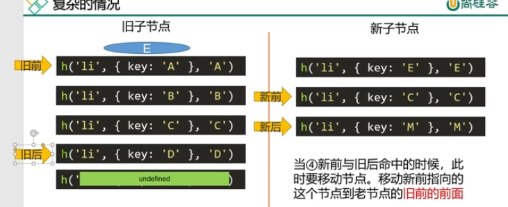


- 在所有旧结点中判断有没有新前结点

  - 有，进行patchVnode操作，将对应的旧结点移动到旧前结点的前面，并将原来的位置标记为undefined**（下图的key：c）**，新前加一

  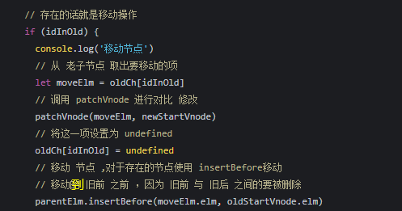

  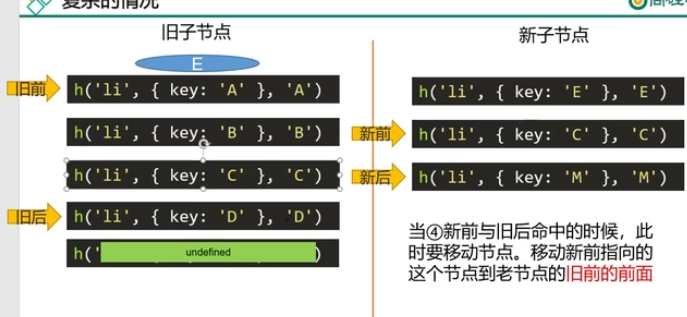

  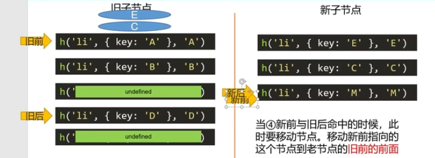

  - 无，创建新前结点插入到旧前结点的前面**（下图的M，还没修改就截图了哈哈）**

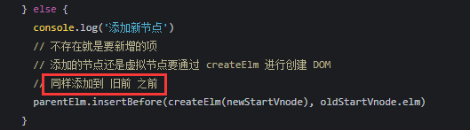

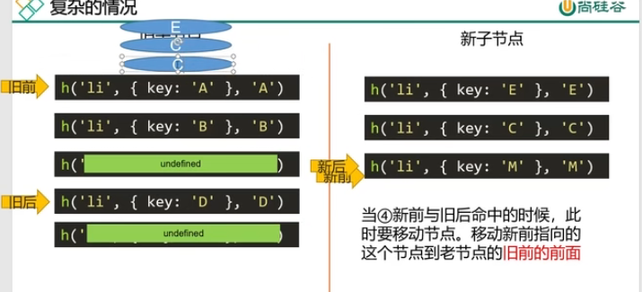


退出while循环的时候，如果旧节点中还有的话，就删除，如果新节点中还有的话，就加入到**旧前**前面

## 为什么v-for需要加一个key？

这涉及到了虚拟dom的diff算法。假如现在有两个v-for渲染生成的列表，加了key之后，在列表改变重新渲染的时候，因为**先后的列表是同一个vnode结点**，所以对他们进行patchVnode操作。

patchVnode的时候又会因为新旧列表的children是vnode数组进行**updateChildren**操作。

在updateChildren里面是用于更新子节点变化的，里面封装了双指针进行循环，对新旧children进行更新。在循环的过程中会有五步判断，都是为了判断对应指针的新旧结点是不是同一结点的。

如果加了**key**的话，在这一步，就可以判断出新旧children里面有哪些共同的结点，只要对这些结点**进行patchVnode更新**就可以了，但是如果不加key的话，即便内容没有改变，vue也**不会认为他们是可复用的相同结点**，就会重新创建新的dom元素并且插入，这样会相当消耗性能。


## 跨域

开发时，开启配置devServer的proxy，或者是开启后端的cors

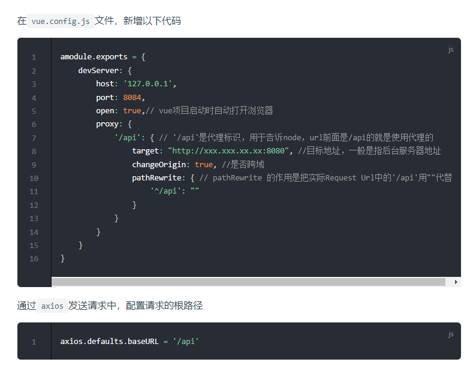

生产时，配置nginx反向代理

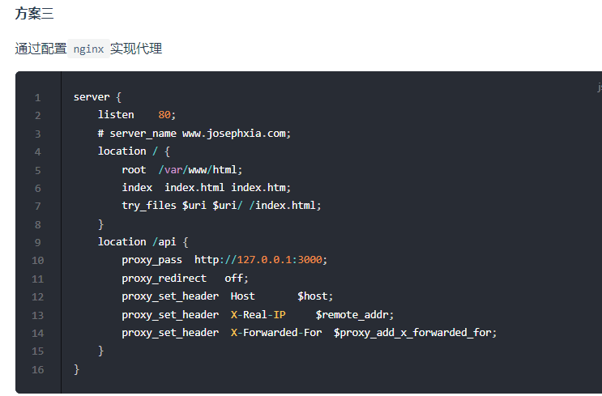

## 刷新404问题

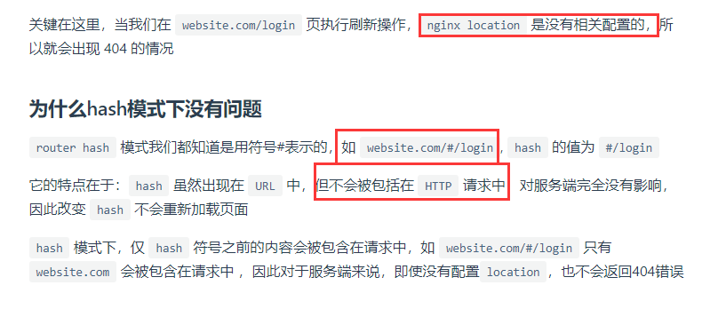

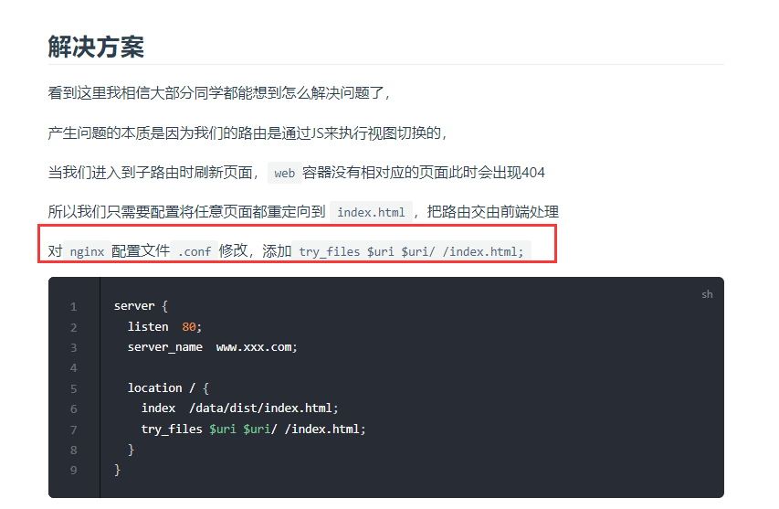