#   ECMAscript

## 1、初体验

### js引入的三种方式

- 行内式

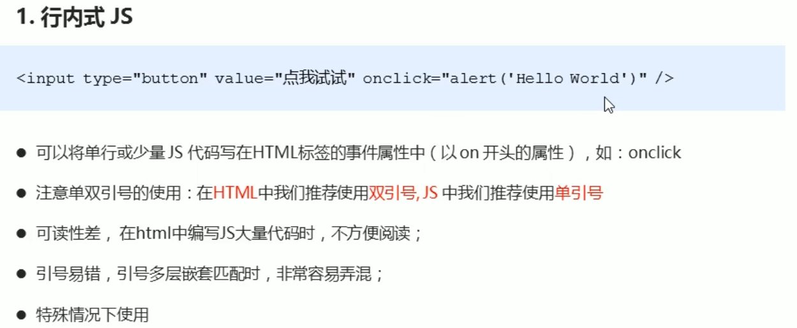

- 内嵌式

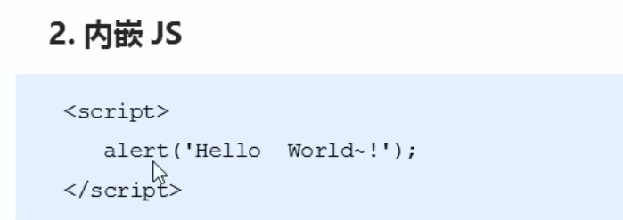

- 引入外部js文件

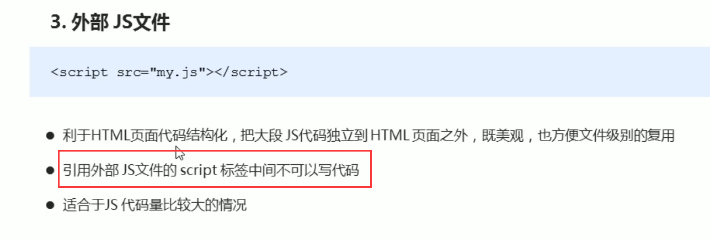

### js输入输出

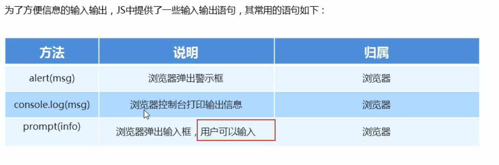

##  2、数据类型

js中的变量都是在栈内存中存储的

基本数据类型的值**直接在栈内存**中存储

值与值之间独立存在，修改一个变量不会影响其他的变量

对象是保存在**堆内存**的，没创建一个新的对象，就会在堆内存中**开辟一个新的空间**

而变量保存的是对象的内存地址（**对象的引用**），如果两个变量保存的是同一个对象引用

当一个通过一个变量修改属性时，另一个也会受到影响

 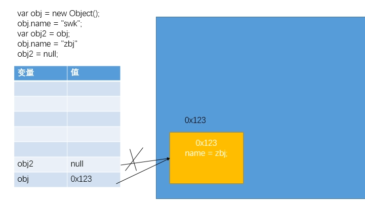

### 基本数据类型

#### String

##### 强制类型转换

```js
//1、调用toString()方法接收返回值（返回值就是String类型），注意，null和undefined是没有toString方法的。

//2、调用String()函数，如果调用String(null)和String(undefined)是不会报错的，返回"null"和"undefined",其他数据类型传入的时候本质上是toString()了

//3、直接+""即可(这个是隐式类型转换)
let a =null
console.log(a+'') //"null"
```

```js
//创建一个字符串
var str = "hello world";
/*
在底层字符串是以字符数组的形式保存的
["h","e","l"]
*/
console.log(str[0]);  //'h'
```

String对象的方法（在对基本数据类型调用里面的方法时，浏览器会临时转换成String包装类，所以才能调用下面的方法）

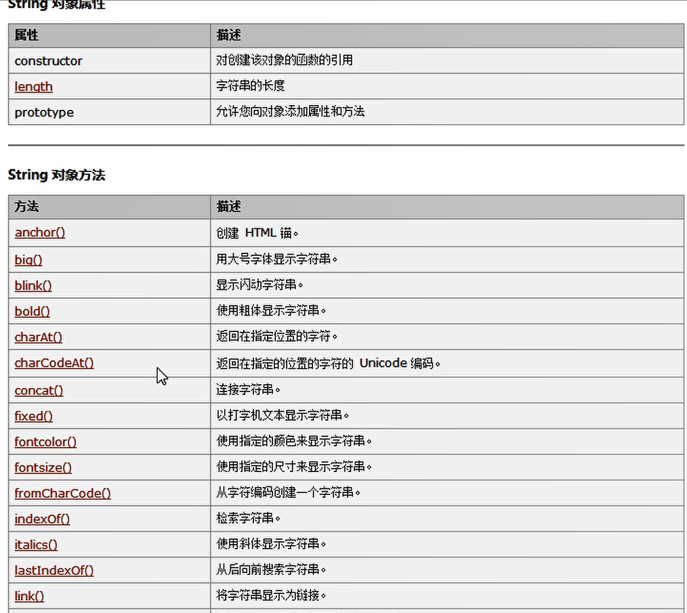

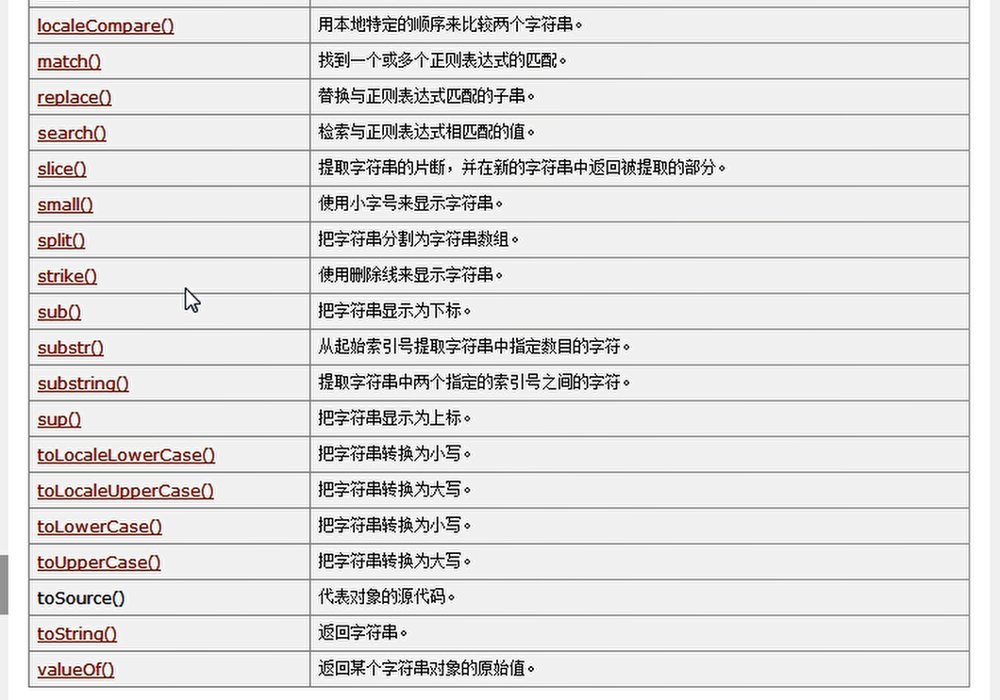

##### 判断是否有某个字符

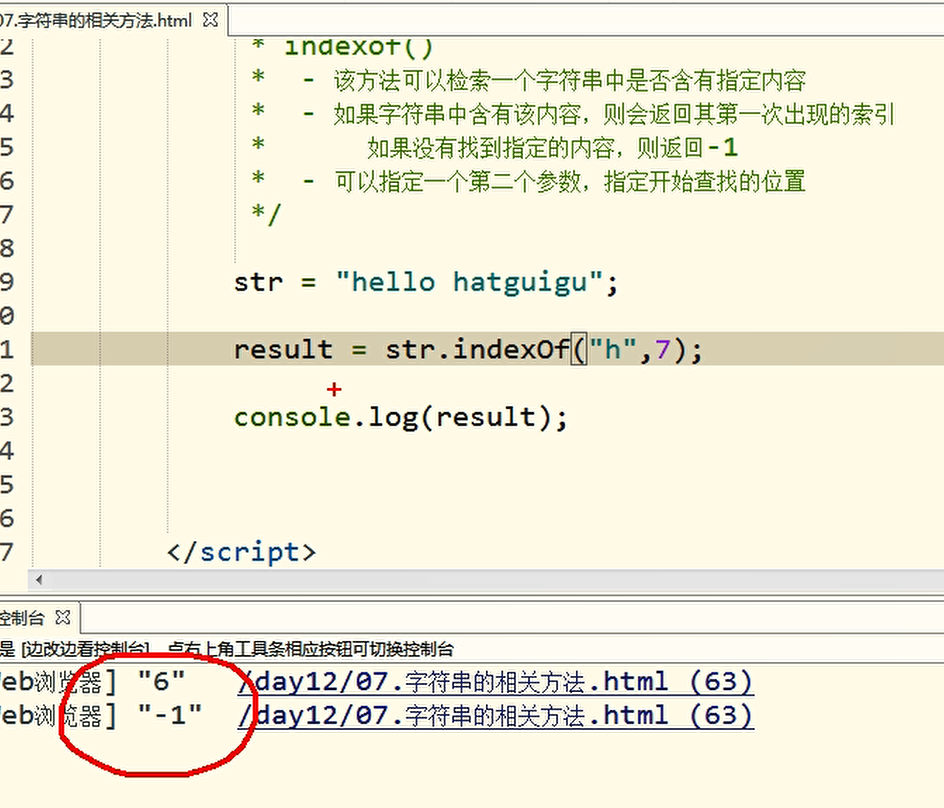

##### 截取字符串

substring

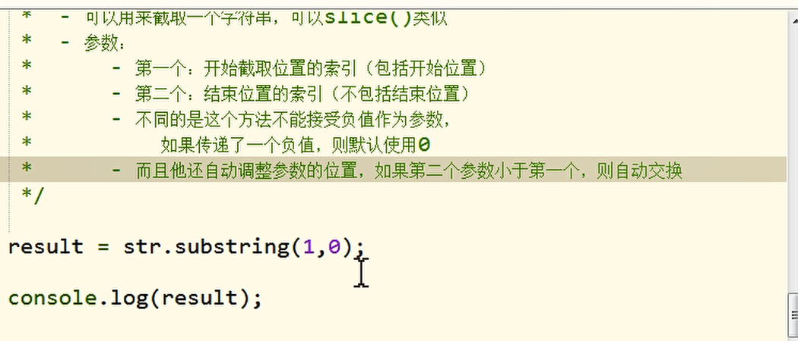

slice

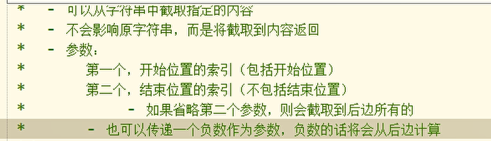


------

#### Number

##### 	最大值

```js
Number.MAX_VALUE //是JS中可以表示的最大数字，超过这个数的话会变成Infinity（Infinity也是number类型）
```

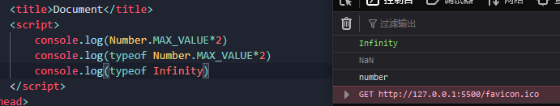

##### 	最小值(最小正数)

```js
Nunmber.MIN_VALUE//是js中可以表示的最小的正数，并不是负无穷
```

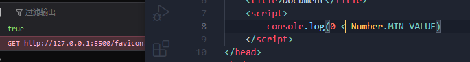

##### 	无穷

```js
Infinity   //表示无穷，加个-号就是负无穷
```

##### 	NaN

```js
NaN   //表示Not a Number，是一个特殊的number类型的字面量
let a = "abc"*"c"
console.log(typeof a) //number
console.log(a)        //NaN
```

NaN的判断，因为NaN和任何数进行关系运算都为false（包括自身），所以通过isNaN来判断是否是NaN


##### 浮点数运算的精度问题

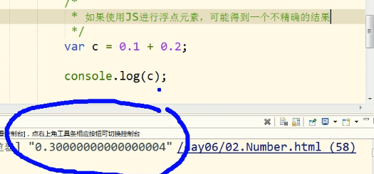

##### 强制类型转换

```js
/*
	第一种：使用Number()函数转换
		-字符串转数字 ：
			1、纯数字的字符串转的话会变成对应的number，
			2、包含其他非数字内容的话，会转成NaN
			3、如果字符串是一个空串或者是一个全是空格的字符串，则转化为0
		-boolean转数字：
			1、true   => 1
			2、false  => 0
		-null转数字：
			null => 0
		-undefined转数字：
			undefined => NaN
	
	
	第二种：专门用来对付字符串（类似于 let a = "123px"）
		-parseInt(str,[Number])   (第二个参数是Number整数的可选参数，用来表示进制)
			用于将字符串中的有效的整数内容取出来（直到第一个非数字的字符）
			console.log(parseInt("123.123a123"))  =>  123
			console.log(parseInt("aaa"))  =>  NaN

		-parseFloat(str)
			用于将字符串中有效的浮点数取出来（不会检测.)
			console.log(parseFloat("123.123a123"))  =>  123.123
		
		
		注意，如果对非String使用parse的时候，会先将其转换为String然后再操作
			console.log(parseInt(true))  =>  NaN
			可以用来number取整
			console.log(parseInt(123.123))  =>  123
			
	第三种（隐式类型转换）
	 let a = "123"
	 let a = a - 0  =>   123(number)
	 
	 第四种（隐式类型转换）
	 let a = "123"
	 let a = +a  =>   123(number)
			
*/
	
```

##### 16、2、8进制

```js
//十六进制是0x开头   例如let a = 0xff   
//八进制数是0开头    例如let a = 077
//二进制数是以0b开头 例如let a = 0b10101010101,但不是所有浏览器都支持的 
```

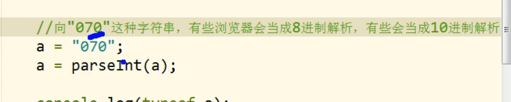

------

#### Boolean

##### 强制类型转换

```js
/*
	将其他数据类型转换为Boolean
		使用Boolean()函数
			-Number => boolean  
				除了0和NaN，其他都是true
			-String => boolean
				除了空串（长度为0），其余都是true
			-null、undefined  => false
			-Object如果不是null的话，也返回true
	
	!!也可以将其他数据类型转为boolean
*/
```

------

##### truly


#### null

定义了，但是赋值为空，专门用来表示空对象

```js
console.log(typeof null)   //object
```


#### undefined

定义，但是没有赋值

```js
let a 
console.log(typeof a) //undefined
```


### 引用数据类型

#### Object

##### 删除属性

```js
delete 对象.属性名
```

##### 获取属性值

```js
console.log(obj.key)
console.log(obj[key])   //适用于传入变量的情况
```

##### 判断属性是否存在

```js
let obj = {
	name : "wjj"
}
console.log("name" in obj)

//如果实例中没有该属性，但是原型对象中有该属性，也会返回true


//可以用对象的hasOwnProperty()来检查对象自身中是否含有该属性
console.log(obj.hasOwnProperty("name"))
```

##### 遍历对象的属性

```js
for(var key in obj){
    console.log("属性名"+key)
    console.log("属性值"+obj[key])
}
```

##### 使用工厂方法创建对象

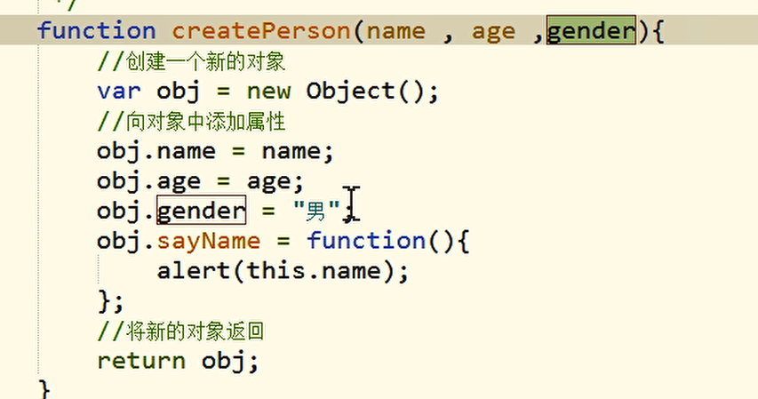

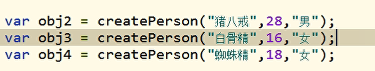

##### 构造函数（类）

构造函数的执行流程

- 立刻创建一个新的对象
- 将新建的对象设置为函数中**this**
- 逐行执行函数中的代码
- 将新建的对象作为返回值返回

构造函数中用this.属性名来声明属性并且赋值

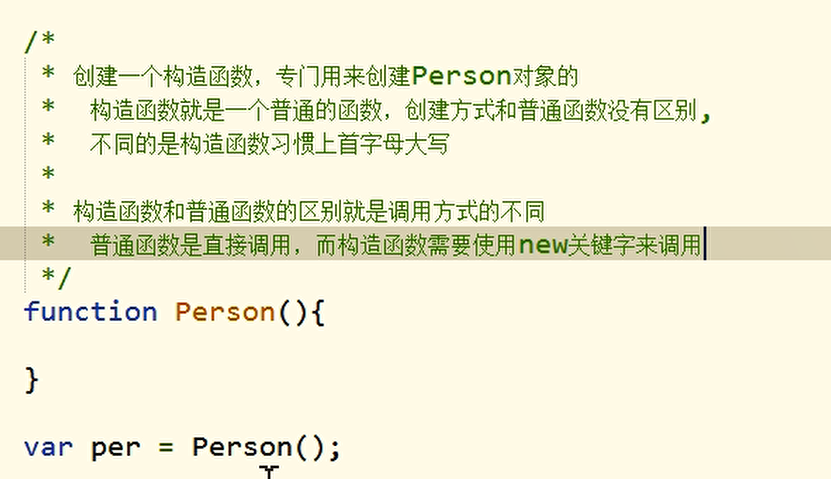

注意图中是Person不是Object

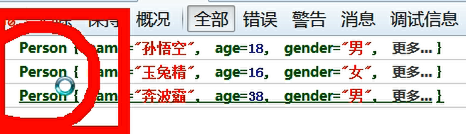

##### 原型prototype

###### 例子

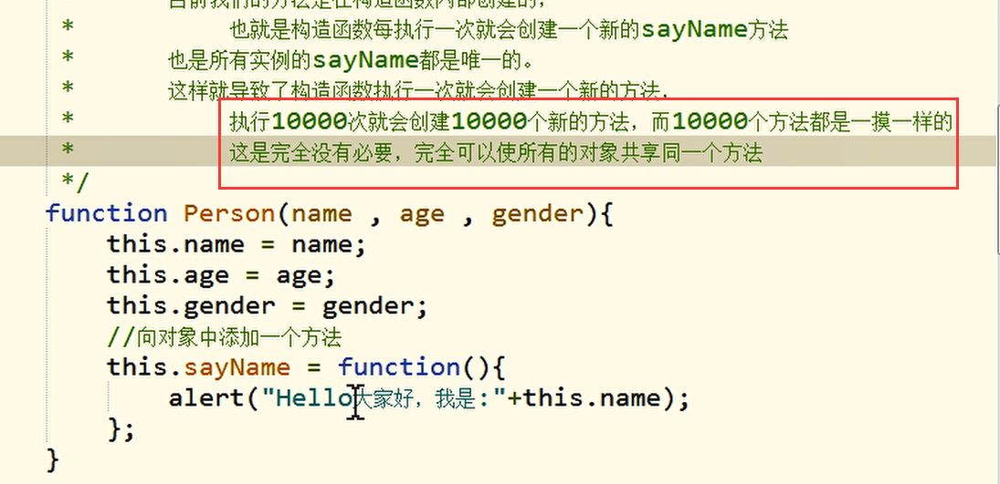

解决方法是将方法放到了全局中，但是这种解决方法有缺陷，所以引入了原型的概念

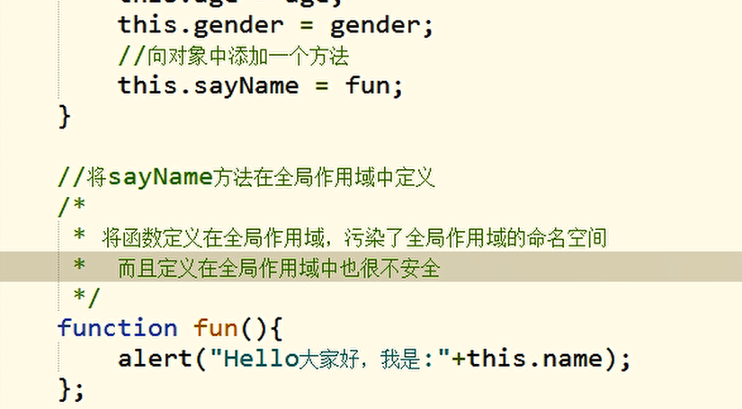

###### 介绍

```js
/*
    我们所创建的每一个函数，解释器都会向函数对象（对象）中添加一个属性prototype
       这个属性对应这一个原型对象
    如果函数作为普通的函数调用prototype没有任何作用
    当函数以构造函数的形式调用时，它所创建的对象都会有一个隐藏的属性
        指向该构造函数的原型对象，我们可以通过`__proto__`来访问该属性

    原型对象就相当于一个公共的区域，所有同一个类的实例（new出来的实例）都可以访问到这个原型对象，
    	我们可以将对象中共有的内容，统一设置到原型对象中
    	
    在访问对象的属性的时候，会先在该对象中找，找不到就会去原型对象中找
    
    以后我们创建构造函数时，可以将这些对象共有的属性和方法，统一添加到构造函数的原型对象中，
		这样不用分别为每一个对象添加，也不会影响到全局作用域,就可以使每个对象都具有这些厍性和方法了

*/
```

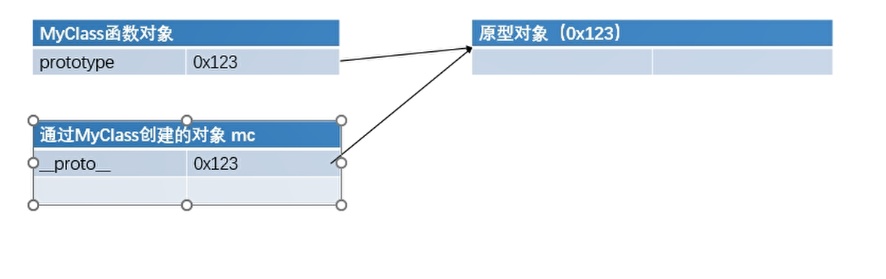

###### 原型的原型

```js
/*
	原型对象也是对象，所以它也有原型,
	当我们使用一个对象的属性或方法时,会现在自身中寻找,
		自身中如果有，则直接使用，
		如果没有则去原型对象中寻找,如果原型对象中与，则使用，如果没有则去原型的原型中寻找
		直到找到Object对象的原型，Object对象的原型没有原型，如果在Object中依然没有找到，则返回undefined 
		
	
*/
```

> Object对象只有一层原型，其他对象本质上是继承自Object对象的，所以他们的第一层原型是Object对象，第二层原型是Object对象的原型，第三层就没了


------

#### function

创建函数的两种方式

```js
function name([data]){
	...
}
    
//箭头函数
let name = ([data])=>{
	...
}
```

##### 立即执行函数（闭包）

```js
function(){
	let a = 1
}
//上面的是一个匿名函数（没有名字），但是这么写会报错，所以要在外面加一层()表示他是一个整体，这样就可以创建一个匿名函数对象并且不用赋值给一个变量
(function(){
    let a = 1
})
//现在有了函数对象，直接在后面加上()就可以执行这个函数（只执行一次）,这就是立即执行函数，如果function有参数的话记得传入参数
(function(){
    let a = 1
})()
```

##### call&apply

```js
/*
    cal1()和apply()
        -这两个方法都是函数对象的方法，需要通过函数对象来调用-当对函数调用cal1()和apply()都会调用函数执行
        -在调用cal1()和apply()可以将一个对象指定为第一个参数
        此时这个对象将会成为函数执行时的this
*/
let fun = ()=>{console.log(this)}
fun() //window
fun.call({})   //Object


//call方法可以将实参在对象之后依次传递
let fun = (a,b)=>{console.log(a,b)}
fun.call({},1,2) //输出1,2

//apply方法需要将实参封装到数组中同一传递
let fun = (a,b)=>{console.log(a,b)}
fun.call({},[1,2]) //输出1,2
```

##### 隐含参数（箭头函数中没有）

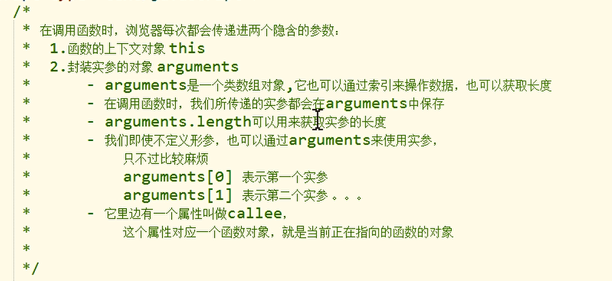

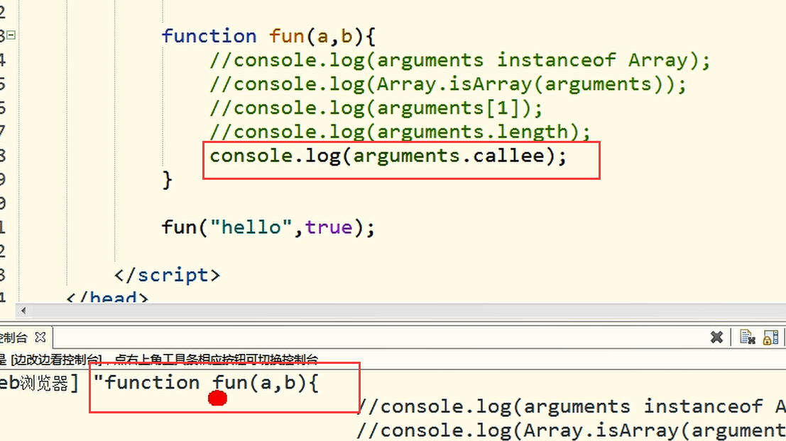


#### Array

获取数组长度

```js 
let arr = [1,'2',{name:3}]
let size = arr.length
//对于连续的数组，使用length可以获取数组的长度
//非连续的数组，使用length会获取到最大的索引值+1

//如果修改length属性大于实际长度，多出来的部分是空
//如果小于实际长度，会截取数组
```

##### 方法

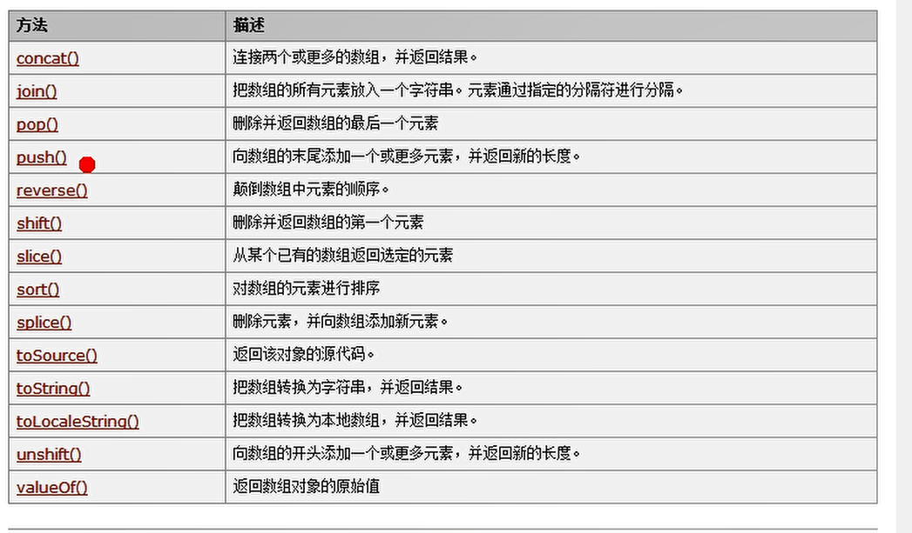

###### slice

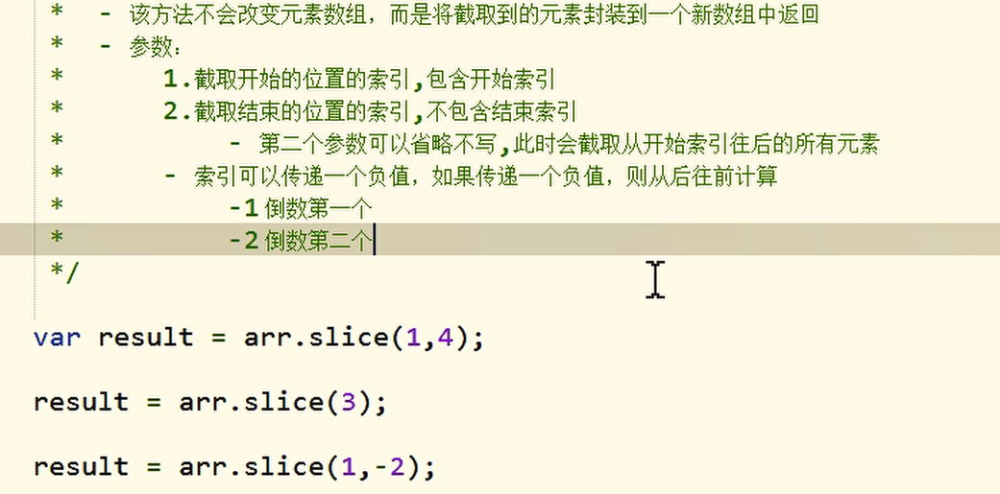

###### splice

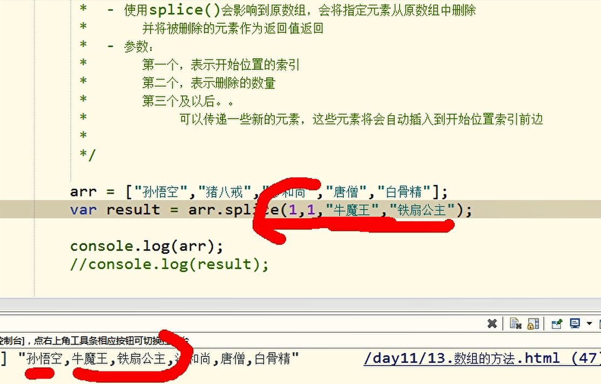 

##### 遍历

foreach

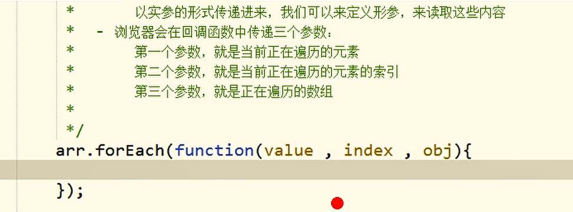

#### Date

```js
//如果直接new一个Date对象，则会封装为当前代码执行的事件
let d = new Date()

//创建一个指定的事件对象2016年12月3日11点10分30秒
//日期的格式   月份/日/年份  时：分： 秒
let d = new Date('12/03/2016 11:10:30')
```

```js
/*
	获取当前的时间戳的另一种方法
	Date.now()
*/
```

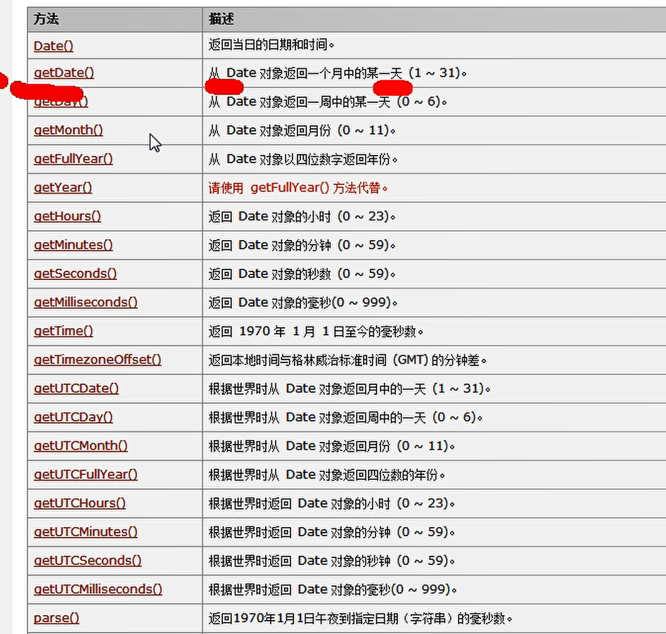

#### Math

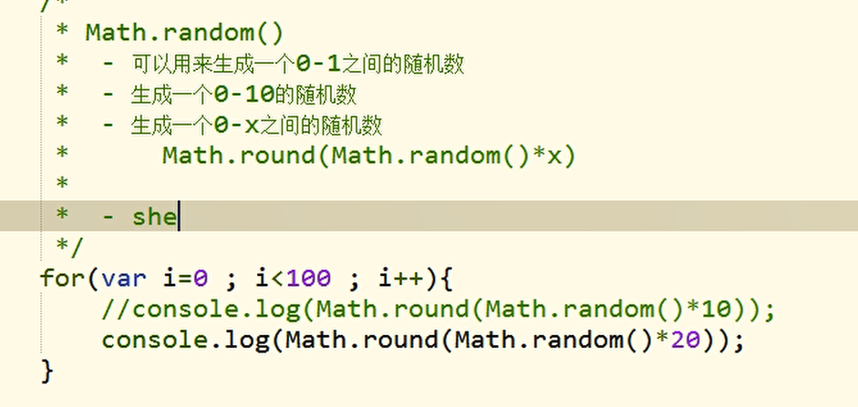

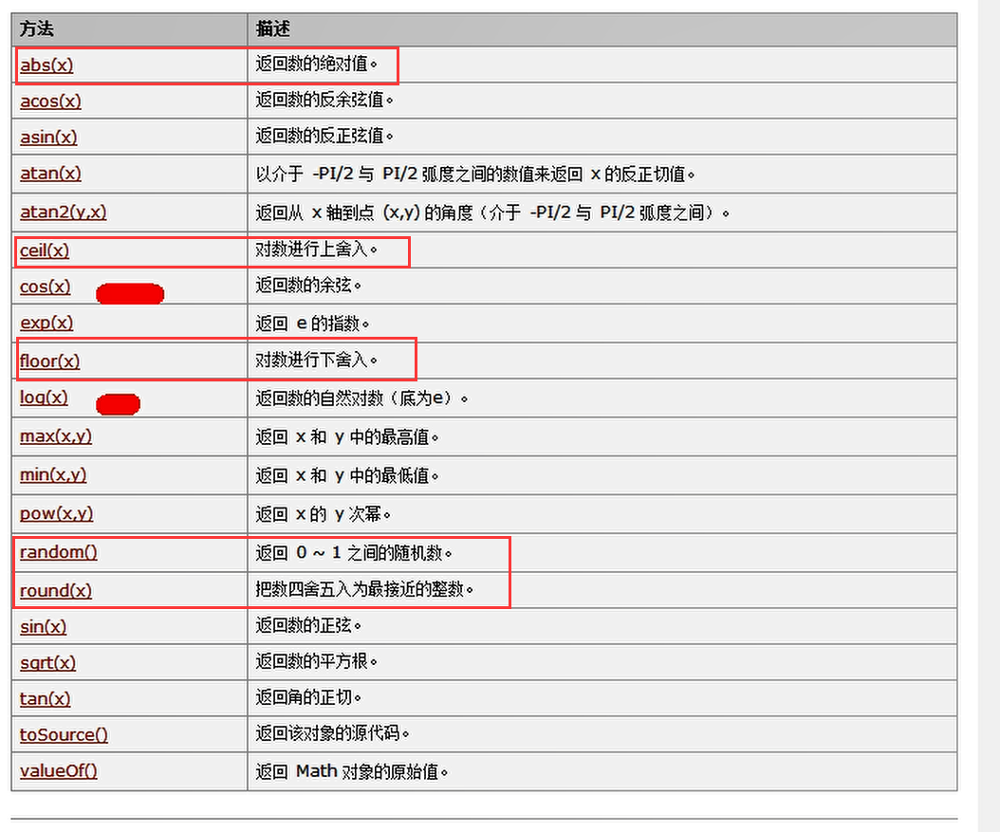

#### 包装类


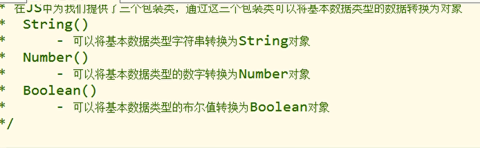

但是用它来进行逻辑判断的时候，是按对象来的，所以会出现判断误差

下面的例子中，浏览器在执行到s.toString的时候，发现s不是一个对象，所以将s先用包装类将其转换为对象，执行完操作后，转换的对象被丢弃。执行到s.hello的时候同样是如此。但是在s.hello读取属性的时候，因为基本数据类型里不能保存属性，所以在执行到这里的时候也是转换成了对象，但是这个对象跟之前两个对象都不是同一个对象，所以找不到，输出undefined

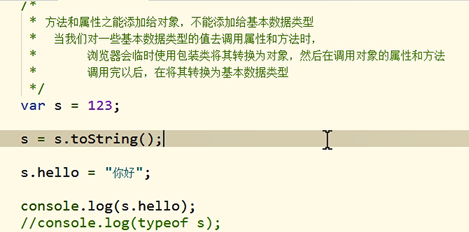


#### 正则表达式

##### 简单使用

```js
//var 变量 = new RegExp("正则表达式","匹配模式")
//匹配模式可以是，可以设置多个（顺序无所谓） 
//		i忽略大小写
//      g全局匹配模式

var reg = new RegExp('a')
var str = "a"
//用正则表达式的test方法可以检查一个字符串是否符合正则表达式的规则
var result = reg.test(str)   //true
```

##### 语法

```js
//使用字面量来创建正则表达式
//语法：  var 变量 = /正则表达式/匹配模式   （不要加引号)
let reg = /a/i    //忽略大小写找a
```

- 或

```js
//创建一个正则表达式，检查一个字符串中是否有a或b或c
let reg = /a|b|c/

//中括号里的内容也是或的关系
let reg = /[abc]/

//可以用-来表示区间(下面的例子是任意小写字母)
let reg = /[a-z]/

//任意字母
let reg = /[A-z]/

//检查一个字符串中是否含有abc或adc或aec
let reg = /abc|adc|aec/
let reg = /a[bde]c/


```

- [^    ]   

```js
//找除了ab意外的字符
let reg = /[^ab]/

//除了数字
let teg = /[^0-9]/
```

- {}量词

```js
//创建一个正则表达式检查一个字符串中是否含有aaa
let reg = /aaa/
let reg = /a{3}/

//创建一个正则表达式检查一个字符串中是否含有ababab
let reg = /(ab){3}/

//出现1次到3次
let reg = /(ab){1,3}/

//出现3次以上
let reg = /(ab){3,}/
```

- {}的简便写法

```
//一个或多个   +
//零个或多个   *
//零个或一个   ？
```

- 开头与结尾 

```js
//以a开头
let reg = /^a/

//以a结尾
let reg = /a&/

//既是开头又是结尾不能这么写
//如果在正则表达式中同时使用^$则要求字符串必须完全符合正则表达式
let reg = /^a&/    //只能匹配一个a

//必须完全满足
let str = 'affffdhdha'
let reg = /^a[A-z]*a$/

//a开头或者a结尾
let reg = /^a|a$/
```

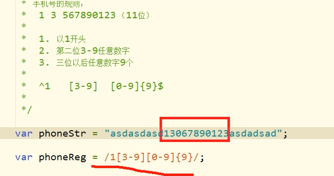

- 占位符.

```js
//  . 代表任意字符，
//  如果要表示单纯的.的话要\.
//  如果要表示\的话要\\
let reg = /\./

```

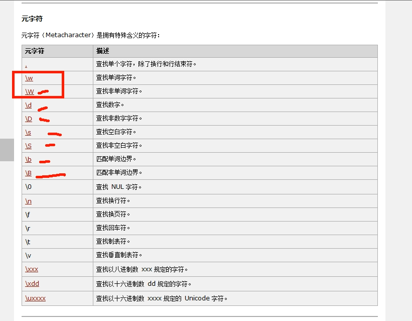

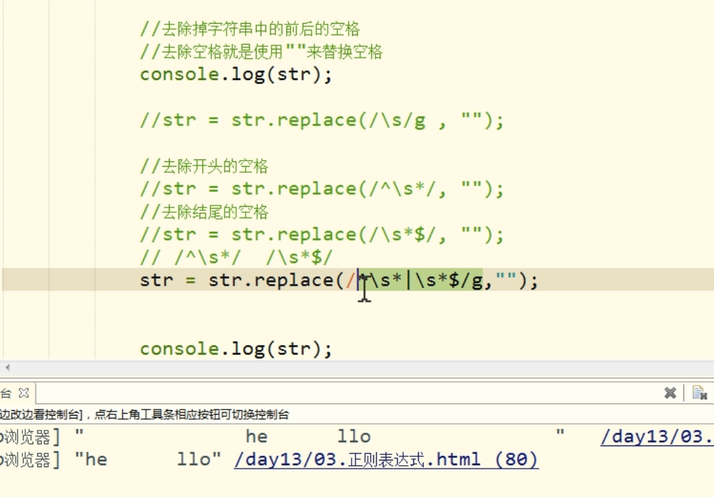

##### 案例

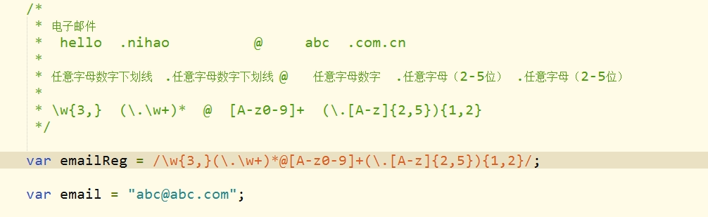

##### 字符串与正则

- split

```js
//split可以传入一个正则表达式作为参数，这样方法会根据正则表达式去拆分字符串

//根据任意字母来拆分字符串
let str = '1a2b3c4d'
let res = str.split(/[0-9]/)   //["","a","b","c","d"]
res = str.split(/[A-z]/)   //["1","2","3","4",""]
```

- search(不能全局匹配)

```js
//可以搜索字符串中是否含有指定内容
//如果搜索到指定内容，就会返回第一次出现的索引，如果没有搜索到就返回-1
//
let str = "hello abc hello aec afc"
let reg = /a[bef]c/
let res = str.search(reg)   //6
```

- match

```js
//可以根据正则表达式，从一个字符串中将符合条件的内容提取出来 
//
//默认情况下match只会找到第一个符合要求的内容，找到以后就停止搜索
//   我们可以设置正则表达式为全局匹配模式，这样就会匹配到所有的内容，会封装到数组中
str = "1a2b3c4d5f";
result = str.match(/[A-z]/g);
console.log(result);//[a,b,c,d,f ]
```

- replace

```js
//可以将字符串中指定的内容替换为新的内容
//  参数：
//		1：被替换的内容（可以设置一个正则表达式）
//      2:新的内容
let str = '1234567'
let reg = /[0-9]/
str = str.replace(reg,'a')
console.log(str)
```


### 声明提前

变量声明提前

```js
/*
	变量声明提前是，使用var（一定是使用var）关键字声明变量的时候，会在所有的代码执行之前被声明（但是不被赋值）
		如果声明变量时不使用var关键字，则变量不会被声明提前，它的作用域会一层一层向外找，找到全局的话就是作用域就是window
*/
console.log(a)   //undefined
var a = 1
```

函数声明提前

```js
/*
	函数声明提前
      - 使用函数声明形式创建的函数function函数(){}
           它会在所有的代码执行之前就被创建，所以我们可以在函数声明前来调用函数
      - 使用函数表达式创建的函数，不会被在声明前
*/
fun()	  //输出1
fun2()   //执行到这的时候报错	

//函数声明 
function fun(){
	console.log('1')
}
//函数表达式
var fun2 = function(){
	console.log('2')
}
```


------

## 3、运算符

### instanceof

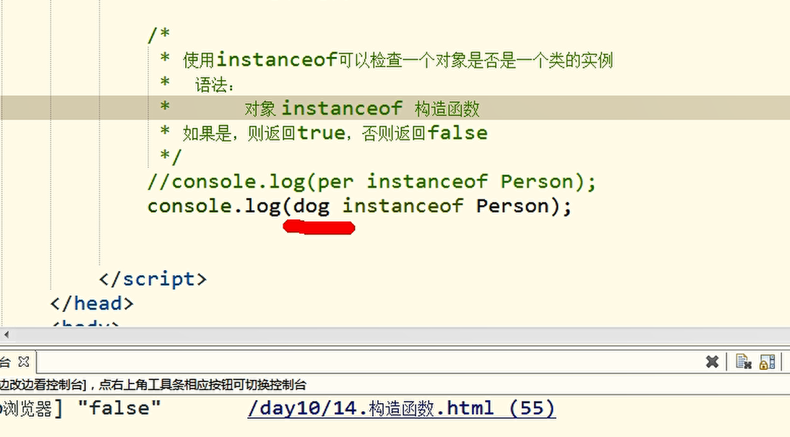

### typeof

返回的是类型的小写**字符串**

```js
let a = "1"
console.log(typeof a)   //"string"
let b = 1
console.log(typeof b)   //"number"

console.log(typeof NAN)  //"number"

let fun = ()=>{}
console.log(typeof fun) //function

console.log(typeof [])   //object
```

### 算术运算符

对非Number类型的数据进行算术运算时，会先转成Number类型再进行算术运算

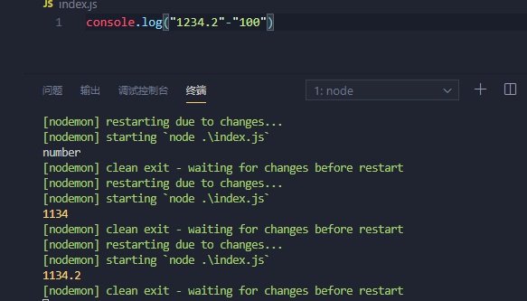

**注意：如果是字符串进行加法，就是拼接字符串操作**

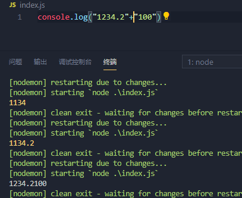


**注意：任何变量跟字符串进行相加运算，返回结果都是字符串**

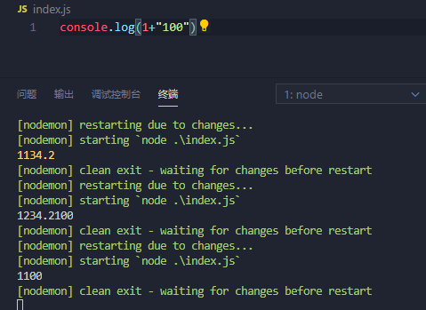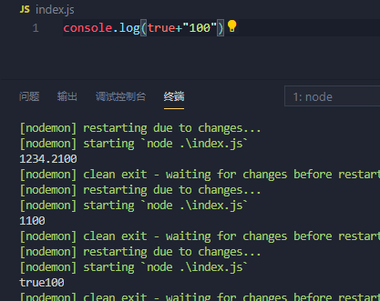

例子

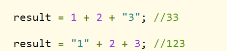

### 一元运算符

可以用+（正号）使得任何数据类型变成Number类型

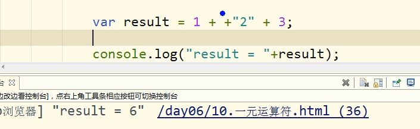

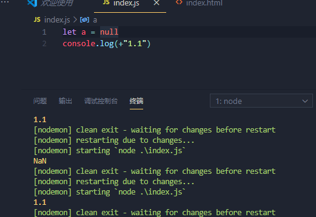

自增

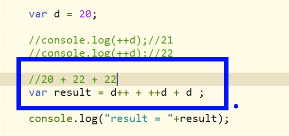

只要看d++是多少，d就是多少

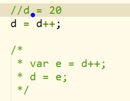

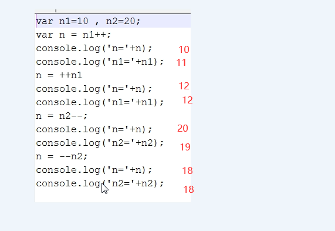

### 非布尔值的语或运算

```js
/*
	 &&操作符在进行运算时，（false的短路）
         如果两个值转成boolean之后都为false，就返回前面的值（因为第一个为false，与运算就结束了）
         如果两个值转成boolean之后都为true，就返回后面面的值，（如果第一个是true，还需要看后面的是不是为true）
         如果两个值中有一个是false，就返回转义之后为false的值
*/  
/*
	 ||操作符在进行运算时，（true的短路）
         如果两个值转成boolean之后都为false，就返回后面的值（如果第一个是false，还需要看后面的是不是为true）
         如果两个值转成boolean之后都为true，就返回前面的值，（因为第一个为true，或运算就结束了）
         如果两个值中有一个是true，就返回转义之后为true的值
*/  
```

### 关系运算符

在非数值的类型做比较的时候，会先转换成number类型再比较

特殊情况：如果关系运算符两侧都是字符串，不会将其转换为数字进行比较，会**从左到右按位**比较字符串的unicode编码，如果当前位一样就比较下一位，直到能比出结果

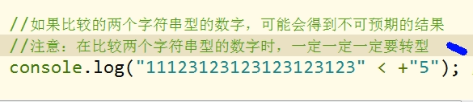

**注意：NaN的任何关系运算结果都为false**

------

### 相等运算符

- 正常情况下，使用==（或者!=）操作符时会将值转为Number类型，**但是null不会转**

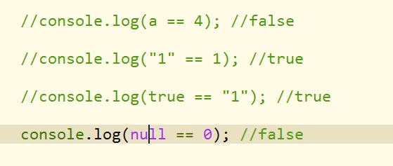

**特例**

因为undefined衍生自null，所以null == undefined为true

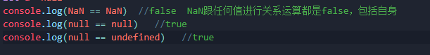  

- ===运算符是**值+类型**都要相等（全等）

### 三目运算符

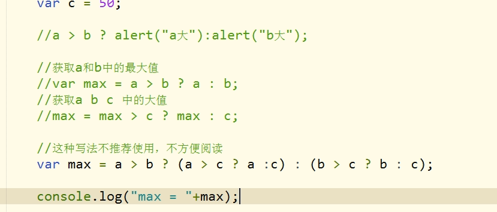

## 4、作用域


作用域指一个变量的作用的范围-在JS中一共有两种作用域:

### 全局作用域

- 直接编写在script标签中的JS代码,都在全局作用域（window）下
- 全局作用域在页面打开时创建,在页面关闭时销毁
- 在全局作用域中有一个全局对象window，我们可以直接使用
- 声明的变量以及函数都会作为window对象的属性存在，可以通过window.xxx调用，也可以直接xxx调用

### 函数作用域

- 调用函数时创建函数作用域，函数执行完毕后，函数作用域销毁
- 每调用一次函数就会创建一个新的函数作用域，他们之间是相互的
- 函数作用域内的变量是仅仅属于函数内部的，外部无法访问
- 函数作用域内如果**不存在**要访问的变量的话，会去上一层作用域寻找，直到去找全局作用域，找不到就**报错**
- 定义形参就相当于在函数作用域中声明了变量

```js
function fun6(e){
	console.log(e)   //输出undefined，这个e是形参，相当于在函数作用域中声明了变量，但是因为调用的时候没有赋值，所以这个变量也没有赋值，输出undefined
}
fun6()
```

### 例题

```js
var a = 11
fcuntion fun3(){
    console.log(a)    //undefined,因为在函数作用域内，用var声明的变量a声明提前了，提前到函数作用域的最前面，但是未定义，所以输出undefined，因为在函数作用于内定义了，所以不会向外找
    var a = 35
}


var a = 11
fcuntion fun3(){
    console.log(a)    //输出11，去外层找了
    a = 35  	//他会先去找当前作用域，如果当前作用域没有a的话就会改变全局的作用域
}
console.log(a)  //输出35

var a = 11
fcuntion fun3(){
    console.log(a)    //输出11，去外层找了
    d = 35   		//当前作用域没有d，相当于是window.d=35
}
console.log(d)  //输出35
```

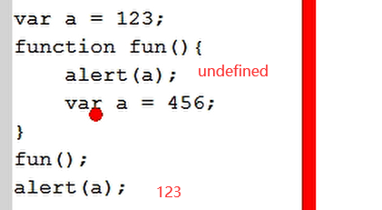

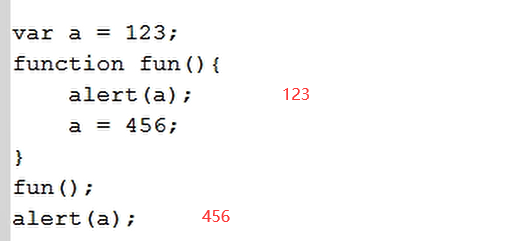

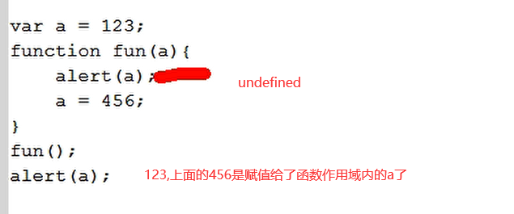

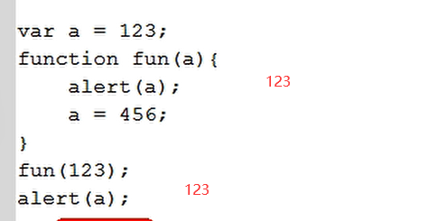

## 5、this

 this是传入的上下文对象，在function函数中会默认传入this对象。**this指向的是这个function归属的对象**，例如全局注册的function，那么他的this就是window对象，这个有例外，如果这个function是用call或者apply调用的话，会改变this的指向（指向call或apply的第一个参数）。

在构造函数中，this指的是构造函数创建的对象

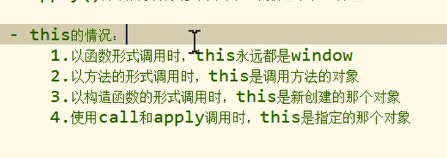

# Dom文档对象模型

可以通过js操作HTML文档。浏览器为我们提供文档节点对象，这个对象是window对象的属性，可以在页面中直接使用，文档节点代表的是整个网页 

- innerHTML     可以获取到元素内部的内容
- innerText      它会获取到元素内部的内容（将html去除，纯文本）


## dom查询

通过document对象来实现dom查询，而这个document对象是包括了整个html文件的对象

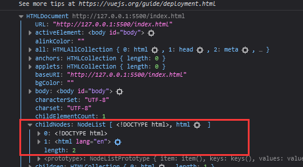

document对象中有一个body属性，保存了body的引用

document对象中的documentElement属性保存了html根标签

document.all里保存了所有的元素的引用

------

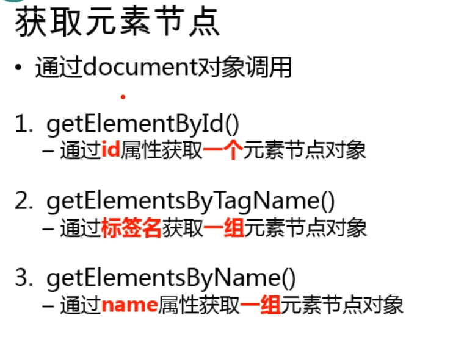


------

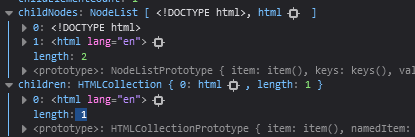

- childNodes会获取到包括文本在内的所有子节点（换行符会被当作文本对象了）

而children属性可以获取当前元素的所有子元素

- firstChild会获取到第一个子节点（包括文本）

要获取第一个不包括文本节点的子节点的话，可以用firstElementChild

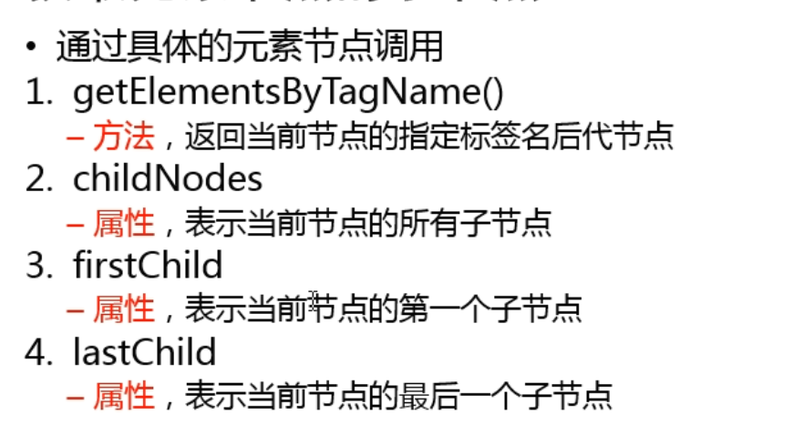

读取class属性

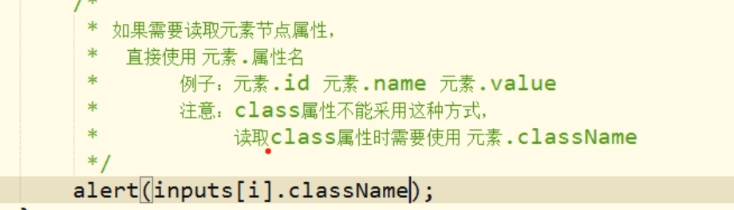

------


------

只找一个

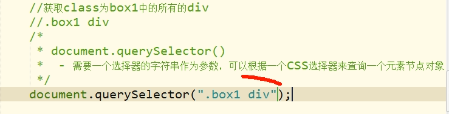

找出所有

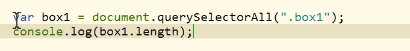


## dom增删改

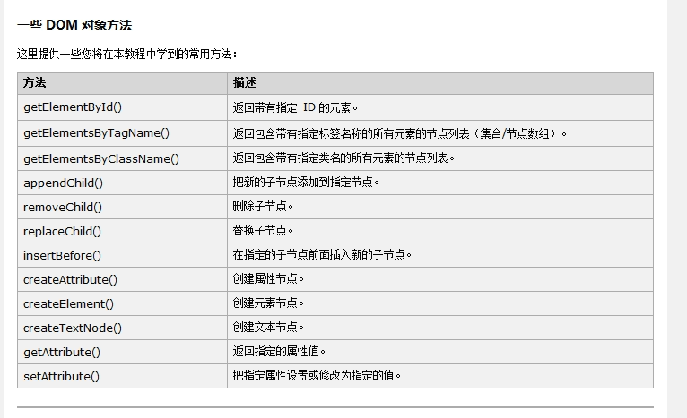

### 添加结点

```html
<body>
    <ul id="ul">

    </ul>
</body>

<script>
    let ul = document.getElementById("ul")
    let li = document.createElement('li')
    li.innerText = '广州'
    ul.appendChild(li)
</script>
```

- insertBefore()

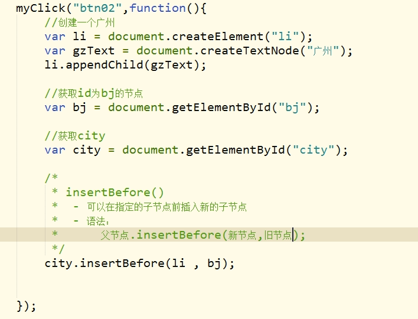

- 用innerHTML增加（这种方式会重新渲染dom）

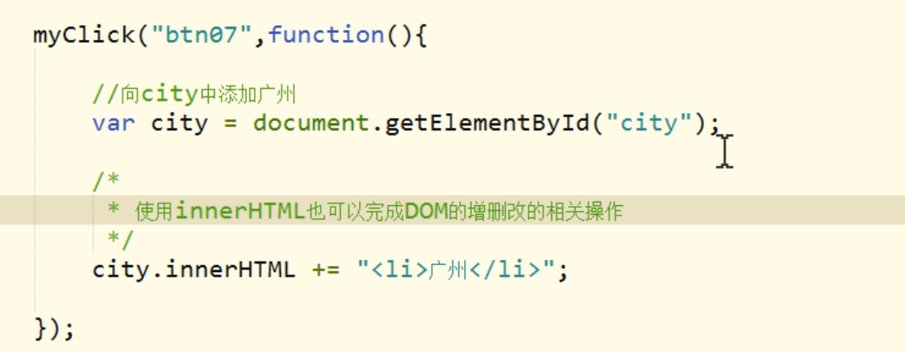

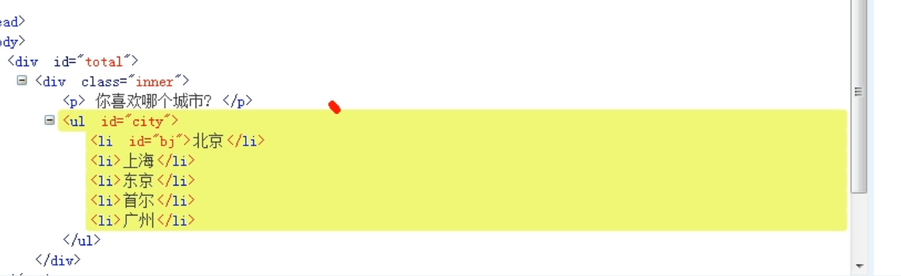


### 替换结点

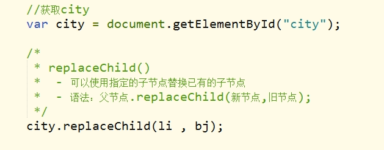

### 删除结点

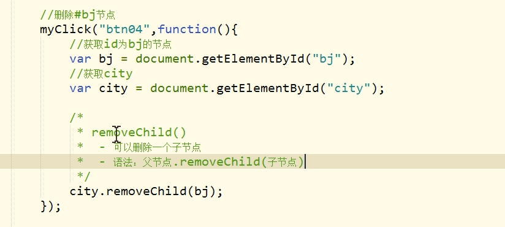

## 事件

### 绑定事件

要想让 JavaScript 对用户的操作作出响应，首先要对 DOM 元素绑定事件处理函数。所谓事件处理函数，就是处理用户操作的函数，不同的操作对应不同的名称。
在JavaScript中，有三种常用的绑定事件的方法：

    在DOM元素中直接绑定；
    在JavaScript代码中绑定；
    绑定事件监听函数。

1、在DOM中直接绑定

```js
<button onclick="open()">按钮</button>
 
<script>
function open(){
    alert(1)；
}
</script>
```

2、在js代码中绑定

```js
<button id="btn">按钮</button>
 
document.getElementById('btn').onclick = function(){
      this.style.background = 'yellow';
  }
```

3、绑定事件监听函数

绑定事件的另一种方法是用 addEventListener() 或 attachEvent() 来绑定事件监听函数。

- addEventListener()函数语法
  elementObject.addEventListener(eventName,handle,useCapture);

| 参数          | 说明                                                         |
| ------------- | ------------------------------------------------------------ |
| elementObject | DOM对象（即DOM元素）。                                       |
| eventName     | 事件名称。注意，这里的事件名称没有“ on ”，如鼠标单击事件 click ，鼠标双击事件 doubleclick ，鼠标移入事件 mouseover，鼠标移出事件 mouseout 等。 |
| handle        | 事件句柄函数，即用来处理事件的函数。                         |
| useCapture    | Boolean类型，是否使用捕获，一般用false 。这里涉及到JavaScript事件流的概念，前面已经进行了讲解 |

- attachEvent()函数语法
  elementObject.attachEvent(eventName,handle);

| 参数          |
| ------------- |
| elementObject |
| eventName     |
| handle        |

注意：事件句柄函数是指“ 函数名 ”，不能带小括号。
addEventListener()是标准的绑定事件监听函数的方法，是W3C所支持的，Chrome、FireFox、Opera、Safari、IE9.0及其以上版本都支持该函数；但是，**IE8.0及其以下版本不支持该方法**，它使用attachEvent()来绑定事件监听函数。所以，这种绑定事件的方法必须要处理浏览器兼容问题。  

```js
<button id="btn">按钮</button>
 
<script type="text/javascript">
        var oBtn = document.getElementById('btn');
        function addEvent(obj,type,handle){
            try{ // Chrome、FireFox、Opera、Safari、IE9.0及其以上版本
                obj.addEventListener(type,handle,false);
            }catch(e){
                try{ // IE8.0及其以下版本
                    obj.attachEvent('on' + type,handle);
                }catch(e){ // 早期浏览器
                    obj['on' + type] = handle;
                }
            }
        }
        addEvent(oBtn,'click',function(){//切记cliclk要加引号，没加会报错
            this.style.width = 200+'px';
        });
</script>	
```

### 如何取消事件绑定

第一种方式：document.onclick = null;(针对第一和第二两种绑定方式)

第二种方式：obj.detachEvent(事件名称，事件函数);（针对非标准IE下的绑定方式）

第三种方式：obj.removeEventListener(事件名称，事件函数，是否捕获);（针对标准浏览器下的绑定方式）

### 事件表

（要用到的话去查去。。。这里只是部分）

https://www.w3school.com.cn/jsref/dom_obj_event.asp

### 取消默认事件

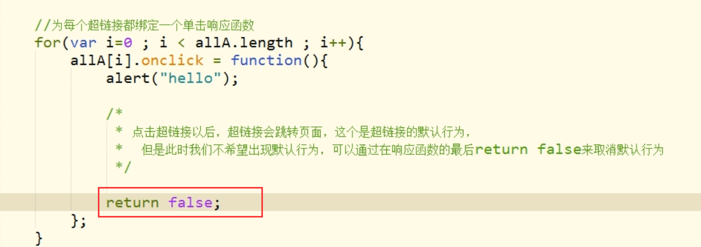

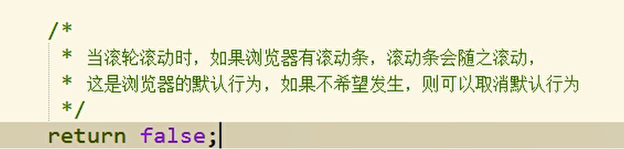

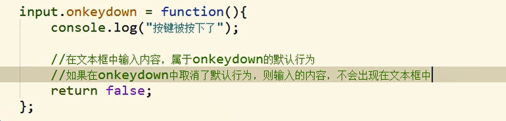

### 事件对象event

> 在 W3C 规范中，event 对象是**随事件处理函数传入**的，Chrome、FireFox、Opera、Safari、IE9.0及其以上版本都支持这种方式；但是对于 IE8.0 及其以下版本，event 对象必须作为 window 对象的一个属性。

- ie8不会传递事件对象，而是作为window对象的event属性

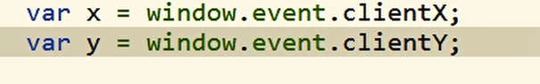

兼容性写法

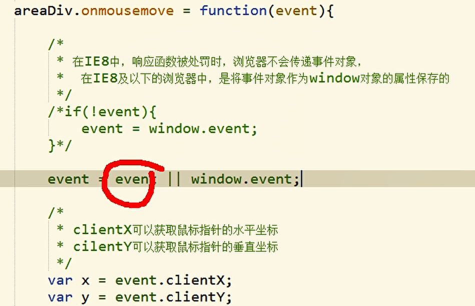

- 每个事件的事件对象的属性是不同的，有写属性只属于某个特定的事件对象，需要去查

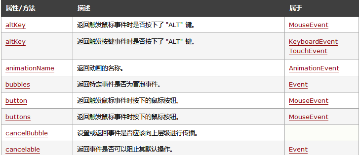

#### target触发事件源属性

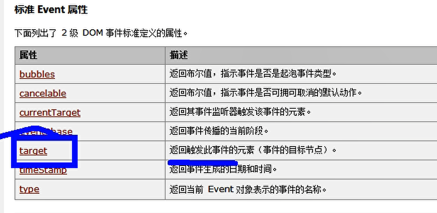

IE下,event对象有srcElement属性,但是没有target属性;

Firefox下,event对象有target属性,但是没有srcElement属性.但他们的作用是相当的，即：

firefox 下的 event.target = IE 下的 event.srcElement

> obj = event.srcElement ? event.srcElement : event.target;
>
> var evtTarget = event.target || event.srcElement;

#### offsetX和offsetY

他们是属于**鼠标事件**的

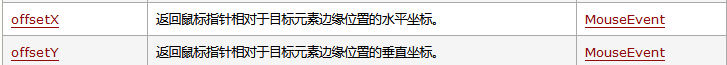

获取到的是鼠标在点击元素中的偏移位置，有个细节是，它是不包括border的（但是包括padding），所以点击border的话会出现负值

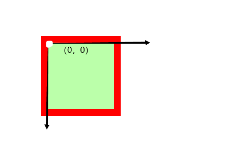

#### pageX和pageY(不兼容ie8)

在没有滚动条的时候，pagex和clientx是一样的（y同理）

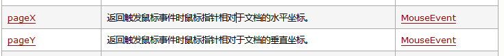

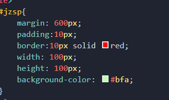


点击输出的Y

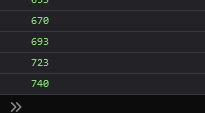

相同的实现方法：

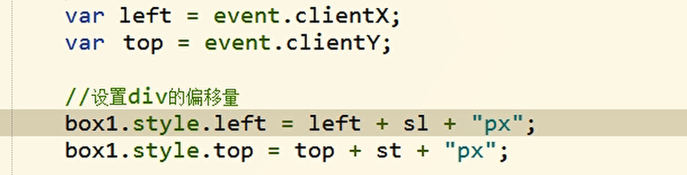

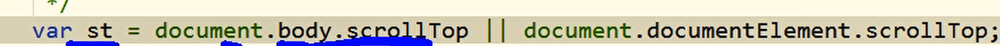


#### clientX和clientY

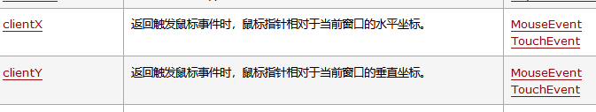

点击上侧的红色border的输出

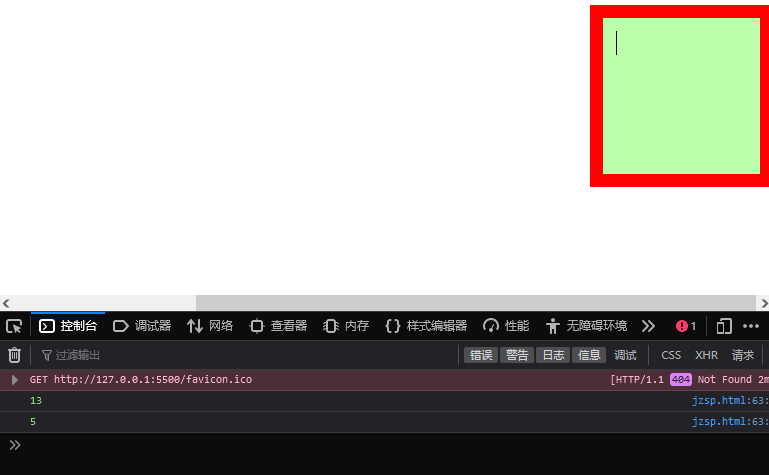


### 取消事件冒泡


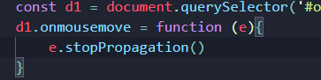

### 事件委派

下面的例子原来是要给ul下面的li的a注册点击事件，现在是通过给a的祖先元素注册事件，然后通过冒泡来触发（这就是事件委派） 

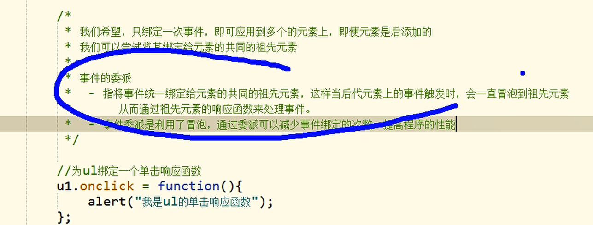

加一个class属性，用来在ul的单级响应函数里进行判断，只有是class为link的标签触发时，才执行（避免其他标签冒泡）

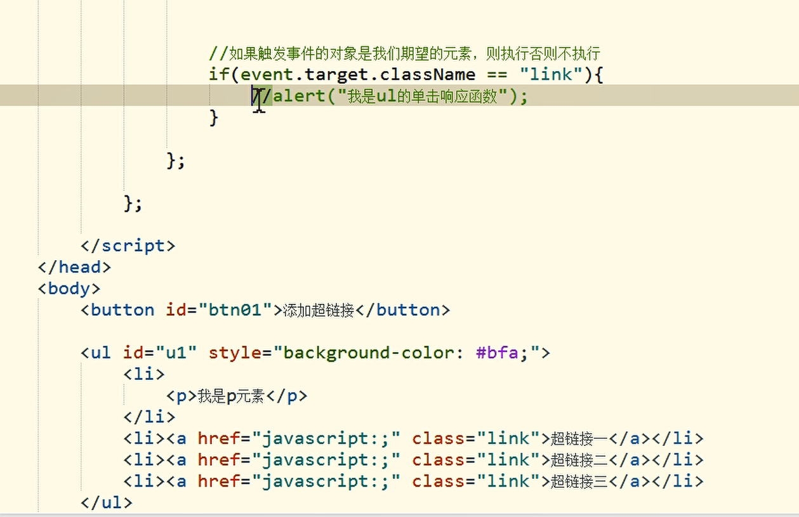

### 事件流

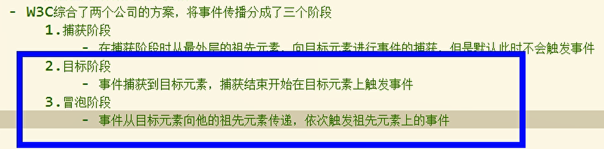

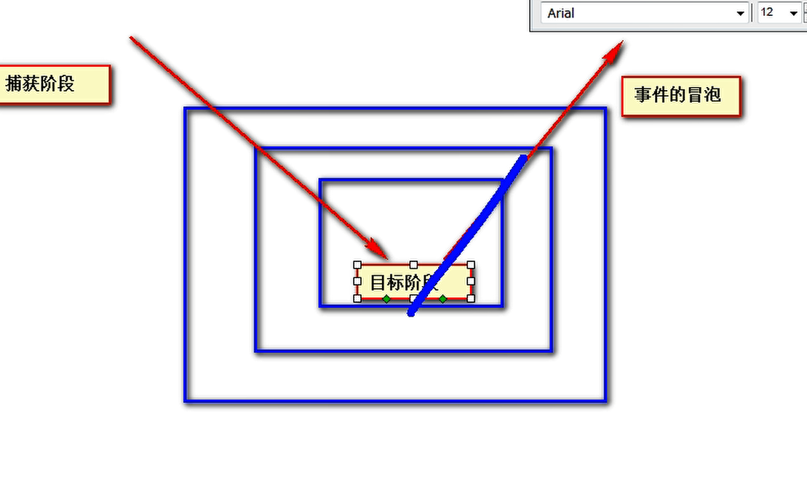

如果希望事件从捕获阶段就触发事件，就将addEventListener的第三个参数设置为true（捕获阶段就是从外到内触发事件）

### 拖拽

------

 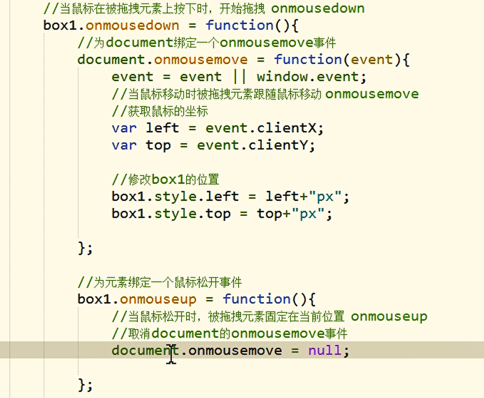

------

将上图的box1.onmouseup改成下图，是因为

- 如果有一个兄弟元素div盖住了当前元素box1，如果两个div重叠的情况下松开鼠标，onmouseup事件是兄弟元素触发的，所以首先要将绑定的对象设置为document。
- 在页面的任何地方松开鼠标都会触发这个事件，所以要在执行完`document.onmousemove=null`之后将本事件的响应函数也解除（变成一次性的），这样就只有在拖拽并且松开鼠标的时候才会触发onmouseup事件，其他情况不会触发

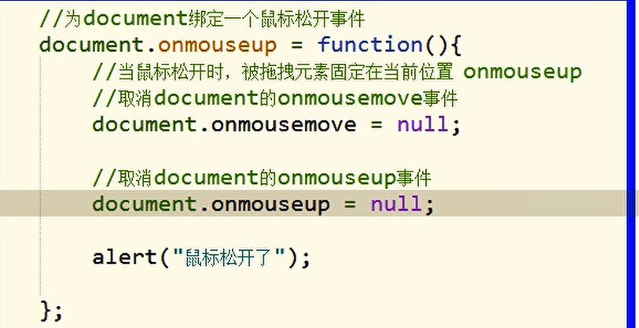

```html
<!DOCTYPE html>
<html lang="en">

<head>
    <meta charset="UTF-8">
    <meta name="viewport" content="width=device-width, initial-scale=1.0">
    <title>Document</title>
</head>
<style>
    *{
        margin: 0;
        padding: 0;
    }
    html{
        height: 100px
    }
    body{
        height: 1000px;
    }
    #outer{
        height: 100%;
        width: 100%;
        background-color: aqua;
    }
    #inner{
        /* margin-top: 100px; */
        width: 100px;
        height: 100px;
        background-color: red;
        position: absolute;
    }
</style>
<body>
    <div id="outer">
        <div style="width: 100px;height: 100px;background-color: blue;margin: 20px;">
        </div>
        <div id="inner">
        </div>
    </div>
</body>

<script>    
    const outer = document.getElementById('outer'); 
    const inner = document.getElementById('inner');
    inner.onmousedown = function(e){
        //在鼠标点击的时候，确定鼠标点击的位置与拖拽元素左边和上边的间距
        let y = e.clientY- inner.offsetTop
        let x = e.clientX- inner.offsetLeft
        document.onmousemove = function(e){
            console.log(inner.scrollTop)
            //clientY是页面距离上边的位置，scrollTop是滚动距离，减去y
            inner.style.top = (e.clientY - y + document.documentElement.scrollTop )+'px';
            inner.style.left =(e.clientX - x + document.documentElement.scrollLeft )+'px';
        }
        document.onmouseup = function(){
            document.onmousemove = null;
        }
    }
    
    
</script>

</html>
```

------

但此时还有一个问题，就是ctrl+a选中页面全部元素的时候，对inner进行拖拽，会发现网页的所有内容都跟着拖拽了，整个是网页的默认事件（拖拽搜索），需要在inner.onmousedown中return false取消默认事件

### 鼠标滚轮事件

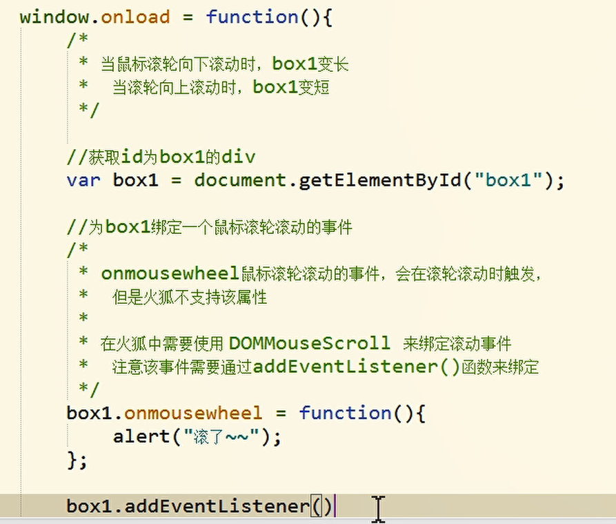

#### 滚轮事件的事件对象

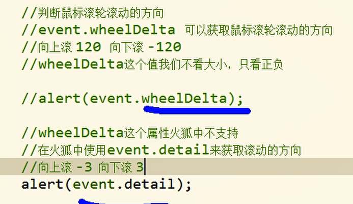


### 键盘事件

- onkeyup
- onkeydown（长按会连续触发，第一次和第二次触发之前会有一段时间间隙防止误，这个是无法改变的，如果要实现没有间隙的效果，可以用一个setInterval，在function里判断并且执行对应按下某个键要执行的操作 ）

键盘事件一般绑定给可以获取焦点的对象（例如input）或者是document

> altkey是是否按下alt的布尔值，如果要判断是否同时按下alt和c的话要用到这个

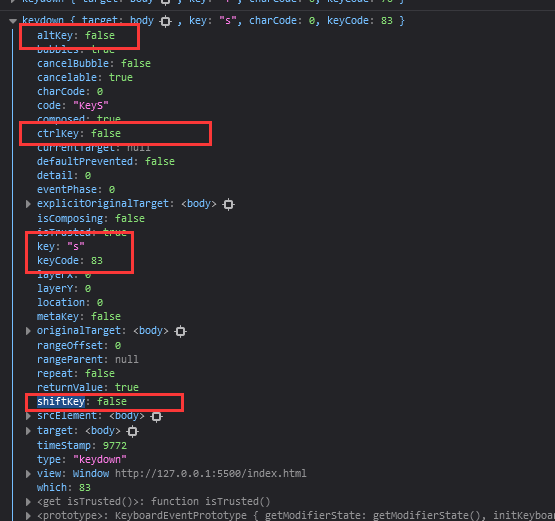


## 操作css样式 

### 操作内敛样式

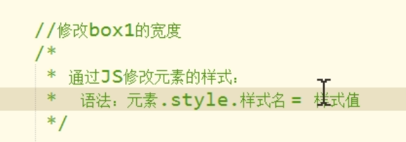

样式名中有-的话，用驼峰标识

### 获取元素当前样式(只读)

- ie     元素.currentStyle.样式名

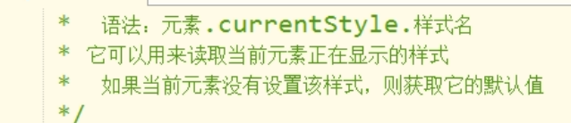

- 其他浏览器    getComputedStyle

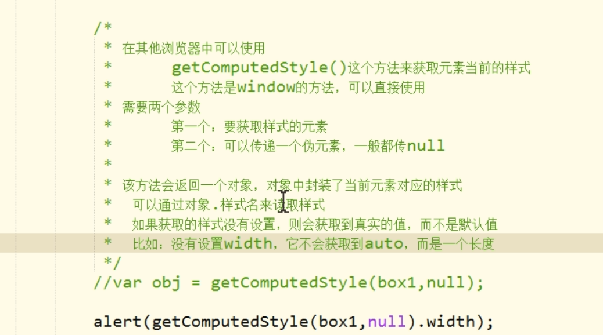

- 兼容写法

  如果第一个if不加window的话，因为全局作用域没有getComputedStyle这个变量，会报错（未定义），加一个window作为属性去找的话，没有就会返回undefined而不会报错

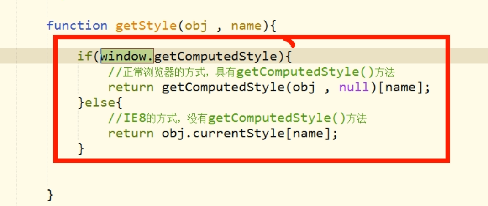

## 其他跟样式相关的dom属性

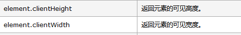

- clientHeight（只读）

获取元素的**可见**高度，会获取元素的宽度和高度，包括**内容区和内边距**

- clientWidth （只读）

获取元素的**可见**宽度，会获取元素的宽度和高度，包括**内容区和内边距**

------

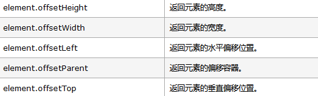

- offsetHeight

元素的**像素（显示的部分）**高度 包含元素的**垂直内边距和边框，水平滚动条的高度**，且是一个整数

- offsetParent

  获取当前元素的最近的开启了定位的祖先元素

- offsetLeft 

当前元素**相对于其定位元素**的水平偏移量

- offsetTop

当前元素**相对于其定位元素**的垂直偏移量

------

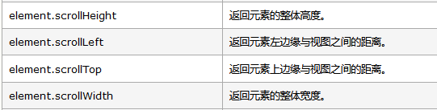

-  scrollTop

获取滚动条垂直移动的距离（必须是有滚动条的dom元素）

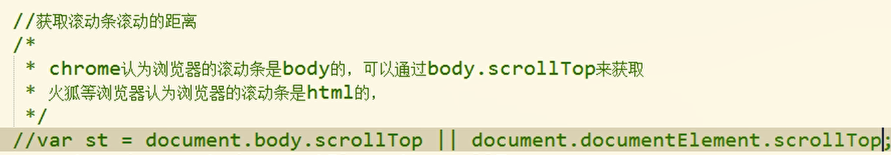

- scrollHeight

元素**不包括border的内容的高度**，包括溢出的不可见内容

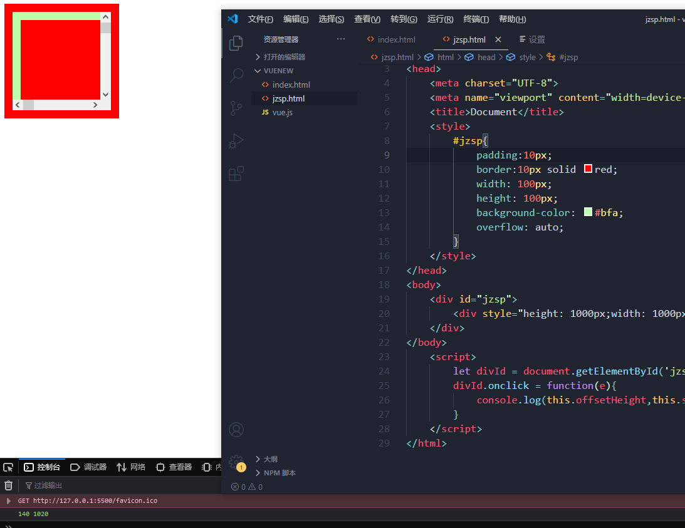

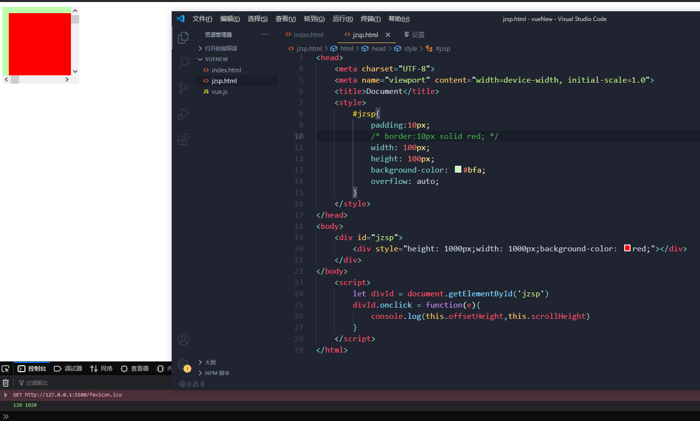

# Bom浏览器对象模型

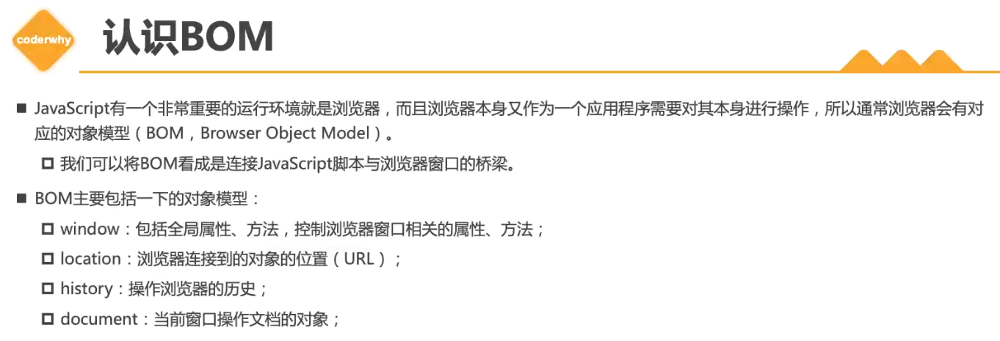

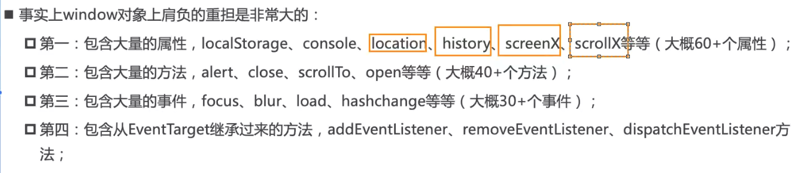


通过JS来操作浏览器，BOM对象如下

- Window
  - 代表的是整个浏览器的窗口，同时window也是网页中的全局对象
- Navigator
  - 代表的当前浏览器的信息，通过改对象可以来识别不同的浏览器
- Location
  - 代表当前浏览器的地址栏信息，可以从操作浏览器跳转页面
- History
  - 代表浏览器的历史记录（由于隐私原因，不能获取到具体的历史记录，只能操作浏览器向前或者向后翻页，也就是前进后退。）
- Screen
  - 代表用户的屏幕信息，可以获取到显示器的相关信息

## Navigator

用于判断是哪个浏览器

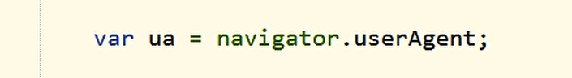

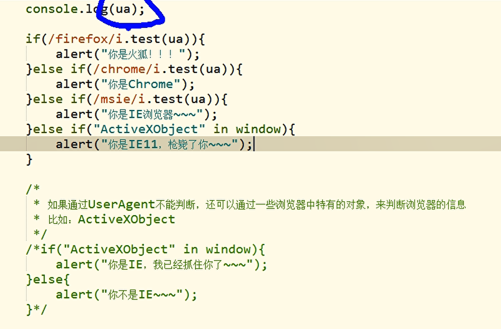

## History

- length  经过了几个url切换才到当前页面

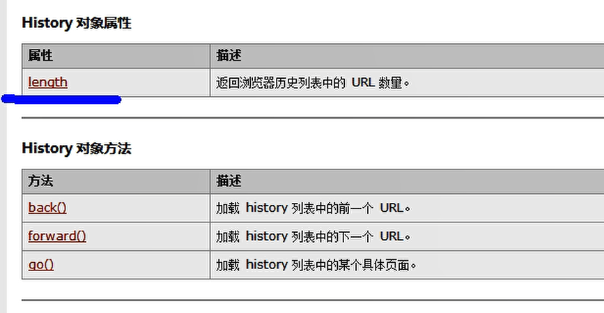

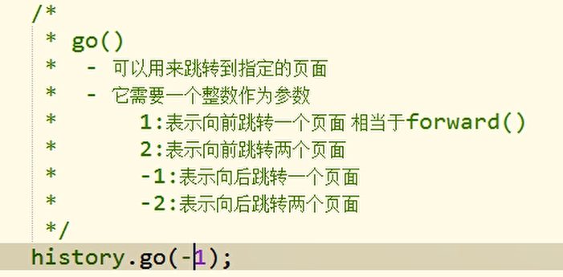

## Location

如果直接将location属性修改为一个完整的路径，或相对路径，则页面会自动跳转到该路径，并且会生成相应的History（也就是说可以回退）

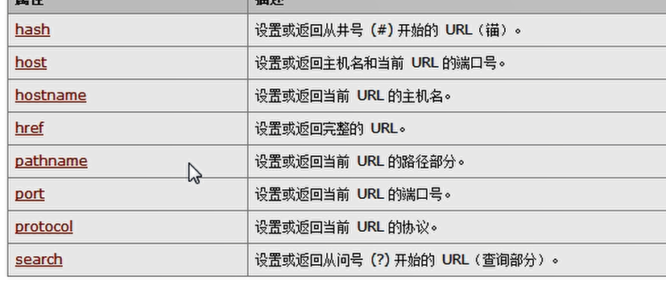

- assign和直接修改location的效果一样
- replace**不会生成对应**的History历史记录
- reload相当于**刷新页面**，如果参数传入一个**true的话会清空缓存刷新界面**

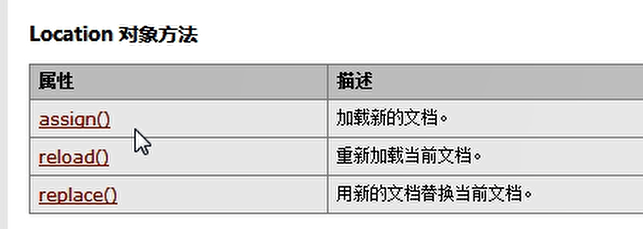

## window

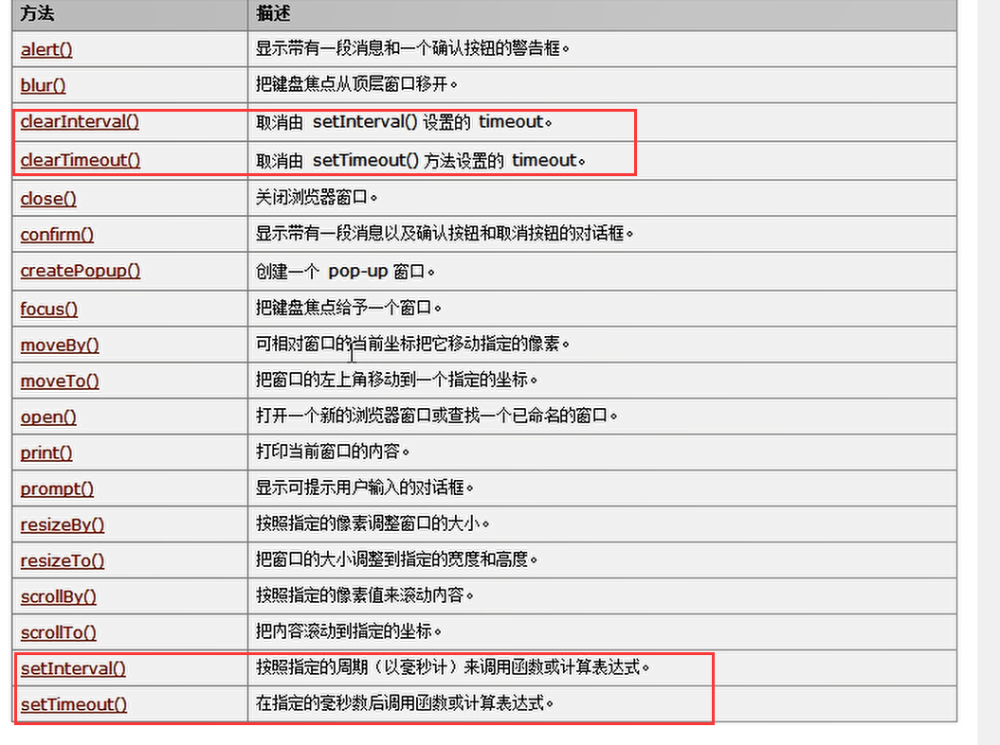

   setInterval会返回一个Number类型的值，这个值可以传入clearInterval中用于关闭定时器

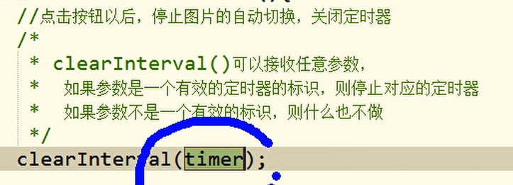

### 轮播图

轮播图中，到最后一张的时候，回到第一张会从后往前依次轮播回去，这样是不对的，我们想要的效果是一直往右后轮播。这种情况的解决办法是，如果ul中有五张图片，那么我们需要手动加一张图片（跟第一章一样），在第五张图片的时候轮播到下一张也就是第六张的同时，将left设置为0，就可以在无形之中重新将图片数组恢复初始值

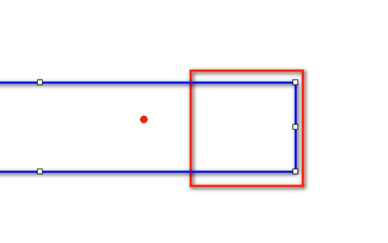

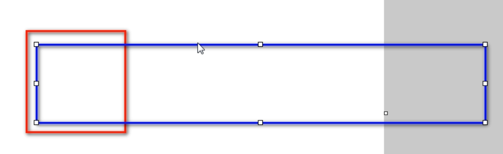