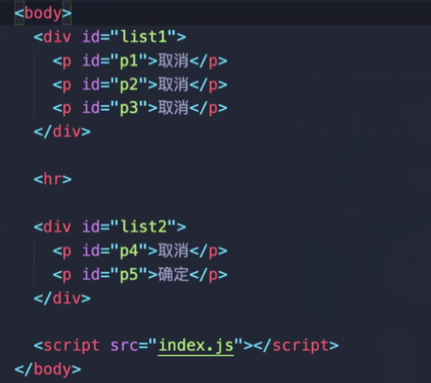
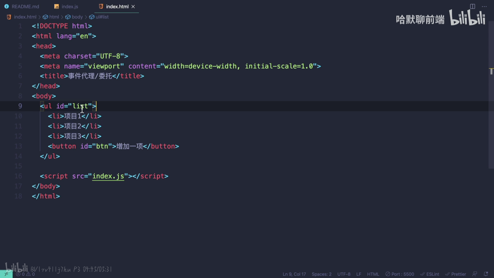
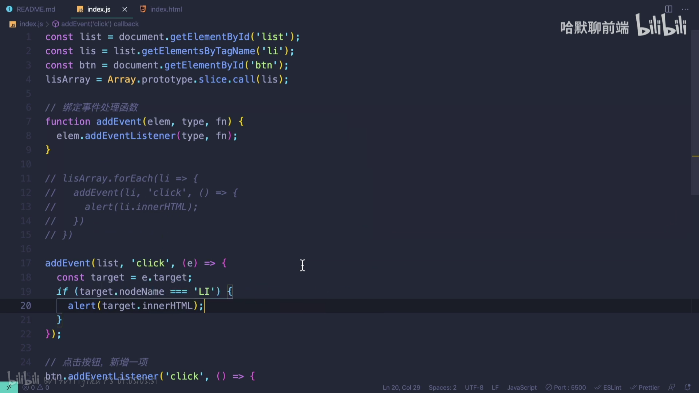
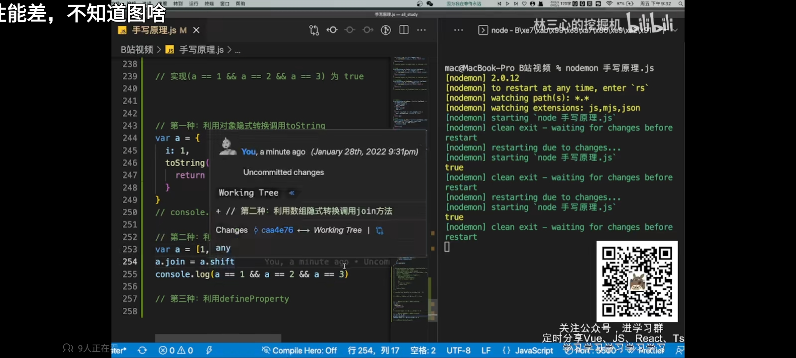
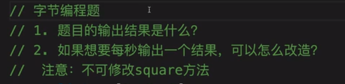
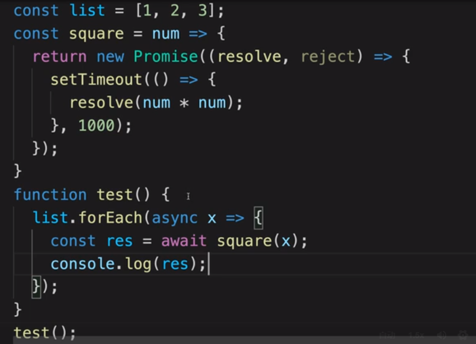
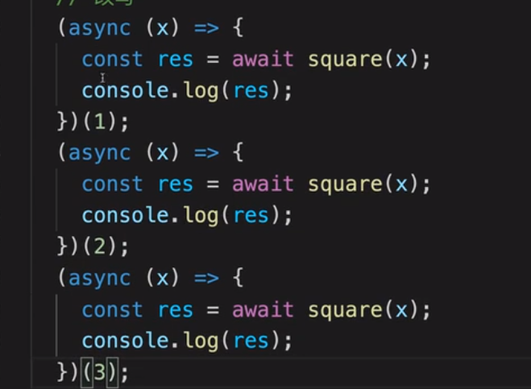
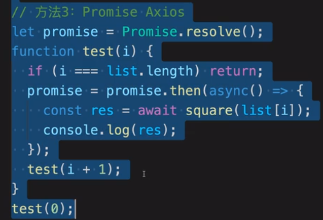

## 1.文档碎片Document Fragment

重复进行dom操作会消耗很大的性能，所以可以先将标签插入到文档碎片中（相当于内存），最后再插入到对应的标签里

```json
const list = document.getElementById ( 'list' );
//创建文档碎片
const fragment = document.createDocumentFragment();
for ( let i = 0; i< 5; i++) {
    const item = document.createElement( 'li');
    item.innerHTML =`项目${i}`;
    //list.appendChild(item );10fragment.appendChild( item);1l 
    }
list.appendChild( fragment);
```

## 2.stoppropagation阻止事件冒泡



```js
function bindEvent(elem,type, fn) {
    elem.addEventListener(type,fn);
}
const p5 = document.getElementById( 'p5 ' );
const list1 = document.getElementById ( 'list1 ' );
const body = document.body;
bindEvent(body, 'click' , function() {
    console.log( '取消");
})
bindEvent(p5, 'click ' , function(event){
    event.stopPropagaion();
    console.log( '确定');
})
```


## 3.事件代理

子元素的事件通过冒泡让父元素触发（如果子组件很多的时候可以减少性能消耗）





target是返回其事件监听器触发该事件的元素。


## 4、实现(a==1 && a==2 && a==3) 为true



## 5、闭包编程题（字节）

```js
var foo = function(...args){}  //要求实现函数体
var f1 = foo(1,2,3)    f1.get() = 6 //6
var f2 = foo(1)(2,3)   f2.get() = 6 //6
var f3 = foo(1)(2)(3)(4)   f3.get() = 10 //10  
```

```js
var foo = function(...args){
  //foo的返回值是一个函数对象，这个函数对象可以接收新的参数
  const fn = function(...args2){
    return foo(...[...args,...args2])
  }

  //可以调用返回的函数对象的get方法获取前面所有的值的总和
  //args保存了前面所有的参数
  fn.get = function(){
    return args.reduce((oldValue,item)=>{
      return oldValue + item
    },0)
  }
  return fn
}
var f1 = foo(1,2,3)    
console.log(f1.get())

var f2 = foo(1)(2,3)   
console.log(f2.get())

var f3 = foo(1)(2)(3)(4)   
console.log(f3.get())

```

## 6、foreach + promise





解释，虽然forEach中执行的是async函数，但是**它内部是通过while循环不断执行这个async函数**，相当于是执行了下面的代码



所以不会达到同步等待执行结束的效果（因为await不在同一个async函数下执行）

```js
let arr = [1,2,3]
function a (num){
  return new Promise((resolve,reject)=>{
    setTimeout(()=>{
      resolve(num * num)
    },1000)
  })
}

//这样是为了让await在同一个async函数下执行
async function test (){
  for(let i = 0 ; i < arr.length ; i++){
    const res = await a(arr[i])
    console.log(res)
  }
}
test()
```



7、实现100张图片，一次性请求五张，请求到了再继续请求五张

```js
import axios from "axios";

let url = "https://api.vvhan.com/api/acgimg";
axios.interceptors.request.use((config) => {
  config.headers["Content-Type"] =
    "application/x-www-form-urlencoded;charset=UTF-8";
  return config;
});
function getImg(url) {
  return Promise.all([
    axios.get(url + "?time=" + Math.random() * 100),
    axios.get(url + "?time=" + Math.random() * 100),
    axios.get(url + "?time=" + Math.random() * 100),
    axios.get(url + "?time=" + Math.random() * 100),
    axios.get(url + "?time=" + Math.random() * 100),
  ]);
}
async function foo() {
  let i = 0;
  while (i++ < 20) {
    await getImg(url);
  }
}
foo();

```

