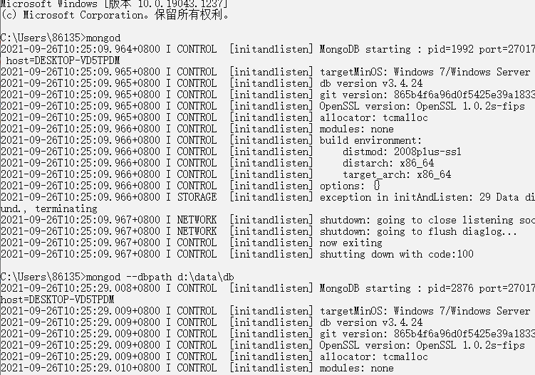
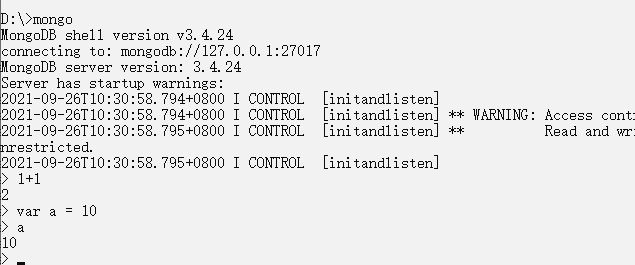
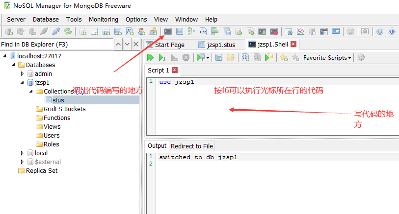
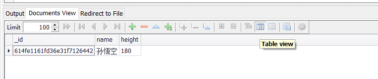
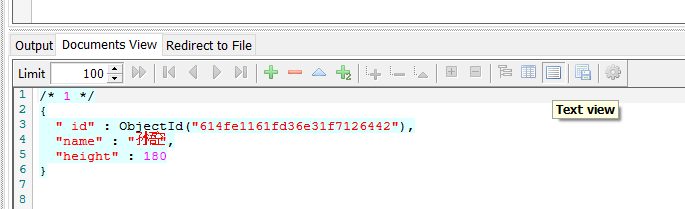
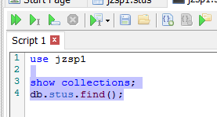
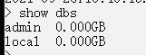
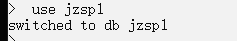
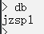
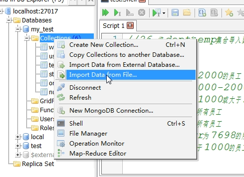

# 简介

MongoDB的数据模型是面向文档的，所谓的文档是一种类似于Json的结构，简单的理解MongoDb这个数据库中存的是各种各样的JSON。（BSON）


# 下载MongoDB

偶数版本为稳定版，奇数版本为开发版（3.1   3.3)

https://www.mongodb.com/try/download/community

配置bin目录的文件路径到path环境变量中


在cmd中输入mongod启动mongodb服务器

修改默认的存放目录（注意，根目录下得有对应的文件，不会自动创建的，然后修改路径)



# 使用

在d盘下打开cmd（因为我的路径修改为d盘的data中的db了），mongod启动**数据库服务器**

☆☆☆☆☆☆☆这句话的意思是，启动数据库，并且把后面的文件路径作为存储数据库的地方

☆☆☆☆☆☆☆后面还可以加上--port xxxx  修改默认端口


再打开一个cmd，输入mongo，启动**数据库客户端**对数据库进行操作



# NoSQL Manager



查询到的结果以表格的形式显示




以json的格式显示




左上角三个绿色按钮分别是：执行所有，  执行光标行，执行选中




# 基本指令

## 基本概念

数据库（database）
集合（collection）
文档（document）

在MongoDB中，数据库和集合都不需要手动创建，
      在我们创建文档时，如果文档所在的集合或数据库不存则，系统回自动船舰数据库和集合


## show dbs



## use 数据库名

进入对应数据库



## 查看当前数据库名	db



## 查看数据库中的集合show collections


# 数据库的CRUD操作

## 插入文档操作

```
1、向数据库中插入文档
	db.集合名.insert({})    插入成功会显示WriteResult({ "nInserted" : 1 })
		例子：向当前数据库中的stus集合中插入一个新的学生对象
		db.stus.insert({name:"孙悟空",height:180})
	插入多个就传入数组
		db.stus.insert([
            {name:"孙悟空",height:180},
            {name:"孙悟空",height:180}
		])
		
	也可以利用for循环
	但是下面的代码花了20s，因为insert相当于执行了2w此
	for(let i = 0 ; i < 20000; i++){
    	db.numbers.insert({_id:i})
	}			
	
	这样的话insert只插入了一次
	var arr = [];
	for(let i = 0 ; i < 20000; i++){
    	arr.push({_id:i})
	}db.numbers.insert(arr)
	db.numbers.find().count();
	
	
向集合中插入文档时，如果没有给文档指定_id属性，则数据库会自动为文档添加_id，该属性用来作为文档的唯一标识
调用ObjectId()可以根据时间戳生成id
```

## 查询文档操作

在开发时绝对不会执行不带条件的查询！！！！ 

```
2、查询当前集合的文档
	1、查询所有文档，返回值是一个文档对象的数组
	db.集合名.find()
	输出{ "_id" : ObjectId("614fe1161fd36e31f7126442"), "name" : "孙悟空", "height" : 180 }
	
	2、按条件查找：用逗号隔开是且的意思，同时满足
	db.集合名.find({
        属性名1：属性值1,
        属性名2：属性值2
	})
	例子：查找_id为hello的文档
	db.集合名.find({_id:"hello"})
	
	3、查询第一个符合条件的文档，返回的是一个文档对象
	db.集合名.findOne(条件)
	
	4、查询所有结果的数量
	db.stus.find().count()
	
	{
      "_id" : ObjectId("6150195a865e1d10219e4ab6"),
      "name" : "wjj",
      "age" : 1,
      "hobbies" : {
        "cities" : ["taizhou", "zhejiang", "fujian"],
        "fruits" : ["xigua", "hamigua", "jzsp"]
      }
	}
	5、如果查询条件是文档中的文档中的属性时，查询的key值要用引号
	username:'wjj'   并不是username='wjj'   而是包括'wjj',所以可以用这个对数组进行匹配
	db.user.find({"hobbies.cities":'taizhou'})
	
	6、查询number集合中num大于5000并且小于6000的文档
	(大于等于是$gte,小于是$lt,$eq是等于)
	db.number.find({
		num:{$gt:5000,$lt:6000}
	})
	
        7、skip((页码-1)*每页显示的条数).limit(每页显示的条数),mongodb会自动调节skip和limit的位置，谁先谁后是没关系的
	
	查询numbers集合中的前10条
	limit()设置数据上限
	db.numbers.find().limit(10)

	查询第11条到20条
	skip()跳过数据
	db.numbers.find().skip(10).limit(10)
	
	8、查询sal大于2000或num小于1000的
	$or
	db.numbers.find({
	  $or:[
	  	{sal：{$lt:1000}},
	  	{sal：{$gt:2000}}
	  ]
	})
	
	9、查询财务部的所有员工
	var depno = db.dept.findOne({dname:'财务部'}).deptno
	db.emp.find({depno:depno})
```

## 修改文档操作

```
1、db.集合名.update(查询条件，新对象，config)
注意，默认情况下会直接将新对象的内容替换掉旧对象的内容，并且默认情况下只修改一个（第一个）


2、如果需要修改指定的属性，而不是替换，需要使用“修改操作符”
$set 可以用来修改文档中的指定属性,而不是替换整个对象
db.stus.update(
	{_id:'hello'},
    {
        $set:{
            name:'wjj3',
            add:'taizhou'
        }
    }
)

3、删除指定元素$unset，$unset对象里的键值对，只需要指明key就可以了，value可以随便
db.stus.update(
    {_id:'hello'},
    {
        $unset:{
            add:''
        }
    }
)
4、db.集合名.updateMany()    修改多个


5、修改文档中的文档的属性
$push  可以重复追加信息
$addToSet    不会重复添加信息
db.user.update({name:'wjj'},{
    $push:{
        "hobbies.cities":"zhongguo"
    }
})

6、为所有薪资低于1000的员工增加工资400
$inc自增
db.emp.updateMany(
	{
		sal:{$lte:1000}
	},
	{
		$inc:{sal:400}
	}
)
```


## 删除操作

```
1、db.集合名.remove(条件，config)
	默认删除符合条件的所有文档，传递条件的方式跟find一样
	如果想要只删除一个，config传true即可，config还有其他的配置可以选择
	
	db.集合名.remove({})  删除所有文档   性能较差
	db.stus.remove({_id:'hello'})    删除所有符合条件的
	db.stus.remove({_id:'hello'},true)   删除第一个符合条件的
	
2、db.集合名.deleteOne(条件)
3、db.集合名.deleteMany(条件)

4、db.集合名.drop()    删除集合，如果只有一个集合的话，吧这个集合删了，数据库也没来了
5、db.dropDatabase()     删除当前use的数据库
```

但是一般来说，不会真的删除数据，只是会在数据中添加一个isDel的键值对，修改isDel的状态为   0或者1代表是否被删除

# 将集合（json）导入到数据库



# sort配上投影

## MongoDB sort() 方法

在 MongoDB 中使用 sort() 方法对数据进行排序，sort() 方法可以通过参数指定排序的字段，并使用 1 和 -1 来指定排序的方式，其中 **1 为升序排列，而 -1 是用于降序排列。**

### 语法

sort()方法基本语法如下所示：

```
db.COLLECTION_NAME.find().sort({KEY:1})
```


## 投影

find可以传入第二个参数，这个参数是一个对象，里面是键值对，value为0或者1，
key是要显示的字段名，value为0说明不显示，value为1说明显示

```
db.col.find({},{"title":1,_id:0})
只显示title，id是默认显示的，这里标记为不显示
```


## 实例

col 集合中的数据如下：

```
{ 	"_id" : ObjectId("56066542ade2f21f36b0313a"), 
	"title" : "PHP 教程", 
	"description" : "PHP 是一种创建动态交互性站点的强有力的服务器端脚本语言。", 
	"by" : "菜鸟教程", 
	"url" : "http://www.runoob.com", 
	"tags" : [ "php" ], 
	"likes" : 200 
}
{ 
	"_id" : ObjectId("56066549ade2f21f36b0313b"), 
	"title" : "Java 教程", 
	"description" : "Java 是由Sun Microsystems公司于1995年5月推出的高级程序设计语言。", 
	"by" : "菜鸟教程", 
	"url" : "http://www.runoob.com", 
	"tags" : [ "java" ], 
	"likes" : 150 
}
{ 
	"_id" : ObjectId("5606654fade2f21f36b0313c"),
    "title" : "MongoDB 教程",
    "description" : "MongoDB 是一个 Nosql 数据库", 
    "by" : "菜鸟教程",
    "url" : "http://www.runoob.com", 
    "tags" : [ "mongodb" ], 
    "likes" : 100 
}
```


以下实例演示了 col 集合中的数据按字段 likes 的降序排列：

```
db.col.find({},{"title":1,_id:0}).sort({"likes":-1})
{ "title" : "PHP 教程" }
{ "title" : "Java 教程" }
{ "title" : "MongoDB 教程" }
```

