# ⭐⭐⭐⭐

mongodb4.x之后会自启动mongodb服务，直接mongo就可以连接到数据库

# 基本概念

## MongoDB  概念解析 

不管我们学习什么数据库都应该学习其中的基础概念，在mongodb中基本的概念是文档、集合、数据库，下面我们挨个介绍。

下表将帮助您更容易理解Mongo中的一些概念：

| SQL术语/概念 | MongoDB术语/概念 | 解释/说明                           |
| ------------ | ---------------- | ----------------------------------- |
| database     | database         | 数据库                              |
| table        | collection       | 数据库表/集合                       |
| row          | document         | 数据记录行/文档                     |
| column       | field            | 数据字段/域                         |
| index        | index            | 索引                                |
| table joins  |                  | 表连接,MongoDB不支持                |
| primary key  | primary key      | 主键,MongoDB自动将_id字段设置为主键 |

通过下图实例，我们也可以更直观的了解Mongo中的一些概念：

## 基本指令

**"show dbs"** 命令可以显示所有数据的列表。

```
$ ./mongo
MongoDB shell version: 3.0.6
connecting to: test
> show dbs
local  0.078GB
test   0.078GB
> 
```

执行 **"db"** 命令可以显示当前数据库对象或集合。

```
$ ./mongo
MongoDB shell version: 3.0.6
connecting to: test
> db
test
> 
```

运行"use"命令，可以连接到一个指定的数据库。

```
> use local
switched to db local
> db
local
> 
```

以上实例命令中，"local" 是你要链接的数据库。

## 文档(Document)

文档是一组键值(key-value)对(即 BSON)。MongoDB 的文档不需要设置相同的字段，并且相同的字段不需要相同的数据类型，这与关系型数据库有很大的区别，也是 MongoDB 非常突出的特点。

一个简单的文档例子如下：

```
{
	"site":"www.runoob.com", 
	"name":"菜鸟教程"
}
```

下表列出了 RDBMS 与 MongoDB 对应的术语：

|       RDBMS        | MongoDB                            |
| :----------------: | ---------------------------------- |
|       数据库       | 数据库                             |
|        表格        | 集合                               |
|         行         | 文档                               |
|         列         | 字段                               |
|       表联合       | 嵌入文档                           |
|        主键        | 主键 (MongoDB 提供了 key  为 _id ) |
| 数据库服务和客户端 |                                    |
|   Mysqld/Oracle    | mongod                             |
|   mysql/sqlplus    | mongo                              |

需要注意的是：

1. 文档中的键/值对是有序的。
2. 文档中的值不仅可以是在双引号里面的字符串，还可以是其他几种数据类型（甚至可以是整个嵌入的文档)。
3. MongoDB区分类型和大小写。
4. MongoDB的文档不能有重复的键。
5. 文档的键是字符串。除了少数例外情况，键可以使用任意UTF-8字符。

文档键命名规范：

- 键不能含有\0 (空字符)。这个字符用来表示键的结尾。
- .和$有特别的意义，只有在特定环境下才能使用。
- 以下划线"_"开头的键是保留的(不是严格要求的)。

## capped collections⭐⭐⭐

Capped collections 就是固定大小的collection。

它有很高的性能以及队列过期的特性(过期按照插入的顺序)

Capped collections 是高性能自动的维护对象的插入顺序。它非常适合类似记录日志的功能，和标准的 collection  不同，你必须要显式的创建一个capped collection，指定一个 collection 的大小，单位是字节。**collection  的数据存储空间值提前分配的。**

Capped collections  可以**按照文档的插入顺序保存到集合中**，**而且这些文档在磁盘上存放位置也是按照插入顺序来保存的**，所以当我们更新Capped collections  中文档的时候，更新后的文档不可以超过之前文档的大小，这样话就可以确保所有文档在磁盘上的位置一直保持不变。

由于 Capped collection 是按照文档的插入顺序而不是使用索引确定插入位置，这样的话可以提高增添数据的效率。MongoDB 的操作日志文件 oplog.rs 就是利用 Capped Collection 来实现的。

要注意的是指定的存储大小包含了数据库的头信息。

```
db.createCollection("mycoll", {capped:true, size:100000})
```

- 在 capped collection 中，你能添加新的对象。
- 能进行更新，然而，对象不会增加存储空间。如果增加，更新就会失败 。
- 使用 Capped Collection 不能删除一个文档，可以使用 drop() 方法删除 collection 所有的行。
- 删除之后，你必须显式的重新创建这个 collection。
- 在32bit机器中，capped collection 最大存储为 1e9( 1X10^9)个字节。

## MongoDB 数据类型

下表为MongoDB中常用的几种数据类型。

| 数据类型           | 描述                                                         |
| ------------------ | ------------------------------------------------------------ |
| String             | 字符串。存储数据常用的数据类型。在 MongoDB 中，UTF-8 编码的字符串才是合法的。 |
| Integer            | 整型数值。用于存储数值。根据你所采用的服务器，可分为 32 位或 64 位。 |
| Boolean            | 布尔值。用于存储布尔值（真/假）。                            |
| Double             | 双精度浮点值。用于存储浮点值。                               |
| Min/Max keys       | 将一个值与 BSON（二进制的 JSON）元素的最低值和最高值相对比。 |
| Array              | 用于将数组或列表或多个值存储为一个键。                       |
| Timestamp          | 时间戳。记录文档修改或添加的具体时间。                       |
| Object             | 用于内嵌文档。                                               |
| Null               | 用于创建空值。                                               |
| Symbol             | 符号。该数据类型基本上等同于字符串类型，但不同的是，它一般用于采用特殊符号类型的语言。 |
| Date               | 日期时间。用 UNIX 时间格式来存储当前日期或时间。你可以指定自己的日期时间：创建 Date 对象，传入年月日信息。 |
| Object ID          | 对象 ID。用于创建文档的 ID。                                 |
| Binary Data        | 二进制数据。用于存储二进制数据。                             |
| Code               | 代码类型。用于在文档中存储 JavaScript 代码。                 |
| Regular expression | 正则表达式类型。用于存储正则表达式。                         |

下面说明下几种重要的数据类型。

### ObjectId

ObjectId 类似唯一主键，可以很快的去生成和排序，包含 12 bytes，含义是：

- 前 4 个字节表示创建 **unix** 时间戳,格林尼治时间 **UTC** 时间，比北京时间晚了 8 个小时
- 接下来的 3 个字节是机器标识码
- 紧接的两个字节由进程 id 组成 PID
- 最后三个字节是随机数


MongoDB 中存储的文档必须有一个 _id 键。这个键的值可以是任何类型的，默认是个 ObjectId 对象

由于 ObjectId 中保存了创建的时间戳，所以你不需要为你的文档保存时间戳字段，**你可以通过 getTimestamp 函数来获取文档的创建时间**:


ObjectId 转为字符串

```
> newObject.str
5a1919e63df83ce79df8b38f
```

### 字符串

**BSON 字符串都是 UTF-8 编码。**

### 时间戳

BSON 有一个特殊的时间戳类型用于 MongoDB 内部使用，与普通的 日期 类型不相关。 时间戳值是一个 64 位的值。其中：

- 前32位是一个 time_t 值（与Unix新纪元相差的秒数）
- 后32位是在某秒中操作的一个递增的`序数`

在单个 mongod 实例中，时间戳值通常是唯一的。

在复制集中， oplog 有一个 ts 字段。这个字段中的值使用BSON时间戳表示了操作时间。

> BSON 时间戳类型主要用于 MongoDB 内部使用。在大多数情况下的应用开发中，你可以使用 BSON 日期类型。

### 日期

表示当前距离 Unix新纪元（1970年1月1日）的毫秒数。日期类型是有符号的, 负数表示 1970 年之前的日期。

```
> var mydate1 = new Date()     //格林尼治时间
> mydate1
ISODate("2018-03-04T14:58:51.233Z")
> typeof mydate1
object
> var mydate2 = ISODate() //格林尼治时间
> mydate2
ISODate("2018-03-04T15:00:45.479Z")
> typeof mydate2
object
```

**这样创建的时间是日期类型，可以使用 JS 中的 Date 类型的方法。**

返回一个时间类型的字符串：

```
> var mydate1str = mydate1.toString()
> mydate1str
Sun Mar 04 2018 14:58:51 GMT+0000 (UTC) 
> typeof mydate1str
string
```

或者

```
> Date()
Sun Mar 04 2018 15:02:59 GMT+0000 (UTC)   
```

# 开启权限验证，超级管理员，用户权限管理

## 操作用户

第四个是先mongo dbName之后输入密码用的，也可以直接用mongo dbName -u username -p password连接数据库


- 第一步：use admin 数据库，创建管理员账号

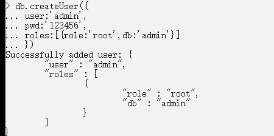

- 第二步，找到bin目录下的mongod.cfg文件，设置security权限


```
//图中的代码是错误的没有对齐，有几个注意点，要完全对齐，而且:后面要有一个空格，这里复制上代码。。。防止踩坑
security:
  authorization: enabled 
```


- 第三步，重启mongodb服务
- 第四步

如果mongod版本高于4.0版本 登录账号的时候需要使用db.auth("用户名","密码")


- 第五步

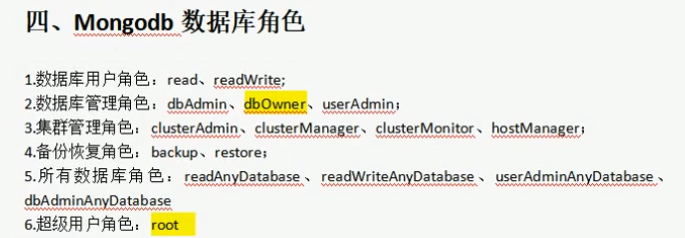


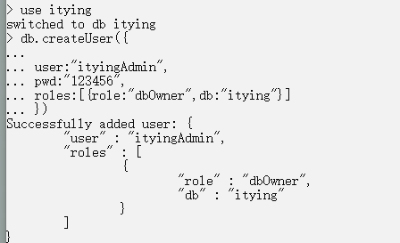

参数分别是连接指定数据库名，账号，密码


## 在mongo compass中登录数据库


## 在node中连接数据库

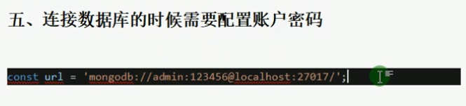

登录指定数据库

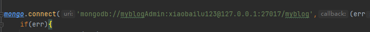

# MongoDB 条件操作符


| 操作       | 格式                     | 范例                                        | RDBMS中的类似语句       |
| ---------- | ------------------------ | ------------------------------------------- | ----------------------- |
| 等于       | `{<key>:<value>`}        | `db.col.find({"by":"菜鸟教程"}).pretty()`   | `where by = '菜鸟教程'` |
| 小于       | `{<key>:{$lt:<value>}}`  | `db.col.find({"likes":{$lt:50}}).pretty()`  | `where likes < 50`      |
| 小于或等于 | `{<key>:{$lte:<value>}}` | `db.col.find({"likes":{$lte:50}}).pretty()` | `where likes <= 50`     |
| 大于       | `{<key>:{$gt:<value>}}`  | `db.col.find({"likes":{$gt:50}}).pretty()`  | `where likes > 50`      |
| 大于或等于 | `{<key>:{$gte:<value>}}` | `db.col.find({"likes":{$gte:50}}).pretty()` | `where likes >= 50`     |
| 不等于     | `{<key>:{$ne:<value>}}`  | `db.col.find({"likes":{$ne:50}}).pretty()`  | `where likes != 50`     |

------

**MongoDB 中可以使用的类型如下表所示：**

| **类型**                | **数字** | **备注**         |
| ----------------------- | -------- | ---------------- |
| Double                  | 1        |                  |
| String                  | 2        |                  |
| Object                  | 3        |                  |
| Array                   | 4        |                  |
| Binary data             | 5        |                  |
| Undefined               | 6        | 已废弃。         |
| Object id               | 7        |                  |
| Boolean                 | 8        |                  |
| Date                    | 9        |                  |
| Null                    | 10       |                  |
| Regular Expression      | 11       |                  |
| JavaScript              | 13       |                  |
| Symbol                  | 14       |                  |
| JavaScript (with scope) | 15       |                  |
| 32-bit integer          | 16       |                  |
| Timestamp               | 17       |                  |
| 64-bit integer          | 18       |                  |
| Min key                 | 255      | Query with `-1`. |
| Max key                 | 127      |                  |

## $type 操作符

如果想获取 "col" 集合中 title 为 String 的数据，你可以使用以下命令：

```
db.col.find({"title" : {$type : 2}})
或
db.col.find({"title" : {$type : 'string'}})
```

输出结果为：

```
{ 
	"_id" : ObjectId("56066542ade2f21f36b0313a"), 
	"title" : "PHP 教程", 
	"description" : "PHP 是一种创建动态交互性站点的强有力的服务器端脚本语言。", 
	"by" : "菜鸟教程", 
	"url" : "http://www.runoob.com", 
	"tags" : [ "php" ], 
	"likes" : 200 
}
```

# 数据库相关

## MongoDB 创建数据库

**语法**

MongoDB 创建数据库的语法格式如下：

```shell
use DATABASE_NAME
```

如果数据库不存在，则创建数据库，否则切换到指定数据库。

**实例**

以下实例我们创建了数据库 runoob:

```
> use runoob
switched to db runoob
> db
runoob
> 
```

如果你想查看所有数据库，可以使用 **show dbs** 命令：

```
> show dbs
admin   0.000GB
config  0.000GB
local   0.000GB
> 
```

可以看到，我们刚创建的数据库 runoob 并不在数据库的列表中， 要显示它，我们需要向 runoob 数据库插入一些数据。

```
> db.runoob.insert({"name":"菜鸟教程"})
WriteResult({ "nInserted" : 1 })
> show dbs
admin   0.000GB
config  0.000GB
local   0.000GB
runoob  0.000GB
```

MongoDB 中默认的数据库为 test，如果你没有创建新的数据库，集合将存放在 test 数据库中。

## MongoDB 删除数据库

**语法**

MongoDB 删除数据库的语法格式如下：

```
db.dropDatabase()
```

删除当前数据库，默认为 test，你可以使用 db 命令查看当前数据库名。

**实例**

以下实例我们删除了数据库 runoob。

首先，查看所有数据库：

```
> show dbs
admin   0.000GB
config  0.000GB
local   0.000GB
runoob  0.000GB
```

接下来我们切换到数据库 runoob：

```
> use runoob
switched to db runoob
> 
```

执行删除命令：

```
> db.dropDatabase()
{ "dropped" : "runoob", "ok" : 1 }
```

最后，我们再通过 show dbs 命令数据库是否删除成功：

```
> show dbs
admin   0.000GB
config  0.000GB
local   0.000GB
```

# 集合相关

## MongoDB 创建集合

### 第一种方式createCollection()

语法

```
db.createCollection(name, options)
```

参数说明：

- name: 要创建的集合名称
- options: 可选参数, 指定有关内存大小及索引的选项

options 可以是如下参数：

| 字段        | 类型 | 描述                                                         |
| ----------- | ---- | ------------------------------------------------------------ |
| capped      | 布尔 | （可选）如果为 true，则创建固定集合。固定集合是指有着固定大小的集合，当达到最大值时，它会自动覆盖最早的文档。 **当该值为 true 时，必须指定 size 参数。** |
| autoIndexId | 布尔 | 3.2 之后不再支持该参数。（可选）如为 true，自动在 _id 字段创建索引。默认为 false。 |
| size        | 数值 | （可选）为固定集合指定一个最大值，即字节数。 **如果 capped 为 true，也需要指定该字段。** |
| max         | 数值 | （可选）指定固定集合中包含文档的最大数量。                   |

在插入文档时，MongoDB 首先检查固定集合的 size 字段，然后检查 max 字段。

**实例**

创建固定集合  mycol，整个集合空间大小 6142800 B, 文档最大个数为 10000 个。

```
db.createCollection("mycol", 
{ 
	capped : true, 
	size : 6142800, 
	max : 10000 
} )
```

如果要查看已有集合，可以使用 show collections 或 show tables 命令：

```
> show collections
mycol
system.indexes
```


### 第二种方法

在 MongoDB 中，你不需要创建集合。当你**插入一些文档时，MongoDB 会自动创建集合**。

```
> db.mycol2.insert({"name" : "菜鸟教程"})
> show collections
mycol2
...
```

## MongoDB 删除集合

MongoDB 中使用 drop() 方法来删除集合。

**语法格式：**

```
db.collection.drop()
```

**返回值**

如果成功删除选定集合，则 drop() 方法返回 true，否则返回 false。

**实例**

在数据库 mydb 中，我们可以先通过 show collections 命令查看已存在的集合：

```
>use mydb
switched to db mydb
>show collections
mycol
mycol2
system.indexes
runoob
>
```

接着删除集合 mycol2 : 

```
>db.mycol2.drop()
true
>
```

通过 show collections 再次查看数据库 mydb 中的集合：

```
>show collections
mycol
system.indexes
runoob
>
```

从结果中可以看出 mycol2 集合已被删除。

# 文档相关

## MongoDB  插入文档

文档的数据结构和 JSON 基本一样。

所有存储在集合中的数据都是 BSON 格式。

BSON 是一种类似 JSON 的二进制形式的存储格式，是 Binary JSON 的简称。

MongoDB 使用 insert() 向集合中插入文档，语法如下：

```
db.<COLLECTION_NAME>.insert(document)
或
db.<COLLECTION_NAME>.save(document)
```

- insert(): 若插入的数据主键已经存在，则会抛 **org.springframework.dao.DuplicateKeyException** 异常，提示主键重复，不保存当前数据。

**3.2 版本之后新增了 db.collection.insertOne() 和 db.collection.insertMany()。**

db.collection.insertOne() 用于向集合插入一个新文档，语法格式如下：

```
db.collection.insertOne(
   <document>,
   {
      writeConcern: <document>
   }
)
```

db.collection.insertMany() 用于向集合插入一个多个文档，语法格式如下：

```
db.collection.insertMany(
   [ <document 1> , <document 2>, ... ],
   {
      writeConcern: <document>,
      ordered: <boolean>
   }
)
```

参数说明：

- document：要写入的文档。
- writeConcern：写入策略，默认为 1，即要求确认写操作，0 是不要求。
- ordered：指定是否按顺序写入，默认 true，按顺序写入。

**实例**

以下文档可以存储在 MongoDB 的 runoob 数据库 的 col 集合中：

```
>db.col.insert(
	{title: 'MongoDB 教程', 
    description: 'MongoDB 是一个 Nosql 数据库',
    by: '菜鸟教程',
    url: 'http://www.runoob.com',
    tags: ['mongodb', 'database', 'NoSQL'],
    likes: 100}
)
```

以上实例中 col 是我们的集合名，如果该集合不在该数据库中， MongoDB 会自动创建该集合并插入文档。

我们也可以将数据定义为一个变量，如下所示：

```
> document=({title: 'MongoDB 教程', 
    description: 'MongoDB 是一个 Nosql 数据库',
    by: '菜鸟教程',
    url: 'http://www.runoob.com',
    tags: ['mongodb', 'database', 'NoSQL'],
    likes: 100
});
```

执行后显示结果如下：

```
{
        "title" : "MongoDB 教程",
        "description" : "MongoDB 是一个 Nosql 数据库",
        "by" : "菜鸟教程",
        "url" : "http://www.runoob.com",
        "tags" : [
                "mongodb",
                "database",
                "NoSQL"
        ],
        "likes" : 100
}
```

执行插入操作：

```
> db.col.insert(document)
WriteResult({ "nInserted" : 1 })
> 
```

### 插入可以嵌套在for循环中使用

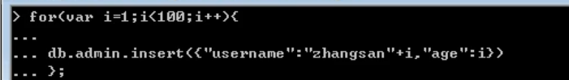

## MongoDB 更新文档

MongoDB 使用 **update()** 和 **save()** 方法来更新集合中的文档。接下来让我们详细来看下两个函数的应用及其区别。

------

### update() 方法

update() 方法用于更新已存在的文档。语法格式如下：

```
db.collection.update(
   <query>,
   <update>,
   {
     upsert: <boolean>,
     multi: <boolean>,
     writeConcern: <document>
   }
)
```

**参数说明：**

- **query** : update的查询条件，类似sql update查询内where后面的。
- **update** : update的对象和一些更新的操作符（如$,$inc...）等，也可以理解为sql update查询内set后面的
- **upsert**  : 可选，这个参数的意思是，如果不存在update的记录，是否插入objNew,true为插入，默认是false，不插入。
- **multi**  : 可选，mongodb 默认是false,只更新找到的第一条记录，如果这个参数为true,就把按条件查出来多条记录全部更新。
- **writeConcern**  :可选，抛出异常的级别。

### 实例

我们在集合 col 中插入如下数据：

```
>db.col.insert({
    title: 'MongoDB 教程', 
    description: 'MongoDB 是一个 Nosql 数据库',
    by: '菜鸟教程',
    url: 'http://www.runoob.com',
    tags: ['mongodb', 'database', 'NoSQL'],
    likes: 100
})
```

接着我们通过 update() 方法来更新标题(title和by):

```
>db.col.update(
    {'title':'MongoDB 教程'},
    {
        $set:{'title':'MongoDB','by':'jzsp'}
    }
)

WriteResult({ "nMatched" : 1, "nUpserted" : 0, "nModified" : 1 })   # 输出信息


> db.col.find().pretty()
{
        "_id" : ObjectId("56064f89ade2f21f36b03136"),
        "title" : "MongoDB",
        "description" : "MongoDB 是一个 Nosql 数据库",
        "by" : "jzsp",
        "url" : "http://www.runoob.com",
        "tags" : [
                "mongodb",
                "database",
                "NoSQL"
        ],
        "likes" : 100
}
```

可以看到标题(title)由原来的 "MongoDB 教程" 更新为了 "MongoDB"。

**以上语句只会修改第一条发现的文档，如果你要修改多条相同的文档，则需要设置 multi 参数为 true。**

```
>db.col.update(
    {'title':'MongoDB 教程'},
    {
        $set:{'title':'MongoDB'}
    },
    {multi:true}
)
```

**注意，如果update没有用类似于$符的属性，只是一个文档对象的话，会覆盖掉原来的文档**，具体如下

```
db.stus.update(
	{_id:'hello'},
    {	
    	//会覆盖掉
		name:'wjj',
		height:180
    }
)
```


------

### save() 方法

save() 方法通过传入的文档来替换已有文档，**_id 主键存在就更新，不存在就插入。**语法格式如下：

```
db.collection.save(
   <document>,
   {
     writeConcern: <document>
   }
)
```

**参数说明：**

- **document** : 文档数据。
- **writeConcern**  :可选，抛出异常的级别。

### 实例

以下实例中我们替换了 _id  为 56064f89ade2f21f36b03136 的文档数据：

```
>db.col.save({
    "_id" : ObjectId("56064f89ade2f21f36b03136"),
    "title" : "MongoDB",
    "description" : "MongoDB 是一个 Nosql 数据库",
    "by" : "Runoob",
    "url" : "http://www.runoob.com",
    "tags" : [
            "mongodb",
            "NoSQL"
    ],
    "likes" : 110
})
```

替换成功后，我们可以通过 find() 命令来查看替换后的数据

```
>db.col.find().pretty()
{
        "_id" : ObjectId("56064f89ade2f21f36b03136"),
        "title" : "MongoDB",
        "description" : "MongoDB 是一个 Nosql 数据库",
        "by" : "Runoob",
        "url" : "http://www.runoob.com",
        "tags" : [
                "mongodb",
                "NoSQL"
        ],
        "likes" : 110
}
> 
```

------

### 更多实例

- **upsert**  : 可选，这个参数的意思是，如果不存在update的记录，是否插入objNew,true为插入，默认是false，不插入。
- **multi**  : 可选，mongodb 默认是false,只更新找到的第一条记录，如果这个参数为true,就把按条件查出来多条记录全部更新。

```
只更新第一条记录：
db.col.update( { "count" : { $gt : 1 } } , { $set : { "test2" : "OK"} } );

全部更新：
db.col.update( { "count" : { $gt : 3 } } , { $set : { "test2" : "OK"} },false,true ); 

只添加第一条：
db.col.update( { "count" : { $gt : 4 } } , { $set : { "test5" : "OK"} },true,false ); 

全部添加进去:
db.col.update( { "count" : { $gt : 5 } } , { $set : { "test5" : "OK"} },true,true); 

全部更新：
db.col.update( { "count" : { $gt : 15 } } , { $inc : { "count" : 1} },false,true );

只更新第一条记录：
db.col.update( { "count" : { $gt : 10 } } , { $inc : { "count" : 1} },false,false );
```

## MongoDB 删除文档

MongoDB remove() 函数是用来移除集合中的数据。

在执行 remove() 函数前先执行 find() 命令来判断执行的条件是否正确，这是一个比较好的习惯。

**语法**

remove() 方法的基本语法格式如下所示：

```
db.collection.remove(
   <query>,
   <justOne>
)
```

如果你的 MongoDB 是 2.6 版本以后的，语法格式如下：

```
db.collection.remove(
   <query>,
   {
     justOne: <boolean>,
     writeConcern: <document>
   }
)
```

**参数说明：**

- **query** : 删除的文档的条件。
- **justOne** : （可选）如果设为 true 或 1，则只删除一个文档，如果不设置该参数，或使用默认值 false，则删除所有匹配条件的文档。
- **writeConcern**  :（可选）抛出异常的级别。

**实例**

以下文档我们执行两次插入操作：

```
>db.col.insert({title: 'MongoDB 教程', 
    description: 'MongoDB 是一个 Nosql 数据库',
    by: '菜鸟教程',
    url: 'http://www.runoob.com',
    tags: ['mongodb', 'database', 'NoSQL'],
    likes: 100
})
```

使用 find() 函数查询数据：

```
> db.col.find()
{ 
	"_id" : ObjectId("56066169ade2f21f36b03137"), 
	"title" : "MongoDB 教程", 
	"description" : "MongoDB 是一个 Nosql 数据库", 
	"by" : "菜鸟教程", 
	"url" : "http://www.runoob.com", 
	"tags" : [ "mongodb", "database", "NoSQL" ], 
	"likes" : 100 
}
{ 
	"_id" : ObjectId("5606616dade2f21f36b03138"), 
	"title" : "MongoDB 教程", 
	"description" : "MongoDB 是一个 Nosql 数据库", 
	"by" : "菜鸟教程", 
	"url" : "http://www.runoob.com", 
	"tags" : [ "mongodb", "database", "NoSQL" ], 
	"likes" : 100 
}
```

接下来我们移除 title 为 'MongoDB 教程' 的文档：

```
>db.col.remove({'title':'MongoDB 教程'})
WriteResult({ "nRemoved" : 2 })           # 删除了两条数据
>db.col.find()
……                                        # 没有数据
```

------

如果你只想删除第一条找到的记录可以设置 justOne 为 1，如下所示：

```
>db.COLLECTION_NAME.remove(DELETION_CRITERIA,1)
```

如果你想删除所有数据，可以使用以下方式（类似常规 SQL  的 truncate 命令）：

```
>db.col.remove({})
>db.col.find()
>
```

## MongoDB 查询文档

MongoDB 查询文档使用 find() 方法。

find() 方法以非结构化的方式来显示所有文档。

**query每一个花括号对应一层条件**

**语法**

MongoDB 查询数据的语法格式如下：

```
db.collection.find(query, projection)
```

- **query** ：可选，使用查询操作符指定查询条件
- **projection** ：可选，使用投影操作符指定返回的键。查询时返回文档中所有键值， 只需省略该参数即可（默认省略）。

如果你需要以易读的方式来读取数据，可以使用 pretty() 方法，语法格式如下：

```
>db.col.find().pretty()
```

### **pretty() 格式化显示所有文档。⭐⭐⭐⭐⭐⭐**

pretty() 方法以格式化的方式来显示所有文档。

**实例**

以下实例我们查询了集合 col 中的数据：

```
> db.col.find().pretty()
{
        "_id" : ObjectId("56063f17ade2f21f36b03133"),
        "title" : "MongoDB 教程",
        "description" : "MongoDB 是一个 Nosql 数据库",
        "by" : "菜鸟教程",
        "url" : "http://www.runoob.com",
        "tags" : [
                "mongodb",
                "database",
                "NoSQL"
        ],
        "likes" : 100
}
```

除了 find() 方法之外，还有一个 findOne() 方法，它只返回一个文档。

------

**MongoDB 与 RDBMS Where 语句比较**

如果你熟悉常规的 SQL 数据，通过下表可以更好的理解 MongoDB 的条件语句查询：

| 操作       | 格式                     | 范例                                        | RDBMS中的类似语句       |
| ---------- | ------------------------ | ------------------------------------------- | ----------------------- |
| 等于       | `{<key>:<value>`}        | `db.col.find({"by":"菜鸟教程"}).pretty()`   | `where by = '菜鸟教程'` |
| 小于       | `{<key>:{$lt:<value>}}`  | `db.col.find({"likes":{$lt:50}}).pretty()`  | `where likes < 50`      |
| 小于或等于 | `{<key>:{$lte:<value>}}` | `db.col.find({"likes":{$lte:50}}).pretty()` | `where likes <= 50`     |
| 大于       | `{<key>:{$gt:<value>}}`  | `db.col.find({"likes":{$gt:50}}).pretty()`  | `where likes > 50`      |
| 大于或等于 | `{<key>:{$gte:<value>}}` | `db.col.find({"likes":{$gte:50}}).pretty()` | `where likes >= 50`     |
| 不等于     | `{<key>:{$ne:<value>}}`  | `db.col.find({"likes":{$ne:50}}).pretty()`  | `where likes != 50`     |

------

### MongoDB AND 条件

MongoDB 的 find() 方法可以传入多个键(key)，每个键(key)以逗号隔开，即常规 SQL  的 AND 条件。

语法格式如下：

```
>db.col.find(
{
	key1:value1, 
	key2:value2
}).pretty()
```

**实例**

以下实例通过 **by** 和 **title** 键来查询 **菜鸟教程** 中 **MongoDB 教程** 的数据

```json
> db.col.find({"by":"菜鸟教程", "title":"MongoDB 教程"}).pretty()
{
        "_id" : ObjectId("56063f17ade2f21f36b03133"),
        "title" : "MongoDB 教程",
        "description" : "MongoDB 是一个 Nosql 数据库",
        "by" : "菜鸟教程",
        "url" : "http://www.runoob.com",
        "tags" : [
                "mongodb",
                "database",
                "NoSQL"
        ],
        "likes" : 100
}
```

以上实例中类似于 WHERE 语句：**WHERE by='菜鸟教程' AND title='MongoDB 教程'**

------

### MongoDB OR 条件

MongoDB OR 条件语句使用了关键字 **$or**,语法格式如下：

```
>db.col.find(
   {
      $or: [
         {key1: value1}, {key2:value2}
      ]
   }
).pretty()
```

**实例**

以下实例中，我们演示了查询键 **by** 值为 菜鸟教程 或键 **title** 值为 **MongoDB 教程** 的文档。

```
>db.col.find({$or:[{"by":"菜鸟教程"},{"title": "MongoDB 教程"}]}).pretty()
{
        "_id" : ObjectId("56063f17ade2f21f36b03133"),
        "title" : "MongoDB 教程",
        "description" : "MongoDB 是一个 Nosql 数据库",
        "by" : "菜鸟教程",
        "url" : "http://www.runoob.com",
        "tags" : [
                "mongodb",
                "database",
                "NoSQL"
        ],
        "likes" : 100
}
>
```

------

### AND 和 OR 联合使用

以下实例演示了 AND 和 OR 联合使用，类似常规 SQL 语句为： **'where likes>50 AND (by = '菜鸟教程' OR title = 'MongoDB 教程')'**

```
>db.col.find({
	"likes": {
		$gt:50，
		//这里还可以and其他的条件，例如小于等于60
		$lte:60
	},
     $or: [
         {"by": "菜鸟教程"},
         {"title": "MongoDB 教程"}
     ]}).pretty()
{
        "_id" : ObjectId("56063f17ade2f21f36b03133"),
        "title" : "MongoDB 教程",
        "description" : "MongoDB 是一个 Nosql 数据库",
        "by" : "菜鸟教程",
        "url" : "http://www.runoob.com",
        "tags" : [
                "mongodb",
                "database",
                "NoSQL"
        ],
        "likes" : 100
}
```

### limit和skip

#### MongoDB Limit() 方法

如果你需要在MongoDB中读取指定数量的数据记录，可以使用MongoDB的Limit方法，limit()方法接受一个数字参数，该参数指定从MongoDB中读取的记录条数。

**语法**

limit()方法基本语法如下所示：

```
>db.COLLECTION_NAME.find().limit(NUMBER)
```

**实例**

集合 col 中的数据如下：

```json
{ "_id" : ObjectId("56066542ade2f21f36b0313a"), "title" : "PHP 教程", "description" : "PHP 是一种创建动态交互性站点的强有力的服务器端脚本语言。", "by" : "菜鸟教程", "url" : "http://www.runoob.com", "tags" : [ "php" ], "likes" : 200 }
{ "_id" : ObjectId("56066549ade2f21f36b0313b"), "title" : "Java 教程", "description" : "Java 是由Sun Microsystems公司于1995年5月推出的高级程序设计语言。", "by" : "菜鸟教程", "url" : "http://www.runoob.com", "tags" : [ "java" ], "likes" : 150 }
{ "_id" : ObjectId("5606654fade2f21f36b0313c"), "title" : "MongoDB 教程", "description" : "MongoDB 是一个 Nosql 数据库", "by" : "菜鸟教程", "url" : "http://www.runoob.com", "tags" : [ "mongodb" ], "likes" : 100 }
```

 以下实例为显示查询文档中的两条记录：

```
> db.col.find({},{"title":1,_id:0}).limit(2)
{ "title" : "PHP 教程" }
{ "title" : "Java 教程" }
>
```

注：如果你们没有指定limit()方法中的参数则显示集合中的所有数据。

------

#### MongoDB Skip() 方法

我们除了可以使用limit()方法来读取指定数量的数据外，还可以使用skip()方法来跳过指定数量的数据，skip方法同样接受一个数字参数作为跳过的记录条数。

**语法**

skip() 方法脚本语法格式如下：

```
>db.COLLECTION_NAME.find().limit(NUMBER).skip(NUMBER)
```

**实例**

以下实例只会显示第二条文档数据

```
>db.col.find({},{"title":1,_id:0}).limit(1).skip(1)
{ "title" : "Java 教程" }
>
```

**注:**skip()方法默认参数为 0 。

#### 注意

mongodb会自动调节skip和limit的位置，谁先谁后是没关系的

### 模糊查询

```
包含：/str/
```

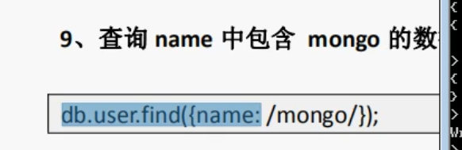

```
开头：/^str/

结尾:/str$/
```

### 获取条数

```
db.user.find().count()
```


# sort配上投影(指定列)⭐⭐

## MongoDB sort() 方法

在 MongoDB 中使用 sort() 方法对数据进行排序，sort() 方法可以通过参数指定排序的字段，并使用 1 和 -1 来指定排序的方式，其中 **1 为升序排列，而 -1 是用于降序排列。**

**语法**

sort()方法基本语法如下所示：

```
db.COLLECTION_NAME.find().sort({KEY:1})
```

## 投影

find可以传入第二个参数，这个参数是一个对象，里面是键值对，value为0或者1，
key是要显示的字段名，value为0说明不显示，value为1说明显示

```
db.col.find({},{"title":1,_id:0})
只显示title，id是默认显示的，这里标记为不显示
```

## 实例

col 集合中的数据如下：

```
{ 	"_id" : ObjectId("56066542ade2f21f36b0313a"), 
	"title" : "PHP 教程", 
	"description" : "PHP 是一种创建动态交互性站点的强有力的服务器端脚本语言。", 
	"by" : "菜鸟教程", 
	"url" : "http://www.runoob.com", 
	"tags" : [ "php" ], 
	"likes" : 200 
}
{ 
	"_id" : ObjectId("56066549ade2f21f36b0313b"), 
	"title" : "Java 教程", 
	"description" : "Java 是由Sun Microsystems公司于1995年5月推出的高级程序设计语言。", 
	"by" : "菜鸟教程", 
	"url" : "http://www.runoob.com", 
	"tags" : [ "java" ], 
	"likes" : 150 
}
{ 
	"_id" : ObjectId("5606654fade2f21f36b0313c"),
    "title" : "MongoDB 教程",
    "description" : "MongoDB 是一个 Nosql 数据库", 
    "by" : "菜鸟教程",
    "url" : "http://www.runoob.com", 
    "tags" : [ "mongodb" ], 
    "likes" : 100 
}
```


以下实例演示了 col 集合中的数据按字段 likes 的降序排列：

```
db.col.find({},{"title":1,_id:0}).sort({"likes":-1})
{ "title" : "PHP 教程" }
{ "title" : "Java 教程" }
{ "title" : "MongoDB 教程" }
```

# MongoDB 索引

索引通常能够极大的提高查询的效率，如果没有索引，MongoDB在读取数据时必须扫描集合中的每个文件并选取那些符合查询条件的记录。

这种扫描全集合的查询效率是非常低的，特别在处理大量的数据时，查询可以要花费几十秒甚至几分钟，这对网站的性能是非常致命的。

索引是特殊的数据结构，索引存储在一个易于遍历读取的数据集合中，索引是对数据库表中一列或多列的值进行排序的一种结构

------

##  createIndex() 方法

MongoDB使用 createIndex() 方法来创建索引。

> 注意在 3.0.0 版本前创建索引方法为 db.collection.ensureIndex()，之后的版本使用了 db.collection.createIndex() 方法，ensureIndex() 还能用，但只是 createIndex() 的别名。

### 语法

createIndex()方法基本语法格式如下所示：

```
>db.collection.createIndex(keys, options)
```

语法中 Key 值为你要创建的索引字段，1 为指定按升序创建索引，如果你想按降序来创建索引指定为 -1 即可。

### 实例

```
>db.col.createIndex({"title":1})
>
```

createIndex() 方法中你也可以设置使用多个字段创建索引（关系型数据库中称作**复合索引**）。

```
>db.col.createIndex({"title":1,"description":-1})
>
```

**注意，复合索引的细节**


createIndex() 第二个参数是可选参数，可选参数列表如下：

| Parameter          | Type          | Description                                                  |
| ------------------ | ------------- | ------------------------------------------------------------ |
| background         | Boolean       | 建索引过程会**阻塞其它数据库操作**，background可指定以后台方式创建索引，即增加 "background"    可选参数。  "background" 默认值为**false**。 |
| **unique**         | Boolean       | 建立的索引是否唯一。指定为true创建唯一索引。默认值为**false**. |
| name               | string        | 索引的名称。如果未指定，MongoDB的通过连接索引的字段名和排序顺序生成一个索引名称。 |
| dropDups           | Boolean       | 3.0+版本已废弃。在建立唯一索引时是否删除重复记录,指定 true 创建唯一索引。默认值为 **false**. |
| sparse             | Boolean       | 对文档中不存在的字段数据不启用索引；这个参数需要特别注意，如果设置为true的话，在索引字段中不会查询出不包含对应字段的文档.。默认值为 **false**. |
| expireAfterSeconds | integer       | 指定一个以秒为单位的数值，完成 TTL设定，设定集合的生存时间。 |
| v                  | index version | 索引的版本号。默认的索引版本取决于mongod创建索引时运行的版本。 |
| weights            | document      | 索引权重值，数值在 1 到 99,999 之间，表示该索引相对于其他索引字段的得分权重。 |
| default_language   | string        | 对于文本索引，该参数决定了停用词及词干和词器的规则的列表。 默认为英语 |
| language_override  | string        | 对于文本索引，该参数指定了包含在文档中的字段名，语言覆盖默认的language，默认值为 language. |

### 实例

在后台创建索引：

```
db.values.createIndex({open: 1, close: 1}, {background: true})
```

通过在创建索引时加 background:true 的选项，让创建工作在后台执行

## 其他

1、查看集合索引

```
db.col.getIndexes()
```

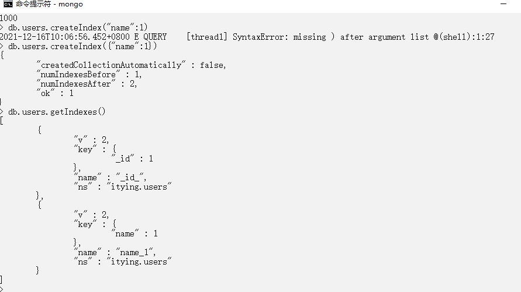

2、查看集合索引大小

```
db.col.totalIndexSize()
```

3、删除集合所有索引

```
db.col.dropIndexes()
```

4、删除集合指定索引

```
db.col.dropIndex("索引名称")
```

# MongoDB 聚合

MongoDB 中聚合(aggregate)主要用于处理数据(诸如统计平均值，求和等)，并返回计算后的数据结果。

有点类似 **SQL** 语句中的 count(*)。

------

## aggregate() 方法

MongoDB中聚合的方法使用aggregate()。aggregate方法中传入管道对象数组，只有一条管道的时候可以不用数组包裹

### 语法

aggregate() 方法的基本语法格式如下所示：

```
>db.COLLECTION_NAME.aggregate(AGGREGATE_OPERATION)
```

### 实例

集合中的数据如下：

```
{
   _id: ObjectId(7df78ad8902c)
   title: 'MongoDB Overview', 
   description: 'MongoDB is no sql database',
   by_user: 'runoob.com',
   url: 'http://www.runoob.com',
   tags: ['mongodb', 'database', 'NoSQL'],
   likes: 100
},
{
   _id: ObjectId(7df78ad8902d)
   title: 'NoSQL Overview', 
   description: 'No sql database is very fast',
   by_user: 'runoob.com',
   url: 'http://www.runoob.com',
   tags: ['mongodb', 'database', 'NoSQL'],
   likes: 10
},
{
   _id: ObjectId(7df78ad8902e)
   title: 'Neo4j Overview', 
   description: 'Neo4j is no sql database',
   by_user: 'Neo4j',
   url: 'http://www.neo4j.com',
   tags: ['neo4j', 'database', 'NoSQL'],
   likes: 750
},
```

现在我们通过以上集合计算每个作者所写的文章数，使用aggregate()计算结果如下：
代码解释为：第一个管道是分组，按照by_user字段分组，$sum:1是匹配到一个就在总数加一

```
db.mycol.aggregate([
    {
        $group : {
        	_id : "$by_user", 
        	num_tutorial : {$sum : 1}
        }
    }
])
{
   "result" : [
      {
         "_id" : "runoob.com",
         "num_tutorial" : 2
      },
      {
         "_id" : "Neo4j",
         "num_tutorial" : 1
      }
   ],
   "ok" : 1
}
```

以上实例类似sql语句：

```
 select by_user, count(*) from mycol group by by_user
```

在上面的例子中，我们通过字段 by_user 字段对数据进行分组，并计算 by_user 字段相同值的总和。

下表展示了一些聚合的表达式:

| 表达式    | 描述                                                         | 实例                                                         |
| --------- | ------------------------------------------------------------ | ------------------------------------------------------------ |
| $sum      | 计算总和。                                                   | db.mycol.aggregate([{$group : {_id : "$by_user", num_tutorial : {$sum : "$likes"}}}]) |
| $avg      | 计算平均值                                                   | db.mycol.aggregate([{$group : {_id : "$by_user", num_tutorial : {$avg : "$likes"}}}]) |
| $min      | 获取集合中所有文档对应值得最小值。                           | db.mycol.aggregate([{$group : {_id : "$by_user", num_tutorial : {$min : "$likes"}}}]) |
| $max      | 获取集合中所有文档对应值得最大值。                           | db.mycol.aggregate([{$group : {_id : "$by_user", num_tutorial : {$max : "$likes"}}}]) |
| $push     | 将值加入一个数组中，不会判断是否有重复的值。                 | db.mycol.aggregate([{$group : {_id : "$by_user", url : {$push: "$url"}}}]) |
| $addToSet | 将值加入一个数组中，会判断是否有重复的值，若相同的值在数组中已经存在了，则不加入。 | db.mycol.aggregate([{$group : {_id : "$by_user", url : {$addToSet : "$url"}}}]) |
| $first    | 根据资源文档的排序获取第一个文档数据。                       | db.mycol.aggregate([{$group : {_id : "$by_user", first_url : {$first : "$url"}}}]) |
| $last     | 根据资源文档的排序获取最后一个文档数据                       | db.mycol.aggregate([{$group : {_id : "$by_user", last_url : {$last : "$url"}}}]) |

------

## 管道的概念

管道在Unix和Linux中一般用于将当前命令的输出结果作为下一个命令的参数。

MongoDB的聚合管道将MongoDB文档在一个管道处理完毕后将结果传递给下一个管道处理。管道操作是可以重复的。

表达式：处理输入文档并输出。表达式是无状态的，只能用于计算当前聚合管道的文档，不能处理其它的文档。

这里我们介绍一下聚合框架中常用的几个操作：

- **$project：修改输入文档的结构。可以用来重命名、增加或删除域，也可以用于创建计算结果以及嵌套文档。**
- **$match：用于过滤数据，只输出符合条件的文档。$match使用MongoDB的标准查询操作。**
- **$lookup:用于引入其他集合的数据（关联查询）**
- **$limit：用来限制MongoDB聚合管道返回的文档数。**
- **$skip：在聚合管道中跳过指定数量的文档，并返回余下的文档。**
- **$unwind：将文档中的某一个数组类型字段拆分成多条，每条包含数组中的一个值。**
- **$group：将集合中的文档分组，可用于统计结果。**
- **$sort：将输入文档排序后输出。**
- **$geoNear：输出接近某一地理位置的有序文档。**

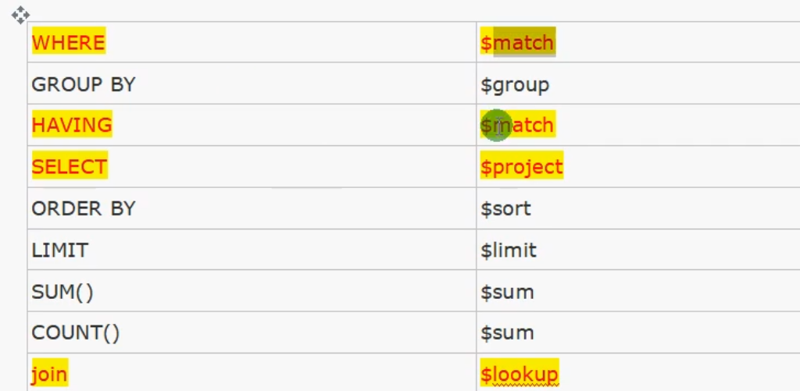

管道操作符实例

## 1.$project实例

```
db.article.aggregate(
    { 
        $project : {
            title : 1 ,
            author : 1 ,
        }
    }
 );
```

这样的话结果中就只还有_id,tilte和author三个字段了，默认情况下_id字段是被包含的，如果要想不包含_id话可以这样:

```
db.article.aggregate(
  { 
        $project : {
            _id : 0 ,
            title : 1 ,
            author : 1
        }
 });
```

## 2.$match实例

```
db.articles.aggregate( [
                        { $match : { score : { $gt : 70, $lte : 90 } } },
                        { $group: { _id: null, count: { $sum: 1 } } }
                       ] );
```

  $match用于获取分数大于70小于或等于90记录，然后将符合条件的记录送到下一阶段$group管道操作符进行处理。

## 3.$skip实例

```
db.article.aggregate(
    { $skip : 5 });
```

经过$skip管道操作符处理后，前五个文档被"过滤"掉。


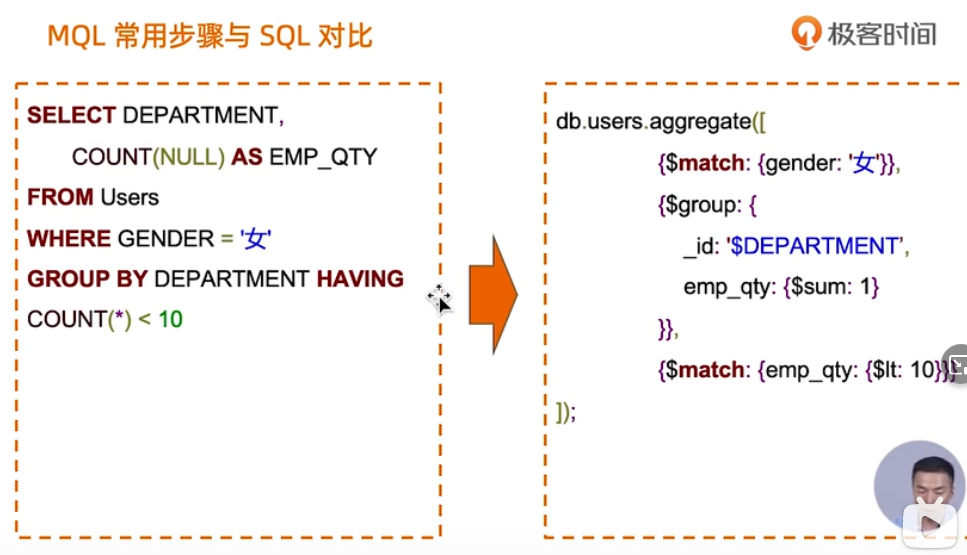


## itYing联表查询实例

准备好order表和order_item表（order表中的all_num是对应order_itme表的num的总和，all_price也是）

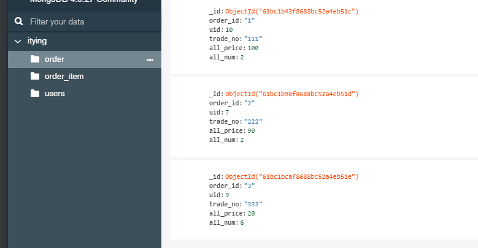

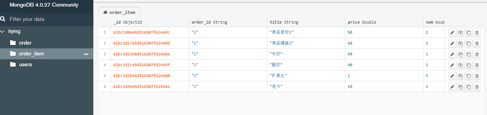

### 4.$group实例

疑问，那么total要求sum*price的和怎么办呢

```js
//_id表示根据order_id进行分组，total是最后生成的新列，$sum表示求和，$num表示将分组后里面的元素根据num求和（记得加双引号）
db.order_item.aggregate([
    {
        $group:{
            _id:"$order_id",
            total:{$sum:"$num"}
        }
    }
])
```

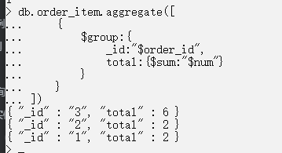

### 5.$sort实例

这里尝试使用了compass可视化工具，第一张图是点击save右边的生成按钮，根据添加的管道生成的代码，第二张图是我添加的管道，目的是根据order_id分组并且求和给total，然后根据_id排序（真香）

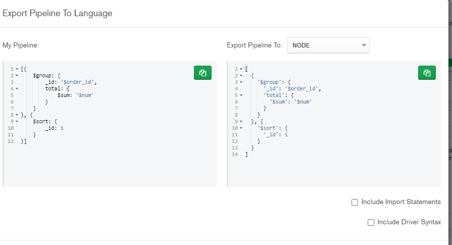

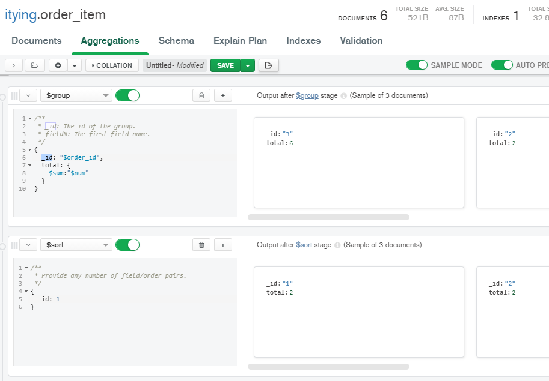

### 6.$lookup表关联实例

参数介绍看截图

from将order表和order_item表进行关联，localField是order表的关联字段，foreignField是order_item表的关联字段，将order_item表中order_id和order表中order_id一样的数据存放到了items数组中，并且将items存放在order表对应的数据中

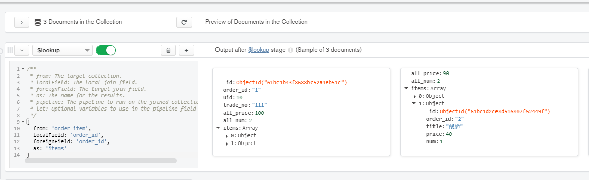


# MongoDB 复制（副本集）⭐⭐⭐

MongoDB复制是将数据同步在多个服务器的过程。

复制提供了数据的冗余备份，并在多个服务器上存储数据副本，提高了数据的可用性， 并可以保证数据的安全性。

复制还允许您从硬件故障和服务中断中恢复数据。

------

## 什么是复制?

- 保障数据的安全性
- 数据高可用性 (24*7)
- 灾难恢复
- 无需停机维护（如备份，重建索引，压缩）
- 分布式读取数据

------

## MongoDB复制原理

mongodb的复制至少需要两个节点。其中一个是主节点，负责处理客户端请求，其余的都是从节点，负责复制主节点上的数据。

mongodb各个节点常见的搭配方式为：一主一从、一主多从。

主节点记录在其上的所有操作oplog，从节点定期轮询主节点获取这些操作，然后对自己的数据副本执行这些操作，从而保证从节点的数据与主节点一致。

MongoDB复制结构图如下所示：


以上结构图中，客户端从主节点读取数据，在客户端写入数据到主节点时， 主节点与从节点进行数据交互保障数据的一致性。

### 副本集特征：

-  N 个节点的集群
- 任何节点可作为主节点
- 所有写入操作都在主节点上
- 自动故障转移
- 自动恢复

------

## MongoDB副本集设置

在本教程中我们使用同一个MongoDB来做MongoDB主从的实验， 操作步骤如下：

1、关闭正在运行的MongoDB服务器。

现在我们通过指定 --replSet 选项来启动mongoDB。--replSet 基本语法格式如下：

```
mongod --port "PORT" --dbpath "YOUR_DB_DATA_PATH" --replSet "REPLICA_SET_INSTANCE_NAME"
```

### 实例

```
mongod --port 27017 --dbpath "D:\set up\mongodb\data" --replSet rs0
```

以上实例会启动一个名为rs0的MongoDB实例，其端口号为27017。

启动后打开命令提示框并连接上mongoDB服务。

在Mongo客户端使用命令rs.initiate()来启动一个新的副本集。

我们可以使用rs.conf()来查看副本集的配置

查看副本集状态使用 rs.status() 命令

------

## 副本集添加成员

添加副本集的成员，我们需要使用多台服务器来启动mongo服务。进入Mongo客户端，并使用rs.add()方法来添加副本集的成员。

### 语法

 rs.add() 命令基本语法格式如下：

```
>rs.add(HOST_NAME:PORT)
```

### 实例

假设你已经启动了一个名为mongod1.net，端口号为27017的Mongo服务。 在客户端命令窗口使用rs.add() 命令将其添加到副本集中，命令如下所示：

```
>rs.add("mongod1.net:27017")
>
```

MongoDB中你只能通过主节点将Mongo服务添加到副本集中， 判断当前运行的Mongo服务是否为主节点可以使用命令db.isMaster() 。

MongoDB的副本集与我们常见的主从有所不同，主从在主机宕机后所有服务将停止，而副本集在主机宕机后，副本会接管主节点成为主节点，不会出现宕机的情况。

# MongoDB 分片⭐⭐⭐

------

## 分片

在Mongodb里面存在另一种集群，就是分片技术,可以满足MongoDB数据量大量增长的需求。

当MongoDB存储海量的数据时，一台机器可能不足以存储数据，也可能不足以提供可接受的读写吞吐量。这时，我们就可以通过在多台机器上分割数据，使得数据库系统能存储和处理更多的数据。 

------

## 为什么使用分片

- 复制所有的写入操作到主节点
- 延迟的敏感数据会在主节点查询
- 单个副本集限制在12个节点
- 当请求量巨大时会出现内存不足。
- 本地磁盘不足
- 垂直扩展价格昂贵

------

## MongoDB分片

下图展示了在MongoDB中使用分片集群结构分布：


上图中主要有如下所述三个主要组件：

- Shard:

  用于存储实际的数据块，实际生产环境中一个shard server角色可由几台机器组个一个replica set承担，防止主机单点故障

- Config Server:

  mongod实例，存储了整个 ClusterMetadata，其中包括 chunk信息。

- Query Routers:

  前端路由，客户端由此接入，且让整个集群看上去像单一数据库，前端应用可以透明使用。

------

## 分片实例

分片结构端口分布如下：

```
Shard Server 1：27020
Shard Server 2：27021
Shard Server 3：27022
Shard Server 4：27023
Config Server ：27100
Route Process：40000
```

步骤一：启动Shard Server

```
[root@100 /]# mkdir -p /www/mongoDB/shard/s0
[root@100 /]# mkdir -p /www/mongoDB/shard/s1
[root@100 /]# mkdir -p /www/mongoDB/shard/s2
[root@100 /]# mkdir -p /www/mongoDB/shard/s3
[root@100 /]# mkdir -p /www/mongoDB/shard/log
[root@100 /]# /usr/local/mongoDB/bin/mongod --port 27020 --dbpath=/www/mongoDB/shard/s0 --logpath=/www/mongoDB/shard/log/s0.log --logappend --fork
....
[root@100 /]# /usr/local/mongoDB/bin/mongod --port 27023 --dbpath=/www/mongoDB/shard/s3 --logpath=/www/mongoDB/shard/log/s3.log --logappend --fork
```

步骤二： 启动Config Server

```
[root@100 /]# mkdir -p /www/mongoDB/shard/config
[root@100 /]# /usr/local/mongoDB/bin/mongod --port 27100 --dbpath=/www/mongoDB/shard/config --logpath=/www/mongoDB/shard/log/config.log --logappend --fork
```

**注意：**这里我们完全可以像启动普通mongodb服务一样启动，不需要添加—shardsvr和configsvr参数。因为这两个参数的作用就是改变启动端口的，所以我们自行指定了端口就可以。

步骤三： 启动Route Process

```
/usr/local/mongoDB/bin/mongos --port 40000 --configdb localhost:27100 --fork --logpath=/www/mongoDB/shard/log/route.log --chunkSize 500
```

mongos启动参数中，chunkSize这一项是用来指定chunk的大小的，单位是MB，默认大小为200MB.

步骤四： 配置Sharding

接下来，我们使用MongoDB Shell登录到mongos，添加Shard节点

```
[root@100 shard]# /usr/local/mongoDB/bin/mongo admin --port 40000
MongoDB shell version: 2.0.7
connecting to: 127.0.0.1:40000/admin
mongos> db.runCommand({ addshard:"localhost:27020" })
{ "shardAdded" : "shard0000", "ok" : 1 }
......
mongos> db.runCommand({ addshard:"localhost:27029" })
{ "shardAdded" : "shard0009", "ok" : 1 }
mongos> db.runCommand({ enablesharding:"test" }) #设置分片存储的数据库
{ "ok" : 1 }
mongos> db.runCommand({ shardcollection: "test.log", key: { id:1,time:1}})
{ "collectionsharded" : "test.log", "ok" : 1 }
```

步骤五： 程序代码内无需太大更改，直接按照连接普通的mongo数据库那样，将数据库连接接入接口40000

# MongoDB 导出与导入⭐⭐⭐

------

## MongoDB数据备份

在Mongodb中我们使用mongodump命令来备份MongoDB数据。该命令可以导出所有数据到指定目录中。

 mongodump命令可以通过参数指定导出的数据量级转存的服务器。

### 语法

mongodump命令脚本语法如下：

```
>mongodump -h dbhost -d dbname -o dbdirectory
```

- -h：

  MongoDB 所在服务器地址，例如：127.0.0.1，当然也可以指定端口号：127.0.0.1:27017

- -d：

  需要备份的数据库实例，例如：test

- -o：

  备份的数据存放位置，例如：c:\data\dump，当然该目录需要提前建立，在备份完成后，系统自动在dump目录下建立一个test目录，这个目录里面存放该数据库实例的备份数据。

### 实例

在本地使用 27017 启动你的mongod服务。打开命令提示符窗口，进入MongoDB安装目录的bin目录输入命令mongodump:

```
>mongodump
```

执行以上命令后，客户端会连接到ip为 127.0.0.1 端口号为 27017 的MongoDB服务上，并备份所有数据到 bin/dump/ 目录中。命令输出结果如下：


mongodump 命令可选参数列表如下所示：

| 语法                                              | 描述                           | 实例                                             |
| ------------------------------------------------- | ------------------------------ | ------------------------------------------------ |
| mongodump --host HOST_NAME --port PORT_NUMBER     | 该命令将备份所有MongoDB数据    | mongodump --host runoob.com --port 27017         |
| mongodump --dbpath DB_PATH --out BACKUP_DIRECTORY |                                | mongodump --dbpath /data/db/ --out /data/backup/ |
| mongodump --collection COLLECTION --db DB_NAME    | 该命令将备份指定数据库的集合。 | mongodump --collection mycol --db test           |

------

## MongoDB数据恢复

mongodb使用 mongorestore 命令来恢复备份的数据。

### 语法

mongorestore命令脚本语法如下：

```
>mongorestore -h <hostname><:port> -d dbname <path>
```

- --host <:port>, -h <:port>：

  MongoDB所在服务器地址，默认为： localhost:27017

- --db , -d ：

  需要恢复的数据库实例，例如：test，当然这个名称也可以和备份时候的不一样，比如test2

- --drop：

  恢复的时候，先删除当前数据，然后恢复备份的数据。就是说，恢复后，备份后添加修改的数据都会被删除，慎用哦！

- <path>：

   mongorestore 最后的一个参数，设置备份数据所在位置，例如：c:\data\dump\test。

  你不能同时指定 <path> 和 --dir 选项，--dir也可以设置备份目录。

- --dir：

  指定备份的目录

  你不能同时指定 <path> 和 --dir 选项。

接下来我们执行以下命令:

```
>mongorestore
```

执行以上命令输出结果如下：


​		

# MongoDB 监控⭐⭐⭐

在你已经安装部署并允许MongoDB服务后，你必须要了解MongoDB的运行情况，并查看MongoDB的性能。这样在大流量得情况下可以很好的应对并保证MongoDB正常运作。

MongoDB中提供了mongostat 和 mongotop 两个命令来监控MongoDB的运行情况。

------

## mongostat 命令

mongostat是mongodb自带的状态检测工具，在命令行下使用。它会间隔固定时间获取mongodb的当前运行状态，并输出。如果你发现数据库突然变慢或者有其他问题的话，你第一手的操作就考虑采用mongostat来查看mongo的状态。

启动你的Mongod服务，进入到你安装的MongoDB目录下的bin目录， 然后输入mongostat命令，如下所示：

```
D:\set up\mongodb\bin>mongostat
```

以上命令输出结果如下：


## mongotop 命令

mongotop也是mongodb下的一个内置工具，mongotop提供了一个方法，用来跟踪一个MongoDB的实例，查看哪些大量的时间花费在读取和写入数据。 mongotop提供每个集合的水平的统计数据。默认情况下，mongotop返回值的每一秒。

启动你的Mongod服务，进入到你安装的MongoDB目录下的bin目录， 然后输入mongotop命令，如下所示：

```
D:\set up\mongodb\bin>mongotop
```

以上命令执行输出结果如下：


带参数实例

```
 E:\mongodb-win32-x86_64-2.2.1\bin>mongotop 10
```

  

 后面的10是*<sleeptime>*参数 ，可以不使用，等待的时间长度，以秒为单位，mongotop等待调用之间。通过的默认mongotop返回数据的每一秒。 

```
 E:\mongodb-win32-x86_64-2.2.1\bin>mongotop --locks
```

报告每个数据库的锁的使用中，使用mongotop - 锁，这将产生以下输出：  

  

输出结果字段说明：

- ns：

  包含数据库命名空间，后者结合了数据库名称和集合。

- **db：**

  包含数据库的名称。名为 . 的数据库针对全局锁定，而非特定数据库。

- **total：**

  mongod花费的时间工作在这个命名空间提供总额。 

- **read：**

  提供了大量的时间，这mongod花费在执行读操作，在此命名空间。 

- **write：**

  提供这个命名空间进行写操作，这mongod花了大量的时间。


# Mongoose

## 连接数据库

```js
/*
  先新建一个package.json文件
  1:安装mongoose   npm i mongoose --save
  2:引入mongoose
  3:连接mongodb数据库   mongoose.connect('mongodb://ip地址:端口号/数据库名');  如果端口号是默认的27017，可以不写
      监听mongodb数据库的连接状态    在mongoose对象中，有一个connection对象，表示的就是数据库连接
      mongoose.connection.once('open',()=>{})
      mongoose.connection.once('close',()=>{})
  4:断开数据库连接     mongoose.disconnect()   (一般不需要调用)
*/

//☆☆☆☆☆引入☆☆☆☆☆
const mongoose = require('mongoose');
//☆☆☆☆☆连接☆☆☆☆☆
mongoose.connect('mongodb://localhost:27017/test');


mongoose.connection.once('open',()=>{
  console.log('success');
})
mongoose.connection.once('close',()=>{
  console.log('断开');
})

mongoose.disconnect()
```

## schema和model

```js
/*
  首先得将mongoose.Schema存下来
  	Schema相当于是对文档信息的规范，
  	原本文档是可以存储任何信息的，但是有了Schema的话，就必须满足Schema指定的格式
*/
const mongoose = require('mongoose');
const Schema = mongoose.Schema
mongoose.connect('mongodb://localhost:27017/test');
//创建Schema
let stuSchema = new Schema({
  name:String,
  age:Number,
  gender: {
    type:String,
    default:"female"
  },
  add:String
})
//通过Schema创建Model
//model代表的是数据库中的集合，通过Model才能对数据库进行操作
//mongoose.model(modelName,Schema)
//mongoose会自动将modelName变成复数形式的单词
let s = mongoose.model('students',stuSchema)

//向数据库中插入一个文档
s.create({
  name:'wjj',
  age:20,
  add:'taizhou'
},err=>{
  if(!err) console.log('插入文档success')
  else console.log(err)
})
```

## model的方法

```js
const mongoose = require('mongoose');
const Schema = mongoose.Schema
mongoose.connection.once('open',()=>{
  console.log('success');
})
mongoose.connect('mongodb://localhost:27017/test');
let stuSchema = new Schema({
  name:String,
  age:Number,
  gender: {
    type:String,
    default:"female"
  },
  add:String
})
let s = mongoose.model('students',stuSchema)

//有了model就可以对数据库进行增删改查了
//向数据库中插入一个文档
//Model.create(doc(s),[callback])
s.create([
  {
    name:'wjj2',
    age:22,
    add:'taizhou2'
  },
  {
    name:'wjj3',
    age:23,
    add:'taizhou3'
  }
],err=>{
  if(!err) console.log('插入文档success')
  else console.log(err)
})
/*
查询
  Model.find ( conditions,[projection] ,[options],callback)
    查询所有符合条件的对象，返回的是对象组成的数组
  Model.findById ( Id,[projection] ,[options],[callback ])
    根据_id查询，返回的是具体的对象
  Model.findOne ( [conditions],[projection] ,[options],[callback ])
    查询第一个符合的,返回的是具体的对象而不是数组

  conditions
    查询条件，是一个对象
  projection
    投影，有两种书写方式，
      一种是传统的穿个对象{name:1,_id:0}
      一种是传一个字符串，空格隔开，减号后面的代表不显示   'name age -_id'
  options
    查询选项（skip,limit)
    {skip:3, limit:3}

  callback  回调函数（必选，因为是通过回调函数返回结果）  result总回返回一个数组，除非是findOne


*/


s.find({
  name:'wjj'
},{
  name:1,_id:0
},{
  skip:3,
  limit:3
},((error, result) => {
  console.log(result)
}))


/*
  修改update
  Model.update (conditions,doc,[options],[callback ])    (废弃)
  Model.updateOne (conditions,doc,[options],[callback ])
  Model.updateMany (conditions,doc,[options],[callback ])
    -参数
      conditions 查询条件
      doc 修改后的对象
      options 配置参数   一般传{multi,表示是否更新多个}
      callback 回调函数
* */

//修改wjj的年龄为200
s.updateOne({name:'wjj'},{
  $set:{age:200}
},err=>{
  if(!err) console.log('修改成功')
})


/*
  删除
  Model.deleteOne(conditions,callback)
  Model.deleteMany(conditions,callback)
* */
s.deleteMany({name:'wjj3'},(err)=>{
  if(!err) console.log('删除成功');
})

/*
  Model.count(conditions,callback)统计数量
  效率比查询所有然后.length效率高
* */
s.count({},(error, result) => {
  console.log(result);
})
```

## document方法

```js
/*
  document和集合中的文档一一对应，document是model的实例
    通过model查询到的结果都是document
    也可以通过model的构造方法new出document
* */
const mongoose = require('mongoose');
const Schema = mongoose.Schema

mongoose.connection.once('open',()=>{
  console.log('success');
})
mongoose.connect('mongodb://localhost:27017/test');

let stuSchema = new Schema({
  name:String,
  age:Number,
  gender: {
    type:String,
    default:"female"
  },
  add:String
})

//可以通过构造方法创建一个文档
let s = mongoose.model('students',stuSchema)
let stu = new s({
  name:'1',
  age:1,
  add:'jzsp'
})
/*
document的方法

    将文档对象保存到集合中
    Model#save([options],callback)

    Model#update(update,[options],callback)
      更直接的修改方法是,假如文档对象为doc
      doc.name = 'wjj'
      doc.save()

    Model#remove(callback)

    转换成普通的js对象，转换之后，文档方法就不能用了
    有时候，文档里有敏感信息不能让人看见，此时就需要转换为普通对象，
    用delete 对象.属性名   删除对应的属性
    
    Model#toObject()
* */
stu.save(err=>{
  if (!err) console.log('保存成功');
})


//查询到的结果是文档对象，可以直接调用update来修改
s.findOne({name:'wjj'},((error, result) => {
  if(!error) {
    // result.update({
    //   $set:{name:'wjj100'}
    // },err=>{
    //   if(!err) console.log('修改成功');
    // })
    result.age = 11111
    result.save()
  }
}))
```

## 分模块

### 数据库连接模块

```js
const mongoose = require('mongoose');

mongoose.connection.once('open',()=>{
  console.log('success');
})
mongoose.connect('mongodb://localhost:27017/test');
```

### module文件夹中的stu模块

```js
const mongoose = require('mongoose');
const Schema = mongoose.Schema
let stuSchema = new Schema({
  name:String,
  age:Number,
  gender: {
    type:String,
    default:"female"
  },
  add:String
})
let s = mongoose.model('students',stuSchema)

module.exports = s
// export default s
```

### 引用时

```js
require('./tools/utils')
let s = require('./models/stu')

s.find({},(error, result) => {
  console.log(result);
})
```