# 项目难点

- 后台抽离公共逻辑，结合vuex封装高级组件，快速构建页面

- 前台通过递归组件实现目录功能，IntersectionObserve实现图片懒加载，输入框实现请求防抖

**最开始是存的md文件，然后读取文件转html字符串并且v-html，有的文章图片太多导致服务器压力很大，想到要用懒加载，由于v-html无法渲染组件，所以只能用原生方式实现图片懒加载，最后选择了IntersectionObserve。**

- 想实现目录功能，用了递归组件，实现滚动定位功能，就搜索到对应的h标签，scrollTo，平滑滚动导致图片加载，所以只能瞬间滚动。


## 总结了一下项目的亮点

- 前端用**递归组件**配合自己实现的**工具函数**，将网页h标签转成**父子结构**实现**目录组件**功能。

- 后台基于element plus封装了table组件和form组建，再基于这两个组建和store的模块管理（传入pageName分别对应请求）封装了**page-content组建**快速构建页面。

- 因为v-html无法解析组件，并且传统的方法效率不高，使用新的浏览器API ：IntersectionObserve实现图片懒加载。

- 用webpack-bundle-analyzer分析代码打包后的体积，将体积大的模块用**cdn方式**引入，网站静态背景图片转成webp压缩格式保存在cdn服务器上，**优化代码体积**。

  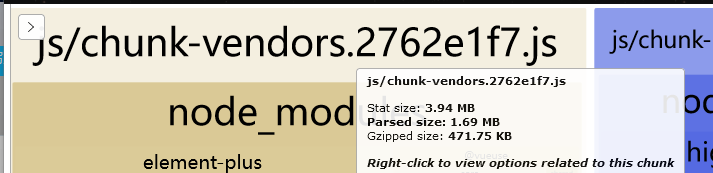

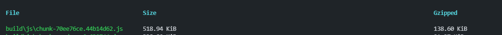

- 路由懒加载，分包，**优化代码体积**。
- 考虑到服务器性能问题，新版后端 将**图片资源**从服务器静态web目录转移到七牛云，并且编写了上传的中间件。
- **开启http2**提升页面速度，首屏渲染速度大大提高。

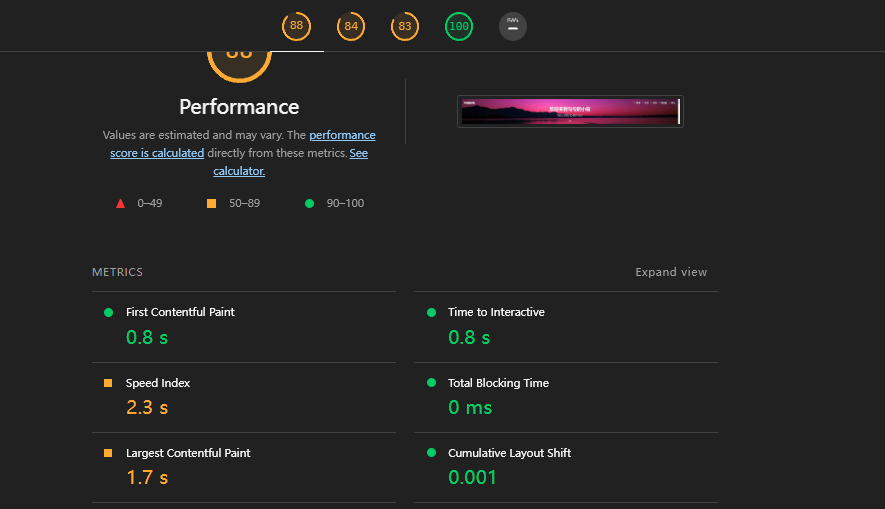

- 后端的文件上传到七牛云的中间件，登录认证中间件
- NGINX开启Gzip压缩（但是不知道为啥我的默认就开启了= =）

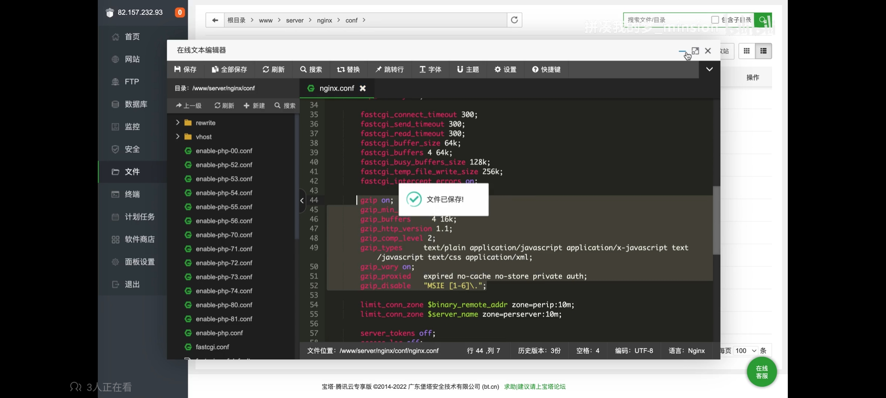


# 后端部分(重构前)

## 服务器数据库超级管理员账号密码

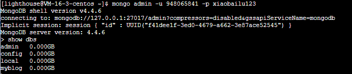


后端分为四个层

- model（定义数据库表的映射）
- dao（数据库操作）
- service（业务逻辑）
- routes（路由）

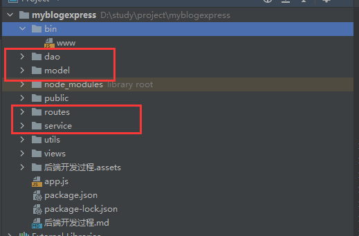

## model层

model层主要是定义Schema，根据Schema创建对应表的model，然后通过model来操作数据库

## dao层

dao层定义了对该数据库表的增删改查操作

因为数据库增删改查操作大部分类似，所以封装了四个工具函数，根据Model和传入的数据对对应的数据库进行crud

```js
async function utils_create(Model,data){
  try {
    let res = await Model.create({
      createTime:new Date(),
      ...data
    })
    if (res == undefined) {
      return { status: false, msg: 'save error' };
    } else {
      return { status: true, data: res };
    }
  } catch (error) {
    console.log('add err:---' + error)
    return { status: false, msg: 'error, maybe primaryKey exists' }
  }
}
```

```js
/**
 *
 * @param Model
 * @param data
 * @returns {Promise<{msg: string, status: boolean}|{status: boolean}>}
 */
async function utils_remove(Model,data){
  try {
    let res = await Model.deleteMany(data)
    if (!res.deletedCount) {
      return { status: false, msg: "don’t find to remove" };
    } else {
      return { status: true};
    }

  } catch (error) {
    console.log('remove is err:---' + error)
    return { status: false, msg: 'error' }
  }
}
```

```js
/**
 *
 * @param Model
 * @param data {currentPage:number,pageSize:number,queryInfo:Object}
 * @returns {Promise<{data: {allCount, list: ({length}|*)}, status: boolean}|{msg: string, status: boolean}>}
 */
async function utils_find(Model,data,pipeline){

  try {
    let res,allCount
    let {currentPage,pageSize,...config} = data
    config = config ?? {}

    //保存总数
    res = await Model.find()
    allCount = res.length


    //如果传入了管道聚合规则，就直接用管道查询
    if(pipeline){
      res = await Model.aggregate(pipeline)
    }else{
      //根据config查询条件，生成匹配规则对象
      const obj = queryInfoTomapRule(config)
      if ('currentPage' in data  && 'pageSize' in data) {
        res = await Model.find(obj).sort({ createTime: -1 }).skip((currentPage - 1) * pageSize).limit(pageSize)
      }else{
        res = await Model.find(obj).sort({ createTime: -1 })
      }
    }

    if (!res.length) {
      return { status: true, msg: "don’t find" };
    } else {
      return {
        status: true,
        data: {
          allCount: allCount,
          list: res
        }
      };
    }
  } catch (error) {
    return { status: false, msg: 'error' }
  }
}
```

```js
/**
 *
 * @param Model
 * @param filter {修改目标的匹配条件（精确匹配）}
 * @param update {要修改的内容}
 * @returns {Promise<{msg: string, status: boolean}|{status: boolean}>}
 */
async function utils_update(Model,filter,update){
  try {
    let res = await Model.updateOne(filter, update)
    if (!res.matchedCount) {
      return { status: false, msg: "don’t find to update" };
    } else {
      return { status: true };
    }

  } catch (error) {
    return { status: false, msg: 'error' }
  }
}
```

## service层

service层内定义了routes中要使用的函数，用于返回数据给api接口。

service层还需要使用dao层提供的增删改查函数来实现业务操作，例如：

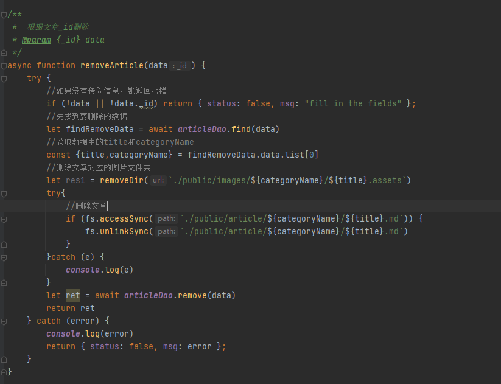

## multer中间件

用这个中间件实现文件上传的操作

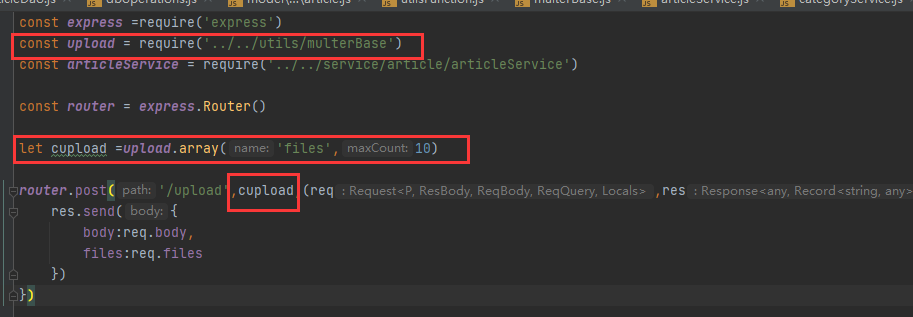

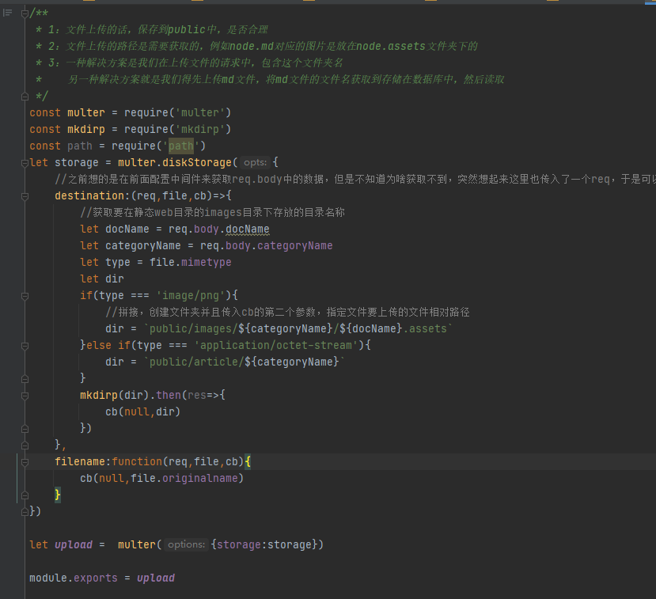

## cors中间件

解决跨域问题

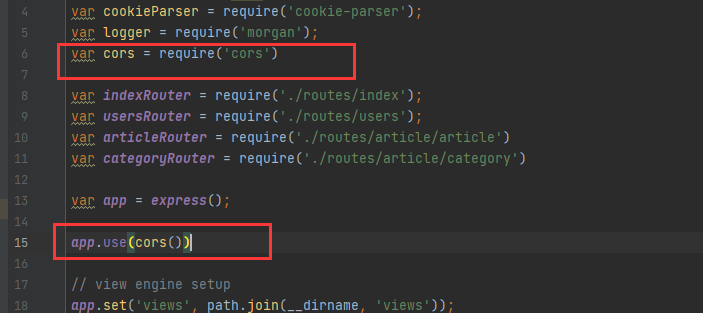

## express内置中间件

解析了post请求的数据，修改req对象（将数据封装成body对象封装在req对象中）

静态web目录中间件，优先级设置高一些，会在访问服务器时先去静态web目录中查找文件

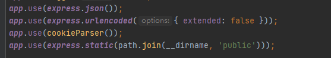

## 文件上传的接口说明

apifox里如果是中文好像会乱码，用elementui不会（name指定文件的key，action是地址，data是附带数据）

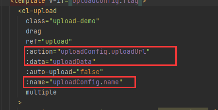

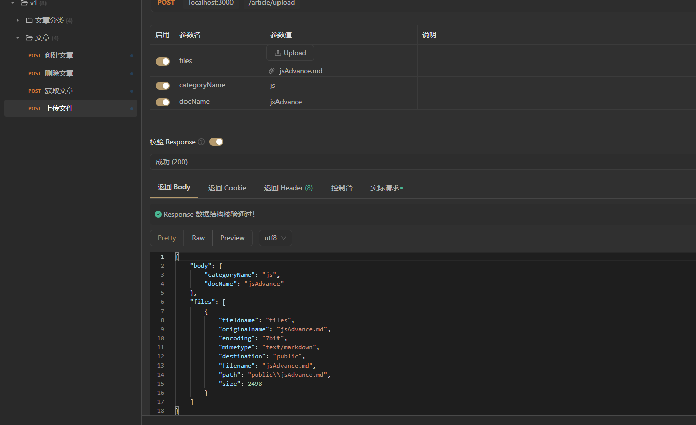

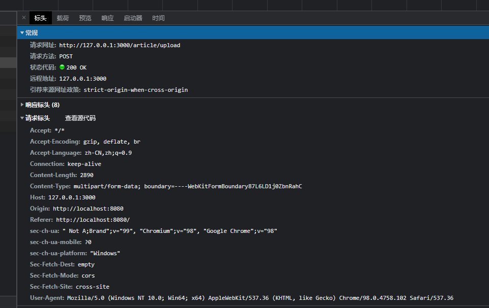

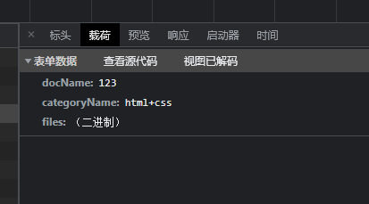


## 预防xss攻击（未完成）


## http-assert+express + 错误处理中间件

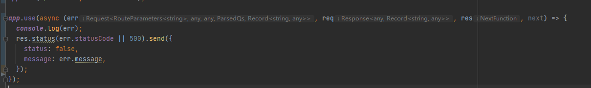

## 登陆校验中间件

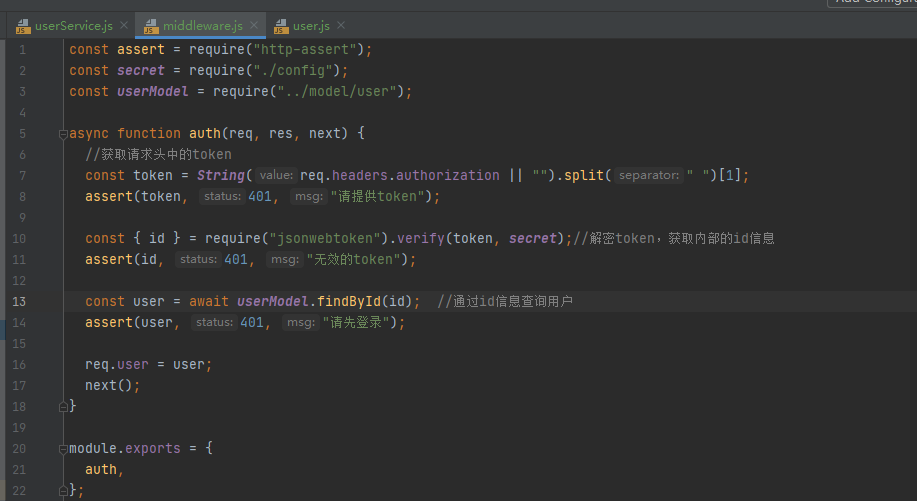

## 上传七牛云中间件

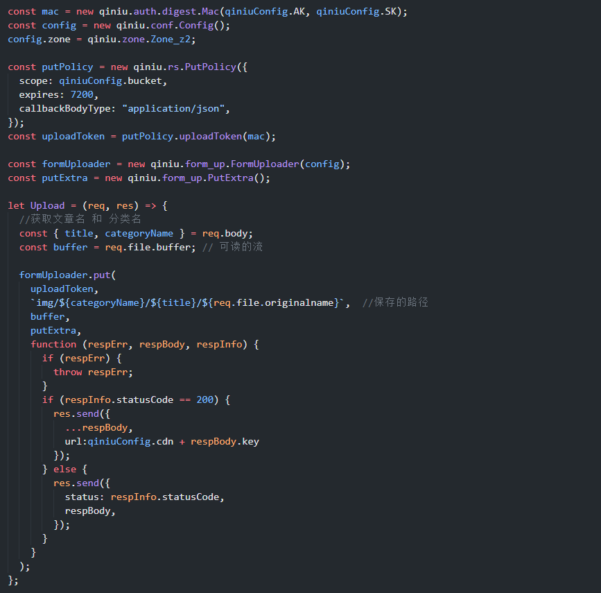


# 后台部分

后台主要是基于element-plus封装了wjj-table组件和wjj-form组件、进一步封装了page-content组件，让页面代码更简洁，复用性高

## wjj-form


## wjj-table组件

总体布局如下

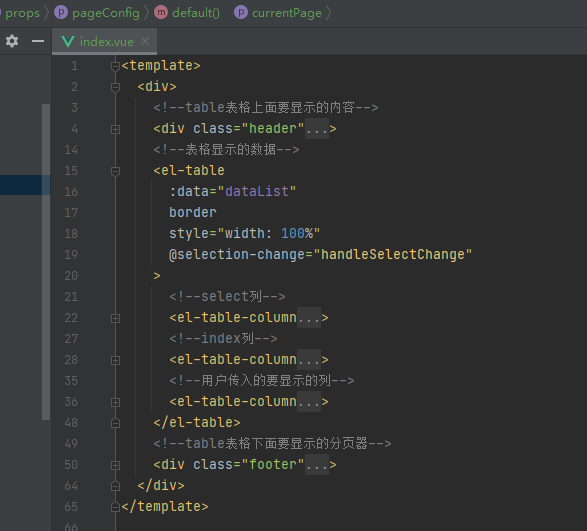

### props

props需要在使用该组件时传入以下内容

- datalist
- tableRowConfig
- showIndexColumn
- showSelectColumn
- title
- dataCount
- pageConfig

### header部分

header部分预留了两个插槽用于拓展布局

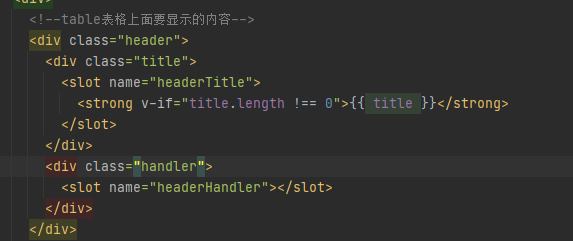

### footer部分

预留了插槽拓展，默认显示的是分页器，要求传入pageConfig和dataCount

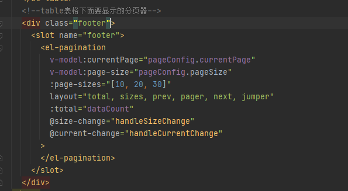

pageConfig中有currentPage（当前页）和pageSize（页大小），并且在页面变化和大小变化时发出了事件updateSize和updatePage，传入入变化后的currentPage和pageSize

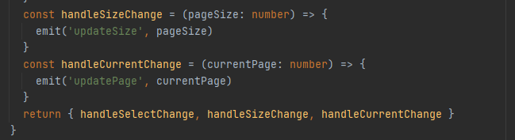

### table部分

table分三个部分：select列，index列和用户自定义的列

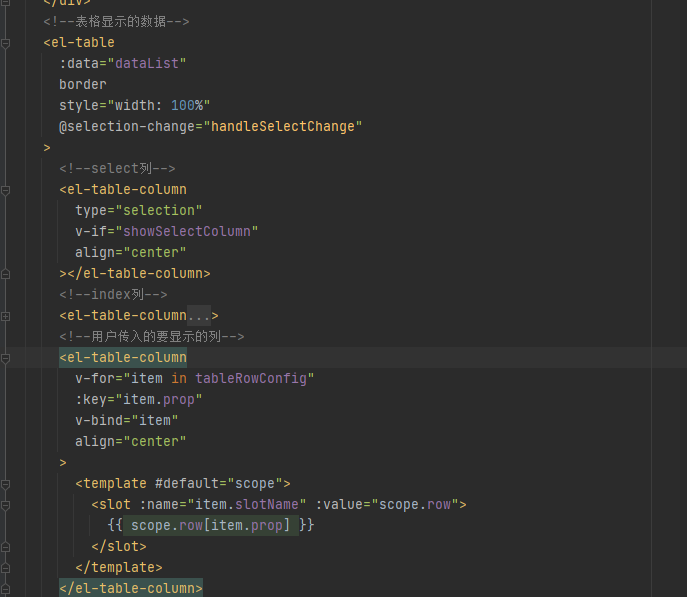

select是否渲染由传入的showSelectColumn决定，select列可以选中当前列，在选中改变的时候发出了selectChange事件，携带了选中行的内容

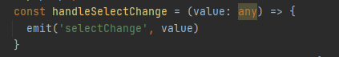

index列是否渲染由传入的showIndexColumn决定，用于显示序号

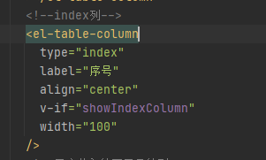

用户自定义的列显示的内容是由用户传入的tableRowConfig决定，每一项的label，显示的行的内容（prop），宽度（minWidth），以及插槽名（slotName）由tableRowConfig的每一项决定

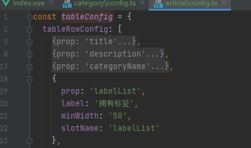

el-table-column的默认插槽允许我们改变单元格显示的内容，这个显示的内容**我们预留了插槽**，默认只显示数值（数值是通过默认插槽的作用域中取出的，scope.row中有每一行的数据，通过item.prop获取显示的内容），这个插槽的名字是根据slotName**动态**决定的，如果需要自定义显示的内容，可以在tableRowConfig中对应的项**加上slotName属性**。另外，这个插槽我们通过作用域插槽的形式将**当前行的数据传到作用域的value中**

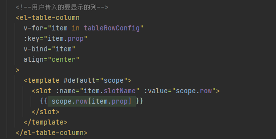

## page-content组件

page-content组件主要是对wjj-table组件的进一步封装，动态决定插槽的内容，主要是

### props

其中的tableConfig就是wjj-table需要的配置对象

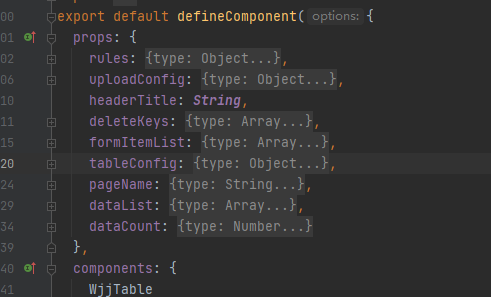

### 根据pageName获取list和count数据

因为这个page-content展示的是list数据，在每个页面都要用到，所以我们可以在使用这个组件的时候传入pageName，根据pageName分发任务给不同的store模块请求数据，用watchEffect包裹，当当前页和页面大小改变时重新分发任务

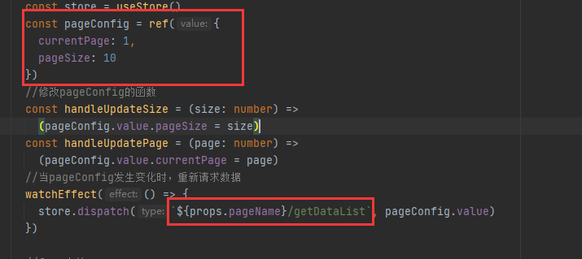

由于state不能通过`[]`获取属性，一种方法是外界传入，另一种方法是在getter中实现filter的效果返回对应的数据（但是那得要求数据都在一个模块中，因为我的不同页面是放在不同模块中的，所以不能这么做）

我这里是用props接收传入的参数

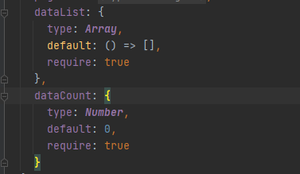

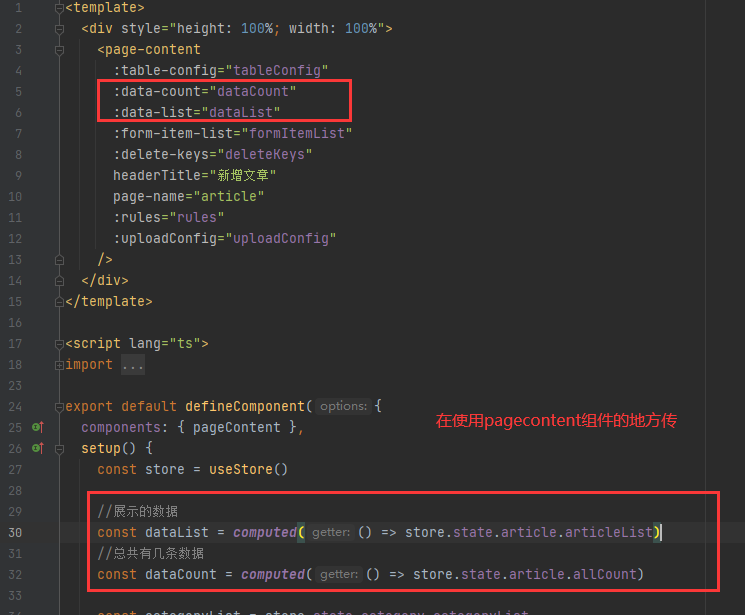

### formItems和rules定制表单

我们的headerHandler插槽传入的内容主要是一个dialog对话框，里面嵌入了一个表单用于表单数据处理

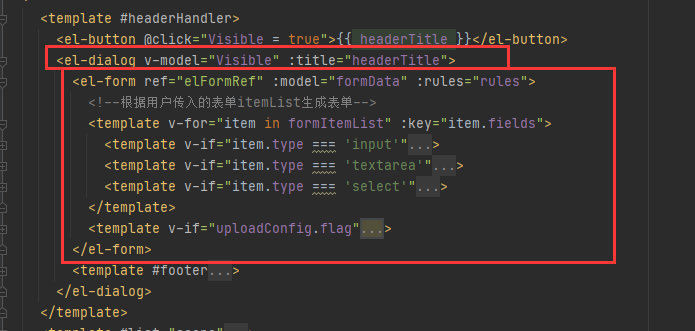

formItes是一个数组，里面保存了要生成的表单项的属性，包括type，fields，和label，其中fields字段是每个表单项绑定的表单对象的属性名

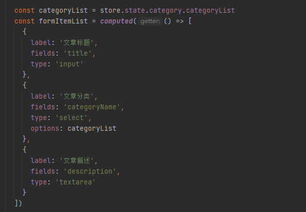

根据formItems每一项的fields生成表单对象用于v-model保存数据

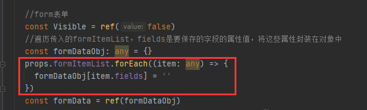

在表单中使用，通过item.fields双向**绑定**到对应的**表单对象**中的属性，并且根据item.type渲染不同的表单项

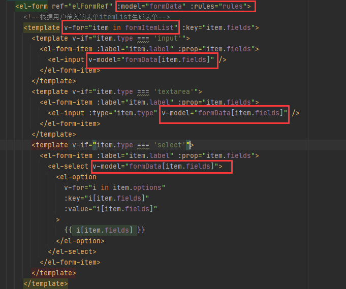

------

rules是表单验证规则，由父组件传入，验证规则生效需要给el-form绑定model（表单数据源）和rules（表单验证规则），并且每个表单项el-form-item需要指定prop，也就是表单项中v-model绑定的表单对象中属性的属性名

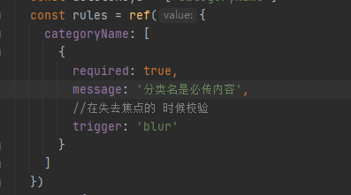

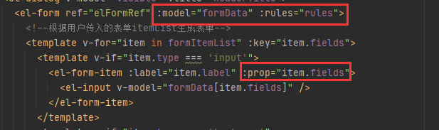

------

在对话框组件的footer插槽中定义了确定提交表单按钮

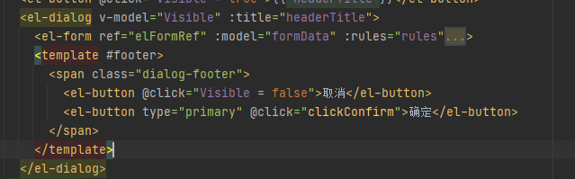

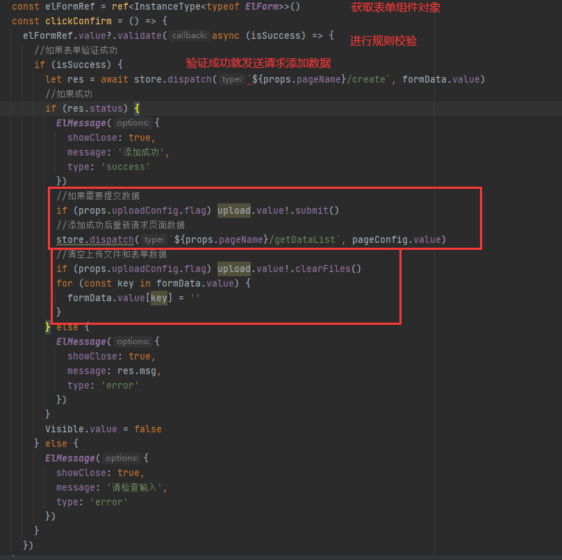

### 表单框展：文件上传

可以根据用户传入的uploadConfig来配置upload组件，data是发送请求时携带的表单数据

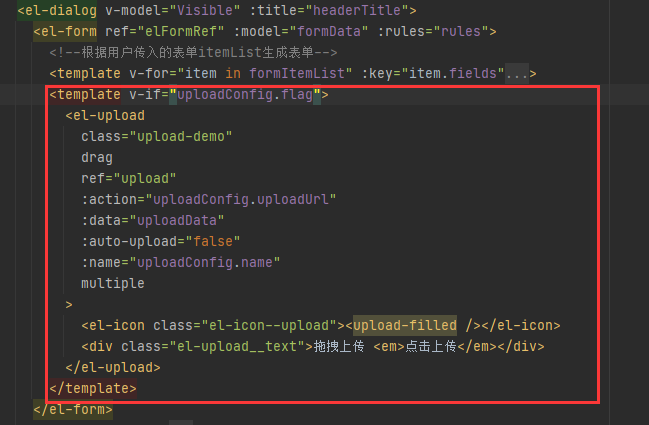

配置对象

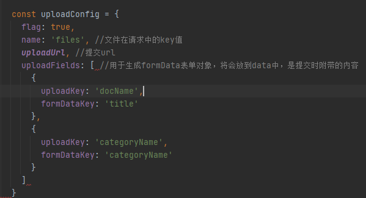

这里主要讲解根据uploadFields生成uploadData表单对象。uploadKey是**上传文件请求携带的表单对象的key值**，formDataKey是前面**根据formItems生成的formData表单对象的key值**（formItems中的**fields字段**）

其实就是从formData表单对象中取出所有**formDataKey对应的属性的值**，作为uploadKey保存在新的表单对象中。

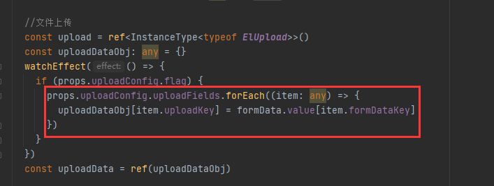

### operations列拓展

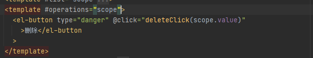

operations列的删除按钮，触发事件时**传入当前行的数据**，用于发送删除请求，请求**携带的内容由传入的deleteKey决定**，根据deleteKey**筛选当前行的数据**并保存到obj中，根据pageName的不同发送不同的请求

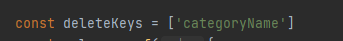

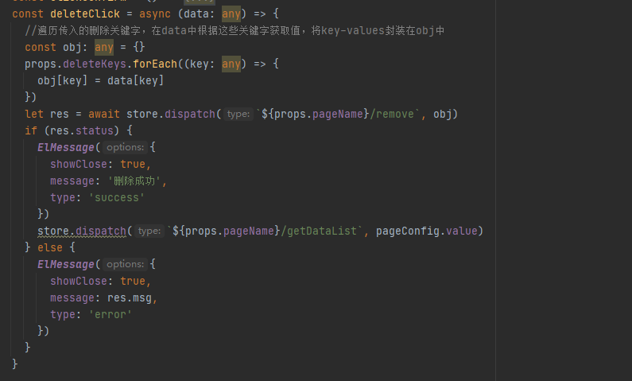

## mavon-editor富文本编辑器


# 部署踩坑

## 部署流程

腾讯云服务器，用的是宝塔面板，需要安装

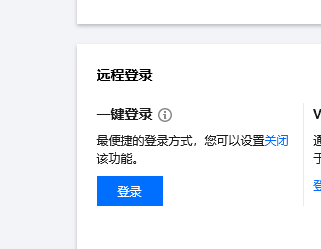

登录进入服务器之后，输入

> sudo su

再去宝塔官网赋值安装链接，粘贴回车即可

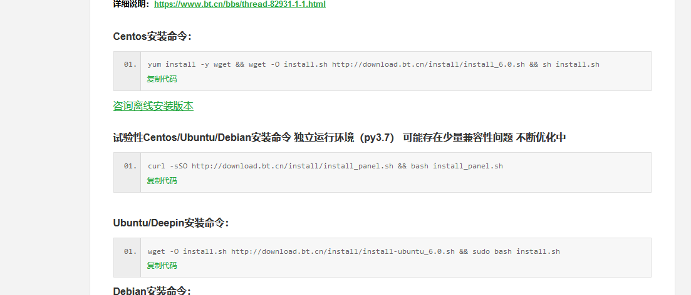

进入宝塔面板，安装pm2和mongodb（不需要安装node，pm2自带node，不需要配环境）

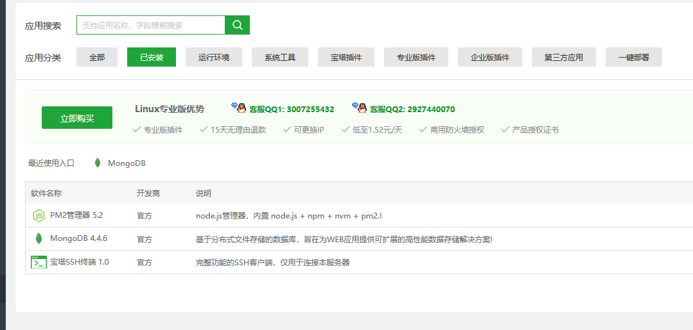

安装完mongodb之后，分配角色

1：mongo进入数据库

2：use admin

3：创建管理员

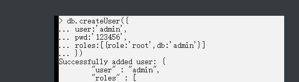

4：修改配置（不要忘了开放宝塔和腾讯云的27017端口）

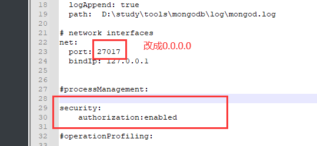

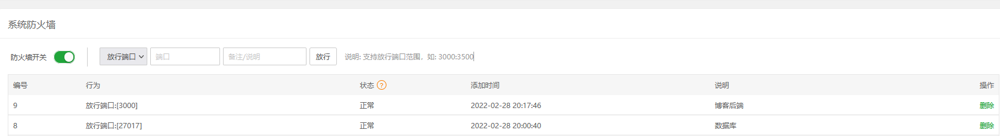

5：使用创建数据库，并创建对应的角色

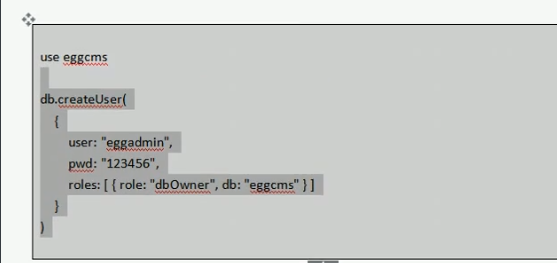

6：在本地使用compass进行远程连接数据库，导入数据

部署node项目，添加上，并且开放端口即可

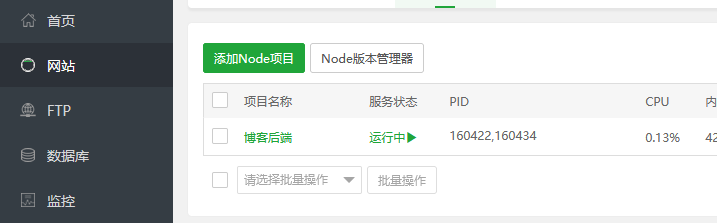


## 404问题


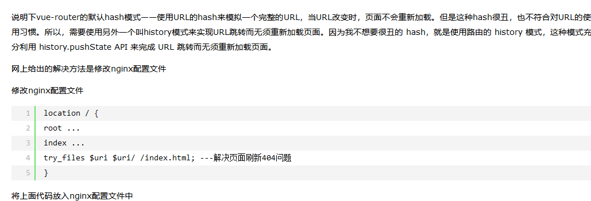

# 前端部分

## IntersectionObserve实现图片懒加载

传统方法是用   页面的innerHeight + scrollTop 和 图片的 offsetTop进行对比

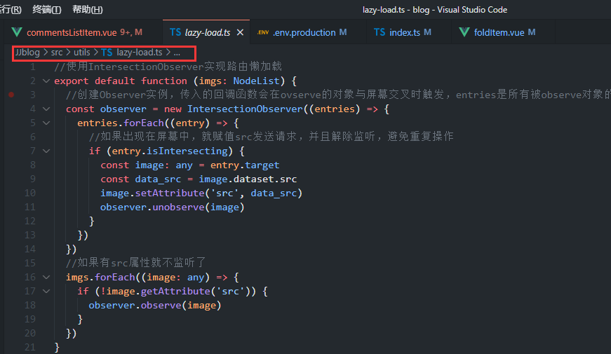

## 使用函数来将扁平的数组转成父子结构

其中的type和index用于dom查询


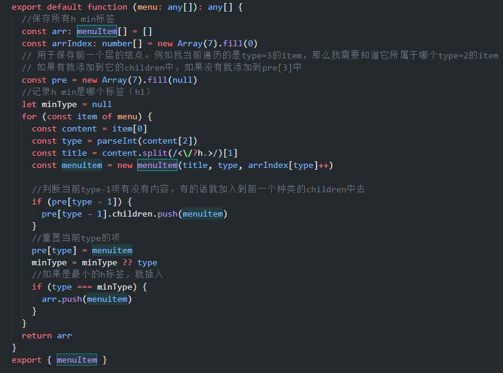


## 结合element-ui的递归组件实现目录效果

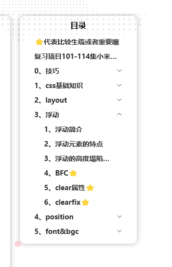


# 重构后的后端数据库

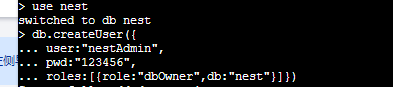


# 开启http2

参考下面的博客

https://www.cnblogs.com/flydean/p/15196067.html#%E5%AE%89%E8%A3%85%E6%9C%80%E6%96%B0%E7%9A%84nginx

- 首先服务器得有openssl
- nginx
- 生成证书（后面要去服务器申请ssl证书，网站才是安全的）

```js
openssl req -x509 -nodes -days 365 -newkey rsa:2048 -keyout selfsigned.key -out selfsigned.crt
```

- 将证书放到nginx的conf的ssl目录下

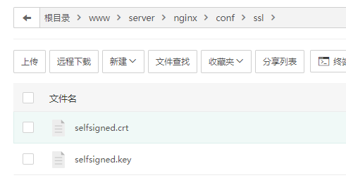

- 修改网站的配置文件（指定证书和秘钥）

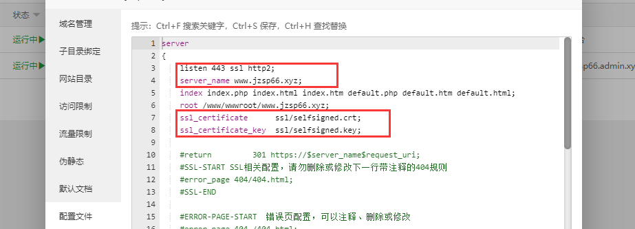

踩坑一，listen不加ssl的话会报错

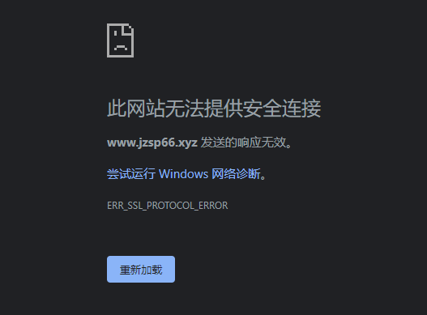

踩坑二：开启之后请求失败

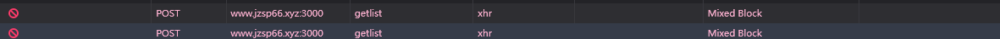

原因


经过九九八十一难之后，解决办法：反向代理，将请求在服务器内转发到对应的后端端口

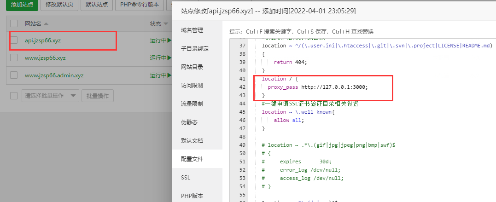

又出现了新的问题，静态web目录代理不了：

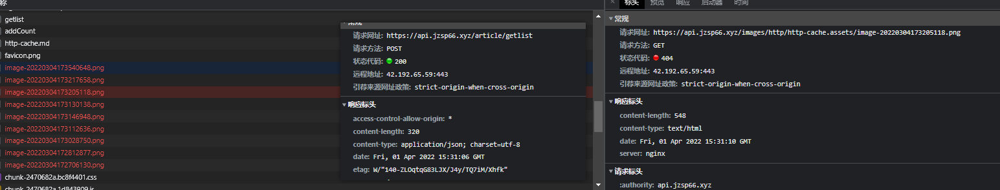

刚开始以为是静态目录代理不了，但是后面发现**md文件可以获取到**！

思路从这里开始就转变了，开始排查nginx的故障，因为没有学习过nginx，所以一头雾水的去百度。。。

看到网上的一个说法，重定向一下

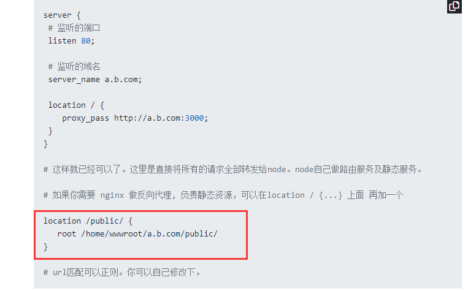

试了很多方法都发现没用。。。仔细看了一下配置文件，**发现前面有匹配png文件的地方**！心想是不是请求匹配到这里面去了，没有转发到对应的后端端口

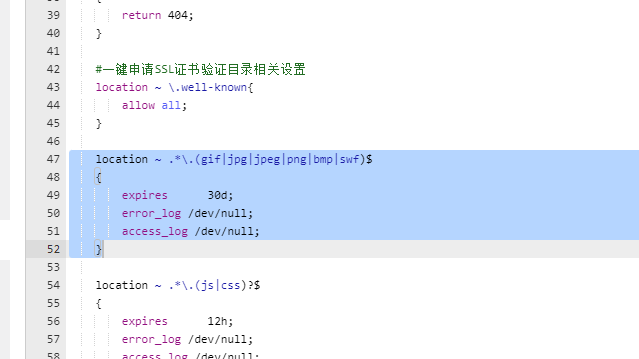

将它注释掉之后图片能访问了！

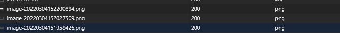


然后第二天，cdn挂掉了！！！

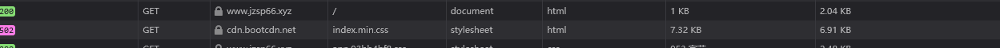

后来使用了官方推荐的unpkg.com的cdn

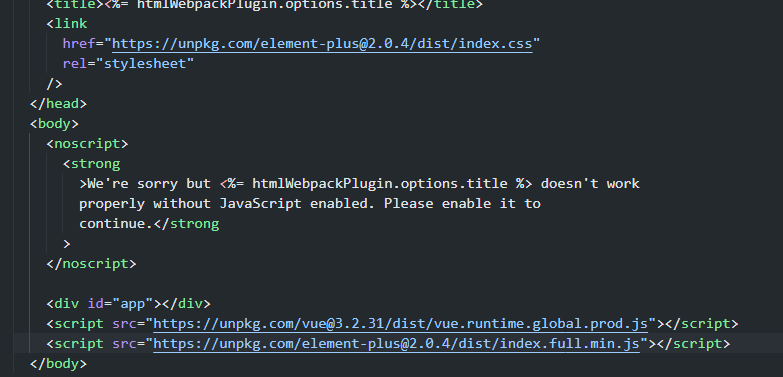

# 思考

## 如何实现滚动到对应的h标签，目录高亮

在看vite官网的时候偶然间注意到了这个问题

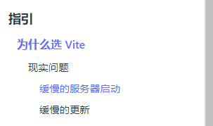

这才发现他们的跳转是通过a标签+href

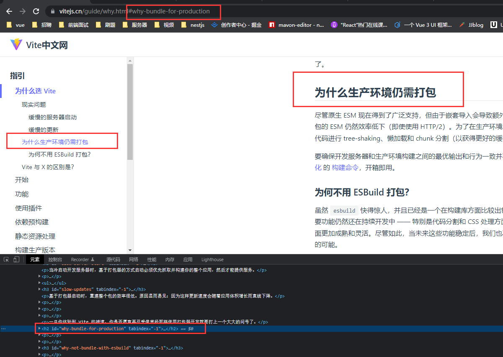

那么我猜测应该是会监听每个h标签距离视口顶部的位置，然后对应的高亮样式是根据location.hash的值动态绑定的。

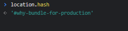