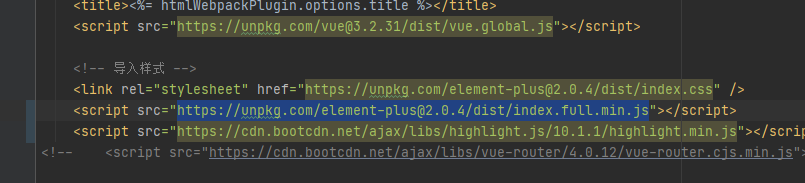
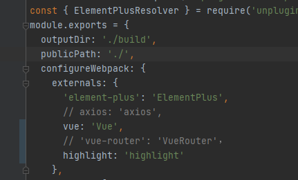
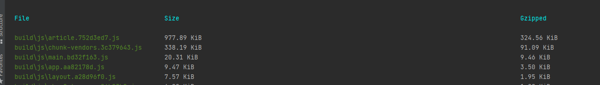
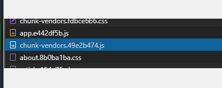
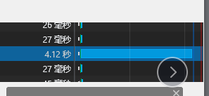

# 遇到的问题

1、解析markdown的时候是用v-html解析的，v-html不会解析组件标签，需要用别的方式实现懒加载

2、请求资源的时间太久，图片体积太大了

3、打包生成的体积太大了，首屏渲染时间很长，对打包进行了优化

# 项目优化

1：通过cdn方式引入，减小打包体积，但是发现cdn引入的包加载时间还是过长

前后对比，chunk-vendor的大小从5M变成了0.9M

使用cdn的网络情况

不用cdn的情况

2：将图片转成webp格式，存入cdn，2.5M的图片转成webp格式之后竟然只剩下120kb！

3：使用intersectionOvserve实现图片懒加载，对搜索框进行了防抖处理，减小服务器压力

5：在开发时开启Terser的parallel，进行多进程打包。

6：路由懒加载，避免所有组件都加入chunk-vendor中。

7、开启http2

