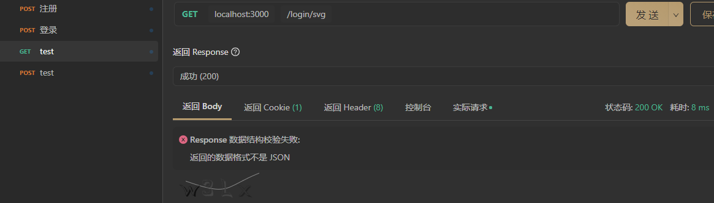
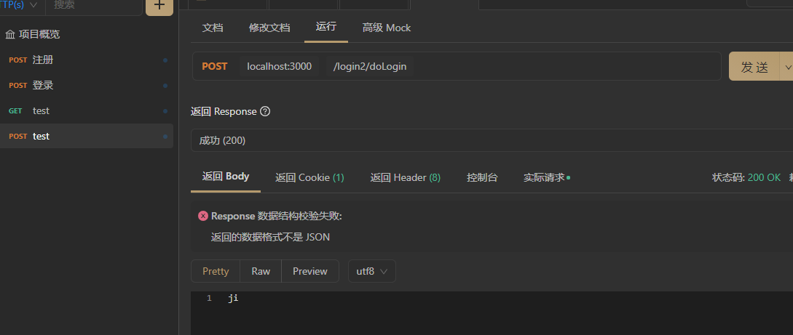
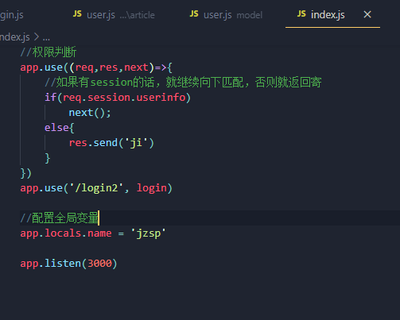
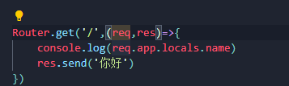
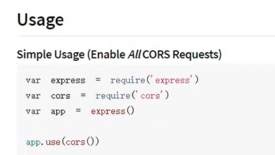

## 1、登录模块

用svg-captcha模块生成，需要先安装该模块和session模块哦

login模块，传入的密码加密的代码可以写在schema的password的setter里

**登录应该分两步，第一步是看用户是否存在，再看密码是否一样**

```js
const express = require('express')
const Router = express.Router()
//生成图形验证码模块
const svgcap = require('svg-captcha')
//加密模块
const md5 = require('md5')
//user的model，用于操作数据库
const user = require('../user')

Router.get('/',(req,res)=>{
    res.send('你好')
})
//获取图形验证码
Router.get('/svg',(req,res)=>{
    let captcha = svgcap.create();
    //验证码的字符串保存在captcha.text中
    console.log(captcha.text)
    //存入session
    req.session.verity = captcha.text
    res.type('svg')
    res.status(200).send(captcha.data)
})

//注册
Router.post('/register',(req,res)=>{
    let u = new user({
        username: '948065841',
        //记住，保存的密码需要md5加密，在验证密码的时候同样也需要加密判断
        password: md5('123456'),
        email:'948065841@qq.com',
        mobile:13958535549,
        age: 20
    })
    u.save()
    res.send('1')
})

Router.post('/doLogin',async (req,res)=>{
    let username = req.body.username
    let password = req.body.password
    console.log(req.session.verity)
    console.log(req.body.verity)
    if(req.body.verity === req.session.verity){
        //加密查找数据库中的信息，这里用await变成同步，查询到的结果保存在数组中
        let result = await user.find({"username":username,"password":md5(password)})
        if(result.length === 1){
            //保存登陆成功后的用户信息
            req.session.userinfo = result[0]
            res.send('success')
        }else{
            res.status(422).send({
                message:'用户名不存在'
            })
        }
    }else{
        //如果这里返回的是err的话，前端需要重新修改img的src为当前请求路径后面加上一个时间戳，
        //这样就可以保证发送不同的请求
        res.send('err')
    }
})

module.exports = Router
```

index模块进行中间件拦截

```js
const express = require('express')
const session = require('express-session')
const app = express()
const login = require('./model/login/login')

app.use(session({
    secret: 'this is session',       
    name: 'wjj',                     
    resave: false,                  
    saveUninitialized: true,         
    cookie: {                       
        secure: false,
        maxAge: 1000 * 60 * 30
    },
    rolling: true                    
}))
app.use(express.json())
app.use(express.urlencoded({ extended: false }))
//挂载路由
app.use('/login', login)
//根据session判断是否登录，如果没登录的话，下面的路由都将不被匹配
app.use((req,res,next)=>{
    //如果有session的话，就继续向下匹配，否则就返回寄
    if(req.session.userinfo)
        next();
    else{
        res.send('ji')
    }
})
//这里以下的路由只有在中间件的匹配成功后才能执行
//这个路由挂载只用做测试
app.use('/login2', login)

app.listen(3000)
```

apifox测试

- 先获取图形验证码并且保存到session中



- 尝试没有登录直接访问/login2下的路由，可以看到，被中间件拦截了



## 2、设置全局变量



引用



## 3、处理跨域

域名，端口，协议有一个不同，就产生了跨域，这个时候就需要在后台安装一下cors

npm install cors --save

