# 前情知识

## 安装

```js
npm i -g @nestjs/cli
nest new project-name
```

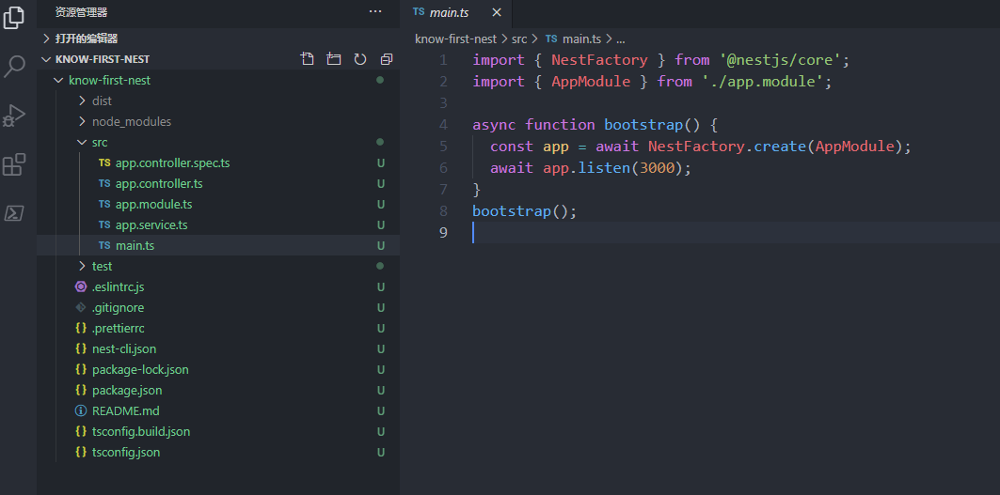pp

## 目录结构介绍

在main.ts中引入了app.module

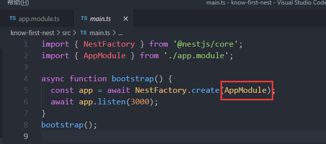

在app.modules中又引入了app.controller


app.controller中又通过依赖注入的方式引入了app.service，controller中用Get装饰器定义了一个get请求，Get装饰器和Controller是可以传入路由字符串设置路由的，例如`@controller('index')`表示`/index`下的路由

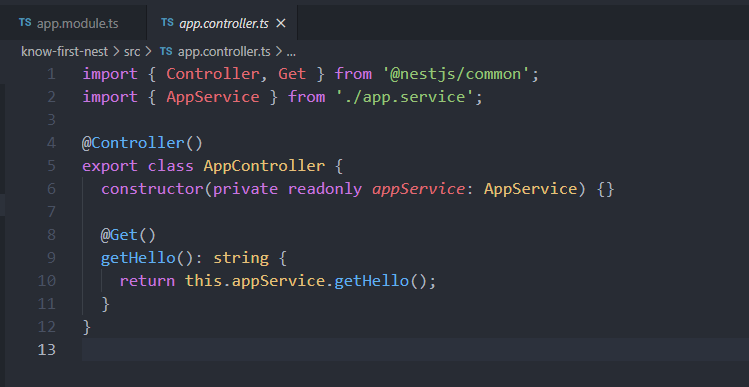

app.service中定义了getHello方法，可以在controller中调用并且返回对应的值Hello World

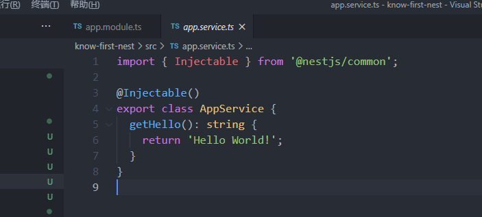

## nest命令创建model、controller以及service

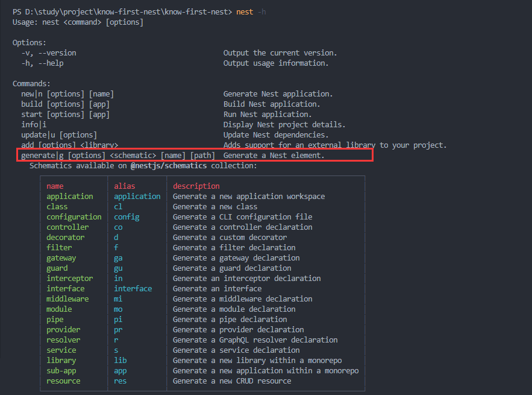

我们可以用`nest g mo [name]`创建一个name模块

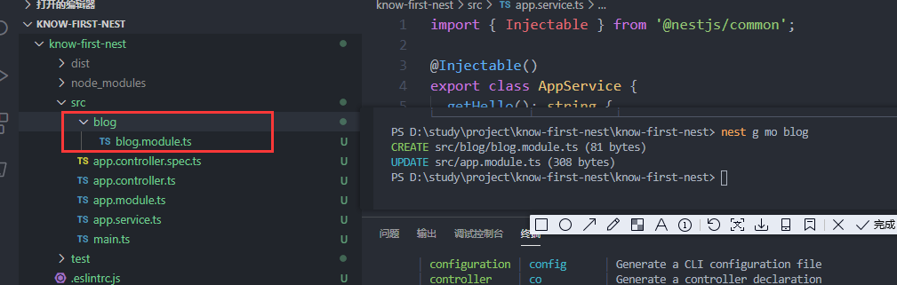

但是单单一个空的模块是没用的，我们还可以通过`nest g co [name]`创建一个控制器，可以看到，内部还顺便帮我们在blog.module中引入了这个Controller

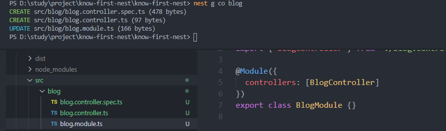

并且Controller中也会添加上prefix前缀，这个前缀的作用跟路由一样

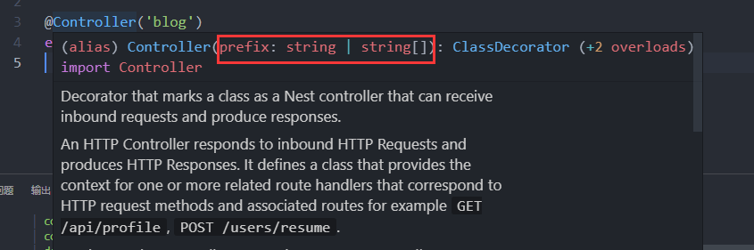

## restful api 接口规范

待完成。。。

## 简单地编写接口

查看package.json的script，用npm run start:dev的方式（会热更新）运行项目

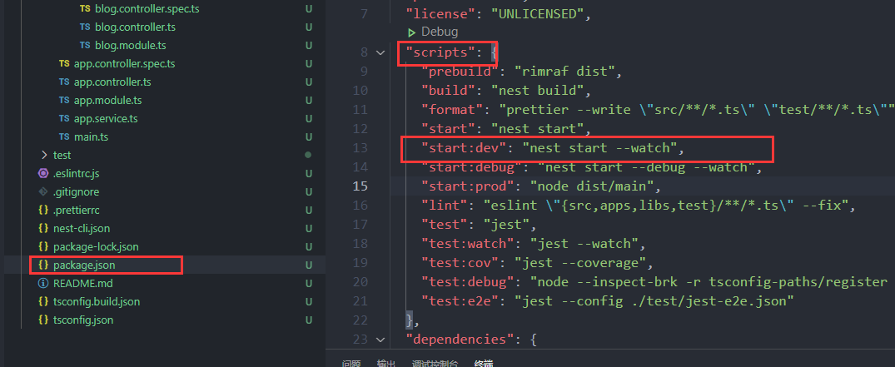

### @Get装饰器

我们在前面创建的blog这个controller中通过@Get装饰器写一个get请求

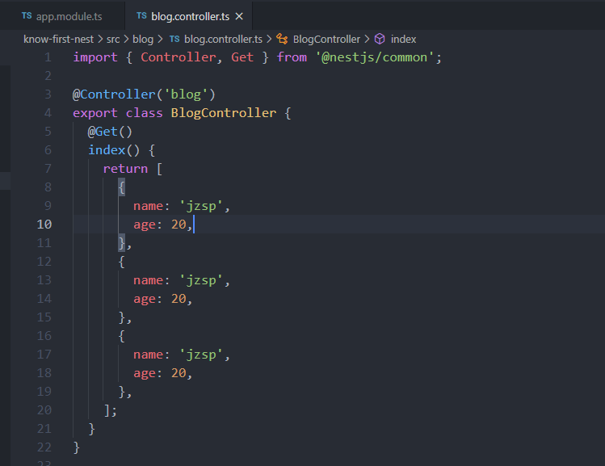

可以看到，能成功请求到数据


### @Post装饰器

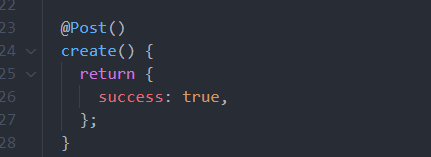

### 动态路由

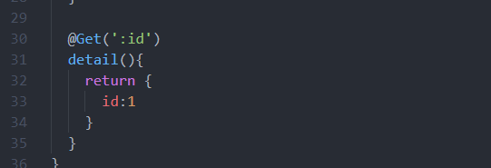

可以通过@Param装饰器获取参数

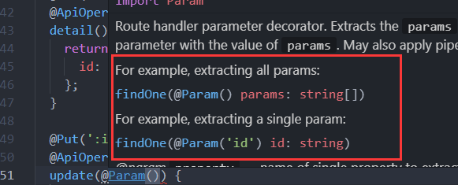

### @Put装饰器和@Delete装饰器

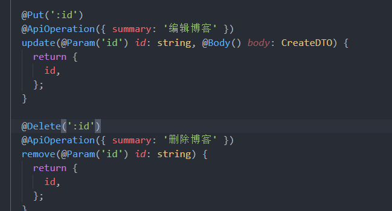


## 集成swagger说明文档

### 简单使用

首先，您必须**安装**所需的包：

```bash
 npm install --save @nestjs/swagger swagger-ui-express
```

如果你正在使用 `fastify` ，你必须安装 `fastify-swagger` 而不是 `swagger-ui-express` ：

```bash
 npm install --save @nestjs/swagger fastify-swagger
```

在main.ts中配置

```ts
import { NestFactory } from '@nestjs/core';
import { AppModule } from './app.module';
import { SwaggerModule, DocumentBuilder } from '@nestjs/swagger';   //引入
async function bootstrap() {
  const app = await NestFactory.create(AppModule);
    
  //下面这一段是配置信息
  const options = new DocumentBuilder()
    .setTitle('初次学习Nest')    //标题
    .setDescription('第一次接触nestjs')   //描述
    .setVersion('1.0')
    .build();
  const document = SwaggerModule.createDocument(app, options);
  SwaggerModule.setup('api-docs', app, document);   //第一个参数是swagger挂载的路径
    
    
    
  await app.listen(3000);
}
bootstrap();
```

设置好对应的挂载路径之后，我们就可以访问对应的路径打开swagger界面了

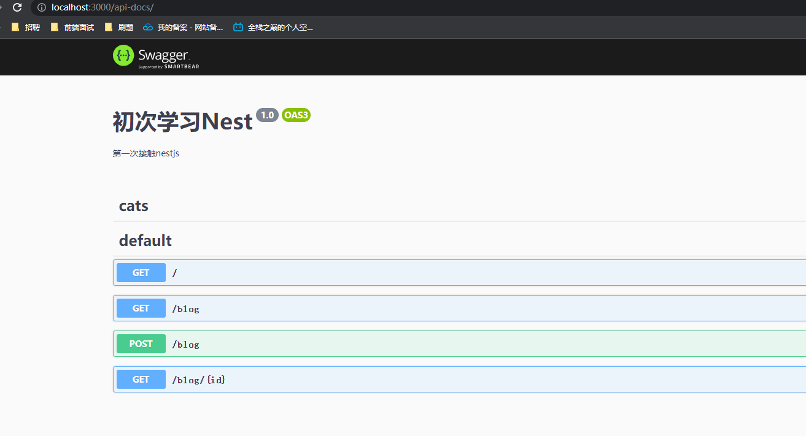

但是可以看到我们的接口是冗杂在default下的，所以我们可以**再次利用@ApiTags装饰器**将他们分模块

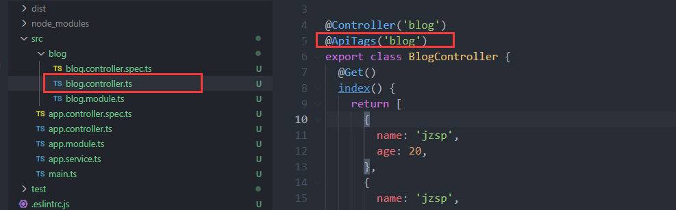

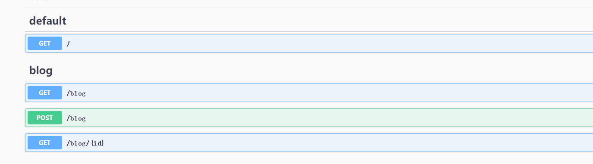

如果要给每个接口增加描述的话，可以用**`@ApiOperation`装饰器**，装饰器传入一个对象，内容如下，其中summary是对这个接口的描述

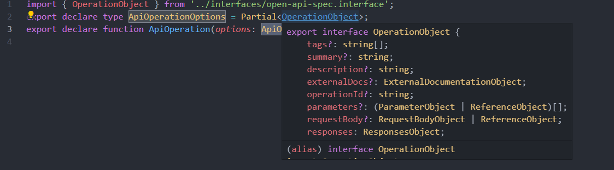

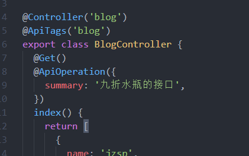

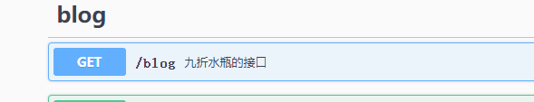

之后就可以点击：`try it out + execute` 去执行这个接口了

### 关于获取以及规定请求的数据

假设我们这个POST请求接口内部需要用到body，query，和params中的数据，那么我们要怎么获取呢？

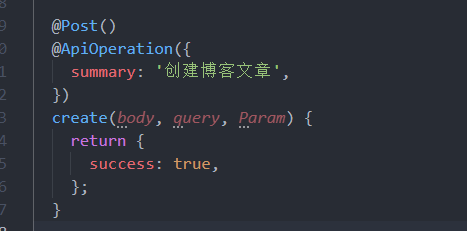

我们可以用装饰器来告诉nest，每个参数对应的内容，body，query，param对应的装饰器分别是`@Body(),@Query(),@Param()`

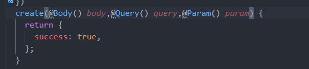

这些装饰器内部还可以传入字符串，用于声明我们要获取的对应的信息，例如我们可以在`@Param()`中传入id字符串，那么我们获取到的就是param中的id数据了，如果没有传入的话就是获取整个数据。


进一步的，我们可以利用ts的特性，声明传输过来的参数的类型，typescript中是可以定义interface来指定类型的，但是这里推荐用class（因为官网说，类是原生存在的，而interface会被转化消失掉）


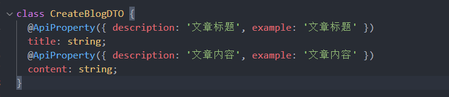

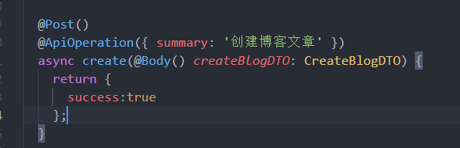

注意到这里，我们还对类中的属性用`@ApiProperty()`装饰器装饰了一下，这个装饰器的作用是为了让这些参数在swagger中显示，下图是没有这两个装饰器的效果

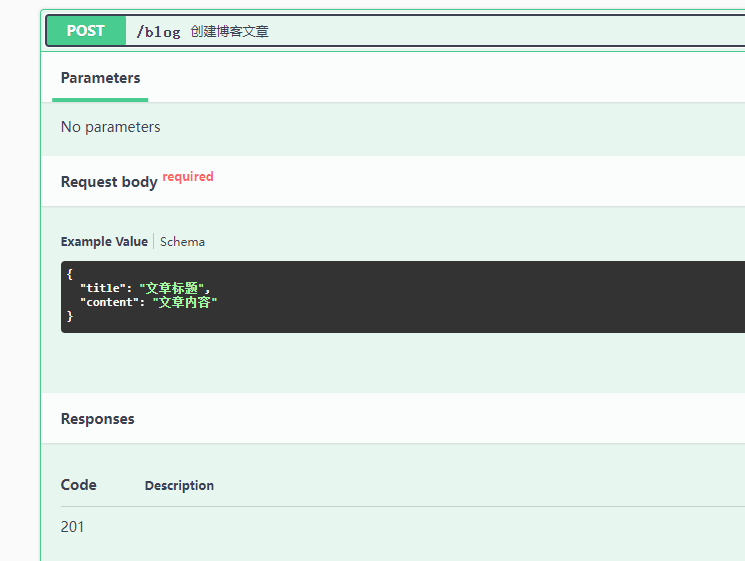

如果给参数使用了装饰器之后，参数就可以显示在swagger中了


## 使用typegoose结合mongodb数据库

搭建好博客接口架构之后，我们就可以连接数据库进行操作了

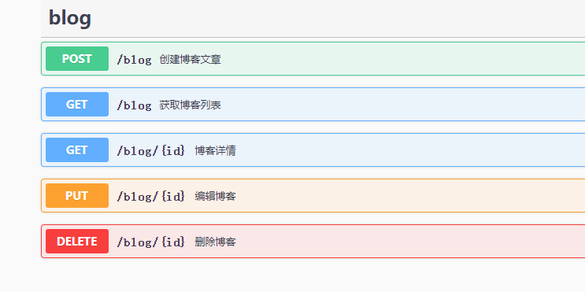

https://www.npmjs.com/package/@typegoose/typegoose

我们使用typegoose来创建mongoose的model，所以我们需要安装下面这些内容

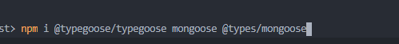

### **进行配置**

- 首先在main.ts中连接数据库

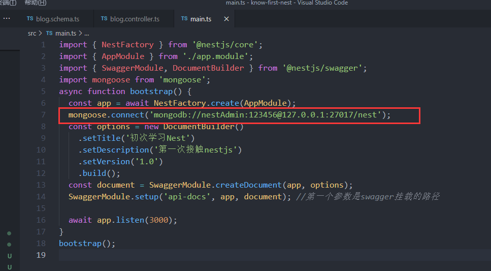

- 创建blog.dbModule.ts文件，class相对于是原来的Schema，而BlogModel是用typegoose内置的方法getModelForClass来创建的mongoose的model

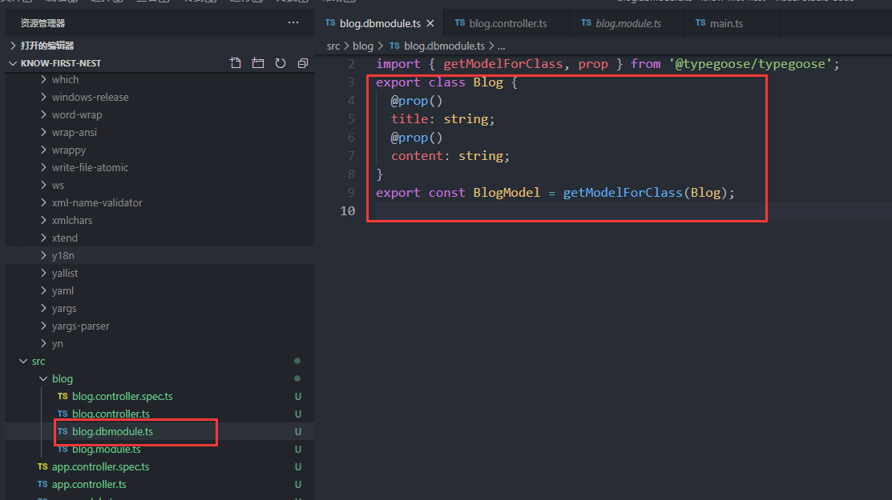

- 在controller中导入这个Model，就可以直接通过它来进行数据库操作啦

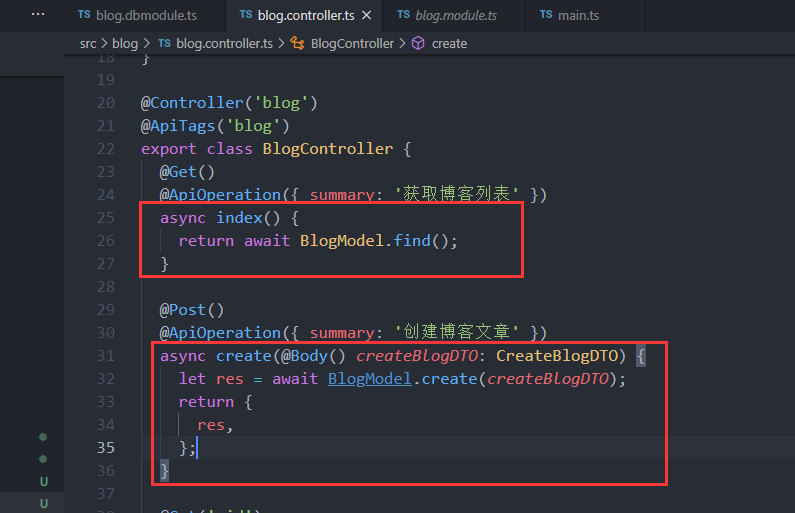

### 实现简单CRUD

这里用到了几个mongoose内置的方法：`findByIdAndUpdate(),findByIdAndDelete()`

blog.controller.ts

```ts
import {
  Body,
  Controller,
  Delete,
  Get,
  Param,
  Post,
  Put,
} from '@nestjs/common';
import { ApiOperation, ApiProperty, ApiTags } from '@nestjs/swagger';
import { BlogModel } from './blog.dbmodule';

class CreateBlogDTO {
  @ApiProperty({ description: '文章标题', example: '文章标题' })
  title: string;
  @ApiProperty({ description: '文章内容', example: '文章内容' })
  content: string;
}

@Controller('blog')
@ApiTags('blog')
export class BlogController {
    
    
  @Get()
  @ApiOperation({ summary: '获取博客列表' })
  async index() {
    return await BlogModel.find();
  }

  @Post()
  @ApiOperation({ summary: '创建博客文章' })
  async create(@Body() createBlogDTO: CreateBlogDTO) {
    let res = await BlogModel.create(createBlogDTO);
    return {
      res,
    };
  }

  @Get(':id')
  @ApiOperation({ summary: '博客详情' })
  async detail(@Param('id') id: string) {
    return await BlogModel.findById(id);
  }

  @Put(':id')
  @ApiOperation({ summary: '编辑博客' })
  async update(@Param('id') id: string, @Body() updateBlogDTO: CreateBlogDTO) {
    //mongoose自带的方法，通过id找到之后并且更新
    let res = await BlogModel.findByIdAndUpdate(id, updateBlogDTO);
    return res;
  }

  @Delete(':id')
  @ApiOperation({ summary: '删除博客' })
  async remove(@Param('id') id: string) {
     //mongoose自带的方法，通过id找到之后并且删除
    let res = await BlogModel.findByIdAndDelete(id);
    return res;
  }
}

```

### 利用Pipes管道增加validate验证

这里的管道其实类似于express中的中间件的概念，在客户端发送请求使用对应的接口的时候会经过对应的pipe管道，在请求返回数据到客户端的时候会经过对应的Filter过滤器

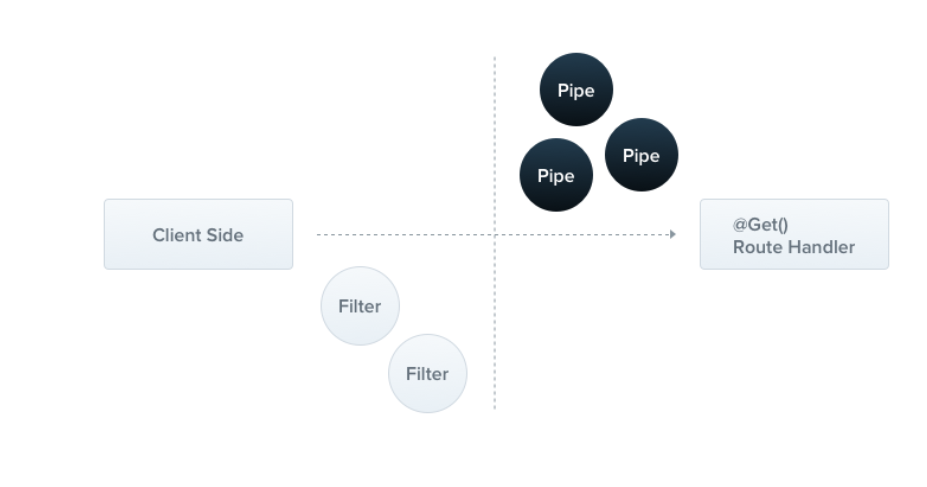

在main.ts中配置ValidationPipe管道

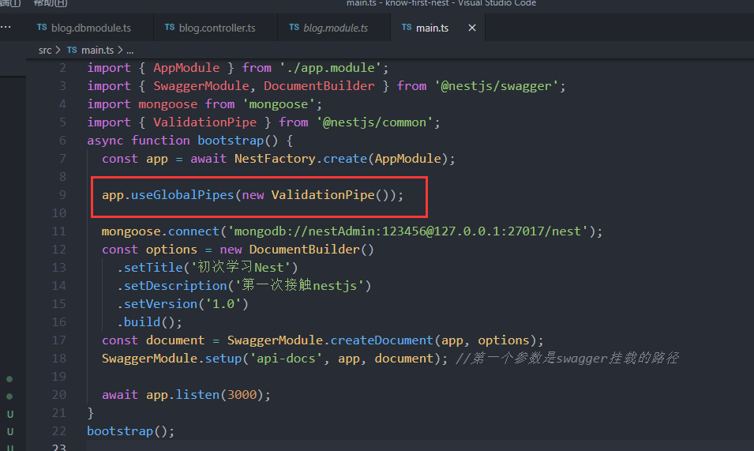

但是报错了

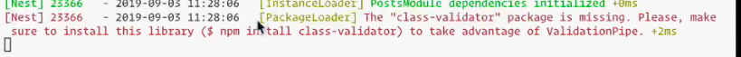

查看官网，需要安装validate管道对应的**辅助包**

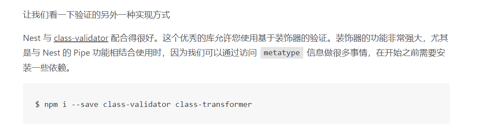

我们可以在对应的DTO对象（Data Transfer Object数据传输对象）上用class-validator内置的装饰器来进行内功校验

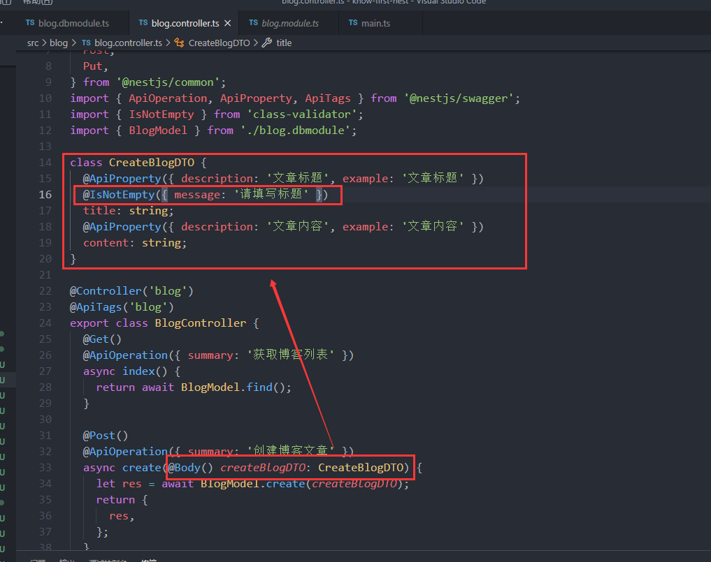

上面用了@IsNotEmpty进行非空校验，如果没有传入title的话，会返回里面配置的message提示信息

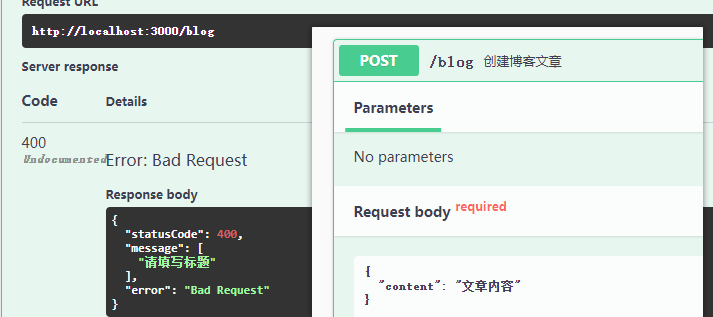

## 使用模块化的思想注入model并操作数据库

- 将MongooseModule导入到根AppModule中，`forRoot()`和`mongoose.connect()`是一样的，作用是连接数据库

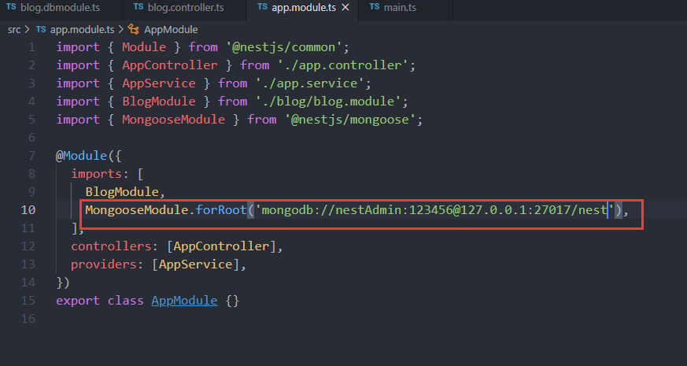

- 将原来的dbmodule修改成schema，因为这个文件里只定义了schema。`@Schema` 装饰器**标记一个类作为`Schema` 定义**，它将我们的 `Blog` 类映射到 `MongoDB` 同名复数的集合 `blogs`。

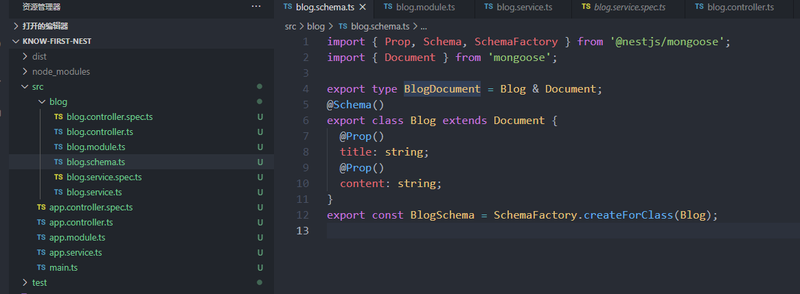

