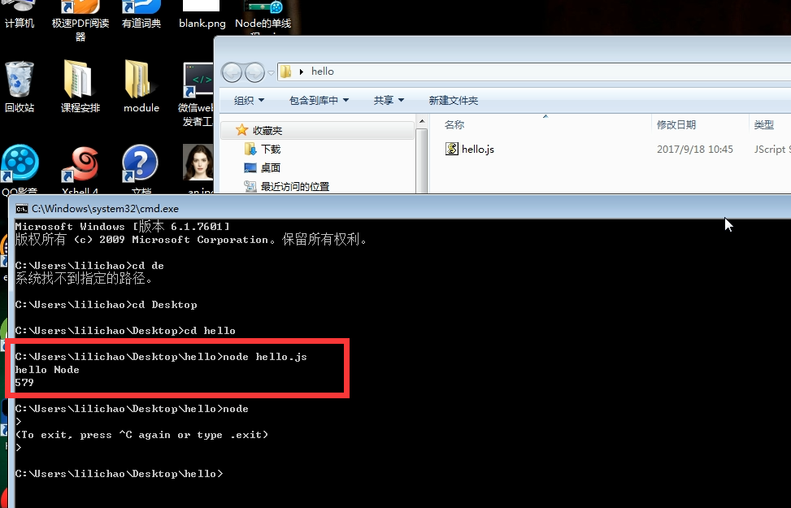
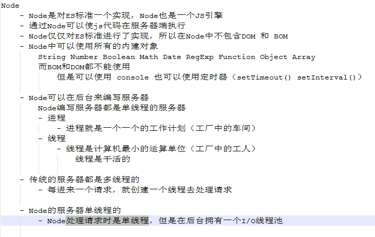
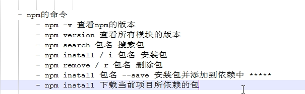
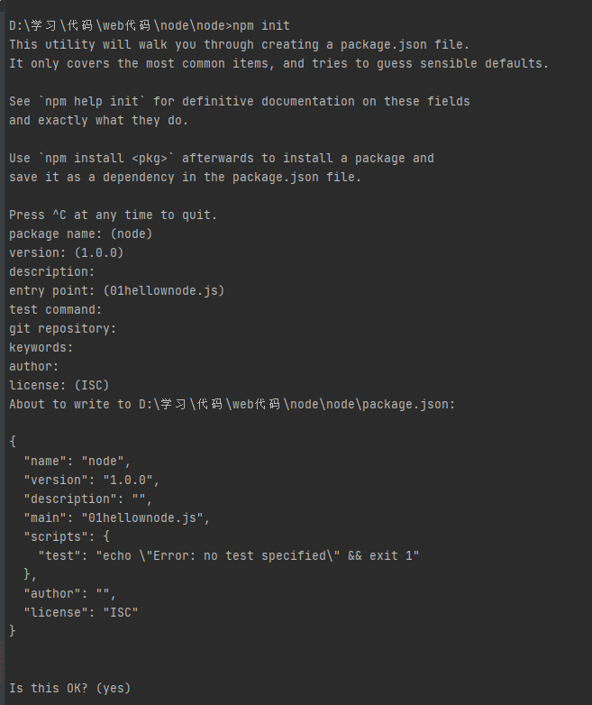
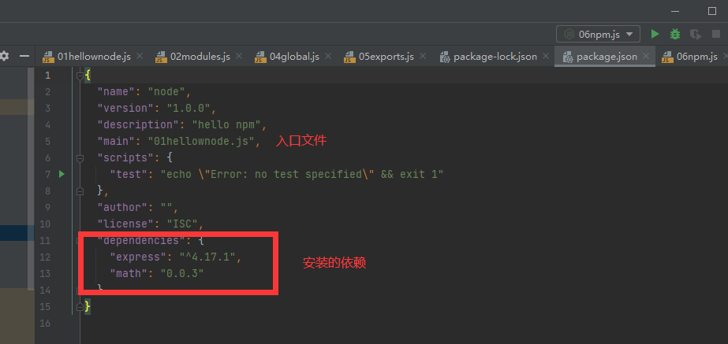
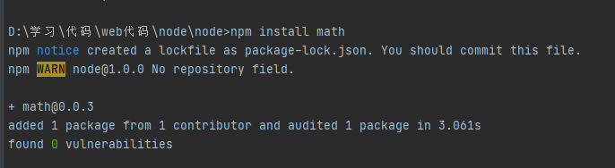
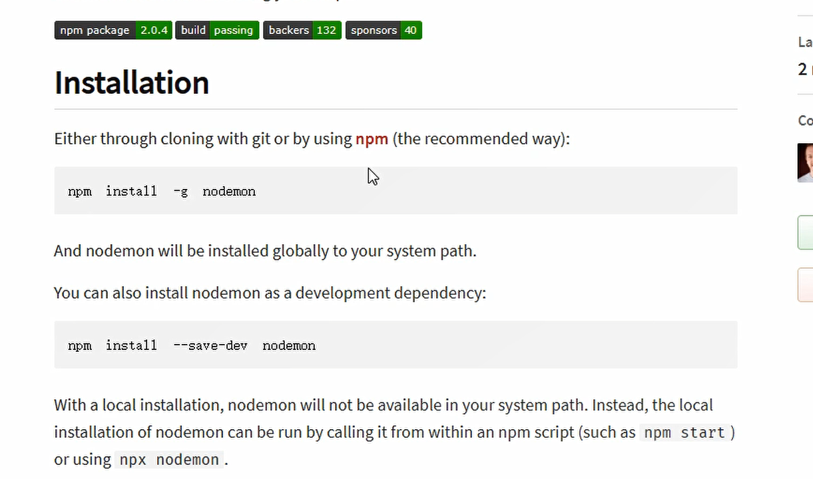
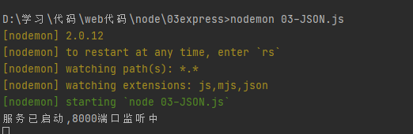

# 常用的dos指令

## 常用指令

dir  展示当前目录下的所有文件

cd 目录名  进入到指定的目录

md xxx  新建文件夹

rm xxx  删除文件夹



## 目录

.表示当前目录

..表示上一级目录

## 环境变量

当我们在命令窗口打开一个文件，或者调用一个程序时，系统会首先在当前目录下寻找文件程序，如果找到了就打开，如果没找到就会依次到环境变量的path路径中寻找。如果没找到则报错

改完了path要重启命令行窗口才能生效


# 关于node



# node与webstorm整合

coding assistance for node.js


# NPM



npm init     创建package.json文件夹





npm install xxx   安装对应的包

​	

## cnpm镜像安装

http://npm.taobao.org/

npm install -g cnpm --registry=https ://registry.npm.taobao.org


# node

## 模块化

```js
//  模块化
//     1,在node中，一个js文件就是一个模块，通过require函数来引入外部的模块
//     2,node中,每个js文件中的js代码都是独立运行在一个函数(闭包)中而不是全局作用域, 
//        所以引入了之后,不能访问被引入js文件中的函数和变量（证明是在闭包运行的代码在后面）

var a = 1;
var b = 2;
console.log('我是模块2')

//     3,我们可以通过exports 来向外导出变量或者方法,只需要将暴露给外部的变量或者方法设置为exports的属性即可
exports.X = 1;
exports.y = 2;
exports.fn = (a,b)=>{
  console.log(a+b)
}
```

## require引入模块

```js
var md = require('./02modules');
console.log(md);   //{}


//  require()可以传入一个文件的路径作为参数，node会自动根据该路径引入模块
//  注意,如果用相对路径,必须以.或者..开头
//
//   使用require引入之后,该函数会返回要给对象,这个对象代表的是引入的模块


console.log(md)
```

## global全局作用域

```js
/*
*   在node中有一个全局对象global,他的作用和浏览器的window类似
*     在全局中创建的变量都会作为global的属性保存
*     在全局中创建的函数都会作为global的方法保存
* */

//局部变量
var a = 100
//全局变量
b = 100

console.log(global.a)   //undefined
console.log(global.b)   //100


//证明模块化的代码是在函数闭包里运行的,这里我们输出一下函数特有的属性arguments
//arguments里面有个collee属性,保存的是当前执行的函数对象
//输出collee发现,当node在执行模块中的代码时,
// 它会在代码的最顶部添加function (exports, require, module, __filename, __dirname) {
// 它会在代码的最底部添加   }
// 结论:实际上代码都是包装在一个函数中执行的,并且在执行函数的时候传递了五个实参{
//      exports    -用来将变量或者函数向外暴露
//      require    -函数,用来引入外部的模块
//      module     -module就是当前模块,exports就是module的属性,exports和module.exports本质上是一样的,但还是有区别
//      __filename -当前模块的完整文件路径
//      __dirname  -当前模块的所在文件夹的完整路径
//    }
console.log(arguments)
console.log(arguments.callee + "")

module.exports.c = 100;
exports.c = 100;
```

## exports和module.exports

```js
//为什么module.exports可以导出对象，而exports不行呢？
//因为module是一个对象，module.exports={}是在修改这个对象的属性
//而exports是在修改exports的指向
//本质上exports是指向module.exports的，但是你现在让它指向了一个新的对象，就没用了
module.exports = {
  name : 'zbj',
  age : 18,
  sayname(){
    console.log('zbj')
  }
}
```

## node查找包的方式

```js
/*
  通过npm下载的包都在node_modules文件夹中
    通过npm下载的包，引入的时候直接通过包名引入即可

    node在通过模块名引入模块时，会首先在node_modules中寻找是否有该模块，如果有则直接用，
    如果没有，则去上一级目录的node_modules中寻找。。。如此往复，直到找到磁盘根目录时还没找到就报错。
    所以有时候是会有remove了包之后，还能使用的情况
* */

var math = require('math')

console.log(math)
```

# nodemon

可以自动重新启动应用,在文件修改时



安装完成后,不要用node xxx启动服务

用nodemon启动  



# Node.js 回调函数

Node.js 异步编程的直接体现就是回调。

异步编程依托于回调来实现，但不能说使用了回调后程序就异步化了。

回调函数在完成任务后就会被调用，Node 使用了大量的回调函数，Node 所有 API 都支持回调函数。

例如，我们可以一边读取文件，一边执行其他命令，在文件读取完成后，我们将文件内容作为回调函数的参数返回。这样在执行代码时就没有阻塞或等待文件 I/O 操作。这就大大提高了 Node.js 的性能，可以处理大量的并发请求。

回调函数一般作为函数的最后一个参数出现： 

```
function foo1(name, age, callback) { }
function foo2(value, callback1, callback2) { }
```

------

## 阻塞代码实例

创建一个文件 input.txt ，内容如下：

```
菜鸟教程官网地址：www.runoob.com
```

创建 main.js 文件, 代码如下：

```js
var fs = require("fs");

var data = fs.readFileSync('input.txt');

console.log(data.toString());
console.log("程序执行结束!");
```

以上代码执行结果如下：

```
$ node main.js
菜鸟教程官网地址：www.runoob.com

程序执行结束!
```

------

## 非阻塞代码实例

创建一个文件 input.txt ，内容如下：

```
菜鸟教程官网地址：www.runoob.com
```

创建 main.js 文件, 代码如下：

```js
var fs = require("fs");

fs.readFile('input.txt', function (err, data) {
    if (err) return console.error(err);
    console.log(data.toString());
});

console.log("程序执行结束!");
```

以上代码执行结果如下：

```js
$ node main.js
程序执行结束!
菜鸟教程官网地址：www.runoob.com
```

以上两个实例我们了解了阻塞与非阻塞调用的不同。第一个实例在文件读取完后才执行程序。 第二个实例我们不需要等待文件读取完，这样就可以在读取文件时同时执行接下来的代码，大大提高了程序的性能。

因此，阻塞是按顺序执行的，而非阻塞是不需要按顺序的，所以如果需要处理回调函数的参数，我们就需要写在回调函数内。

# node文件系统

## Buffer缓冲区

```js
/*
    Buffer缓冲区
       操作与结构和数组很像
       数组中不能存储二进制文件，Buffer就是用来存储二进制数据
       buffer中存储的都是二进制数据，但是显示都是以十六进制显示的
       一个汉字占用三个字节

     Buffer.from将字符串变为Buffer
     Buffer通过alloc分配之后，大小就固定，不会改变，实际上是对底层内存的直接操作
     allocUnsafe也可以创建指定大小的Buffer，但是可能含有敏感数据（分配空间的时候没有清除数据）
     十进制数要用其他进制展示，用tostring(进制数)转换
     buf.toString   buffer可以用toString转换为字符串显示
 */
var str = 'jzsp'
var str2 = '王江建'

var buf = Buffer.from(str2)
//占用内存的大小
console.log(buf);
//字符串长度
console.log(str2.length);


//创建一个指定长度(字节)的buffer,Buffer所有构造函数都已经被废弃了，尽量别用
var buf2 = new Buffer(10)
console.log(buf2)

//alloc，分配指定长度的缓冲区
var buf3 = Buffer.alloc(10)

//通过索引来操作buf中的元素
buf3[0] = 88
buf3[2] = 11

//不在范围0-255的数，只截取后八位的二进制数
buf3[3] = 256
console.log('buf[3]=='+buf3[3])

//只要是数字，控制台输出的一定是以十进制输出,如果想以其他进制输出，可以用toString
console.log(buf3[0]);
console.log(`二进制输出是` + buf3[0].toString(2));


//展示
console.log(buf3)
```

## 文件写入

### 同步文件写入

```js
/*
    文件系统 简单来说就是通过Node来操作系统中的文件
    使用文件系统，需要先引入fs模块，fs是核心模块，直接引入不需要下载。

    fs模块中所有操作都有两种形式可以选择（同步和异步）
      Sync 同步文件系统会阻塞程序执行，除非操作完毕，否则不会向下执行代码
           异步文件系统不会阻塞程序的执行，二十在操作完成时，通过回调函数callback将结果返回

    文件写入
      1:打开文件
          fs.openSync(path,flags[,mode])
            path 要打开的文件路径
            flags 要进行的操作类型   r只读   w只写
            mode  设置文件操作权限，一般不传

           该方法会返回文件的描述符作为结果，我们可以通过描述符来对文件进行操作

      2：写入内容
          fs.writeSync(fd,string[,position[,encoding]]))
              fd   要写入文件的文件描述符
            string 要写入的内容
          position 写入的起始位置（可选）
          encoding 写入的编码方式（默认utf-8)
      3：保存并且关闭
           fs.closeSync(fd)
 */

var fs = require('fs')
//打开文件
var fd = fs.openSync('hello.txt','w')
//写入文件
fs.writeSync(fd,'今天天气真不错')
//关闭文件
fs.closeSync(fd)

console.log(fd)
```

### 异步文件写入

```js
/*
    异步文件写入(异步方法不会有返回值，有返回值的一定是同步的方法）
      异步调用的方法，结果都是通过回调函数callback返回的
        回调函数的两个参数：
          err 错误对象，如果没有错误则为null
          fd  文件的描述符

      打开文件   fs.open(path,flagsp,mode],callback)
      写入文件   fs.write(fd,string[,position[,encoding]]))
      关闭保存   fs.close(fd)

 */

var fs = require('fs')

//打开文件
fs.open("hello2.txt","w",(err,fd)=>{
    //做出判断
    if(!err){
      //如果没出错则写入文件
      fs.write(fd,'这是异步写入的内容',(err)=>{
        if(!err){
          console.log('写入成功');
          fs.close(fd,()=>{
            console.log('文件已关闭');
          })
        }
      })
    }else{
      console.log(err);
    }
})
//异步操作不会阻塞程序执行，下面这行代码会在17行之后立即执行，同步的优点是符合人的思维
console.log('程序没被阻塞');
```

### 简单文件写入

```js
/*

    fs.writeFile(file,data[,options],callback)
    fs.writeFileSync(file,data[,options])
      file    要操作的文件路径
      data    要写入的数据
      options 对写入进行设置,传入的是对象
          {
            encoding: 编码方式
            mode: 默认不写
            flag: 'w'    默认是覆盖的写，如果想用在后面追加的方式，可以设置为’a'  (append)
          }
      callback 回调函数

 */

var fs  = require('fs')
fs.writeFile('hello3.txt','这是通过writeFile写入的内容',(err)=>{
    if(!err){
      console.log('写入成功');
    }
})

fs.writeFile('hello3.txt','这是通过writeFile写入的内容',(err)=>{
  if(!err){
    console.log('写入成功');
  }
})
```

### 流式文件写入

```js
/*
    同步异步简单文件写入都不适合大文件写入，因为性能较差，容易导致内存溢出

    创建可写流fs.createWriteStream(path[,options])
      path    文件路径
      options 配置的参数

 */

var fs = require('fs')

//创建一个可写流
var ws = fs.createWriteStream("hello4.txt")
//通过ws像文件中输入内容
ws.write('通过可写流写入文件的内容')

//通过监听流的open和close时间来监听流的打开和关闭
//ws.on（事件字符串，回调函数）    ws.once（事件字符串，回调函数）  都可以绑定时间（jquery） 但是后者性能更好
ws.once("open",()=>{
  console.log('流打开了');
})
ws.once("close",()=>{
  console.log('流关闭了');
})


ws.write('通过可写流写入文件的内容1\n')
ws.write('通过可写流写入文件的内容2\n')
ws.write('通过可写流写入文件的内容3\n')
ws.write('通过可写流写入文件的内容4\n')
ws.write('通过可写流写入文件的内容5\n')
ws.write('通过可写流写入文件的内容6\n')

//因为是异步的，这可能有bug，可能会在流没写入完成的时候就关闭了
// ws.close()

//要用end
ws.end();
```

## 文件读取

### 简单文件读取

```js
/*
    1.同步文件读取
      fs.readSync(fd,buffer,offset,length,position,callback)

    2.异步文件读取
      fs.read...

    3.简单文件读取
      fs.readFile(path[,options],callback)
        callback有两个参数
          err  错误对象
          data 读取到的数据，会返回一个buffer
      fs.readFileSync...

    4.流式文件读取

 */

var fs = require('fs')
var path = 'C:\\Users\\86135\\Desktop\\QQ截图20210917094956.png'
fs.readFile(path,(err,data)=>{
    if(!err){
      // console.log(data.toString());
      fs.writeFile('hello3.png',data,(err)=>{
        console.log('写入成功！')
      })
    }
})
```

### 流式文件读取

```js
/*
    流式文件读取也适用于一些大文件的读取（多次读）

 */


var fs = require('fs')

// 创建一个可读流
var rs = fs.createReadStream('hello3.png')

//创建一个可写流
var ws = fs.createWriteStream('07.png')

//监听流的开启和关闭
rs.once('open',()=>{
  console.log('可读流打开了');
})
rs.once('close',()=>{
  console.log('可读流关闭了');
  //可读流关闭的时候，关闭可写流
  ws.end()
})

//如果要读取一个可读流中的数据，必须要为可读流绑定一个data事件，data事件绑定玩比，他会自动开始读取数据
rs.once('data',(data)=>{
  //每次最多读65536长度的数据
  // console.log(data.length);
  //将读取到的数据写入可写流中
  ws.write(data)
})

//可以用一句代码解决
// rs.pipe(ws)
```


