## 1、加密包md5

https://www.npmjs.com/package/md5

## 2、日期格式化包 silly-datetime

https://www.npmjs.com/package/silly-datetime

## 3、multer上传图片

https://www.npmjs.com/package/multer

## 4、mkdirp创建目录

https://www.npmjs.com/package/mkdirp

## 5、svg-captcha生成图形验证码

https://www.npmjs.com/package/svg-captcha

## 6、cors配置跨域

https://www.npmjs.com/package/cors

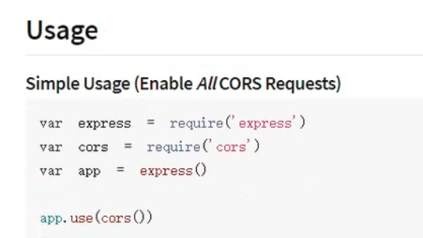

## 7、bcrypt散列加密

加密（第一个参数是要加密的数据，第二个参数是加密的级别，级别越高性能越差，越安全）

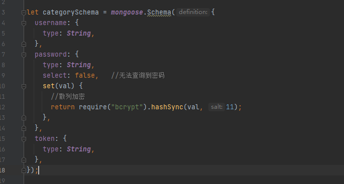

比较（第一个参数是未加密的明文，第二个参数是已加密的密文）

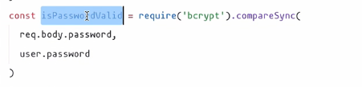

## 8、jwt生成token

https://www.npmjs.com/package/jsonwebtoken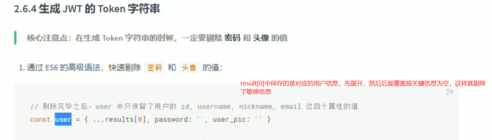

这里的第三个参数是token的有效期，过了30s就作废了，可以传入10h字符串代表有效期为10小时，需要重新生成token（也就是重新登陆了）。**这个参数最好放到配置文件中**

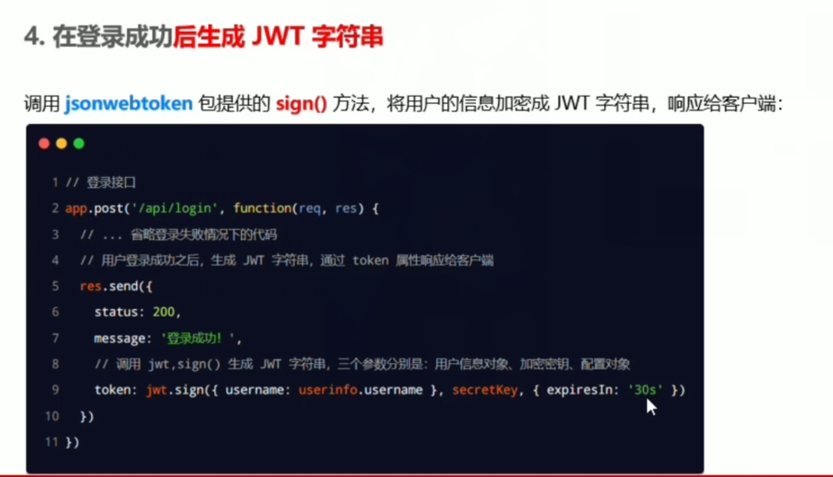

第一个参数是根据什么生成token，第二个参数是一个秘钥（建议放在env中，反正不要放在这，**放到配置文件中引入**。校验的时候需要用到的）

将token放到请求头中

服务器端获取请求头中的token，并且通过verify解析一下，最后解析出来的是前面创建token的第一个参数传入的值

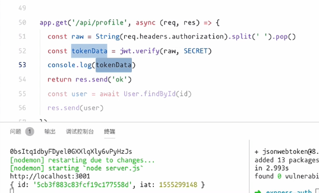

将解析userid的代码放到中间件中，将中间件传入，其实后面的（req,res）也是一个中间件，只不过是默认处理这个路由的时候就不继续向下匹配了，所以没传入next。将user保存到req中

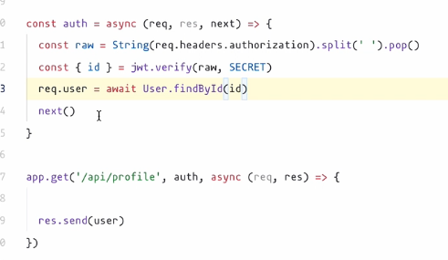

## 9、express-jwt解析token并且配置哪些接口不需要访问权限

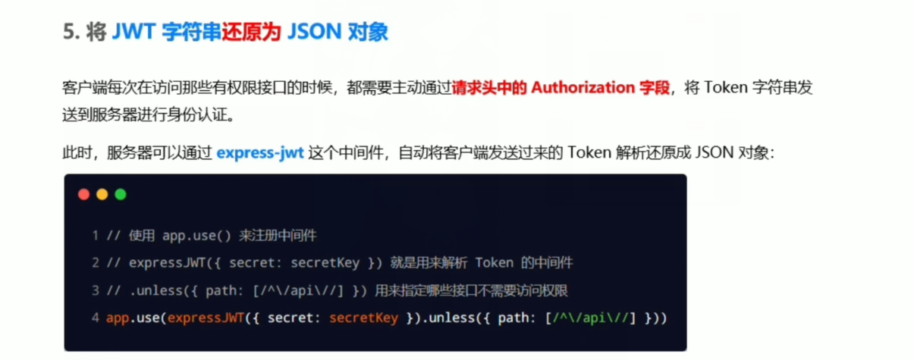

配置成功之后，会将解析过来的user信息挂载到req.user属性上

为了捕获token过期或者不合法的错误，则在全局配置一个错误中间件来捕获错误

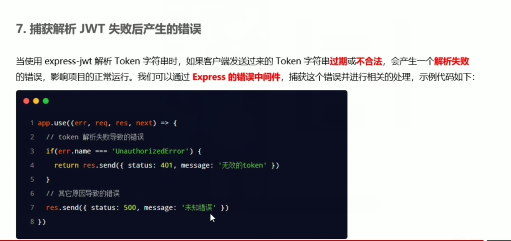

## 10、querystring（qs）解析query字符串为对象

这个是node内置模块

## 11、lodash 限制操作频率

https://github.com/lodash/lodash

可以看到，我们在mounted的时候在vm中挂载了一个b属性，他的值是一个_.debounce()的返回值

这个返回值是一个函数，里面有两个参数，第一个是要执行的函数，第二个是多少毫秒后执行（如果重复执行会覆盖倒计时）

可以看到，我们不停的触发a函数，但是通过b()方法输出的1只有一次

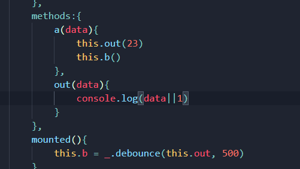

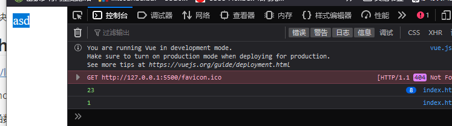

## 12、http-assert抛出http异常（好像还有个内置的http-errors）

导入assert之后用法如下

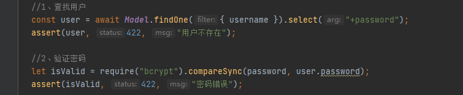

接着就可以在全局创建一个错误处理中间件统一进行处理了

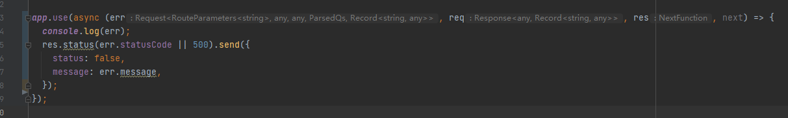