# JS高阶函数

## 1、filter

```js
const nums = [10,20,111,222,444,40,50];
//1.filter函数的使用
//filter的参数是一个函数，这个函数是有参数的，filter内部会进行遍历，括号内的参数是传入的数组的对应遍历的内容
//filter参数的函数，必须有个返回值为boolean类型的值，这个值用于过滤筛选
//如果为true，会push到新的数组里，如果为false则舍弃
//那么，拷贝数组的话直接return ture，取小于100的数的话直接return n<100
let newNums = nums.filter(function(n){
  return n<100;
})
console.log(newNums);
```

## 2、map

```js
//2.map函数的使用
//如果想对数组里的所有内容都进行统一的变化，就可以使用map函数对数组内容进行操作
//map进行的是操作，不是筛选
let new2Nums = newNums.map(function(n){
  return n*2;
})
console.log(new2Nums);
```

## 3、reduce

```js
//参数是回调函数和prevalue初始化的值，这个回调函数里有两个参数，一个是上一个返回的值，一个是遍历的当前值
//reduce作用是对数组中所有的内容进行汇总：相乘或者相加这类的
let total1 = new2Nums.reduce(function(preValue,n){
  return 100;
},0);
//他会遍历四次
//第一次：preValue 是  0       n是20
//第一次：preValue 是  100     n是40
//第一次：preValue 是  100     n是80
//第一次：preValue 是  100     n是100
//如果把return 改成 return prevalue+n 就是全部相加
//如果把第二个参数改成1 return改成 return prevalue*n就是相乘

//现在如果想完成操作：先筛选100以下的数据，然后全部×2，最后相加，可以这么些写
let total2 = nums.filter(function(n){
  return n<100;
}).map(function(n){
  return n*2;
}).reduce(function(prevalue,n){
  return prevalue+n;
},0);
console.log(total2);

//如果用箭头函数的话(暂时不懂)
let total3 = nums.filter(n=>n<100).map(n=>n*2).reduce((pre,n)=>pre+n);
console.log(total3);
```

# ES6语法补充

## 1、let & var

### 区别

```
es5之前，if和for都没有作用域的概念，因此在很多时候都需要借助于function作用域来解决应用外面变量的问题
es6中加入了let，有if和for的块级作用域
```

### 没有作用域

```js
//1.变量作用域：变量在什么范围内可以使用
//按照本来下面的输出语句应该是不能输出的，因为在语句块外面没有定义name属性
{
var name = 'jzsp';
console.log(name);
}
console.log(name);
```

### 演示for循环没有作用域

```js
//会发现，每次点击输出的都是第六个按钮被点击
//因为i不分块级作用域，他在外层会一直循环，在调用console输出的时候，var已经因为循环改成6了，所以每次输出都是一样的
var btns=document.getElementsByTagName('button');
for (var i = 0; i < btns.length; i++) {
  btns[i].addEventListener('click',function(){
    console.log('第' + i + '个按钮被点击');
  })
}

//function是有作用域的，下面是闭包

var btns1=document.getElementsByTagName('button');
for (var i = 0; i < btns1.length; i++) {
  //定义函数
  (function (i){
    btns[i].addEventListener('click',function(){
      console.log('第' + i + '个按钮被点击');
    })
  })
  //执行函数
  (i)
}


```

### let有作用域

```js

//let具有块级作用域
const btns2=document.getElementsByTagName('button');
for (let i = 0; i < btns2.length; i++) {
  btns2[i].addEventListener('click',function(){
    console.log('第' + i + '个按钮被点击');
  })
}
```

## 2、闭包的理解

闭包就是定义函数并且立马执行，函数的参数是你想要应用的参数

```html
<script>
  //function是有作用域的，下面是闭包

  var btns1=document.getElementsByTagName('button');
  for (var i = 0; i < btns1.length; i++) {
    //定义函数
    //在for循环的时候，定义i本质上是在{}里定义的
    (
      function (i){
          btns[i].addEventListener('click',function(){
            console.log('第' + i + '个按钮被点击');
          })
      }
    )

    //执行函数
    (i)
  }
  //此时因为用var定义的i没有作用域，这里i=5、
/*  i=5;
  function (i){
    //因为函数有自己的作用域，在程序执行到这里的时候，里面有个i会按i++来确定，不会因为外面改变而改变
    btns[i].addEventListener('click',function(){
      console.log('第' + i + '个按钮被点击');
    })}(0)
  function (i){
    btns[i].addEventListener('click',function(){
      console.log('第' + i + '个按钮被点击');
    })}(1)
  function (i){
    btns[i].addEventListener('click',function(){
      console.log('第' + i + '个按钮被点击');
    })}(2)
  ...*/
</script>
```

## 3、const常量符

不能修改

必须初始化

如果是指向的某个对象，那么指向不能改，但是可以修改指向对象里的属性

```html
<script>
  const name = 'why';
  //注意1：const 是常量，不能重新赋值
  name = 'abc';

  //注意2：const定义的时候必须初始化，因为定义了之后就不能重新赋值了
  const name2;
  name2 = 'why';

  //注意3：常量的含义是指向的对象不能修改，但是可以修改对象的属性
  const obj = {
    name : 'why';
    age : 1;
  }
  obj.name='wjj';
  obj.age = 12;
  obj = {}


  //在控制台输入类似于 app.firstName=‘123’ 的时候本质是改了内容，而不是改了指向

</script>
```

## 4、对象的字面量增强写法

```html
<script>
  //下面的大括号就是字面量
  const obj = new Object();
  const obj = {};

  //ES5的写法
  const name = 'jzsp';
  const age = 18;
  const obj = {
    name : name;
    age : age;
  }

  //es6属性的增强写法
  const obj = {
    name;
    age;
  }


  //es5函数的写法
  const obj = {
    run : function ()
    {

    },
    eat : function()
    {

    }
  }

  //es6的函数增强写法
  const obj = {
    run() {

    },
    eat(){

    },
  }
</script>
```


## 5、for循环的不同方式

```js
for (let i = 0; i < this.books.length; i++) {
  sum=sum+this.books[i].count*this.books[i].price;
}

for (let i in this.books) {
    sum=sum+this.books[i].count*this.books[i].price;
}
                                      
for (let book of this.books) {
  sum=sum+book.price*book.count;
}

```

## 6、箭头函数


### 基本使用

```js
//第一种方式
const aaa = function(){

}


//对象自变量定义函数
const obj = {
  bbb : function(){

  },
  bbb(){

  }
}

//3:箭头函数
const ccc = (参数列表) =>{

}
```

### 参数返回值

```js
//有参数的时候
const sum = (num1 , num2)=>{
  return num1+num2
}

//无参数的时候(有多行代码）
const test = () =>{
  console.log(`jzsp2`);
  console.log(`jzsp2`);
}

///无参数的时候(有一行代码）
//如果是值的话会默认用的是return
const test2 = (num1,num2) => num1*num2
console.log(test2(1, 3));

//如果不是值的话就直接调用，log没有返回值所以输出undefined
const test3 = () => console.log(`jzsp`)
test3();
//输出的是undefine
console.log(test3());
```

### this

```js
<script>

  //结论：箭头函数中的this是这样查找的：一层层向外查找，直到有this的定义
  //以函数形式调用的时候this永远是window
  //以箭头函数的形式调用的时候，this永远是调用方法的对象


  //是这种结构的，输出的都是window
  setTimeout(function (){
    console.log(this)
  },1000)

  setTimeout(()=>{
    console.log(this)
  },1000)

  const aaa = {
    aaa(){
      setTimeout(function (){
        console.log(this)
      },1000)

      //输出的是obj，因为这层是对象
      console.log(this);

      //obj，其余是aaa
      //向外找this，找到的是外面这层的this
      setTimeout(()=>{
        console.log(this)
      },1000)
    }
  }
  aaa.aaa()
</script>
```

## 7、promise

### 初体验

promise在new的时候会传入一个函数，这个函数有两个函数类型的参数，一个是resolve一个是reject，在成功的时候调用一下resolve（）使promise对象状态设置为成功，以此类推。

仅仅这样还不够，要实现异步操作的话，得用promise.then函数，这个then函数有两个参数，这两个参数都是函数，前面的函数是promise成功的时候返回的，后面的promise失败的时候返回的

promise有三种状态，pending，fulfilled，rejected。通过reject和resolve改变状态

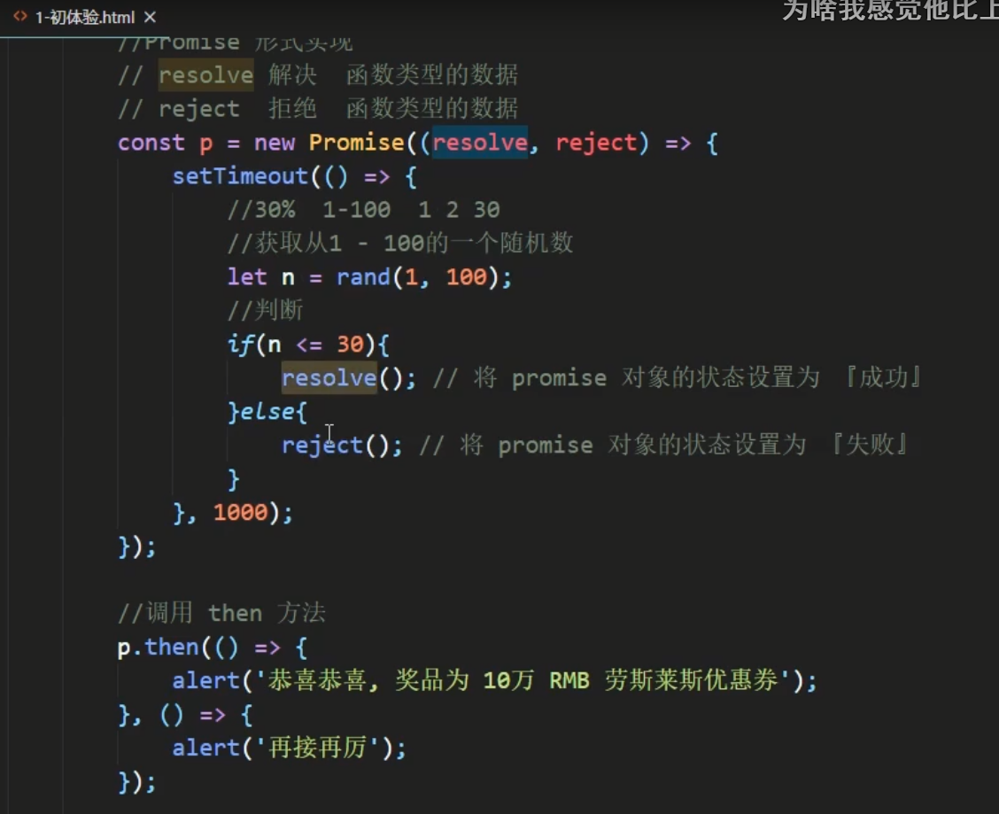

```js
//promise是为了，有类似网络请求这种时间久的操作的时候，开启异步任务单独处理网络请求，其他地方继续处理用户请求


//要实现异步操作的话，可以用ES6的promise特征

//Promise在创建的时候，参数是一个函数，这个函数里有两个参数，这两个参数也是函数
//参数是(resolve,reject)={要异步执行的操作}，这里用setTimeout模拟异步操作


//如果操作成功需要进行数据处理的话，在“要执行的异步操作”里，执行resolve函数，在promise对象后面加一个then()，
//这个then的参数也是函数，这个函数是你进行数据处理的操作，函数可以有参数，这个函数的参数是调用reject时的参数。

//如果是操作失败要打印错误信息的时候，在”要执行的异步操作里“执行reject函数，在promise后面加一个catch(),
//这个catch的参数也是函数，这个函数就是打印的操作

//成功和失败只会调用其一
new Promise((resolve, reject) => {
  setTimeout(()=>{
    //resolve('jzsp')
    reject('error')
  },1000)
}).then((data)=>{
  console.log(data);
}).catch(err=>{
  console.log(err);
})


//promise的第二种调用形式：then的参数是两个函数，前面的函数是调用resolve的时候回调的，后面的函数是调用reject的时候回调的
new Promise((resolve, reject) => {
  setTimeout(()=>{
    resolve('win');
    reject('lose');
  },8000)
}).then(
    (data)=>{console.log(data); },
    (err)=>{console.log(err); }
)
```

### promise的all方法

```js
//第二种就是用promise的all方法
//all方法的参数是一个可迭代对象，可以传入数组
//数组里面是promise对象
//只有当两个
Promise.all([
  new Promise((resolve, reject) => {
    setTimeout(()=>{
      resolve('1')
    },1000)
  }),
  new Promise((resolve, reject) => {
    setTimeout(()=>{
      resolve('2')
    },3000)
  })
]).then(results=>{
  //参数是   参数为数组的函数，这个数组是上面调用resolve的参数的数组
  console.log(results);
})
```

# Vuejs

## Vue初体验

### 0、引入vue

[CDN](https://cn.vuejs.org/v2/guide/installation.html#CDN)

对于制作原型或学习，你可以这样使用最新版本：

```
<script src="https://cdn.jsdelivr.net/npm/vue@2.6.14/dist/vue.js"></script>
```

对于生产环境，我们推荐链接到一个明确的版本号和构建文件，以避免新版本造成的不可预期的破坏：

```
<script src="https://cdn.jsdelivr.net/npm/vue@2.6.14"></script>
```

如果你使用原生 ES Modules，这里也有一个兼容 ES Module 的构建文件：

```
<script type="module">
  import Vue from 'https://cdn.jsdelivr.net/npm/vue@2.6.14/dist/vue.esm.browser.js'
</script>
```

你可以在 [cdn.jsdelivr.net/npm/vue](https://cdn.jsdelivr.net/npm/vue/) 浏览 NPM 包的源代码。

Vue 也可以在 [unpkg](https://unpkg.com/vue@2.6.14/dist/vue.js) 和 [cdnjs](https://cdnjs.cloudflare.com/ajax/libs/vue/2.6.14/vue.js) 上获取 (cdnjs 的版本更新可能略滞后)。

请确认了解[不同构建版本](https://cn.vuejs.org/v2/guide/installation.html#对不同构建版本的解释)并在你发布的站点中使用**生产环境版本**，把 `vue.js` 换成 `vue.min.js`。这是一个更小的构建，可以带来比开发环境下更快的速度体验。


### 1、Vue的生命周期


### 2、Vue的template

**有两种编写方式**

- 使用script标签，标记type为x-tempalte
- 使用template标签，设置id
- 在给Vue实例设置template的时候，以#开头，内部会执行querySelector

settings->editor->Live Templates->vue (abbreviation:vue ,define:html, 再将模板代码复制到下面的框template text)

使用的话就是对应的abbreviation + tab

```html
<div id = 'asd'>
    <h2></h2>
</div>

<script src = "../vue.js"></script>
<script>
  const obj ={

  }
  const app = new Vue({
    el:'#asd',
    data:obj
  })
</script>
```

## Vue基本指令

### 1、mustache语法

mustache可以通过双大括号获取vue实例里data中的对应属性名的属性值

```html
<div id = "asd">
  <h1>{{message}}</h1>
  <h2>{{message}},jzsp</h2>
  <!--message语法中，不仅仅可以直接写变量，也可以写简单的表达式-->
  <h2>{{message + firstname}}</h2>
  <h2>{{message}} {{firstname}}</h2>
  <h2>{{message  + ' ' +firstname}}</h2>
  <h2>{{count * 2}}</h2>
</div>
```

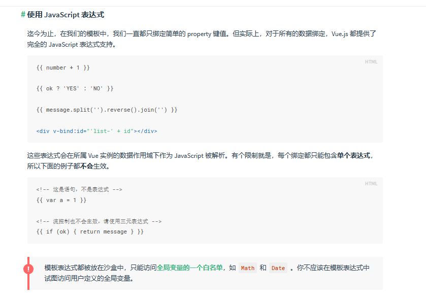

### 2、v-once语法（取消响应式）

在某个标签上使用了v-once的话，标签内部的所有内容都会取消响应式（包括用到了mustache语法的标签内的子节点）

```html
<!--
  加了v-once指令的，不会响应式运行，也就是说，改了内容，显示仍然是第一次运行时的状态
  用app.message = '1'发现下面的不会改变
-->
<div id = "asd">
  <h2>{{message}}</h2>
  <h2 v-once>{{message}}</h2>
</div>
```

### 3、v-html

如果**data中**有一个字符串：`'<div>123</div>'`，我们希望它以html的形式渲染而不是以字符串的形式渲染的话，我们就可以使用v-html

```html
<div id = "asd">

  <h2>{{url}}</h2>
  <h2 v-html="url"></h2>
</div>

<script src = "../vue.js"></script>
<script>
  //v-html代表该语句被认为是html语句而不是字符串语句
  const obj ={
    message: '你好啊',
    url:'<a href="http://www.baidu.com">百度一下</a>'
  }
  const app = new Vue({
    el:'#asd',
    data:obj
  })
</script>
```

### 4、v-pre

跳过编译过程，用于显示原来的双括号，

```html
<div id = "asd">
  <h2>{{message}}</h2>
  <h2 v-pre>{{message}}</h2>
</div>
<script src = "../vue.js"></script>
<script>
  //v-pre是输出原封不动的字符串，不需要进行解析（解析是
  const obj ={
    message: '你好啊'
  }
  const app = new Vue({
    el:'#asd',
    data:obj
  })
</script>
```

### 5、v-cloak  了解

防止出现`{{message}}`闪现成`Hello World`这种类似的情况。也就是解析完了才显示

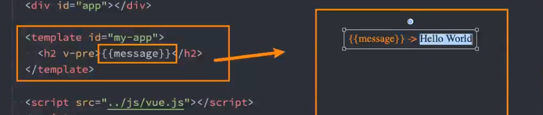

```html
<style>
    //属性选择器
    [v-cloak]{
        display: none;
    }
</style>


<div id = "asd">
  <h2 v-cloak>{{message}}</h2>
</div>

<script src = "../vue.js"></script>
<script>
  //setTimeout是延时作用，这里延时了1000ms也就是一秒
  //v-cloak是在没解析{{message}}的时候有该属性，解析之后v-cloak消失
  //有时候程序会出现这种情况：先显示{{message}}，在后面解析之后才替换message，但是如果解析卡住，页面会显示源代码{{message}}
  //可以使用style样式，如果有v-cloak属性的时候，什么都不显示，如果没有，也就是解析过后，自然会显示解析后的内容
  setTimeout(function (){
    const obj ={
      message: '你好啊'
    }
    const app = new Vue({
      el:'#asd',
      data:obj
    })
  },1000)
</script>
```

## Vue属性的动态绑定

### 1、v-bind基本使用

相当于是**属性里的mustache语法**

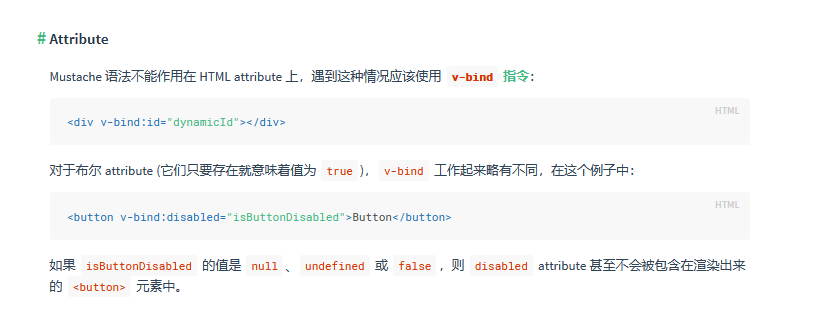

语法糖  **:**

```html

<div id = "asd">
  
  <a :href="asrc">百度一下</a>
</div>

<script src = "../vue.js"></script>
<script>
  //通常图片这类的src属性都是服务器动态获取的，不能写死，而src是属性，不能用{{}}，因为{{}}只能在内容里使用，
  //所以现在需要一种手段(v-bind)，让属性也可以动态解析，
  //v-bind就像是在属性里的mustache语法
  //v-bind有一个简写，也就是直接写:即可，<a :href="asrc">百度一下</a>
  const obj ={
    message: '你好啊',
    imgsrc:'https://dss1.bdstatic.com/70cFuXSh_Q1YnxGkpoWK1HF6hhy/it/u=3783641538,1182701865&fm=26&gp=0.jpg',
    asrc:'https://www.baidu.com/'
  }
  const app = new Vue({
    el:'#asd',
    data:obj
  })
</script>
```

### 2、v-bind绑定class

#### 对象语法

动态绑定的后面是对象，对象里是键值对，是key和value key是类名 value是布尔值，为true时表示class会加到对应的标签上，否则就不加

```html
<div id = "asd">
  <!--<h2 :class="{类名1:boolean,类名2:boolean}">{{message}}</h2>-->

  <!-- 一种是class绑定类，一种是class绑定方法，第二种看上去更简洁-->
  <h2 :class="{active:isactive,line:isline}">{{message}}</h2>
  <h2 :class="getclass()">{{message}}</h2>

  <!-- v-on的缩写 -->
  <button @click="change">1</button>
</div>

<script src = "../vue.js"></script>
<script>
  //这里是用v-bind动态绑定了class,而class的{}里是类，里面是一些键值对，key是类名，value是boolean
  //如果value是true，那么该类会加到class里，否则就不加入
  //class里的value部分是被动态绑定的，具有响应式的性质
    
  //这里实现了用button监听click事件，每次点击button，会将isactive取反，实现的效果是style样式会根据isactive的boolean值决定是否加入class
  //<h2 class="jzsp" :class="{active:isactive,line:isline}">{{message}}</h2>可以许多class同时存在，最后会自动叠加

  const obj ={
    message: '你好啊',
    isactive:true,
    isline:false
  }
  const app = new Vue({
    el:'#asd',
    data:obj,
    methods:{
      change:function ()
      {
        this.isactive=!this.isactive
      },
      getclass:function ()
      {
        return {active:this.isactive,line:this.isline}
      }
    }
  })
</script>
```

#### 数组语法（用的较少）

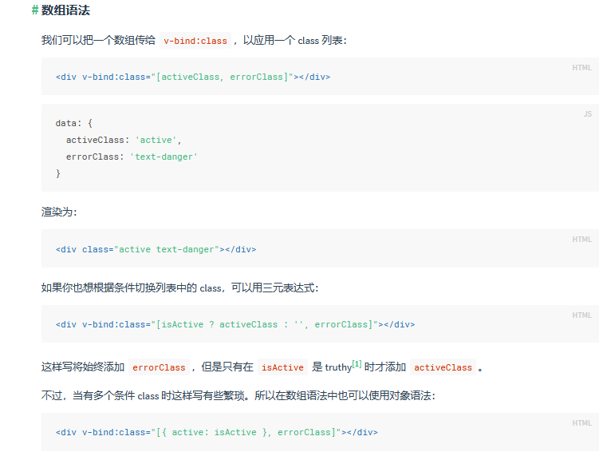

数组中是类名字符串

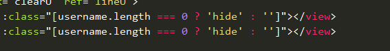

```html
<div id = "asd">
  <h2 :class="[active,line]">{{message}}</h2>
  <h2 :class="getclass()">{{message}}</h2>
</div>

<script src = "../vue.js"></script>
<script>
  const obj ={
    message: '你好啊',
    active:'as11d',
    line:'as22d'
  }
  const app = new Vue({
    el:'#asd',
    data:obj,
    methods:{
      getclass:function ()
      {
        return [this.active,this.line];
      }
    }
  })
</script>
```


给组件绑定class

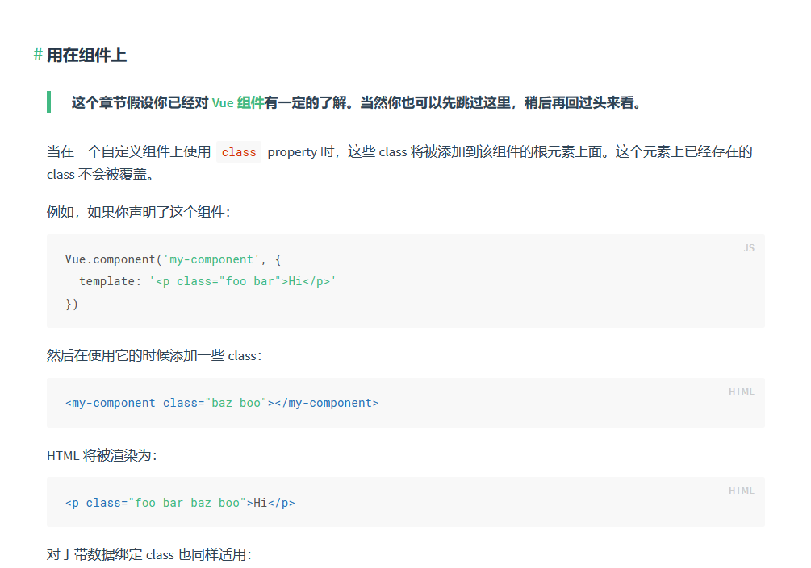

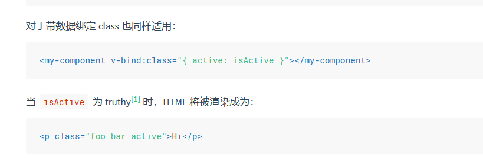

### 3、v-bind绑定style

#### 对象语法

key(css属性名)：value(css属性值）

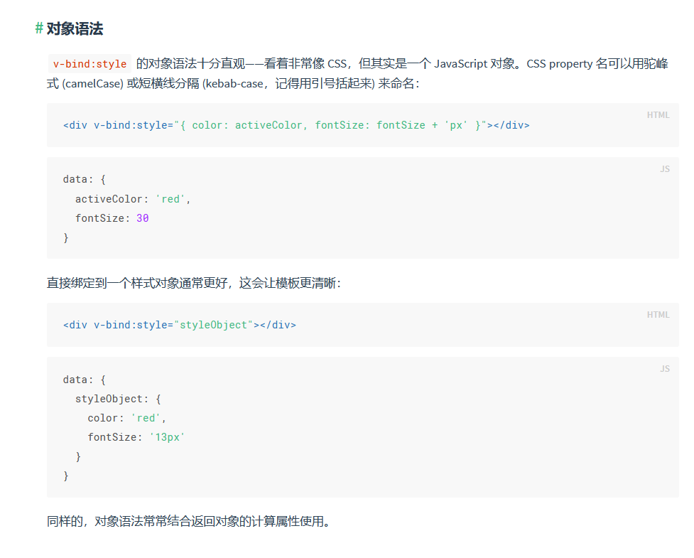

```html
<div id = "asd">
  <!--
  <h2 :style="{key(css属性名)：value(css属性值)}"></h2>
  属性值按照样式的写法本来是不需要加单引号的，但是如果不加的话，vue的语法会把他当成变量，在下面data里找不到的时候就会报错
  所以value如果不是data里引用进去的，而是具体的值， 就要加单引号
  通过网页查看代码可知，单引号在后面会被解析，成功显示要达到的效果
  网页里单引号消失了font-size: 50px;
  -->
  <h2 :style="{fontSize: '50px'}">{{message }}</h2>


  <!--不加单引号就是变量，会在data里面找到并且引用，但是引用的对象的值还是得加单引号-->
  <h2 :style="{fontSize: size, color:coloe}">{{message }}</h2>
  <!--int类型和字符串类型相加，会转化成字符串拼接-->
  <h2 :style="{fontSize: size2+'px'}">{{message }}</h2>
</div>

<script src = "../vue.js"></script>
<script>
  const obj ={
    message: '你好啊',
    size: '100px',
    size2:100,
    coloe:'red'
  }
  const app = new Vue({
    el:'#asd',
    data:obj
  })
</script>
```

#### 数组语法（对象数组）

```html
<div id = "asd">
  <h2 :style="[fontsize,color]">{{message}}</h2>
</div>

<script src = "../vue.js"></script>
<script>
  const obj ={
    message: '你好啊',
    fontsize:{fontSize:'100px'},
    color:{color:'red'}
  }
  const app = new Vue({
    el:'#asd',
    data:obj
  })
</script>
```

#### 多重值（用于浏览器适配？）

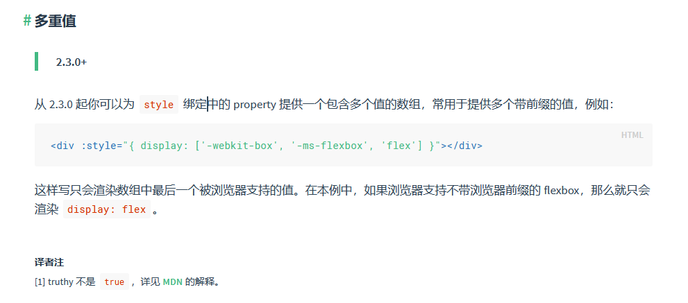

### 4、v-bind绑定属性名

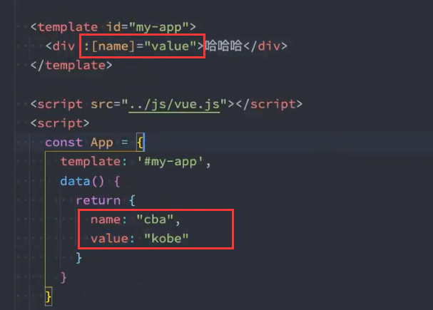

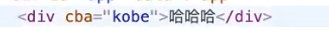

### 5、v-bind绑定一个对象（封装组件的时候很好用）

如果绑定一个对象的话，会将key作为属性名，value作为属性值，解析到标签中

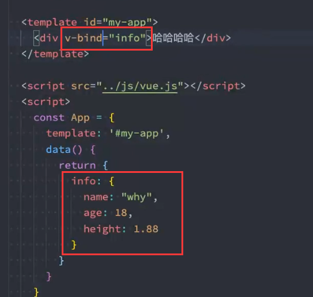


## Vue计算属性computed

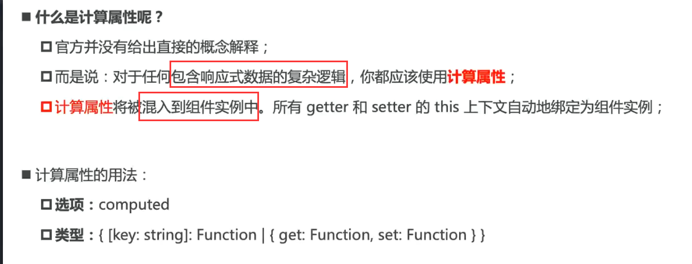

### 1、基本使用

```html
<div id = "asd">
  <h2>{{firstname}}   {{lastname}}</h2>
  <h2>{{getname()}}</h2>
  <h2>{{fullname}}</h2>
</div>

<script src = "../vue.js"></script>
<script>
  const obj ={
    firstname:'cobe',
    lastname:'jzsp'
  }

  const app = new Vue({
    el:'#asd',
    data:obj,
    //计算属性使用的时候不需要加小括号
    computed:{
      fullname:function (){
        return this.firstname+' '+this.lastname
      }
    },
    methods:{
      getname:function ()
      {
        return this.firstname+' '+this.lastname
      }
    }
  })
</script>
```

### 2、计算属性的复杂操作

```html
<div id = "asd">
    <h2>总价格 :{{books[0].price+books[1].price+books[2].price+books[3].price}}</h2>
    <h2>总价格 :{{count()}}</h2>
    <h2>总价格 :{{totalprice}}</h2>
</div>

<script src = "../vue.js"></script>
<script>
  const obj ={
    books:[
      {id:1101,name:'Unix编程艺术',price:119},
      {id:1102,name:'代码大全',price:112},
      {id:1103,name:'现代操作系统',price:129},
      {id:1104,name:'深入理解计算机原理',price:113}
    ]
  }
  const app = new Vue({
    el:'#asd',
    data:obj,
    computed:{
      //filter,map,reduce
      totalprice:function ()
      {
        //let是变量,下面介绍三种不同的语法

        let result = 0;
        for (let i = 0; i <this.books.length ; i++) {
          result=result+this.books[i].price;
        }
        let result1 = 0;

        //这个方法其实和let...i差不多
        for (let booksKey in this.books) {
          result1=result1+this.books[booksKey].price;
        }

        //books是取出了对应的数组元素，可以用.引用出对应的属性
        let result2=0
        for (const book of this.books) {
          result2=result2+book.price;
        }
        return result2;
      }
    },
    methods:{
      count:function (){
        return this.books[0].price+this.books[1].price+this.books[2].price+this.books[3].price
      }
    }
  })
</script>
```

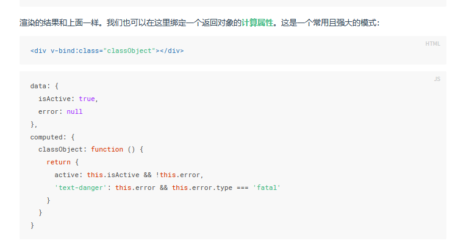

### 3、计算属性的setter和getter

源码中会对key进行判断，判断是函数还是对象，如果是函数的话，就会默认这个函数是get方法

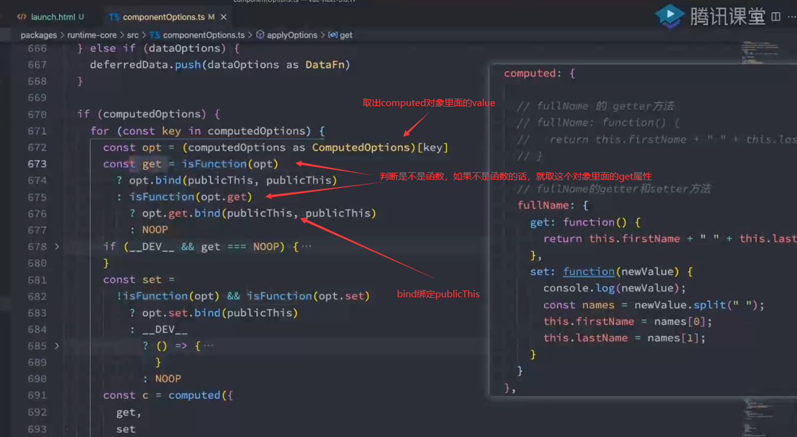

因为在用mustache语法的时候回调用里面的get方法，所以不需要用小括号

```html
<div id = "asd">
    <h2>{{fullname}}</h2>
</div>

<script src = "../vue.js"></script>
<script>
  const obj ={
    firstname:'w',
    lastname:'jj'
  }
  const app = new Vue({
    el:'#asd',
    data:obj,
    /*
    下面展示计算属性的正确写法
    在上面用mustache语法的时候会默认调用get方法
    在网页控制到修改值，例如app.fullname=‘xxxxx'的时候会调用set方法
    
    set方法内的newValue是传入的值
    注意，99%的情况下是用不到set方法的，所以一般都用之前的写法computed:{
    computed:{
      fullname:function (){
        return this.firstname+' '+this.lastname
      }
    },
    因为在mustache语法的时候会调用get方法，所以不需要加小括号，直接当属性使用就可以了
    */
    computed:{
      fullname:{
        //属性一般是没有set方法的，只读属性
        get:function ()
        {
          return this.firstname+' '+this.lastname
        },
        set:function (newValue)
        {
          const names = newValue.split(' ');
          this.firstname=names[0];
          this.lastname=names[1];
        }
      }
    }
  })
</script>
```

### 4、计算属性的缓存（和methods的对比）

```html
<div id = "asd">
    <h2>{{getname()}}</h2>
    <h2>{{getname()}}</h2>
    <h2>{{getname()}}</h2>
    <h2>{{getname()}}</h2>
    <h2>{{getname()}}</h2>
    
    <h2>{{fullname}}</h2>
    <h2>{{fullname}}</h2>
    <h2>{{fullname}}</h2>
    <h2>{{fullname}}</h2>
    <h2>{{fullname}}</h2>

</div>

<script src = "../vue.js"></script>
<script>
  //在console中可以发现，getname输出了五次，而fullname只输出了一次
  //因此，methods和computed的差别是，computed内部有缓存，结果不变的时候只调用一次，从缓存中取数据，因此效率更高
  //在多次执行相同结果的操作时，使用计算属性更好
  const obj ={
    firstname:'jzsp',
    lastname:'aaaa'
  }
  const app = new Vue({
    el:'#asd',
    data:obj,
    methods:{
      getname:function (){
        console.log('getname');
        return this.firstname+' '+this.lastname;
      }
    },
    computed:{
      fullname:function()
      {
        console.log('fullname');
        return this.firstname+' '+this.lastname;
      }
    }
  })
</script>
```

## Vue事件监听v-on

### 1、基本使用

语法糖@    但是为什么不加小括号呢

```html
<div id = "asd">
  <h2>{{counter}}</h2>
  <button v-on:click="add">+</button>
  <button v-on:click="sub">-</button>


  <button @click="add">+</button>
  <button @click="sub">-</button>


</div>

<script src = "../vue.js"></script>
<script>
  const obj ={
     counter:0
  }
  const app = new Vue({
    el:'#asd',
    data:obj,
    methods:{
      add(){
        this.counter++;
      },
      sub(){
        this.counter--;
      }
    }
  })
</script>
```

### 2、v-on的参数问题

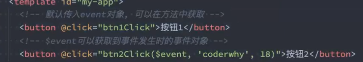

### 3、v-on的修饰符

- stop取消事件冒泡
- prevent取消默认事件（例如submit）
- {keycode}监听对应键的触发
- once也就是只一次生效

```html
<div id = "asd">
    <!--
        1,如果没有加.stop修饰符，那么点击按钮的时候会先执行btnclick再执行divclick
        这个称为事件冒泡
        加了stop之后，点按钮就不会继续执行外围包括的方法了
        本质上是调用了event.stopPropagation()方法阻止事件冒泡
    -->
    <div @click="divclick">
      aaa
      <button @click.stop="btnclick">按钮</button>
    </div>

  <br>
  <!--
      2.prevent
      平时如果不加上监听，直接点input按钮，就会把数据提交给服务器，
      但是现在希望，点击按钮不提交，写一个click监听这个按钮完成其他操作，到时候自己写一些代码完成提交操作
      这个叫做取消默认事件，本质上是调用了event.preventDefault()方法
  -->
  <form action="baidu">

    <input type="submit" value="提交" @click.prevent="submitclick">
  </form>


  <!--
      3，监听键盘上某个键的点击,keyup指的是，按下键盘并且松开时执行
      如果希望只监听某个按键，例如回车，只需要在后面加.enter
  -->
  <input type="text" @keyup.enter="keyup">


  <!--
      4.once
      只希望用户点第一次的时候有反应，后面就无效
  -->
  <button @click.once="btnclick">asd</button>
</div>

<script src = "../vue.js"></script>
<script>
  const obj ={

  }
  const app = new Vue({
    el:'#asd',
    data:obj,
    methods:{
      btnclick(){
        console.log("btnclick");
      },
      divclick(){
        console.log('divclick');
      },
      submitclick(){
        console.log('submitclick');
      },
      keyup(){
        console.log('keyup');
      }
    }

  })
</script>
```

### 4、v-on绑定一个对象

这样可以一次性绑定多种事件

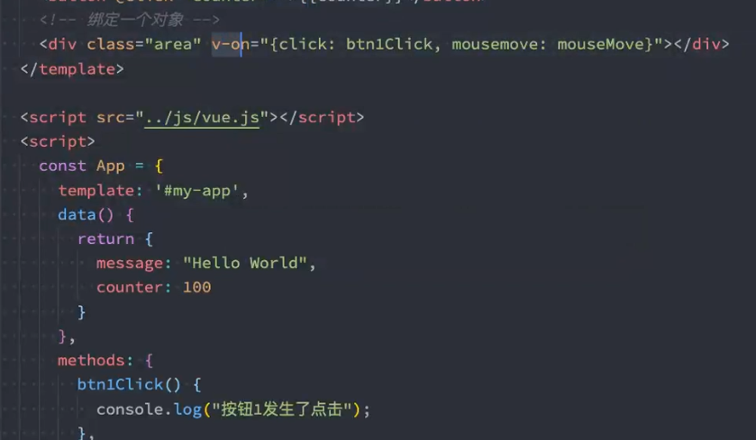

## Vue条件判断v-if

### 1、v-if和v-else的使用

```html
<div id = "asd">
  <h2 v-if="isshow">
    <div>aaa</div>
    <div>aaa</div>
    <div>aaa</div>
    <div>aaa</div>
    <div>aaa</div>
    <div>aaa</div>
    {{message}}
  </h2>
  <h1 v-else>isshow为false的时候显示我</h1>
</div>

<script src = "../vue.js"></script>
<script>
  const obj ={
    message:'jzsp',
    isshow:false
  }
  const app = new Vue({
    el:'#asd',
    data:obj
  })
</script>
```

### 2、v-else-if的使用（用的不多，不如用computed）

```html
<div id = "asd">
    <h2 v-if="score>90">优秀</h2>
    <h2 v-else-if="score>80">良好</h2>
    <h2 v-else-if="score>60">及格</h2>
    <h2 v-else>不及格</h2>

    <h1>{{result}}</h1>
</div>

<script src = "../vue.js"></script>
<script>
  const obj ={ 
    score:99
  }
  const app = new Vue({
    el:'#asd',
    data:obj,
    computed:{
      result(){
        let showmessage = '';
        if(this.score>90)
          showmessage='优秀';
        else if (this.score>80)
          showmessage='良好';
        else if (this.score>60)
          showmessage='及格';
        else
          showmessage='不及格';
      return showmessage;
      }
    }
  })
</script>
```

### 3、登录切换的小案例代码

```html
<div id = "asd">

  <!--
  说明，for是当你点击label的时候会令for指向的组件处于被“聚焦”的状态，指向文本就是光标移到文本
       placeholder是框内灰色提示字
       提示：请使用 <span> 来组合行内元素，以便通过样式来格式化它们。
       注释：span 没有固定的格式表现。当对它应用样式时，它才会产生视觉上的变化。
  -->
    <span v-if="isUser">
      <label for="username">用户账号</label>
      <input type="text" id="username" placeholder="用户账号">
    </span>

    <span v-else>
      <label for="email">用户邮箱</label>
      <input type="text" id="email" placeholder="用户邮箱">
    </span>


    <button @click="isUser = !isUser">切换类型</button>
    <button @click="change">切换类型</button>
</div>

<script src = "../vue.js"></script>
<script>
  const obj ={
    isUser:true
  }
  const app = new Vue({
    el:'#asd',
    data:obj,
    methods:{
      change(){
        this.isUser = !this.isUser;
        return this.isUser;
      }
    }
  })
</script>
```

### 4、虚拟Dom提高效率而直接复用

解决方案就是加一个key，key不一样就不会复用

```html
<div id = "asd">

  <!--
  小问题：在input输入一些东西的时候突然想转换成另一个（用户邮箱）形式输入，但是转换之后之前输入的东西还在输入框里
  问题解答：这是因为vue在运行DOM渲染的时候，出于性能考虑，会尽可能的复用已经存在的元素而不是重新创建新的元素
        在复用的时候会修改对应的属性（例如id和placeholder），但是用户输入的东西不属于属性，所以不会修改，仍然在上面显示
  解决方案：加一个key属性，如果key相同，说明可以复用，如果key不同，说明不需要复用
  -->
    <span v-if="isUser" key="asd">
      <label for="username">用户账号</label>
      <input type="text" id="username" placeholder="用户账号" key="abc">
    </span>

    <span v-else key="asdasd">
      <label for="email">用户邮箱</label>
      <input type="text" id="email" placeholder="用户邮箱" key="jzsp">
    </span>


    <button @click="isUser = !isUser">切换类型</button>
    <button @click="change">切换类型</button>
</div>

<script src = "../vue.js"></script>
<script>
  const obj ={
    isUser:true
  }
  const app = new Vue({
    el:'#asd',
    data:obj,
    methods:{
      change(){
        this.isUser = !this.isUser;
        return this.isUser;
      }
    }
  })
</script>
```

### 5、v-show和v-if的区别

v-if在dom后台直接删除，v-show是只会添加display：none

如何选择呢？当在显示和不显示之间频繁切换的时候，用v-show，否则用v-if

```html
<div id = "asd">
  <!--
  会发现，v-if不满足条件的时候，这个dom在后台是直接没有的
  但是v-show不满足条件的时候，会添加样式display：none


  当需要在显示和隐藏之间切换很频繁的时候，使用v-show
  只有一次切换的时候使用v-if
  -->
    <h2 v-if="isshow" id="jzsp1">jzsp</h2>
    <h2 v-show="isshow" id="jzsp2">jzsp</h2>
</div>

<script src = "../vue.js"></script>
<script>
  const obj ={
    isshow:true
  }
  const app = new Vue({
    el:'#asd',
    data:obj
  })
</script>
```

### 6、template结合v-if使用

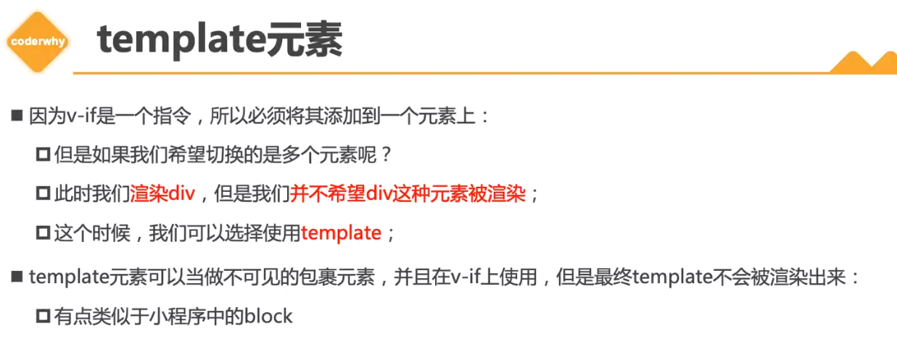

平时是在外面套div，然后v-if的。但是会多解析一层div。用template的话，**template最终是不会被解析为dom的**。

> 注意，v-show是不能和tempalte结合使用的

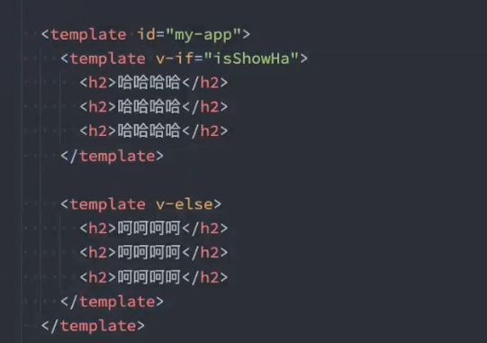

## Vue循环遍历v-for

### 1、v-for遍历数组

```html
<div id = "asd">
  <!--在遍历的过程中没有使用索引值-->
  <ul>
    <li v-for="item in names">{{item}}</li>
  </ul>

  <!--在遍历的过程中使用索引值(index不加一的话会从0开始-->
  <ul>
    <li v-for="(item,index) in names">{{index+1}} {{item}}</li>
  </ul>
</div>
```

### 2、v-for遍历对象

```html
<div id = "asd">
    <ul>
      <!--在遍历对象的时候如果只获取一个值，那么获取到的是value-->
      <li v-for="item in info">{{item}}</li>
    </ul>

  <ul>
    <!--获取两个值的话，是value在前key在后-->
    <li v-for="(value,key) in info">{{value}}  --- {{key}}</li>
  </ul>

  <ul>
    <!--获取三个值的话，额外获取index-->
    <li v-for="(value,key,index) in info">{{index}}---{{value}}---{{key}}</li>
  </ul>
</div>

<script src = "../vue.js"></script>
<script>
  const obj ={
    info:{
      name:'jzsp',
      age:20,
      height:1.80
    }
  }
  const app = new Vue({
    el:'#asd',
    data:obj
  })
</script>
```

### 3、v-for加key属性

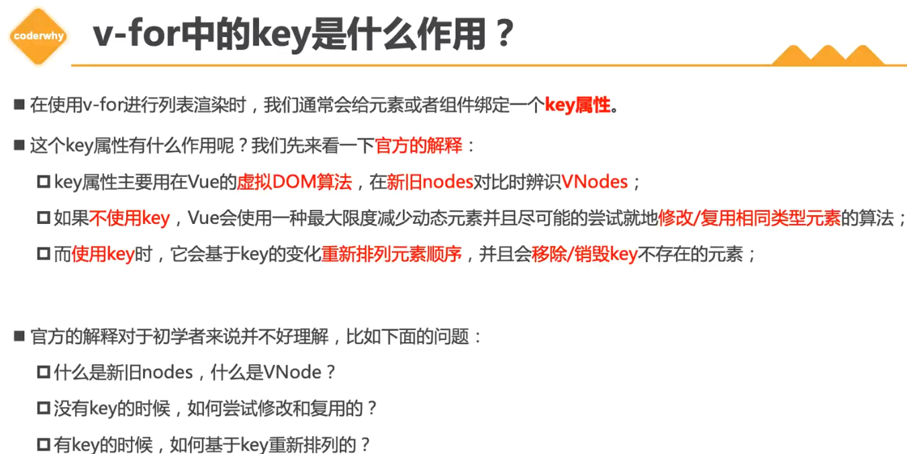

#### VNode

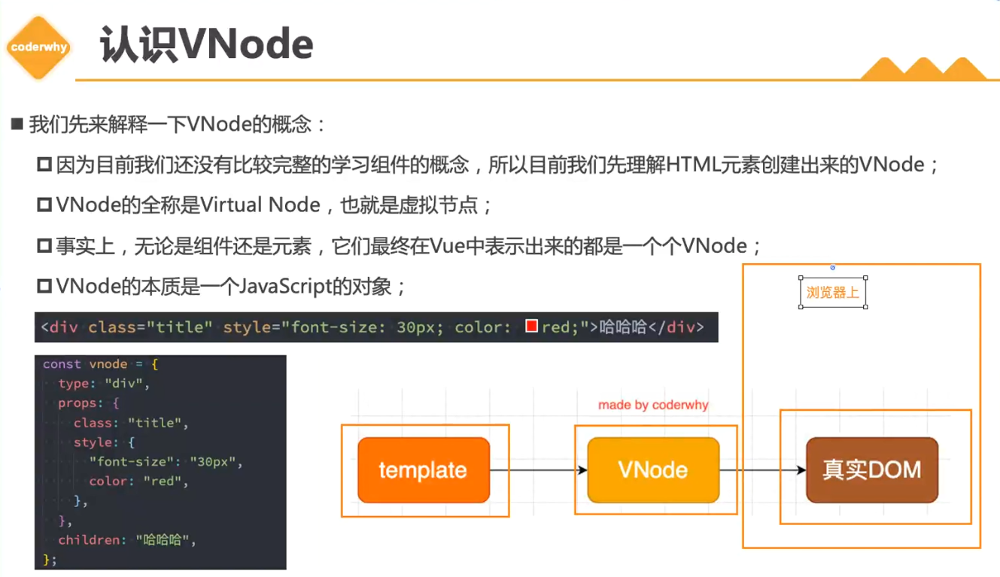

#### 虚拟dom

> 虚拟dom的最大优势是可以实现跨平台

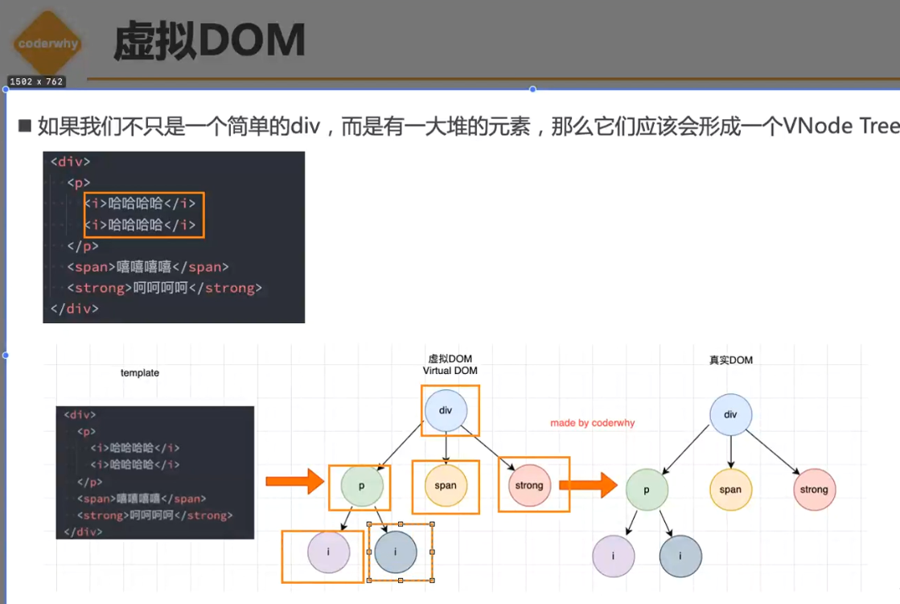

#### 案例

```html
<!--
  在控制台输入 ： app.letters.splice(2,0,F);
  参数解析：第一个参数是下标，第二个参数是要往后删除几个元素，第三个元素是插入的字符串
-->
<div id = "asd">
    <!--
        不加上key属性的时候，如果要在C和D之间放一个F，
        他的做法是，吧D变成F，吧E变成D，在后面加一个E，这样效率很低
    -->
    <ul>
      <li v-for="item in letters">{{item}}</li>
    </ul>

    <!--
        加了key之后，是会让key和item一一对应，找到正确位置并且插入新的节点
        注意：key不能用index，因为在中间插入节点的时候，index会发生变化
        key的作用是一一对应，可以提高更新虚拟dom的效率
    -->
    <ul>
      <li v-for="item in letters" :key="item">{{item}}</li>
    </ul>
</div>

<script src = "../vue.js"></script>
<script>
  const obj ={
    letters:['A','B','C','D','E']
  }
  const app = new Vue({
    el:'#asd',
    data:obj
  })
</script>
```

**先进行是否有key的判断**

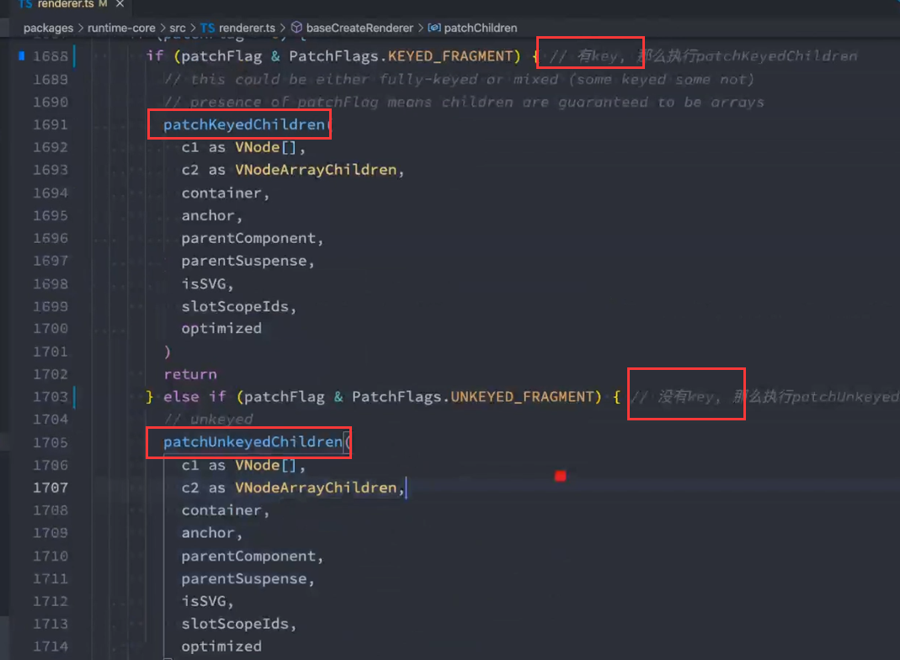

**patch函数**

n1和n2都有值的时候是更新操作，n1为null的时候是挂载（新增）操作

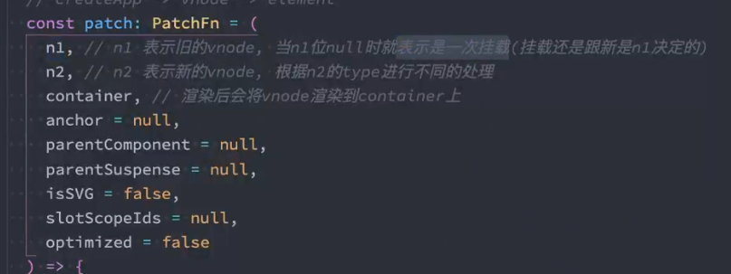

##### 没有key时Vue执行的操作（3步）

> 尽可能的修改和复用原来的节点

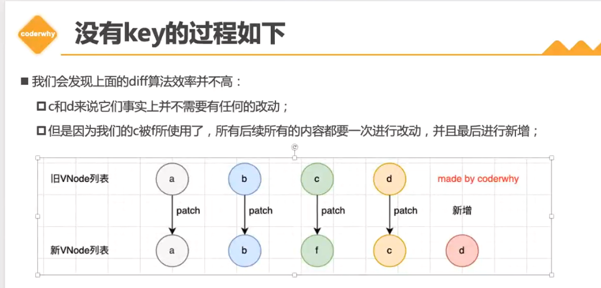


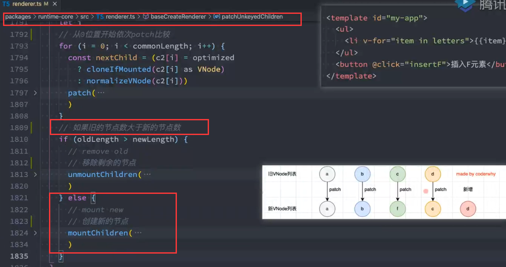 

##### 有key时执行的操作（5步）

会基于key的变化重新排列元素顺序，并且会移除/销毁key不存在的元素

- n1和n2是取出的节点，在patch比较之前会进行判断。先从前往后遍历，直到遇到不同结点退出while循环	

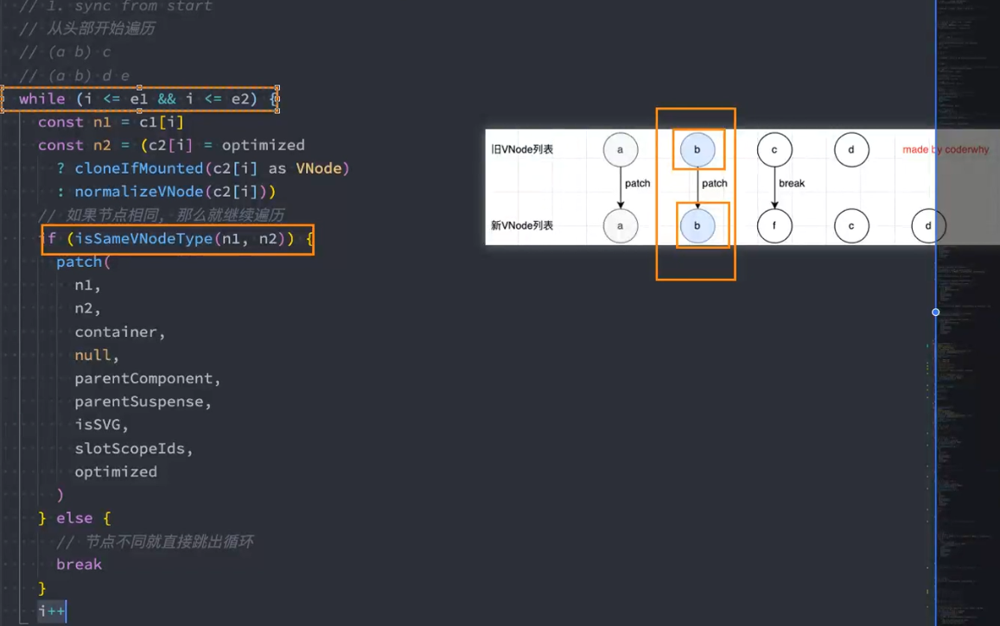

isSameVNodeType判断节点是否相同，根据类型和key判断

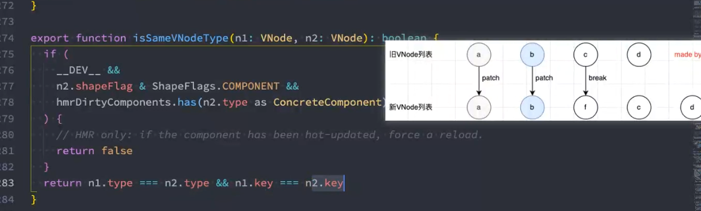

- 第一次循环退出之后，再次从尾部开始遍历

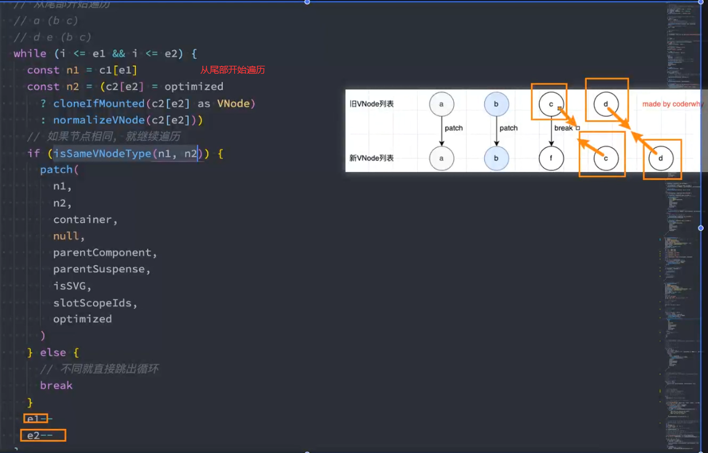

- 循环结束的时候进行判断，如果是**新节点更多，也就是对原来的结点进行插入操作**，会进入下面的判断，新增多余的新节点。

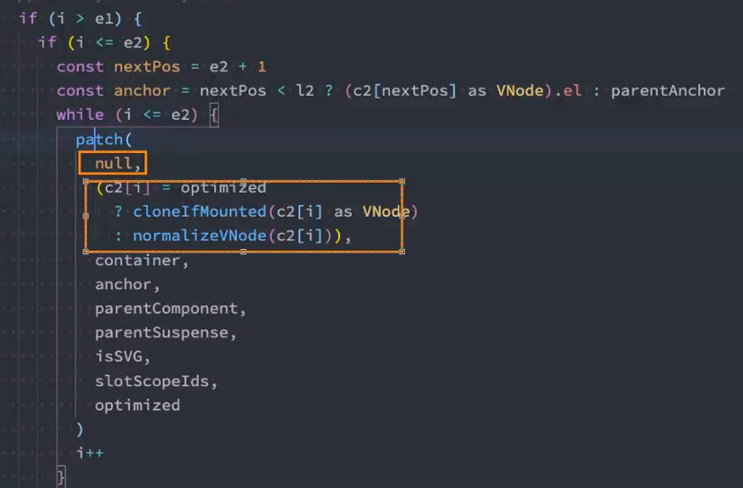

- 如果是旧结点更多，也就是对原来的结点进行删除操作，会进入下面的判断，移除多余的旧结点。


- 如果新旧结点一样多，但是中间这一段是无序的话，会尽可能的利用可以复用的节点。

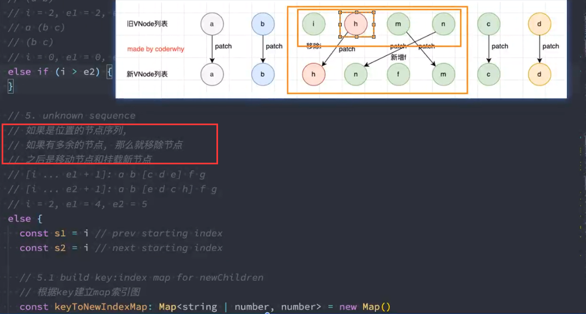

### 4、vue中响应式的数组方法

```html
<div id = "asd">
    <ul>
      <li v-for="item in letters" key="item">{{item}}</li>
    </ul>
  <button @click="btnclick">btn</button>
</div>

<script src = "../vue.js"></script>
<script>
  const obj ={
    letters:['a','b','c','d','e']
  }
  const app = new Vue({
    el:'#asd',
    data:obj,
    methods:{
      btnclick(){
        //1:push √  往数组最后加元素
        //this.letters.push('f','g','h');

        //2:pop  √   删除数组最后一个元素
        //this.letters.pop();

        //3:shift √  删除数组第一个元素
        //this.letters.shift();

        //4:unshift √ 在数组最前面添加元素
        //this.letters.unshift('aaa','bbb');

        //5:splice() √
        //删除元素 splice(begin,length,'');
        //插入元素 splice(begin,0,'element');
        //替换元素 splice(begin,length,'elements');

        //6:sort() √
        //排序
        this.letters.sort();

        //7:reverse() √
        //反转
        this.letters.reverse();

        //8通过索引值修改数组中的元素  × 这个不是响应式的
        this.letters[0]='bbbbbb';

        //9可以用Vue内部的函数来实现修改
        //set（要修改的数组，下标，修改值）
        //set（要修改的对象，key字符串，修改值）
        //delete同理
        Vue.set(this.letters,0,'bbbbb');
        Vue.delete(this.letters,0);
        

      }
    }
  })

  function sum(...num){
    console.log(num);
  }
  sum(1,2,3,4,5,6,78,9,);
</script>
```

### 5、v-bind和v-for小作业

```html
<head>
  <meta charset="UTF-8">
  <title>Title</title>
  <style>
    .active{
        color:red;
    }
  </style>
</head>
<body>

<!-- 作业需求，点击列表中的哪一项，那么该文字就变成红色
     复习：动态绑定class的时候，如果是绑定的对象，那么内容是key和value，key是类名，value是boolean值
     当value为true的时候这个类才会加入class

     要想实现，点对应的内容让对应的内容变成红色，还需要设置监听事件，传入参数修改currentclick
-->
<div id = "asd">
  <ul>
    <li v-for="(item,index) in movies"
    :class="{active:index==currentindex}"
    @click="liclick(index)"
    >
      {{index}} {{item}}</li>
  </ul>
</div>

<script src = "../vue.js"></script>
<script>
  const obj ={
    movies:['1','2','3','4'],
    currentindex:0
  }
  const app = new Vue({
    el:'#asd',
    data:obj,
    methods:{
      liclick(index){
        this.currentindex=index;
      }
    }
  })
</script>
```

### 6、购物车案例（内涵过滤器）

#### js部分

```js
const app=new Vue({
  el:'#app',
  data:{
    books:[{
      id:1,
      name:'《算法导论》',
      date:'2006-9',
      price:85.00,
      count:1
    },{
      id:2,
      name:'《UNIX编程艺术》',
      date:'2006-2',
      price:59.00,
      count:1
    },{
      id:3,
      name:'《编出珠玑》',
      date:'2008-10',
      price:39.00,
      count:1
    },{
      id:4,
      name:'《代码大全》',
      date:'2006-3',
      price:128.00,
      count:1
    }
    ]
  },
  methods:{
    getFinalPrice(price){
      return price.toFixed(2)+'元';
    },
    add(index){
      this.books[index].count++;
    },
    sub(index){
      if(this.books[index].count>0)
      this.books[index].count--;
      else
        this.books[index].count=0;
      /*
      或者可以给btn动态绑定disabled属性，当item.count<=1的时候就失效
      v-bind:disabled="item.count<=1"
      */
    },
    remove(index){
      this.books.splice(index,1);
    }
  },
  computed:{
    totalPrice(){
      let sum = 0;
      for (let i = 0; i < this.books.length; i++) {
        sum=sum+this.books[i].count*this.books[i].price;
      }

      /*
      for (let book of this.books) {
        sum=sum+book.price*book.count;
      }
      */

      /*
      使用js高阶函数的话可以用reduce对数组进行整合
      return this.books.reduce(function(prevalue,book){
        return prevalue+book.price;
      },0);
      */
      return sum;
    }
  },
  /*
  过滤器
  用竖线分割，前面的是参数，后面的是过滤器名，过滤器会传入前面的参数。
  */

  filters:{
    showPrice(price){
      return price.toFixed(2)+'元';
    }
  }
})
```

#### html部分

```html
<!DOCTYPE html>
<html lang="en">
<head>
  <meta charset="UTF-8">
  <title>Title</title>
  <link rel="stylesheet" href="3.css">
</head>
<body>
<!--
1：引入样式的话在head里加入link语句：rel规定当前文档与被链接文档之间的关系，href是被链接文档的位置。
2：如何在显示的时候保留两位小数xxx.toFixed(2);
3：这里的tr和th 就相当于列表里的ul和li
4：动态绑定disabled是根据布尔值来决定这个组件是否生效

-->
<div id="app">

  <div v-if="books.length>0">
    <table>
      <thead>
      <tr>
        <th></th>
        <th>书籍名称</th>
        <th>出版日期</th>
        <th>价格</th>
        <th>购买数量</th>
        <th>操作</th>
      </tr>
      </thead>

      <tbody>
      <tr v-for="(item,index) in books">
        <!--
        <th v-for="value in item">{{value}}</th>
        这里不建议遍历对象内的键值对，因为某些列存在特殊的操作
        -->
        <td>{{item.id}}</td>
        <td>{{item.name}}</td>
        <td>{{item.date}}</td>
        <!--<td>{{item.price.toFixed(2)}}</td>-->
        <!--<td>{{getFinalPrice(item.price)}}</td>-->
        <!--过滤器写法-->
        <td>{{item.price|showPrice}}</td>

        <td>
        <!--动态绑定相当于是属性里的mustache语法-->
          <button @click="sub(index)" v-bind:disabled="item.count<=1">-</button>
          {{item.count}}
          <button @click="add(index)">+</button>
        </td>
        <td>
          <button @click="remove(index)">移除</button></td>
      </tr>
      </tbody>
    </table>
    <h2>总价格为：{{totalPrice}}</h2>
  </div>


  <div v-else>
    <h2>购物车为空</h2>
  </div>

</div>

顺序不能乱
<script src = "../vue.js"></script>
<script src="1.js"></script>
</body>
</html>
```

#### css部分

```css
table{
    border:1px solid #e9e9e9;
    border-collapse: collapse;
    border-spacing: 0;
}
th,td{
    padding: 8px 16px;
    border: 1px solid #e9e9e9;
    text-align: left;
}
th{
    background-color: #f7f7f7;
    color: #5c6b77;
    font-weight: 600;
}
```

### 7、v-for结合template使用

如果一大部分内容想同时使用v-for，本来是外面套一层div，但是这样会导致多渲染div这个元素，造成浪费。可以结合tempalte来使用v-for，因为template是不会被渲染的

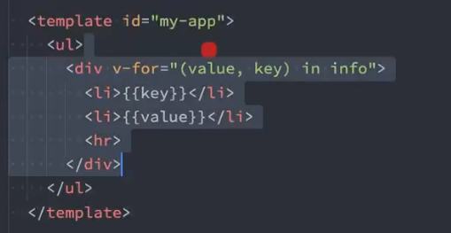

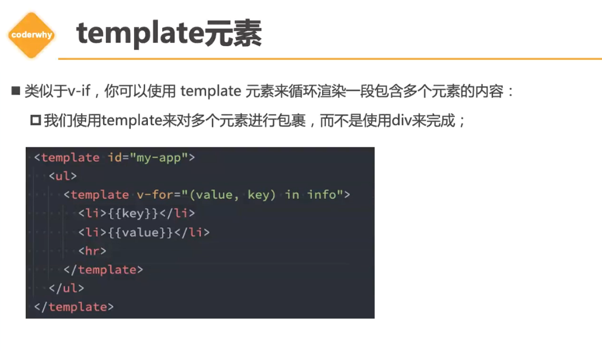	

## Vue表单绑定v-model

###  原理

```html
<div id = "asd">
<!--  <input type="text" v-model="message">-->
  <input type="text" :value="message" @input="change">
  <input type="text" :value="message" @input="message = $event.target.value">
  <h2>{{message}}</h2>
</div>

<script src = "../vue.js"></script>
<script>
  //v-model实际上是一个语法糖，她背后包含了两个操作，1：v-bind绑定value属性，2：v-on给元素绑定input事件
  //v-bind 是为了在message修改的时候修改value，v-on是为了input输入的时候因为实时修改value而实时修改message
  const obj ={
    message:'jzsp'
  }
  const app = new Vue({
    el:'#asd',
    data:obj,
    methods:{
      change(event){
        this.message=event.target.value;
      }
    }
  })
</script>
```

### v-model结合radio单选框

```html
<div id = "asd">
  <label for="male">
    <input type="radio" id="male" value="男" v-model="sex">男
  </label>
<!--用了v-model之后就不用name让他们互斥了-->
  <label for="female">
    <input type="radio" id="female" value="女" v-model="sex">女
  </label>

  <h2>您选择的性别是:{{sex}}</h2>
</div>

<script src = "../vue.js"></script>
<script>
  //如果不用v-model的话，要多一个值一样的name属性这两个选项才会互斥（只能选择其一）
  //如果给sex赋初值，可以达到默认选择其中一个的效果
  //v-model是双向绑定，sex变了，input变，input的变了，sex变
  const obj ={
    sex:''
  }
  const app = new Vue({
    el:'#asd',
    data:obj
  })
</script>
```

### v-model结合checkbox多选框

```html
<div id = "asd">
  <!--checkbox单选框-->
  <label for="agree">
    <input type="checkbox" id="agree" v-model="isAgree">同意协议
  </label>
  <h2>您选择的是{{isAgree}}</h2>
  <button :disabled="!isAgree">下一步</button>

  <!--多选的话用数组存-->
  <input type="checkbox" value="篮球" v-model="hobbies">篮球
  <input type="checkbox" value="足球" v-model="hobbies">足球
  <input type="checkbox" value="乒乓球" v-model="hobbies">乒乓球
  <input type="checkbox" value="羽毛球" v-model="hobbies">羽毛球
  <h2>您的爱好是：{{hobbies}}</h2>

  <!--值绑定，value值不要写死，通过v-for循环，动态绑定-->
  <label for="" v-for="item in originHobbies">
    <input type="checkbox" :value="item" id="item" v-model="hobbies">{{item}}
  </label>
</div>

<script src = "../vue.js"></script>
<script>
  const obj ={
    isAgree : false,
    hobbies:[],
    originHobbies:['篮球','足球','乒乓球','羽毛球']
  }
  const app = new Vue({
    el:'#asd',
    data:obj
  })
</script>
```

### v-model和select结合使用

```html
<div id = "asd">
    <!--选择一个-->
  <select name="abc" id="" v-model="fruit">
    <option value="苹果">苹果</option>
    <option value="香蕉">香蕉</option>
    <option value="菠萝">菠萝</option>
    <option value="西瓜">西瓜</option>
    <option value="橘子">橘子</option>
  </select>
  <h2>您的选择是：{{fruit}}</h2>

  <!--选择多个，加上multiple即可-->
  <select name="abc" id="" v-model="fruit" multiple>
    <option value="苹果">苹果</option>
    <option value="香蕉">香蕉</option>
    <option value="菠萝">菠萝</option>
    <option value="西瓜">西瓜</option>
    <option value="橘子">橘子</option>
  </select>
  <h2>您的选择是：{{fruit}}</h2>
</div>

<script src = "../vue.js"></script>
<script>
  const obj ={
      fruit:'苹果'
  }
  const app = new Vue({
    el:'#asd',
    data:obj
  })
</script>
```

### v-model的几个修饰符

lazy是只有**按下回车的时候**才发生修改，number是绑定值从默认的string变成number，trim是去掉首尾的空格

> 有lazy修饰符的话就是change事件

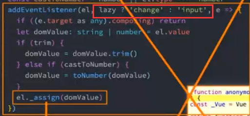


```html
<div id = "asd">
    <!--1：lazy,不会实时绑定，当你按下回车 的时候才会起作用-->
  <input type="text" v-model.lazy="message">
  <h2>{{message}}</h2>

  <!--2:number,vue默认赋值都是字符串，所以当你想获取数字类型的时候，需要用number修饰符-->
  <input type="number"  v-model.number="age">
  <h2>{{typeof age}}</h2>

  <!--3:trim去掉首尾空格-->
  <input type="text" v-model="name">
  <h2>您输入的名字{{name}}</h2>
</div>

<script src = "../vue.js"></script>
<script>
  const obj ={
    message:'九折水瓶',
    age:0,
    name:'asdasdasd'
  }
  const app = new Vue({
    el:'#asd',
    data:obj
  })
</script>
```

## Vue组件化开发(组件之间的通信)

### 1、组件化的基本使用

Vue.extend（)   创建的是组件构造器，参数是一个对象，对象里有一个template属性，他是用tab上面的飘号包围的字符串（可以换行），字符串里就是html代码，后面会有语法糖的写法

注册的组件只能放在vue挂载的实例里

全局组件是指在所有vue挂载的实例里可以用，不是任何地方都能用

```html
<div id = "asd">
    <!--3：使用组件，只有在vue管理的内部才能用，在这个div外是用不了的-->
  <my-cpn></my-cpn>
  <my-cpn></my-cpn>
  <my-cpn></my-cpn>
  <my-cpn></my-cpn>
  <!--这个是无效的，因为这个是局部组件-->
  <cpn></cpn>
</div>

<div id="asd2">
  <cpn></cpn>
</div>

<script src = "../vue.js"></script>
<script>
  //es6可以用``这个定义字符串，带换行的字符串

  //1：创建组件构造器对象,传入的template代表我们自定义组件的模板，这个模板就是用到组件的地方要用到的HTML代码。
  const cpnC = Vue.extend(
      {
        template:`
        <div>
          <h2>我是标题</h2>
          <p>我是内容</p>
        </div>
        `
      }
  )
  //2：注册组件,有两个参数，一个是组件的标签名称，一个是组件构造器
  //这是全局组件，多个vue实例里都可以用
  Vue.component(`my-cpn`,cpnC)

  const obj ={

  }
  const app = new Vue({
    el:'#asd',
    data:obj,
  })

  const app2 = new Vue({
    el:'#asd2',
    //这是局部组件，只能在这个vue里用
    components: {
    //cpn是组件的标签名，后面的是组件构造器
      cpn:cpnC
    }
  })
</script>
```

### 2、父子组件的区分

组件只能在被注册的地方用，这里cpn2是父组件，cpn1是子组件，cpn1在其他地方没有注册过，所以cpn1只能在cpn2里使用

```html
<div id = "asd">
  <cpn2></cpn2>
  <!--注意，这里不能使用cpn1，因为cpn1是在cpn2里注册的-->
</div>

<script src = "../vue.js"></script>
<script>
  //1:注册第一个组件构造器
  const cpn1 = Vue.extend({
    template:`
     <div>
      <h2>我是标题1</h2>
      <p>我是内容</p>
     </div>
    `
  })

  //2：注册第二个组件构造器
  //在这个组件里的components属性里添加组件一，就可以在这个组件构造器的template里使用前面的组件了，这里组件二是父亲，组件一是儿子
  //但是只能在cpn2里用cpn1
  const cpn2 = Vue.extend({
    template:`
     <div>
      <h2>我是标题2</h2>
      <p>我是内容</p>
     <cpn1></cpn1>
     </div>
    `,
    components:{
      cpn1:cpn1
    }
  })
  const obj ={

  }
  //root，根组件
  const app = new Vue({
    el:'#asd',
    data:obj,
    components: {
      cpn2:cpn2
    }
  })
</script>
```

### 3、component全局注册组件

```js
//1.全局组件注册的语法糖
//主要是省区了调用Vue.extend()的步骤，而是直接可以用一个对象来代替

//直接注册组件，内部是调用了extend的
Vue.component(`cpn1`, { template:`
   <div>
    <h2>我是标题1</h2>
    <p>我是内容</p>
   </div>
  `
})

const app = new Vue({
    el:'#asd',
    data:obj,
    //局部组件的语法糖
    components:{
      cpn2:{
        template:`
         <div>
          <h2>我是标题1</h2>
          <p>我是内容</p>
         </div>
        `
      }
    }
  })
```

### 4、将template抽离的注册组件的语法糖写法（常用）

用#id   也就是id选择器选中对应的template

```html
<!--2.template标签-->
<template id="jzsp2">
  <div>
    <h2>我是标题2</h2>
    <p>我是内容哈哈哈</p>
  </div>
</template>

<script src = "../vue.js"></script>
<script>

  const obj ={
  }
  const app = new Vue({
    el:'#asd',
    data:obj,
    components:{
      cpn1:{
        template: `#jzsp2`
    }}
  })
</script>
```

### 5、解决组件内部不能访问vue实例里数据问题

组件是一个单独功能模块的封装，应该有属于自己的data，但是组件的data比较特别，是一个函数，返回值是一个对象，对象里是要在组件里用到的键值对

```html
<!--
  1:组件里面不能直接访问vue实例里面的数据，也就是说不能使用mustache语法
  2：组件可以有一个data属性，这样猜可以访问，但是data不能是对象，必须是function，返回值是一个对象，对象里面是要用到的变量名和值
  3：也就是说，组件的数据是存放在data属性里的，而这个data必须是函数，而且返回值必须是一个对象，对象内部保存着属性
-->
<div id = "asd">
  <cpn1></cpn1>
</div>

<template id="jzsp2">
  <div>
    <!--<h2>我是标题2</h2>-->
    <h2>{{title}}</h2>
    <p>我是内容哈哈哈</p>
  </div>
</template>

<script src = "../vue.js"></script>
<script>

  const obj ={
    //这个不能直接用mustache语法在组件里使用
    title:'我是标题2'
  }
  const app = new Vue({
    el:'#asd',
    data:obj,
    components:{
      cpn1:{
        template: `#jzsp2`,
        data(){
          return{
            title:'abc'
          }
        }}
    }
  })
</script>
```

### 6、为什么组件的data必须是函数

因为是函数，调用data函数之后会return一个新的对象，使得组件之间的数据不互相干扰

```html
<div id = "asd">
    <cpn1></cpn1>
    <cpn1></cpn1>
    <cpn1></cpn1>
</div>

<template id="cpn1">
  <div>
    <h2>当前计数：{{counter}}</h2>
    <button @click="increment">+</button>
    <button @click="decrement">-</button>
  </div>
</template>

<script src = "../vue.js"></script>
<script>
  //1.注册组件
  Vue.component('cpn1',{
    template:`#cpn1`,
    data(){
      //1.这个data是相互独立的的，每次都会return一个新的对象
      return {
        counter:0
      }
        
      /*
      2.这个data是统一的，公用一个数据
      return obj,
      */
    },
    methods:{
      increment(){
        this.counter++
      },
      decrement(){
        this.counter--
      }
    }
  })
  const app = new Vue({
    el:'#asd',
    data:{
    counter:0
    }
  })
</script>
```

### 7、父子组件通信-父传子props

父组件的数据是不能让子组件直接引用的，但是在开发的时候会遇到上层的数据要给下层使用，比如在一个页面中，从服务器请求到了很多数据，其中一部分数据不是页面这个大组件展示的，而是需要下面的子组件进行展示，这个时候就需要父子组件的通信来解决这个问题。


父传子的步骤：

1、写好父组件和子组件

2、在父组件中用到子组件的地方，用v-bind绑定，属性名是子组件中props的key

3、在子组件中就可以用mustache使用props中定义了的父组件传入的值了


props的值有两种方式：数组和对象（数组用的少）

```html
<!--
  有以下几个注意的地方：
  1：data返回值是对象类型，没返回值就报错
  2：template引用的时候要用#开头，
  3：在子类中用父类数据的时候，先在子类中定义props（可以是数组类型，里面存的是变量名），然后在父亲调用子组件的时候用v-bind绑定
  ，这样的话在template里就可以直接使用mustache了，但是必须是props里的变量名，而不是父亲的变量名
  4:如果动态绑定的是常量值（例如字符串）父组件中就不需要v-bind了
  5:在子组件中，用 props 接收到的数据，在使用的时候，和调用 data 里的数据的用法是一样的。
  6:传多个的时候，只需要v-bind绑定多次就可以了
-->
<div id = "asd">
  <!--是在这里进行传输的哟-->
  <cpn :cmovies="movies" :cmessage="message"></cpn>
</div>

<template id="cpn">
  <div>
    <ul>
      <li v-for="item in cmovies">{{item}}</li>
    </ul>
  </div>
  <h2>{{cmessage}}</h2>
</template>

<script src = "../vue.js"></script>
<script>
  /*父传子，props*/
  const cpn = {
    template:`#cpn`,
    props:[`cmovies`,`cmessage`],
    data(){
      return {}
    }
  }
  const app = new Vue({
    el:'#asd',
    data:{
      movies:[1,2,3,4,5],
      message:"jzsp"
    },
    components:{
      cpn
    }
  })
</script>
```

props对象里的值，如果类型是数组或者对象的话，default必须是函数且有返回值

```html

<div id = "asd">
  <!--是在这里进行传输的哟-->
  <cpn :cmovies="movies"></cpn>
</div>


<template id="cpn">
  <div>
    <ul>
      <li v-for="item in cmovies">{{item}}</li>
    </ul>
  </div>
</template>


<script src = "../vue.js"></script>
<script>
  /*父传子，props*/
  const cpn = {
    template:`#cpn`,
    props:{
      //1，type:Array,类型限制，如果是多种类型的话，可以这么写type:[String,Array];
      //2，default提供一些默认值,如果是数组或者对象，默认值必须是函数而且必须有返回值
      //3，required代表这个值是必须要传入的，也就是在调用的时候一定要v-bind绑定
      cmovies:{
        type:Array,
        default(){
          return []
        },
        required:true          
      }
    },
    data(){
      return {}
    }
  }

  const obj ={
    movies:[1,2,3,4,5]
  }
  const app = new Vue({
    el:'#asd',
    data:obj,
    components:{
      cpn
    }
  })
</script>
```

### 8、父传子的驼峰标识

注意，v-bind：后面接的不能是驼峰标识，如果是要用驼峰标识的话，得将大写字母改成小写，并且在前面加一个“-”

```html
<!--
  问题：将cinfo改成cInfo这种驼峰标识之后，不显示东西了，后台报错了
  原因：vue的v-bind不支持驼峰标识。所以应该把v-bind处的驼峰标识改成c-info（大写变成-小写）
-->
<div id = "asd">
  <cpn :c-info="info"></cpn>
</div>
<template id="cpn">
  <h2>{{cInfo}}</h2>
</template>
<script src = "../vue.js"></script>
<script>
  const cpn ={
    template:`#cpn`,
    props:{
      cInfo:{
        type:Object,
        default(){return {}}
      }
    }
  }
  const app = new Vue({
    el:'#asd',
    data:{
      info:{
        name:'why',
        age:18,
        height:1.88
      }
    },
    components:{
      cpn
    }
  })
</script>
```

### 9、子组件传父组件-自定义事件+emit

步骤：

1、在子组件模板里的某个methods里可以用   this.$emit（“事件名”,要发送的参数）发射数据

2、在父组件模板里监听 上面事件名的事件

3、在监听响应的方法里写上要做的事情。注意，如果子组件有传item的话，这里会默认是cpnclick（item）

```html
<div id = "asd">
  <!--在这里接收并且监听事件，也就是说，
  接收到了这个事件之后会执行cpnclick函数
  如果子组件有传item的话，这里会默认是cpnclick（item）
  -->
    <cpn @itemclick="cpnclick"></cpn>
</div>

<!--一般来说需要子组件向父组件传递事件，然后父组件根据这个事件来请求新的数据-->
<!--点击按钮发射事件，所以按钮要监听单击事件，单击的时候发射事件-->
<template id="cpn">
  <div>
    <button v-for="item in categories"
            @click="itemClick(item)">
      {{item.name}}
    </button>
  </div>
</template>

<script src = "../vue.js"></script>
<script>
  const cpn ={
    template:`#cpn`,
    data(){
      return{
        categories:[
          {id:`aaa`,name:`热门推荐`},
          {id:`bbb`,name:`手机数码`},
          {id:`ccc`,name:`家用电器`},
          {id:`ddd`,name:`电脑办公`}
        ]
      }
    },
    methods:{
      itemClick(item){
        //发射事件，参数是自定义的事件名，在父组件调用的时候监听这里发出的事件
        //第二个参数是item的话，可以传item到父组件，父组件调用cpnclick方法的时候会默认传入item
        //这个是自定义了一个叫做itemclick的事件让父组件去监听
        this.$emit(`itemclick`,item);
      }
    }
  }
  const app = new Vue({
    el:'#asd',
    data:{

    },
    components:{
      cpn
    },
    methods:{
      cpnclick(item){
        console.log(`jzsp`,item);
      }
    }
  })
</script>
<!--
也就是说，要字传父的话，子要$emit，父要@监听这个自定义事件并且做出对应的操作
-->
```

### 10、父子组件通信时用v-model       

```html
<div id = "asd">
  <!--将props里的东西和父组件data里的东西绑定，@是子传父（自定义事件），如果自定义事件emit的时候有另外一个参数，那么会在方法里默认传入这个参数-->
  <cpn :number1="num1"
       :number2="num2"
       @num1change="num1change"
       @num2change="num2change">
  </cpn>
</div>


<!--
v-model不能直接绑定props里的值，因为props里的值是要父组件来修改的，而不是子组件的模板里同步修改，所以官方不建议这样
官方提示是
Avoid mutating a prop directly since the value will be overwritten whenever the parent component re-renders.
Instead, 
use a data or computed property based on the prop's value. Prop being mutated: "number1" found in

解决了这个之后，现在有个要求就是，当你子组件的数据改了，父组件的数据也要改
-->
<template id="cpn">
  <div>
    <h2>props:{{number1}}</h2>
    <h2>data:{{dnumber1}}</h2>
    <!--<input type="text" v-model="dnumber1">-->
    <input type="text" v-bind:value="dnumber1" @input="num1input">
    <h2>props:{{number2}}</h2>
    <h2>data:{{dnumber2}}</h2>
    <!--<input type="text" v-model="dnumber2">-->
    <input type="text" v-bind:value="dnumber2" @input="num2input">
  </div>
</template>


<script src = "../vue.js"></script>
<script>
  const cpn = {
    template:`#cpn`,
    props:{
      number1:{
        type:Number
      },
      number2:{
        type:Number
      }
    },
    data(){
      return{
        dnumber1:this.number1,
        dnumber2:this.number2
      }
    },
    methods:{
      num1input(event){
        //1.这段代码是还原v-model的本质，达到双向绑定
        this.dnumber1=event.target.value;
        //2.这段代码是传的dnumber1
        this.$emit(`num1change`,this.dnumber1)

        //3.同时修改dnumber2的值
        this.dnumber2=this.dnumber1*100;
        this.$emit(`num2change`,this.number2);
      },
      num2input(event){
        this.dnumber2=event.target.value;
        this.$emit(`num2change`,this.dnumber2)

        this.dnumber1=this.dnumber2/100;
        this.$emit(`num2change`,this.number1);
      }
    }
  }
  const obj ={
    num1:1,
    num2:0
  }
  const app = new Vue({
    el:'#asd',
    data:obj,
    components:{
      cpn
    },
    methods:{
      num1change(value){
        this.num1=parseFloat(value);
      },
      num2change(value){
        this.num2=parseFloat(value);
      }
    }
  })
</script>
```

### 11、父组件调用子组件对象里的方法等

```html
<!--在方法里输出这个Vue实例的children信息，发现this.$children是数组类型，父组件内有几个子组件（components）这个数组的长度就是几，可以通过下标来获取第几个子组件-->
<!--但是children用的少，refs用的更多一些-->
<!--疑问，如果有两个组件的ref类型相同的时候，该取哪个？-->
<div id = "asd">
<!--    <cpn ref="aaa"></cpn>-->
    <cpn ref="ccc"></cpn>
    <cpn ref="bbb"></cpn>
    <cpn ref="aaa"></cpn>
    <button @click="cpnclick">jzsp</button>
</div>

<template id="cpn">
  <div>
    <h2>jzsp</h2>
  </div>
</template>

<script src = "../vue.js"></script>
<script>
  const cpn = {
    template:`#cpn`,
    methods:{
      showmessage(){
        console.log(`showmessage`);
      }
    },
    data(){
      return {
        jzsp:1
      }
    }
  }
  const app = new Vue({
    el:'#asd',
    data:{},
    components:{cpn},
    methods:{
      cpnclick() {
        console.log(this.$children);

        //这个是children的用法，但是如果要取出某个组件，写好代码之后，这个组件前面又多了几个组件，
        // 那么这个组件数组里该组件的下标会发生变化，下次运行就取不到了，所以提供了第二种取法
        for (const c of this.$children) {
          console.log(c.jzsp);
          c.showmessage();
        }

        //refs是一个对象类型，默认是一个空对象ref='bbb'才会在对象里追加相关的属性
        console.log(`第二组例子开始`);
        console.log(this.$refs);
        console.log(this.$refs.aaa);
        this.$refs.aaa.showmessage();

      }
    }
  })
</script>
```

### 12、子访问父的数据

```html
<div id = "asd">
  <cpn></cpn>
</div>
<!--组件是为了复用的，但是在这里用的时候有parent，到另一边可能就换了一个parent或者说没有parent了，所以这个方法很不常用-->
<!--因为是子组件访问父组件，所以监听是监听子组件-->
<!--parent访问父组件，root访问根组件-->
<template id="cpn">
  <div>
    <ccpn></ccpn>
    <button @click="btnclick">子组件的按钮</button>
  </div>
</template>

<template id="ccpn">
  <div>
    <h2>我是ccpn</h2>
    <button @click="btnclick">子子组件的按钮</button>
  </div>
</template>

<script src = "../vue.js"></script>
<script>
  const obj ={
    name:`我是父组件的name`
  }
  const cpn = {
    template:`#cpn`,
    data(){
      return {
        name:`我是子组件的name`
      }
    },
    methods:{
      btnclick(){
        //访问父组件，$parent
        console.log(this.$parent);
        console.log(this.$parent.name);
      }
    },
    components:{
      ccpn:{
        template: `#ccpn`,
        methods:{
          btnclick(){
            //访问父组件，$parent
            console.log(this.$parent);
            console.log(this.$parent.name);
          }
        }
      }
    }

  }
  const app = new Vue({
    el:'#asd',
    data:obj,
    components:{
      cpn
    }
  })
</script>
```

## Vue组件化高级

### 插槽slot的基本使用

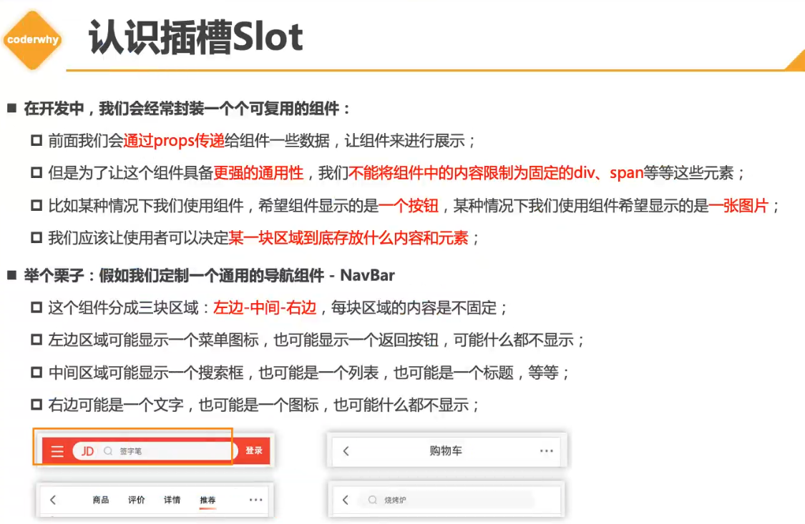

插槽是有默认值的（默认显示内容）

```html
<div id = "asd">
  <!--
  1：在标签中间写入html代码，这段代码就会自动替换slot标签（插槽）
  2：如果很多东西都要导入同样的内容的话，可以给插槽设置默认的html代码，
  3：如果外层标签内没内容，就会显示插槽内的默认值，如果有内容，就用内容替换插槽的默认值
  4：如果有多个参数（多行html代码）在标签中间，会一起替换掉插槽
  -->
    <cpn>
      <button>九折水瓶</button>
      <h2>我是shabi</h2>
    </cpn>

    <cpn>
      <span>哈哈哈</span>
    </cpn>

    <cpn>
      <i>哈哈哈哈哈哈</i>
    </cpn>
    
    <cpn></cpn>
</div>


<!--插槽的作用：抽取共性，保留不同，实现拓展-->
<!--slot是预留的拓展位置，可以在这里添加代码，实现其他东西的加入，使该组件的拓展性增强 -->
<template id="cpn">
  <div>
    <h2>我是组件哈哈哈</h2>
    <slot><button>显示了默认值</button></slot>
  </div>
</template>
```

### 具名插槽

```html
<div id = "asd">
  <cpn><h2 slot="center">jzsp</h2></cpn>
</div>

<!--如果有多个插槽，你需要改其中某个，这时候就要用到具名插槽-->
<!--给插槽家一个name属性，在父组件替换的时候，指定slot=“name”就替换指定的插槽-->
<template id="cpn">
  <div>
    <slot name="left"><span>左边</span></slot>
    <slot name="center"><span>中间</span></slot>
    <slot name="right"><span>右边</span></slot>
  </div>
</template>
```

### 编译作用域

id是谁就用谁

```html
<!--
问题：这个isshow是用的vue实例中的isshow还是子组件内的isshow呢？
答案：是vue实例中的isshow\
总结：这块的id属于哪个，用的就是对应的数据
-->
<div id = "asd">
    <cpn v-show="isShow"></cpn>
</div>

<template id="cpn">
  <div>
    <h2 v-show="isShow">我是子组件</h2>
    <p>我是内容哈哈哈</p>
  </div>
</template>

<script src = "../vue.js"></script>
<script>
  const cpn={
    template:`#cpn`,
    data(){
      return {
        isShow: false
      }
    }
  }
  const app = new Vue({
    el:'#asd',
    data:{
      isShow:true
    },
    components:{
      cpn
    }
  })
</script>
```

### 作用域插槽slot-scope    ☆☆☆☆☆☆☆

```html
<!--子组件默认是用v-for展示数组内容，但是父组件调用的时候可能不想这么展示，就得获取子组件展示的数据-->

<!--总结：如何在父组件内用子组件的数据
    1：在子组件模板内的插槽上绑定要传给父亲的数据给data（可以任意起名，不是data也可以），
    2：在调用子组件的时候，标签中间写一个template，用slot-scope="slot"获取slot对象
    3：slot.data就是要获取的数据了
    4：就是，父组件替换插槽标签，但是用的数据是子组件的

-->
<div id = "asd">
  <cpn></cpn>

  <cpn>
    <!--目的是获取子组件中的pLanguages-->
    <!--因此在子组件的模板里的插槽中把planguages用v-bind绑定给data（这个data可以随便起名字，也可以是abc-->
    <!--想要获取的话，得在这里也写一个template模板-->
    <template slot-scope="slot">
      <span v-for="item in slot.data">{{item}} - </span>
    </template>
  </cpn>

  <!--这里介绍一个join函数，可以把数组内的每个字符串数据按括号内的参数合并（末尾不会有）-->
  <cpn>
    <template slot-scope="slot">
      <span>{{slot.data.join(` - `)}}</span>
    </template>
  </cpn>
</div>

<template id="cpn">
  <div>
    <slot :data="pLanguages">
      <ul>
        <li v-for="item in pLanguages">{{item}}</li>
      </ul>
    </slot>
  </div>
</template>

<script src = "../vue.js"></script>
<script>
  const obj ={
    isShow:true
  }
  const cpn={
    template:`#cpn`,
    data(){
      return {
        pLanguages:[`javascript`,`c`,`java`,`python`]
      }
    }
  }
  const app = new Vue({
    el:'#asd',
    data:obj,
    components:{
      cpn
    }

  })
</script>
```

## 前端模块化

### es6模块化引用：type="module"

```html
<!--加上type=module就是按模块化引入，不会有命名冲突，一个js文件就是一个单独的模块，有单独的作用域-->
<!--但是别人也不能访问，所以如果其他js文件要用到另一个js文件里的东西的时候，要导入导出-->
<script src="导出.js" type="module"></script>
<script src="bbb.js" type="module"></script>
<script src="导入.js" type="module"></script>
```

### 在各个模块之间导入导出数据

导入.js如下

```js
//导入的格式如下，注意，from后面字符串内不能省略后缀
//如果需要导入所有的内容，可以通过*导入所有的export变量（导出的东西），并且通常需要as一个别名，例子如下
import {flag,sum} from "./导出.js";
import * as info from "./导出.js";

if(flag)
{
  console.log(`xiaomingshitiancai hahahah`);
}
//使用的时候要用别名来引用导入的数据
let p = new info.person();
p.run();

//只能接收一个export default的内容，此时import后不需要大括号并且可以任意命名（因为默认导出的只有一个，所以不需要大括号了）
import nianling from "./导出.js"

console.log(nianling);
```

导出.js如下

```js
/*
* 导出有两种方式，一种是在定义的时候直接导出，一种是在后面导出，具体两种例子如下
* 1：export let flag = true
* 2：export{flag,name,age,sum}
* */
let name = `小明`;
let age = 18;
let flag = true;
class person{
  run(){
    console.log(`person导出成功`);
  }
}
function sum(num1,num2)
{ return num1+num2 }
if(flag)
{ console.log(sum(20, 30)); }
//方式1：
export {
  //函数导出也是只要写函数名就可以了
  flag,person,sum
}

//方式2：
export let height = 1.80;

//export default，导出默认的东西，一个js文件有且只有一个export default，接收方也只能接收一个default导出的内容,在导入的时候可以自己命名
export default age
```

# Vue CLI

## 使用前提

### 安装

NodeJS

NPM

Webpack    全局安装   npm install webpack -g

安装CLI3     npm install -g @vue/cli -g

拉取CLI2的模板     npm install -g @vue/cli-init -g（和上面的同时用了之后才能既用3又用2）

### 使用CLI2

创建脚手架2 ：  vue init webpack 项目名称   跑项目  npm run dev

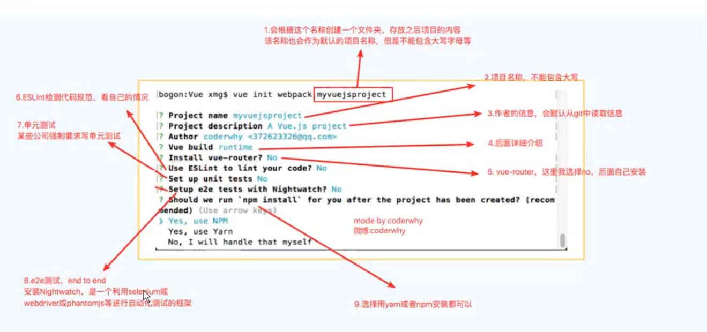

### 使用CLI3

创建脚手架3：  vue create  项目名称   跑项目  npm run serve

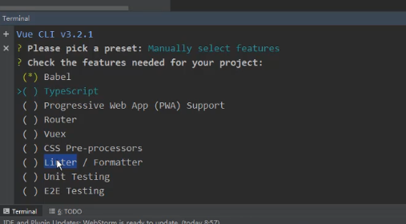


### 关掉Eslint（false）

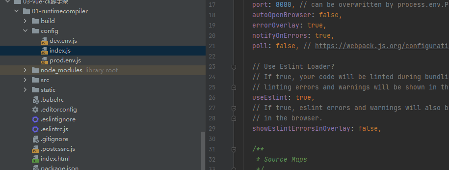

### npm run build

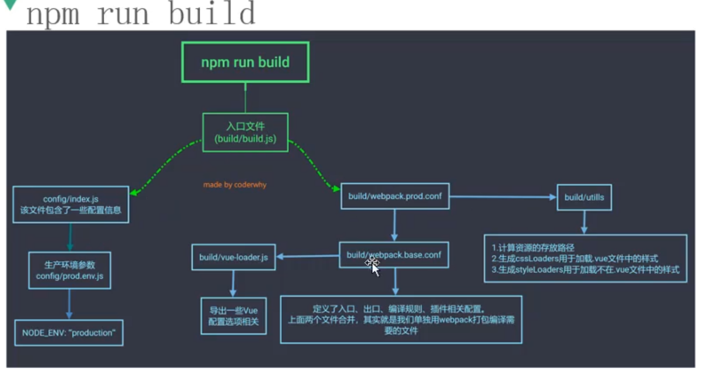

### npm run dev

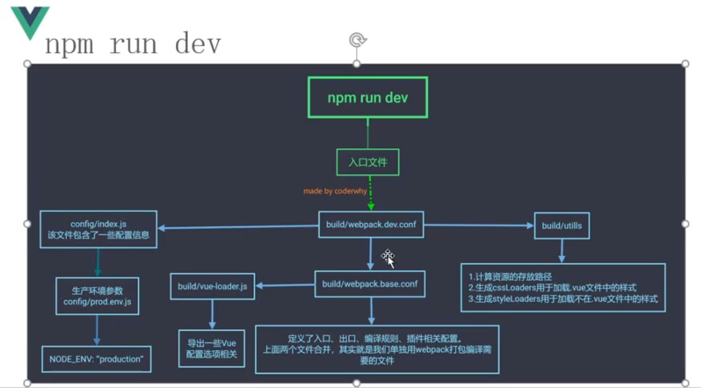


## Vue CLI2

### runtime compiler和runtime only的区别***********

Vue程序运行过程

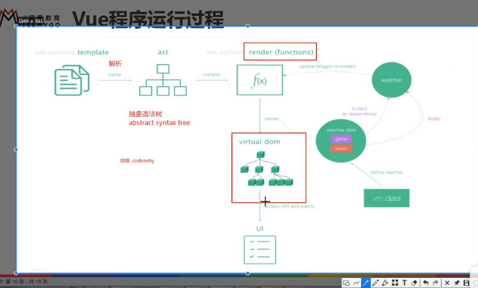

区别

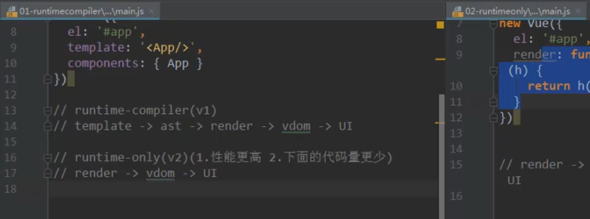

### 关于render函数

```js
import Vue from 'vue'
import App from './App'

Vue.config.productionTip = false

console.log(App);
new Vue({
  el: '#app',
  //render: h => h(App)
  //这里的h本质上是 createelement，里面可以传入一个组件，

  //el挂载的最终会被render解析的替换掉

  //1:普通用法：createElement('标签',{标签的属性},['内容'])：
  /*
  return createElement('h2',
    {class:'box'},
    ['jzsp']
  )
   */


  //2：传入组件对象
  //这时候可能会有疑问，App.vue里明明有template,那么需要进行template->ast这一步吗？
  //答案是不要的，因为有一个东西，叫做 vue-template-compiler帮我们进行了解析
  //导入的vue是App对象，解析之后没有任何关于tempalte的信息，都已经转换成render函数了，可以在上面console.log（Vue）的浏览器里打开看

  render:function (createElement){
    /*
    return createElement('h2',
      {class:'box'},
      ['jzsp']
    )
    */

    return createElement(App)
  }
})
```

## Vue CLI3

### 认识Vue CLI3

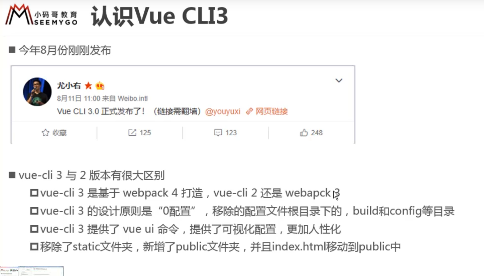

### vue ui

在终端输入 vue ui可以出现vue 脚手架3的可视化ui配置管理界面（需要导入到对应的工程文件夹）

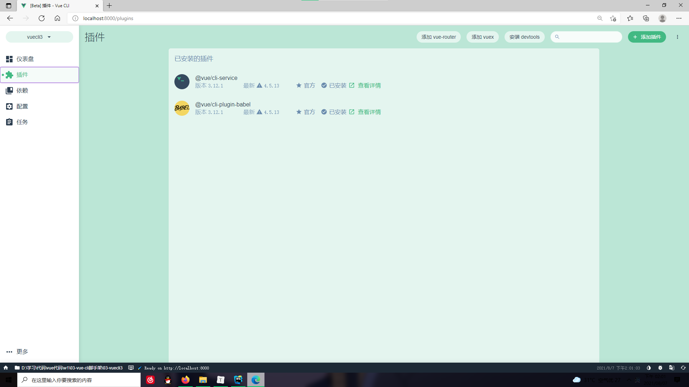

也可以在这个目录下查看配置

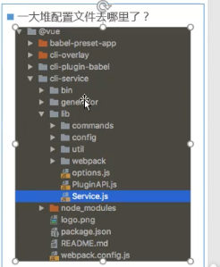

## Router（很重要噢）

### 后端路由和前端路由

路由映射关系由后端处理，就叫做后端路由

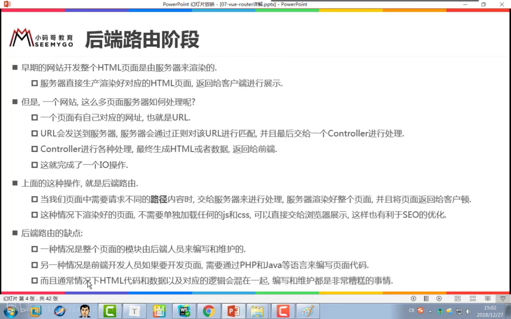

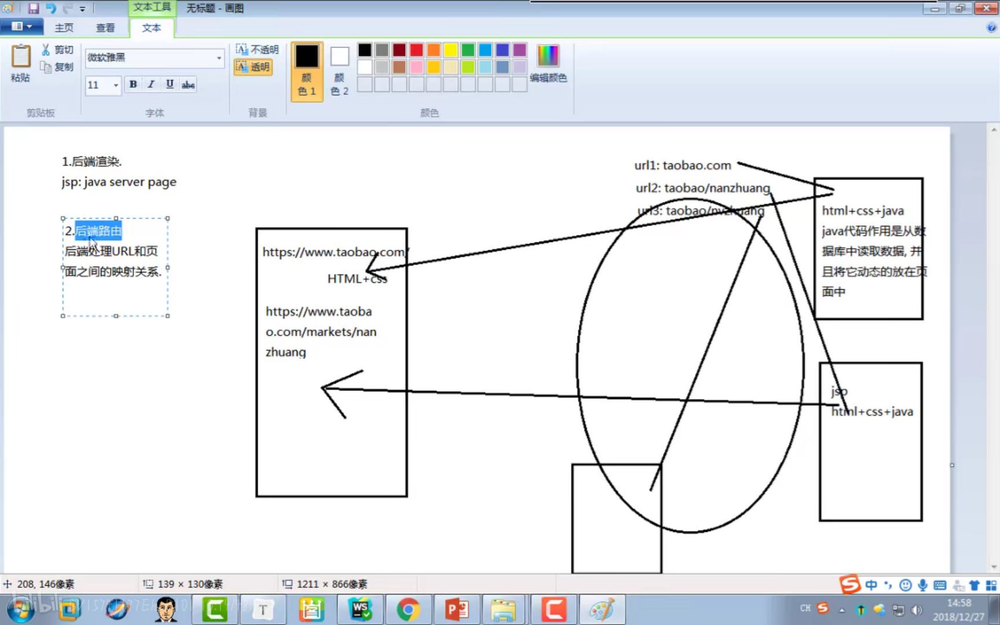

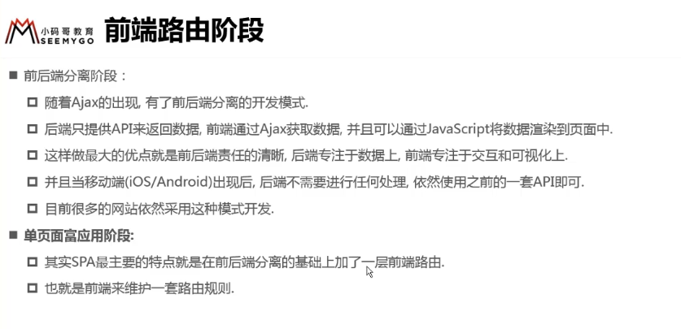

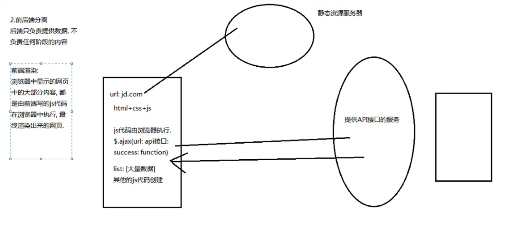

### 如何改变url但是页面不发生刷新

```
方法1：在控制台输入
location.hash='xxx'

方法2：
入栈出栈
history.pushState({},'','name')
history.back();


替换，不能点击返回按钮
history.replaceState({},'','name')

history.go(num);
num==-1时，等价于back()
num==1时,等价于forward()
以此类推，就相当于浏览器点击了前进和后退按钮
```

### 路由的安装和使用


#### 第一步，在router里创建一个index.js文件，

导入veuRouter和vue文件，使用Vue.use(VueRouter)来安装vueRouter


#### 第二步，创建vuerouter对象，配置映射关系


#### 第三步，将router对象导入到vue实例中


#### 第四步、使用router-view和router-link（组件显示的位置）

<router-link>:该标签是一个vue-router中已经内置的组件,它会被渲染成一个<a>标签.

<router-view>:该标签会根据当前的路径,动态渲染出不同的组件.

网页的其他内容,比如顶部的标题/导航,或者底部的一些版权信息等会和<router-view>处于同一个等级.

在路由切换时,切换的是<router-view>挂载的组件,其他内容不会发生改变.


#### 如何配置映射？

routes是一个对象数组，一个对象代表了 一个映射、


导入组件之后就可以进行映射关系的对应了


#### 路由的默认值

通过重定向使得router-view 默认显示


#### 由hash模式修改为history模式

hash模式有＃，不太行


#### 嵌套路由


路由配置


Home组件


嵌套路由里的默认路径


### router-link属性

#### to属性

设置点击跳转后，router-view显示对应的组件（忽略掉图片里的=>a）


#### tag属性

可以使router-link渲染成其他的标签，例如button


#### replace属性

使得点击之后无法按返回按钮


#### active-class属性


可以在路由配置里统一修改


### 使用this.$router通过代码实现router-link

获取的是router对象


### 动态路由

router里的配置


组件里的写法


### 传递参数（存疑）

https://blog.csdn.net/qq_21980517/article/details/100075540


#### params传递

将动态路由里动态拼接上去的内容获取

this.$route获取的是当前活跃的路由，里面有个params属性，注意名字一定要跟path后面跟的名字一样（上图是userid，这里也应该是userid）


或者是通过代码实现跳转时，传递对象，也会将对应名字的值拼接到url后


#### query传递

v-bind绑定一个对象


或者是通过代码实现跳转时，传递一个对象进去


用类似的方法取出，query就是url后面跟着的键值对。


#### 区别(unfinished)

### 路由懒加载


### 打包后dist文件的解读


### 路由监听，全局导航守卫（前置钩子，在跳转前回调）

router.beforeEach()

```js
//全局导航守卫,实现路由监听
//next也是一个函数，内部已经实现了，并且要在后面调用，如果不调用就不会跳转路由
router.beforeEach((to,from,next)=>{
  //from 和 to 都是route类型，也就是每个路由，路由里可以定义meta（元数据）属性，可以在里面取数据

  //如果是嵌套路由的话，title会显示undefined，这是因为获取的变量有问题，嵌套里的路由没有设置meta，
  //路由有一个matched属性,是个数组，里面是每层的路由，这里只要获取matched[0]，也就是最外层已经设置meta的路由即可
  console.log(to);
  document.title=to.matched[0].meta.title;
  next();
})
```

afterEach()后置钩子，在跳转后回调，不需要调用next


### keep-alive保持状态

include属性和exclude属性

```vue
<!--
keep-alive用于保持状态，不会执行destroyed生命周期方法
只有keep-alive标签，对应的created函数和destroyed函数才会生效

keep-alive有两个重要的属性：
    include=“components的name属性”  匹配的组件会被缓存，不会反复进行created和destroyed
    exclude=“components的name属性”  反之
-->
<keep-alive exclude="Profile,User">
  <router-view></router-view>
</keep-alive>
```

#### 实现页面状态缓存

Home下有news和message两个子组件，现在要实现的是，默认显示news，但是点击message之后跳转其他组件，跳转回来时还是message。

```js
data(){
  return {
    path:'/home/news'
  }
},
  deactivated(){
    //界面不活跃（离开界面的时候会执行这个函数）
  },
  //下面两个函数的设置是为了实现界面跳转之后返回原界面保存上一个界面的状态
  activated(){
    //界面活跃（被选中的时候会执行这个函数）

    //不在子路由设置默认的路径，而在这里，也就是界面被选中的时候，压入路径达到跳转效果
    this.$router.push(this.path);
  },
  //组件内导航守卫
  //记录离开时的路径
  beforeRouteLeave(to,from,next){
    console.log(this.$route.path);
    this.path=this.$route.path;
    next();
  }
```

### 路径起别名

extensions是，如果这些是后缀就不需要加


alias是别名，在import导入的时候可以用别名导入，但是在html标签里使用时，前面要加波浪号


## Vuex

### 安装

1、npm install vuex --save

2、创建store文件夹，里面新建一个index.js文件，引入vue和vuex包，安装插件，创建vuex对象

这个对象里有state，mutations，actions（处理异步操作），getters（相当于计算属性），moudles这些对象


3、默认导出vuex对象，并且在main.js里使用


相当于是vue.prototype.$store=store


4、使用

在state里定义了之后，可以在任何vue组件中通过mustache语法，$store.state.变量名来获取全局变量。


### 状态管理图


### devtools

在浏览器的设置-> 更多工具 ->拓展工具中可以搜索到并且安装。


### state响应式的前提

```
//state的数据是响应式的，但是他有一定的要求：
//要求数据必须要在这里定义，定义的属性会被加入响应式系统中
//如果是通过操作添加新的属性的话，就不是响应式的
```

vue的delete和set可以达到响应式的效果

```js
Vue.set(this.letters,0,'bbbbb');
Vue.delete(this.letters,0);
```


### mutations

作用：修改state里的数据状态的唯一途径

#### 基本使用

在vuex里的mutation中定义方法完成要实现的操作，在其他组件中要用到这个方法的时候，只需要绑定一个事件，在这个时间里调用this.&store.commit('mutation中对应的方法名')


而mutation中的方法是有一个默认参数state的，也就是vuex中的state


#### 如果commit提交要传入参数

mutations里的定义

```js
//只传入一个数据的时候
addcount(state,count){
  console.log(count);
  state.counter += count
},
  //传入多个数据（数据保存在payload对象里）
  // addcount(state,payload){
  //   console.log(payload);
  //   state.counter += payload.count
  // },
```

commit处的定义

```js
//要传入其他参数给mutation的话可以这么做
//mutation携带参数提交
//payload：负载
addcount(count){
  //1：普通的提交封装
  //这种提交方式，在父类接收的时候addcount(state,count)，count就是这里的count
  this.$store.commit('addcount',count)

  //2：特殊的提交封装
  //这种提交方式，父类在接收的时候打印count就发现count是一个对象，里面包含了传入的数据
  //所以这种提交方式，父类准确的写应该是：
  //addcount(state,payload)
  //payload里面是这里传入的对象
  //父类要用数据的话可以用payload.xxx来调用对应的数据
  this.$store.commit({
   //type是指定提交给哪个mutations中定义的方法
    type:'addcount',
    count:count,
    //age用于打印数据测试
    age:18
  })
},
```

### getters

定义与mutations类似，但是使用的话不一样。使用的话是通过$store.getters.属性名来调用。


基本使用

```js
export default {
  //类似于计算属性
  //可以直接传入state方便获取数据
  //也可以通过 store.state.counter获取数据
  powCount(state){
    return state.counter*state.counter
  },
  moreThan20age(state){
    return state.student.filter(s => s.age>=20)
  },
```

getters作为参数（第二个参数不管是什么名字，实质上都是getters--命名潜规则）

```js
  moreThan20ageLength(state,getters){
    //可以导入getters实现代码复用
    //return state.student.filter(s => s.age>=20).length;
    return getters.moreThan20age.length
  }
```

需要传入参数的计算属性，返回一个函数，函数的参数是要传入的变量

```js
  //如果计算属性要传参数的话，只能在getters的方法里返回一个新的函数
  moreThanAges(state){
    return age=>{
      return state.student.filter(s => s.age>=age)
    }
  }
```

### actions

#### 为什么要用actions？

因为在mutations里执行异步操作改变state数据的时候，devtools监听不到数值的变化，导致混乱（如下图，页面已经改变了，但是devtools没有检测到）


#### actions的使用

先在mutatoins里定义你想要执行的操作，在actions中定义的方法里comiit调用mutations里的操作（因为修改state只能通过mutations来修改）

action里的函数会默认传入context属性，在这里可以把他当作是store

actions.js

```js
aupdateinfo(context,payload){
  setTimeout(()=>{
    //异步操作修改信息不能直接修改，是要调用mutation里的操作
    context.commit('updateinfo');
    console.log(payload);

    //payload里传入了一个success函数，执行到这里的时候告诉外面，这里已经成功执行结束
    payload.success();
  },1000)
},
```

然后在组件中用$store.dispatch来调用action里的方法，间接地调用到mutations里的方法。

```js
updateinfo(){
  //正常操作
  // this.$store.commit('updateinfo')

  //有异步操作的时候要这样
  //dispatch也可以传入其他参数（利用第二种提交方式）
  // this.$store.dispatch({
  //   type:'aupdateinfo',
  //   aaa:'aaa',
  //   bbb:'bbb',
  //   success(){
  //     console.log('完成');
  //   }
  // })

  //如果现在要在外面得知里面已经调用完成，可以像上面一样传入一个函数并且在里面完成的时候调用
    
  //也可以通过dispatch返回的promise对象调用then方法来通知外面已经调用完成
  this.$store.dispatch({
    type:'aupdateinfo2',
    aaa:'aaa',
    bbb:'bbb',
    success(){
      console.log('完成');
    }
  }).then(res=>{
    console.log(res,'完成');
  })
},
```

#### 使用promise

```js
  //如果现在要在外面得知里面已经调用完成，可以像上面一样传入一个函数并且在里面完成的时候调用
  //也可以通过dispatch返回的promise对象调用then方法来通知外面已经调用完成
  this.$store.dispatch({
    type:'aupdateinfo2',
    aaa:'aaa',
    bbb:'bbb',
    success(){
      console.log('完成');
    }
  }).then(res=>{
    console.log(res,'完成');
  })
},
```

```js
  //action也可以返回一个promise对象，在外部调用的地方可以执行then的内容
  aupdateinfo2(context,payload){
    return new Promise((resolve, reject) => {
      setTimeout(()=>{

        context.commit('updateinfo');

        resolve('111');
      },1000)
    })
  }

```

### modules


模块里的state调用如上图。

模块里的mutations中的方法名基本上不会与大store的mutations中的方法名一致。他会先在大store的mutations中找，如果找不到再在modules里的mutations中找，调用的时候还是this.$store.commit('')

模块里的getters调用的时候也是直接调用的  $store.getters.xxx

```js
getters:{
  fullname(state){
    return state.name+'11111';
  },
  fullname1(state,getters)
  {
    return getters.fullname+'22222';
  },
  //子模块的getters可以有第三个参数，第三个参数是根store的state数据
  fullname2(state,getters,rootState)
  {
    return getters.fullname1 + rootState.counter
  }
}
```

模块里的actions中context的commit只会commit到自己模块中的mutations里，在组件中dispatch时也是直接调用。

这里的context里有如下定义


### 目录分离


# watch

### 基本用法：

 当`firstName`值变化时，watch监听到并且执行

```jsx
<div>
      <p>FullName: {{fullName}}</p>
      <p>FirstName: <input type="text" v-model="firstName"></p>
</div>
 
new Vue({
  el: '#root',
  data: {
    firstName: 'Dawei',
    lastName: 'Lou',
    fullName: ''
  },
  watch: {
    //监听data中的firstName的值的改变，两个参数分别是改变后的值和改变前的值
    firstName(newName, oldName) {
      this.fullName = newName + ' ' + this.lastName;
    }
  } 
})
```

### handler属性和immediate属性（立即执行）

 上面的例子是值变化时候，watch才执行，我们想让值**最初时候watch就执行**就用到了`handler`和`immediate`属性

```kotlin
watch: {
  firstName: {
    handler(newName, oldName) {
      this.fullName = newName + ' ' + this.lastName;
    },
    // 代表在wacth里声明了firstName这个方法之后立即先去执行handler方法，如果设置了false，那么效果和上边例子一样
    immediate: true
  }
}
```

### deep属性（深度监听，常用于对象的属性的改变）

> 默认情况下侦听器只会针对侦听数据本身的改变（内部发生改变是无法侦听到的）

```jsx
<div>
      <p>obj.a: {{obj.a}}</p>
      <p>obj.a: <input type="text" v-model="obj.a"></p>
</div>
 
new Vue({
  el: '#root',
  data: {
    obj: {
      a: 123
    }
  },
  watch: {
    obj: {
      handler(newName, oldName) {
         console.log('obj.a changed');
      },
      immediate: true
    }
  } 
})
```

 我们在在输入框中输入数据视图改变obj.a的值时，我们发现是无效的。受现代 JavaScript 的限制 (以及废弃 Object.observe)，**Vue 不能检测到对象属性的添加或删除**。由于 Vue 会在初始化实例时对属性执行 getter/setter 转化过程，所以属性必须在 data 对象上存在才能让 Vue 转换它，这样才能让它是响应的。

 默认情况下 handler 只监听obj这个属性它的引用的变化，我们只有给obj赋值的时候它才会监听到，比如我们在 mounted事件钩子函数中对obj进行重新赋值：

```kotlin
mounted: {
  this.obj = {
    a: '456'
  }
}
```

 那么我们需要**监听obj里的属性a的值**呢？这时候deep属性就派上用场了:

```css
watch: {
  obj: {
    handler(newName, oldName) {
      console.log('obj.a changed');
    },
    immediate: true,
    deep: true
  }
}
```

 这样的方法**对性能影响很大**，修改obj里面任何一个属性都会触发这个监听器里的 handler。我们可以做如下处理，这样就可以**监听对象的指定属性了**：

```jsx
watch: {
  'obj.a': {
    handler(newName, oldName) {
      console.log('obj.a changed');
    },
    immediate: true,
    // deep: true
  }
}
```

watch的注销这里就不在多说了，实际开发中，watch会随着组件一并销毁。