[TOC]


# 一、基础

## 1、注意

- 不要在选项 property 或回调上使用[箭头函数](https://developer.mozilla.org/zh-CN/docs/Web/JavaScript/Reference/Functions/Arrow_functions)，

  比如 `created: () => console.log(this.a)` 

   `vm.$watch('a', newValue => this.myMethod())`。

  因为箭头函数并没有 `this`，`this` 会作为变量一直向上级词法作用域查找，直至找到为止，经常导致

   `Uncaught TypeError: Cannot read property of undefined` 

  或 `Uncaught TypeError: this.myMethod is not a function` 之类的错误。

## 2、Vue实例

每个 Vue 应用都是通过用 `Vue` 函数创建一个新的 **Vue 实例**开始的：

```js
var vm = new Vue({
  // options
})
```

### options（数据）

------

#### data

- data是Vue 实例的数据对象。当一个 Vue 实例被创建时，它将 `data` 对象中的所有的 property 加入到 Vue 的**响应式系统**中。

  **Vue 会递归地把 data 的 属性转换为 getter/setter**，从而让 data 的 property 能够响应数据变化（注意，如果是后面通过vm.b=xxx这种方式添加的属性，那么b属性不是响应式的）。

  **对象必须是纯粹的对象 (含有零个或多个的 key/value 对)**：浏览器 API 创建的原生对象，原型上的 property 会被忽略。大概来说，data 应该只能是数据 - 不推荐观察拥有状态行为的对象。

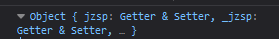

- 例外，不是所有data中的属性都是响应式的，被Object.freeze()设置为read-only的属性是不能响应式改变的，即便它放到了data中

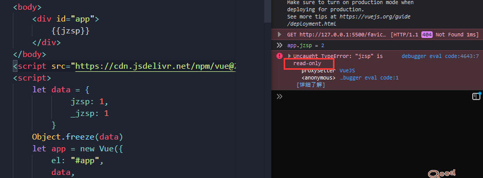


- 实例创建之后，可以通过 `vm.$data` 访问**原始数据对象**。**Vue 实例也挂载了 data 对象上所有的 property**，因此访问 `vm.a` 等价于访问 `vm.$data.a`。

```js
var data = { a: 1 }

// 直接创建一个实例
var vm = new Vue({
  data: data
})
vm.a // => 1
vm.$data === data // => true
```

- **Vue实例**不会挂载      `__`    或     `$`    开头的属性，也就不可以通过this._xxx获取了（输出undefined），但是可以通过this.$data._xxx获取

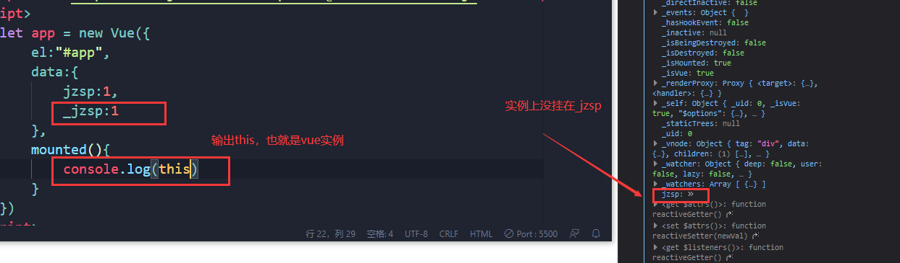

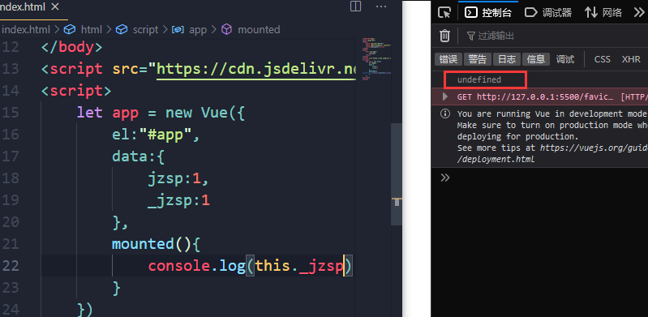

- 通过深拷贝获取原始数据对象（可以看到下面的数据对象是没有setter和getter的）

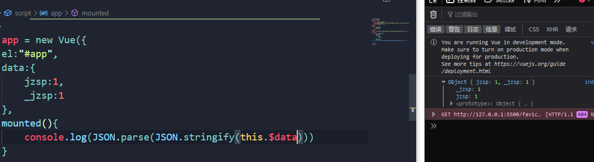

- **Vue组件的**`data` 必须声明为返回一个初始数据对象的函数，因为组件可能被用来创建多个实例。如果 `data` 仍然是一个**纯粹的对象**，则所有的实例将**共享引用**同一个数据对象！通过提供 `data` 函数，每次创建一个**新实例**后，我们能够调用 `data` 函数，从而返回初始数据的一个全新副本数据对象。

------

#### props

- props 可以是数组或对象，用于接收来自父组件的数据。props 可以是简单的数组，或者使用对象作为替代，对象允许配置高级选项，如类型检测、自定义验证和设置默认值。

你可以基于**对象的语法**使用以下选项：

- `type`：可以是下列原生构造函数中的一种：`String`、`Number`、`Boolean`、`Array`、`Object`、`Date`、`Function`、`Symbol`、任何自定义构造函数、或上述内容组成的数组。会检查一个 prop 是否是给定的类型，否则抛出警告。Prop 类型的[更多信息在此](https://cn.vuejs.org/v2/guide/components-props.html#Prop-类型)。
- `default`：`any`
  为该 prop 指定一个默认值。如果该 prop 没有被传入，则换做用这个值。对象或数组的默认值必须从一个**工厂函数（return [])**返回。
- `required`：`Boolean`
  定义该 prop 是否是必填项。在非生产环境中，如果这个值为 truthy 且该 prop 没有被传入的，则一个控制台警告将会被抛出。
- `validator`：`Function`
  自定义验证函数会将该 prop 的值作为唯一的参数代入。在非生产环境下，如果该函数返回一个 falsy 的值 (也就是验证失败)，一个控制台警告将会被抛出。你可以在[这里](https://cn.vuejs.org/v2/guide/components-props.html#Prop-验证)查阅更多 prop 验证的相关信息。

```js
// 简单语法
Vue.component('props-demo-simple', {
  props: ['size', 'myMessage']
})

// 对象语法，提供验证
Vue.component('props-demo-advanced', {
  props: {
    // 检测类型
    height: Number,
    // 检测类型 + 其他验证
    age: {
      type: Number,
      default: 0,
      required: true,
      validator: function (value) {
        return value >= 0
      }
    }
  }
})
```

------

#### computed

- 计算属性将被**混入到 Vue 实例**中。所有 getter 和 setter 的 this 上下文自动地绑定为 Vue 实例。
- 计算属性的结果会**被缓存**，除非**依赖的响应式 property 变化**才会重新计算。注意，如果某个依赖 (比如非响应式 property) 在该实例范畴之外，则计算属性是**不会**被更新的。


------

#### methods

- 注意，**不应该使用箭头函数来定义 method 函数** (例如 `plus: () => this.a++`)。理由是箭头函数绑定了父级作用域的上下文，所以 `this` 将不会按照期望指向 Vue 实例，`this.a` 将是 undefined。

在methods里声明的方法都会被挂载到vm上

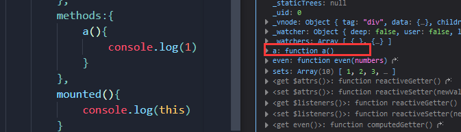

------

#### watch

- watch是一个对象，**键是需要观察的表达式**，**值是对应回调函数**。值也可以是**字符串方法名**，或者包含选项的对象。**Vue 实例将会在实例化时调用 `$watch()`**，遍历 watch 对象的每一个 property。

- value是方法名字符串，这个方法必须在实例的methods中声明，否则会报错，声明了的话会立即执行对应的方法

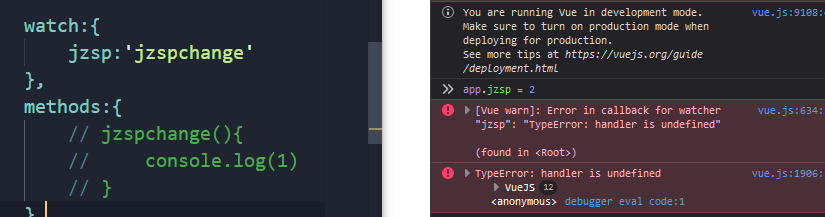

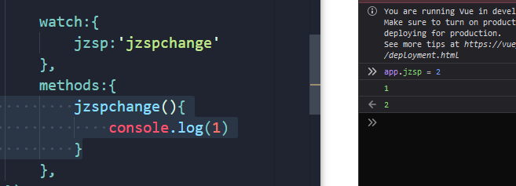

- value是对象且含有deep属性，会在**被侦听对象的属性**发生变化时调用回调

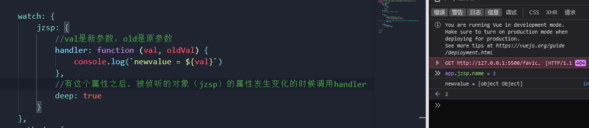

- value是对象且含有immediate属性，会在组件**实例化**的时候调用handler

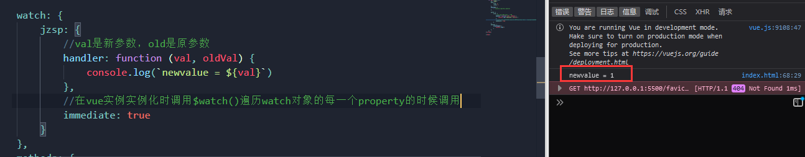

- value是回调数组

```js
// 你可以传入回调数组，它们会被逐一调用
// 如果是被监听的对象发生了改变，那么会按照数组顺序依次执行回调（因为每个数组对象的条件都能满足，都会被执行），如图
```
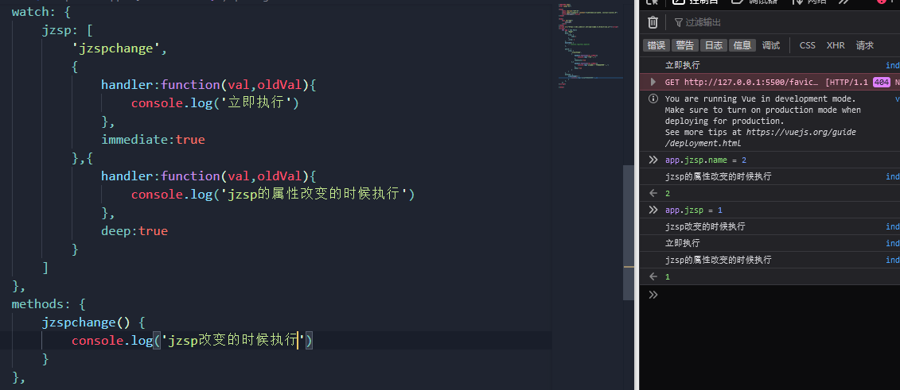

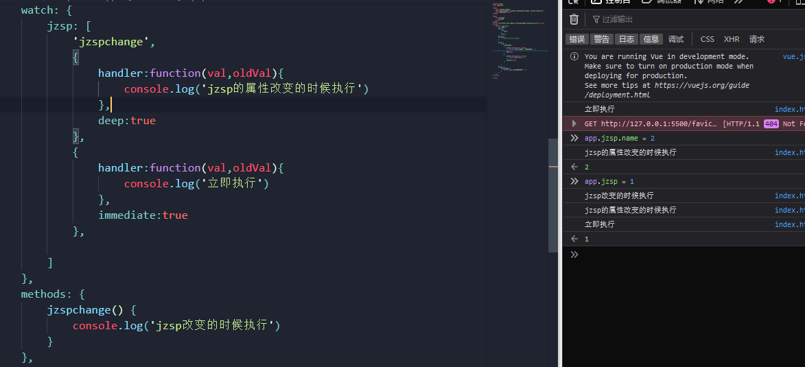

- 监听对象的某个属性改变

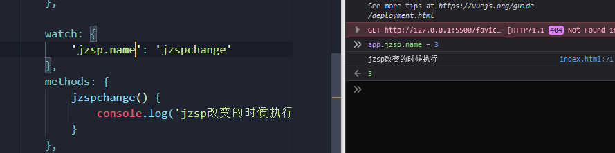

- 注意，**不应该使用箭头函数来定义 watcher 函数** (例如 `searchQuery: newValue => this.updateAutocomplete(newValue)`)。理由是箭头函数绑定了父级作用域的上下文，所以 `this` 将不会按照期望指向 Vue 实例，`this.updateAutocomplete` 将是 undefined。


### options（DOM）

------

#### el

指定挂载的dom元素


### 实例property

------

#### $data与$el

获取data对象和挂载的dom元素

```js
var data = { a: 1 }
var vm = new Vue({
  el: '#example',
  data: data
})

vm.$data === data // => true
vm.$el === document.getElementById('example') // => true
```

------

#### $options

获取初始化组件时的选项，可以设置自定义属性（直接在new Vue()传入不就好了。。。。）

```js
new Vue({
  customOption: 'foo',
  created: function () {
    console.log(this.$options.customOption) // => 'foo'
  }
})
```

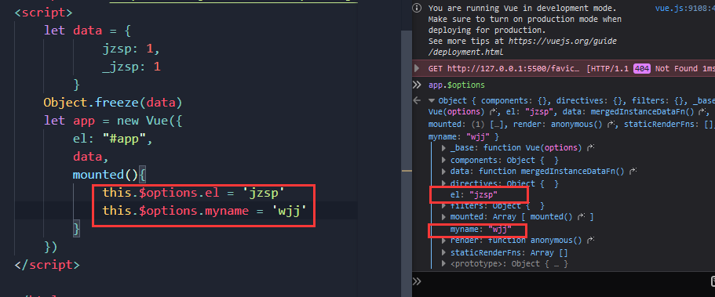


------

#### $parent

获取当前组件的父组件（如果存在的话）

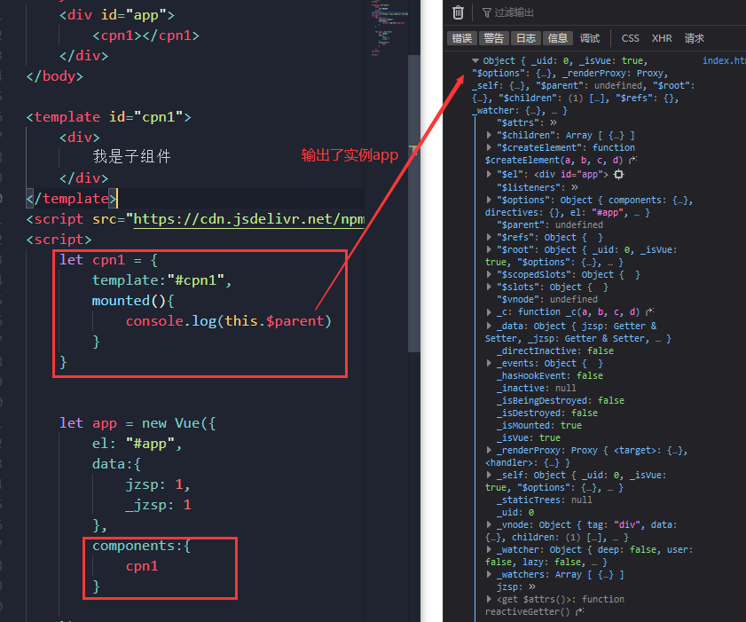

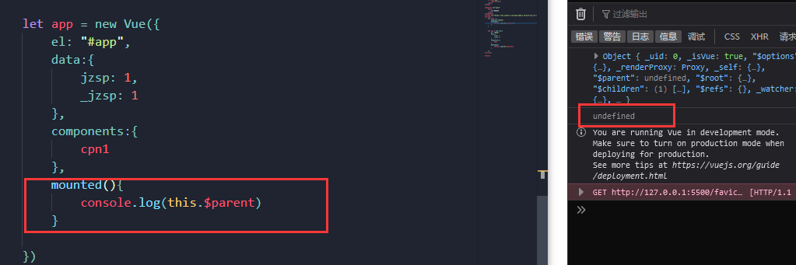

------

#### $root

获取当前组件处于组件树中的根节点的Vue实例，如果本身就是根实例，就会获取自己

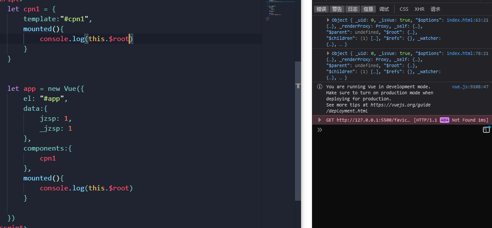

------

#### $children

获取到当前组件实例的直接子组件，**需要注意 `$children` 并不保证顺序，也不是响应式的。如果你发现自己正在尝试使用 `$children` 来进行数据绑定，请考虑使用一个数组配合 `v-for` 来生成子组件，并且使用 Array 作为真正的来源（不要使用$children作为响应式的数据来源）。**

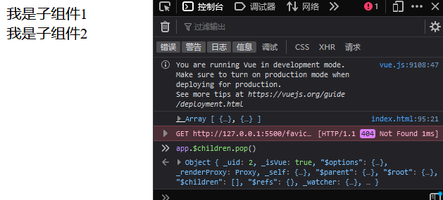


------

#### $slots

- 用来访问被[插槽分发](https://cn.vuejs.org/v2/guide/components.html#通过插槽分发内容)的内容。每个[具名插槽](https://cn.vuejs.org/v2/guide/components-slots.html#具名插槽)有其相应的 property (例如：`v-slot:foo` 中的内容将会在 `vm.$slots.foo` 中被找到)。`default` property 包括了所有**没有被包含在具名插槽中的节点**，或 `v-slot:default` 的内容。

  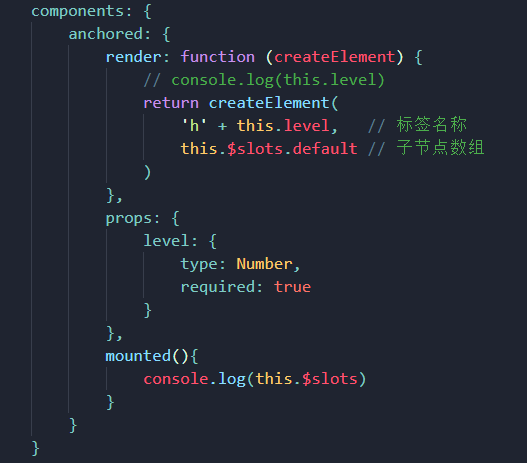

  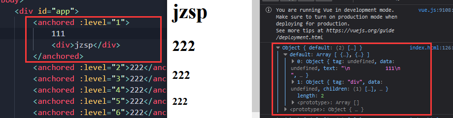

- 请注意插槽**不是**响应性的。如果你需要一个组件可以在被传入的数据发生变化时重渲染，我们建议改变策略，依赖诸如 `props` 或 `data` 等响应性实例选项。

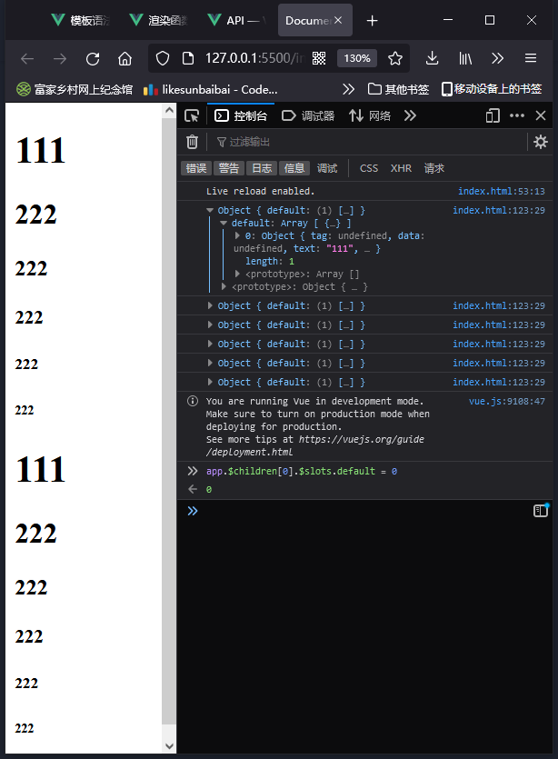


------

#### $scopedSlots


------

#### $refs

一个对象，里面封装了持有注册过 [`ref` attribute](https://cn.vuejs.org/v2/api/#ref) 的所有 DOM 元素和组件实例。

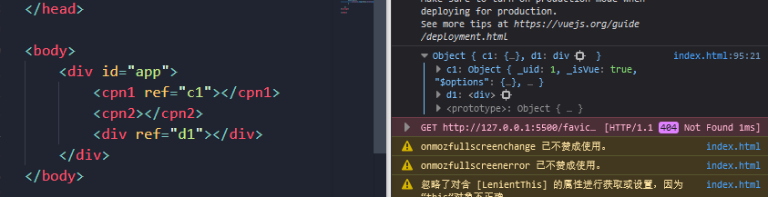

------

#### $isServer ？？？？？

当前 Vue 实例是否运行于服务器。

**参考**：[服务端渲染](https://cn.vuejs.org/v2/guide/ssr.html)

------

#### $attrs

- **类型**：`{ [key: string]: string }`

- **只读**

- **详细**：

  包含了父作用域中**不作为 prop 被识别 (且获取) 的 attribute 绑定 (`class` 和 `style` 除外)**。当一个组件没有声明任何 prop 时，这里会包含所有父作用域的绑定 (`class` 和 `style` 除外)，并且可以通过 `v-bind="$attrs"` 传入内部组件——在创建高级别的组件时非常有用。

可以看到，如果在组件标签上定义attribute（除了v-bind传给子组件props的attribute，例如图中的name），**会默认传给子组件最外层的div**，那么如果我想**传到子组件里的其他标签**怎么办呢？这个时候就要用到**$attrs**，因为**$attrs**保存了父组件中不作为prop的attr

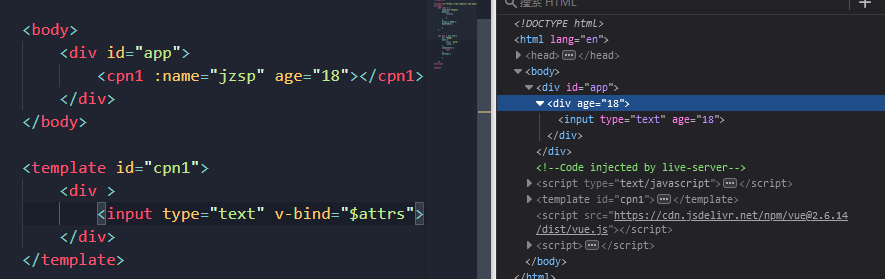

可此时子组件的外层div还是继承了传过来的属性，此时我们需要在组件实例里配置`inheritAttrs`属性为false

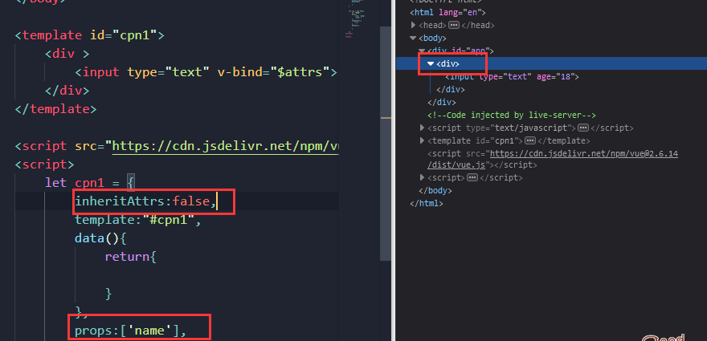

注意：在标签上定义的`class`和`style`attribute会在子组件最外层div中进行叠加，而其他的attribute则会覆盖

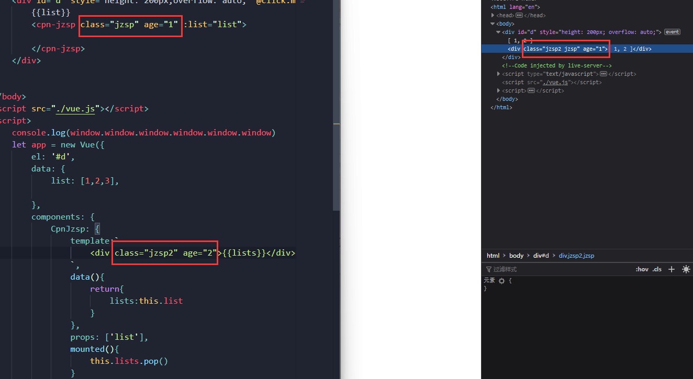

------

#### $listeners

- **类型**：`{ [key: string]: Function | Array<Function> }`

- **只读**

- **详细**：

  包含了父作用域中的 (不含 `.native` 修饰器的) `v-on` 事件**监听器**。它可以通过 `v-on="$listeners"` 传入内部组件——在创建更高层次的组件时非常有用。

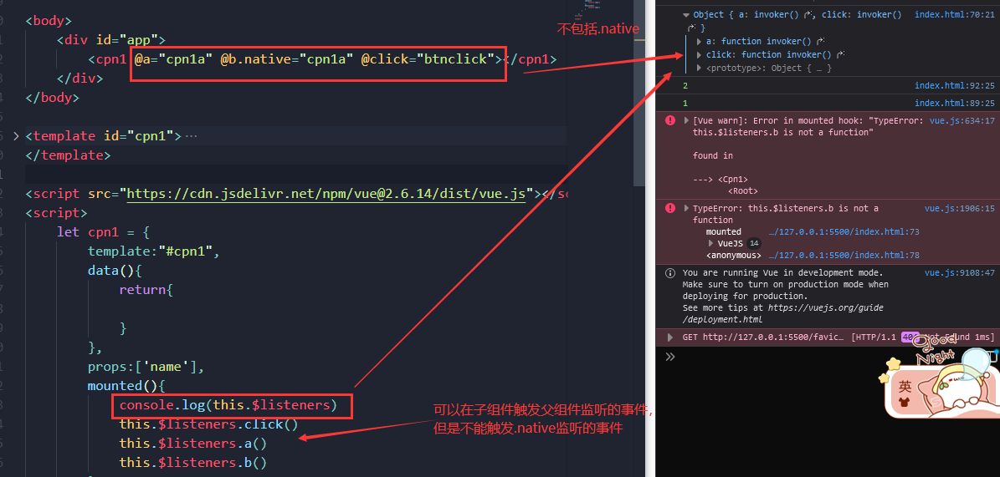

可以通过v-on="$listeners"传入子组件内部

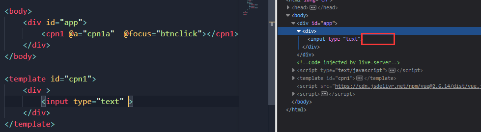

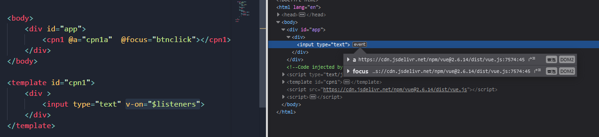

另外，被.native修饰的绑定事件会传入子组件的外层div

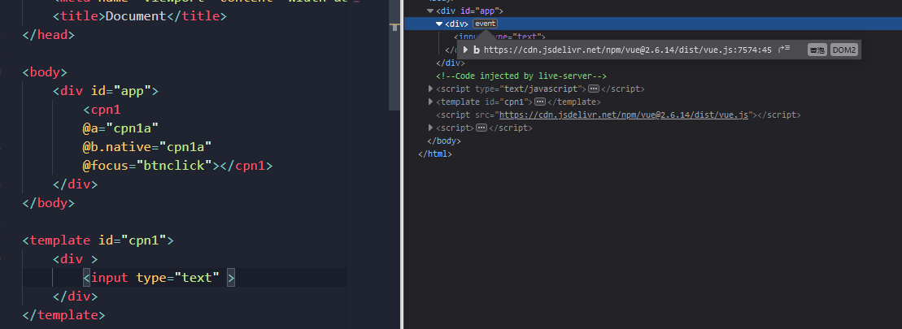


### 实例方法

------

#### $watch

组件在实例化的时候就是用这个方法遍历watch的每一个属性，设置属性改变时调用的handler

```js
// $watch 是一个实例方法
vm.$watch('a', function (newValue, oldValue) {
  // 这个回调将在 `vm.a` 改变后调用
})
```


### 实例生命周期钩子

- beforeCreate  

在实例初始化之后，进行数据侦听（$watch)和事件/侦听器的**配置之前**同步调用


- created

在实例创**建完成后被立即同步调用**。在这一步中，实例已完成对选项的处理，意味着以下内容已被配置完毕：**数据侦听、计算属性、方法、事件/侦听器的回调函数**。然而，挂载阶段还没开始，**且 `$el` property 目前尚不可用**。


- beforeMount

在挂载开始之前被调用：**相关的 `render` 函数首次被调用**。

> **该钩子在服务器端渲染期间不被调用。**


- mounted

实例被挂载后调用，这时 `el` 被新创建的 `vm.$el` 替换了。如果根实例挂载到了一个文档内的元素上，当 `mounted` 被调用时 `vm.$el` 也在文档内。

注意 `mounted` **不会**保证所有的子组件也都被挂载完成。如果你希望等到整个视图都渲染完毕再执行某些操作，可以在 `mounted` 内部使用 [vm.$nextTick](https://cn.vuejs.org/v2/api/#vm-nextTick)：

```js
mounted: function () {
  this.$nextTick(function () {
    // 仅在整个视图都被渲染之后才会运行的代码
  })
}
```

> **该钩子在服务器端渲染期间不被调用。**


- beforeUpdate

在数据发生改变后，DOM 被更新之前被调用。这里适合在现有 DOM 将要被更新之前访问它，比如移除手动添加的事件监听器。

> **该钩子在服务器端渲染期间不被调用，因为只有初次渲染会在服务器端进行。**


- updated

在数据更改导致的**虚拟 DOM 重新渲染和更新完毕之后**被调用。

当这个钩子被调用时，组件 DOM 已经更新（子组件的dom不一定渲染完毕），所以你现在可以执行依赖于 DOM 的操作。然而在大多数情况下，你应该避免在此期间更改状态。如果要相应状态改变，通常最好使用[计算属性](https://cn.vuejs.org/v2/api/#computed)或 [watcher](https://cn.vuejs.org/v2/api/#watch) 取而代之。

注意，`updated` **不会**保证所有的子组件也都被重新渲染完毕。如果你希望等到整个视图都渲染完毕，可以在 `updated` 里使用 [vm.$nextTick](https://cn.vuejs.org/v2/api/#vm-nextTick)：

```
updated: function () {
  this.$nextTick(function () {
    //  仅在整个视图都被重新渲染之后才会运行的代码     
  })
}
```

> **该钩子在服务器端渲染期间不被调用。**


- activated

被 keep-alive 缓存的组件激活时调用。

> **该钩子在服务器端渲染期间不被调用。**


- deactivated

被 keep-alive 缓存的组件失活时调用。

> **该钩子在服务器端渲染期间不被调用。**


- beforeDestroy

实例销毁之前调用。在这一步，实例仍然完全可用。

> **该钩子在服务器端渲染期间不被调用。**


- destroyed

实例销毁后调用。该钩子被调用后，对应 Vue 实例的所有指令都被解绑，所有的事件监听器被移除，所有的子实例也都被销毁。

> **该钩子在服务器端渲染期间不被调用。**


- errCaptured   ？？？？

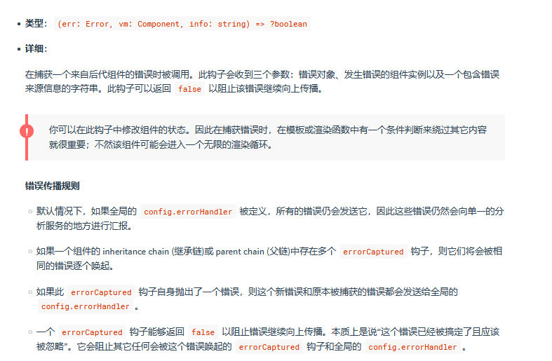


## 3、模板语法

Vue.js 使用了基于 HTML 的模板语法，允许开发者声明式地将 DOM 绑定至底层 Vue 实例的数据。

在底层的实现上，Vue 将模板编译成虚拟 DOM 渲染函数。结合响应系统，Vue 能够智能地计算出最少需要重新渲染多少组件，并把 DOM 操作次数减到最少。

如果你熟悉虚拟 DOM 并且偏爱 JavaScript 的原始力量，你也可以不用模板，[直接写渲染 (render) 函数](https://cn.vuejs.org/v2/guide/render-function.html)，使用可选的 JSX 语法。

### 指令

指令 (Directives) 是带有 `v-` 前缀的特殊 attribute。指令 attribute 的值预期是**单个 JavaScript 表达式** (`v-for` 是例外情况，稍后我们再讨论)。指令的职责是，当表达式的值改变时，将其产生的连带影响，响应式地作用于 DOM。

------

#### 参数

一些指令能够接收一个“参数”，在指令名称之后以冒号表示。例如，`v-bind` 指令可以用于响应式地更新 HTML attribute：

```html
<a v-bind:href="url">...</a>
```

在这里 `href` 是参数，告知 `v-bind` 指令将该元素的 `href` attribute 与表达式 `url` 的值绑定。

另一个例子是 `v-on` 指令，它用于监听 DOM 事件：

```html
<a v-on:click="doSomething">...</a>
```

在这里参数是监听的事件名。我们也会更详细地讨论事件处理。

------

#### 动态参数

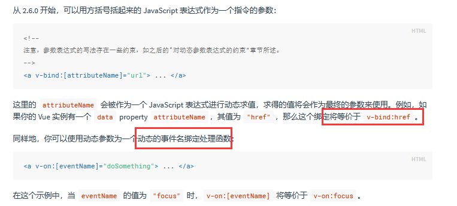

- **对动态参数的值的约束**

动态参数预期会求出一个字符串，异常情况下值为 `null`。这个特殊的 `null` 值可以被显性地用于移除绑定。任何其它非字符串类型的值都将会触发一个警告。

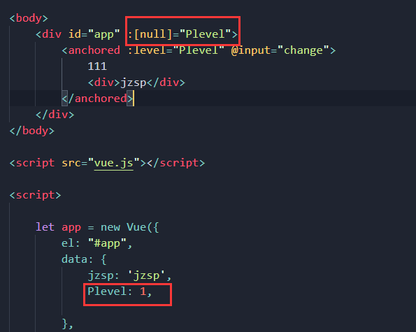

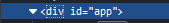

修改成jzsp

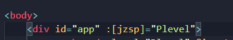

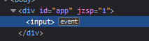


- **对动态参数表达式的约束**

动态参数表达式有一些语法约束，因为某些字符，如空格和引号，放在 HTML attribute 名里是无效的。例如：

```html
<!-- 这会触发一个编译警告 -->
<a v-bind:['foo' + bar]="value"> ... </a>
```

变通的办法是使用没有空格或引号的表达式，或用计算属性替代这种复杂表达式。

在 DOM 中使用模板时 (直接在一个 HTML 文件里撰写模板)，还需要避免使用大写字符来命名键名，因为浏览器会把 attribute 名全部强制转为小写：

```html
<!--
在 DOM 中使用模板时这段代码会被转换为 `v-bind:[someattr]`。
除非在实例中有一个名为“someattr”的 property，否则代码不会工作。
-->
<a v-bind:[someAttr]="value"> ... </a>
```

------

#### 修饰符

修饰符 (modifier) 是以半角句号 `.` 指明的特殊后缀，用于指出一个指令应该以特殊方式绑定。例如，`.prevent` 修饰符告诉 `v-on` 指令对于触发的事件调用 `event.preventDefault()`：

```html
<form v-on:submit.prevent="onSubmit">...</form>
```


## 4、特殊attribute

### is


### key

- 预期：`number | string | boolean (2.4.2 新增) | symbol (2.5.12 新增)`

> 不要使用对象或数组之类的非基本类型值作为 `v-for` 的 `key`。请用字符串或数值类型的值。

`key` 的特殊 attribute 主要用在 **Vue 的虚拟 DOM 算法**，在新旧 nodes 对比时辨识  VNodes。如果不使用 key，Vue 会使用一种**最大限度减少动态元素并且尽可能的尝试就地修改/复用相同类型元素的算法**。而使用 key  时，它会基于 key 的变化重新排列元素顺序，并且会移除 key 不存在的元素。

有相同父元素的子元素必须有**独特的 key**。重复的 key 会造成渲染错误。

最常见的用例是结合 `v-for`：

```
<ul>
  <li v-for="item in items" :key="item.id">...</li>
</ul>
```

它也可以用于强制替换元素/组件而不是重复使用它。当你遇到如下场景时它可能会很有用：

- 完整地触发组件的生命周期钩子（key不一样的话，组件就会是替换而不是复用/修改）
- 触发过渡

例如：

```
<transition>
  <span :key="text">{{ text }}</span>
</transition>
```

当 `text` 发生改变时，`<span>` 总是会**被替换而不是被修改**，因此会触发过渡。


## 5、计算属性和侦听器

### 计算属性不能直接传入参数

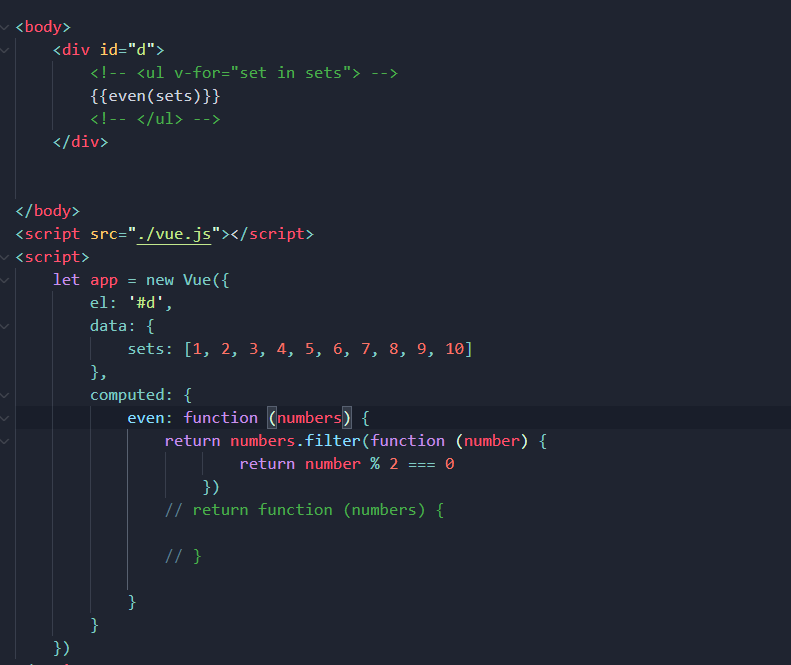

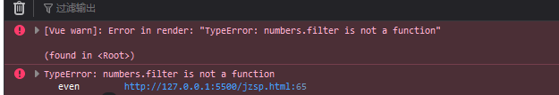

但可以返回一个带参数的函数

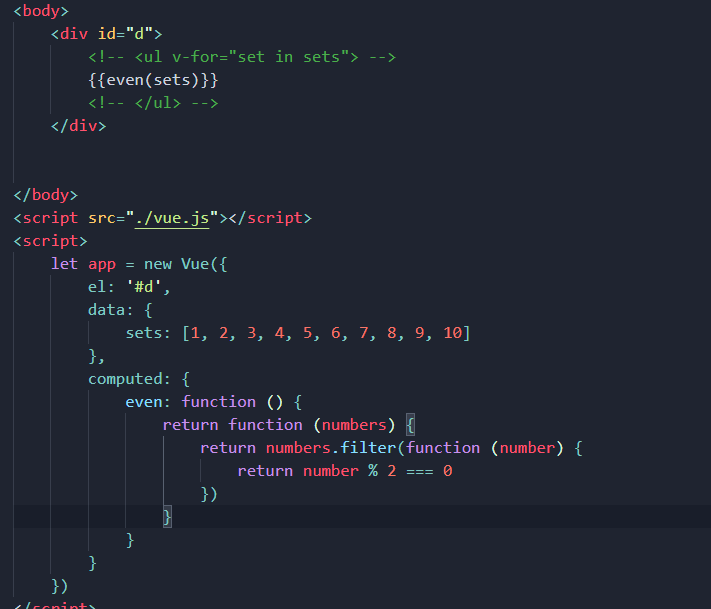

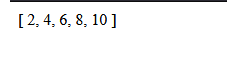

### 计算属性的缓存

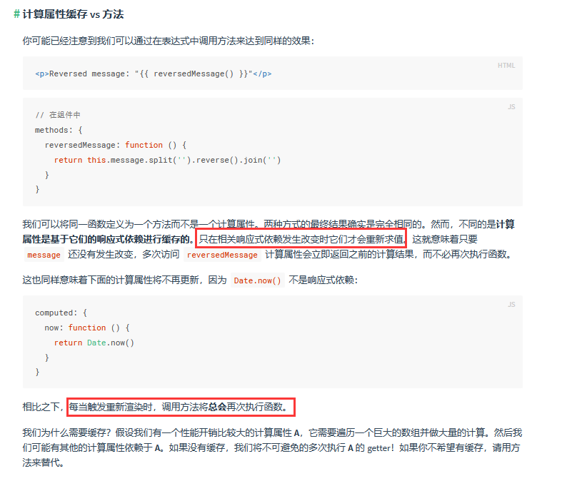

### setter（只能说用的很少）

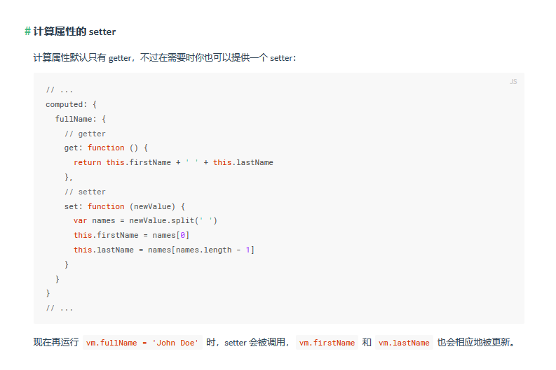

### 侦听器


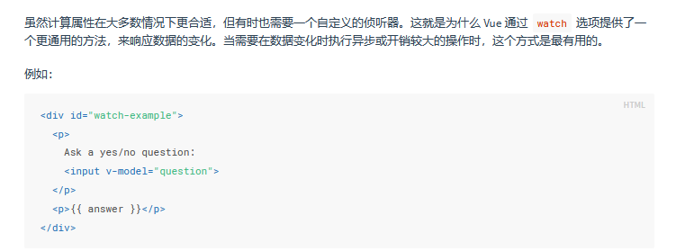

```js
<!-- 因为 AJAX 库和通用工具的生态已经相当丰富，Vue 核心代码没有重复 -->
<!-- 提供这些功能以保持精简。这也可以让你自由选择自己更熟悉的工具。 -->
<script src="https://cdn.jsdelivr.net/npm/axios@0.12.0/dist/axios.min.js"></script>
<script src="https://cdn.jsdelivr.net/npm/lodash@4.13.1/lodash.min.js"></script>
<script>
var watchExampleVM = new Vue({
  el: '#watch-example',
  data: {
    question: '',
    answer: 'I cannot give you an answer until you ask a question!'
  },
  watch: {
    // 如果 `question` 发生改变，这个函数就会运行
    //因为每输入一个字，都会触发这个函数，而这个函数里面调用的debouncedxxx函数是经过节流处理的，不会反复执行
    question: function (newQuestion, oldQuestion) {
      this.answer = 'Waiting for you to stop typing...'
      this.debouncedGetAnswer()
    }
  },
  created: function () {
    // `_.debounce` 是一个通过 Lodash 限制操作频率的函数。返回值是一个经过处理的防抖函数
    this.debouncedGetAnswer = _.debounce(this.getAnswer, 500)
  },
  methods: {
    getAnswer: function () {
        //判断是否存在问号
      if (this.question.indexOf('?') === -1) {
        this.answer = 'Questions usually contain a question mark. ;-)'
        return
      }
      this.answer = 'Thinking...'
      var vm = this
      axios.get('https://yesno.wtf/api')
        .then(function (response) {
          //capitalize使得第一个字母大写，其他字母小写
          vm.answer = _.capitalize(response.data.answer)
        })
        .catch(function (error) {
          vm.answer = 'Error! Could not reach the API. ' + error
        })
    }
  }
})
</script>
```

## 6、条件渲染

### v-if渲染不同模板复用问题

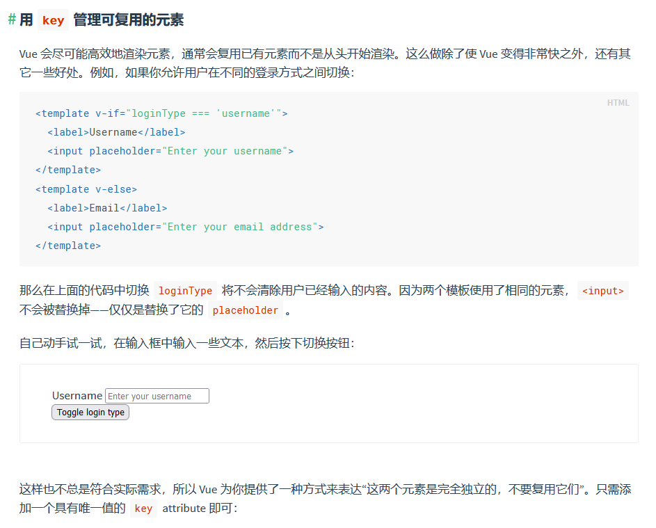


### v-show和v-if的区别

切换次数多的时候用v-show，条件改变少的话用v-if

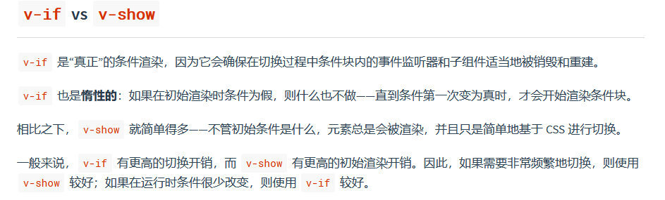


### v-if和v-for

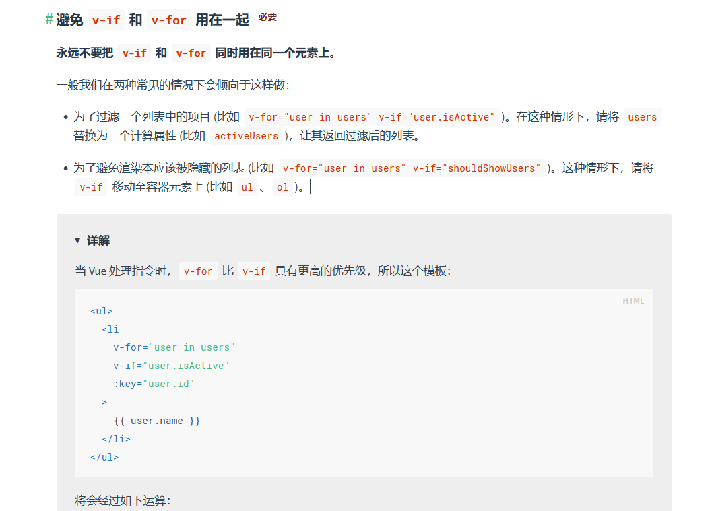

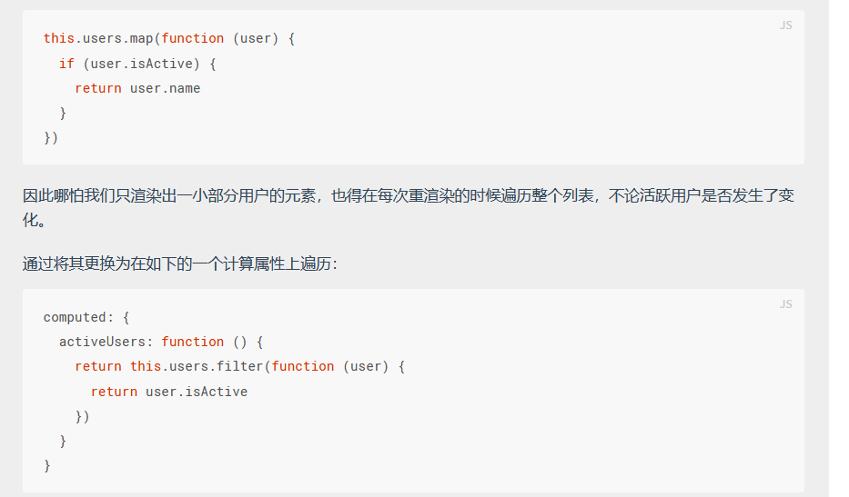

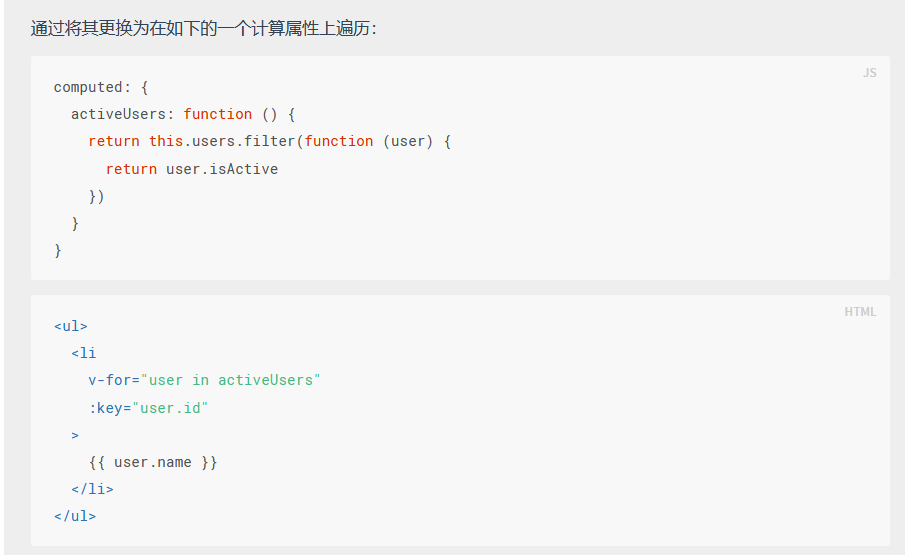

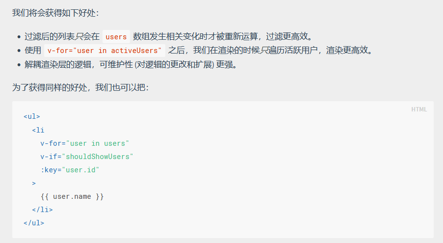

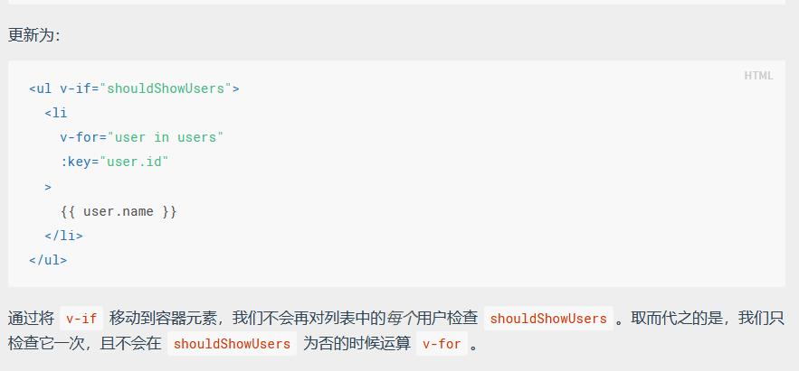


## 7、列表渲染

- 渲染数组：v-for="(item,index) in list"
- 渲染对象：v-for="(value,name,index) in list"

### 维护状态


### 数组更新检测

响应式的数组变更（会改变原数组）方法


一些不会改变原数组的方法，可以直接赋值，这样不但不会导致vue丢弃现有dom重新渲染，反而更高效（Vue 为了使得 DOM 元素得到最大范围的重用而实现了一些智能的启发式方法）

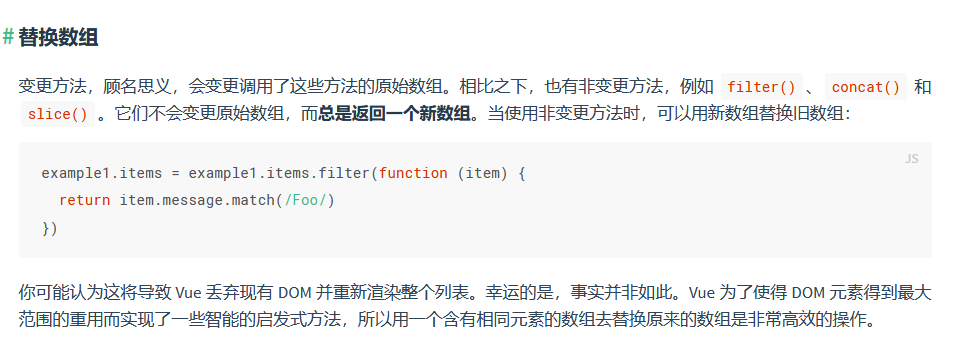

不是响应式的数组操作

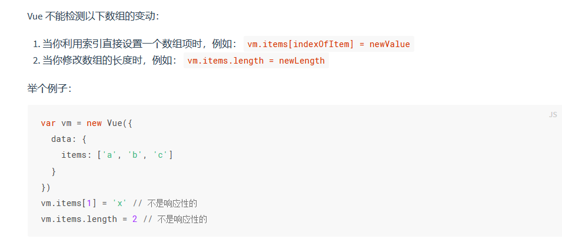

### 显示过滤/排序后的结果

确实。。。计算属性真强大

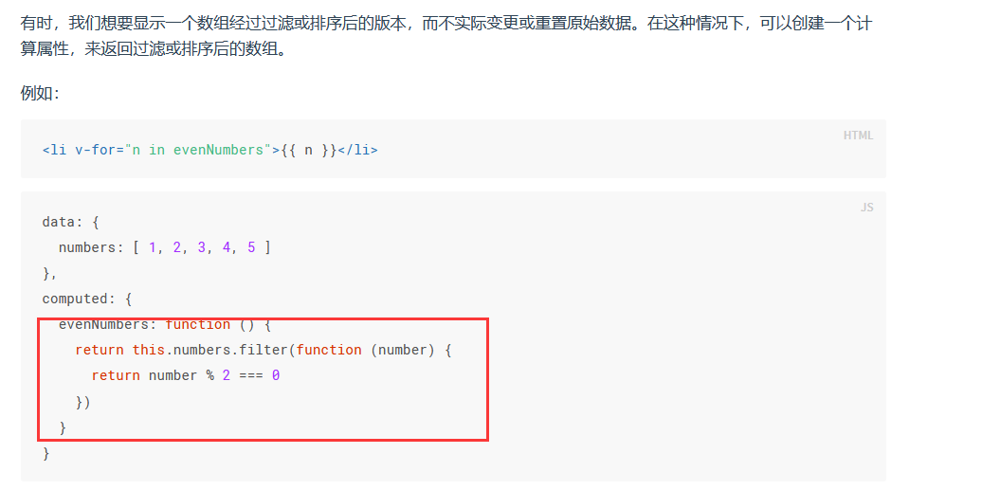

### v-for使用值作为范围

`v-for` 也可以接受整数。在这种情况下，它会把模板重复对应次数。

```html
<div>
  <span v-for="n in 10">{{ n }} </span>
</div>
```

### 在组件上使用v-for

- 在组件上使用v-for与在其他标签上使用v-for是一样的

```html
<my-component v-for="item in items" :key="item.id"></my-component>
```

- 必须要加key
- 要想将item值传入组件，必须父子组件通信，默认是不传入数据的，因为组件有自己的作用域

```js
<my-component
  v-for="(item, index) in items"
  v-bind:item="item"
  v-bind:index="index"
  v-bind:key="item.id"
></my-component>
```

## 8、事件处理

- 在内联js中一般是接收需要调用的方法名（在methods中声明的方法的方法名）
- 也可以在onclick的时候执行methods中的方法，如下

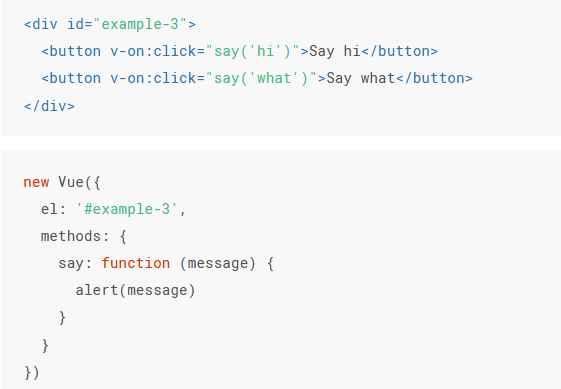

- 用$event传入原生dom事件对象（具体见vue的笔记）

### 事件修饰符

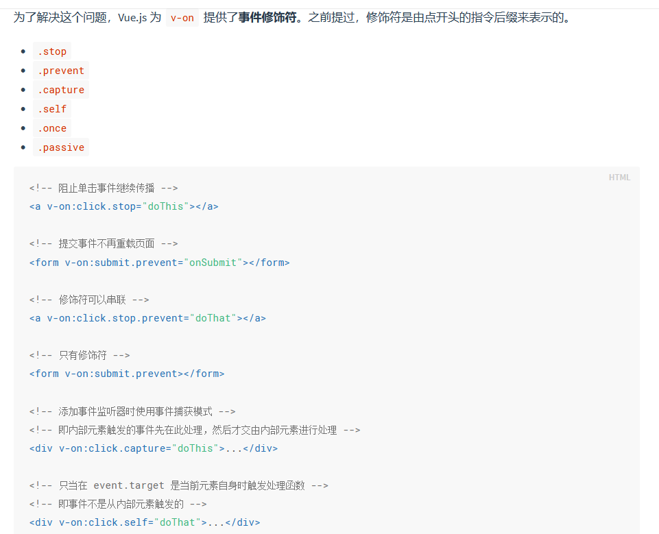

> 使用修饰符时，顺序很重要；相应的代码会以同样的顺序产生。因此，用 `v-on:click.prevent.self` 会阻止**所有的点击**，而 `v-on:click.self.prevent` 只会阻止对元素自身的点击。

#### passive修饰符

该修饰符表示就是设置{passive:true}，表示处理事件函数中不会调用preventDefault函数，就会减少了额外的监听，从而提高了性能；所以不能和.prevent修饰符一同使用，否则浏览器会报错。

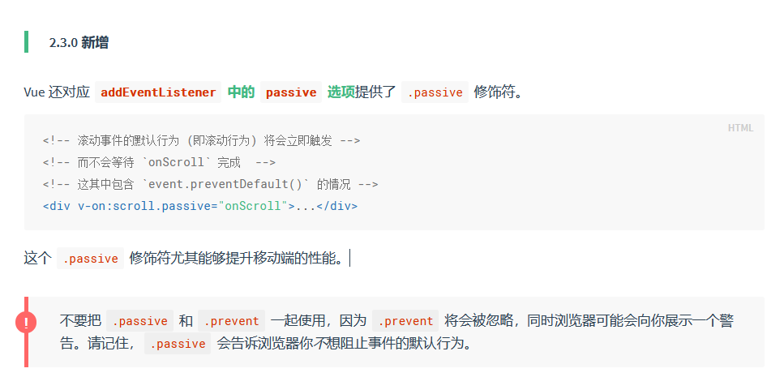

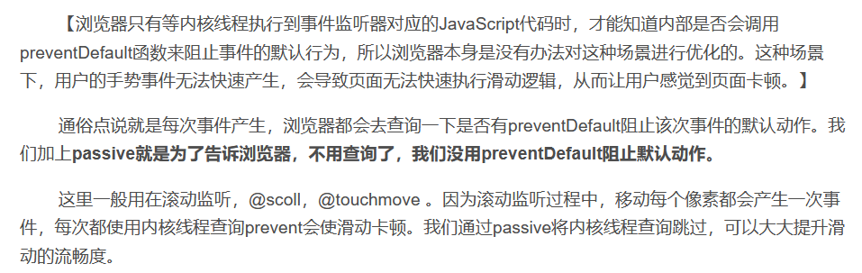

### 按键修饰符

在监听键盘事件时，我们经常需要检查详细的按键。Vue 允许为 `v-on` 在监听键盘事件时添加按键修饰符：

```html
<!-- 只有在 `key` 是 `Enter` 时调用 `vm.submit()` -->
<input v-on:keyup.enter="submit">
```

你可以直接将 [`KeyboardEvent.key`](https://developer.mozilla.org/en-US/docs/Web/API/KeyboardEvent/key/Key_Values) 暴露的任意有效按键名转换为 kebab-case 来作为修饰符。

```html
<input v-on:keyup.page-down="onPageDown">
```

在上述示例中，处理函数只会在 `$event.key` 等于 `PageDown` 时被调用。

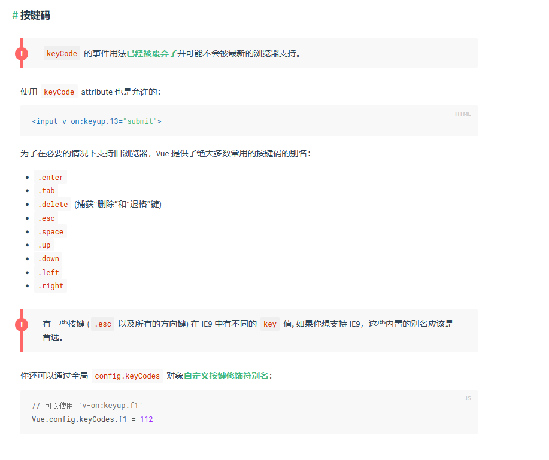

### 系统修饰键

> 2.1.0 新增

可以用如下修饰符来实现**仅在按下相应按键时才触发鼠标或键盘事件的监听器**。

- `.ctrl`
- `.alt`
- `.shift`
- `.meta`

> 注意：在 Mac 系统键盘上，meta 对应 command 键 (⌘)。在 Windows 系统键盘 meta 对应 Windows  徽标键 (⊞)。在 Sun 操作系统键盘上，meta 对应实心宝石键 (◆)。在其他特定键盘上，尤其在 MIT 和 Lisp  机器的键盘、以及其后继产品，比如 Knight 键盘、space-cadet 键盘，meta 被标记为“META”。在 Symbolics  键盘上，meta 被标记为“META”或者“Meta”。

例如：

```html
<!-- Alt + C -->
<input v-on:keyup.alt.67="clear">

<!-- Ctrl + Click -->
<div v-on:click.ctrl="doSomething">Do something</div>
```

请注意修饰键与常规按键不同，在和 `keyup` 事件一起用时，事件触发时修饰键必须处于按下状态。换句话说，只有在按住 `ctrl` 的情况下释放其它按键，才能触发 `keyup.ctrl`。而单单释放 `ctrl` 也不会触发事件。如果你想要这样的行为，请为 `ctrl` 换用 `keyCode`：`keyup.17`。

#### exact修饰符

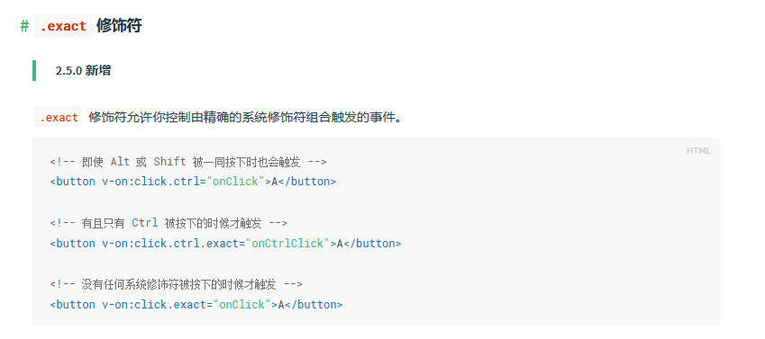

### 鼠标按钮修饰符以及


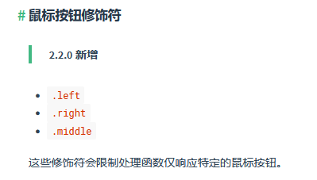

## 9、表单输入绑定

### 基础用法

`v-model` 在内部为不同的输入元素使用不同的 property 并抛出不同的事件：

- text 和 textarea 元素使用 `value` property 和 `input` 事件；
- checkbox 和 radio 使用 `checked` property 和 `change` 事件；
- select 字段将 `value` 作为 prop 并将 `change` 作为事件。

#### 文本

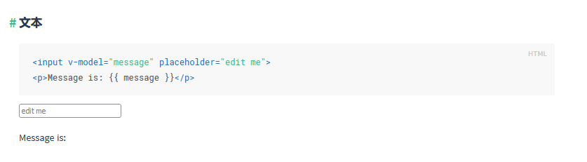

#### 多行文本

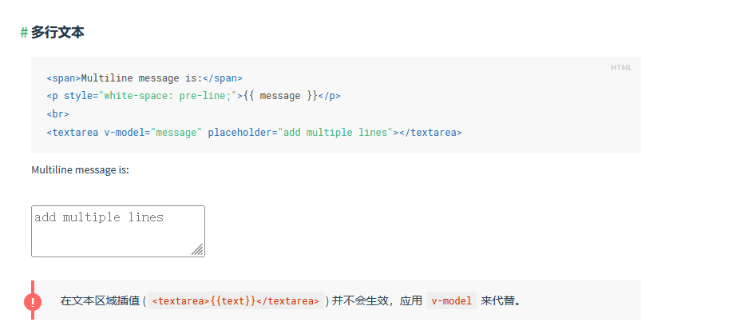

#### 复选框

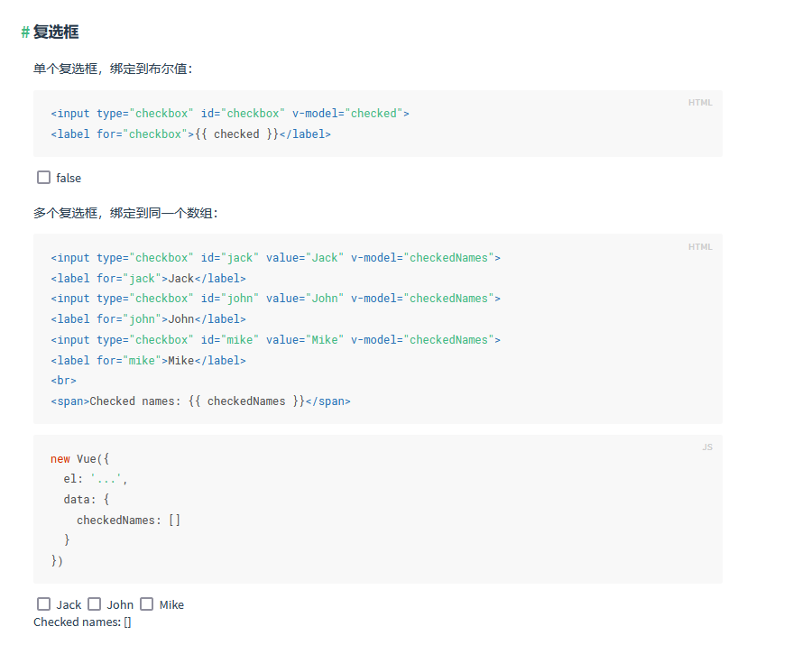


#### 单选按钮

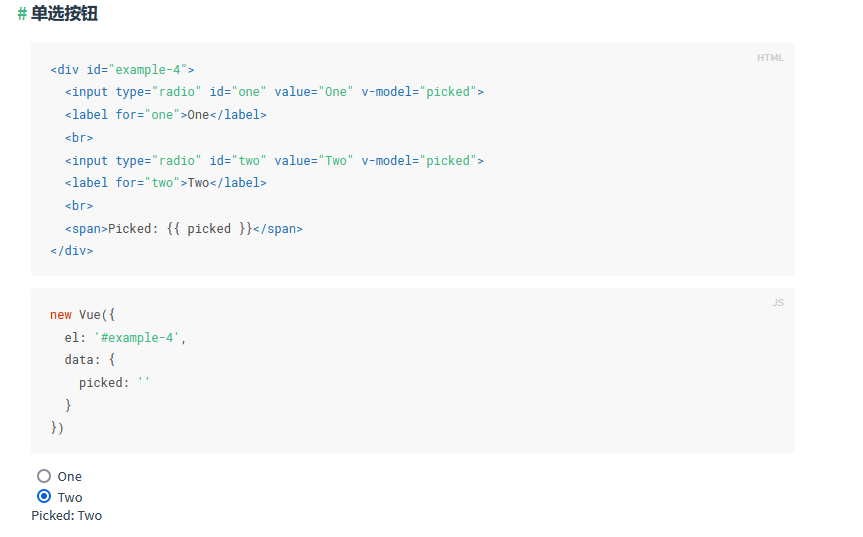

#### 单选框

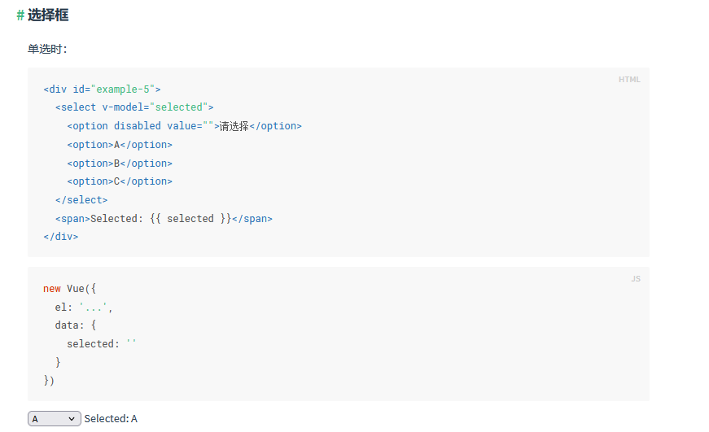

#### 多选框

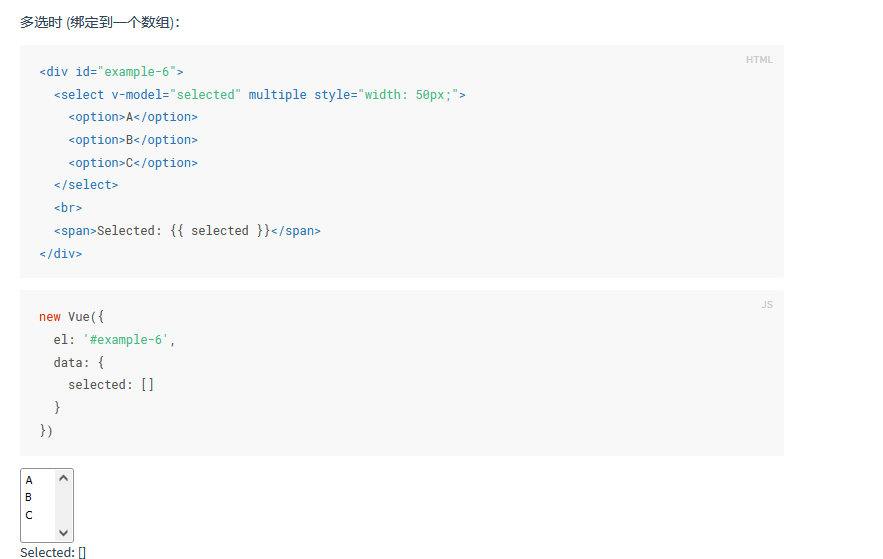

### v-bind:value

#### 单选按钮，（单个）复选框，选择框

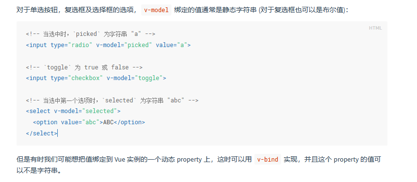

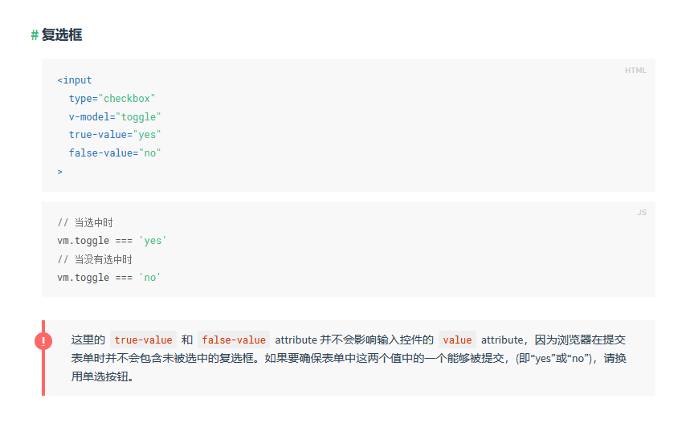

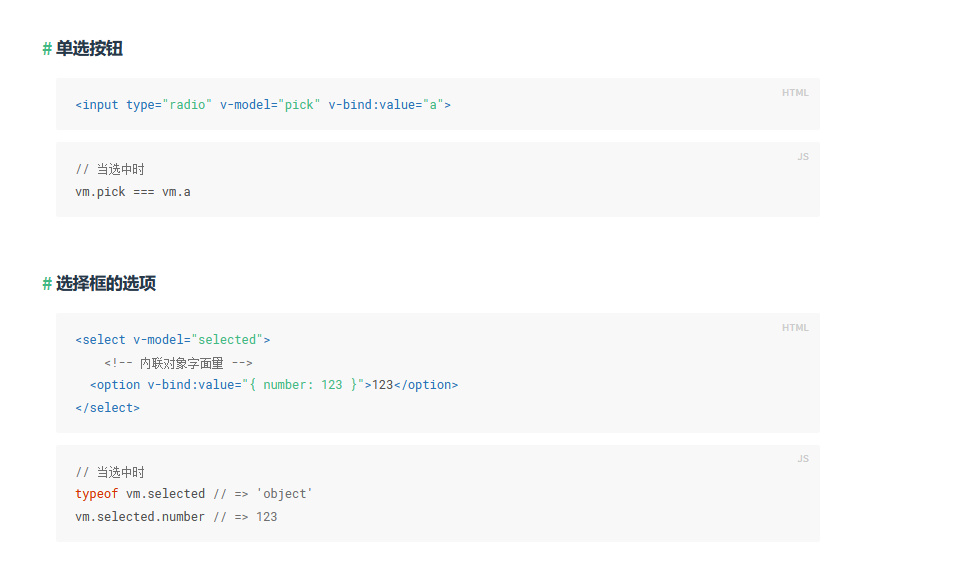

### 修饰符

#### .lazy

在默认情况下，`v-model` 在每次 `input` 事件触发后将输入框的值与数据进行同步 (除了[上述](https://cn.vuejs.org/v2/guide/forms.html#vmodel-ime-tip)输入法组合文字时)。你可以添加 `lazy` 修饰符，从而转为在 `change` 事件_之后_进行同步（也就是只有输入了，并且失去焦点的时候触发，而不是每次输入都会触发）

```html
<!-- 在“change”时而非“input”时更新 -->
<input v-model.lazy="msg">
```


#### .number

如果想自动将用户的输入值转为数值类型，可以给 `v-model` 添加 `number` 修饰符：

```html
<input v-model.number="age" type="number">
```

这通常很有用，因为即使在 `type="number"` 时，HTML 输入元素的值也总会返回字符串。**如果这个值无法被 `parseFloat()` 解析，则会返回原始的值。**

> **注意**，如果先输入的是数字类型，到后面输入其他字符会被过滤掉（因为parseFloat只转换第一个除了.和数字字符以外的字符**前面**的number）

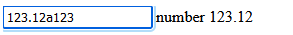

> 如果先输入的是其他字符，返回的就是字符串类型了，并且是整个字符串（没有过滤）

 	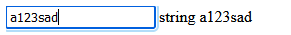

#### .trim

去掉收尾空格

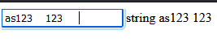


### 组件使用v-model


## 10、组件基础

### 组件的data必须是函数

```js
data: function () {
  return {
    count: 0
  }
}
```

只有这样，在组件复用的时候，每个组件实例才有自己的作用域，不会影响其他被复用的组件。官方的说法是：**因此每个实例可以维护一份被返回对象的独立的拷贝**


### 监听子组件

监听子组件其实就是，子组件利用this.$emit('方法名')向父组件发射一个方法，然后父组件在用到子组件的地方用v-on监听这个事件名。**如果要传值的话，在$emit的第二个参数中传值，会在父组件中绑定的监听事件的一个参数中传入（其实就是封装到了event事件中，如下所示）**

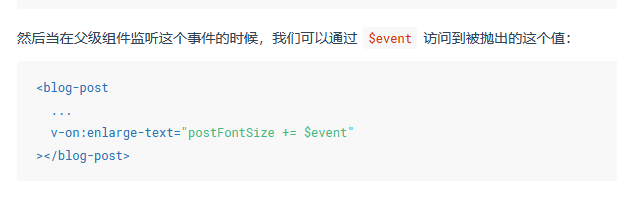

- 子组件代码如下

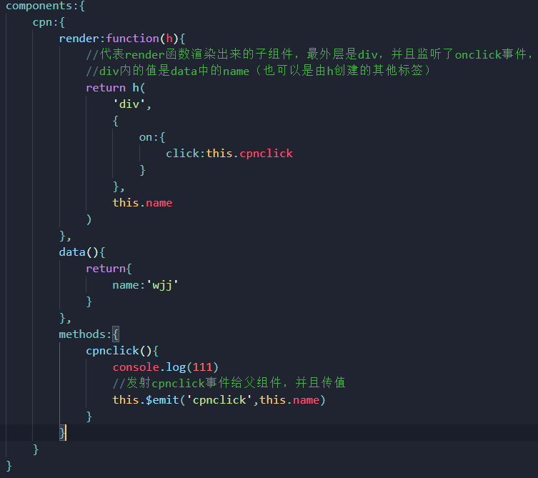

- 父组件代码如下

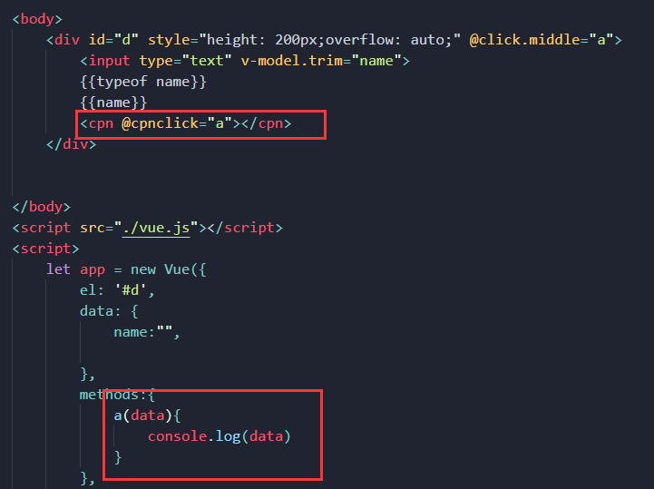

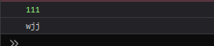

### 组件的v-model

v-model可以分为v-bind和v-on，组件的v-model的本质就是v-bind将父组件的变量传入子组件，然后在子组件触发input事件的时候，发射一个名为input的事件让父组件监听，在这个监听的事件中进行赋值。

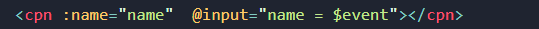

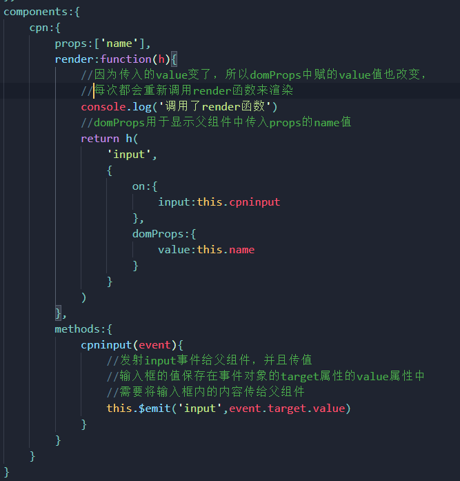

每次数据变了会重新触发render函数来渲染子组件

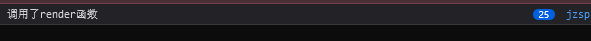

### 动态组件

动态组件可以通过`component`标签的`is` attribute来指定这个component标签要渲染什么组件

**is可以是注册的组件名，或者组件选项对象，下面是绑定组件选项对象的例子**

```html
<!DOCTYPE html>
<html>
  <head>
    <title>Dynamic Components Example</title>
    <script src="https://unpkg.com/vue"></script>
    <style>
      .tab-button {
        padding: 6px 10px;
        border-top-left-radius: 3px;
        border-top-right-radius: 3px;
        border: 1px solid #ccc;
        cursor: pointer;
        background: #f0f0f0;
        margin-bottom: -1px;
        margin-right: -1px;
      }
      .tab-button:hover {
        background: #e0e0e0;
      }
       //当同时有tab-button 和active这两个类的时候生效
      .tab-button.active {
        background: #e0e0e0;
      }
      .tab {
        border: 1px solid #ccc;
        padding: 10px;
      }
    </style>
  </head>
  <body>
    <div id="dynamic-component-demo" class="demo">
      <!--在点击按钮的时候切换currentTab的值以及active-->
      <button
        v-for="tab in tabs"
        v-bind:key="tab"
        v-bind:class="['tab-button', { active: currentTab === tab }]"
        v-on:click="currentTab = tab"
      >
        {{ tab }}
      </button>

      <component v-bind:is="currentTabComponent" class="tab"></component>
    </div>

    <script>
        //全局注册的组件
      Vue.component("tab-home", {
        template: "<div>Home component</div>"
      });
      Vue.component("tab-posts", {
        template: "<div>Posts component</div>"
      });
      Vue.component("tab-archive", {
        template: "<div>Archive component</div>"
      });

      new Vue({
        el: "#dynamic-component-demo",
        data: {
          currentTab: "Home",
          tabs: ["Home", "Posts", "Archive"]
        },
        computed: {
            //动态返回组件名
          currentTabComponent: function () {
            return "tab-" + this.currentTab.toLowerCase();
          }
        }
      });
    </script>
  </body>
</html>

```

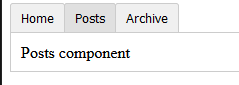


### 解析DOM模板时的注意事项

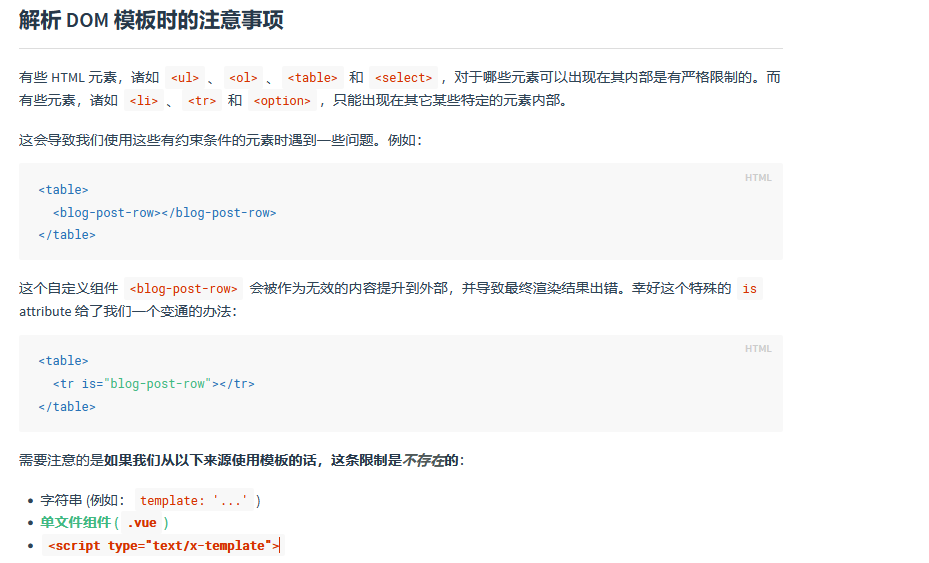


# 二、深入了解组件

## 注册组件

### 组件名

组件名的方式有两种

- kebab-case

```
Vue.component('my-component-name', { /* ... */ })
```

当使用 kebab-case (**短横线分隔命名**) 定义一个组件时，你也必须在引用这个自定义元素时使用 kebab-case，例如 `<my-component-name>`。

- PascalCase

当使用 PascalCase (**首字母大写命名**) 定义一个组件时，你在**引用**这个自定义元素时**两种命名法都可以使用**。也就是说 `<my-component-name>` 和 `<MyComponentName>` 都是可接受的。注意，尽管如此，直接在 **DOM** (即非字符串的模板) 中使用时只有 **kebab-case 是有效的**。

组件定义

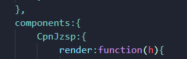

首字母大写命名，在dom中无法被解析

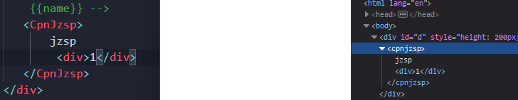

短线分割可以被解析

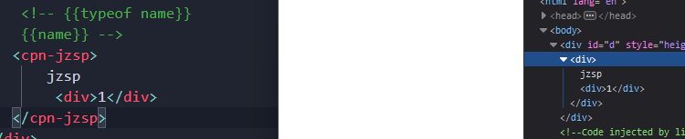

### 全局注册

这些组件是**全局注册的**（第一个参数是组件名，第二个参数是Vue实例的options对象）。也就是说它们在注册之后可以用在**任何新创建的 Vue 根实例 (`new Vue`) 的模板中**。比如：

```html
Vue.component('component-a', { /* ... */ })
Vue.component('component-b', { /* ... */ })
Vue.component('component-c', { /* ... */ })

new Vue({ el: '#app' })
<div id="app">
  <component-a></component-a>
  <component-b></component-b>
  <component-c></component-c>
</div>
```

在所有子组件中也是如此，也就是说这三个组件*在各自内部*也都可以相互使用。

### 局部注册

声明在Vue实例的components属性中

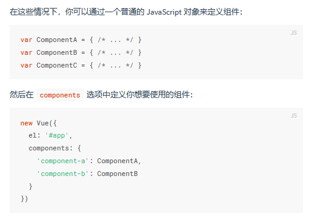

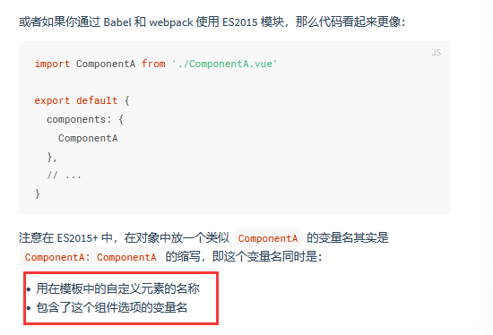

### 基础组件的自动化全局注册（没尝试过，先记录一下）

可能你的许多组件只是包裹了一个输入框或按钮之类的元素，是相对通用的。我们有时候会把它们称为[基础组件](https://cn.vuejs.org/v2/style-guide/#基础组件名-强烈推荐)，它们会在各个组件中被频繁的用到。

所以会导致很多组件里都会有一个包含基础组件的长列表：

```js
import BaseButton from './BaseButton.vue'
import BaseIcon from './BaseIcon.vue'
import BaseInput from './BaseInput.vue'

export default {
  components: {
    BaseButton,
    BaseIcon,
    BaseInput
  }
}
```

而只是用于模板中的一小部分：

```html
<BaseInput
  v-model="searchText"
  @keydown.enter="search"
/>
<BaseButton @click="search">
  <BaseIcon name="search"/>
</BaseButton>
```

如果你恰好使用了 webpack (或在内部使用了 webpack 的 [Vue CLI 3+](https://github.com/vuejs/vue-cli))，那么就可以使用 `require.context` 只全局注册这些非常通用的基础组件。这里有一份可以让你在应用入口文件 (比如 `src/main.js`) 中全局导入基础组件的示例代码：

```js
import Vue from 'vue'
import upperFirst from 'lodash/upperFirst'
import camelCase from 'lodash/camelCase'

const requireComponent = require.context(
  // 其组件目录的相对路径
  './components',
  // 是否查询其子目录
  false,
  // 匹配基础组件文件名的正则表达式
  /Base[A-Z]\w+\.(vue|js)$/
)

requireComponent.keys().forEach(fileName => {
  // 获取组件配置
  const componentConfig = requireComponent(fileName)

  // 获取组件的 PascalCase 命名
  const componentName = upperFirst(
    camelCase(
      // 获取和目录深度无关的文件名
      fileName
        .split('/')
        .pop()
        .replace(/\.\w+$/, '')
    )
  )

  // 全局注册组件
  Vue.component(
    componentName,
    // 如果这个组件选项是通过 `export default` 导出的，
    // 那么就会优先使用 `.default`，
    // 否则回退到使用模块的根。
    componentConfig.default || componentConfig
  )
})
```

记住**全局注册的行为必须在根 Vue 实例 (通过 `new Vue`) 创建之前发生**。[这里](https://github.com/chrisvfritz/vue-enterprise-boilerplate/blob/master/src/components/_globals.js)有一个真实项目情景下的示例。

## props

### prop的大小写

HTML 中的 **attribute 名是大小写不敏感**的，所以浏览器会把所有大写字符**解释为小写字符**。这意味着当你使用 DOM 中的模板时，camelCase (驼峰命名法) 的 prop 名需要使用其等价的 kebab-case (短横线分隔命名) 命名：

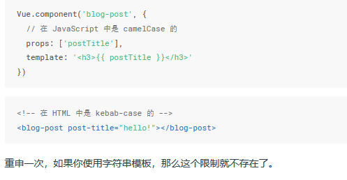

### 传递静态或者动态prop

#### 传入一个数字

传数字要用v-bind，不然就默认传入的是42字符串了

```html
<!-- 即便 `42` 是静态的，我们仍然需要 `v-bind` 来告诉 Vue -->
<!-- 这是一个 JavaScript 表达式而不是一个字符串。-->
<blog-post v-bind:likes="42"></blog-post>

<!-- 用一个变量进行动态赋值。-->
<blog-post v-bind:likes="post.likes"></blog-post>
```

#### 传入一个布尔值

如果prop没有值，那么就是true

要传true和false的话需要v-bind表明它们不是字符串

```html
<!-- 包含该 prop 没有值的情况在内，都意味着 `true`。-->
<blog-post is-published></blog-post>

<!-- 即便 `false` 是静态的，我们仍然需要 `v-bind` 来告诉 Vue -->
<!-- 这是一个 JavaScript 表达式而不是一个字符串。-->
<blog-post v-bind:is-published="false"></blog-post>

<!-- 用一个变量进行动态赋值。-->
<blog-post v-bind:is-published="post.isPublished"></blog-post>
```

#### 传入一个数组（对象也是如此）

```html
<!-- 即便数组是静态的，我们仍然需要 `v-bind` 来告诉 Vue -->
<!-- 这是一个 JavaScript 表达式而不是一个字符串。-->
<blog-post v-bind:comment-ids="[234, 266, 273]"></blog-post>

<!-- 用一个变量进行动态赋值。-->
<blog-post v-bind:comment-ids="post.commentIds"></blog-post>
```

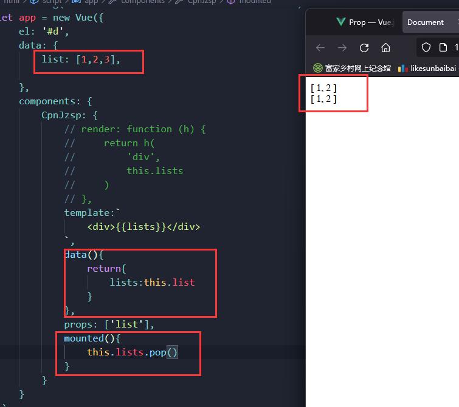

可以看到，尽管我们将list保存到data中，不是直接修改prop中的list，但是由于list和lists保存的**都是父组件传过来的引用**，本质上会修改引用会影响父组件的list的状态

> 注意，传入对象和数组是通过**引用传入**的，所以对于一个数组或对象类型的prop来说，在子组件中改变这个对象或数组本身将**会影响到父组件的状态**

#### 传入一个对象的所有 property

如果你想要将一个**对象的所有 property** 都作为 prop 传入，你可以使用不带参数的 `v-bind` (取代 `v-bind:prop-name`)。例如，对于一个给定的对象 `post`：

```js
post: {
  id: 1,
  title: 'My Journey with Vue'
}
```

下面的模板：

```html
<blog-post v-bind="post"></blog-post>
```

等价于：

```html
<blog-post
  v-bind:id="post.id"
  v-bind:title="post.title"
></blog-post>
```

### 单向数据流★

所有的 prop 都使得其父子 prop 之间形成了一个**单向下行绑定**：父级 prop 的**更新会向下流动到子组件中**，但是反过来则不行。这样会防止从子组件意外变更父级组件的状态，从而导致你的应用的数据流向难以理解。

额外的，每次父级组件发生变更时，子组件中所有的 prop 都将会刷新为最新的值。这意味着你**不应该在一个子组件内部改变 prop**。如果你这样做了，Vue 会在浏览器的控制台中发出警告。

有两种解决方式：

- 将props的值赋值给data中的属性，后面操作data中的数据

```js
props: ['initialCounter'],
data: function () {
  return {
    counter: this.initialCounter
  }
}
```

- 如果prop是以一种原始的值传入且需要**进行转换**，用计算属性即可

```js
props: ['size'],
computed: {
  normalizedSize: function () {
    return this.size.trim().toLowerCase()
  }
}
```

### prop验证

null和undefined会通过任何类型验证

```js
 props: {
    // 基础的类型检查 (`null` 和 `undefined` 会通过任何类型验证)
    propA: Number,
    // 多个可能的类型
    propB: [String, Number],
    // 必填的字符串
    propC: {
      type: String,
      required: true
    },
    // 带有默认值的数字
    propD: {
      type: Number,
      default: 100
    },
    // 带有默认值的对象
    propE: {
      type: Object,
      // 对象或数组默认值必须从一个工厂函数获取
      default: function () {
        return { message: 'hello' }
      }
    },
    // 自定义验证函数
    propF: {
      validator: function (value) {
        // 这个值必须匹配下列字符串中的一个
        return ['success', 'warning', 'danger'].indexOf(value) !== -1
      }
    }
  }
```

> 注意那些 prop 会在该组件实例创建**之前**进行验证，所以实例的 property (如 `data`、`computed` 等) **在 `default` 或 `validator` 函数中是不可用的**。

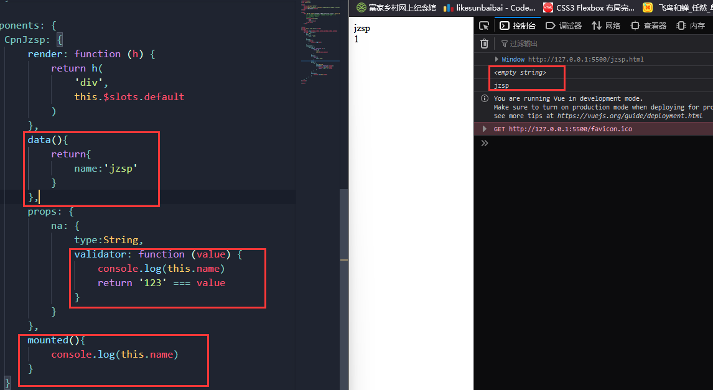

#### 类型检查

`type` 可以是下列原生**构造函数**中的一个：

- `String`
- `Number`
- `Boolean`
- `Array`
- `Object`
- `Date`
- `Function`
- `Symbol`

#### 自定义类的检查

额外的，`type` 还可以是一个**自定义的构造函数**，并且通过 `instanceof` 来进行检查确认。例如，给定下列现成的构造函数：

```js
function Person (firstName, lastName) {
  this.firstName = firstName
  this.lastName = lastName
}
```

你可以使用：

```js
Vue.component('blog-post', {
  props: {
    author: Person
  }
})
```

来验证 `author` prop 的值是否是通过 `new Person` 创建的。

### 非prop的Attribute

一个非 prop 的 attribute 是指**传向一个组件，但是该组件并没有相应 prop 定义的 attribute。**例如下图的age

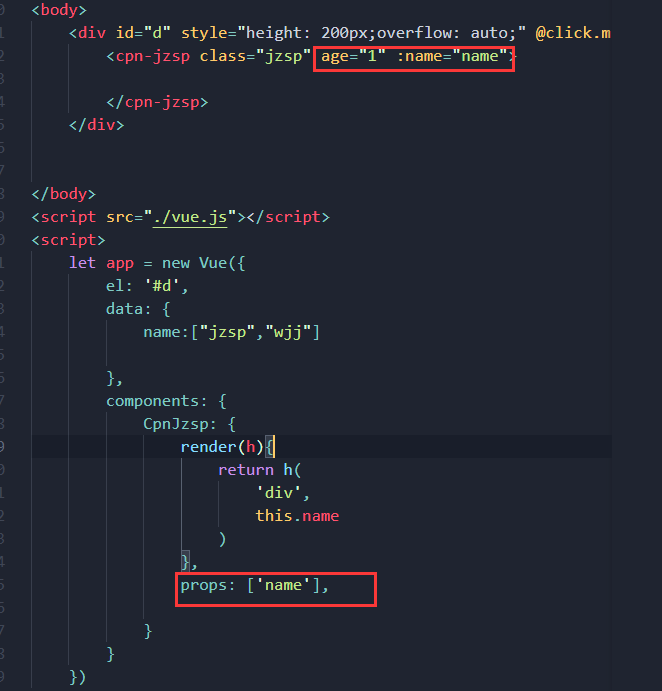

这些 attribute 会被添加到这个**组件的根元素**上。

#### 替换/合并已有的attribute

`style`和`class`这两个特殊的attribute会合并，其余的attribute会替换掉，如下图，`age="2"`被替换成`age="1"`


#### 禁用Attribute继承

如果你**不**希望组件的根元素继承 attribute，你可以在组件的选项中设置 `inheritAttrs: false`。例如：

```js
Vue.component('my-component', {
  inheritAttrs: false,
  // ...
})
```

这尤其**适合配合实例的 `$attrs` property 使用**，该 property 包含了传递给一个组件的 attribute 名和 attribute 值，例如：

```js
{
  required: true,
  placeholder: 'Enter your username'
}
```

有了 `inheritAttrs: false` 和 `$attrs`，你就可以**手动决定这些 attribute 会被赋予哪个元素**。在撰写[基础组件](https://cn.vuejs.org/v2/style-guide/#基础组件名-强烈推荐)的时候是常会用到的：

```js
Vue.component('base-input', {
  inheritAttrs: false,
  props: ['label', 'value'],
  template: `
    <label>
      {{ label }}
      <input
        v-bind="$attrs"
        v-bind:value="value"
        v-on:input="$emit('input', $event.target.value)"
      >
    </label>
  `
})
```

注意 `inheritAttrs: false` 选项**不会**影响 `style` 和 `class` 的绑定。

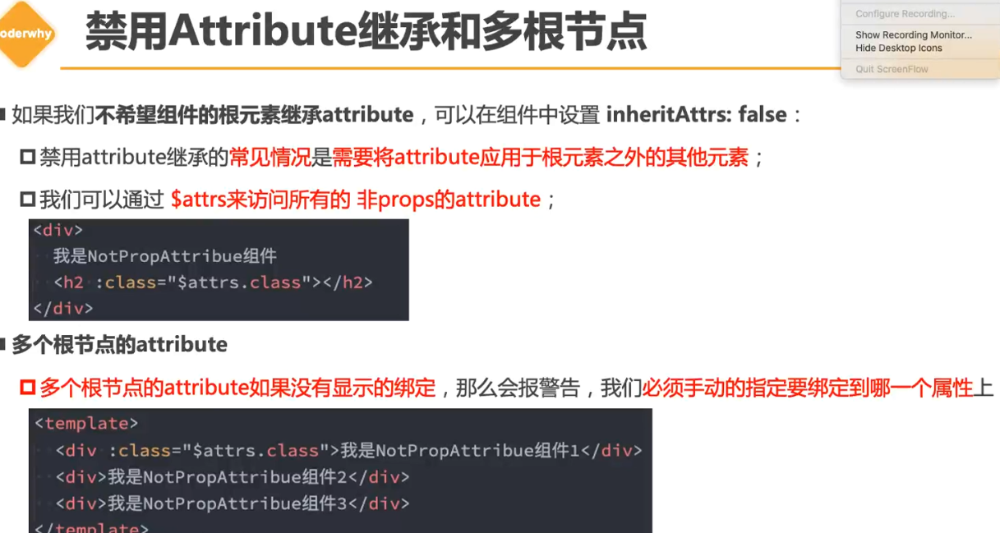

# 三、过渡&动画


# 四、可复用性&组合

## render函数&JSX

------

### 基础例子

假设我们需要写一个组件，里面通过传入的level来判断渲染h1到h6，用模板语法的代码如下

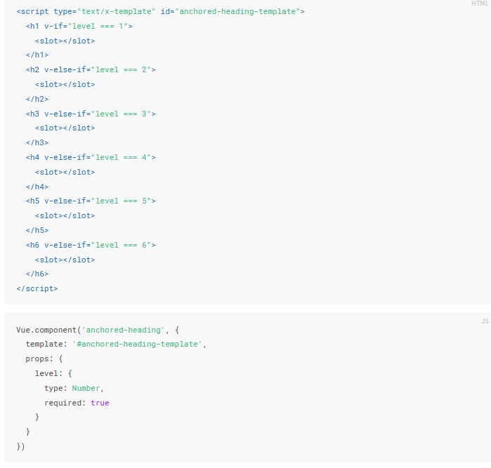

用render函数的写法

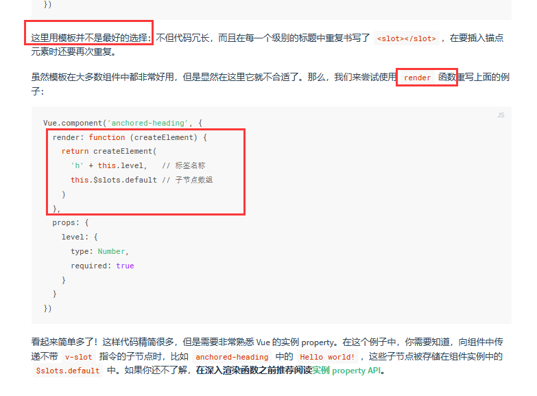

------

### 结点、树、虚拟DOM


每个元素都是一个节点。每段文字也是一个节点。甚至注释也都是节点。一个节点就是页面的一个部分。就像家谱树一样，每个节点都可以有孩子节点 (也就是说每个部分可以包含其它的一些部分)。

高效地更新所有这些节点会是比较困难的，**不过所幸你不必手动完成这个工作**。你只需要告诉 Vue 你希望页面上的 HTML 是什么，这可以是在一个模板里：

```html
<h1>{{ blogTitle }}</h1>
```

或者一个渲染函数里：

```js
render: function (createElement) {
  return createElement('h1', this.blogTitle)
}
```

在这两种情况下，Vue 都会自动保持页面的更新，即便 `blogTitle` 发生了改变。

------

#### 虚拟Dom

Vue 通过建立一个**虚拟 DOM** 来追踪自己要如何改变真实 DOM。请仔细看这行代码：

```js
return createElement('h1', this.blogTitle)
```

`createElement` 到底会返回什么呢？**其实不是一个*实际的* DOM 元素**。它更准确的名字可能是 `createNodeDescription`，因为它所包含的信息会告诉 Vue 页面上需要渲染**什么样的节点**，包括及其子节点的描述信息。我们把这样的节点描述为“虚拟节点 (virtual node)”，也常简写它为“**VNode**”。“虚拟 DOM”是我们对由 Vue 组件树建立起来的整个 VNode 树的称呼。

------

### createElement参数

接下来你需要熟悉的是如何在 `createElement` 函数中使用模板中的那些功能。这里是 `createElement` 接受的参数：

```js
// @returns {VNode}
createElement(
  // {String | Object | Function}
  // 一个 HTML 标签名、组件对象，或者
  // resolve 了上述任何一种的一个 async 函数。必填项。
  'div',

  // {Object}
  // 一个与模板中 attribute 对应的数据对象。可选。
  {
    // (详情见下一节)
  },

  // {String | Array}
  // 子级虚拟节点 (VNodes)，由 `createElement()` 构建而成，
  // 也可以使用字符串来生成“文本虚拟节点”。可选。
    
  [
    '先写一些文字',
    createElement('h1', '一则头条'),
    createElement(MyComponent, {
      props: {
        someProp: 'foobar'
      }
    })
  ]
)
```

------

#### 深入数据对象（createElement的第二个参数）

- class属性

```
  // 与 `v-bind:class` 的 API 相同，
  // 接受一个字符串、对象或字符串和对象组成的数组
```

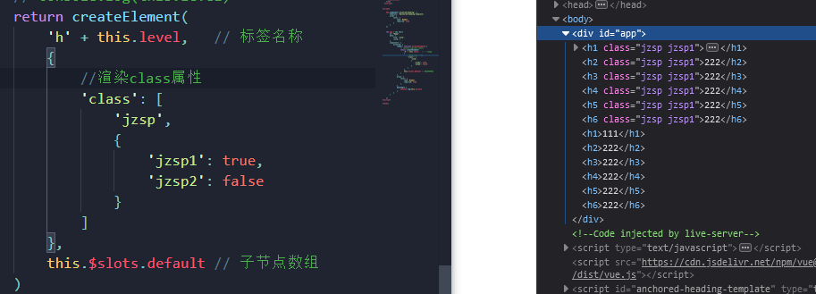

- style属性

```
  // 与 `v-bind:style` 的 API 相同，
  // 接受一个字符串、对象，或对象组成的数组（不懂接收字符串有啥用。。。）
```

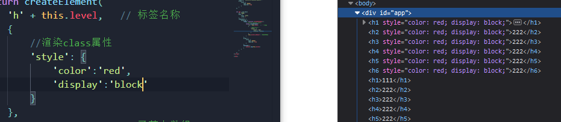

- attrs属性

```js
  // 普通的 HTML attribute
```

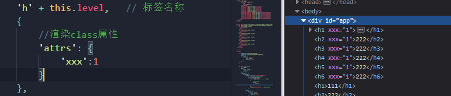

- props属性  ？？？

```js
  // 组件 prop
  props: {
    myProp: 'bar'
  },
```

- domProps属性

```js
 //	DOM property
```

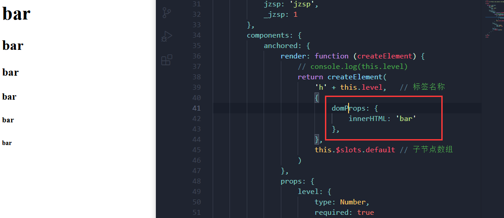

- on属性

```js
  // 事件监听器在 `on` 内，
  // 但不再支持如 `v-on:keyup.enter` 这样的修饰器。
  // 需要在处理函数中手动检查 keyCode。
```

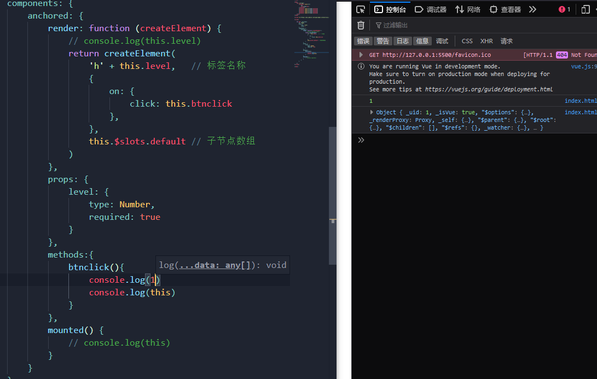

- nativeOn

```js
// 仅用于组件，用于监听原生事件，而不是组件内部使用
  // `vm.$emit` 触发的事件。
  nativeOn: {
    click: this.nativeClickHandler
  },
```

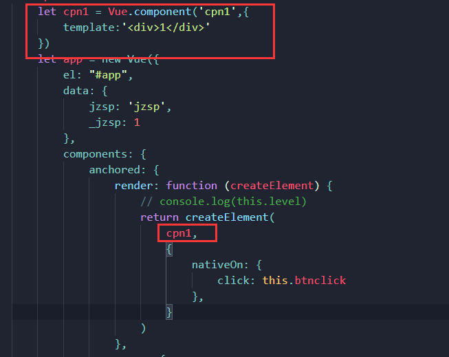

- ref&key

就相当于在标签中写了ref(key同理)

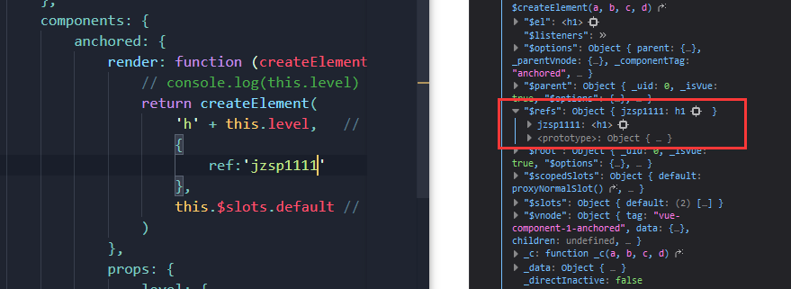

- refInFor

可以看到，jzsp1111对应的不是Node了，而是Node组成的Array

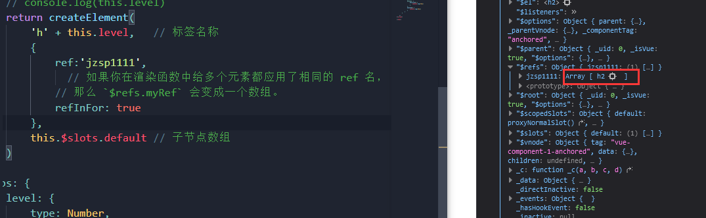

##### 接下来这些。。。都不咋懂 （？？？？？）

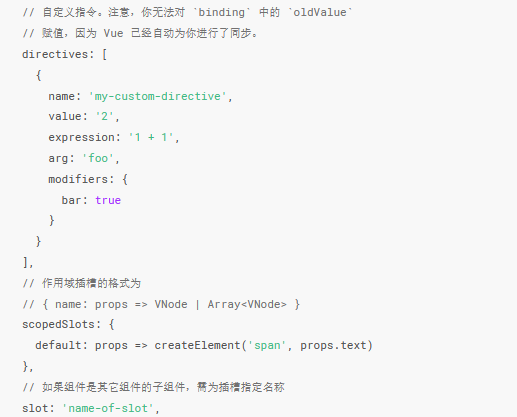

#### 约束

##### VNode 必须唯一

组件树中的所有 VNode 必须是唯一的。这意味着，下面的渲染函数是不合法的：

```js
render: function (createElement) {
  var myParagraphVNode = createElement('p', 'hi')
  return createElement('div', [
    // 错误 - 重复的 VNode
    myParagraphVNode, myParagraphVNode
  ])
}
```

如果你真的需要重复很多次的元素/组件，你可以使用工厂函数来实现。例如，下面这渲染函数用完全合法的方式渲染了 20 个相同的段落：

```js
render: function (createElement) {
  return createElement('div',
    Array.apply(null, { length: 20 }).map(function () {
      return createElement('p', 'hi')
    })
  )
}
```

### 使用js替代模板功能

#### v-if和v-for

只要在原生的 JavaScript 中可以轻松完成的操作，Vue 的渲染函数就不会提供专有的替代方法。比如，在模板中使用的 `v-if` 和 `v-for`：

```html
<ul v-if="items.length">
  <li v-for="item in items">{{ item.name }}</li>
</ul>
<p v-else>No items found.</p>
```

这些都可以在渲染函数中用 JavaScript 的 `if`/`else` 和 `map` 来重写：

```js
props: ['items'],
render: function (createElement) {
  if (this.items.length) {
    //用map遍历每一个items数组对象，做同样的function的操作
    return createElement('ul', this.items.map(function (item) {
      return createElement('li', item.name)
    }))
  } else {
    return createElement('p', 'No items found.')
  }
}
```

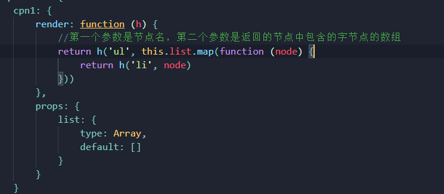

#### v-model

渲染函数中没有与 `v-model` 的直接对应——你必须自己实现相应的逻辑：

```js
props: ['value'],
render: function (createElement) {
  var self = this
  //v-model本质是v-bind:value 和  @input 结合的语法糖
  //在第二个对象中，用domProps绑定value，用on监听input事件
  return createElement('input', {
    domProps: {
      value: self.value
    },
    on: {
      input: function (event) {
        self.$emit('input', event.target.value)
      }
    }
  })
}
```

原本我还不知道为什么要emit自定义事件，这才想起来props不支持直接改。而且这里子组件v-model绑定父组件传过来的值，可能本质上**要修改父组件那边的值**吧，所以要emit自定义事件，在父组件那边修改data中的对应的值，同时也会通过v-bind传回

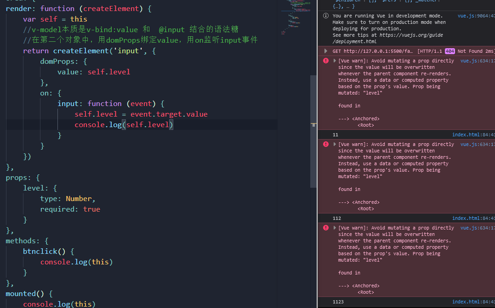

```js

<body>
    <div id="app">
        <anchored :level="Plevel" @input="change">
            111
            <div>jzsp</div>
        </anchored>
        <anchored :level="2">222</anchored>
        <anchored :level="3">222</anchored>
        <anchored :level="4">222</anchored>
        <anchored :level="5">222</anchored>
        <anchored :level="6">222</anchored>
    </div>
</body>

<script src="vue.js"></script>

<script>

    let app = new Vue({
        el: "#app",
        data: {
            jzsp: 'jzsp',
            Plevel: 1,

        },
        components: {
            anchored: {
                render: function (createElement) {
                    var self = this
                    //v-model本质是v-bind:value 和  @input 结合的语法糖
                    //在第二个对象中，用domProps绑定value，用on监听input事件
                    return createElement('input', {
                        domProps: {
                            value: self.level
                        },
                        on: {
                            input: function (event) {
                                //前面加个正号可以强转
                                self.$emit('input', +event.target.value)
                            }
                        }
                    })
                },
                props: {
                    level: {
                        type: Number,
                        required: true
                    }
                },
            }
        },     
        methods:{
            change(data){
                this.Plevel = data
                console.log(data)
            }
        }
    })
</script>
```

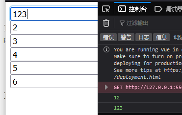

这就是深入底层的代价，但与 `v-model` 相比，这可以让你更好地控制交互细节。

#### 第二个参数的on属性中的事件&按键修饰符

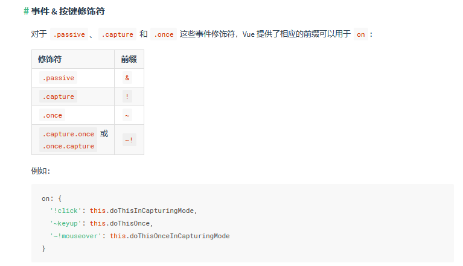

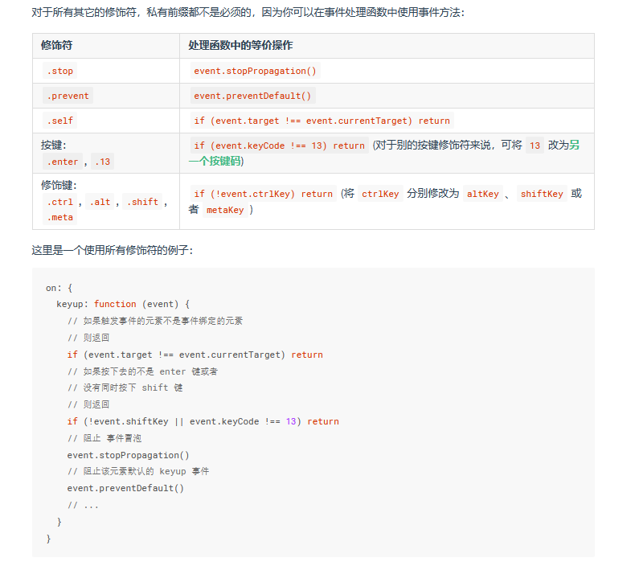

#### 插槽

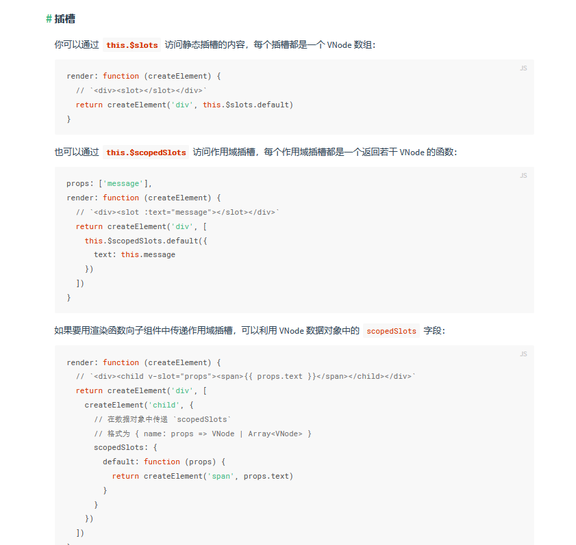

### 待完成

# 五、内在