# 项目搭建规范

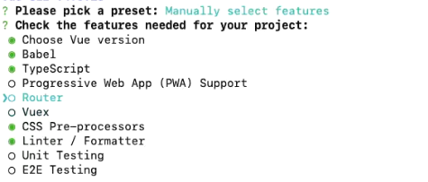

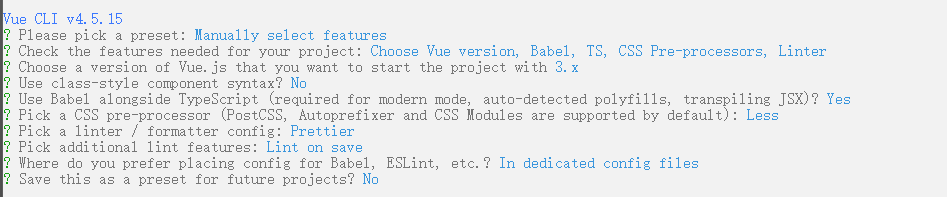

## 一. 代码规范

### 1.1. 集成editorconfig配置

EditorConfig 有助于为不同 IDE 编辑器上处理同一项目的多个开发人员维护一致的编码风格。因为不同的人或者不同的电脑的代码编写风格是不一样的，可以用这个配置文件进行统一

```yaml
# http://editorconfig.org

root = true   # 表示当前的配置文件是在根目录下的

[*] # 表示所有文件适用
charset = utf-8 # 设置文件字符集为 utf-8
indent_style = space # 缩进风格（tab | space）
indent_size = 2 # 缩进大小
end_of_line = lf # 控制换行类型(lf | cr | crlf)
trim_trailing_whitespace = true # 去除行首的任意空白字符
insert_final_newline = true # 始终在文件末尾插入一个新行

[*.md] # 表示仅 md 文件适用以下规则
max_line_length = off
trim_trailing_whitespace = false
```


**VSCode**需要安装一个插件：EditorConfig for VS Code**（webstorm不需要）**

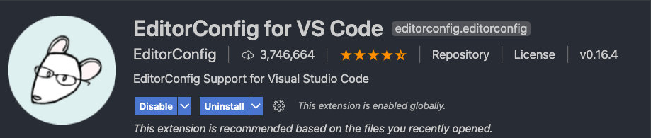


### 1.2. 使用prettier代码格式化工具

Prettier 是一款强大的代码**格式化工**具，支持 JavaScript、TypeScript、CSS、SCSS、Less、JSX、Angular、Vue、GraphQL、JSON、Markdown 等语言，基本上前端能用到的文件格式它都可以搞定，是当下最流行的代码格式化工具。


步骤1.安装prettier（**安装了这个包**的话，那么即使不用vscode，配置了指令后也可以通过调用指令的方式来对代码进行格式化）

```shell
npm install prettier -D
```

步骤2.配置.prettierrc（rc是runtime compiler的缩写）文件：

* useTabs：使用tab缩进还是空格缩进，选择false，也就是说选择空格缩进；
* tabWidth：**tab是空格的情况下**，是几个空格，选择2个；
* printWidth：规定一行代码的字符的长度，推荐80，也有人喜欢100或者120；
* singleQuote：使用**单引号还是双引号**，选择true，使用单引号；
* trailingComma：在多行输入的**最后一行尾逗号**是否添加，设置为 `none`；
* semi：语句**末尾是否要加分号**，默认值true，选择false表示不加；

```json
{
  "useTabs": false,
  "tabWidth": 2,
  "printWidth": 80,
  "singleQuote": true,
  "trailingComma": "none",
  "semi": false
}
```


步骤3.创建.prettierignore忽略文件，忽略下面这些文件进行格式化

```
/dist/*
.local
.output.js
/node_modules/**

**/*.svg
**/*.sh

/public/*
```


步骤4.VSCode需要安装prettier的插件

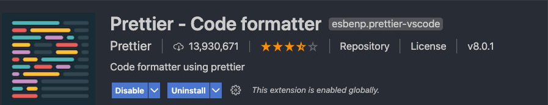

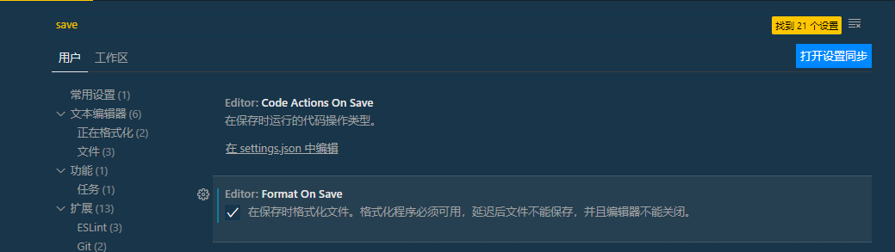

5.测试prettier是否生效

* 测试一：在代码中保存代码；
* 测试二：配置一**次性修改**的命令（不需要每个文件都ctrl+s保存代码才修改）；

在package.json中配置一个scripts：

```json
    "prettier": "prettier --write ."
```

#### webstorm配置

在plugins中安装了prettier之后在下面配置

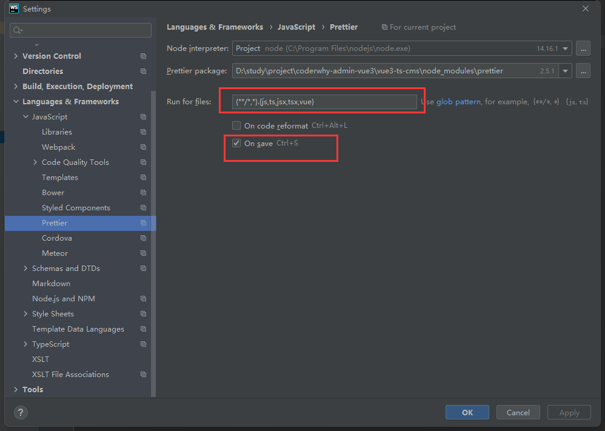

### 1.3. 使用ESLint检测

1.在前面创建项目的时候，我们就选择了ESLint，所以Vue会默认帮助我们配置需要的ESLint环境。

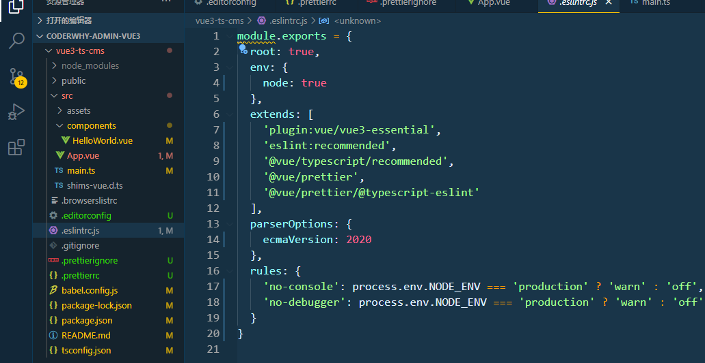

2.**VSCode需要安装**ESLint插件：

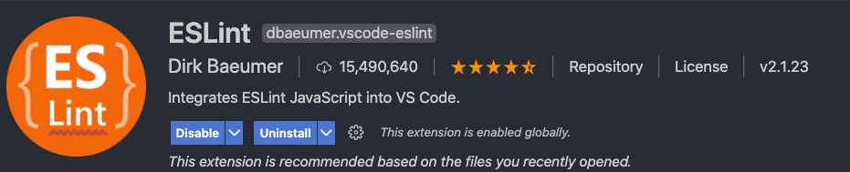

3.解决eslint和prettier冲突的问题（不兼容）：

安装插件：（vue在创建项目时，**如果选择prettier，那么这两个插件会自动安装**）

```shell
npm i eslint-plugin-prettier eslint-config-prettier -D
```

添加prettier插件：

```json
  extends: [
    "plugin:vue/vue3-essential",
    "eslint:recommended",
    "@vue/typescript/recommended",
    "@vue/prettier",
    "@vue/prettier/@typescript-eslint",
    'plugin:prettier/recommended'
  ],
```

如果某个eslint不希望报错的化，可以将小括号内的文字赋值到.eslintrc.js中进行配置

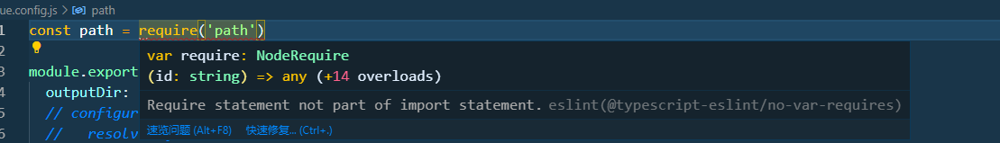

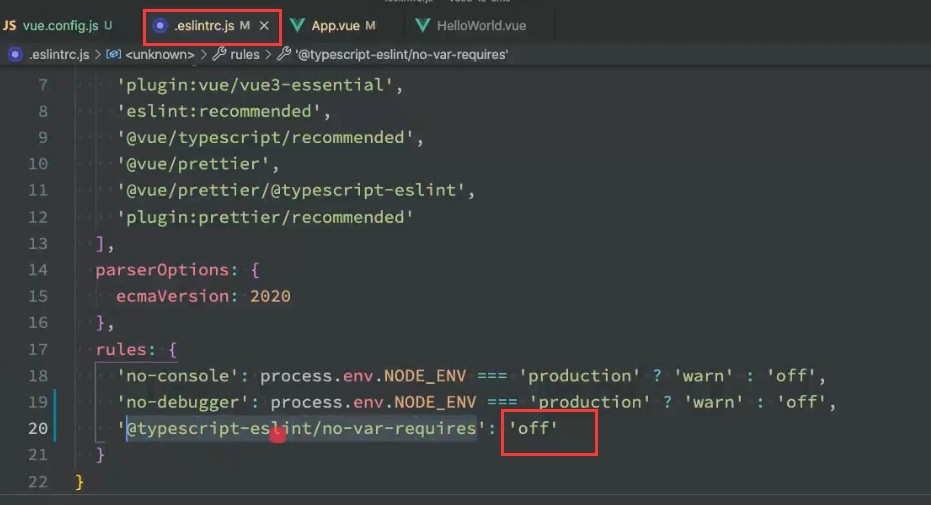

### 1.4. git Husky和eslint

虽然我们已经要求项目使用eslint了，但是不能保证组员提交代码之前都将eslint中的问题解决掉了：

* 也就是我们希望保证代码仓库中的代码都是符合eslint规范的；

* 那么我们需要在组员执行 `git commit ` 命令的时候对其进行校验，如果不符合eslint规范，那么自动通过规范进行修复；

那么如何做到这一点呢？可以通过Husky工具：

* husky是一个git hook工具，可以帮助我们触发git提交的各个阶段：pre-commit、commit-msg、pre-push

如何使用husky呢？

这里我们可以使用自动配置命令：

```shell
npx husky-init && npm install
```

**这里相当于做三件事**：

1.安装husky相关的依赖：

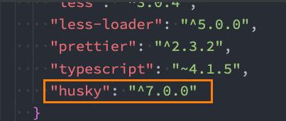

2.在项目目录下创建 `.husky` 文件夹：

```
npx huksy install
```

这里创建了pre-commit，也就是说拦截了git的pre-commit的hook

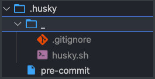

3.在package.json中添加一个脚本：


接下来，我们需要去完成一个操作：在进行commit时，执行lint脚本：

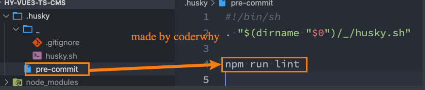


这个时候我们执行git commit的时候会自动对代码进行lint校验。

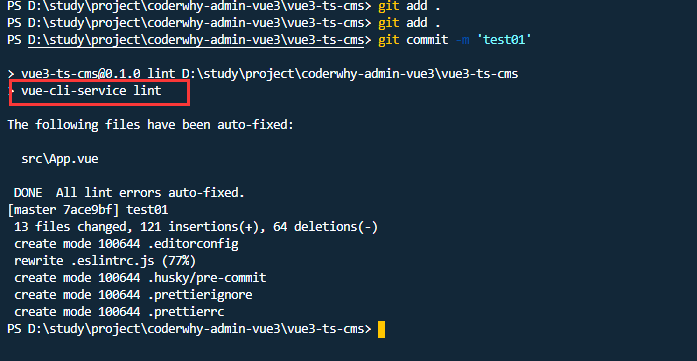

### 1.5. git commit规范

#### 1.5.1. 代码提交风格

通常我们的git commit会按照统一的风格来提交，这样可以快速定位每次提交的内容，方便之后对版本进行控制。

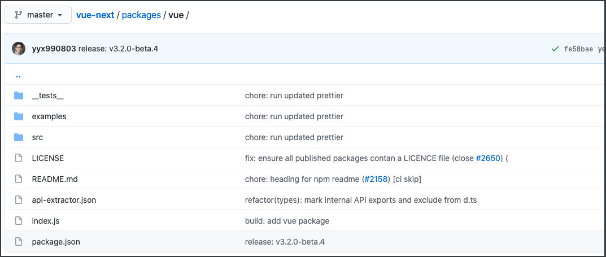

但是如果每次手动来编写这些是比较麻烦的事情，我们可以使用一个工具：**Commitizen**

* Commitizen 是一个帮助我们编写规范 commit message 的工具；

1.安装Commitizen

```shell
npm install commitizen -D
```

2.安装cz-conventional-changelog，并且初始化cz-conventional-changelog：

```shell
npx commitizen init cz-conventional-changelog --save-dev --save-exact
```

这个命令会帮助我们安装cz-conventional-changelog：

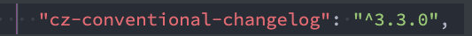

并且在package.json中进行配置：

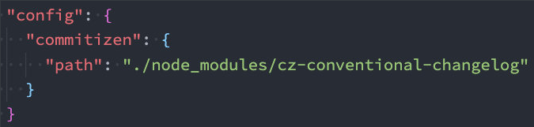

**这个时候我们提交代码需要使用 `npx cz`：**

* 第一步是选择type，本次更新的类型
* 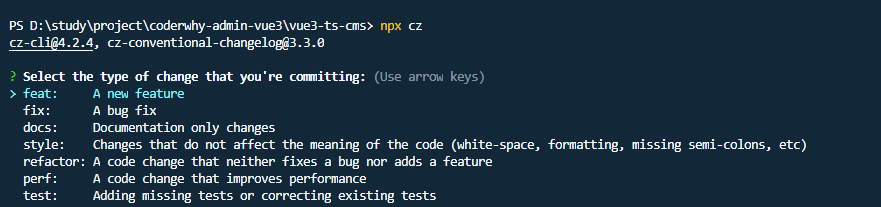

| Type     | 作用                                                         |
| -------- | ------------------------------------------------------------ |
| feat     | 新增特性 (feature)                                           |
| fix      | 修复 Bug(bug fix)                                            |
| docs     | 修改文档 (documentation)                                     |
| style    | 代码格式修改(white-space, formatting, missing semi colons, etc) |
| refactor | 代码重构(refactor)                                           |
| perf     | 改善性能(A code change that improves performance)            |
| test     | 测试(when adding missing tests)                              |
| build    | 变更项目构建或外部依赖（例如 scopes: webpack、gulp、npm 等） |
| ci       | 更改持续集成软件的配置文件和 package 中的 scripts 命令，例如 scopes: Travis, Circle 等 |
| chore    | 变更构建流程或辅助工具(比如更改测试环境)                     |
| revert   | 代码回退                                                     |

* 第二步选择本次修改的范围（作用域）

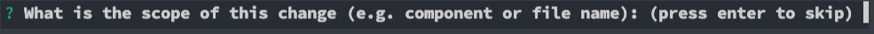

* 第三步选择提交的信息

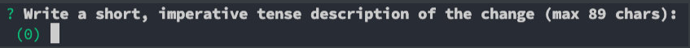

* 第四步提交详细的描述信息

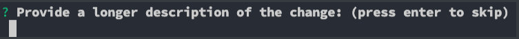

* 第五步是否是一次重大的更改


* 第六步是否影响某个open issue

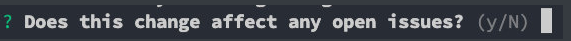

我们也可以在scripts中构建一个命令来执行 cz：

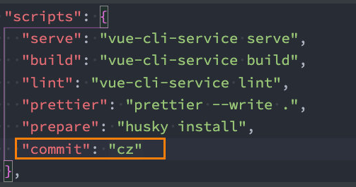


#### 1.5.2. 代码提交验证

如果我们按照cz来规范了提交风格，但是依然有同事通过 `git commit` 按照不规范的格式提交应该怎么办呢？

* 我们可以通过commitlint来**限制提交**；

1.安装 @commitlint/config-conventional 和 @commitlint/cli

```shell
npm i @commitlint/config-conventional @commitlint/cli -D
```

2.在根目录创建**commitlint.config.js**文件，配置commitlint

```js
module.exports = {
  extends: ['@commitlint/config-conventional']
}
```

3.使用husky生成commit-msg文件，验证提交信息：

```shell
npx husky add .husky/commit-msg "npx --no-install commitlint --edit $1"
```


## 二. 第三方库集成以及项目最初设置

### 2.1. vue.config.js配置（别名）

> 参考vue-cli官网的参考配置

vue.config.js有三种配置方式：

* 方式一：直接通过CLI**提供给我们的选项来配置**：
  * 比如publicPath：配置应用程序部署的子目录（默认是 `/`，相当于部署在 `https://www.my-app.com/`）；
  * 比如outputDir：修改输出的文件夹；
* 方式二：通过**configureWebpack**修改webpack的配置：
  * 可以是一个对象，直接**会被合并**；
  * 可以是一个函数，会接收一个config，可以通过config来修改配置；
* 方式三：通过**chainWebpack**修改webpack的配置：
  * 是一个函数，会接收一个基于  [webpack-chain](https://github.com/mozilla-neutrino/webpack-chain) 的config对象，可以对配置进行修改；

```js
const path = require('path')

module.exports = {
  outputDir: './build',
  // configureWebpack: {
  //   resolve: {
  //     alias: {
  //       views: '@/views'
  //     }
  //   }
  // }
  // configureWebpack: (config) => {
  //   config.resolve.alias = {
  //     '@': path.resolve(__dirname, 'src'),
  //     views: '@/views'
  //   }
  // },
  chainWebpack: (config) => {
    config.resolve.alias.set('@', path.resolve(__dirname, 'src')).set('views', '@/views')
  }
}
```


### 2.2. vue-router集成

安装vue-router的最新版本：

```shell
npm install vue-router@next
```

创建router对象：

```ts
import { createRouter, createWebHashHistory } from 'vue-router'
import { RouteRecordRaw } from 'vue-router'   //这个是routes数组的类型声明

const routes: RouteRecordRaw[] = [
  {
    path: '/',
    redirect: '/main'
  },
  {
    path: '/main',
    component: () => import('../views/main/main.vue')
  },
  {
    path: '/login',
    component: () => import('../views/login/login.vue')
  }
]

const router = createRouter({
  routes,
  history: createWebHashHistory()
})

export default router
```

安装router：

```ts
import router from './router'

createApp(App).use(router).mount('#app')
```

在App.vue中配置跳转：

```html
<template>
  <div id="app">
    <router-link to="/login">登录</router-link>
    <router-link to="/main">首页</router-link>
    <router-view></router-view>
  </div>
</template>
```


### 2.3. vuex集成

安装vuex：

```shell
npm install vuex@next
```

创建store对象：

```ts
import { createStore } from 'vuex'

const store = createStore({
  state() {
    return {
      name: 'coderwhy'
    }
  }
})

export default store
```

安装store：

```ts
createApp(App).use(router).use(store).mount('#app')
```

在App.vue中使用：

```html
<h2>{{ $store.state.name }}</h2>
```


### 2.4. element-plus集成（1.0.2-beta.62）

Element Plus，一套为开发者、设计师和产品经理准备的**基于 Vue 3.0** 的**桌面端**组件库：

* 相信很多同学在Vue2中都使用过element-ui，而element-plus正是element-ui针对于vue3开发的一个UI组件库；
* 它的使用方式和很多其他的组件库是一样的，所以学会element-plus，其他类似于ant-design-vue、NaiveUI、**VantUI**都是差不多的；

安装element-plus

```shell
npm install element-plus
```


#### 2.4.1. 全局引入

一种引入element-plus的方式是全局引入，代表的含义是**所有的组件和插件都会被自动注册**：

> 全局引入会导致打包后的文件变大，优点是集成简单

```js
import ElementPlus from 'element-plus'
import 'element-plus/lib/theme-chalk/index.css'

import router from './router'
import store from './store'

createApp(App).use(router).use(store).use(ElementPlus).mount('#app')
```


#### 2.4.2. 局部引入

也就是在开发中用到某个组件对某个组件进行引入：

```vue
<template>
  <div id="app">
    <router-link to="/login">登录</router-link>
    <router-link to="/main">首页</router-link>
    <router-view></router-view>

    <h2>{{ $store.state.name }}</h2>

    <el-button>默认按钮</el-button>
    <el-button type="primary">主要按钮</el-button>
    <el-button type="success">成功按钮</el-button>
    <el-button type="info">信息按钮</el-button>
    <el-button type="warning">警告按钮</el-button>
    <el-button type="danger">危险按钮</el-button>
  </div>
</template>

<script lang="ts">
import { defineComponent } from 'vue'

import { ElButton } from 'element-plus'

export default defineComponent({
  name: 'App',
  components: {
    ElButton
  }
})
</script>

<style lang="less">
</style>
```

但是我们会发现是没有对应的样式的，**引入样式有两种方式**：

* 全局引用样式（像之前做的那样）；
* 局部引用样式（通过babel的插件）；

1.安装babel的插件：

```shell
npm install babel-plugin-import -D
```

2.配置babel.config.js

```js
module.exports = {
  plugins: [
    [
      'import',
      {
        libraryName: 'element-plus',
        customStyleName: (name) => {
          return `element-plus/lib/theme-chalk/${name}.css`
        }
      }
    ]
  ],
  presets: ['@vue/cli-plugin-babel/preset']
}
```


但是这里依然有个弊端：

* 这些组件我们在多个页面或者组件中使用的时候，都需要导入并且在components中进行注册；
* 所以我们可以将它们在**全局注册**一次；

```ts
import {
  ElButton,
  ElTable,
  ElAlert,
  ElAside,
  ElAutocomplete,
  ElAvatar,
  ElBacktop,
  ElBadge,
} from 'element-plus'

const app = createApp(App)

//将导入的组件存入对象中，然后forof进行注册
const components = [
  ElButton,
  ElTable,
  ElAlert,
  ElAside,
  ElAutocomplete,
  ElAvatar,
  ElBacktop,
  ElBadge
]

for (const cpn of components) {
    //参数：组件名，组件
  app.component(cpn.name, cpn)
}
```

### 2.4. element-plus集成（2.0.2）

> 具体的集成，需要**查看最新版本的官网**

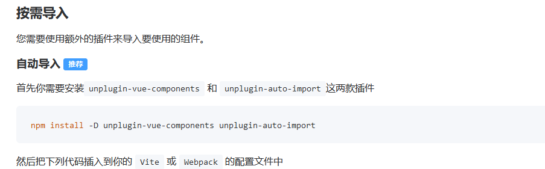

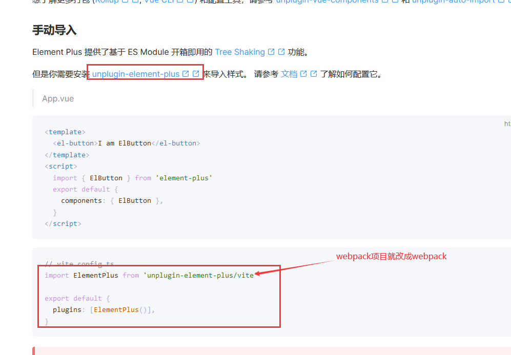

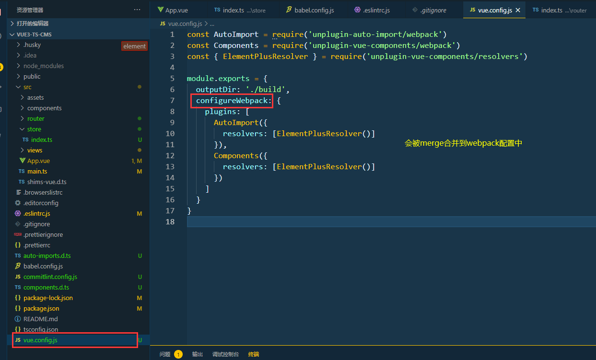

```js
//vue.config.js
//自动导入
const AutoImport = require('unplugin-auto-import/webpack')
//自动注册
const Components = require('unplugin-vue-components/webpack')
//导入样式（Loading用得到）
const ElementPlus = require('unplugin-element-plus/webpack')
const { ElementPlusResolver } = require('unplugin-vue-components/resolvers')

module.exports = {
  outputDir: './build',
  configureWebpack: {
    plugins: [
      AutoImport({
        resolvers: [ElementPlusResolver()]
      }),
      Components({
        resolvers: [ElementPlusResolver()]
      }),
        //样式
      ElementPlus()
    ]
  }
}

```

安装了插件之后，会自动生成这两个文件，不需要导入

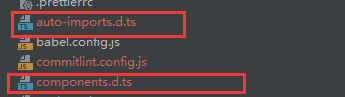


### 2.5. axios集成（具体的看axios in ts）

安装axios：

```shell
npm install axios
```

封装axios：

```ts
import axios, { AxiosInstance, AxiosRequestConfig, AxiosResponse } from 'axios'
import { Result } from './types'
import { useUserStore } from '/@/store/modules/user'

class HYRequest {
  private instance: AxiosInstance

  private readonly options: AxiosRequestConfig

  constructor(options: AxiosRequestConfig) {
    this.options = options
    this.instance = axios.create(options)

    this.instance.interceptors.request.use(
      (config) => {
        const token = useUserStore().getToken
        if (token) {
          config.headers.Authorization = `Bearer ${token}`
        }
        return config
      },
      (err) => {
        return err
      }
    )

    this.instance.interceptors.response.use(
      (res) => {
        // 拦截响应的数据
        if (res.data.code === 0) {
          return res.data.data
        }
        return res.data
      },
      (err) => {
        return err
      }
    )
  }

  request<T = any>(config: AxiosRequestConfig): Promise<T> {
    return new Promise((resolve, reject) => {
      this.instance
        .request<any, AxiosResponse<Result<T>>>(config)
        .then((res) => {
          resolve((res as unknown) as Promise<T>)
        })
        .catch((err) => {
          reject(err)
        })
    })
  }

  get<T = any>(config: AxiosRequestConfig): Promise<T> {
    return this.request({ ...config, method: 'GET' })
  }

  post<T = any>(config: AxiosRequestConfig): Promise<T> {
    return this.request({ ...config, method: 'POST' })
  }

  patch<T = any>(config: AxiosRequestConfig): Promise<T> {
    return this.request({ ...config, method: 'PATCH' })
  }

  delete<T = any>(config: AxiosRequestConfig): Promise<T> {
    return this.request({ ...config, method: 'DELETE' })
  }
}

export default HYRequest
```

### 2.6. css取消默认样式以及assets文件夹的管理

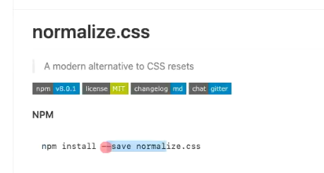

在main.ts中导入，加入webpack依赖图使之生效

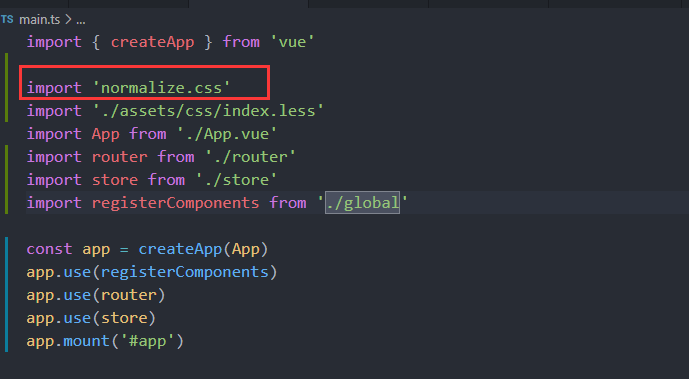

assets用于存放静态资源

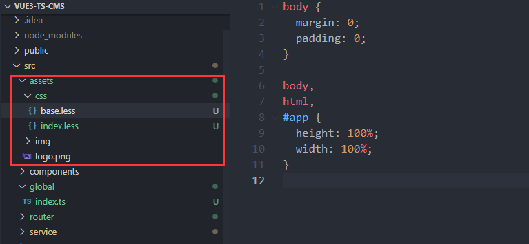

index.less： css文件夹的统一出口，并在main.ts中导入令其生效

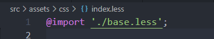

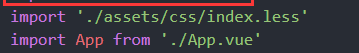


## 三. 接口文档

https://documenter.getpostman.com/view/12387168/TzsfmQvw

baseURL的值：

```
http://152.136.185.210:5000
```

设置全局token的方法：

```js
const res = pm.response.json();
pm.globals.set("token", res.data.token);
```


接口文档v2版本：（有部分更新）

https://documenter.getpostman.com/view/12387168/TzzDKb12

# 其他知识点

## 区分不同环境

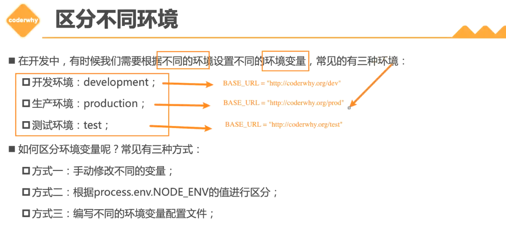

**方式1**

将变量定义在一个config.ts文件中，但是这个手动切换的方式不能防止在打包代码的时候忘记修改

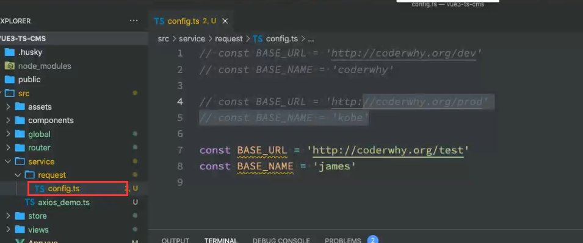

**方式2**

process.env.NODE_ENV是webpack的一个插件DefinePlugin注入的，在不同环境下会有不同的值

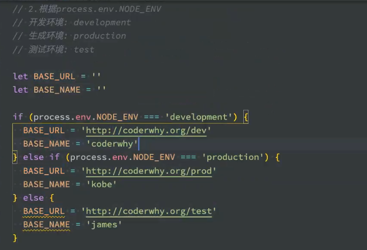

**方式3**

> 具体参考Vue Cli 环境变量

在根目录下创建这三个文件分别指定环境变量

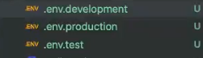

需要以`VUE_APP_`开头，后面的内容随便定义

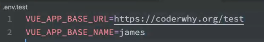

在main.ts中的获取方式

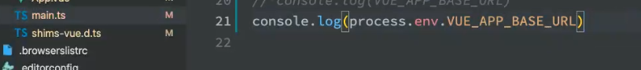

## 关于vue.config.js的PublicPath配置

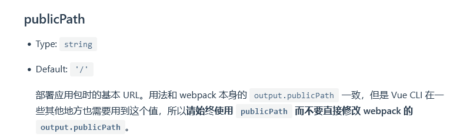

在我们打包vue项目之后，想在本地通过liveServer方式打开，发现报错

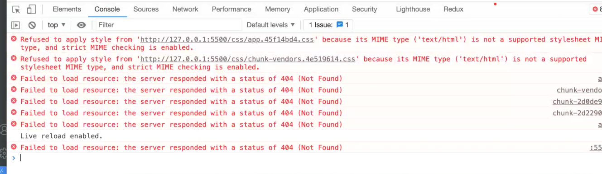

因为在打包后的script标签的src是以/开头的，会通过当前域名的地址去加载资源，但是我们需要通过当前文件夹下加载资源

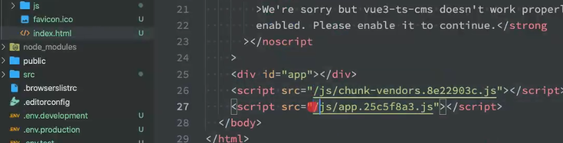

此时我们就需要修改publicPath属性

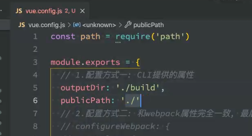

> **注意，部署到服务器的时候不要加上这个配置**

## 关于tsconfig.json文件


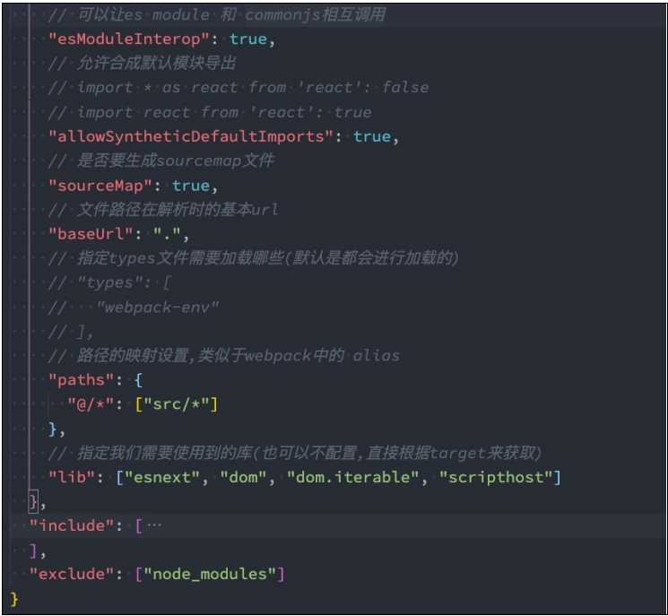

要解析ts代码的文件，exclude就是排除要解析的文件

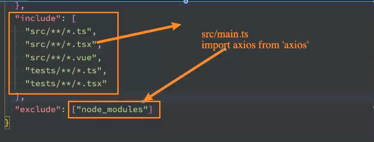

## 关于shims-vue.d.ts文件

加载.vue文件（.jpg，.jpeg）的话，默认ts是不认识这些文件的，就不会把他们当成模块，import导入的时候就会报错。这个文件就是为了声明一些类型的

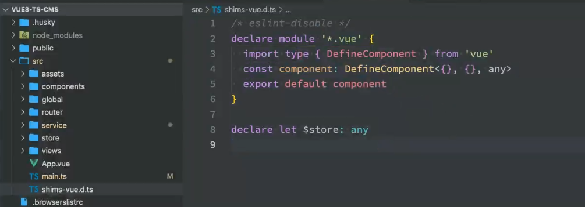

而vue文件中导出的对象经过了`defineComponent`函数包裹，在函数中声明了很多的类型，这样的话在ts中就会有类型提示

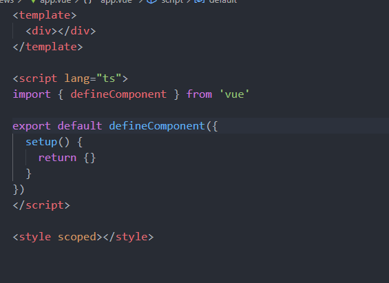

# 项目中遇到的css问题

## 设置背景图

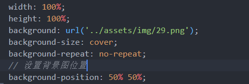

- background-position

这个属性是相对于background-origin定义的位置，而background-origin就是指定背景在padding-box还是content-box中显示

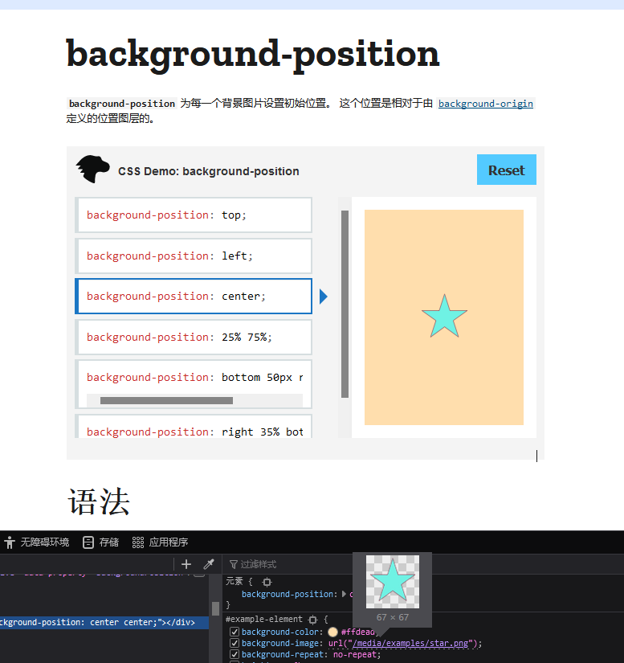

- background-size

```css
/* 关键字 */
background-size: cover   //铺满
background-size: contain //完全显示（会有残缺）

/* 一个值: 这个值指定图片的宽度，图片的高度隐式的为auto */
background-size: 50%
background-size: 3em
background-size: 12px
background-size: auto

/* 两个值 */
/* 第一个值指定图片的宽度，第二个值指定图片的高度 */
background-size: 50% auto
background-size: 3em 25%
background-size: auto 6px
background-size: auto auto

/* 逗号分隔的多个值：设置多重背景 */
background-size: auto, auto     /* 不同于background-size: auto auto */
background-size: 50%, 25%, 25%
background-size: 6px, auto, contain

/* 全局属性 */
background-size: inherit;
background-size: initial;
background-size: unset;
```

## 深度选择器

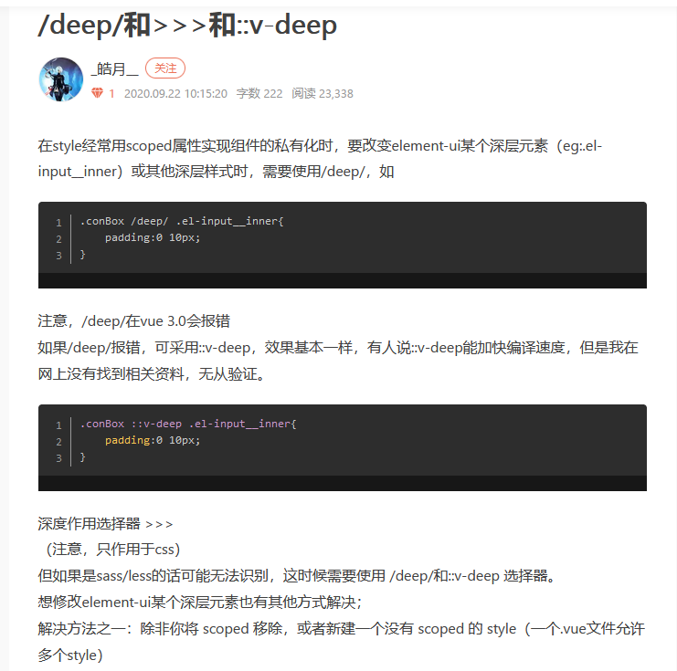

# 项目中遇到的ts问题

## ref的类型问题（InstanceType）

我们可以给ref指定泛型，那我们怎么希望这个类型是我们的组件类型呢？可以用下面这种语法

InstanceType可以指定泛型，会创建一个类型


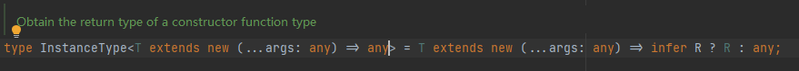


# vuex的使用

## 给store指定类型

在ts中，我们可以对store对象指定类型，`createStore`传入的泛型会指定options中的类型


那么我们指定sotre对象的类型之后，state中的值就不能乱定义了**（我们将类型的定义放在了当前目录下的types.ts中）**


## 给store的module指定类型

> 过大的数据类型就用any代替吧。。。

平时我们导出的module，在js中，只不过是一个普通的对象罢了，这就导致我们在写这个对象的时候，没有指定这个对象的类型，就没有提示。那么我们在ts中就可以通过泛型给module对象指定类型了

Module类型需要指定两个泛型（因为都没有默认值），第一个泛型是指定自身的类型，第二个泛型是指定store对象的类型


我们将类型定义和逻辑代码分开


# ---------------------

# elementPlus国际化

会发现我们elementPlus组件显示的默认是英文，所以我们需要国际化成中文


# 权限管理

前后端逻辑


我们的路由之所以不能写死，是因为，很多类角色对应的权限是没有的，如果我们写死了路由，那么path - component的映射关系在路由中存在，我们改变url就可以访问对应的component。这样是不安全的，所以我们需要动态注册路由

如果不会轻易加角色和修改权限的话，提前根据每个角色的权限定义路由规则数组是个不错的选择


## 动态注册路由

首先将所有要动态注册的路由存入存入一个数组，在我们登录成功之后，会发送请求获取用户的userMenu，根据userMenu的url路径来匹配数组中对应的路由


在router文件夹下创建一个rules文件，导出routes路由规则数组，里面有所有**需要动态配置的路由配置对象**


接下来就是最核心的步骤：将userMenu中type为2（type为2说明没有子路由了）的url，映射到routes中


编写一个工具函数，**递归**地从userMenu中根据url，将对应的路由规则加入数组，并且返回这个我们**所需的路由规则数组**


我们既然已经将动态路由都获取到了，那么我们要在什么地方注册呢？我们之前封装了一个函数，用于在刷新的时候读取localStorage里面的数据给vuex，那么我们就在这个函数中进行注册路由

> 一定要写在`app.use(router)`前面，会在还没增加路由的时候去匹配，会访问notFound


此时动态路由就注册好了，在我们点击左侧菜单栏对应的菜单时，用编程式导航跳转路由即可

## 按钮权限

先观察一下服务器返回的菜单信息（三级菜单就是按钮，就是对应的权限）


做法是这样的，我们获取到userMenus中的所有三级菜单，放到数组中保存


在获取到菜单的地方，调用这个函数，获取用户按钮的**权限字符串**


封装hook，因为定义的权限字符串都是类似于`system:pageName:handleName`的形式，所以要求传入pageName和按钮的name


在封装的page-content中使用这个hook


使用hook获取对应权限，进行v-if


# 依赖element-plus封装搜索栏高级组件


在base-ui（其他项目也能用到的ui组件）中创建form


在user组件中引入并使用，方便进行调试


## labelWidth决定label宽度

让父组件传入labelWidth决定label的宽度（el-form的label-width属性可以统一设置宽度）


## formItems决定显示哪些哪种input

formItems是一个数组，是我们传入的要展示的input的类型，内容，以及label，placeHolder等属性组成的对象。我们可以先在types文件中定义每个元素的类型，方便有**提示**


在子组件中定义props


el-form-item内置了插槽，那么我们就可以在template中**根据type判断，分别插入不同类型的input**


子组件的模板代码


父组件传入的数据


## itemStyle决定每个input之间的样式

itemStyle可以设置每个for循环渲染出的元素的样式，默认值是`padding :'10px 40px'`


父组件可以传入itemStyle修改这个配置


## 响应式实现

elementUI中的Layout布局的col属性中的下面的属性，达到对应分辨率时的span值


我们原本的span值（栅格值）是写死的8，也就是默认一行显示三个，即便缩小页面，还是一行显示三个


所以我们可以通过设置前面介绍的响应式属性，根据屏幕宽度来决定span的值（之所以写在props中，是因为我们可以由用户动态决定这些配置）下面我们通过v-bind的方式将这些属性都设置到el-col组件上


## 封装配置数据

这样虽然达到了**依靠传入的内容决定显示的内容**的效果，但是代码看上去还是十分冗余

此时我们可以将所有的配置值封装到一个对象中，并且直接通过v-bind的方式传入

**先定义IForm类型**


在父组件中导入这个类型，并且原来的数据都封装到这个类型的config对象中，在直接v-bind传给子组件


我们甚至可以将这些配置信息抽离到ts文件中并且导出，在使用到我们定义的高级组件的时候，只要编写这些配置文件，然导出里面的配置对象，使用v-bind就可以动态决定高级组件内部要渲染的内容


## 组件之间的v-model

封装好了组件之后，我们是无法输入数据的，因为没有进行input的双向绑定。在menu组件内部双向绑定很简单，但是我们要怎么在**组件之间进行双向绑定**呢？

### 方式1（直接对传入的props值进行双向绑定）

将要绑定的数据v-bind传入menu组件


在子组件中通过props接收


另外我们还需要**确定每个item绑定的是传入的哪个数据**，所以我们要加一个fields属性用来识别**当前item项绑定的是传入的对象中的哪个属性**。在配置文件传入的formItems指定fields字段的值。


直接对值进行双向绑定（报错是eslint）


结果（虽然实现了v-model的效果，但是违背了单向数据流的原则，因为这里是直接修改的props）


### 方式2（父组件v-model）

在父组件中使用v-model传入响应式对象。v-model本质上是两个操作，

- `v-bind:modelValue="formData"` 
- `@update:model-value`


在子组件中接收，定义一个计算属性，get的时候获取props中传入的modelValue，set的时候emit发射事件给父组件


我们发现，这样也可以实现效果，但是并没有输出111111，这就是说，并没有在设置值的时候发射给父组件。**computed返回的是ref对象，只有修改这个ref对象的值的时候才会触发set，因为我们是通过v-model绑定的formData（computed返回的ref对象，自动解包）中的某一个属性，修改属性而不是修改对象本身，set方法是不会调用的，只有修改modelValue对象本身，set才会被调用（原理类似于const一个对象，可以修改对象的属性但是不能修改对象的指向）。**

既然没有调用set，也就是说我们没有emit事件，那么为什么可以修改父组件中的值呢？因为我们相当于是get到了props中的modelValue，直接修改了modelValue中的值

> 这里学到了，只有对computed函数返回的ref对象的值进行修改才会触发set，如果ref对象的值是一个对象，修改这个对象的属性是不会触发computed的set函数的


### 方式3（真正的双向绑定）

方式2的缺陷就是，无法监听computed返回的对象的属性的变化，那么什么可以监听属性的变化呢？没错，就是watch

我们对props.modelValue中的值进行拷贝，防止直接修改props的值


### 可以试试拆解双向绑定

## 加入header和footer插槽


在父组件中使用


## 封装成page-search组件

### 封装步骤

我们将上面父组件中使用到的内容封装到**page-search组件**中，并且要求父组件在使用**page-search组件**时传入我们之前封装的配置数据config，并且将这个配置数据传入**wjj-form**


还有一个就是我们要传入formData，这个formData我们不能写死，因为这个page-search是要给很多页面共同使用的，每个页面中要**双向绑定的数据都不一样**。


所以我们可以根据传入props的`config`配置中的**`formItems`数组中的`fields`字段**来决定formData的对象内容


### 重置按钮的实现


但是在**form组件**中，为了防止对props直接操作，是对传入的modelValue进行了**浅拷贝**。

由上图可知，我们的重置是直接**赋值为一个新的对象**，由于浅拷贝的原因，传入的modelValue指向了新的对象，而子组件中拷贝出的formData指向的是原对象，原对象没有发生改变，重置失效。所以将这段代码**放入computed**中，computed会因为get函数中的**响应式数据modelValue发生改变而重新调用get函数，以至于重新给formData赋值**


我们也可以不赋值为新的对象，而是修改原来对象的值。因为是**浅拷贝**，父组件中的formData.value这个对象和内部modelValue的对象是**指向的同一个对象**，那么我们可以直接重置formData.value这个对象中的属性来达到重置效果


### 搜索按钮实现

因为我们查询按钮是在PageSearch中，而请求是在PageContent中，这两个组件都是在一个共同的父组件下的

所以我们要进行组件的通信，在PageSearch点击按钮的时候发射事件给父组件，然后父组件通过ref取到PageContent子组件并且调用内部发送请求的方法


pageSearch发射事件给父组件，搜索时要带上formData.value表单数据


父组件监听事件


父组件通过ref获取pageContent组件，调用内部封装的getData（发送网络请求）的方法


PageContent组件封装getData方法（将原来dispatch封装到函数中，并且可以接收queryInfo查询条件


现在功能已经实现了，在父组件中，可以进一步将ref绑定，以及两个监听事件这些公共逻辑代码**封装到hook**中


 

# 依赖element-plus封装table高级组件

## tableRowConfig决定列的显示内容（初步封装）

**table组件**最初布局如下


我们队el-table-column进行了v-for，由外界传入的tableRowConfig数组来决定每个el-table-column的配置


现在，**table组件**要求外部传入两个数据

- `dataList`数组，是要展示的数据
- tableRowConfig数组，由el-table-column循环遍历，决定每一行有哪些内容要展示
  - prop：决定当前列显示的是传入的对象数组中对象的哪个属性
  - label：表头标签名
  - min-width：当前列的最小宽度

传入的userList数据


传入的tableRowConfig数据，下面这个配置放入**table组件**中会进行v-for循环，生成多个el-table-column，以决定显示几列，每列显示的是传入的对象数组中对象的哪个属性


v-bind传入**table组件**


**table组件**接收


**table组件**使用传入的数据


## 插槽自定义某列显示效果

`el-table-column`内部有**`default`插槽**可以指定当列显示的内容，作用域插槽中保存的`row`可以获取显示当前行的对象，进而通过item.prop获取到**当前单元格展示的数据**

（**table组件**中）这个写法其实就是，每列按默认格式显示数据


我们可以在**table组件**中给**默认插槽的template**传入一个**具有默认值的**插槽，并且这个插槽的名字是**动态**根据传入的slotName决定的（这很关键），并且**将展示的数据放入作用域插槽对象的value属性中**（`:value="scope.row[item.prop]"`）


那么我们需要在tableRowConfig对象数组的对象中，**需要自定义显示内容的列添加slotName属性**


1：在父组件可以使用**具名插槽**，插入想要展示的内容（下图$filters是全局通过app.config.globalProperties注册的全局变量）

2：通过作用域插槽（`scope.value`）获取内部传出的要展示的数据


效果


## showIndexColumn决定第一列是否显示index

设置el-table-column的type为index即可实现效果

**table组件**中新增index列，并新增一个props接收是否要显示index列的数据，默认是不显示


## showSelectColumn决定是否可以选中row

设置el-table-column的type为selection即可实现选项效果

给el-table监听selection-change事件，在选项变化的时候会触发，函数会默认传入选中的行的数据


我们可以在table组件中发射事件，让父组件可以使用选中的数据


父组件监听发射出来的事件，可以获取到数据，并作出一些操作


## 最后一列：操作列

因为我们是要自己决定最后一列是否显示操作列的，所以我们可以在tableRowConfig中**加入新的对象来配置这一列**（因为这一列显示的是操作按钮，不需要传入数据，所以我们不加prop属性）


因为slotName是operation，所以table组件中会有名为operation的具名插槽（前面封装了），我们可以插入内容


## 插槽插入header和footer

### header

我们希望实现下面的效果：可以在表的上方添加一些可显示的信息以及一些自定义内容


修改**table组件**的布局


header部分我们给两个插槽，一个是左侧插槽，专门用于设置标题，一个是右侧插槽，传入一些自定义的刷新按钮或者是新增用户按钮


props接收传入的title，在插槽中显示


### footer

footer插槽我们默认显示pagination分页组件


#### 绑定total

在vuex中根据pageName返回不同的Count值


在组件内部接收，并且绑定到total


#### 绑定currentPage和PageSize

layout是布局相关


其实查询时的offset就是`(currentPage-1)*pageSize`


在table组件内部新增**page**这个prop用于接收


将这两个值绑定到组件上，并且监听改变事件，改变的时候发射值给父组件


在使用pageContent，也就是使用table组件的地方，传入pageInfo，并且监听子组件发出的update事件。在触发改变事件的时候，重新调用getData获取内容


## 封装page-content组件

虽然我们每个page的content显示的table中展示的数据都是不一样的，但是这些数据有一个共同点（就是下面画起来的地方），所以我们在**使用page-content组件**的时候，只需要传入**pageName**，**根据pageName**在actions中（我们之前的数据就是在action中获取的）发送不同的网络请求，在getters中获取不同的数据即可


### 配置分离

我们将上面封装的一些配置（title，showSelectColumn，showIndexColumn，tableRowConfig），放入一个单独的文件并导出


将原来的跟table有关的代码赋值到page-content.vue中（别忘了wjjTable注册组件），新增props要求**传入config配置对象**，v-bind绑定在wjj-table上实现配置的动态传入


### 根据pageName发送不同的请求

接下来是数据问题，我们page-content是要给不同界面使用的，所以我们获取数据和请求数据不能写死，而是希望父组件在使用page-content组件的时候传入一个pageName，告诉我们是哪个页面在使用page-content组件，然后根据pageName**获取不同的数据**和**发送不同的网络请求**

修改sotre的systemModule模块，在actions获取页面List数据时，要求调用dispatch的时候**在payload中传入pageName**，根据pageName**决定不同的url**去获取数据，并且根据pageName**分别修改对应的state中的数据**


在**page-content组件**的setup中，使用props接收的pageName，**放入payload中**


### 根据pageName获取不同的数据

修改getters，在获取值的时候，通过getters获取（getters用法类似于computed，这里直接在getters中返回函数**实现filter的效果**）


在page-content的setup中使用getters，传入props.pageName，返回不同的数据


### 使用


# 左侧菜单的active问题

在左侧菜单中，我们每次刷新后显示的总是显示的用户管理


这是因为我们默认的default-active是2，而这一个menu-item的**index**就是2，因为这个menu-item的index是根据id来的，这个menu的**id**就是2


那么我们现在想达到的效果是，根据当前的路由路径，匹配到userMenu中对应的menu，获取到id，然后赋值给default-active。当前路由的路径可以通过useRoute获取，那么怎么匹配到对应的menu呢？

我们在utils的map-menus再导出一个函数，用于根据path匹配menu


在menu组件的setup中使用该函数，将获取到的id导出，动态绑定

	


**此时又出现了一个问题**，当我们访问项目`ip`的时候会报错。原因是，我们将`/`路由重定向到了`/main`，渲染main组件，再渲染menu组件。在渲染menu组件的时候，获取到的route的路径是'`/main`'，这个路径肯定无法匹配到userMenu中的任何一个menu，所以返回的是undefined，那么undefined.id的时候就报错了


解决这个问题的办法是，访问到main的时候进行重定向，因为我们main的子路由是**动态注册**的，无法在routes中通过redirect的方式重定向，那么我们可以在**匹配路由的时候获取第一个匹配到的路由并且保存，然后在导航守卫中重定向到这个路由**


utils文件夹下的map-menus，保存firstRoute并且导出


# 面包屑组件


布局代码


在原来匹配menu函数的基础上加一个参数（数组类型），用于保存**匹配到的路**由和**上一级的路由的信息**


在nav-header中使用，因为route和state是响应式的，所以放入computed中，当route或者state发生变化时，breadcrumbs会动态修改


