# 一些配置的介绍

## output.publicPath

- output.path的作用是告诉webpack打包的输出目录
- output.publicPath是指定index.html文件打包引用的一个**基本路径**，默认是一个斜杠

index.html中有关src的路径是**publicPath**和**打包生成对应文件所在的目录**进行拼接。

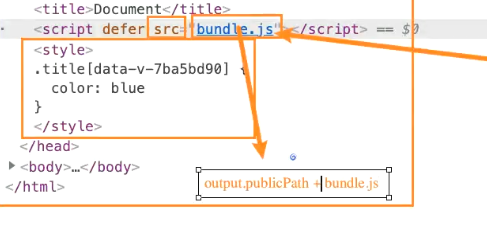

那么html解析到src的时候会去根据路径下载文件，因为这里是文件的路径，而且前面也没加协议，那么会直接拼接上协议和域名，publicPath和文件所在的打包路径（相对），因为publicPath默认是空，所以会拼接上一个`/`，通过webpack-dev-server开启服务 时候，是能正确访问到的。


如果publicPath是`'/'`，那么打包之后通过**本地的方式打开index.html**是无法找到对应目录的，因为前面会拼接上index.html所在的根路径

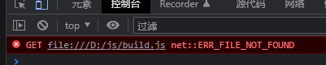

如果加上./的话，浏览器解析的时候，会去index.html所在的目录路径去寻找

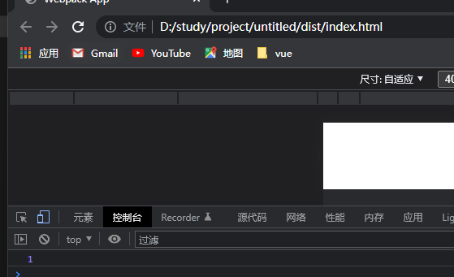

> 注意，部署的话不要修改这个，写`/`就可以了，打包之后在本地打开html才写`./`

## devServer.publicPath

这个属性会改变开启服务之后，打包文件的访问路径，如果改成/abc，那么我们需要访问域名+/abc才能访问到对应的js文件。一般来说，这个值与output.publicPath一致

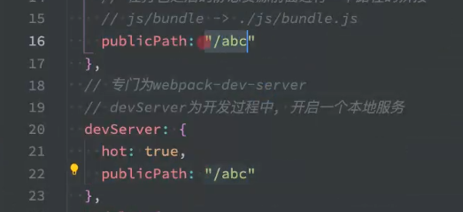

# webpack的初体验和依赖安装

------

## Webpack基础打包

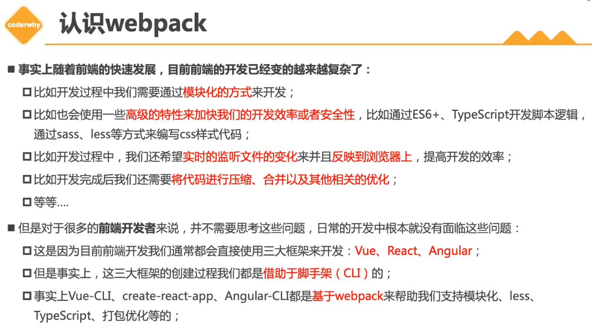

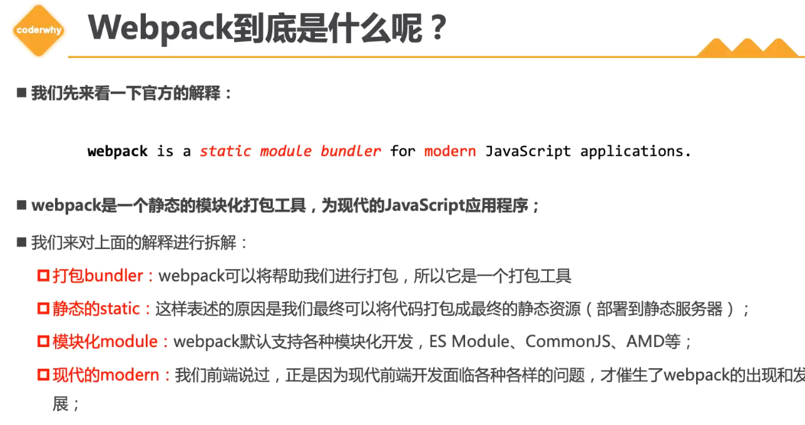


------

## Webpack的安装

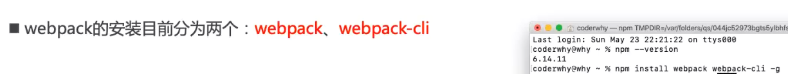

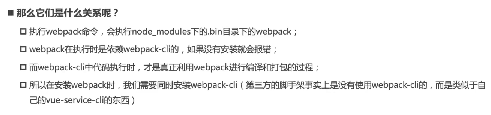

我们创建一个src目录，在src目录下创建一个js工具文件夹，里面存放各种工具函数。在src目录下创建index.js文件夹用来引入这些工具函数并且使用。在根目录下创建index.html将这个index.js文件引入。


因为我们的工具函数用了各种导出方式，如果不经过webpack的话**直接在html文件中引入会报错**

所以我们调用webpack指令来打包src文件夹，打包完成之后生成了dist文件夹（distribute的缩写）里面就有main.js文件，**这个文件是可以直接被浏览器识别的**

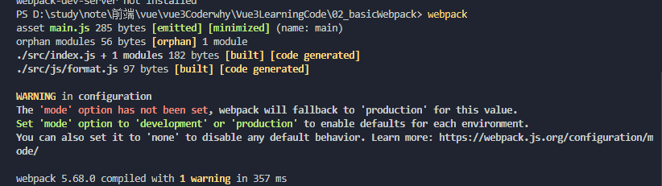

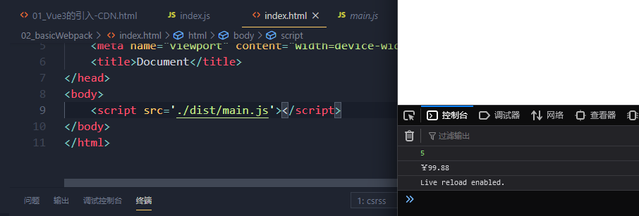

------

## 创建局部的webpack

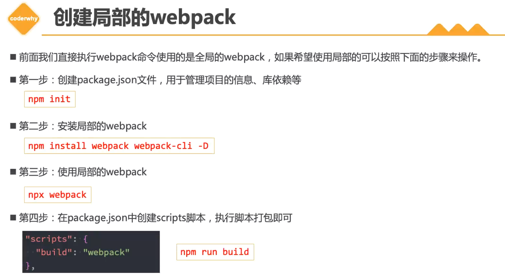

------

## webpack的配置文件

**webpack会默认打包src目录下的index.js文件**，如果想要修改入口（默认打包文件）的话，需要在指令中添加--entry。例如：`npx webpack --entry ./src/main.js`

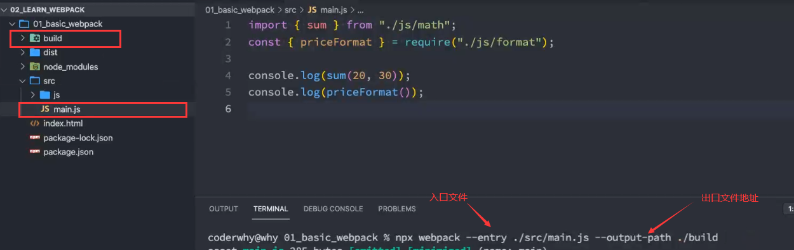

但是如果有很多配置的话，都在命令行输入指令会很麻烦。所以我们需要建立**webpack.config.js**配置文件。如果有这个文件的话，执行webpack指令的时候会先进入当前文件中进行webpack的配置

> 一般来说创建的必须是webpack.config.js这个文件名，如果想指定另外一个文件名的话，可以在package.json中修改`script`中对应的打包指令为  `"build":"webpack --config xxx.config.js"`

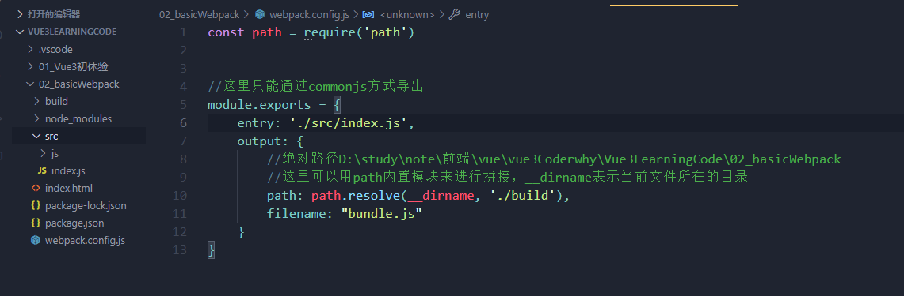

执行`npm run build` 进行打包

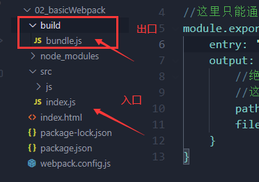

------

## webpack的依赖图

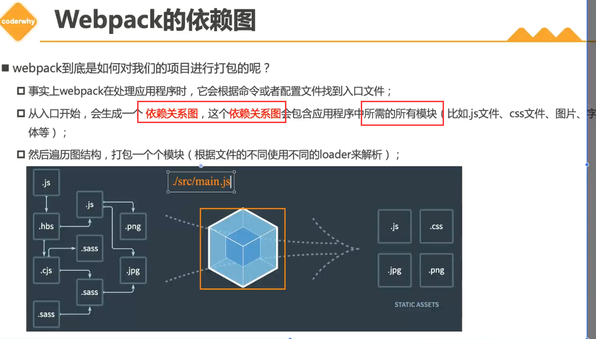

依赖就是从入口文件开始，能找到对应模块的关系，就像js的gc回收机制一样，从全局能找到对应变量的引用就不会被gc删除。下面的element.js从入口文件开始无法找到与这个模块的依赖，所以element.js不会参与打包

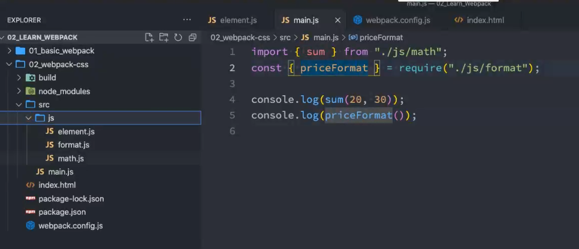

# webpack打包（Loader）

------

## webpack打包css

------

### css-loader解析css模块

现在我们编写了css文件，import导入在了element文件中，使这个文件添加到了**webpack的依赖图**中并可以进行打包，但是在打包的时候会报下面的这个错误，**提示我们需要一个合适的loader来处理css文件类型**

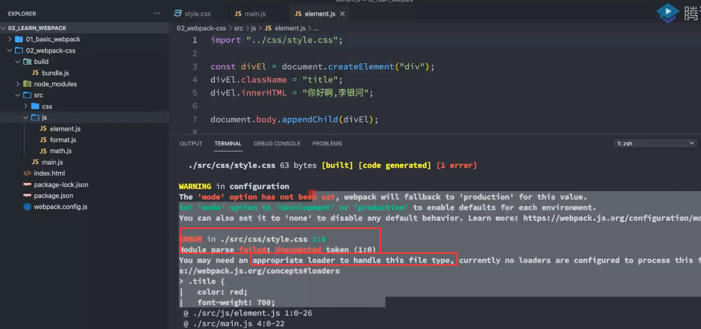

所以我们需要下载能处理css文件的loader : css-loader

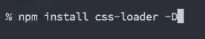

------

**配置方式**

- 内敛方式

在原来导入的地址前面加`css-loader!`

```js
import 'css-loader!index.css'
```

- 配置方式

rules是一个数组，里面是rule对象

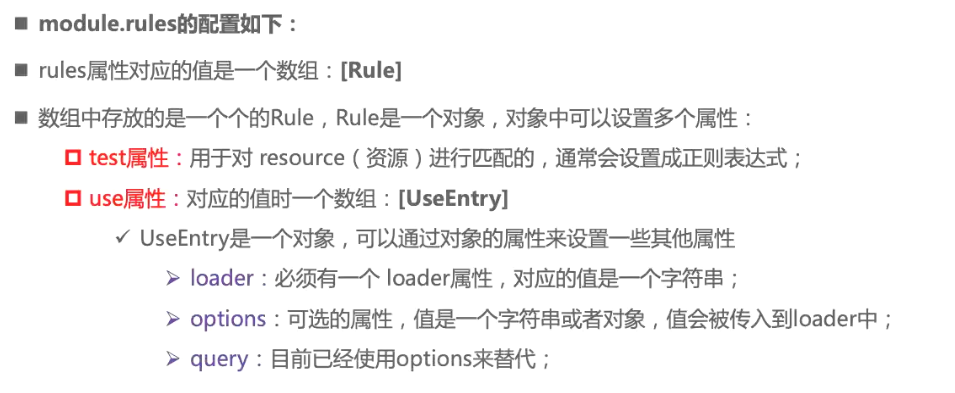

```js
const path = require('path')
module.exports = {
  entry: './src/index.js',
  output: {
    path: path.resolve(__dirname, './build'),
    filename: "bundle.js"
  },
  module: {
    rules: [
      {
        test: /\.css$/, //正则表达式
        //1.loader的写法，只用到一个loader的时候可以用，本质上会转化成下面的use写法
        loader : 'css-loader'
      }
    ]
  }
}
```

```js
const path = require('path')
module.exports = {
  entry: './src/index.js',
  output: {
    path: path.resolve(__dirname, './build'),
    filename: "bundle.js"
  },
  module: {
    rules: [
      {
        test: /\.css$/, //正则表达式
        //2.完整的写法，因为一种文件可能需要多个loader来处理，所以use后面跟了一个数组
        use:[
          //{ loader : 'css-loader' }
          'css-loader'  //传递字符串，最终会被转换成上面这一行的配置对象，是简写
        ]
      }
    ]
  }
}
```

------

### style-loader插入css到页面中

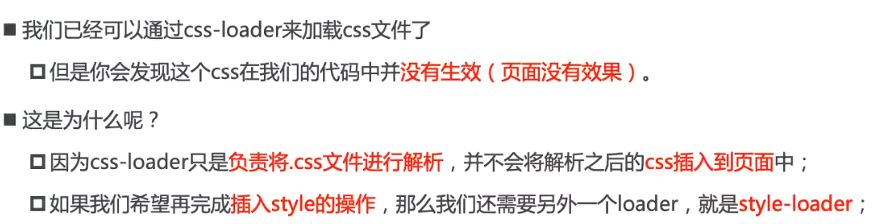


> **配置注意点：use数组的loader是下标从大到小加载**

```js
  module: {
    rules: [
      {
        test: /\.css$/, //正则表达式
        //注意，loader加载是有先后顺序的，在这里，必须是先解析css，再将style标签插入页面
        //但是use后数组中loader的加载顺序是下标从大到小加载的，所以得“倒着写”
        use:[
          'style-loader',
          'css-loader'
        ]
      }
    ]
  }
```

现在已经成功解析css并且插入style标签中了

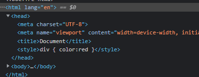

------

## webpack打包less

less文件浏览器是无法识别的，需要单独用一个工具将less文件解析成css文件。这个工具叫`lessc`，**只需要安装less即可**

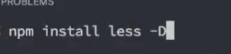

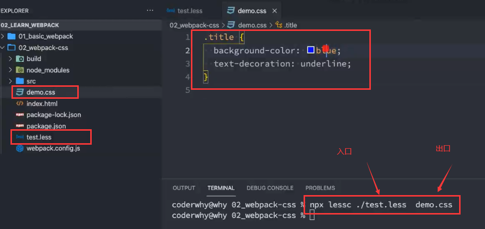

less-loader这个工具就是将webpack依赖图中的所有less文件通过lessc转成css文件，配置如下

> 安装less-loader的时候需要额外的安装less，不然会报错

```js
  module: {
    rules: [
      {
        test: /\.css$/,
        use: [
          'style-loader',
          'css-loader'
        ]
      },
      {
        test:/\.less$/,
        use:[
          'style-loader', //再插入到style标签中
          'css-loader',  //再将css解析打包
          'less-loader'  //先将less转成css
        ]
      }
    ]
  }
```

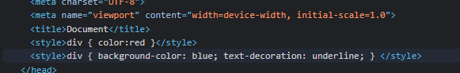

------

## 浏览器兼容性Browserslist工具

这个包webpack会默认安装

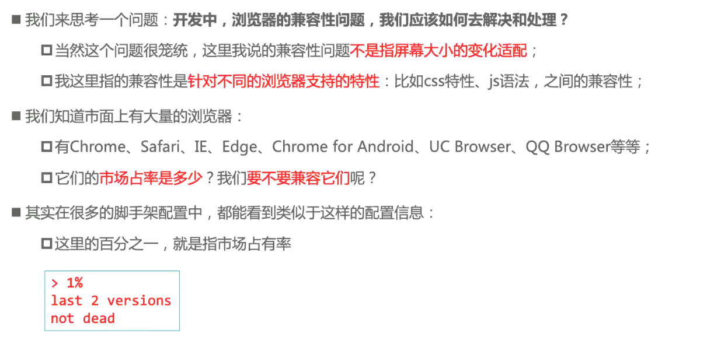

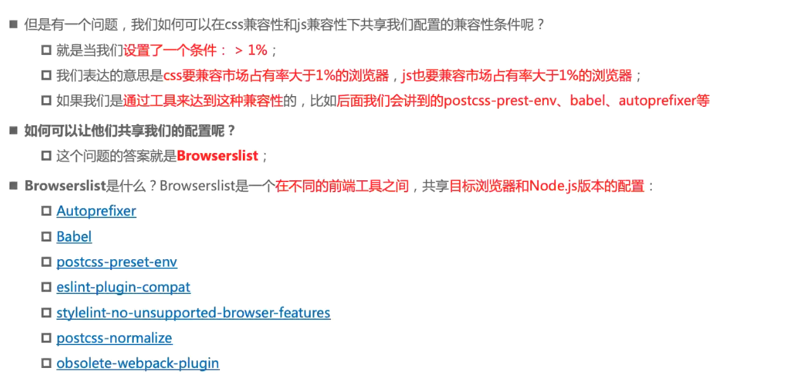

**编写broserlistrc和配置**

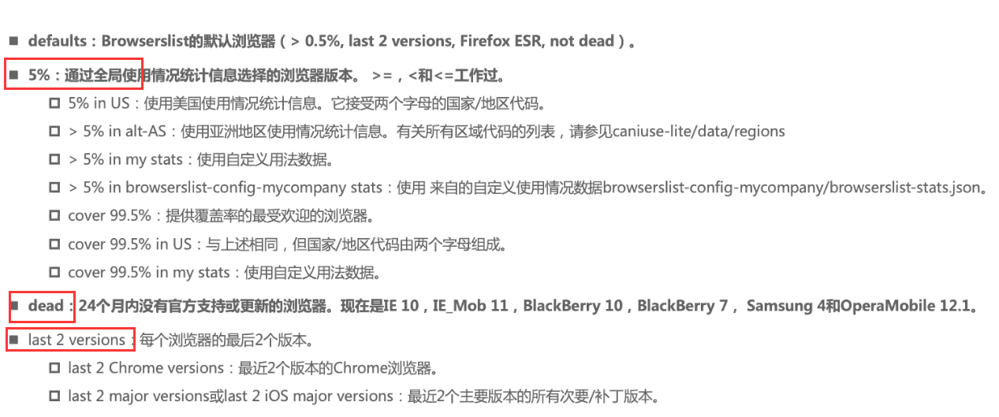

配置方式1:

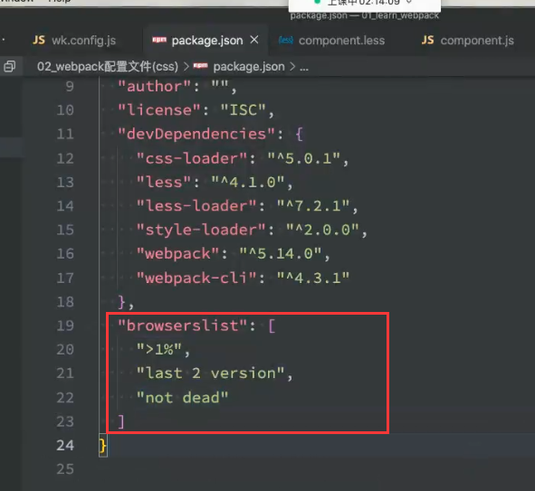

配置方式2：

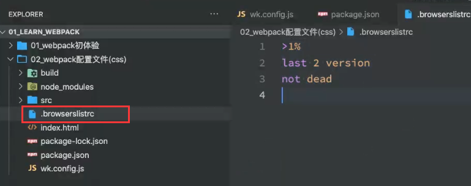

**使用browserslist命令，会去.browserslistrc文件查找配置**

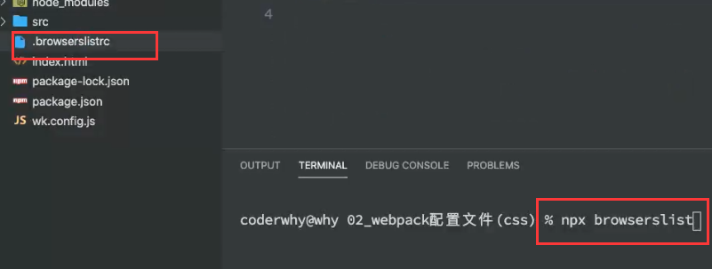

------

## PostCSS工具（结合插件）

postcss是一个转换样式的工具，可以进行css转换和适配，比如**自动添加浏览器前缀、css样式的重置**，但是这个工具需要**依赖一些插件**才能实现功能。

使用步骤

- 查找postcss在构建工具中的扩展，比如webpack中的postcss-loader
- 选择可以添加你需要的postcss相关的插件

------

### 命令行使用PostCSS

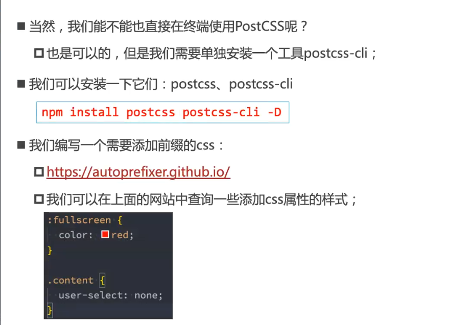

```
npx postcss -o result.css ./src/css/test.css
```

可以看到，已经使用成功了，但是没有添加上浏览器前缀，所以下面我们介绍如何配合插件使用这个工具

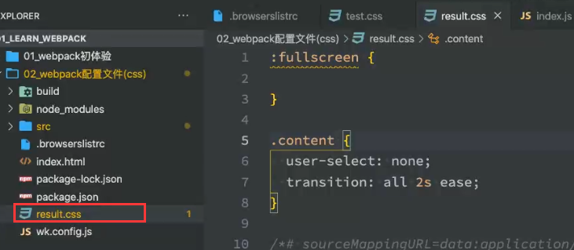

------

### autoprefixer添加前缀

这个插件是**自动添加浏览器前缀**的，用于css适配

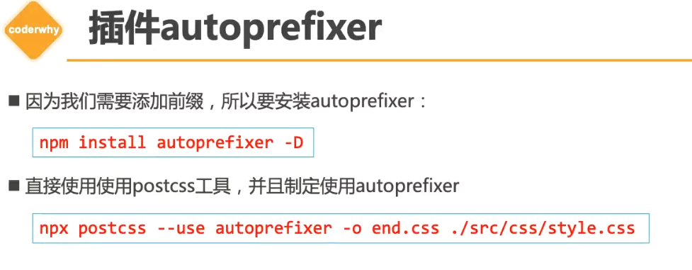

```js
npm install postcss postcss-cli -D
npm install autoprefixer -D
//执行完上面两条安装指令之后执行下面这个指令

//--use表示要用到autoprefixer这个插件   -o表示输出   后面接着的是要转换的文件的目录
npx postcss --use autoprefixer -o end.css test.css
```

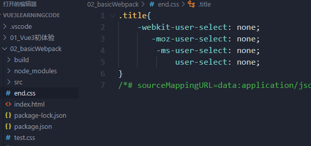

如果要结合webpack使用的话，需要**安装postcss-loader**，配置如下

```js
 module: {
    rules: [
      {
        test: /\.css$/, 
        use: [
          'style-loader','css-loader',
            //完整写法
          {
            loader:'postcss-loader',  //配置postcss-loader这个loader
            //配置选项
            options:{
              postcssOptions:{
                //指定插件
                plugins:[
                  require('autoprefixer')
                ]
              }
            }
          }
        ]
      },
      {
        test:/\.less$/,
        use:['style-loader','css-loader','less-loader']
      }
    ]
  }
```

重新打包后

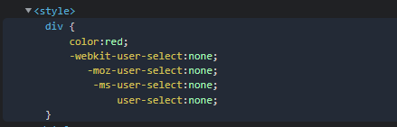

但是这样配置有点繁琐，可以写一个`postcss.config.js`文件导出配置信息

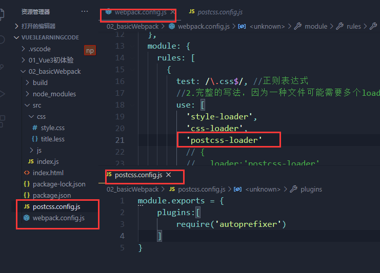

------

### postcss-preset-env（用的较多）

预设会根据browserslistrc生成适配对应浏览器的文件


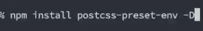

以上面的代码为基础，只需要修改导出的对象即可

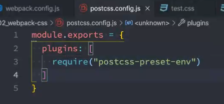

------

### @import的问题

如果将css抽离到单独的文件中，通过@import引入，发现postcss失效了（没加前缀）

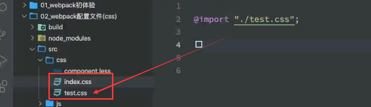

在匹配到index.js文件中import的css文件时，会被postcss-loader进行处理（加前缀），然后被css-loader进行处理。**css-loader会处理@import导入**，将css文件导入到这个当前文件中，然后用style-loader插入浏览器style标签，**也就是说引入的css文件不会回头被poscss-loader处理**。


所以我们需要修改css-loader的配置，importLoaders后面的数字是css-loader后面的loader个数，也就相当于是要回跳的loader的个数

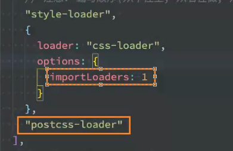

## webpack打包图片文件

------

### file-loader

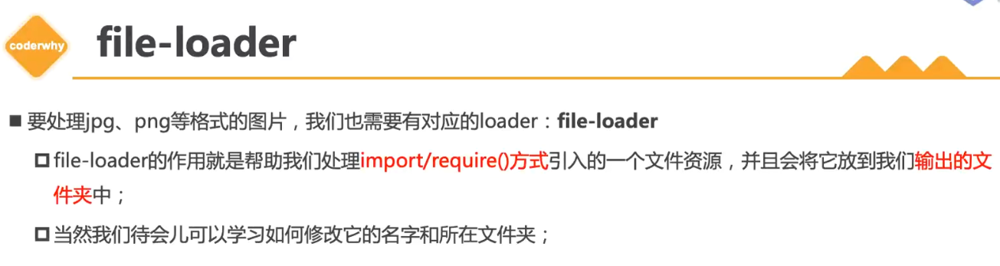

配置如下，注意webpack5要使用file-loader的话需要加上两行额外的配置信息，下图有标注

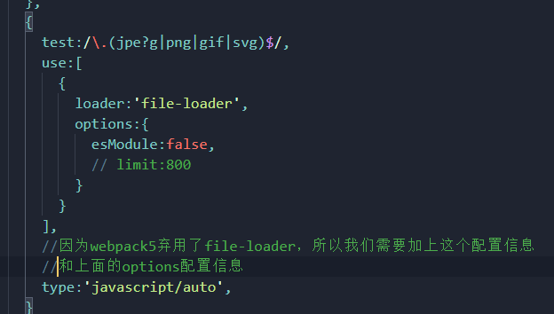

------

#### img元素使用图片

在js中给img添加src属性

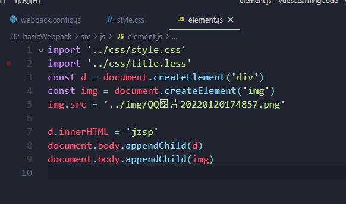

打包没有出错，但是浏览器显示效果如下

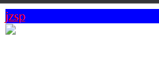

这是为什么呢，因为我们给的src路径，是一个**相对路径**，而这个路径字符串打包层js文件后被index.html引入，路径是**相对于index.html**的，但是并没有对应的图片，而且**仅仅是赋值路径的话，webpack不会将它当做资源，不会加入依赖图，图片不会被打包。**

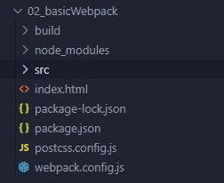

> 这就是为什么，在vue中动态绑定src时用相对路径**字符串**失效，要用require的方式导入
>


修改为下面的代码即可

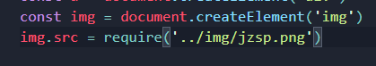

如果失效的话，是file-loader（高）版本问题，需要通过default属性获取资源

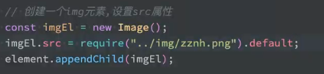

------

#### 打包后的文件命名

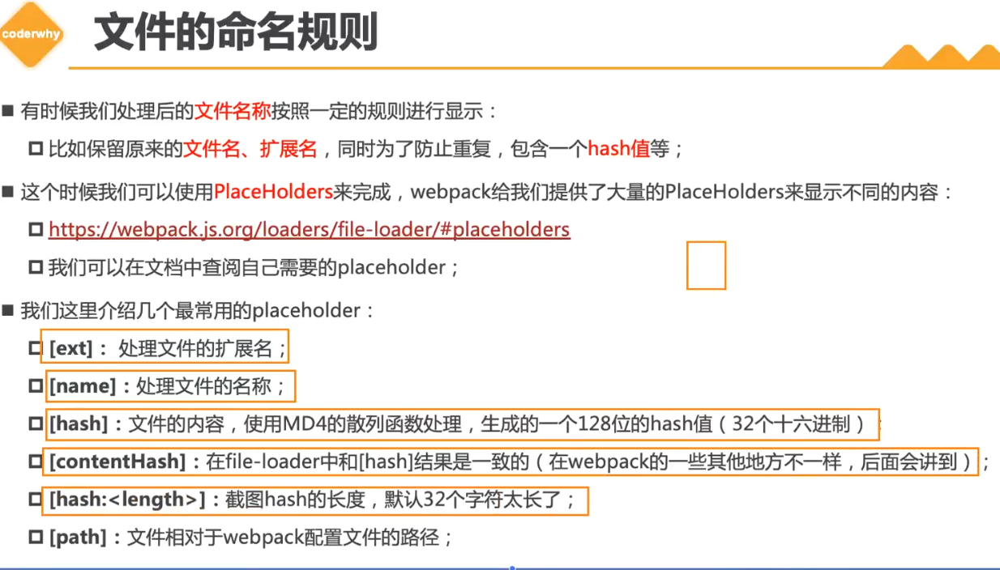

> outputPath可以不配置，在name前面加路径即可

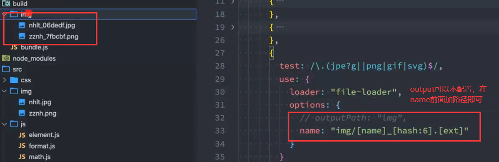

------

### url-loader：file-loader的拓展

base64是可以**直接被浏览器解析**的，用url-loader可以将**图片转成base64保存在js文件中**，而不需要保存在服务器然后请求图片。

> 这种保存方式最好是用于**小图片**

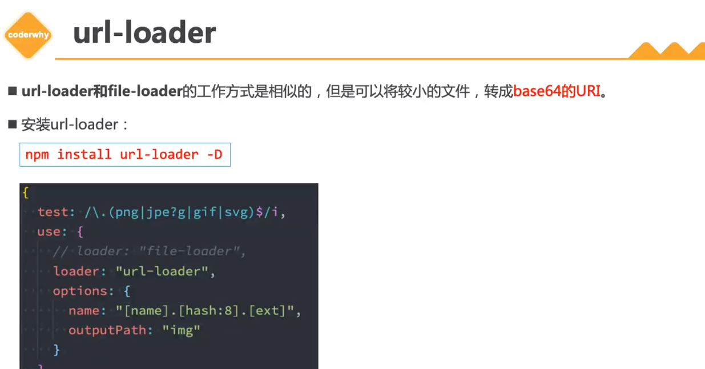

因为用法与file-loader一样，我们直接将loader值改变即可


打包之后发现，图片资源并没有单独打包成文件，而是转成base64格式定义在了打包后的bundle.js中


可以在**options中配置limit来规定超过limit大小**（单位是B字节）的不进行base64转化，**不进行转化的资源会跟file-loader一样打包成单个图片文件**


### webpack5：asset module type


## Webpack打包字体文件

准备iconfont文件，在iconfont官网将想要的图标字体加入购物车，然后点击购物车，点击下载代码


解压后得到


放入项目中并使用


配置方式1**（webpack5需要加上file-loader需要的那两行配置，下面图中没有写，具体查看file-loader部分）**


配置方式2（推荐）


最终会将这些文件打包到输出文件夹的font文件夹中

# webpack插件（Plugin）

plugin其实是一个一个类，需要创建实例


## cleanWebpackPlugin打包前删除dist文件


插件导入的一般都是class，而plugins是数组，数组中是**一个个插件对象**


## HtmlWebpackPlugin对html进行打包处理


生成的html是根据**源码中默认的模板**生成的，生成之前会默认帮我们引入webpack打包输出目录下的js文件（webpack.config.js的output属性）


可以在新建plugin的时候传入内容，最终会被渲染到默认的ejs模板中，比如上面的ejs用到了title属性，那么这里就可以传入一个有title属性的对象（options）


------

**指定生成的html模板**

如果对它打包后的html文件有想修改的地方，可以指定一个html模板，那么打包的时候就会根据这个模板生成对应的入口html文件


下图我们可以看到，通过vue-cli创建的项目中有一个public文件夹，里面有一个index.html，这个就将会被指定为打包后入口html文件的模板，里面有我们挂载的根组件 `div#app`


可以看到，图中有一个`BASE_URL`，这个变量显然是从外面引入的，因为如果使用在new插件时传入的属性的话，前面会加上htmlWebpackPlugins.options读取这个属性。那么这个变量在哪呢？下面我们介绍

## DefinePlugin定义全局变量

在定义的时候要注意，如果对应的值是字符串，会去取对应的变量，如果是传入`BASE_URL:"./"`会去找有`./`这个**变量**的定义。所以要传入字符串的话，需要加一层引号。


## CopyWebpackPlugin

> 作用：将public下的文件复制到打包生成的文件夹中，npm install copy-webpack-plugin -D
>

patterns表示匹配规则，是一个数组，里面有多个**匹配规则的对象**，这个对象有下面这些属性

- from，从哪个文件夹复制
- to，复制到哪个文件夹（一般可以省略，会根据output路径去查找）
- globOptions.ignore，要忽略的文件，需要加上**/前缀

配置如下，index.html文件是要做解析的，解析DefinPlugin插件中的全局变量，而不是简单的复制，所以我们要配置一下，在复制的时候**忽略这个文件**。`**`表示from属性对应的文件夹下的**所有文件夹中的内容（文件夹嵌套）**


# loader和plugin的区别

loaders是在打包构建过程中用来处理源文件的（JSX，Scss，Less..），一次处理一个

插件并不直接操作单个文件，它直接对整个构建过程其作用。

# webpack配置mode

## 关于mode和devtool


假如代码报错了，用打包后的js文件，在控制台是很难定位到错误的，因为代码是压缩过后的代码，如下


所以我们要进行下面两个配置，**mode设置为开发时，devtool设置为source-map映射到真实代码的位置**


这样就可以精确定位到出错的地方了


## webpack实现模块化的原理

准备工作，在js文件中我们分别用commonJS和ESmodule导出了两个对象，在index中导入


配置webpack.config.js，devtool为source-map，打包生成的代码中就不会是eval了（默认是eval函数包裹）


------

### CMJ模块化原理

对打包生成的代码进行处理（删除注释等信息）之后的代码如下

```js
//立即执行函数
(() => {
	//顶层模块对象，将模块数据保存在这个对象中
	var __webpack_modules__ = {
	  //用模块的路径作为key，函数作为value
	  "./src/js/cmj.js": (module) => {
		const cmj_a = 1;
		const cmj_b = 2;

		//将导出的变量放到module对象的exports中
		module.exports = {
		  cmj_a,
		  cmj_b,
		};
	  },
	};
	
	//定义一个对象，作为加载模块的缓存
	var __webpack_module_cache__ = {};
  
	//函数，加载模块的时候通过这个函数返回要加载的模块导出的对象
	function __webpack_require__(moduleId) {
	  var cachedModule = __webpack_module_cache__[moduleId];
	  //1.判断缓存中是否已经加载过，加载过就直接返回
	  if (cachedModule !== undefined) {
		return cachedModule.exports;
	  }

	  //2.如果没有在缓存中，就进行连续赋值，既在__webpack_module_cache__缓存中保存了最后面面这个对象
      //也将最后面这个对象保存到module中
	  var module = (__webpack_module_cache__[moduleId] = {
		exports: {},
	  });
	  
	  //3.开始加载，执行模块取出前面定义的顶层模块对象的对应moduleId属性，这是一个函数，调用函数进行module对象的赋值
      //目前这个代码打包出来的代码，是用不到后面两个传入的变量的
	  __webpack_modules__[moduleId](module, module.exports, __webpack_require__);
  
	  //4.修改完module之后，返回module.exports对象，这个对象其实就是模块导出的对象
	  return module.exports;
	}
  
	var __webpack_exports__ = {};
	
	//0.立即执行函数，具体执行代码逻辑
	(() => {
      //其实是对const {cmj_a,cmj_b} = require('./js/cmj')进行了转化
	  const { cmj_a, cmj_b } = __webpack_require__("./src/js/cmj.js");
	  console.log(cmj_b);
	  console.log(cmj_a);
	})();
  })();
```

------

### **ESM模块化原理**

```js
(() => {
  "use strict";
  //定义了一个对象，对象里面存放的是模块映射
  var __webpack_modules__ = {
    "./src/js/esm.js": ( __unused_webpack_module,__webpack_exports__, __webpack_require__) => {
		//第二个参数相当于是module.exports，内部记录当前模块是esmodule
      __webpack_require__.r(__webpack_exports__);
		//调用d判断module.exports对象中有没有后面这两个属性
		//本质上是给module.exports设置了代理，在调用module.exports的时候，返回的是第二个属性（对象）中的内容
	  __webpack_require__.d(__webpack_exports__, {
        b: () => b,
        a: () => a,
      });
      const b = 2;
      const a = 1;
    },
  };

  //缓存
  var __webpack_module_cache__ = {};

  //require函数的实现，跟commonJS实现一样
  function __webpack_require__(moduleId) {
    var cachedModule = __webpack_module_cache__[moduleId];
    if (cachedModule !== undefined) {
      return cachedModule.exports;
    }

    var module = (__webpack_module_cache__[moduleId] = {
      exports: {},
    });

    __webpack_modules__[moduleId](module, module.exports, __webpack_require__);

    return module.exports;
  }

  //立即执行函数，__webpack_require__给函数对象添加d属性
  //用于判断exports中有没有definition中定义的属性，没有的话就添加属性，
  //并且重写了get方法，相当于是代理了exports的key属性，通过exports取key的时候本质上是取denifition中的ey
  (() => {
    __webpack_require__.d = (exports, definition) => {
      for (var key in definition) {
        if (
          __webpack_require__.o(definition, key) &&
          !__webpack_require__.o(exports, key)
        ) {
          Object.defineProperty(exports, key, {
            enumerable: true,
            get: definition[key],
          });
        }
      }
    };
  })();

  //立即执行函数，给__webpack_require__添加了o属性
  (() => {
	__webpack_require__.o = (obj, prop) =>
	//判断obj对象有没有prop属性
      Object.prototype.hasOwnProperty.call(obj, prop);
  })();

  //立即执行函数，给__webpack_require__添加了r属性，在exports中记录是ESmodule
  (() => {
    __webpack_require__.r = (exports) => {
      if (typeof Symbol !== "undefined" && Symbol.toStringTag) {
        Object.defineProperty(exports, Symbol.toStringTag, { value: "Module" });
      }
      Object.defineProperty(exports, "__esModule", { value: true });
    };
  })();

  var __webpack_exports__ = {};
  (() => {

    __webpack_require__.r(__webpack_exports__);
	//调用前面的__webpack_require__函数，返回值是对应模块导出的对象
	var _js_esm__WEBPACK_IMPORTED_MODULE_0__ = __webpack_require__(
      "./src/js/esm.js"
    );
	
      //本质上是取_webpack_modules_中对应模块的函数中调用d方法的第二个的definition对象中的值
      //在d函数中作了代理，重写了get函数
    console.log(_js_esm__WEBPACK_IMPORTED_MODULE_0__.a);
    console.log(_js_esm__WEBPACK_IMPORTED_MODULE_0__.b);
  })();
})();

```

## 认识source-map


打包尾部添加了注释，用于指向sourcemap对应源码的位置


------

**分析source-map**


可以在webpack官网查看sourcemap的值和对应的性能，下面我们一一介绍


- devtool不设置时代码报错信息如下，定位的是丑化之后的代码，找不到报错对应的源模块


- 设置了eval时的报错，会映射到出错的源文件，从下面第二张图可以看见，在eval尾部加了**sourceURL**指向打包的源文件


- source-map


- eval-source-map，source-map会转成base64生成到eval函数后


- inline-source-map将所有的sourcemap转成base64添加到打包文件的最后


- cheap-srouce-map


- 不一一介绍了。。。直接上最佳实践


# Babel


需要安装@babel/core，如果想在命令行使用babel的话还需要安装@babel/cli


--out-dir输出到**目录**


--out-file输出到**文件**


------

## babel结合插件

但是仅仅像上面这样操作是不能转化的，需要结合babel的插件使用，**就像postcss工具一样**


------

## @babel/preset-env预设

但是如果要转换的内容过多，一个个设置是比较麻烦的，我们可以使用预设`(preset)`，就像postcss-preset-env。

```js
npm install @babel/preset-env -D

在命令行中使用
npx babel demo.js --out-file test.js --presets=@babel/preset-env
```

------

## babel原理


源代码会先进行词法分析


词法分析生成的tokens数组


对tokens数组进行语法分析


生成AST抽象语法树


经过遍历，访问ast中的结点，在**应用插件**的时候修改了原来AST树中的代码


## babel-loader结合webpack使用

可以发现，前面打包生成的js文件是没有转成es5的语法的


我们需要安装`babel-loader`和`@babel/core`来结合webpack使用

```js
npm install babel-loader @babel/core -D
```

如果仅仅是下面这样配置，是不会解析的，因为我们还需要配置插件

```js
  rulse:[
    {
      test:/\.js$/,
      use:"babel-loader"
    }
  ],
```

指定插件，配置如下**（注意，使用插件之前需要npm安装）**

```js
  module:{
    rules:[
      {
        test:/\.js$/,
        use:{
            loader:"babel-loader",
            options:{
                plugins:[
                    "@babel/plugin-transform-arrow-functions",
                    "@babel/plugin-transform-bloc-scoping"
                ]
            }
        }
      }
    ],
  },
```

使用预设(需要安装@babel/preset-env)，会根据browserslistrc生成适配对应浏览器的文件，postcss的预设也是。

```js
  module: {
    rules: [
      {
        test: /\.js$/,
        use: {
          loader: "babel-loader",
          options:{
            presets: ["@babel/preset-env"]
          }
        },
      },
    ],
  },
```


注意，该代码是在mode为development下的代码，并且devtool为source-map


## babel配置抽离


## 认识Pollyfill

pollyfill给我们的代码打上补丁，有更好的浏览器兼容性


**安装**

@babel/polyfill已经不建议使用了，需要单独安装另外两个包：core-js和regenerator-runtime


```js
npm install core-js regenerator-runtime --save
```

在babel.config.js中配置pyllyfill，并且忽略node_modules目录下的文件


属性介绍


第三个值


如果出现下面的报错，请在配置中指定corejs版本


## TypeScript的编译（预设）

### 使用ts-loader进行编译

- tsc --init生成tsconfig.json

- npm install ts-loader -D（ts-loader是依赖typescript的，安装ts-loader的时候内部也安装了typescript）


但是这样解析ts文件的话，是没有进行pollyfill的。此时我们可以通过babel对ts进行编译（不需要安装ts-loader和typescript包）

### 使用babel编译ts（预设）

安装预设


想要使用pollyfill的话需要设置useBuiltIns值


### 最佳实践

既然ts-loader和babel-loader都可以编译ts，那么要怎么进行选择呢？

- babel-loader有一个缺点，就是不会对ts进行类型检测，编译打包的时候，如果不符合类型也不会报错
- ts-loader的缺点就是，无法增加pollyfill

那么我们可以在打包前用tsc进行检测，打包用loader进行打包


# 配置vue环境

## 第一个警告：compiler+runtime和runtime-only


引入vue3，编写如下代码


浏览器中并没有显示，并且报了**两个警告**，其中一个警告是我们写的代码无法渲染的原因


**原因是如果有template的话，我们需要指定`runtime+compiler`才能对template进行编译，但是它打包默认使用的是`runtime-only`**


所以我们需要选择导入的vue是有compiler的版本


重新打包后成功渲染


## Vue编写dom模板的三种方式


**解析.vue文件也需要对应的loader（vue3是vue-loader@next）**


注意：配置完后打包**如果**发现报错了，是因为我们还需要一个loader来辅助完成。这个loader是`@vue/compiler-sfc`。安装即可，不需要配置，在vue-loader内部会使用的


重新打包还是报错，如下，是因为我们还需要一个plugin：**VueLoaderPlugin**


配置plugin


重新打包，解析成功


> 注意，用vue-loader之后import引入vue即可，不需要引入vue.esm-bundler了


## VScode对SFC的支持


## 另一个警告


下面图片的意思是，从3.0.0的runtime+compiler的vue开始，希望做两个全局feature flag设置。**在DefinePlugin中配置**

- vue_options_api，为false的话，说明使用的都是vue3的setup api
- vue_prod_devtolls，为false的话，生产环境下就不会将devtools工具生效。
- 在打包vue的时候会根据上面两项配置来（为false）做**tree shakeing**，这个行为会**舍弃**掉关于options api的vue代码，使**代码体积更小**


配置完后重新打包，控制台不报警告


# webpack搭建本地服务（开发时）


## watch模式

在**webpack.config.js**导出的配置对象中添加watch属性，或者在**package.json**的script属性中的启动webpack的命令中添加--watch表示


## webpack-dev-server（WDS）

watch和live server性能并不高，原因有下

- 对所有的源代码都进行重新编译
- 编译成功后，都会生成新的文件
- 会刷新页面（没有保留页面状态）

### 基本使用


安装并在package.json中配置（下面截图的时候打字错了。。。是serve）


执行完npm run serve之后发现**build文件夹中并没有文件**，这是因为webpack-dev-server对我们的代码进行打包后**并没有输出**这些打包后的文件，先将打包后的静态资源**放到内存**中，内部利用express服务器来访问这些资源。


如果直接输出打包文件的话，在浏览器访问的时候，express服务器**会先读取文件再放入内存，再转换成数据流返回给浏览器**。这是为了提高效率，少了从文件到内存的过程。

### 相关配置

需要在导出的根对象上添加decServer属性，来进行对webpack-dev-server的配置


#### hot和hotOnly热模块替换

为true的时候开启模块热替换，具体的在后面介绍

设置hotOnly可以更精确的更新内容，举个例子：设置hot的时候，我们代码出错了，然后编译报错，又修改成正确的代码，回到浏览器发现页面刷新了。如果我们设置了hotOnly的话，就只会重新加载发生错误的代码，浏览器不会进行刷新。

#### contentBase指定未打包资源的路径

devServer中contentBase对于我们直接访问打包后的资源其实并没有太大的作用，它的主要作用是如果我们**打包后的资源，又依赖于其他的一些资源**，那么就需要指定从哪里来查找这个内容。

> 如果webpack没有提供相应的资源（在打包后的文件中不存在） 就去contentBase配置的目录下去寻找。

- 没设置contentBase的情况


- 设置了contentBase为./abc的情况`(一般需要设置为绝对路径)`


例如下图在index.html下引入了abc.js，但是它并没有被webpack打包到内存中。


如果设置了contentBase为`./abc`，那么就会在abc目录下去找对应的资源文件


在开发时经常会这么配置，不希望public中的文件在开发时进行copy


------

注意，现在版本好像不同，新版本可能是下面这么配置的


#### host设置主机地址


#### open、port、compress设置gzip压缩


compress为true的时候可以让传输的文件用**gzip进行压缩**，浏览器在解析到是gzip的时候会进行解压，这样可以**提高传输效率**（html是不会压缩的）。但是在**本地服务**的话，这个一般是**不开启**的，只会增加压缩成本。


#### proxy（开发环境下解决跨域）


devServer本质上是一个**express服务器**，配置了proxy之后，axios发送的请求会交给这个devServer来帮助发送，**服务器向另一台服务器发送请求是没有跨域问题的**。

> 注意：这个代理是**开发阶段**处理跨域的方案，在**部署**的时候还要配合后端来解决跨域问题（nginx）


但是像上面这样写是有问题的，他会请求http://localhost:8888/api/moment，也就是说会加上**/api这个前缀**，在官方有如下说明


最终需要进行如下配置，pathRewrite会把`/api`转化成空串。

secure为false可以代理到https服务器（关闭证书验证）

changeOrigin设置为true可以告诉服务器真正请求的来源，为false的话来源就是**真实ip**，为true就是**代理的ip**


#### historyApiFallback

用于解决SPA页面在路由跳转之后进行刷新返回404的问题，设置为true的时候，如果是404，会返回index.html


## webpack-dev-middleware（用的很少）

```js
npm install webpack-dev-midleware 
```


## HMR模块热替换

只对修改代码的模块进行替换，这样就可以不用每次修改代码的时候都**刷新浏览器**，不会刷新整个页面


进行了上面的配置之后，可以在浏览器控制台看到HMR信息，但是更新代码之后，整个页面仍然进行了刷新。因为我们`需要指定哪些模块发生更新时进行HMR`。我们可以用下面这种方式开启指定要监听的模块

- 第一个参数是要监听的模块的地址
- 第二个参数是热替换之后的回调函数


打包后，我们修改element.js中的代码，可以看到，浏览器并没有刷新，而是进行了热替换，输出语句是重新替换加载模块后在控制台后面加的，如果是刷新浏览器的话是不会往后面累加输出语句的。


在使用框架开发的时候是不用担心这个配置的


vue的HMR


### 原理：使用了socket


本质上webpack-dev-server创建了两个服务

- express提供静态资源
- Socket服务，socket长连接

在打包生成js文件的时候，我们浏览器访问的时候，会发送http请求（**短连接**，请求到之后就断开）通过express请求静态资源，下载到浏览器上并且执行。socket会创建**长连接**，服务器主动将（HMR发生变化后，将变化封装在json文件和js文件中）文件发送给客户端，通过这个文件中的变化内容更新内容。


# resolve模块解析


**设置别名**


# webpack配置分离

创建config文件夹，再创建三个js文件，分别对应**公共配置，开发特需配置，生产特需配置**，并修改script下的指令（**指定对应配置文件进行指令的执行**）

> 注意，下图中serve指令写错了，是`./config/webpack.dev.config.js`


现将原来webpack.config.js中的内容都复制到comm中，然后根据生产环境和开发环境的需要分别**剪切**到对应的js文件中（在comm中只留下公共都需要的配置）


利用**webpack-merge**对这两个模块进行合并（先安装）


注意相对路径的问题(有点迷)

- enrty上写的相对路径，并不是相对于文件所在的路径，而是**相对于context配置的路径**（如果要配置context的话，需要配置成绝对路径，**默认是项目的根目录**）。将context设置成当前目录的上层目录的话，就可以找到了（因为我们的配置是写在g根目录的config文件夹下的）


> 相对于根目录的相对路径是不需要改的

## 另一种区分生产环境和开发环境的方式


module.exports导出一个函数，上图输出的对象会传入这个函数的参数中。这个函数返回的是原先导出的对象，里面是配置信息


# 优化之分包


## 手动分离代码

- 入口手动分离代码，会将entry的key传入filename的`[name]`占位符


## Entry Dependencies代码分包

如果main中依赖了lodash，index中也依赖了lodash，我们不希望打包生成的两个文件中都包含lodash，而是将lodash单独分离出来，可以这么写


可以用shared指定多个


## optimization.SplitChunks分包

splitChunks本质上是用了splitChunksPlugin插件

SplitChunksPlugin去重和分离代码（插件**默认被集成到webpack中**了，也有了一些默认的配置，我们可以通过optimization.splitChunks修改配置）

默认是对**异步导入**的模块进行分包处理（chunks默认是async），可以**设置为all**对同步和异步两种方式导入的包进行分包处理


> 即使是设置为**initial同步导入**，webpack也会对异步导入的代码进行分包

SplitChunks其他属性，了解


cacheGroups会进行缓存，匹配到的时候会进行缓存，匹配结束的时候会将所有匹配到的内容输出到name属性对应的文件


------

**optimization.chunkIds属性**，决定生成的id，id就是打包生成的前面的字符串


------

**output.chunkFilename**指定分包出来的文件名字


通过魔法注释可修改name占位符的内容


vue官网介绍了这个魔法注释


## optimization.minimizer代码压缩

### terser压缩js代码

可以使用Terser将原来很长的变量名等进行丑化压缩，使代码长度更短

也可以将无意义的代码（dead_code，不可达代码）进行删除，例如删除`if(false)`的代码

> 原理：uglify 包里有 ast.js 所以它一定是生成了抽象语法树 接着遍历语法树并作出优化，像是替换语法树中的变量，变成a，b，c那样的看不出意义的变量名。还有把 if/else 合并成三元运算符等。 最后输出代码的时候，全都输出成一行。


```js
npx terser ./src/abc.js -o abc.min.js
//将./src/abc.js文件压缩到abc.min.js中
```

没有丑化，因为需要一些其他的配置，下面就不演示了，直接进入webpack使用terser环节


------

webpack中使用terser

webpack其实是默认使用了TerserPlugin了


```js
const TerserPlugin = require("terser-webpack-plugin");
//配置
module.exports = {
  optimization: {
    minimize: true,
    minimizer: [new TerserPlugin({
        parallel:true   //开启并发进程，提高编译速度
    })],
  },
};
```


### css-minimizer-webpack-plugin压缩css代码

安装完成后导入直接在plugins中使用即可


也可以在minimizer中使用这个插件


## optimization.runtimeChunk

用于配置运行时相关的代码（在运行环境中对模块进行解析，加载的相关代码，比如**import函数相关的代码加载**）是否要抽离到一个单独的Chunk中


## 代码懒加载

我们通过下面这种方式来测试，点击按钮的时候加载element文件，获取导出的内容并且输出


打包之后运行代码，可以看到默认是不会去下载对应js文件的


点击按钮之后下载了对应分包的js文件


res.default才是导出的值


## prefetch和preload

代码懒加载其实是有缺点的，因为我们是点击了按钮，才告诉服务器我们要请求这个文件。如果文件很大，那么也会造成不好的用户体验。我们可以告诉浏览器，在浏览器空闲的时候去下载这些文件，点击按钮的时候做的是**加载文件**。

- prefetch魔法注释，开启之后在浏览器网络中可以看到在其他资源加载完成之后会去加载这个打包资源


- preload魔法注释，开启之后浏览器中看不到下载该资源的请求，因为它是跟父chunk一起下载的

preload会预加载，优先级比prefetch高


## CDN性能优化

CDN称为内容分发网络，指通过互相连接的网络系统，利用最靠近用户的每个服务器，更快更可靠地将资源发送给客户，来提供高性能，低成本的网络内容。

一般开发中，我们使用CDN主要是两种方式

- 打包所有的静态资源放到CDN服务器，用户所有资源都是通过CDN服务器加载的
- 一些第三方资源用CDN方式加载（bootcdn）

对于第一种方式，我们可以购买CDN服务器，可以**直接修改publicPath**，在打包时添加上自己的CDN地址。

对于第二种方式，我们可以设置导出的配置对象的externals属性，告诉webpack哪些资源需要全局获取（key是告诉哪个是不需要打包的，value是库暴露出来的全局对象）


这里我们记录一下我的项目优化

```js
    <script src="https://unpkg.com/vue@3.2.31/dist/vue.global.js"></script>

    <!-- 导入样式 -->
    <link rel="stylesheet" href="https://unpkg.com/element-plus@2.0.4/dist/index.css" />
    <script src="https://unpkg.com/element-plus@2.0.4/dist/index.full.js"></script>
```


在开发环境建议还是使用按需引入的插件，不要使用cdn。生产环境配置了externals之后可以注释掉按需引入的插件


可以看到最终打包的变化


## MiniCssExtraPlugin对css分包

这个插件安装之后需要在两个地方使用，在生产环境要在loader中进行下面的配置（开发环境是要使用style-loader的）


## hash，chunkhash，contenthash文件指纹

------

hash这个placeholder的值是**由项目决定**的，当修改了文件重新打包的时候，**项目hash发生改变**，那么**每个文件都要重新打包**，浏览器也要重新加载打包后的文件（因为项目hash变了，打包的文件名中是配置了hash值的，所以文件名也会发生改变，会重新打包）


------

如果用的是chunkhash，那么文件修改的时候，只会重新打包对应修改了的文件


可以看到，只对第一个打包文件进行了修改


chunkhash的值是由打包入口决定的，可以看到main.css和main.js的hash值是一样的，这是有缺点的，因为如果修改了入口的代码，那么入口发生变化，chunkhash发生变化，会重新打包


------

contenthash

contenthash是根据每个分包的文件内容来决定，修改代码只会重新打包对应的包

## scoping hoisting作用域提升


# tree shaking

了解tree shaking


## 方案一：usedExposed+Terser

> 使用这种方案做测试的时候，需要设置mode为development模式。production模式默认设置了usedExposed

usedExports的作用是标注哪些函数是没有被使用的，会打上魔法注释：unused harmony export xxx，这个魔法注释会被terser解析，从打包的代码中删除


我们mul是没有被其他模块使用的，而sum被使用了，可以发现，用d函数加载属性的时候没有加载mul 函数，并且加上了魔法注释


## 方案二：sideEffects副作用

在package.json中设置sideEffects，可以指定哪些模块是没有副作用的，告诉webpack哪些模块是有副作用的，不能随便删除


指定了format是有副作用的，那么即使这个模块在其他地方被导入了，哪怕没有使用里面导出的东西，webpack也不会将它删除。


指定css文件的副作用


也可以在webpack的配置文件的loader中设置css的副作用


## 总结


## css treeshaking

默认情况下，css样式都会被打包的，但是这个title是没有意义的，因为我们根本没有title这个类能添加上这个样式


**PurgeCSS插件**

```js
npm install puegecss-webpack-plugin -D
```


进行paths配置，路径需要依赖glob库。`/**/*`表示所有文件夹下的所有文件，nodir表示匹配的是文件而不是目录

safelist可以设置哪些样式是不需要删除的（html也需要添加到里面）


# HTTP压缩gzip


安装并配置

```js
npm install compression-webpack-plugin -D
```


可以配置一些其他属性


# HTML优化

## HtmlWebpackPlugin

原来介绍的HtmlWebpackPlugin有一些其他的配置可以进行HTML优化

- inject：指定打包生成的静态资源注入到html的位置
- cache：当文件没有发生改变时，直接使用缓存，不需要重新打包
- minify：。。。


## InlineChunkHtmlPlugin


```js
npm install react-dev-utils
```


在plugins中配置


# webpack打包分析

## --profile生成打包分析文件

默认打包的时候，会给出打包分析（总时间）


配置脚本后执行status，会生成对应的json文件


进入https://github.com/webpack/analyse，即将生成的json文件选中，就可以查看打包信息


## BundleAnalyzerPlugin


# Webpack打包原理（未完成）

## 构建流程

将根据文件间的**依赖关系对其进行静态分析**，然后将这些模块按指定规则生成静态资源

当 webpack 处理程序时，它会递归地构建一个依赖关系图(dependency graph)，其中包含应用程序需要的每个模块，然后将所有这些模块打包成一个或多个 bundle


从启动webpack构建到输出结果经历了一系列过程，它们是：

1. 解析webpack配置参数，合并从shell传入和webpack.config.js文件里配置的参数，生产最后的配置结果。
2. 注册所有配置的插件，好让插件监听webpack构建生命周期的事件节点，以做出对应的反应。
3. 从配置的entry入口文件开始解析文件构建AST语法树，找出每个文件所依赖的文件，递归下去。
4. 在解析文件递归的过程中根据文件类型和loader配置找出合适的loader用来对文件进行转换。
5. 递归完后得到每个文件的最终结果，根据entry配置生成代码块chunk。
6. 输出所有chunk到文件系统。

## 前期准备

在下载来的webpack包中自定义一个why文件夹，同样地创建webpack.config.js进行配置。


新建一个build.js，通过运行这个build.js文件使用webpack（webpack本质上是一个函数）进行打包


## 阅读源码

下面是webpack函数


判断有没有callback，里面判断有没有watch，有watch就会在文件改变时重新编译


如果没有callback就会执行create函数


create方法中判断options是不是数组，如果是对象的话，就创建compiler返回，进而在上面那张图片中进行解构并且作为webpack函数的返回值


在createCompiler内部中还会注册插件，如果是类的话，就调用实例内部的call方法


注册完插件之后调用了两个钩子，创建了一个WebpackOptionsApply类的实例，调用process处理其他的属性


而process中是将其他的属性**转成插件注入**到webpack的生命周期中，作用是将compiler对象传入apply函数中


compiler对象中有一个个hook，插件中内部其实是通过这些hooks**注册对应生命周期的监听事件**，在webpack达到对应的生命周期的时候，会**调用这些监听回调**，


返回了Compiler之后会执行compiler.run方法

# 自定义loader

## 起步

```js
//loader本质上是一个函数，第一个参数是content，是通过rs.readFIle读取到的内容
//所有内容在经过loader之后都必须转成js格式的字符串
module.exports = function (content, sourcemap, meta) {
  console.log(content, "哈哈哈我是loader");
  //必须返回content，不然会报错
  return content + 123;
};
```


## NormalLoader和PitchLoader的概念


导出的loader函数叫做NormalLoader，另外还可以有一个pitchLoader，那么他们的执行顺序是什么呢？

答案是，pitchLoader是按顺序执行的，而NormalLoader是逆序执行的


## enforce属性修改loader的执行顺序


如果拆分成多个rule，那么loader的规则是按pre=>normal=>post顺序


## 同步loader和异步loader

Loader返回数据的方式

- `return content`
- `this.callback(null,content)`
- this.async异步loader


## 传入参数和校验参数

安装`npm install loader-utils@1.0.4 -D`


校验参数，需要安装schema-utils库


校验结果


## babel-loader案例

需要安装`@babel/core`和`@babel/preset-env` 


## 自定义mdloader

我们希望达到，编写markdown，然后经过mdloader之后转成html标签，插入导html中

既然我们要插入导html中，我们肯定也是需要**安装html-webpack-plugin并且配置**

### 准备工作

编写md


加入依赖图


定义wjjmd-loader


配置


测试（报错是因为不符合js规范）


### 使用marked库

> npm install marked 


报错是因为，返回的不是javascript语法的字符串

### 使用html-loader解析html字符串


也可以用这种方式返回js语法的字符串


拓展highlightjs


加入css


# 自定义Plugin

Tapable库


## 初步使用Tapable


监听回调


call触发事件


## Hook的类型

**同步hook**

bail：有返回值时不会执行监听


loop，返回值为true时不断触发


waterfall：当返回值不为undefined时，会将**这次返回的结果作为下次事件的第一个参数**;


**异步hook**

constructor中定义hook


tapAsync监听，callback是执行结束的时候回调


触发事件，因为我们上面监听的是series串行hook，所以监听了多次的话，会一个一个执行监听回调


如果是parallel这个hook，那么监听回调是并行执行的


------

可以用tapPromise监听事件


触发监听


## 自定义plugin


创建一个class类，实现apply方法


apply方法会传入compiler，里面有很多的hook可以监听


对afterEmit这个hook进行异步监听，会默认传入第一个参数compilation


第一步，获取文件输出路径

