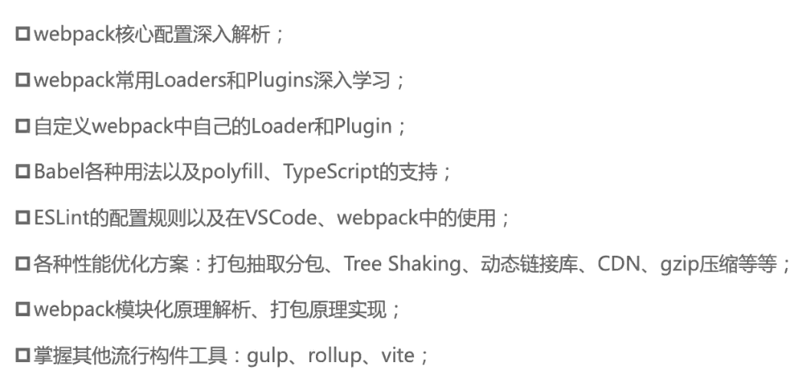

# webpack的依赖安装和初体验

------

## 安装依赖

webpack是依赖node环境的，所以要先安装node

webpack的安装分为webpack和webpack-cli，webpack-cli是解析配置文件的，vue自己实现了vue-service-cli代替了webpack-cli的功能，也就是说webpack-cli是“可有可无的”，但是在学习过程中还是需要安装的。

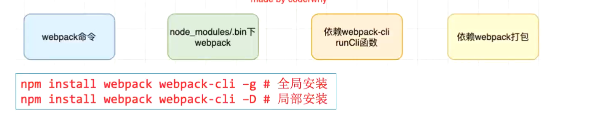

局部安装的时候，不要忘了**先npm init生成package.json**，安装完成后需要用npx执行webpack命令，不然在命令行中输入webpack用的是全局的webpack。

也可以在package.json的script标签添加命令，在npm run build的时候会默认去node_modules中去寻找

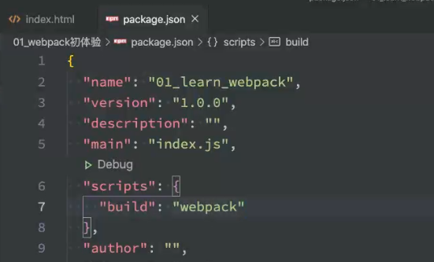

------

## 初体验

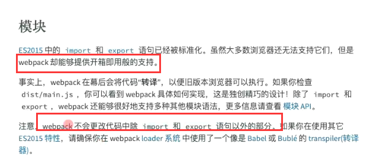

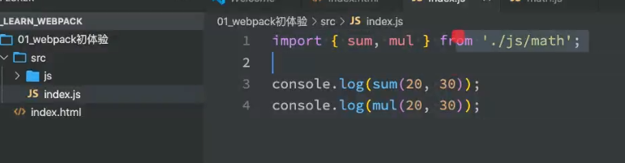

使用esm的时候，引入要加type=module，否则会报错

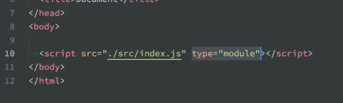

------

使用commonjs模块化的话

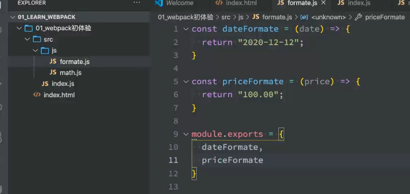

在indexjs中引入，也是肯定会报错的，因为浏览器根本不认识commonjs规范

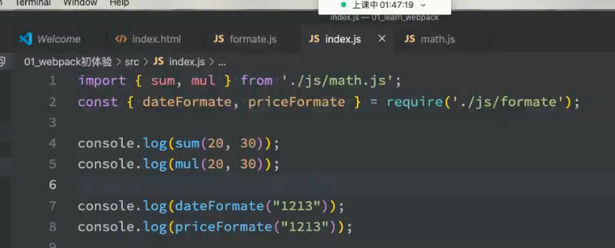

 我们可以利用全局webpack进行打包（会默认找当前文件夹下的src目录下的index.js文件，这是webpack的默认入口文件的路径），生成**dist**文件夹下的打包后的文件

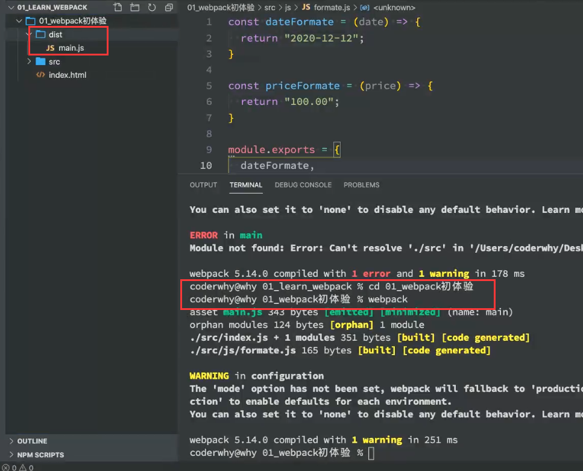

直接引入打包后的main.js文件，浏览器都可以识别，因为webpack在打包的时候，对esm和cmj做了解析

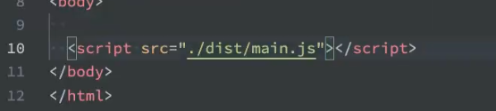

# webpack的核心配置选项

------

## webpack.config.js

可以通过下面的命令修改入口文件和出口文件

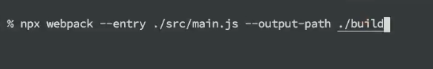

但是这样会很麻烦，不方便管理，所以我们可以在根目录创建webpack.config.js导出配置对象（**需要用commonjs方式导出**）

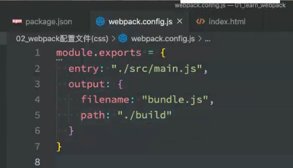

但是报错了，因为output里的路径不能是相对路径

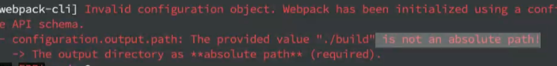

所以我们需要用到path模块

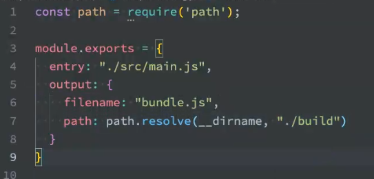

------

## 指定配置文件

在执行webpack的时候，会先在根目录下寻找有没有webpack.config.js配置文件，如果没有的话就会去默认路径（src/index.js）目录下进行打包，那么我们要怎么指定配置文件呢？

查阅官网，可以用--config指定配置文件

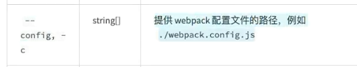

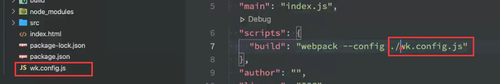

------

## webpack依赖图

webpack在对文件进行打包的时候。会从入口开始，查找所有依赖的文件生成依赖图，如果从入口开始没有某个文件的依赖（没有被关系图中的某个文件引入），那么这个文件就不会被打包

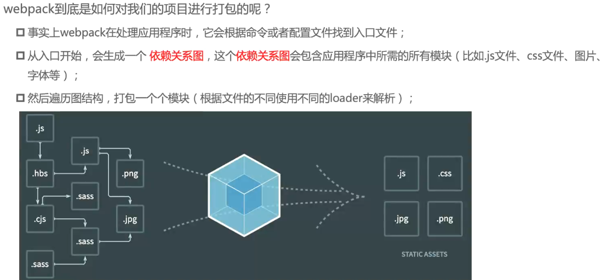