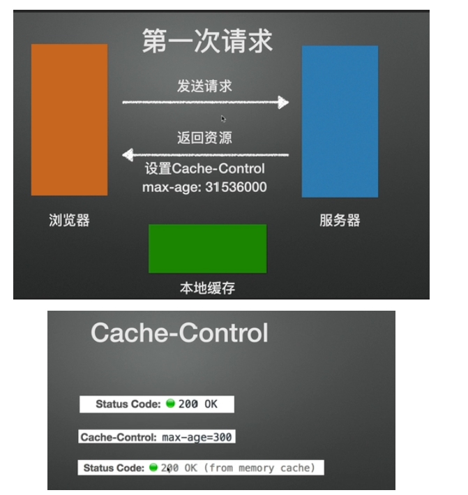
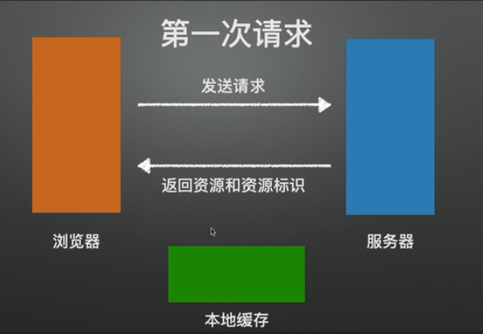
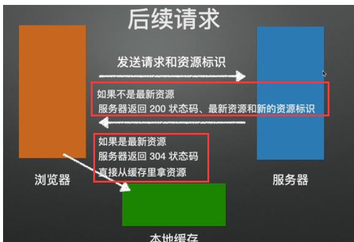
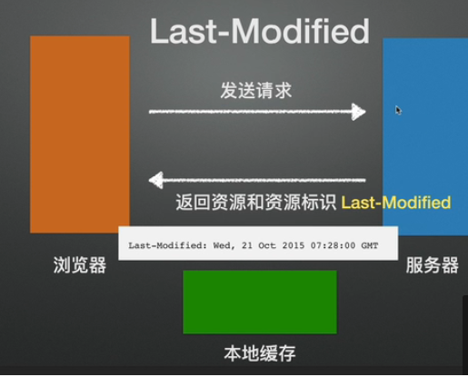
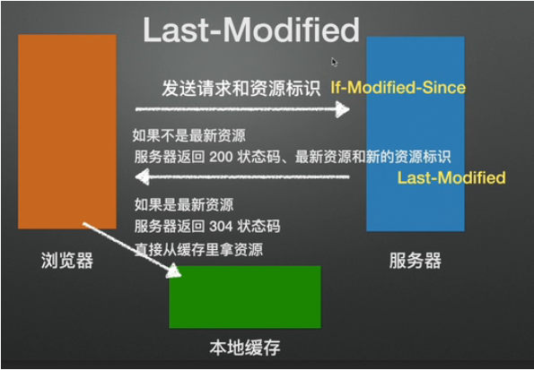
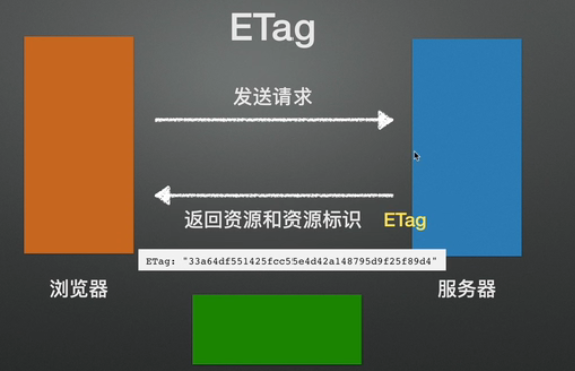
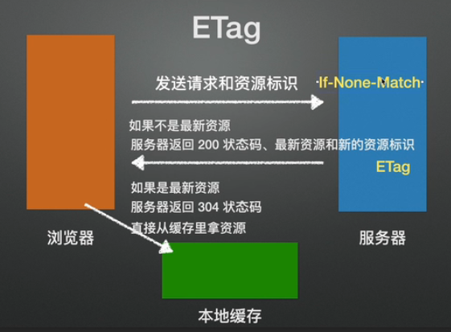
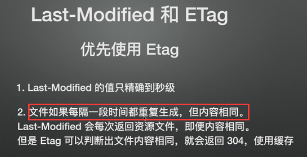
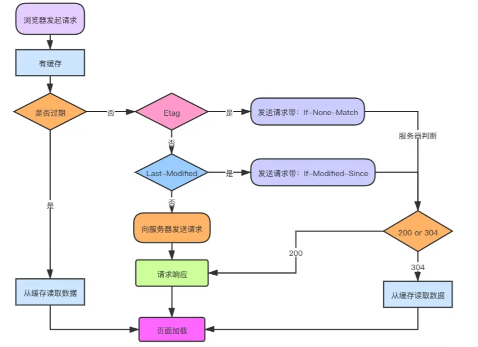

## **为什么需要HTTP缓存？**

用户输入url到显示页面，会经过cpu计算，页面渲染以及网络请求等阶段，最大的不确定因素就是网络请求。用户第一次访问浏览器的时候，会发送请求获取页面的静态资源。那么我们之后访问的时候还有必要去获取静态资源吗？其实我们可以用缓存策略，将静态资源保存在本地，这样就可以减少网络请求的次数，加快页面渲染。

**HTTP缓存有两个方面：**

> 强制缓存优先级高于协商缓存，而协商缓存中，etag的优先级又高于last-modified

- 强制缓存

如果服务器认为某些资源是需要缓存的，可以在`响应头中设置Cache-Control`，设置max-age来决定缓存的时间。浏览器在获取到这个请求的相应结果的时候，会缓存本次请求的资源，如果下次发送同样的请求时，会先在本地缓存中查找资源，判断max-age有没有过期。没有过期的话，就会直接获取缓存文件，减少http请求次数。

- 协商缓存（对比缓存），服务端缓存策略

如果服务器使用了协商缓存策略，服务器在响应时会加上`返回资源和资源标识`，浏览器在获取到资源的时候就会放入缓存

后续请求的时候会携带上请求信息和这个资源标识，服务器进行`资源标识判断`，如果服务器判断资源标识是最新的，就返`回304状态码，让浏览器直接从缓存中获取资源`，`否则就返回200状态码以及最新的资源和资源标识`

## **资源标识介绍**

资源标识有两种：

- last-modified：服务器返回，用于标识上次修改资源的时间

在发送请求的时候，**请求头**中会携带if-Modified-Since（其实就是Last-Modified），在服务器中和Last-Modified进行判断

- Etag：服务器返回，资源对应的唯一字符串（更推荐，比较精确）

下次请求的时候会在`请求头中携带上If-None-Match`（其实就是If-None-Match)，在服务器中跟Etag进行对比

## **last-modified和etag的区别**（etag更好）

## **浏览器缓存的全过程**

- 浏览器**第一次**加载资源，服务器返回 200，浏览器从服务器下载资源文件，并缓存资源文件与**响应头中的缓存信息**，以供下次加载时对比使用；
- 下一次加载资源时，由于**强制缓存优先级较高**，先比较当前时间与上一次返回 200 时的时间差（max-age），**如果没有超过 cache-control 设置的 max-age，则没有过期，并命中强缓存，直接从本地读取资源**。如果浏览器不支持HTTP1.1，则使用 expires 头判断是否过期；
- 如果资源已过期，则表明强制缓存没有被命中，则**开始协商缓存，向服务器发送带有 If-None-Match 和 If-Modified-Since 的请求**；
- 服务器收到请求后，**优先根据 Etag** 的值判断被请求的文件有没有做修改，Etag 值一致则没有修改，命中协商缓存，返回 304；如果不一致则有改动，直接返回新的资源文件带上新的 Etag 值并返回 200；
- 如果服务器收到的请求没有 Etag 值，则将 If-Modified-Since 和被请求文件的最后修改时间做比对，一致则命中协商缓存，返回 304；不一致则返回新的 last-modified 和文件并返回 200；

