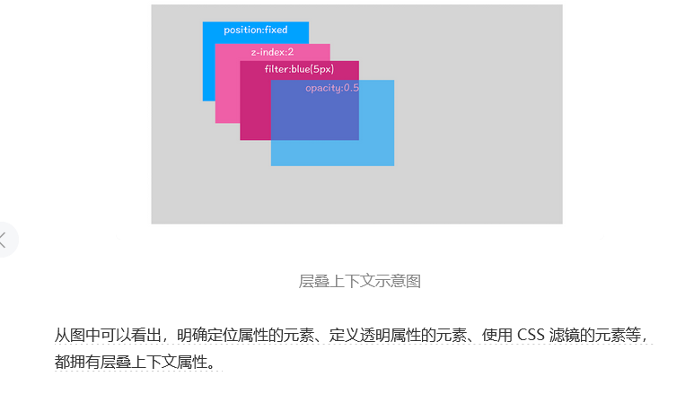
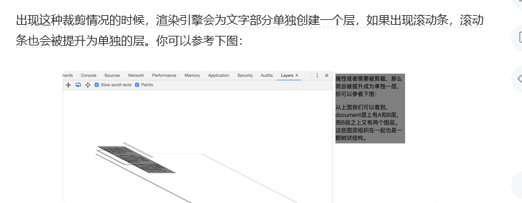
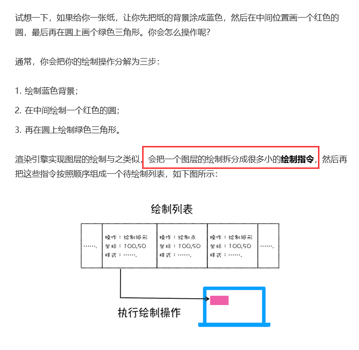
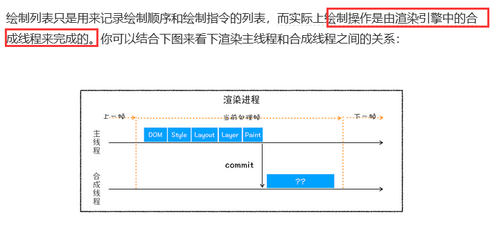
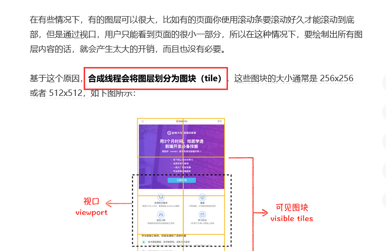
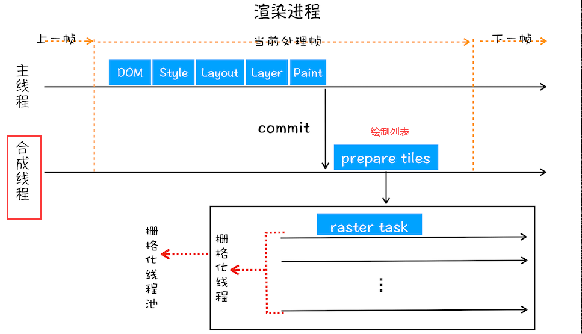
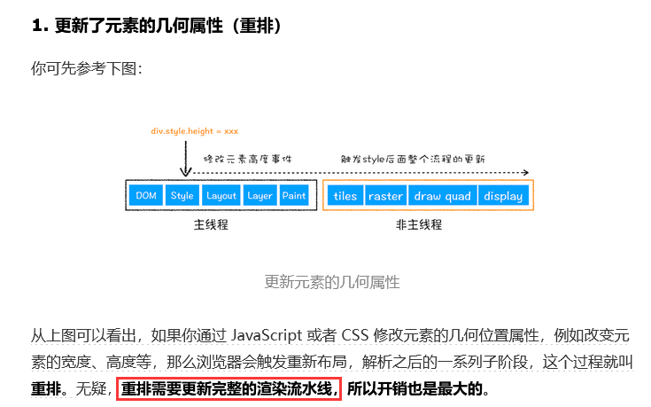
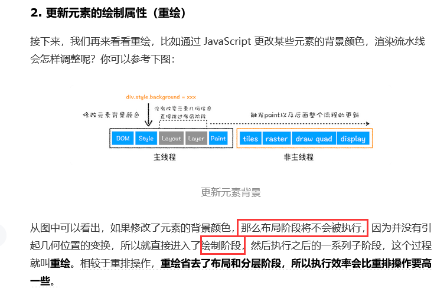
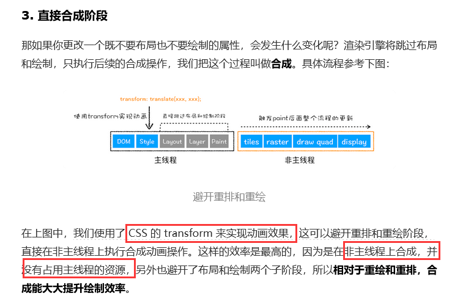

## 从用户输入URL到显示网页，经过了什么？

## 网络部分

- 输入url按下回车之后，浏览器会`判断url是否合法`，不合法的话会用浏览器的搜索引擎进行搜索，否则就下一步
- 会先在本地的`强缓存`中进行查找，如果查找到了缓存并且`没有过期`，就直接复用
- 如果没找到强缓存，就进行DNS解析，与服务器进行TCP三次握手，进行`连接`
- 建立连接之后开启`协商缓存`，发送请求。
- 会先判断请求中有没有携带`if-none-match`信息，如果有，就与服务器对应资源的`etag`值进行对比，如果命中就返回`304状态码`，让浏览器在本地缓存中获取，如果没有命中，进入下一步
- 再判断请求中有没有携带`if-modified-since`信息，如果有，就与服务器对应资源的`last-modified`值进行对比，如果命中就返回`304状态码`，让浏览器在本地缓存中获取，如果没有命中，就返回`200状态码和对应的资源`
- 进行TCP四次挥手，`断开连接`

## 浏览器渲染部分

- 因为浏览器是`无法直接识别HTML字节流`的，所以会`开启渲染进程`，与网络进程之间建立管道，将网络进程中的HTML字节流传送给渲染进程。渲染进程内部的`HTML解析器`会将HTML字节流解析成浏览器能够识别的`dom树结构`
- 浏览器也是`无法直接识别css`的，所以也将css转化成浏览器能够识别的`styleSheets数据`（可以通过document.styleSheets查看），并且`计算dom树每个结点的样式值`
- 现在我们有了所有的dom，但是还需要对dom的`位置`进行计算，生成对应的`布局树`
- 因为浏览器页面是由很多个`图层`结合的，所以还要将布局树进行分层，将需要分层的结点抽离`形成分层树`
- 渲染进程会将分层树的每一层的渲染过程存入`绘制列表`中（渲染列表就是`一个个的绘制指令`），然后将绘制列表告诉`合成线程`
- 因为有的图层可能很长，一次性解析全部图层会造成性能浪费，所以合成线程会将`图层分为一个个的图块`，并且优先将`离视口近`的图块经过`光栅化操作转成位图`。
- 合成线程完所有图块的光栅化之后，会给浏览器进程`发送绘制图块指令DrawQuad`，浏览器就会根据这个DrawQuad指令生成页面了

## 详细说明

浏览器获取到html文件之后就开始解析，遇到script标签就去下载js，link标签就下载css，浏览器是不能直接解析HTML数据的，所以解析**第一步**是需要将它转换成浏览器能理解的DOM树结构，生成DOM树之后根据CSS样式表计算出DOM树中所有节点的样式，最后**计算DOM元素的布局信息**，使其都保存在布局树中，然后绘制到浏览器页面上。因为js代码会停止解析HTML（因为接下来的 JavaScript **可能要修改当前已经生成的 DOM 结构**），所以要将script标签尽量放在末尾，

- 在HTML页面提交给渲染引擎，渲染引擎会将HTML**解析成dom树**
- 将css转化成浏览器可以理解的styleSheets，计算出所有dom树节点的样式
- 创建布局树，计算出所有节点的位置，保存在**布局树**中
- 网页其实是由一个个**图层构成**的，对布局树**进行分层**，生成分层树

浏览器的页面实际上被分成了很多图层，这些**图层叠加后合成了最终的页面**

通常情况下，浏览器并不会为每一个节点都创建一个图层。只有满足以下特定条件才会将节点提升为单独的一层

**拥有层叠上下文属性的元素（会给html元素三维的概念）**

**固定div，内容被裁剪隐藏的元素**

- 为每个图层**生成绘制列表**，提交给合成线程

完成图层树的构建后，**渲染引擎**会对图层树中的每个图层进行**绘制**，进行绘制之前会生成**绘制列表**，绘制列表其实是一个个小的**绘制指令的集合**

- 当图层的**绘制列表**准备好之后，主线程会把该绘制列表提交（commit）给合成线程，合成线程将图层分成图块，在**光栅化**线程池中将**图块转化成位图**

主线程将图层绘制列表交给合成线程之后

首先将**图层分为一个个图块**，合成线程会按照视口附近的图块优先生成位图。

生成位图的操作是由**栅格化线程**来执行的，

- 一旦所有图块都被光栅化，合成线程发送**绘制图块指令DrawQuad**给浏览器进程，浏览器进程就会根据**DrawQuad**消息生成页面

## 重排和重绘

重拍会经过完整的渲染流水线，性能开销大

重绘不需要经过布局树和分层树的生成，只需要重新进入绘制阶段即可

合成操作是在非主线程中执行的，效率也更高（transform）

