## 虚拟dom

虚拟dom其实是对dom树结构的一种抽象表示方式，本质上就是一个js对象，里面保存了tag，props，和children。虚拟dom`最大的优势是易于实现跨平台`，只要针对不同的平台去编写不同的虚拟dom解析器，就可以生成对应平台的内容。

`虚拟dom+diff算法结合能高效地更新dom`，具体流程是，在更新了数据之后，组件会备份旧的vnode和新的vnode作`patch操作`。

如果发现他们的key和tag相同就认为他们是`同一个vnode`，进行`patchVnode更新操作`，否则就创建新的dom进行替换。

在patchVnode的时候，会对两个vnode对象的属性以及children进行更新，如果`两个vnode的children都为vnode数组`的话，就进行`updateChildren`方法更新children。

updateChildren方法内部维护了`双指针`，通过while循环分别进行五步判断（`新前旧前、新后旧后、新后旧前、新前旧后、都不命中`）来对数组中的结点进行更新，插入，删除等操作

------

Virtual Dom是一个JavaScript对象，通过对象的方式来表示DOM结构。将**页面的状态抽象为JS对象的形式**，配合不同的渲染工具，**使跨平台**渲染成为可能

在每次数据发生变化前，虚拟DOM都会缓存一份，变化之时，现在的虚拟DOM会与缓存的虚拟DOM进行比较。在vue内部封装了diff算法，通过这个算法来进行比较，**渲染时修改改变的虚拟dom结点**，原先没有发生改变的通过原先的数据进行渲染。

## diff对比流程

先判断oldVnode是不是一个虚拟dom，如果不是虚拟dom就会创建一个**空的vnode并且关联一个dom元素**

如果key和tag相同，说明是**相同的vnode**，他通过patchVnode**进行更新**，否则就会**创建一个新的dom元素，移除老的dom元素**

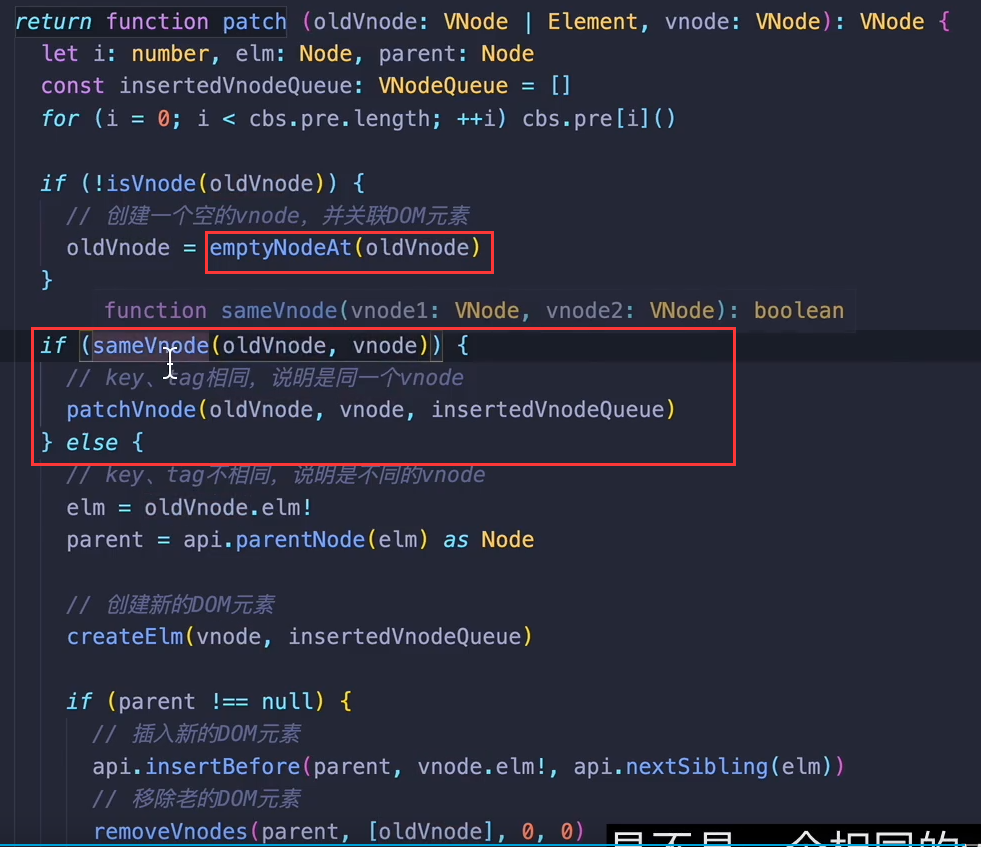

## **patchVnode更新vnode操作**

patchVnode更新vnode的时候，如果**newV和oldV是完全一样的，就return**，否则就进行属性和children的更新，children的更新又分为好多种情况

- 新旧结点的children都是text
  - 一样就不作操作，不一样就修改旧的text
- 新结点的children是text，旧结点的children是vnode数组
  - 移除掉旧的结点，替换为text
- 新节点的children是vnode数组旧结点的children是text
  - 先清空旧结点，然后将新节点的vnode的children挂载到旧结点上
- 新旧结点的children都是vnode数组
  - 进行**updateChildren操作**

## **当两个结点的children都是vnode数组时，updateChildren更新children**

采用双指针的设计，新节点的vnode数组分别对应了两个指针：新前，新后，旧结点的vnode数组也是如此，然后进行while循环依次进行下面五步的判断

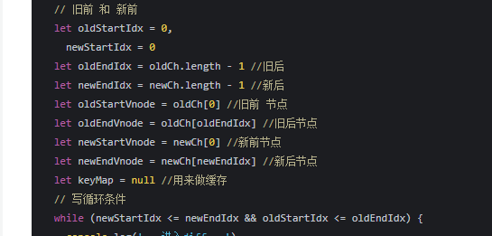

- 新前和旧前是同一结点，那么新前和旧前对应的结点进行patchVnode操作，并且两个指针加一

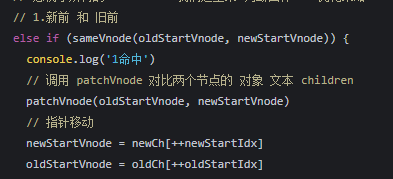

- 新后和旧后是同一节点，那么进行patchVnode操作，两个指针减一

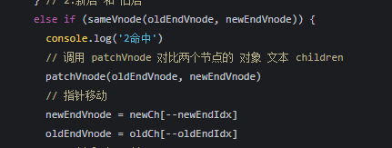

- 新后和旧前是同一结点，那么进行patchVnode操作，并且**将旧前结点移动到旧后结点的后面**，新后减一，旧前加一

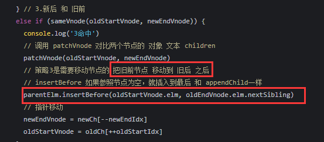

- 新前和旧后是同一节点，那么进行patchVnode操作，并且**将旧后结点移动到旧前结点的前面**，新前加一，旧后减一

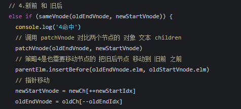

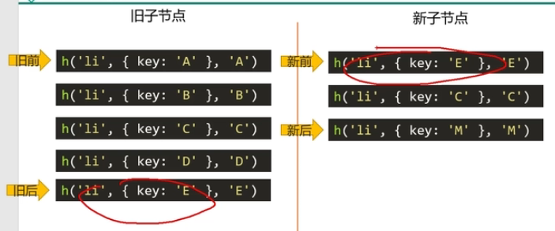

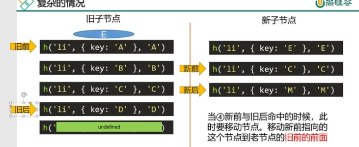

- 在所有旧结点中判断有没有新前结点

  - 有，进行patchVnode操作，将对应的旧结点移动到旧前结点的前面

  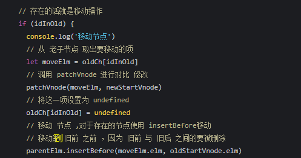

  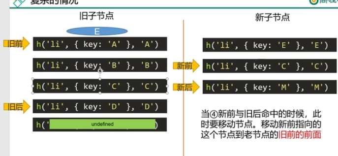

  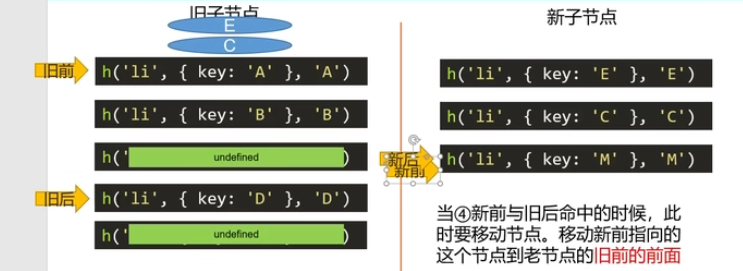

  - 无，创建新前结点插入到旧前结点的前面

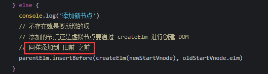

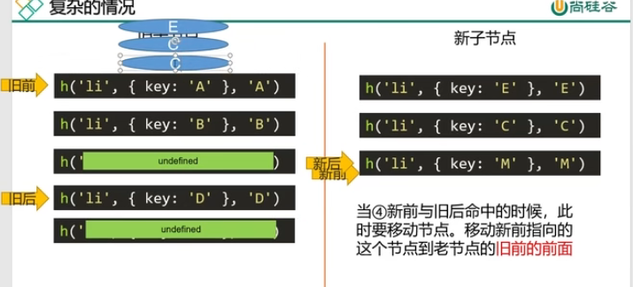

## 为什么v-for需要加一个key？

这涉及到了虚拟dom的diff算法。假如现在有两个v-for渲染生成的列表，加了key之后，在列表改变重新渲染的时候，因为先后的列表是同一个vnode结点，所以对他们进行`patchVnode`操作。

patchVnode的时候又会因为新旧列表的children是vnode数组进行`updateChildren`操作。

在updateChildren里面是用于更新子节点变化的，里面封装了双指针进行循环，对新旧children进行更新。在循环的过程中会有五步判断，都是为了判断对应指针的新旧结点是不是同一结点的，如果加了key的话，在这一步，就`可以判断出新旧children里面有哪些共同的结点，只要对这些结点进行patchVnode更新`就可以了，但是如果不加key的话，即便内容没有改变，vue也`不会认为他们是可复用的相同结点`，就会重新`创建新的dom元素`并且插入，这样会相当消耗性能。