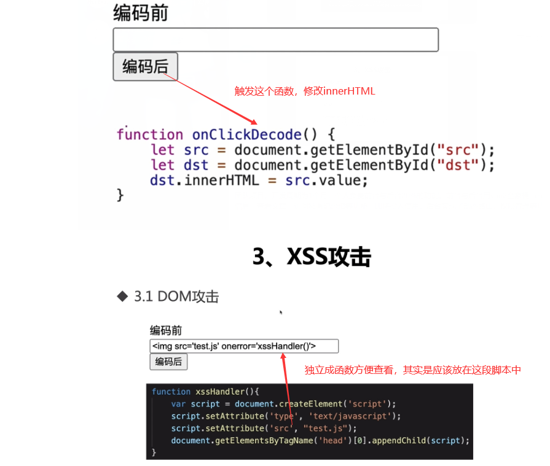
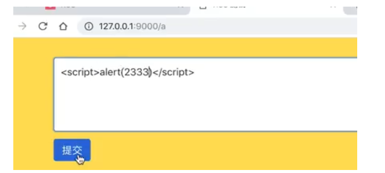
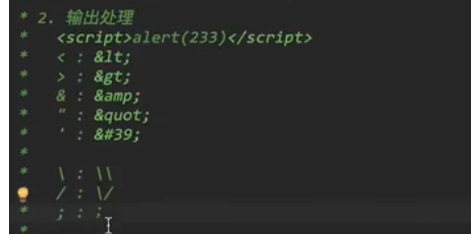
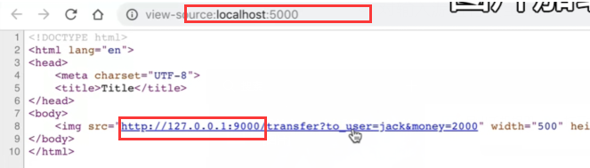

### XSS攻击

什么是XSS攻击？cross site script跨站脚本攻击

- xss攻击方式

  - DOM攻击，根据用户输入动态生成dom节点，如果没有对输入进行过滤，就会导致异常代码插入网页中执行

  

  - 存储型：将用户输入的恶意**js代码存入服务器**中，在用户下次访问页面的时候读取服务器中的信息，获取到这个恶意js代码并执行（一般会出现在评论网站中）

  

  

  - 反射型：**url中注入非法脚本传递给服务器**，服务器解析之后响应，将这段代码，**反射传给浏览器**，执行代码（一般浏览器会拦截这种行为），一般是通过邮件等发送这种地址，用户点击之后就可以达到攻击目的

- 存在的原因：对用户的url以及用户输入的内容没有进行过滤。不合法的内容能够进入web服务器，在用户再次访问的时候就可能会将对应的恶意代码请求过来并且执行，导致xss攻击

- 预防xss攻击的方法：

  - 对输入（和url参数）进行过滤（在后端列出不能出现的脚本**黑名单**，一旦出现了就删除，或者列出**白名单过滤**，列出可以接收的内容，比如规定用户名是6-10位字母数字下划线，其他任何输入都是非法的，会被丢弃，**对用户名密码这些可以进行白名单过滤，富文本编辑器用黑名单过滤**）

  

  - 对输出进行编码（大于号转成&gt这种，

  

  - 对cookie设置为http-only（js脚本就无法读取到cookie，即使无法获取，但是浏览器也能正常执行）

- nodejs用js-xss库进行过滤

### CSRF跨站请求伪造攻击

- 如何进行跨站？利用了html元素的**原生跨域能力：src属性**
- 如何伪造跨站请求？浏览器自动携带cookie
- CSRF攻击过程
  - 假如在登陆邮箱的时候，**登陆之后**通过cookie**保存用户登陆信息**，没有关闭这个页面，然后又打开了一个恶意的网页
  - 这个恶意的网站，可能会利用图片资源嵌入一些恶意的请求

- 本质是后端在验证的时候做的任务太少，**只是验证对应的session是否存在**

- 预防CSRF
  - 尽量使用**POS**T请求（get请求用img标签很容易被攻击）
  - **加入验证码**，提交请求的时候加入验证码，确保是用户行为而非黑客行为
  - 后端验证http的Referer字段（利用浏览器功能）**Referer保存了请求来源**
  - 在请求中传递token，这是一个唯一的值，token是存在服务端的，服务端通过拦截器验证有效性（**验证之后就要销毁，并且token是随机的，不可重复的**）。

